> BURSA TEKNİK ÜNİVERSİTESİ\
> MÜHENDİSLİK VE DOĞA BİLİMLERİ FAKÜLTESİBİLGİSAYAR MÜHENDİSLİĞİ BÖLÜMÜ

SEMİNER DERSİ PROJESİ

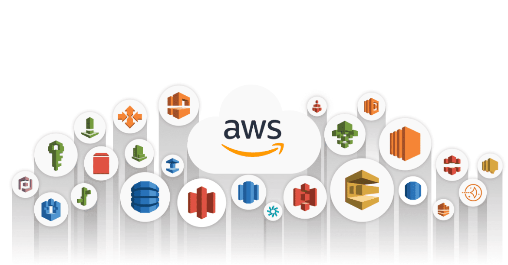{:width="6.11388779527559in" height="3.1972222222222224in"}

> AWS İLE BULUT BİLİŞİMİN TEMELLERİ

Fatih ES

(*develop.fatihes\@gmail.com*)

2021-2022 BAHAR DÖNEMİ

**ÖNSÖZ**

> Bulut bilişim bilgi işlem hizmetlerinin (sunucu, depolama, veri
> tabanı, ağ, yazılım,

analiz ve makine zekâsı dahil) internet üzerinden sağlanarak daha hızlı
inovasyon, esnek kaynaklar ve ekonomik ölçeklendirme sunulması anlamına
gelir. Bulut bilişim, işletmelerin BT kaynaklarına bakış açısını önemli
ölçüde değiştirmiştir. Günümüzde veri merkezlerinin yetersiz kalması,
esneklik kabiliyeti eksikliği, yüksek maliyetler gibi sebeplerden dolayı
kişiler bulut bilişime yönelmeye başlamıştır. Bu yoğun talep sonucunda
bulut bilişim hızlı bir şekilde popülerleşmiş ve bu doğrultuda kapsamlı
servisler sunmaya başlamıştır. Bulut bilişimin ne olduğunun tam olarak
kavranılamaması sebebi ve bu alanda Türkçe kaynak yetersizliğini giderme
amacı ile bu kılavuz hazırlanmıştır. Kılavuz boyunca bulut bilişimin
tarihi, gelişimi sürecindeki konseptler, bulut bilişim pazarında büyük
bir paya sahip olan Amazon Web Services bünyesinde sunulan hizmetlerin
tanımı ve bu hizmetlerden bazı önemli servislerin kullanımı hakkında
detaylı bilgi sunulmaktadır.

Fatih Es

Bursa 2022

2

**İÇİNDEKİLER**

ÖNSÖZ
\...\...\...\...\...\...\...\...\...\...\...\...\...\...\...\...\...\...\...\...\...\...\...\...\...\...\...\...\...\...\...\...\...\...\...\...\...\...\...\...\...\...\...\.....
2

İÇİNDEKİLER
\...\...\...\...\...\...\...\...\...\...\...\...\...\...\...\...\...\...\...\...\...\...\...\...\...\...\...\...\...\...\...\...\...\...\...\...\...\...\...\.....
3

ÖZET
\...\...\...\...\...\...\...\...\...\...\...\...\...\...\...\...\...\...\...\...\...\...\...\...\...\...\...\...\...\...\...\...\...\...\...\...\...\...\...\...\...\...\...\...\...
15

1.GENEL BİLGİLER
\...\...\...\...\...\...\...\...\...\...\...\...\...\...\...\...\...\...\...\...\...\...\...\...\...\...\...\...\...\...\...\...\...\...\...\.....
16

> 1.1.Giriş
> \...\...\...\...\...\...\...\...\...\...\...\...\...\...\...\...\...\...\...\...\...\...\...\...\...\...\...\...\...\...\...\...\...\...\...\...\...\...\...\...\...\.....
> 16
>
> 1.2. Sanallaştırma
> \...\...\...\...\...\...\...\...\...\...\...\...\...\...\...\...\...\...\...\...\...\...\...\...\...\...\...\...\...\...\...\...\...\...\...\...\.....
> 16
>
> 1.2.1. Sunucu-İstemci
> Modeli\...\...\...\...\...\...\...\...\...\...\...\...\...\...\...\...\...\...\...\...\...\...\...\...\...\...\...\...\...\....
> 16
>
> 1.2.2. Atıl Kapasite Sorunu
> \...\...\...\...\...\...\...\...\...\...\...\...\...\...\...\...\...\...\...\...\...\...\...\...\...\...\...\...\...\...\....
> 17
>
> 1.2.3. Sanallaştırma Temelleri
> \...\...\...\...\...\...\...\...\...\...\...\...\...\...\...\...\...\...\...\...\...\...\...\...\...\...\...\...\...\...
> 17
>
> 1.2.4. Bilişim Altyapısı Oluşturma
> \...\...\...\...\...\...\...\...\...\...\...\...\...\...\...\...\...\...\...\...\...\...\...\...\...\...\.....
> 18
>
> 1.3. IaaS, PaaS, SaaS
> \...\...\...\...\...\...\...\...\...\...\...\...\...\...\...\...\...\...\...\...\...\...\...\...\...\...\...\...\...\...\...\...\...\...\...\...
> 19
>
> 1.3.1. Alt Yapının Servis Olarak Sunulması (Infrastructure as a
> Service-IaaS) \...\...\...\..... 19
>
> 1.3.2. Platformun Servis Olarak Sunulması (Platform as a Service-PaaS)
> \...\...\...\...\...\...\.... 19
>
> 1.3.3. Yazılımın Servis Olarak Sunulması (Software as a Service-SaaS)
> \...\...\...\...\...\...\...\... 19
>
> 1.3.4. Bulut Bilişim Konseptlerinin Farkları
> \...\...\...\...\...\...\...\...\...\...\...\...\...\...\...\...\...\...\...\...\...\.....
> 20
>
> 1.4. Yazılım Geliştirme Döngüsü
> \...\...\...\...\...\...\...\...\...\...\...\...\...\...\...\...\...\...\...\...\...\...\...\...\...\...\...\...\.....
> 20
>
> 1.5. DevOps
> \...\...\...\...\...\...\...\...\...\...\...\...\...\...\...\...\...\...\...\...\...\...\...\...\...\...\...\...\...\...\...\...\...\...\...\...\...\...\...\.....
> 21
>
> 1.6. Mikro Servis Mimarisi
> \...\...\...\...\...\...\...\...\...\...\...\...\...\...\...\...\...\...\...\...\...\...\...\...\...\...\...\...\...\...\...\.....
> 22
>
> 1.7. API (Application Programming Interface)
> \...\...\...\...\...\...\...\...\...\...\...\...\...\...\...\...\...\...\...\...\...\.....
> 23
>
> 1.8. Container
> (Konteyner)\...\...\...\...\...\...\...\...\...\...\...\...\...\...\...\...\...\...\...\...\...\...\...\...\...\...\...\...\...\...\...\...\...
> 23

2\. AMAZON WEB SERVİSLERİ (AWS)
\...\...\...\...\...\...\...\...\...\...\...\...\...\...\...\...\...\...\...\...\...\...\...\...\...\...
25

> 2.1. Amazon Web Servislerinin Tarihçesi
> \...\...\...\...\...\...\...\...\...\...\...\...\...\...\...\...\...\...\...\...\...\...\...\...\...
> 25
>
> 2.2. AWS Küresel Alt Yapısı
> \...\...\...\...\...\...\...\...\...\...\...\...\...\...\...\...\...\...\...\...\...\...\...\...\...\...\...\...\...\...\.....
> 25
>
> 2.2.1. Bölgeler
> \...\...\...\...\...\...\...\...\...\...\...\...\...\...\...\...\...\...\...\...\...\...\...\...\...\...\...\...\...\...\...\...\...\...\...\...\...\...
> 25
>
> 2.2.2. Erişilebilirlik Alanları
> \...\...\...\...\...\...\...\...\...\...\...\...\...\...\...\...\...\...\...\...\...\...\...\...\...\...\...\...\...\...\...
> 26
>
> 2.2.3. AWS Yerel Alanları
> \...\...\...\...\...\...\...\...\...\...\...\...\...\...\...\...\...\...\...\...\...\...\...\...\...\...\...\...\...\...\.....
> 26
>
> 2.2.4. AWS Wavelength
> \...\...\...\...\...\...\...\...\...\...\...\...\...\...\...\...\...\...\...\...\...\...\...\...\...\...\...\...\...\...\...\...\...
> 26
>
> 2.2.5. AWS Outposts
> \...\...\...\...\...\...\...\...\...\...\...\...\...\...\...\...\...\...\...\...\...\...\...\...\...\...\...\...\...\...\...\...\...\.....
> 27
>
> 2.2.6. AWS Küresel Alt Yapı Haritası
> \...\...\...\...\...\...\...\...\...\...\...\...\...\...\...\...\...\...\...\...\...\...\...\...\.....
> 27
>
> 2.3. AWS Yönetim Konsolu
> \...\...\...\...\...\...\...\...\...\...\...\...\...\...\...\...\...\...\...\...\...\...\...\...\...\...\...\...\...\...\...\...
> 28

3\. AWS HİZMETLERİ
\...\...\...\...\...\...\...\...\...\...\...\...\...\...\...\...\...\...\...\...\...\...\...\...\...\...\...\...\...\...\...\...\...\...\...\...
30

> 3.1. Analiz Servisleri
> \...\...\...\...\...\...\...\...\...\...\...\...\...\...\...\...\...\...\...\...\...\...\...\...\...\...\...\...\...\...\...\...\...\...\...\...
> 30

3

> 3.1.1. Amazon Athena
> \...\...\...\...\...\...\...\...\...\...\...\...\...\...\...\...\...\...\...\...\...\...\...\...\...\...\...\...\...\...\...\...\...\...
> 30
>
> 3.1.2. Amazon CloudSearch,
> \...\...\...\...\...\...\...\...\...\...\...\...\...\...\...\...\...\...\...\...\...\...\...\...\...\...\...\...\...\.....
> 30
>
> 3.1.3. Amazon EMR (Elastic Map Reduce)
> \...\...\...\...\...\...\...\...\...\...\...\...\...\...\...\...\...\...\...\...\...\...\...
> 30
>
> 3.1.4. Amazon FinSpace
> \...\...\...\...\...\...\...\...\...\...\...\...\...\...\...\...\...\...\...\...\...\...\...\...\...\...\...\...\...\...\...\...\...
> 30
>
> 3.1.5. Amazon Kinesis
> \...\...\...\...\...\...\...\...\...\...\...\...\...\...\...\...\...\...\...\...\...\...\...\...\...\...\...\...\...\...\...\...\...\...
> 31
>
> 3.1.6. Amazon Managed Streaming for Apache Kafka (MSK)
> \...\...\...\...\...\...\...\...\...\...\...\...\... 31
>
> 3.1.7. Amazon OpenSearch Service
> \...\...\...\...\...\...\...\...\...\...\...\...\...\...\...\...\...\...\...\...\...\...\...\...\...\...\...
> 31
>
> 3.1.8. Amazon QuickSight
> \...\...\...\...\...\...\...\...\...\...\...\...\...\...\...\...\...\...\...\...\...\...\...\...\...\...\...\...\...\...\.....
> 32
>
> 3.1.9. Amazon RedShift
> \...\...\...\...\...\...\...\...\...\...\...\...\...\...\...\...\...\...\...\...\...\...\...\...\...\...\...\...\...\...\...\...\...
> 32
>
> 3.1.10. AWS Data Exchange
> \...\...\...\...\...\...\...\...\...\...\...\...\...\...\...\...\...\...\...\...\...\...\...\...\...\...\...\...\...\.....
> 32
>
> 3.1.11. AWS Data Pipeline
> \...\...\...\...\...\...\...\...\...\...\...\...\...\...\...\...\...\...\...\...\...\...\...\...\...\...\...\...\...\...\.....
> 32
>
> 3.1.12. AWS
> Glue\...\...\...\...\...\...\...\...\...\...\...\...\...\...\...\...\...\...\...\...\...\...\...\...\...\...\...\...\...\...\...\...\...\...\...\....
> 33
>
> 3.1.13. AWS Lake Formation
> \...\...\...\...\...\...\...\...\...\...\...\...\...\...\...\...\...\...\...\...\...\...\...\...\...\...\...\...\...\....
> 33
>
> 3.2. AR ve VR Servisleri
> \...\...\...\...\...\...\...\...\...\...\...\...\...\...\...\...\...\...\...\...\...\...\...\...\...\...\...\...\...\...\...\...\...\...
> 34
>
> 3.2.1. Amazon Sumerian
> \...\...\...\...\...\...\...\...\...\...\...\...\...\...\...\...\...\...\...\...\...\...\...\...\...\...\...\...\...\...\...\.....
> 34
>
> 3.3. Ağ İletişimi ve İçerik Teslimi Servisleri
> \...\...\...\...\...\...\...\...\...\...\...\...\...\...\...\...\...\...\...\...\...\...\.....
> 34
>
> 3.3.1. Amazon CloudFront
> \...\...\...\...\...\...\...\...\...\...\...\...\...\...\...\...\...\...\...\...\...\...\...\...\...\...\...\...\...\...\.....
> 34
>
> 3.3.2. Amazon Route 53
> \...\...\...\...\...\...\...\...\...\...\...\...\...\...\...\...\...\...\...\...\...\...\...\...\...\...\...\...\...\...\...\...\...
> 34
>
> 3.3.3. Amazon Virtual Private Cloud -- VPC (Sanal Özel Bulut)
> \...\...\...\...\...\...\...\...\...\...\...\... 35
>
> 3.3.4. AWS App
> Mesh\...\...\...\...\...\...\...\...\...\...\...\...\...\...\...\...\...\...\...\...\...\...\...\...\...\...\...\...\...\...\...\...\...\...
> 35
>
> 3.3.5. AWS Cloud Map
> \...\...\...\...\...\...\...\...\...\...\...\...\...\...\...\...\...\...\...\...\...\...\...\...\...\...\...\...\...\...\...\...\....
> 35
>
> 3.3.6. AWS Cloud WAN
> \...\...\...\...\...\...\...\...\...\...\...\...\...\...\...\...\...\...\...\...\...\...\...\...\...\...\...\...\...\...\...\.....
> 36
>
> 3.3.7. AWS Direct Connect
> \...\...\...\...\...\...\...\...\...\...\...\...\...\...\...\...\...\...\...\...\...\...\...\...\...\...\...\...\...\...\....
> 36
>
> 3.3.8. AWS Global Accelerator
> \...\...\...\...\...\...\...\...\...\...\...\...\...\...\...\...\...\...\...\...\...\...\...\...\...\...\...\...\....
> 36
>
> 3.3.9. AWS Private 5G
> \...\...\...\...\...\...\...\...\...\...\...\...\...\...\...\...\...\...\...\...\...\...\...\...\...\...\...\...\...\...\...\...\.....
> 36
>
> 3.3.10. AWS PrivateLink
> \...\...\...\...\...\...\...\...\...\...\...\...\...\...\...\...\...\...\...\...\...\...\...\...\...\...\...\...\...\...\...\....
> 37
>
> 3.3.11. AWS Transit Gateway
> \...\...\...\...\...\...\...\...\...\...\...\...\...\...\...\...\...\...\...\...\...\...\...\...\...\...\...\...\...\...
> 37
>
> 3.3.12. AWS VPN
> \...\...\...\...\...\...\...\...\...\...\...\...\...\...\...\...\...\...\...\...\...\...\...\...\...\...\...\...\...\...\...\...\...\...\...\...
> 37
>
> 3.3.13. Elastic Load Balancing (ELB)
> \...\...\...\...\...\...\...\...\...\...\...\...\...\...\...\...\...\...\...\...\...\...\...\...\...\...
> 37
>
> 3.4. Block Zinciri Servisleri
> \...\...\...\...\...\...\...\...\...\...\...\...\...\...\...\...\...\...\...\...\...\...\...\...\...\...\...\...\...\...\...\....
> 38
>
> 3.4.1. Amazon Managed Blockchain
> \...\...\...\...\...\...\...\...\...\...\...\...\...\...\...\...\...\...\...\...\...\...\...\...\...\.....
> 38
>
> 3.4.2. Amazon Quantum Ledger Database (Amazon QLDB)
> \...\...\...\...\...\...\...\...\...\...\...\...\...\... 38
>
> 3.5. Bulut Finansal Yönetim Servisleri
> \...\...\...\...\...\...\...\...\...\...\...\...\...\...\...\...\...\...\...\...\...\...\...\...\...\.....
> 38
>
> 3.5.1. AWS Budgets
> \...\...\...\...\...\...\...\...\...\...\...\...\...\...\...\...\...\...\...\...\...\...\...\...\...\...\...\...\...\...\...\...\...\...\...
> 38
>
> 3.5.2. AWS Cost and Usage Report (CUR)
> \...\...\...\...\...\...\...\...\...\...\...\...\...\...\...\...\...\...\...\...\...\...\...
> 39

4

> 3.5.3. AWS Cost Explorer
> \...\...\...\...\...\...\...\...\...\...\...\...\...\...\...\...\...\...\...\...\...\...\...\...\...\...\...\...\...\...\...\...
> 39
>
> 3.5.4. Rezerve Edilmiş Bulut Sunucusu (RI) Raporlama
> \...\...\...\...\...\...\...\...\...\...\...\...\...\...\...\.... 39
>
> 3.5.5. Savings Plans
> \...\...\...\...\...\...\...\...\...\...\...\...\...\...\...\...\...\...\...\...\...\...\...\...\...\...\...\...\...\...\...\...\...\...\....
> 39
>
> 3.6. Container Servisleri
> \...\...\...\...\...\...\...\...\...\...\...\...\...\...\...\...\...\...\...\...\...\...\...\...\...\...\...\...\...\...\...\...\...\....
> 40
>
> 3.6.1. Amazon Elastic Container Registry (Amazon ECR)
> \...\...\...\...\...\...\...\...\...\...\...\...\...\...\... 40
>
> 3.6.2. Amazon Elastic Container Service (Amazon ECS)
> \...\...\...\...\...\...\...\...\...\...\...\...\...\...\..... 40
>
> 3.6.3. Amazon Elastic Kubernetes Service (EKS)
> \...\...\...\...\...\...\...\...\...\...\...\...\...\...\...\...\...\...\.....
> 40
>
> 3.6.4. AWS Copilot
> \...\...\...\...\...\...\...\...\...\...\...\...\...\...\...\...\...\...\...\...\...\...\...\...\...\...\...\...\...\...\...\...\...\...\....
> 40
>
> 3.6.5. AWS Fargate
> \...\...\...\...\...\...\...\...\...\...\...\...\...\...\...\...\...\...\...\...\...\...\...\...\...\...\...\...\...\...\...\...\...\...\....
> 40
>
> 3.6.6. Red Hat OpenShift Service on AWS
> \...\...\...\...\...\...\...\...\...\...\...\...\...\...\...\...\...\...\...\...\...\...\....
> 41
>
> 3.7. Depolama Servisleri
> \...\...\...\...\...\...\...\...\...\...\...\...\...\...\...\...\...\...\...\...\...\...\...\...\...\...\...\...\...\...\...\...\...\...
> 41
>
> 3.7.1. Amazon Elastic Block Store (EBS)
> \...\...\...\...\...\...\...\...\...\...\...\...\...\...\...\...\...\...\...\...\...\...\...\...
> 41
>
> 3.7.2. Amazon Elastic File System (EFS)
> \...\...\...\...\...\...\...\...\...\...\...\...\...\...\...\...\...\...\...\...\...\...\...\...
> 41
>
> 3.7.3. Amazon FSx
> \...\...\...\...\...\...\...\...\...\...\...\...\...\...\...\...\...\...\...\...\...\...\...\...\...\...\...\...\...\...\...\...\...\...\.....
> 41
>
> 3.7.4. Amazon S3 Glacier
> \...\...\...\...\...\...\...\...\...\...\...\...\...\...\...\...\...\...\...\...\...\...\...\...\...\...\...\...\...\...\...\....
> 42
>
> 3.7.5. Amazon Simple Storage Service (S3)
> \...\...\...\...\...\...\...\...\...\...\...\...\...\...\...\...\...\...\...\...\...\.....
> 42
>
> 3.7.6. AWS Backup
> \...\...\...\...\...\...\...\...\...\...\...\...\...\...\...\...\...\...\...\...\...\...\...\...\...\...\...\...\...\...\...\...\...\...\....
> 42
>
> 3.7.7. AWS Snow Family
> \...\...\...\...\...\...\...\...\...\...\...\...\...\...\...\...\...\...\...\...\...\...\...\...\...\...\...\...\...\...\...\....
> 42
>
> 3.7.8. AWS Storage Gateway
> \...\...\...\...\...\...\...\...\...\...\...\...\...\...\...\...\...\...\...\...\...\...\...\...\...\...\...\...\...\....
> 43
>
> 3.7.9. CloudEndure Disaster Recovery
> \...\...\...\...\...\...\...\...\...\...\...\...\...\...\...\...\...\...\...\...\...\...\...\...\....
> 43
>
> 3.8. Geliştirici Araçları Servisleri
> \...\...\...\...\...\...\...\...\...\...\...\...\...\...\...\...\...\...\...\...\...\...\...\...\...\...\...\...\....
> 43
>
> 3.8.1. Amazon Corretto
> \...\...\...\...\...\...\...\...\...\...\...\...\...\...\...\...\...\...\...\...\...\...\...\...\...\...\...\...\...\...\...\...\....
> 43
>
> 3.8.2. AWS Cloud Control API
> \...\...\...\...\...\...\...\...\...\...\...\...\...\...\...\...\...\...\...\...\...\...\...\...\...\...\...\...\....
> 43
>
> 3.8.3. AWS Cloud Development Kit
> \...\...\...\...\...\...\...\...\...\...\...\...\...\...\...\...\...\...\...\...\...\...\...\...\...\.....
> 43
>
> 3.8.4. AWS
> Cloud9\...\...\...\...\...\...\...\...\...\...\...\...\...\...\...\...\...\...\...\...\...\...\...\...\...\...\...\...\...\...\...\...\...\...\.....
> 44
>
> 3.8.5. AWS CloudShell
> \...\...\...\...\...\...\...\...\...\...\...\...\...\...\...\...\...\...\...\...\...\...\...\...\...\...\...\...\...\...\...\...\....
> 44
>
> 3.8.6. AWS CodeArtifact
> \...\...\...\...\...\...\...\...\...\...\...\...\...\...\...\...\...\...\...\...\...\...\...\...\...\...\...\...\...\...\...\....
> 44
>
> 3.8.7. AWS CodeBuild
> \...\...\...\...\...\...\...\...\...\...\...\...\...\...\...\...\...\...\...\...\...\...\...\...\...\...\...\...\...\...\...\...\.....
> 45
>
> 3.8.8. AWS CodeCommit
> \...\...\...\...\...\...\...\...\...\...\...\...\...\...\...\...\...\...\...\...\...\...\...\...\...\...\...\...\...\...\...\....
> 45
>
> 3.8.9. AWS CodeDeploy
> \...\...\...\...\...\...\...\...\...\...\...\...\...\...\...\...\...\...\...\...\...\...\...\...\...\...\...\...\...\...\...\.....
> 45
>
> 3.8.10. AWS CodePipeline
> \...\...\...\...\...\...\...\...\...\...\...\...\...\...\...\...\...\...\...\...\...\...\...\...\...\...\...\...\...\...\.....
> 45
>
> 3.8.11. AWS CodeStar
> \...\...\...\...\...\...\...\...\...\...\...\...\...\...\...\...\...\...\...\...\...\...\...\...\...\...\...\...\...\...\...\...\.....
> 46
>
> 3.8.12. AWS Command Line Interface (CLI)
> \...\...\...\...\...\...\...\...\...\...\...\...\...\...\...\...\...\...\...\...\...\...
> 46
>
> 3.8.13. AWS Fault Injection Simulator
> \...\...\...\...\...\...\...\...\...\...\...\...\...\...\...\...\...\...\...\...\...\...\...\...\....
> 46
>
> 3.8.14. AWS X-Ray
> \...\...\...\...\...\...\...\...\...\...\...\...\...\...\...\...\...\...\...\...\...\...\...\...\...\...\...\...\...\...\...\...\...\...\....
> 46

5

> 3.9. Geçiş ve Aktarım Servisleri
> \...\...\...\...\...\...\...\...\...\...\...\...\...\...\...\...\...\...\...\...\...\...\...\...\...\...\...\...\...\...
> 47
>
> 3.9.1. AWS Application Discovery Service
> \...\...\...\...\...\...\...\...\...\...\...\...\...\...\...\...\...\...\...\...\...\...\...
> 47
>
> 3.9.2. AWS Database Migration Service
> \...\...\...\...\...\...\...\...\...\...\...\...\...\...\...\...\...\...\...\...\...\...\...\.....
> 47
>
> 3.9.3. AWS DataSync
> \...\...\...\...\...\...\...\...\...\...\...\...\...\...\...\...\...\...\...\...\...\...\...\...\...\...\...\...\...\...\...\...\...\....
> 47
>
> 3.9.4. AWS Mainframe Modernization
> \...\...\...\...\...\...\...\...\...\...\...\...\...\...\...\...\...\...\...\...\...\...\...\...\....
> 48
>
> 3.9.5. AWS Migration Hub
> \...\...\...\...\...\...\...\...\...\...\...\...\...\...\...\...\...\...\...\...\...\...\...\...\...\...\...\...\...\...\....
> 48
>
> 3.9.6. AWS Server Migration Service
> \...\...\...\...\...\...\...\...\...\...\...\...\...\...\...\...\...\...\...\...\...\...\...\...\...\...
> 48
>
> 3.9.7. AWS Transfer Family
> \...\...\...\...\...\...\...\...\...\...\...\...\...\...\...\...\...\...\...\...\...\...\...\...\...\...\...\...\...\.....
> 48
>
> 3.9.8. AWS Application Migration Service
> \...\...\...\...\...\...\...\...\...\...\...\...\...\...\...\...\...\...\...\...\...\...\...
> 48
>
> 3.9.9. Migration Evaluator
> \...\...\...\...\...\...\...\...\...\...\...\...\...\...\...\...\...\...\...\...\...\...\...\...\...\...\...\...\...\...\...\...
> 49
>
> 3.10. Güvenlik, Kimlik ve Uygunluk Servisleri
> \...\...\...\...\...\...\...\...\...\...\...\...\...\...\...\...\...\...\...\...\...\...
> 49
>
> 3.10.1. Amazon Cognito
> \...\...\...\...\...\...\...\...\...\...\...\...\...\...\...\...\...\...\...\...\...\...\...\...\...\...\...\...\...\...\...\...\...
> 49
>
> 3.10.2. Amazon Detective
> \...\...\...\...\...\...\...\...\...\...\...\...\...\...\...\...\...\...\...\...\...\...\...\...\...\...\...\...\...\...\...\...
> 49
>
> 3.10.3. Amazon GuardDuty
> \...\...\...\...\...\...\...\...\...\...\...\...\...\...\...\...\...\...\...\...\...\...\...\...\...\...\...\...\...\...\....
> 50
>
> 3.10.4. Amazon Inspector
> \...\...\...\...\...\...\...\...\...\...\...\...\...\...\...\...\...\...\...\...\...\...\...\...\...\...\...\...\...\...\...\....
> 50
>
> 3.10.5. Amazon Macie
> \...\...\...\...\...\...\...\...\...\...\...\...\...\...\...\...\...\...\...\...\...\...\...\...\...\...\...\...\...\...\...\...\...\...
> 50
>
> 3.10.6. AWS Artifact
> \...\...\...\...\...\...\...\...\...\...\...\...\...\...\...\...\...\...\...\...\...\...\...\...\...\...\...\...\...\...\...\...\...\.....
> 51
>
> 3.10.7. AWS Audit Manager
> \...\...\...\...\...\...\...\...\...\...\...\...\...\...\...\...\...\...\...\...\...\...\...\...\...\...\...\...\...\.....
> 51
>
> 3.10.8. AWS Certificate Manager (ACM)
> \...\...\...\...\...\...\...\...\...\...\...\...\...\...\...\...\...\...\...\...\...\...\.....
> 51
>
> 3.10.9. AWS CloudHSM
> \...\...\...\...\...\...\...\...\...\...\...\...\...\...\...\...\...\...\...\...\...\...\...\...\...\...\...\...\...\...\...\.....
> 52
>
> 3.10.10. AWS Directory Service
> \...\...\...\...\...\...\...\...\...\...\...\...\...\...\...\...\...\...\...\...\...\...\...\...\...\...\...\.....
> 52
>
> 3.10.11. AWS Firewall Manager
> \...\...\...\...\...\...\...\...\...\...\...\...\...\...\...\...\...\...\...\...\...\...\...\...\...\...\...\.....
> 52
>
> 3.10.12. AWS Identity and Access Management (IAM)
> \...\...\...\...\...\...\...\...\...\...\...\...\...\...\...\.... 53
>
> 3.10.13. AWS Key Management Service (AWS
> KMS)\...\...\...\...\...\...\...\...\...\...\...\...\...\...\...\...\...
> 53
>
> 3.10.14. AWS Network Firewall
> \...\...\...\...\...\...\...\...\...\...\...\...\...\...\...\...\...\...\...\...\...\...\...\...\...\...\...\.....
> 53
>
> 3.10.15. AWS Resource Access Manager
> \...\...\...\...\...\...\...\...\...\...\...\...\...\...\...\...\...\...\...\...\...\...\...\...
> 53
>
> 3.10.16. AWS Secrets Manager
> \...\...\...\...\...\...\...\...\...\...\...\...\...\...\...\...\...\...\...\...\...\...\...\...\...\...\...\...\....
> 54
>
> 3.10.17. AWS Security Hub
> \...\...\...\...\...\...\...\...\...\...\...\...\...\...\...\...\...\...\...\...\...\...\...\...\...\...\...\...\...\...\...
> 54
>
> 3.10.18. AWS Shield
> \...\...\...\...\...\...\...\...\...\...\...\...\...\...\...\...\...\...\...\...\...\...\...\...\...\...\...\...\...\...\...\...\...\.....
> 54
>
> 3.10.19. AWS Single
> Sign-On\...\...\...\...\...\...\...\...\...\...\...\...\...\...\...\...\...\...\...\...\...\...\...\...\...\...\...\...\...\...
> 55
>
> 3.10.20. AWS WAF -- Web Uygulaması Güvenlik
> Duvarı\...\...\...\...\...\...\...\...\...\...\...\...\...\...\.... 55
>
> 3.11. Kuantum Teknolojileri Servisleri
> \...\...\...\...\...\...\...\...\...\...\...\...\...\...\...\...\...\...\...\...\...\...\...\...\...\.....
> 56
>
> 3.11.1. Amazon Braket
> \...\...\...\...\...\...\...\...\...\...\...\...\...\...\...\...\...\...\...\...\...\...\...\...\...\...\...\...\...\...\...\...\.....
> 56
>
> 3.12. Makine Öğrenimi Servisleri
> \...\...\...\...\...\...\...\...\...\...\...\...\...\...\...\...\...\...\...\...\...\...\...\...\...\...\...\...\....
> 56
>
> 3.12.1. Amazon Augmented AI (Amazon A2I)
> \...\...\...\...\...\...\...\...\...\...\...\...\...\...\...\...\...\...\...\...\...
> 56

6

> 3.12.2. Amazon CodeGuru
> \...\...\...\...\...\...\...\...\...\...\...\...\...\...\...\...\...\...\...\...\...\...\...\...\...\...\...\...\...\...\.....
> 56
>
> 3.12.3. Amazon Comprehend
> \...\...\...\...\...\...\...\...\...\...\...\...\...\...\...\...\...\...\...\...\...\...\...\...\...\...\...\...\...\....
> 57
>
> 3.12.4. Amazon DevOps Guru
> \...\...\...\...\...\...\...\...\...\...\...\...\...\...\...\...\...\...\...\...\...\...\...\...\...\...\...\...\.....
> 57
>
> 3.12.5. Amazon Elastic Inference
> \...\...\...\...\...\...\...\...\...\...\...\...\...\...\...\...\...\...\...\...\...\...\...\...\...\...\...\....
> 57
>
> 3.12.6. Amazon Forecast
> \...\...\...\...\...\...\...\...\...\...\...\...\...\...\...\...\...\...\...\...\...\...\...\...\...\...\...\...\...\...\...\.....
> 58
>
> 3.12.7. Amazon Fraud Detector
> \...\...\...\...\...\...\...\...\...\...\...\...\...\...\...\...\...\...\...\...\...\...\...\...\...\...\...\...\....
> 58
>
> 3.12.8. Amazon HealthLake
> \...\...\...\...\...\...\...\...\...\...\...\...\...\...\...\...\...\...\...\...\...\...\...\...\...\...\...\...\...\...\...
> 58
>
> 3.12.9. Amazon Kendra
> \...\...\...\...\...\...\...\...\...\...\...\...\...\...\...\...\...\...\...\...\...\...\...\...\...\...\...\...\...\...\...\...\....
> 58
>
> 3.12.10. Amazon Lex
> \...\...\...\...\...\...\...\...\...\...\...\...\...\...\...\...\...\...\...\...\...\...\...\...\...\...\...\...\...\...\...\...\...\....
> 58
>
> 3.12.11. Amazon Lookout for Equipment
> \...\...\...\...\...\...\...\...\...\...\...\...\...\...\...\...\...\...\...\...\...\...\...\...
> 59
>
> 3.12.12. Amazon Lookout for Metrics
> \...\...\...\...\...\...\...\...\...\...\...\...\...\...\...\...\...\...\...\...\...\...\...\...\.....
> 59
>
> 3.12.13. Amazon Lookout for Vision
> \...\...\...\...\...\...\...\...\...\...\...\...\...\...\...\...\...\...\...\...\...\...\...\...\...\....
> 59
>
> 3.12.14. Amazon
> Monitron\...\...\...\...\...\...\...\...\...\...\...\...\...\...\...\...\...\...\...\...\...\...\...\...\...\...\...\...\...\...\.....
> 59
>
> 3.12.15. Amazon Personalize
> \...\...\...\...\...\...\...\...\...\...\...\...\...\...\...\...\...\...\...\...\...\...\...\...\...\...\...\...\...\....
> 60
>
> 3.12.16. Amazon Polly
> \...\...\...\...\...\...\...\...\...\...\...\...\...\...\...\...\...\...\...\...\...\...\...\...\...\...\...\...\...\...\...\...\.....
> 60
>
> 3.12.17. Amazon Rekognition
> \...\...\...\...\...\...\...\...\...\...\...\...\...\...\...\...\...\...\...\...\...\...\...\...\...\...\...\...\...\...
> 60
>
> 3.12.18. Amazon SageMaker
> \...\...\...\...\...\...\...\...\...\...\...\...\...\...\...\...\...\...\...\...\...\...\...\...\...\...\...\...\...\....
> 60
>
> 3.12.19. Amazon SageMaker Data Labeling
> \...\...\...\...\...\...\...\...\...\...\...\...\...\...\...\...\...\...\...\...\...\.....
> 61
>
> 3.12.20. Amazon Textract
> \...\...\...\...\...\...\...\...\...\...\...\...\...\...\...\...\...\...\...\...\...\...\...\...\...\...\...\...\...\...\...\...
> 61
>
> 3.12.21. Amazon Transcribe
> \...\...\...\...\...\...\...\...\...\...\...\...\...\...\...\...\...\...\...\...\...\...\...\...\...\...\...\...\...\...\...
> 61
>
> 3.12.22. Amazon Translate
> \...\...\...\...\...\...\...\...\...\...\...\...\...\...\...\...\...\...\...\...\...\...\...\...\...\...\...\...\...\...\.....
> 61
>
> 3.12.23. Apache MXNet on AWS
> \...\...\...\...\...\...\...\...\...\...\...\...\...\...\...\...\...\...\...\...\...\...\...\...\...\...\...\...
> 62
>
> 3.12.24. AWS Deep Learning AMI\'leri
> \...\...\...\...\...\...\...\...\...\...\...\...\...\...\...\...\...\...\...\...\...\...\...\...\....
> 62
>
> 3.12.25. AWS Deep Learning Containers
> \...\...\...\...\...\...\...\...\...\...\...\...\...\...\...\...\...\...\...\...\...\...\...\...
> 62
>
> 3.12.26. AWS DeepComposer
> \...\...\...\...\...\...\...\...\...\...\...\...\...\...\...\...\...\...\...\...\...\...\...\...\...\...\...\...\.....
> 63
>
> 3.12.27. AWS DeepLens
> \...\...\...\...\...\...\...\...\...\...\...\...\...\...\...\...\...\...\...\...\...\...\...\...\...\...\...\...\...\...\...\.....
> 63
>
> 3.12.28. AWS DeepRacer
> \...\...\...\...\...\...\...\...\...\...\...\...\...\...\...\...\...\...\...\...\...\...\...\...\...\...\...\...\...\...\...\....
> 63
>
> 3.12.29. AWS Inferentia
> \...\...\...\...\...\...\...\...\...\...\...\...\...\...\...\...\...\...\...\...\...\...\...\...\...\...\...\...\...\...\...\...\...
> 63
>
> 3.12.30. AWS Panorama
> \...\...\...\...\...\...\...\...\...\...\...\...\...\...\...\...\...\...\...\...\...\...\...\...\...\...\...\...\...\...\...\.....
> 64
>
> 3.12.31. PyTorch on
> AWS\...\...\...\...\...\...\...\...\...\...\...\...\...\...\...\...\...\...\...\...\...\...\...\...\...\...\...\...\...\...\...\...
> 64
>
> 3.12.32. TensorFlow on AWS
> \...\...\...\...\...\...\...\...\...\...\...\...\...\...\...\...\...\...\...\...\...\...\...\...\...\...\...\...\...\...
> 64
>
> 3.13. Medya Hizmetleri
> \...\...\...\...\...\...\...\...\...\...\...\...\...\...\...\...\...\...\...\...\...\...\...\...\...\...\...\...\...\...\...\...\...\.....
> 65
>
> 3.13.1. Amazon Elastic Transcoder
> \...\...\...\...\...\...\...\...\...\...\...\...\...\...\...\...\...\...\...\...\...\...\...\...\...\...\....
> 65
>
> 3.13.2. Amazon Interactive Video Service
> \...\...\...\...\...\...\...\...\...\...\...\...\...\...\...\...\...\...\...\...\...\...\.....
> 65
>
> 3.13.3. Amazon Kinesis Video Streams
> \...\...\...\...\...\...\...\...\...\...\...\...\...\...\...\...\...\...\...\...\...\...\...\...\...
> 65

7

> 3.13.4. Amazon Nimble Studio
> \...\...\...\...\...\...\...\...\...\...\...\...\...\...\...\...\...\...\...\...\...\...\...\...\...\...\...\...\....
> 65
>
> 3.13.5. AWS Elemental Donanım ve Yazılım Çözümleri
> \...\...\...\...\...\...\...\...\...\...\...\...\...\...\...\... 66
>
> 3.13.6. AWS Elemental
> MediaConnect\...\...\...\...\...\...\...\...\...\...\...\...\...\...\...\...\...\...\...\...\...\...\...\...\....
> 66
>
> 3.13.7. AWS Elemental MediaConvert
> \...\...\...\...\...\...\...\...\...\...\...\...\...\...\...\...\...\...\...\...\...\...\...\...\....
> 67
>
> 3.13.8. AWS Elemental
> MediaLive\...\...\...\...\...\...\...\...\...\...\...\...\...\...\...\...\...\...\...\...\...\...\...\...\...\...\....
> 67
>
> 3.13.9. AWS Elemental
> MediaPackage\...\...\...\...\...\...\...\...\...\...\...\...\...\...\...\...\...\...\...\...\...\...\...\...\....
> 67
>
> 3.13.10. AWS Elemental MediaStore
> \...\...\...\...\...\...\...\...\...\...\...\...\...\...\...\...\...\...\...\...\...\...\...\...\...\...
> 67
>
> 3.13.11. AWS Elemental MediaTailor
> \...\...\...\...\...\...\...\...\...\...\...\...\...\...\...\...\...\...\...\...\...\...\...\...\.....
> 68
>
> 3.14. Nesnelerin İnterneti (IoT) Servisleri
> \...\...\...\...\...\...\...\...\...\...\...\...\...\...\...\...\...\...\...\...\...\...\...\...\...
> 68
>
> 3.14.1. FreeRTOS
> \...\...\...\...\...\...\...\...\...\...\...\...\...\...\...\...\...\...\...\...\...\...\...\...\...\...\...\...\...\...\...\...\...\...\...\....
> 68
>
> 3.14.2. AWS IoT
> 1-Click\...\...\...\...\...\...\...\...\...\...\...\...\...\...\...\...\...\...\...\...\...\...\...\...\...\...\...\...\...\...\...\.....
> 68
>
> 3.14.3. AWS IoT Analytics
> \...\...\...\...\...\...\...\...\...\...\...\...\...\...\...\...\...\...\...\...\...\...\...\...\...\...\...\...\...\...\....
> 69
>
> 3.14.4. AWS IoT Button
> \...\...\...\...\...\...\...\...\...\...\...\...\...\...\...\...\...\...\...\...\...\...\...\...\...\...\...\...\...\...\...\...\...
> 69
>
> 3.14.5. AWS IoT Core
> \...\...\...\...\...\...\...\...\...\...\...\...\...\...\...\...\...\...\...\...\...\...\...\...\...\...\...\...\...\...\...\...\...\...
> 70
>
> 3.14.6. AWS IoT Device Defender
> \...\...\...\...\...\...\...\...\...\...\...\...\...\...\...\...\...\...\...\...\...\...\...\...\...\...\....
> 70
>
> 3.14.7. AWS IoT Device Management
> \...\...\...\...\...\...\...\...\...\...\...\...\...\...\...\...\...\...\...\...\...\...\...\...\....
> 71
>
> 3.14.8. AWS IoT Events
> \...\...\...\...\...\...\...\...\...\...\...\...\...\...\...\...\...\...\...\...\...\...\...\...\...\...\...\...\...\...\...\...\...
> 71
>
> 3.14.9. AWS IoT FleetWise
> \...\...\...\...\...\...\...\...\...\...\...\...\...\...\...\...\...\...\...\...\...\...\...\...\...\...\...\...\...\...\...
> 72
>
> 3.14.10. AWS IoT
> Greengrass\...\...\...\...\...\...\...\...\...\...\...\...\...\...\...\...\...\...\...\...\...\...\...\...\...\...\...\...\...\...
> 72
>
> 3.14.11. AWS IoT RoboRunner
> \...\...\...\...\...\...\...\...\...\...\...\...\...\...\...\...\...\...\...\...\...\...\...\...\...\...\...\...\...
> 72
>
> 3.14.12. AWS IoT SiteWise
> \...\...\...\...\...\...\...\...\...\...\...\...\...\...\...\...\...\...\...\...\...\...\...\...\...\...\...\...\...\...\...
> 72
>
> 3.14.13. AWS IoT Things Graph
> \...\...\...\...\...\...\...\...\...\...\...\...\...\...\...\...\...\...\...\...\...\...\...\...\...\...\...\....
> 72
>
> 3.14.14. AWS IoT TwinMaker
> \...\...\...\...\...\...\...\...\...\...\...\...\...\...\...\...\...\...\...\...\...\...\...\...\...\...\...\...\.....
> 73
>
> 3.15. Oyun Teknolojisi Servisleri
> \...\...\...\...\...\...\...\...\...\...\...\...\...\...\...\...\...\...\...\...\...\...\...\...\...\...\...\...\....
> 73
>
> 3.15.1. Open 3D Engine
> \...\...\...\...\...\...\...\...\...\...\...\...\...\...\...\...\...\...\...\...\...\...\...\...\...\...\...\...\...\...\...\...\...
> 73
>
> 3.15.2. Amazon GameLift
> \...\...\...\...\...\...\...\...\...\...\...\...\...\...\...\...\...\...\...\...\...\...\...\...\...\...\...\...\...\...\...\...
> 73
>
> 3.16. Robotik Servisler
> \...\...\...\...\...\...\...\...\...\...\...\...\...\...\...\...\...\...\...\...\...\...\...\...\...\...\...\...\...\...\...\...\...\...\...
> 74
>
> 3.16.1. AWS RoboMaker
> \...\...\...\...\...\...\...\...\...\...\...\...\...\...\...\...\...\...\...\...\...\...\...\...\...\...\...\...\...\...\...\....
> 74
>
> 3.17. Son Kullanıcı Bilişimi Servisleri
> \...\...\...\...\...\...\...\...\...\...\...\...\...\...\...\...\...\...\...\...\...\...\...\...\...\.....
> 74
>
> 3.17.1. Amazon AppStream 2.0
> \...\...\...\...\...\...\...\...\...\...\...\...\...\...\...\...\...\...\...\...\...\...\...\...\...\...\...\...\...
> 74
>
> 3.17.2. Amazon WorkSpaces Web
> \...\...\...\...\...\...\...\...\...\...\...\...\...\...\...\...\...\...\...\...\...\...\...\...\...\...\.....
> 74
>
> 3.17.3. Amazon WorkSpaces
> \...\...\...\...\...\...\...\...\...\...\...\...\...\...\...\...\...\...\...\...\...\...\...\...\...\...\...\...\...\....
> 74
>
> 3.18. Uydu Servisleri
> \...\...\...\...\...\...\...\...\...\...\...\...\...\...\...\...\...\...\...\...\...\...\...\...\...\...\...\...\...\...\...\...\...\...\...\...
> 75
>
> 3.18.1. AWS Ground Station
> \...\...\...\...\...\...\...\...\...\...\...\...\...\...\...\...\...\...\...\...\...\...\...\...\...\...\...\...\...\.....
> 75
>
> 3.19. Uygulama Entegrasyonu Servisleri
> \...\...\...\...\...\...\...\...\...\...\...\...\...\...\...\...\...\...\...\...\...\...\...\...\.....
> 75

8

> 3.19.1. Amazon AppFlow
> \...\...\...\...\...\...\...\...\...\...\...\...\...\...\...\...\...\...\...\...\...\...\...\...\...\...\...\...\...\...\...\....
> 75
>
> 3.19.2. Amazon EventBridge
> \...\...\...\...\...\...\...\...\...\...\...\...\...\...\...\...\...\...\...\...\...\...\...\...\...\...\...\...\...\....
> 75
>
> 3.19.3. Amazon Managed Workflows for Apache Airflow (MWAA)
> \...\...\...\...\...\...\...\...\.... 76
>
> 3.19.4. Amazon MQ
> \...\...\...\...\...\...\...\...\...\...\...\...\...\...\...\...\...\...\...\...\...\...\...\...\...\...\...\...\...\...\...\...\...\...\...
> 76
>
> 3.19.5. Amazon Simple Notification Service
> \...\...\...\...\...\...\...\...\...\...\...\...\...\...\...\...\...\...\...\...\...\....
> 76
>
> 3.19.6. Amazon Simple Queue Service
> \...\...\...\...\...\...\...\...\...\...\...\...\...\...\...\...\...\...\...\...\...\...\...\...\....
> 76
>
> 3.19.7. AWS Step Functions
> \...\...\...\...\...\...\...\...\...\...\...\...\...\...\...\...\...\...\...\...\...\...\...\...\...\...\...\...\...\.....
> 77
>
> 3.20. Veri Tabanı Servisleri
> \...\...\...\...\...\...\...\...\...\...\...\...\...\...\...\...\...\...\...\...\...\...\...\...\...\...\...\...\...\...\...\....
> 77
>
> 3.20.1. Amazon Aurora
> \...\...\...\...\...\...\...\...\...\...\...\...\...\...\...\...\...\...\...\...\...\...\...\...\...\...\...\...\...\...\...\...\....
> 77
>
> 3.20.2. Amazon DocumentDB
> \...\...\...\...\...\...\...\...\...\...\...\...\...\...\...\...\...\...\...\...\...\...\...\...\...\...\...\...\.....
> 77
>
> 3.20.3. Amazon DynamoDB
> \...\...\...\...\...\...\...\...\...\...\...\...\...\...\...\...\...\...\...\...\...\...\...\...\...\...\...\...\...\.....
> 77
>
> 3.20.4. Amazon
> ElastiCache\...\...\...\...\...\...\...\...\...\...\...\...\...\...\...\...\...\...\...\...\...\...\...\...\...\...\...\...\...\...\...
> 78
>
> 3.20.5. Amazon Keyspaces (for Apache Cassandra)
> \...\...\...\...\...\...\...\...\...\...\...\...\...\...\...\...\...\.....
> 78
>
> 3.20.6. Amazon MemoryDB for Redis
> \...\...\...\...\...\...\...\...\...\...\...\...\...\...\...\...\...\...\...\...\...\...\...\...\.....
> 78
>
> 3.20.7. Amazon Neptune
> \...\...\...\...\...\...\...\...\...\...\...\...\...\...\...\...\...\...\...\...\...\...\...\...\...\...\...\...\...\...\...\.....
> 78
>
> 3.20.8. Amazon RDS
> \...\...\...\...\...\...\...\...\...\...\...\...\...\...\...\...\...\...\...\...\...\...\...\...\...\...\...\...\...\...\...\...\...\.....
> 79
>
> 3.20.9. Amazon Redshift
> \...\...\...\...\...\...\...\...\...\...\...\...\...\...\...\...\...\...\...\...\...\...\...\...\...\...\...\...\...\...\...\.....
> 79
>
> 3.20.10. Amazon
> Timestream\...\...\...\...\...\...\...\...\...\...\...\...\...\...\...\...\...\...\...\...\...\...\...\...\...\...\...\...\...\....
> 79
>
> 3.21. Yönetim & Yönetişim (Denetim) Servisleri
> \...\...\...\...\...\...\...\...\...\...\...\...\...\...\...\...\...\...\...\...\...
> 79
>
> 3.21.1. Amazon CloudWatch
> \...\...\...\...\...\...\...\...\...\...\...\...\...\...\...\...\...\...\...\...\...\...\...\...\...\...\...\...\...\....
> 79
>
> 3.21.2. Amazon Managed Grafana
> \...\...\...\...\...\...\...\...\...\...\...\...\...\...\...\...\...\...\...\...\...\...\...\...\...\...\.....
> 80
>
> 3.21.3. Amazon Managed Service for Prometheus
> \...\...\...\...\...\...\...\...\...\...\...\...\...\...\...\...\...\...\....
> 80
>
> 3.21.4. AWS Chatbot
> \...\...\...\...\...\...\...\...\...\...\...\...\...\...\...\...\...\...\...\...\...\...\...\...\...\...\...\...\...\...\...\...\...\.....
> 80
>
> 3.21.5. AWS CloudFormation
> \...\...\...\...\...\...\...\...\...\...\...\...\...\...\...\...\...\...\...\...\...\...\...\...\...\...\...\...\...\...
> 81
>
> 3.21.6. AWS CloudTrail
> \...\...\...\...\...\...\...\...\...\...\...\...\...\...\...\...\...\...\...\...\...\...\...\...\...\...\...\...\...\...\...\...\...
> 81
>
> 3.21.7. AWS Config
> \...\...\...\...\...\...\...\...\...\...\...\...\...\...\...\...\...\...\...\...\...\...\...\...\...\...\...\...\...\...\...\...\...\...\...
> 81
>
> 3.21.8. AWS Control Tower
> \...\...\...\...\...\...\...\...\...\...\...\...\...\...\...\...\...\...\...\...\...\...\...\...\...\...\...\...\...\...\...
> 81
>
> 3.21.9. AWS Distro for
> OpenTelemetry\...\...\...\...\...\...\...\...\...\...\...\...\...\...\...\...\...\...\...\...\...\...\...\...\...
> 82
>
> 3.21.10. AWS Launch
> Wizard\...\...\...\...\...\...\...\...\...\...\...\...\...\...\...\...\...\...\...\...\...\...\...\...\...\...\...\...\...\...
> 82
>
> 3.21.11. AWS License Manager
> \...\...\...\...\...\...\...\...\...\...\...\...\...\...\...\...\...\...\...\...\...\...\...\...\...\...\...\...\...
> 82
>
> 3.21.12. AWS Managed Services
> \...\...\...\...\...\...\...\...\...\...\...\...\...\...\...\...\...\...\...\...\...\...\...\...\...\...\...\....
> 83
>
> 3.21.13. AWS Management Console
> \...\...\...\...\...\...\...\...\...\...\...\...\...\...\...\...\...\...\...\...\...\...\...\...\...\....
> 83
>
> 3.21.14. AWS Console Mobile Application
> \...\...\...\...\...\...\...\...\...\...\...\...\...\...\...\...\...\...\...\...\...\...\...
> 83
>
> 3.21.15. AWS OpsWorks
> \...\...\...\...\...\...\...\...\...\...\...\...\...\...\...\...\...\...\...\...\...\...\...\...\...\...\...\...\...\...\...\....
> 84
>
> 3.21.16. AWS Organizations
> \...\...\...\...\...\...\...\...\...\...\...\...\...\...\...\...\...\...\...\...\...\...\...\...\...\...\...\...\...\.....
> 84

9

> 3.21.17. AWS Personal Health
> Dashboard\...\...\...\...\...\...\...\...\...\...\...\...\...\...\...\...\...\...\...\...\...\...\.....
> 84
>
> 3.21.18. AWS Proton
> \...\...\...\...\...\...\...\...\...\...\...\...\...\...\...\...\...\...\...\...\...\...\...\...\...\...\...\...\...\...\...\...\...\.....
> 85
>
> 3.21.19. AWS Resilience Hub
> \...\...\...\...\...\...\...\...\...\...\...\...\...\...\...\...\...\...\...\...\...\...\...\...\...\...\...\...\...\...
> 85
>
> 3.21.20. AWS Service Catalog
> \...\...\...\...\...\...\...\...\...\...\...\...\...\...\...\...\...\...\...\...\...\...\...\...\...\...\...\...\.....
> 85
>
> 3.21.21. AWS Systems Manager
> \...\...\...\...\...\...\...\...\...\...\...\...\...\...\...\...\...\...\...\...\...\...\...\...\...\...\...\.....
> 85
>
> 3.21.22. AWS Trusted Advisor
> \...\...\...\...\...\...\...\...\...\...\...\...\...\...\...\...\...\...\...\...\...\...\...\...\...\...\...\...\....
> 85
>
> 3.21.23. AWS Well-Architected Tool
> \...\...\...\...\...\...\...\...\...\...\...\...\...\...\...\...\...\...\...\...\...\...\...\...\...\...
> 86
>
> 3.22. Ön Uç Web ve Mobil Servisleri
> \...\...\...\...\...\...\...\...\...\...\...\...\...\...\...\...\...\...\...\...\...\...\...\...\...\...\....
> 86
>
> 3.22.1. Amazon API Gateway
> \...\...\...\...\...\...\...\...\...\...\...\...\...\...\...\...\...\...\...\...\...\...\...\...\...\...\...\...\...\...
> 86
>
> 3.22.2. Amazon Location Service
> \...\...\...\...\...\...\...\...\...\...\...\...\...\...\...\...\...\...\...\...\...\...\...\...\...\...\...\...
> 87
>
> 3.22.3. Amazon Pinpoint
> \...\...\...\...\...\...\...\...\...\...\...\...\...\...\...\...\...\...\...\...\...\...\...\...\...\...\...\...\...\...\...\.....
> 87
>
> 3.22.4. Amazon Simple Email Service (SES)
> \...\...\...\...\...\...\...\...\...\...\...\...\...\...\...\...\...\...\...\...\...\...
> 87
>
> 3.22.5. AWS Amplify
> \...\...\...\...\...\...\...\...\...\...\...\...\...\...\...\...\...\...\...\...\...\...\...\...\...\...\...\...\...\...\...\...\...\....
> 87
>
> 3.22.6. AWS AppSync
> \...\...\...\...\...\...\...\...\...\...\...\...\...\...\...\...\...\...\...\...\...\...\...\...\...\...\...\...\...\...\...\...\.....
> 88
>
> 3.22.7. AWS Device
> Farm\...\...\...\...\...\...\...\...\...\...\...\...\...\...\...\...\...\...\...\...\...\...\...\...\...\...\...\...\...\...\...\...
> 88
>
> 3.23. İş Uygulamaları Servisleri
> \...\...\...\...\...\...\...\...\...\...\...\...\...\...\...\...\...\...\...\...\...\...\...\...\...\...\...\...\...\....
> 88
>
> 3.23.1. Alexa for Business
> \...\...\...\...\...\...\...\...\...\...\...\...\...\...\...\...\...\...\...\...\...\...\...\...\...\...\...\...\...\...\...\...
> 88
>
> 3.23.2. Amazon Chime
> \...\...\...\...\...\...\...\...\...\...\...\...\...\...\...\...\...\...\...\...\...\...\...\...\...\...\...\...\...\...\...\...\.....
> 88
>
> 3.23.3. Amazon Connect
> \...\...\...\...\...\...\...\...\...\...\...\...\...\...\...\...\...\...\...\...\...\...\...\...\...\...\...\...\...\...\...\.....
> 89
>
> 3.23.4. Amazon Honeycode
> \...\...\...\...\...\...\...\...\...\...\...\...\...\...\...\...\...\...\...\...\...\...\...\...\...\...\...\...\...\...\...
> 89
>
> 3.23.5. Amazon WorkDocs
> \...\...\...\...\...\...\...\...\...\...\...\...\...\...\...\...\...\...\...\...\...\...\...\...\...\...\...\...\...\...\....
> 89
>
> 3.23.6. Amazon WorkMail
> \...\...\...\...\...\...\...\...\...\...\...\...\...\...\...\...\...\...\...\...\...\...\...\...\...\...\...\...\...\...\.....
> 90
>
> 3.24. İşlem Servisleri
> \...\...\...\...\...\...\...\...\...\...\...\...\...\...\...\...\...\...\...\...\...\...\...\...\...\...\...\...\...\...\...\...\...\...\...\...
> 90
>
> 3.24.1. Amazon
> EC2\...\...\...\...\...\...\...\...\...\...\...\...\...\...\...\...\...\...\...\...\...\...\...\...\...\...\...\...\...\...\...\...\...\...\...
> 90
>
> 3.24.2. Amazon EC2 Auto
> Scaling\...\...\...\...\...\...\...\...\...\...\...\...\...\...\...\...\...\...\...\...\...\...\...\...\...\...\.....
> 90
>
> 3.24.3. Amazon Lightsail
> \...\...\...\...\...\...\...\...\...\...\...\...\...\...\...\...\...\...\...\...\...\...\...\...\...\...\...\...\...\...\...\....
> 91
>
> 3.24.4. AWS App Runner
> \...\...\...\...\...\...\...\...\...\...\...\...\...\...\...\...\...\...\...\...\...\...\...\...\...\...\...\...\...\...\...\....
> 91
>
> 3.24.5. AWS Auto Scaling
> \...\...\...\...\...\...\...\...\...\...\...\...\...\...\...\...\...\...\...\...\...\...\...\...\...\...\...\...\...\...\.....
> 91
>
> 3.24.6. AWS Batch
> \...\...\...\...\...\...\...\...\...\...\...\...\...\...\...\...\...\...\...\...\...\...\...\...\...\...\...\...\...\...\...\...\...\...\.....
> 91
>
> 3.24.7. AWS Compute Optimizer
> \...\...\...\...\...\...\...\...\...\...\...\...\...\...\...\...\...\...\...\...\...\...\...\...\...\...\...\...
> 92
>
> 3.24.8. AWS Elastic Beanstalk
> \...\...\...\...\...\...\...\...\...\...\...\...\...\...\...\...\...\...\...\...\...\...\...\...\...\...\...\...\.....
> 92
>
> 3.24.9. AWS Lambda
> \...\...\...\...\...\...\...\...\...\...\...\...\...\...\...\...\...\...\...\...\...\...\...\...\...\...\...\...\...\...\...\...\...\....
> 92
>
> 3.24.10. AWS Outposts
> Ailesi\...\...\...\...\...\...\...\...\...\...\...\...\...\...\...\...\...\...\...\...\...\...\...\...\...\...\...\...\...\...
> 93
>
> 3.24.11. AWS Serverless Application Repository
> \...\...\...\...\...\...\...\...\...\...\...\...\...\...\...\...\...\...\.....
> 93
>
> 3.24.12. AWS Wavelength
> \...\...\...\...\...\...\...\...\...\...\...\...\...\...\...\...\...\...\...\...\...\...\...\...\...\...\...\...\...\...\.....
> 93

10

> 3.24.13. VMware Cloud on AWS
> \...\...\...\...\...\...\...\...\...\...\...\...\...\...\...\...\...\...\...\...\...\...\...\...\...\...\...\...
> 94

4\. BAŞLICA SERVİSLERİN DETAYLI İNCELENMESİ
\...\...\...\...\...\...\...\...\...\...\...\...\...\...\...\...\.... 95

> 4.1. Fatura Alarmı Oluşturma
> \...\...\...\...\...\...\...\...\...\...\...\...\...\...\...\...\...\...\...\...\...\...\...\...\...\...\...\...\...\...\....
> 95
>
> 4.2. IAM (Identity and Access Management) Servisi Kullanımı
> \...\...\...\...\...\...\...\...\...\...\...\...\..... 98
>
> 4.2.1. Kullanıcılar
> \...\...\...\...\...\...\...\...\...\...\...\...\...\...\...\...\...\...\...\...\...\...\...\...\...\...\...\...\...\...\...\...\...\...\...\....
> 99
>
> 4.2.2. Gruplar
> \...\...\...\...\...\...\...\...\...\...\...\...\...\...\...\...\...\...\...\...\...\...\...\...\...\...\...\...\...\...\...\...\...\...\...\...\...\...
> 100
>
> 4.2.3. Roller
> \...\...\...\...\...\...\...\...\...\...\...\...\...\...\...\...\...\...\...\...\...\...\...\...\...\...\...\...\...\...\...\...\...\...\...\...\...\.....
> 100
>
> 4.2.4. Poliçeler
> \...\...\...\...\...\...\...\...\...\...\...\...\...\...\...\...\...\...\...\...\...\...\...\...\...\...\...\...\...\...\...\...\...\...\...\...\....
> 101
>
> 4.3. S3 (Simple Storage Service) Servisi Kullanımı
> \...\...\...\...\...\...\...\...\...\...\...\...\...\...\...\...\...\...\....
> 102
>
> 4.3.1. Amazon S3 Bucket Oluşturma ve Temel İşlemler
> \...\...\...\...\...\...\...\...\...\...\...\...\...\...\..... 103
>
> 4.3.2. S3 Bucket Özellikleri
> \...\...\...\...\...\...\...\...\...\...\...\...\...\...\...\...\...\...\...\...\...\...\...\...\...\...\...\...\...\.....
> 105
>
> 4.3.3. İzinler
> \...\...\...\...\...\...\...\...\...\...\...\...\...\...\...\...\...\...\...\...\...\...\...\...\...\...\...\...\...\...\...\...\...\...\...\...\...\.....
> 107
>
> 4.3.4. Metrikler
> \...\...\...\...\...\...\...\...\...\...\...\...\...\...\...\...\...\...\...\...\...\...\...\...\...\...\...\...\...\...\...\...\...\...\...\...\...
> 108
>
> 4.3.5. Yönetim
> \...\...\...\...\...\...\...\...\...\...\...\...\...\...\...\...\...\...\...\...\...\...\...\...\...\...\...\...\...\...\...\...\...\...\...\...\....
> 109
>
> 4.3.6. Erişim Noktaları
> \...\...\...\...\...\...\...\...\...\...\...\...\...\...\...\...\...\...\...\...\...\...\...\...\...\...\...\...\...\...\...\...\...
> 109
>
> 4.4. AWS Command Line Interface (CLI)
> \...\...\...\...\...\...\...\...\...\...\...\...\...\...\...\...\...\...\...\...\...\...\...\....
> 110
>
> 4.5. Amazon S3 Glacier
> \...\...\...\...\...\...\...\...\...\...\...\...\...\...\...\...\...\...\...\...\...\...\...\...\...\...\...\...\...\...\...\...\.....
> 110
>
> 4.5.1. Glacier Kullanımı
> \...\...\...\...\...\...\...\...\...\...\...\...\...\...\...\...\...\...\...\...\...\...\...\...\...\...\...\...\...\...\...\....
> 111
>
> 4.6. Amazon Elastic Compute Cloud (EC2) Servisi Kullanımı
> \...\...\...\...\...\...\...\...\...\...\...\...\..... 112
>
> 4.6.1. EC2 Fiyatlandırma
> \...\...\...\...\...\...\...\...\...\...\...\...\...\...\...\...\...\...\...\...\...\...\...\...\...\...\...\...\...\...\...\...
> 112
>
> 4.6.2. Amazon EC2 Bulut Sunucusu Tipleri
> \...\...\...\...\...\...\...\...\...\...\...\...\...\...\...\...\...\...\...\...\...\...
> 113
>
> 4.6.3. Depolama Modelleri
> \...\...\...\...\...\...\...\...\...\...\...\...\...\...\...\...\...\...\...\...\...\...\...\...\...\...\...\...\...\...\...
> 115
>
> 4.6.4. İşletim Sistemi
> Çeşitleri\...\...\...\...\...\...\...\...\...\...\...\...\...\...\...\...\...\...\...\...\...\...\...\...\...\...\...\...\....
> 116
>
> 4.6.5. EC2 Servisi ile Sanal Makine Oluşturulması
> \...\...\...\...\...\...\...\...\...\...\...\...\...\...\...\...\...\....
> 117
>
> 4.6.6. Elastic Load Balancing Service (ELB)
> \...\...\...\...\...\...\...\...\...\...\...\...\...\...\...\...\...\...\...\...\.....
> 119
>
> 4.6.7. EC2 Auto Scaling
> \...\...\...\...\...\...\...\...\...\...\...\...\...\...\...\...\...\...\...\...\...\...\...\...\...\...\...\...\...\...\...\....
> 120
>
> 4.6.8. EC2 Placment Group
> \...\...\...\...\...\...\...\...\...\...\...\...\...\...\...\...\...\...\...\...\...\...\...\...\...\...\...\...\...\.....
> 120
>
> 4.6.9. EC2 Detaylı Kullanımı
> \...\...\...\...\...\...\...\...\...\...\...\...\...\...\...\...\...\...\...\...\...\...\...\...\...\...\...\...\.....
> 121
>
> 4.7. Amazon Elastic File System (EFS) Servisi
> Kullanımı\...\...\...\...\...\...\...\...\...\...\...\...\...\...\...\...
> 135
>
> 4.7.1. Amazon Elastic File System (EFS) Detayları
> \...\...\...\...\...\...\...\...\...\...\...\...\...\...\...\...\...\...
> 136
>
> 4.8. Virtual Private Cloud -- VPC (Sanal Özel Bulut)
> \...\...\...\...\...\...\...\...\...\...\...\...\...\...\...\...\...\.....
> 137
>
> 4.8.1. VPC Kullanımı
> \...\...\...\...\...\...\...\...\...\...\...\...\...\...\...\...\...\...\...\...\...\...\...\...\...\...\...\...\...\...\...\...\.....
> 139
>
> 4.8.2. İlk VPC Oluşturma
> \...\...\...\...\...\...\...\...\...\...\...\...\...\...\...\...\...\...\...\...\...\...\...\...\...\...\...\...\...\...\.....
> 139
>
> 4.8.3. Internet Gateway Oluşturma
> \...\...\...\...\...\...\...\...\...\...\...\...\...\...\...\...\...\...\...\...\...\...\...\...\...\...\...
> 140
>
> 4.8.4. Alt Ağlar Oluşturma
> \...\...\...\...\...\...\...\...\...\...\...\...\...\...\...\...\...\...\...\...\...\...\...\...\...\...\...\...\...\...\...
> 141

11

> 4.8.5. Private Alt Ağları Kısıtlama
> \...\...\...\...\...\...\...\...\...\...\...\...\...\...\...\...\...\...\...\...\...\...\...\...\...\...\...
> 141
>
> 4.8.6. Alt Ağlara EC2 Sanal Makineler Oluşturma
> \...\...\...\...\...\...\...\...\...\...\...\...\...\...\...\...\...\.....
> 142
>
> 4.8.7. EC2 Sanal Makineler Arası Haberleşme Kontrolü
> \...\...\...\...\...\...\...\...\...\...\...\...\...\...\..... 143
>
> 4.8.8. VPC'lerde Güvenlik
> \...\...\...\...\...\...\...\...\...\...\...\...\...\...\...\...\...\...\...\...\...\...\...\...\...\...\...\...\...\...\...
> 143
>
> 4.8.9. Elastic IP Adresi Atanması
> \...\...\...\...\...\...\...\...\...\...\...\...\...\...\...\...\...\...\...\...\...\...\...\...\...\...\.....
> 144
>
> 4.8.10. NAT Gateway Oluşturulması
> \...\...\...\...\...\...\...\...\...\...\...\...\...\...\...\...\...\...\...\...\...\...\...\...\.....
> 144
>
> 4.8.11. NAT EC2 Instance
> \...\...\...\...\...\...\...\...\...\...\...\...\...\...\...\...\...\...\...\...\...\...\...\...\...\...\...\...\...\...\....
> 145
>
> 4.8.12. End-point (Uç Nokta) Oluşturulması
> \...\...\...\...\...\...\...\...\...\...\...\...\...\...\...\...\...\...\...\...\.....
> 146
>
> 4.8.13. VPC Peering
> \...\...\...\...\...\...\...\...\...\...\...\...\...\...\...\...\...\...\...\...\...\...\...\...\...\...\...\...\...\...\...\...\...\....
> 146
>
> 4.9. AWS Direct Connect & VPN Servisi
> \...\...\...\...\...\...\...\...\...\...\...\...\...\...\...\...\...\...\...\...\...\...\...\....
> 148
>
> 4.10. Amazon CloudFront
> \...\...\...\...\...\...\...\...\...\...\...\...\...\...\...\...\...\...\...\...\...\...\...\...\...\...\...\...\...\...\...\.....
> 149
>
> 4.10.1. CDN Nedir?
> \...\...\...\...\...\...\...\...\...\...\...\...\...\...\...\...\...\...\...\...\...\...\...\...\...\...\...\...\...\...\...\...\...\.....
> 149
>
> 4.10.2. CDN Kullanmanın Avantajları Nedir?
> \...\...\...\...\...\...\...\...\...\...\...\...\...\...\...\...\...\...\...\...\...
> 149
>
> 4.10.3. CDN Nasıl Çalışır?
> \...\...\...\...\...\...\...\...\...\...\...\...\...\...\...\...\...\...\...\...\...\...\...\...\...\...\...\...\...\...\...
> 150
>
> 4.10.4. CloudFront Hizmeti
> \...\...\...\...\...\...\...\...\...\...\...\...\...\...\...\...\...\...\...\...\...\...\...\...\...\...\...\...\...\.....
> 150
>
> 4.10.5. CloudFront Servisinin Kullanımı
> \...\...\...\...\...\...\...\...\...\...\...\...\...\...\...\...\...\...\...\...\...\...\.....
> 151
>
> 4.11. Amazon Route53
> \...\...\...\...\...\...\...\...\...\...\...\...\...\...\...\...\...\...\...\...\...\...\...\...\...\...\...\...\...\...\...\...\...\....
> 152
>
> 4.11.1. DNS Nedir?
> \...\...\...\...\...\...\...\...\...\...\...\...\...\...\...\...\...\...\...\...\...\...\...\...\...\...\...\...\...\...\...\...\...\.....
> 152
>
> 4.11.2. DNS Nasıl Çalışır?
> \...\...\...\...\...\...\...\...\...\...\...\...\...\...\...\...\...\...\...\...\...\...\...\...\...\...\...\...\...\...\...
> 152
>
> 4.11.3. DNS Aramasında Bulunan Adımlar
> \...\...\...\...\...\...\...\...\...\...\...\...\...\...\...\...\...\...\...\...\...\....
> 153
>
> 4.11.4. Amazon Route53
> \...\...\...\...\...\...\...\...\...\...\...\...\...\...\...\...\...\...\...\...\...\...\...\...\...\...\...\...\...\...\...\...
> 154
>
> 4.11.5. Route 53 Servisinin Kullanımı
> \...\...\...\...\...\...\...\...\...\...\...\...\...\...\...\...\...\...\...\...\...\...\...\...\...
> 154
>
> 4.12. Amazon Relational Database Service (RDS)
> \...\...\...\...\...\...\...\...\...\...\...\...\...\...\...\...\...\...\...\...
> 156
>
> 4.12.1. İlişkisel Veri Tabanı Nedir?
> \...\...\...\...\...\...\...\...\...\...\...\...\...\...\...\...\...\...\...\...\...\...\...\...\...\....
> 156
>
> 4.12.2. AWS RDS Nedir?
> \...\...\...\...\...\...\...\...\...\...\...\...\...\...\...\...\...\...\...\...\...\...\...\...\...\...\...\...\...\...\.....
> 156
>
> 4.12.3. AWS RDS Kullanımı
> \...\...\...\...\...\...\...\...\...\...\...\...\...\...\...\...\...\...\...\...\...\...\...\...\...\...\...\...\.....
> 157
>
> 4.12.4. Multi AZ ve Read Replica Özelliklerin Kullanılması
> \...\...\...\...\...\...\...\...\...\...\...\...\.... 160
>
> 4.13. RedShift (Bulut Veri Ambarı)
> \...\...\...\...\...\...\...\...\...\...\...\...\...\...\...\...\...\...\...\...\...\...\...\...\...\...\.....
> 162
>
> 4.14. DynomoDB
> \...\...\...\...\...\...\...\...\...\...\...\...\...\...\...\...\...\...\...\...\...\...\...\...\...\...\...\...\...\...\...\...\...\...\...\...\...
> 165
>
> 4.14.1. İlişkisel Olmayan Veri Tabanları
> \...\...\...\...\...\...\...\...\...\...\...\...\...\...\...\...\...\...\...\...\...\...\.....
> 165
>
> 4.14.2. DynamoDB Servisi
> \...\...\...\...\...\...\...\...\...\...\...\...\...\...\...\...\...\...\...\...\...\...\...\...\...\...\...\...\...\...\...
> 166
>
> 4.14.3. DynamoDB Kullanılması
> \...\...\...\...\...\...\...\...\...\...\...\...\...\...\...\...\...\...\...\...\...\...\...\...\...\...\.....
> 166
>
> 4.15. ElastiCache
> \...\...\...\...\...\...\...\...\...\...\...\...\...\...\...\...\...\...\...\...\...\...\...\...\...\...\...\...\...\...\...\...\...\...\...\...\....
> 167
>
> 4.15.1. ElastiCache Servisi Kullanımı
> \...\...\...\...\...\...\...\...\...\...\...\...\...\...\...\...\...\...\...\...\...\...\...\...\....
> 168
>
> 4.16. CloudWatch
> \...\...\...\...\...\...\...\...\...\...\...\...\...\...\...\...\...\...\...\...\...\...\...\...\...\...\...\...\...\...\...\...\...\...\...\...\...
> 169

12

> 4.16.1. Monitoring (İzleme)
> Nedir?\...\...\...\...\...\...\...\...\...\...\...\...\...\...\...\...\...\...\...\...\...\...\...\...\...\.....
> 169
>
> 4.16.2. CloudWatch Servisi
> \...\...\...\...\...\...\...\...\...\...\...\...\...\...\...\...\...\...\...\...\...\...\...\...\...\...\...\...\...\.....
> 170
>
> 4.16.3. CloudWatch Servisinin Kullanılması
> \...\...\...\...\...\...\...\...\...\...\...\...\...\...\...\...\...\...\...\...\.....
> 170
>
> 4.17. CloudTrail
> \...\...\...\...\...\...\...\...\...\...\...\...\...\...\...\...\...\...\...\...\...\...\...\...\...\...\...\...\...\...\...\...\...\...\...\...\.....
> 174
>
> 4.17.1. CloudTrail Servisinin Kullanımı
> \...\...\...\...\...\...\...\...\...\...\...\...\...\...\...\...\...\...\...\...\...\...\...\...
> 175
>
> 4.18. CloudFormation
> \...\...\...\...\...\...\...\...\...\...\...\...\...\...\...\...\...\...\...\...\...\...\...\...\...\...\...\...\...\...\...\...\...\.....
> 176
>
> 4.18.1. CloudFormation Servisinin Kullanımı
> \...\...\...\...\...\...\...\...\...\...\...\...\...\...\...\...\...\...\...\...\...
> 177
>
> 4.19. SNS (Simple Notification Service)
> \...\...\...\...\...\...\...\...\...\...\...\...\...\...\...\...\...\...\...\...\...\...\...\...\...
> 178
>
> 4.19.1. SNS Servisinin Kullanımı
> \...\...\...\...\...\...\...\...\...\...\...\...\...\...\...\...\...\...\...\...\...\...\...\...\...\...\....
> 180
>
> 4.20. SQS (Simle Queue Service)
> \...\...\...\...\...\...\...\...\...\...\...\...\...\...\...\...\...\...\...\...\...\...\...\...\...\...\...\.....
> 181
>
> 4.20.1. SQS Servisinin Kullanımı
> \...\...\...\...\...\...\...\...\...\...\...\...\...\...\...\...\...\...\...\...\...\...\...\...\...\...\....
> 183
>
> 4.21. SWF (Simple Workflow Service)
> \...\...\...\...\...\...\...\...\...\...\...\...\...\...\...\...\...\...\...\...\...\...\...\...\.....
> 183
>
> 4.22. SES (Simple Email Service)
> \...\...\...\...\...\...\...\...\...\...\...\...\...\...\...\...\...\...\...\...\...\...\...\...\...\...\...\....
> 185
>
> 4.22.1. SES Esnek Dağıtım Seçenekleri
> \...\...\...\...\...\...\...\...\...\...\...\...\...\...\...\...\...\...\...\...\...\...\...\....
> 185
>
> 4.22.2. SES Servisinin Kullanımı
> \...\...\...\...\...\...\...\...\...\...\...\...\...\...\...\...\...\...\...\...\...\...\...\...\...\...\.....
> 186
>
> 4.23. Amazon Kinesis
> \...\...\...\...\...\...\...\...\...\...\...\...\...\...\...\...\...\...\...\...\...\...\...\...\...\...\...\...\...\...\...\...\...\.....
> 187
>
> 4.23.1. Kinesis Video Streams
> \...\...\...\...\...\...\...\...\...\...\...\...\...\...\...\...\...\...\...\...\...\...\...\...\...\...\...\...\....
> 188
>
> 4.23.2. Kinesis Data Streams
> \...\...\...\...\...\...\...\...\...\...\...\...\...\...\...\...\...\...\...\...\...\...\...\...\...\...\...\...\...\...
> 188
>
> 4.23.3. Kinesis Data Firehouse
> \...\...\...\...\...\...\...\...\...\...\...\...\...\...\...\...\...\...\...\...\...\...\...\...\...\...\...\...\...
> 189
>
> 4.23.4. Kinesis Data Analytics
> \...\...\...\...\...\...\...\...\...\...\...\...\...\...\...\...\...\...\...\...\...\...\...\...\...\...\...\...\...
> 189
>
> 4.24. AWS Config
> \...\...\...\...\...\...\...\...\...\...\...\...\...\...\...\...\...\...\...\...\...\...\...\...\...\...\...\...\...\...\...\...\...\...\...\.....
> 190
>
> 4.24.1 AWS Config Kullanımı
> \...\...\...\...\...\...\...\...\...\...\...\...\...\...\...\...\...\...\...\...\...\...\...\...\...\...\...\...\...
> 191
>
> 4.25. AWS OpsWork
> \...\...\...\...\...\...\...\...\...\...\...\...\...\...\...\...\...\...\...\...\...\...\...\...\...\...\...\...\...\...\...\...\...\...\...
> 192
>
> 4.25.1. AWS OpsWorks for Chef Automate
> \...\...\...\...\...\...\...\...\...\...\...\...\...\...\...\...\...\...\...\...\...\...
> 193
>
> 4.25.2. AWS OpsWorks for Puppet Enterprise
> \...\...\...\...\...\...\...\...\...\...\...\...\...\...\...\...\...\...\...\.....
> 193
>
> 4.25.3. AWS OpsWorks Stacks
> \...\...\...\...\...\...\...\...\...\...\...\...\...\...\...\...\...\...\...\...\...\...\...\...\...\...\...\.....
> 193
>
> 4.26. AWS Lambda & Amazon API
> Gateway\...\...\...\...\...\...\...\...\...\...\...\...\...\...\...\...\...\...\...\...\...\....
> 194
>
> 4.26.1. AWS Lambda
> \...\...\...\...\...\...\...\...\...\...\...\...\...\...\...\...\...\...\...\...\...\...\...\...\...\...\...\...\...\...\...\...\.....
> 194
>
> 4.26.2. Amazon API Gateway
> \...\...\...\...\...\...\...\...\...\...\...\...\...\...\...\...\...\...\...\...\...\...\...\...\...\...\...\...\....
> 195
>
> 4.27. ECS, EKS, ECR & Fargate
> \...\...\...\...\...\...\...\...\...\...\...\...\...\...\...\...\...\...\...\...\...\...\...\...\...\...\...\...\...
> 196
>
> 4.27.1. Amazon ECS (Elastic Container Service)
> \...\...\...\...\...\...\...\...\...\...\...\...\...\...\...\...\...\...\....
> 196
>
> 4.27.2. Amazon EKS (Elastic Kubernetes Service)
> \...\...\...\...\...\...\...\...\...\...\...\...\...\...\...\...\...\....
> 196
>
> 4.27.3. Amazon ECR (Elastic Container Registry)
> \...\...\...\...\...\...\...\...\...\...\...\...\...\...\...\...\...\.....
> 196
>
> 4.27.4. AWS Fargate
> \...\...\...\...\...\...\...\...\...\...\...\...\...\...\...\...\...\...\...\...\...\...\...\...\...\...\...\...\...\...\...\...\...\...
> 197
>
> 4.28. AWS KMS (Key Management Service)
> \...\...\...\...\...\...\...\...\...\...\...\...\...\...\...\...\...\...\...\...\...\....
> 197

13

> 4.28.1. Encryption Nedir?
> \...\...\...\...\...\...\...\...\...\...\...\...\...\...\...\...\...\...\...\...\...\...\...\...\...\...\...\...\...\...\.....
> 197
>
> 4.28.2. AWS KMS
> \...\...\...\...\...\...\...\...\...\...\...\...\...\...\...\...\...\...\...\...\...\...\...\...\...\...\...\...\...\...\...\...\...\...\....
> 198
>
> 4.28.3. KMS Servisinin Kullanımı
> \...\...\...\...\...\...\...\...\...\...\...\...\...\...\...\...\...\...\...\...\...\...\...\...\...\...\...
> 198
>
> 4.29. AWS Directory Service
> \...\...\...\...\...\...\...\...\...\...\...\...\...\...\...\...\...\...\...\...\...\...\...\...\...\...\...\...\...\...\...
> 199
>
> 4.30. AWS Snowball
> \...\...\...\...\...\...\...\...\...\...\...\...\...\...\...\...\...\...\...\...\...\...\...\...\...\...\...\...\...\...\...\...\...\...\....
> 201
>
> 4.31. AWS Storage Gateway
> \...\...\...\...\...\...\...\...\...\...\...\...\...\...\...\...\...\...\...\...\...\...\...\...\...\...\...\...\...\...\...
> 201
>
> 4.31.1. Amazon S3 File Gateway
> \...\...\...\...\...\...\...\...\...\...\...\...\...\...\...\...\...\...\...\...\...\...\...\...\...\...\.....
> 202
>
> 4.31.2. Amazon FSx File Gateway
> \...\...\...\...\...\...\...\...\...\...\...\...\...\...\...\...\...\...\...\...\...\...\...\...\...\...\...
> 202
>
> 4.31.3.Tape Gateway
> \...\...\...\...\...\...\...\...\...\...\...\...\...\...\...\...\...\...\...\...\...\...\...\...\...\...\...\...\...\...\...\...\...\...
> 203
>
> 4.31.4. Volume Gateway
> \...\...\...\...\...\...\...\...\...\...\...\...\...\...\...\...\...\...\...\...\...\...\...\...\...\...\...\...\...\...\...\...
> 203
>
> 4.32. AWS
> Organizations\...\...\...\...\...\...\...\...\...\...\...\...\...\...\...\...\...\...\...\...\...\...\...\...\...\...\...\...\...\...\...\...\...
> 203
>
> 4.32.1. Avantajları
> \...\...\...\...\...\...\...\...\...\...\...\...\...\...\...\...\...\...\...\...\...\...\...\...\...\...\...\...\...\...\...\...\...\...\....
> 204
>
> 4.33. AWS DataSync
> \...\...\...\...\...\...\...\...\...\...\...\...\...\...\...\...\...\...\...\...\...\...\...\...\...\...\...\...\...\...\...\...\...\...\...
> 205
>
> 4.44. Amazon FSx for Windows File Server
> \...\...\...\...\...\...\...\...\...\...\...\...\...\...\...\...\...\...\...\...\...\...\...
> 205
>
> 4.45. Amazon Aurora
> Serverless\...\...\...\...\...\...\...\...\...\...\...\...\...\...\...\...\...\...\...\...\...\...\...\...\...\...\...\...\....
> 206
>
> 4.46. AWS Global Accelerator
> \...\...\...\...\...\...\...\...\...\...\...\...\...\...\...\...\...\...\...\...\...\...\...\...\...\...\...\...\...\...
> 207
>
> 4.47. AWS Control Tower
> \...\...\...\...\...\...\...\...\...\...\...\...\...\...\...\...\...\...\...\...\...\...\...\...\...\...\...\...\...\...\...\....
> 208
>
> 4.48. AWS Backup
> \...\...\...\...\...\...\...\...\...\...\...\...\...\...\...\...\...\...\...\...\...\...\...\...\...\...\...\...\...\...\...\...\...\...\...\....
> 209
>
> 4.49. AWS Transfer Family
> \...\...\...\...\...\...\...\...\...\...\...\...\...\...\...\...\...\...\...\...\...\...\...\...\...\...\...\...\...\...\.....
> 210
>
> 4.50. AWS CloudShell
> \...\...\...\...\...\...\...\...\...\...\...\...\...\...\...\...\...\...\...\...\...\...\...\...\...\...\...\...\...\...\...\...\...\....
> 211

5\. SONUÇLAR
\...\...\...\...\...\...\...\...\...\...\...\...\...\...\...\...\...\...\...\...\...\...\...\...\...\...\...\...\...\...\...\...\...\...\...\...\...\...\....
213

6\. ÖNERİLER
\...\...\...\...\...\...\...\...\...\...\...\...\...\...\...\...\...\...\...\...\...\...\...\...\...\...\...\...\...\...\...\...\...\...\...\...\...\...\...\...
214

7\. KISALTMALAR
\...\...\...\...\...\...\...\...\...\...\...\...\...\...\...\...\...\...\...\...\...\...\...\...\...\...\...\...\...\...\...\...\...\...\...\...\...
215

8\. ŞEKİLLER
\...\...\...\...\...\...\...\...\...\...\...\...\...\...\...\...\...\...\...\...\...\...\...\...\...\...\...\...\...\...\...\...\...\...\...\...\...\...\...\....
219

9\. TABLOLAR
\...\...\...\...\...\...\...\...\...\...\...\...\...\...\...\...\...\...\...\...\...\...\...\...\...\...\...\...\...\...\...\...\...\...\...\...\...\...\....
220

10\. KAYNAKLAR
\...\...\...\...\...\...\...\...\...\...\...\...\...\...\...\...\...\...\...\...\...\...\...\...\...\...\...\...\...\...\...\...\...\...\...\...\....
221

14

**ÖZET**

Bu kılavuz içerisinde bulut bilişimin popüler hale gelmesine neden olan
teknolojilere, temel konseptlere, bulut bilişimin tarihine, Amazon.com
bünyesinde bulunan Amazon Web Servislerinin tarihine, AWS tarafından
sunulan servislere ve bu servislerin nasıl kullanılacağına yer
verilmiştir.

Bu kılavuz geniş çaplı bir bulut bilişim kılavuzu niteliğindedir. Bulut
bilişime ve sunulan servislere dair detaylı bilgiler içermektedir.
Servislerin kullanımın alanlarına, gerçek hayat örneklerine senaryolar
üzerinden yer verilmiştir.

Amazon Web Services tarafından sunulan; IAM, S3, AWS CLI, Glacier ve EC2
gibi birçok temel servisin yanı sıra Direct Connect, Route 53,
CloudTrail gibi servislerin de kullanımı hakkında detaylar sunulmuştur.

15

**1.GENEL BİLGİLER**\
**1.1.Giriş**\
Bulut bilişim, BT kaynaklarının internet üzerinden, istek üzerine ve
kullandıkça ödeme fiyatlandırmasıyla sunulmasıdır. Fiziksel veri
merkezleri ve sunucuları satın almak, bunlara sahip olmak ve
sürekliliklerini sağlamak yerine, Amazon Web Services (AWS) gibi bir
bulut sağlayıcının sunduğu işlem gücü, depolama ve veri tabanları gibi
teknoloji hizmetlerine ihtiyaç duyduğunuzda erişebilirsiniz.

**1.2. Sanallaştırma**\
**1.2.1. Sunucu-İstemci Modeli**\
Sunucu (Server), hizmet sunan, güçlü ve yüksek kapasiteli işlem gücüne
sahip makinelerdir. Uzun süreli, kesintisiz ve çoklu isteklere cevap
vermek üzere tasarlanmıştır. İstemci (Client), sunucu tarafından sunulan
hizmeti kullanan, görece daha düşük kapasite ve işlem gücüne sahip
makinelerdir. Tek bir kullanıcıya hizmet vermek için tasarlanmıştır.
Uzun süreli ve kesintisiz çalışma önceliği bulunmamaktadır.

İstemci-sunucu modeli veya istemci-sunucu mimarisi, aynı sistemde
bulunan veya bir bilgisayar ağı veya İnternet üzerinden iletişim kuran
sunucular ve istemciler arasında görevleri bölen dağıtılmış bir uygulama
çerçevesidir. İstemci, bir sunucu tarafından sağlanan bir hizmete
erişmek için başka bir programa istek göndermeye güvenir. Sunucu,
kaynakları müşterilerle paylaşan ve işleri istemciler arasında dağıtan
bir veya daha fazla program çalıştırır. İstemci ile sunucu arasındaki
ilişki *Şekil: 1*'de şematize edilmiştir.

> 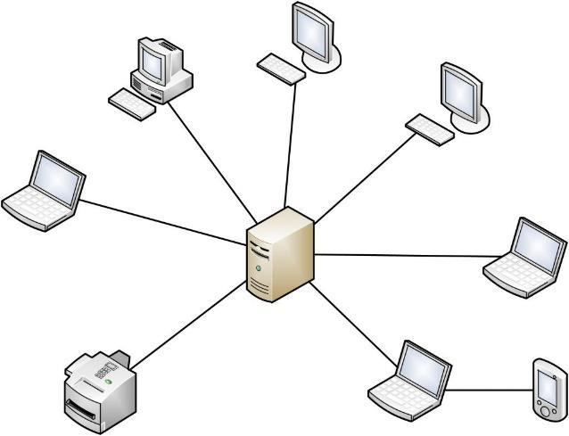{width="3.426388888888889in"
> height="2.6347222222222224in"}

***Şekil 1:** İstemci-sunucu ilişkisi*

İstemci sunucu ilişkisi, bir istek-yanıt mesajlaşma modelinde iletişim
kurar ve kullanılacak kuralları, dili ve diyalog modellerini resmi
olarak tanımlayan ortak bir iletişim protokolüne bağlı kalmalıdır.
İstemci-sunucu iletişimi tipik olarak TCP/IP protokol paketine bağlıdır.

Eski yıllarda bir uygulamanın ayağa kaldırılması için sunucuların
sipariş edilip firma bünyesinde barındırılması gerekiyordu. Bu süreç
*Şekil: 2*'de gösterilmiştir.

16

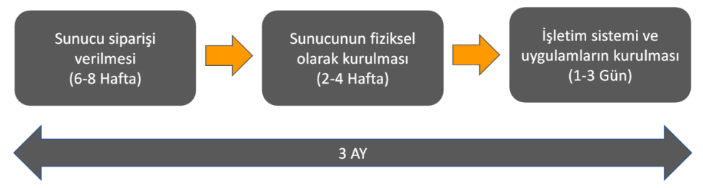{width="4.480555555555555in"
height="1.202985564304462in"}

uygulamaların

***Şekil 2:** Sunucu tedarik ve kurulum süreci*

Siparişin temin edilmesinden, kurulmasına; işletim sisteminin makineye
kurulmasından, uygulamaların çalıştırılmasına kadar geçen süre yaklaşık
olarak üç ayı bulmaktadır.

**1.2.2. Atıl Kapasite Sorunu**\
Pratikte iki farklı yazılım (mail sunucu yazılımı ve muhasebe yazılımı)
aynı makinede kullanılabilir ancak izolasyon ve güvenlik riski gibi
sebeplerden dolayı farklı sunucularda barındırılması gerekir. Bu durum
canlıya alınacak her proje için yukarıda *Şekil: 2*'de gösterilen üç
aylık sürecin tekrarlanmasına neden olur. Her yeni uygulama için yeni
bir makine kurulması firmaların kaynak israfı ile karşı karşıya
gelmesine neden olmuştur.

Firmalar yazılımlarını sunucuda barındırırken sunucunun sunduğu çoğu
özelliğin tamamını kullanmamaktadır. Örneğin 4 Core Thread CPU, 16 GB
RAM, 1 TB depolama alanına sahip bir e-posta sunucusu yazılımı 2 Core,
4-8 GB RAM ve maksimum 200 GB depolama kullanabilir. Yazılım sunucu
tarafından sağlanan sistemin sadece %30'luk bir kısmını kullanmış olur.
Bu firmaya %70'lik bir atıl kapasite sorunu çıkaracaktır.

**1.2.3. Sanallaştırma Temelleri**\
Atıl kapasite sorunu ve bir sunucuda birden fazla uygulama
çalıştırılamaması sorununa çözüm olarak 2000'li yılların başında
sanallaştırma teknolojisi ortaya çıkmıştır. Sanallaştırma teknolojisinin
ortaya çıkışıyla birlikte bulut bilişimin temelleri atılmıştır.

Sanallaştırma, fiziksel bir bilgi işlem ortamı yerine simülasyon
uygulanmış (veya sanal) bir ortam oluşturur. Sanallaştırma çoğu zaman
donanımlar, işletim sistemleri, depolama cihazları ve daha fazlasının
bilgisayar tarafından oluşturulan sürümlerini içerir. Bu sayede
kuruluşlar, tek bir fiziksel bilgisayarı veya sunucuyu birçok sanal
makineye bölümleyebilir. Her sanal makine, tek bir konak makinenin
kaynaklarını paylaşmasına rağmen bağımsız olarak etkileşimlerde
bulunabilir ve farklı işletim sistemleri veya uygulamalar
çalıştırabilir.

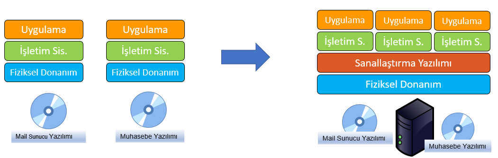{width="6.268054461942257in"
height="1.9986100174978128in"}

***Şekil 3:** Geleneksel sistem ve sanallaştırma sistemi*

17

Sanallaştırma sayesinde, aynı fiziksel makine üzerinde birden fazla
işletim sistemi çalıştırarak aynı sistemin kullanılması sağlandı. Ana
makine kaynaklarını alt sistemlere ortak olarak kullandırarak ana
fiziksel sistemin tüm kaynaklarının optimum kullanılmasını sağlamıştır.

Sanallaştırma teknolojisi ile imaj olarak yerleşen sunucular ortak bir
alana veri depolar ve sistemlerden birinin hasar görmesi durumunda diğer
sunucu hasarlı sunucunun yerini alarak hizmete devam edebilir.

**1.2.4. Bilişim Altyapısı Oluşturma**\
Teknoloji, tek bir çalışanın işinden operasyonlara, ürün ve hizmetlere
kadar günümüz işletmelerinin neredeyse her yönünü güçlendirir.
Teknoloji, ağa doğru bir şekilde bağlandığında, iletişimi iyileştirmek,
verimlilik oluşturmak ve üretkenliği artırmak için optimize edilebilir.

Bir BT altyapısı esnek, güvenilir ve güvenli ise, bir kuruluşun
hedeflerine ulaşmasına ve pazarda rekabet avantajı sağlamasına yardımcı
olabilir. Bundan farklı olarak, bir BT altyapısının düzgün şekilde
uygulanmaması halinde, işletmeler, sistem kesintileri ve ihlaller gibi
güvenlik ve verimlilik sorunlarıyla karşı karşıya kalabilirler. Genel
olarak, düzgün bir şekilde uygulanmış bir altyapıya sahip olmak, bir
işletmenin kârlı olup olmamasına ilişkin bir faktör olabilir.

Geleneksel bir BT altyapısı, şu olağan donanım ve yazılım
bileşenlerinden oluşur: tesisler, veri merkezleri, sunucular, ağ
donanımı masaüstü bilgisayarları ve kurumsal uygulama yazılım çözümleri.
Genellikle, bu altyapı kurulumu, diğer altyapı türlerinden daha fazla
güç, fiziksel alan ve para gerektirir. Geleneksel bir altyapı,
genellikle şirket içinde yalnızca şirket için veya özel kullanım için
kurulur.

Bir tekstil firmasının başlıca ihtiyaçları şu şekildedir: e-posta
sunucusu, dosya sunucusu, muhasebe sunucusu, anında mesajlaşma sunucusu,
web sunucusu ve veri tabanı sunucusu.

Başlık***1.2.1.*** altında *Şekil: 2*'de değinilen üç aylık süreçte bu
gereklilikler temin edilir. Tüm gereklilikler sağlandıktan sonra şirket
içerisinde veri merkezi kurulması gerekmektedir.

Adımlar basitçe şu şekildedir:

> 1.Sadece yetkili kişilerin girebilmesi için kartlı geçiş sistemi
> kurulur.
>
> 2.Kurulacak olan fiziksel cihazların ısınma sorununu çözmek için
> soğutma sistemi oluşturulur.
>
> 3.Kısa elektrik kesintileri için UDP cihazları, uzun elektrik
> kesintileri için jeneratörler temin edilir.
>
> 4.Makinelerin yerleştirilmesi için gerekli olan rack kabinleri (sunucu
> rafları) alınır. 5.Şirketteki diğer cihazlar dahil tüm cihazların
> haberleşmesi için gerekli alt yapı kurulur. Oda kablolar ile
> donatılır.
>
> 6.Odaya internet hattı çekilir.
>
> 7.Cihazları korumak adına gerekli güvenlik donanımları ayarlanır.
>
> 8.Makinelere sanallaştırma yazılımı kurulur.
>
> 9.Her bir uygulama için işletim sistemi ve yazılımların kurulumu
> tamamlanır.

Tüm bu adımlar sonrasında optimizasyonu olan bir sistem tamamlanmış
olacaktır.

Bu sistem sorunları tamamıyla çözmeyecektir. Firma altında çalışan
yazılım ekibinin bir geliştirmeyi canlıya almadan önce test etmesi için
sunucu ihtiyacı oluşabilir. Bu ihtiyaç acil ise üç aylık süre beklemek
için yeterli zaman bulunmayacaktır. Bundan dolayı piyasa bedelinin
üstünde bir sunucu alınır ve yazılım ekibi testlerini yapar. Yazılım
ekibinin işi bittikten sonra

18

elimizde fazladan makine kalacaktır. Elde bulunan bu fazla makine
satılsa bile yazılım ekibinin bu senaryo ile tekrar problem
başlatmayacağının bir garantisi yoktur.

Sanallaştırma atıl kapasite sorununa çözüm olsa da aşağıdaki konularda
yetersiz kalmıştır:

+---+-----------------------------------+
| • | > İlk yatırım maliyeti yüksektir. |
|   | >                                 |
|   | > Bakım maliyeti yüksektir.       |
|   | >                                 |
|   | > Genişletilebilir değildir.      |
|   | >                                 |
|   | > Esnek değildir.                 |
|   | >                                 |
|   | > Planlaması güçtür.              |
+===+===================================+
| • |                                   |
+---+-----------------------------------+
| • |                                   |
+---+-----------------------------------+
| • |                                   |
+---+-----------------------------------+
| • |                                   |
+---+-----------------------------------+

Sanallaştırma teknolojisinin bu sorunlara çözüm bulamaması sebebiyle
'Neden herkes kendi veri merkezini kuruyor?' mottosu ile bilişim alt
yapısı farklı bir iş kolu olarak ayrılmıştır. Büyük veri merkezleri
kurularak müşterilere sunucularını yerleştireceği sunucu rafları
kiralanmaya başlamıştır. Böylelikle firmalar artık bakım, ağ
gereksinimleri gibi konularla ilgilenmeyecektir.

Büyük veri merkezlerinde bulunan paylaşımlı sistem fiyatı düşürmüştür
ancak kapasite sorununa bir çözüm bulamamıştır. Bunun üzerine sunucu
rafı kiralamaktan çıkarak direkt olarak sunucu kiralama sistemine
evirilmiştir. Büyük veri merkezlerinin kendi bünyesindeki sunucuları
müşterilere kiralayarak hizmet vermesi, bulut bilişimin alt yapının
servis olarak sunulması (Infrastructure as a Service - IaaS) hizmetini
oluşturmuştur.

**1.3. IaaS, PaaS, SaaS**\
Bulut bilişim (cloud computing), bilgisayar ve diğer cihazlar için,
istenildiği zaman kullanılabilen ve kullanıcılar arasında paylaşılan
bilgisayar kaynakları olarak tanımlanabilir. Bulut bilişim bir ürün
değil internet tabanlı bir hizmettir. Temel kaynaktaki yazılım ve
bilgilerin paylaşımı sağlanarak, mevcut bilişim hizmetinin;
bilgisayarlar ve diğer aygıtlardan bilişim ağı (tipik olarak internet)
üzerinden kullanılmasıdır.

Bulut bilişim, BT alanında aslında yıllardır kullanılan hizmetler
bütünüdür. Bulut aslında konsept ve bir iş yapış şeklidir. Bu iş yapış
şekli değişik yöntemler içermektedir. Bu yöntemlerin tamamı bulut çatısı
altında toplanmıştır.

**1.3.1. Alt Yapının Servis Olarak Sunulması (Infrastructure as a
Service-IaaS)**\
IaaS, bulut BT için temel yapı taşlarını içerir. Genellikle ağ
iletişimi, bilgisayarlar (sanal veya tahsis edilmiş donanım üzerinde) ve
veri depolama alanına erişim sağlar. IaaS, BT kaynaklarınız üzerinde en
yüksek esneklik ve yönetim denetimi seviyesini sunar. Bu, birçok BT
departmanının ve geliştiricinin aşina olduğu mevcut BT kaynaklarına
benzer.

**1.3.2. Platformun Servis Olarak Sunulması (Platform as a
Service-PaaS)** PaaS, altyapı (genelde donanım ve işletim sistemleri)
yönetimi ihtiyacınızı ortadan kaldırarak uygulama dağıtma ve yönetim
alanlarına odaklanmanızı sağlar. Bu da kaynak tedariki, kapasite
planlaması, yazılım bakımı, düzeltme ekleri veya uygulamanızın
çalıştırılmasıyla ilgili diğer benzer zorlu görevler konusunda
endişelenmemenize ve bu sayede daha verimli bir şekilde çalışmanıza
yardımcı olur.

**1.3.3. Yazılımın Servis Olarak Sunulması (Software as a
Service-SaaS)** SaaS, hizmet sağlayıcısı tarafından çalıştırılan ve
yönetilen tamamlanmış bir ürün sunar. SaaS, çoğu zaman son kullanıcı
uygulamalarını (web tabanlı e-posta gibi) ifade etmek için kullanılır.

19

SaaS teklifiyle, hizmetin bakımı veya altyapının yönetimi konusunda
endişelenmeniz gerekmez. Düşünmeniz gereken tek şey bu yazılımı nasıl
kullanacağınızdır.

**1.3.4. Bulut Bilişim Konseptlerinin Farkları**\
Aşağıdaki *Şekil: 4* üzerinde göründüğü gibi firma içi kaynakların
yönetimi ile bulut konseptleri üzerinden kaynakların yönetilmesi
arasında farklar bulunmaktadır. Şirket içerisinde kurulacak bir veri
merkezi ile depolamadan işletim sistemine kadar tüm adımlar bilişim
departmanı tarafından fiziksel olarak yapılmalıdır. Bulut
konseptlerinden olan IaaS yani alt yapının servis olarak sunulması
konseptinde sunucu, ağ, sanallaştırma gibi adımları bulut bilişim
kullanıcı yerine yapılandırıyor. Aslında bulut bilişimin bu konseptinde
kullanıcılara bir adet sanal bilgisayar tanımlanmış oluyor ve
kullanıcılar işletim sistemi kurmaktan uygulama yayınlamaya kadar tüm
adımları kendileri tamamlamış oluyor. PaaS yani platformun servis olarak
sunulması konseptinde ise bulut bilişimin faydalarından yararlanan
müşteriler sadece gerekli verilerden ve uygulamanın çalıştırılmasından
sorumlu oluyor. Bulut bilişimin son konsepti olan SaaS yani yazılımın
servis olarak sunulması konseptinde ise günümüzde kullanılan bulut
depolama alanları, e-posta servisleri gibi ürünlerdir. Yani müşteriler
sadece sunulan bulut tabanlı ürünü kullanmaktadır.

> 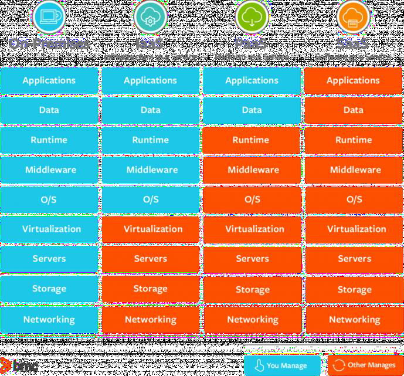{width="3.448611111111111in"
> height="3.2069433508311462in"}

***Şekil 4:** Bulut bilişimin konseptleri*

**1.4. Yazılım Geliştirme Döngüsü**\
Yazılım Geliştirme Yaşam Döngüsü (Software Development Life Cycle,
SDLC), yazılımları tasarlamak, geliştirmek ve test etmek amaçlı
kullanılan bir süreç olarak ifade edebiliriz. Yazılımın nasıl
geliştirileceği, sürdürüleceği ve daha iyi hale nasıl getirileceğinin
açıklayan bir plandan oluşmaktadır. Buradan da yazılımın aslında bir
ürün olduğu ve o ürününde bir yaşam süreci olduğunu gözlemlemiş
oluyoruz. SDLC, müşteri isteklerini karşılayacak şekilde süre ve maliyet
tahminleri dahilinde tamamlanması sağlanan kaliteli yazılım üretmeyi
hedefler. Aynı zamanda SDLC, ISO/IEC 12207 dahilinde uluslararası bir
standart olmayı amaçlar.

20

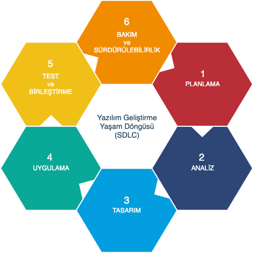{width="2.2736100174978127in"
height="2.272222222222222in"}

***Şekil 5:** Yazılım geliştirme döngüsü*

Yazılımın ilk sürüm geliştirmesi bitmeye yakın bir beta sürümü
yayınlanır. Beta sürümü test aşamasında kullanıcıların da dahil olduğu
bir süreçtir. Yazılım firması ürünün ilk sürümünü (versiyon 1.0)
müşteriye teslim eder. Müşteri kendi kaynaklarında ürünü çalıştırır. Bu
süreçten sonra ilk sorunlarla ortaya çıkacaktır. Müşteri bunu yazılım
firmasına bildirir. Yazılım firması ilk düzenlemesini yani "hotfix"
hazırlar ve bu geliştirmeyi de müşteriye gönderir.

Bu süreç her iki taraflı da sorun içermektedir. Yazılım firması
açısından geri bildirimlerin toplanması zaman alacaktır, yazılımın
kurulu olduğu sistem müşteriye ait olduğu için anında müdahale
edememektedir, yüzlerce değişik sistem konfigürasyonu için uyumluluk
oluşturmak zorlaşacaktır. Müşteri açısından bakıldığında ise; problem
çözümü oldukça zahmetlidir, yeni özelliklerin bulunduğu sürümlere
erişmek aylar sürebilir, alt yapı oluşturma ve yönetme işlemleri
zahmetli ve pahalıdır.

Bulut bilişimin SaaS yani yazılım servis olarak sunulması modeli
arkasındaki temel mantık ise yazılım firmasının uygulamayı kendi
makinesinde çalıştırıp kullanıcıya bir kullanıcı adı ve parola ile
sisteme giriş sağlamasını ve sonrasında kullanmasını hedeflemektedir.
Müşteri büyük bütçeler ile bir yazılım almak yerine bir nevi kiralamış
olur.

Müşteri dönütlerinin hızlı olması, yazılım firmasını hızlı geliştirme ve
test etme döngüsüne sokmuştur. Bu süreç sonrasında yazılım geliştirme
ekibi ile operasyon ekibi arasında etkileşim ve iletişimin hızlı olması
açısından DevOps fikri ortaya çıkmıştır.

**1.5. DevOps**\
Geliştirme (Dev) ve işlemlerin (Ops) bir bileşeni olan DevOps;
müşterilere sürekli olarak değer sunmak için bir araya gelen kişiler,
süreçler ve teknolojiler bütünüdür.

DevOps'un ekipler için anlamı nedir? DevOps, daha iyi ve daha güvenilir
ürünler üretmek amacıyla koordinasyon ve iş birliği gerçekleştirmek
için, eskiden birbirinden ayrı düşünülen geliştirme, BT operasyonu,
kalite mühendisliği ve güvenlik rollerine olanak tanır. DevOps
yöntemlerinin ve araçlarının yanı sıra bir DevOps kültürünü benimseyen
ekipler müşteri gereksinimlerine daha iyi yanıt verme becerisi
kazanıyor, oluşturdukları uygulamalara olan güvenlerini artırabiliyor ve
iş hedeflerine daha hızlı bir şekilde ulaşabiliyor.

21

> 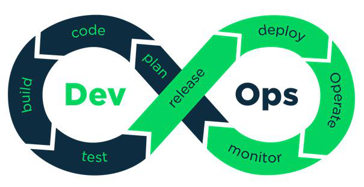{width="3.533333333333333in"
> height="1.8125in"}

***Şekil 6:** DevOps iş yapış şekli*

DevOps sayesinde önceden senede iki büyük sürüm yayınlayabilen yazılım
firmaları artık günde birkaç küçük yeni versiyonlara erişebilir hale
geldi. DevOps fikrinin popüler bir hale gelmesi ile yazılan kodu
otomatik olarak bulunduğu depodan alıp test ortamına alan, otomatik test
edip stage production'a yollayan uygulamalar geliştirildi. Bu
uygulamalara Docker ve Chef en büyük örneklerdir.

**1.6. Mikro Servis Mimarisi**

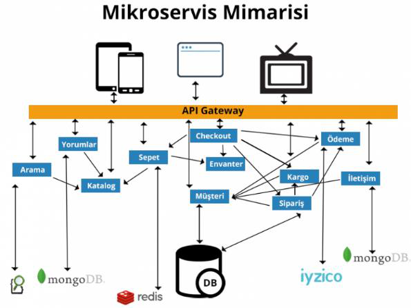{width="2.9277777777777776in"
height="2.183332239720035in"}

***Şekil 7:** Miro servisler mimarisi şeması*

Monolitik mimari kendi kendine yetebilecek bir uygulamadaki bütün
fonksiyonalitelerin tek bir çatı altında geliştirilmesidir. Ancak
monolitik mimarinin bazı dezavantajları vardır:

+---+-----------------------------------------------------------------+
| • | • Uygulama büyüdükçe yeni özellik geliştirilmesi ve mevcut      |
|   | kodun bakımı zorlaşır.                                          |
+===+=================================================================+
| • | > Projede çalışan ekip sayısının ve çalışan sayısının artması   |
|   | > ile geliştirme ve bakım daha                                  |
+---+-----------------------------------------------------------------+
| • | > güç hale gelir.                                               |
+---+-----------------------------------------------------------------+
|   | > Birbirlerine olan bağımlılıklarından dolayı, bir              |
|   | > fonksiyonalitede yapılan değişiklik                           |
+---+-----------------------------------------------------------------+
| • | > diğer yerleri etkileyebilir.                                  |
+---+-----------------------------------------------------------------+
|   | > Spesifik bir fonksiyonaliteyi ölçeklendirme imkânı yoktur.    |
|   | > (Örneğin geliştirdiğiniz                                      |
+---+-----------------------------------------------------------------+
| • | > uygulamada sürekli fatura oluşturuluyor ve burası uygulamanın |
|   | > dar boğazı. Siz bu                                            |
+---+-----------------------------------------------------------------+
|   | > fonksiyonaliteyi birden fazla sanal makine da çalıştırmak     |
|   | > isteseniz bile uygulamanız                                    |
+---+-----------------------------------------------------------------+
|   | > monolitik mimaride olduğu için sadece ilgili servis yerine    |
|   | > bütün uygulamayı                                              |
+---+-----------------------------------------------------------------+
|   | > ölçeklendirmek zorunda kalırsınız.)                           |
+---+-----------------------------------------------------------------+
|   | > Versiyon yönetimi zorlaşır.                                   |
+---+-----------------------------------------------------------------+
| • | • Uygulamada aynı programlama dili ve aynı framework'lerin      |
|   | kullanılması gerekir.                                           |
+---+-----------------------------------------------------------------+
| • | > Uygulamada yapılan küçük bir değişiklikte bile bütün          |
|   | > uygulamanın deploy olması                                     |
+---+-----------------------------------------------------------------+
|   | > (yayınlanması) gerekir.                                       |
+---+-----------------------------------------------------------------+

22

Bu sorunların üstesinden gelmek için mikro servis mimarisi ortaya
çıkmıştır.

Mikro servis (micro service) mimarisi, tek bir uygulama geliştirirken
modüler bir yapıda her biri küçük servis olarak düşünülmesi gereken ve
her bir servisinde kendi işini ve iletişimini yürütebilen, çok karmaşık
olmayan ve başka servislere bağımlılığı az olan mekanizmalara sahip bir
yaklaşımdır. Bu servisler kendilerinin sorumlu olduğu tek bir işe odaklı
ve bağımsız çalışabilen, otomatize bir deployment mekanizmasına sahip
bir yapıdadır. Merkezi yönetim mekanizmalarından oldukça arındırılmış
olmalıdır. Farklı programlama dillerinde geliştirilebilir ve farklı veri
tabanı teknolojileri kullanılabilir.

Mikro servis mimarisi, monolitik mimarinin birçok soruna çözüm olabilse
de çok daha karmaşık bir sistem ortaya çıkmıştır. Bu durum da DevOps
fikrinin günbegün öneminin artmasına neden olmuştur. Mikro servis
mimarisi servisleri ayrı ayrı geliştirme konusunda büyük oranda kolaylık
sağlasa da ortaya çıkan kaynak israfı sorununu adresleyememiştir.

Mikro servis mimarisinin temelinde uygulama programlama ara yüzü yani
API bulunmaktadır.

**1.7. API (Application Programming Interface)**\
Uygulama programlama arayüzleri yani API\'ler, uygulamaların veri ve
işlevsellik alışverişini kolay ve güvenli bir şekilde yapmasını
sağlayarak yazılım geliştirmeyi ve yeniliği basitleştirir.

Bir uygulama programlama arayüzü veya API, şirketlerin uygulamalarının
verilerini ve işlevlerini harici üçüncü taraf geliştiricilere, iş
ortaklarına ve şirketlerindeki dahili departmanlara açmasına olanak
tanır. Bu, hizmetlerin ve ürünlerin birbirleriyle iletişim kurmasına ve
belgelenmiş bir arayüz aracılığıyla birbirlerinin verilerinden ve
işlevlerinden yararlanmasına olanak tanır. Geliştiricilerin bir API\'nin
nasıl uygulandığını bilmesine gerek yoktur; sadece diğer ürün ve
hizmetlerle iletişim kurmak için arayüzü kullanırlar. API kullanımı son
on yılda o kadar artmıştır ki, günümüzde en popüler web uygulamalarının
çoğu API\'ler olmadan mümkün olmayacaktı.

API Gateway ise, istemcilerle back-end sunucuları / mikro servisler
arasında duran bir API yönetim aracıdır.

API Gateway API isteklerini alarak çeşitli kurallara göre uygun
servislere yönlendiren bir ters vekil sunucusu (reverse proxy) olarak
çalışır. API Gateway istek sınırlandırma, istatistik, kimlik doğrulama
vs. gibi çeşitli sık kullanılan işlevleri üzerine alarak asıl API
sunucularınızın önünde bir üst katman oluşturur.

İstemci tüm servislerden bilgiyi alır. İstemci dolaylı yoldan (API
Gateway ile) da olsa tüm mikro servisler ile haberleşmiş olur. Aynı
zamanda istemci, mikro servisler ile doğrudan bir iletişim kurmamış
olur.

Temelde API Gateway de bir servistir. Temel görevi ise diğer tüm
servislere ortak erişilmesini sağlamaktır. Ana görevleri yönlendirme,
birleştirme, yetkilendirme, yük dağıtımı, ön bellekleme ve izlemedir.

**1.8. Container (Konteyner)**\
Mikro servisler öncesinde uygulamalar tek bir parça olarak kurgulanıyor
ve hayata geçiriliyordu. Mikro servis mimarisi ile ana servisler, alt
servislere ayrılmış oldu. Bu servislerin her biri için ayrı bir makine
tahsis edilip, kuruldu. Yüksek erişilebilirlik olması yani yoğun istek
altında kaldığında sistemin yavaşlamaması için tüm bu servisler
çiftelenir. Tüm bu durumlar göz önüne alındığında, ana servisler alt
servislere parçaladığında fazla sayıda makineye ihtiyaç duyulur hale
gelindi.

23

Mikro servis mimarisinde bir servis için sadece işletim sisteminin
bulunması gerekli kaynakların temini açısından yeterlidir. Bu durumda
her bir servis için bir işletim sistemi kurulduğundan dolayı kaynak
kullanımı büyük oranda artmıştır. Tüm mikro servisleri ayrı ayrı
makinelerde barındırılmasının iki temel sebebi vardır.

+---+-----------------------------------------------------------------+
| • | • Uygulama izolasyonunu korumak, bundan dolayı da güvenliği     |
|   | sağlamak.                                                       |
+===+=================================================================+
| • | > Servisleri aynı makinede çalıştırılması durumunda makine      |
|   | > bağımlılığının ortaya                                         |
+---+-----------------------------------------------------------------+
|   | > çıkacak olması.                                               |
+---+-----------------------------------------------------------------+

Tüm bu sorunların önünce geçmek amacıyla 'container (konteyner)'
teknolojisi ortaya çıkmıştır.

Konteynerler ister masa üstünde ister geleneksel BT\'de veya bulutta
olsun, uygulama kodunun istenen herhangi bir yerde çalıştırılabilmesi
için, kitaplıkları ve bağımlılıkları ile birlikte ortak yöntemlerle
paketlendiği, yürütülebilir yazılım birimleridir.

Bunun için konteynerler bir çeşit işletim sistemi sanallaştırmasından
yararlanır. Burada hem süreçlerin yalıtılması hem de bu süreçlerin
erişimi olan disk, bellek ve CPU miktarının kontrolü için işletim
sisteminin özelliklerinden (Linux kernel senaryosunda ad alanları ve
cgroups primitifleri gibi) yararlanılır.

Konteynerler küçük, hızlı ve taşınabilirdir. Bunun nedeni, sanal bir
makinenin aksine, konteynerlerin her eş görünümde bir konuk işletim
sistemi içermesinin gerekli olmaması, bunun yerine, anasistem işletim
sisteminin özelliklerinden ve kaynaklarından yararlanmasının yeterli
olmasıdır.

Konteynerler, ilk olarak, on yıllar önce FreeBSD Jails ve AIX Workload
Partitions gibi sürümlerle ortaya çıktı. Ancak çoğu modern geliştirici,
2013 yılını, Docker\'ın tanıtılmasıyla birlikte modern konteyner çağının
başlangıcı olarak hatırlıyor.

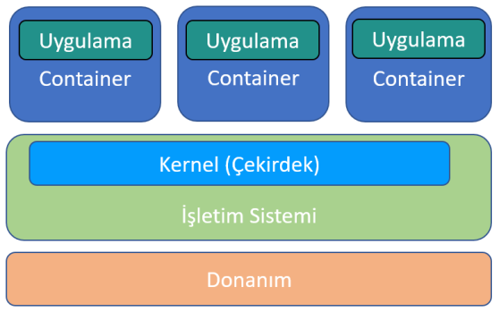{width="2.7930555555555556in"
height="1.7458333333333333in"}

***Şekil 8:** Konteyner (container) yapısı*

Kısaca konteynerler birer sanal bilgisayar (Virtual Machine- VM) gibi
çalışan ancak sanal bilgisayarlar kadar kaynak tüketmeyen bir yapı
olarak tanımlanabilir.

24

**2. AMAZON WEB SERVİSLERİ (AWS)**\
**2.1. Amazon Web Servislerinin Tarihçesi**\
Fikir, Amazon tarafında verimlilik geliştirme ihtiyacından ve iş
büyüdükçe hızla ölçeklendirme ihtiyacından kaynaklandı.

2003 yılında Amazon, rakiplerine kıyasla önemli bir avantaja sahip
olduklarını fark etti. Bu avantaj, Amazon altyapı hizmetleri ve
altyapılarını güvenilir ve verimli bir şekilde yönetme ve ölçeklendirme
yetenekleriydi. Amazon Web Servisleri fikri ilk olarak burada doğdu.

Fikir, farklı donanım kaynaklarının (yani bilgi işlem, depolama, bellek
vb.) bu işletim sisteminin bileşenleri olarak yalıtıldığı ve tüm
"farklılaştırılmamış ağır yükleri" alan yönetilen hizmetler olarak
sunulduğu bir \'İnternet İşletim Sistemi\' olarak başladı. Bu, donanım
ve fiziksel altyapıyı yönetme ihtiyacını ortadan kaldıran ve
işletmelerin kendi iş durumlarına odaklanmalarını sağlayan devrim
niteliğinde bir fikirdi.

Amazon, bu fikri gerçeğe dönüştürmek için harekete geçmeye karar verdi.
Amazon, (zorunluluktan dolayı) güvenilir ve uygun maliyetli veri
merkezleri inşa etmede zaten harikaydı ve bu fikri giderek daha fazla
keşfetmeye devam ettikçe, bu bilgi işlem alanının sadece dokunulmamış
olmadığını, aynı zamanda Amazon için büyük bir potansiyele sahip
olduğunu fark ettiler. İşletme ve kendi başına Amazon\'un bir kolu
olarak AWS hayata geçmiş oldu.

AWS\'nin başlangıcı, Amazon Simple Queue Service\'in (Amazon SQS)
başlatıldığı 2006 yılındaydı. Bunu kısa bir süre sonra S3, EC2 izledi ve
AWS tarafından yapılan bu ilk tekliflerle, AWS\'yi bulut bilişimde
küresel bir oyuncu olmaya itmek için temeller inşa ediliyordu.

O zamandan beri, AWS büyük adımlarla ilerleyerek Re:invent, Storage Day,
Re:inforce gibi birçok konferansa ev sahipliği yaptı. Depolama, bilgi
işlem, makine öğrenimi, IoT, vb. tabanlı geniş bir hizmet yelpazesiyle
toplam hizmet miktarı 200\'ün üzerine çıktı. Bu hem yeni başlayanların
hem de kuruluşların, ölçeklenebilir, yönetilebilir çözümler
oluşturabileceklerinden çok daha hızlı bir şekilde oluşturabilmesini
sağladı.

**2.2. AWS Küresel Alt Yapısı**\
Ağ bağlantılarının hızlanmasına paralel olarak talep edilen veri miktarı
da arttı. Bu nedenle bulut bilişime karşı olan en büyük çekince; kendi
bünyesinde barındırıp çok hızlı erişilebilecek hizmetlere başka bir
lokasyon üzerinden ulaşarak yavaş erişim problemidir. Bir lokasyona
fiziksel olarak ne kadar uzak olunursa hizmet o kadar yavaş olacaktır.
AWS bu sorunu küresel alt yapısı sayesinde çözmeye çalışmaktadır.

Dünya çapındaki veri merkezlerinden 200'ün üzerinde tam özellikli hizmet
sunan AWS Küresel Bulut Altyapısı, en güvenli, en kapsamlı ve en
güvenilir bulut platformudur. Uygulama iş yüklerinizi tek tıklamayla tüm
dünyaya dağıtmanız gerektiğinde veya son kullanıcılarınıza daha yakın
konumdan milisaniye cinsinden tek basamaklı gecikme sürelerine sahip
özel uygulamalar oluşturmak ve dağıtmak istediğinizde, AWS size ihtiyaç
duyduğunuz yerde ve zamanda bulut altyapısı sağlar.

**2.2.1. Bölgeler**\
AWS\'de, veri merkezlerini bir araya topladığımız dünya çapındaki
fiziksel konumları ifade eden "Bölge" (region) kavramı bulunmaktadır.
Her bir mantıksal veri merkezi grubunu Erişilebilirlik Alanı olarak
adlandırırız. Her bir AWS bölgesi, bir coğrafi bölge içinde yalıtılmış
ve fiziksel olarak ayrı şekilde konumlandırılmış birden fazla AZ\'den
(Availability Zone - Erişilebilirlik Alanı) oluşur. Bir bölgeyi
genellikle tek bir veri merkezi olarak tanımlayan diğer bulut
sağlayıcılarından farklı olarak, her AWS bölgesinde birden fazla AZ
bulunması

25

müşterilere avantajlar sunar. Tüm AZ\'ler, bağımsız güç, soğutma ve
fiziksel güvenlik sistemlerine sahiptir ve son derece düşük gecikmeye
sahip yedekli ağlar üzerinden birbirine bağlıdır. Yüksek
erişilebilirliğe odaklanan AWS müşterileri, daha fazla hata toleransı
elde etmek için uygulamalarını birden fazla AZ\'de çalışacak şekilde
tasarlayabilir. AWS altyapı bölgeleri (region) en yüksek güvenlik,
uygunluk ve veri koruma düzeylerini karşılar.

AWS, diğer bulut sağlayıcılarının tümünden daha geniş bir küresel ayak
izi sunmakta ve hem bu küresel ayak izini desteklemek hem de
müşterilerin dünya genelinde hizmet aldığından emin olmak için hızla
yeni bölgeler açmaktadır. AWS; Kuzey Amerika, Güney Amerika, Avrupa,
Çin, Asya Pasifik, Güney Afrika ve Orta Doğu dahil olmak üzere birden
fazla coğrafyada bölgeye sahiptir.

**2.2.2. Erişilebilirlik Alanları**\
Bir Erişilebilirlik Alanı (AZ), bir AWS bölgesindeki yedekli güç, ağ
iletişimi ve bağlantıya sahip bir veya daha fazla ayrık veri merkezidir.
AZ\'ler, müşterilerin tek bir veri merkezinin sunabileceğinden daha
yüksek oranda erişilebilir, hata toleranslı, ölçeklenebilir üretim
uygulamaları ve veri tabanları kullanabilmesini sağlar. Bir AWS
bölgesindeki tüm AZ\'ler; AZ'ler arasında yüksek aktarım hızına ve düşük
gecikmeye sahip ağ iletişimi sunmanın yanı sıra tam yedeklilik sağlayan,
tahsis edilmiş metro fiber ağı üzerinden yüksek bant genişliği ve düşük
gecikmeli ağ iletişimi ile birbirine bağlıdır. AZ\'ler arasındaki tüm
trafik şifrelenir. Ağ performansı, AZ'ler arasında zaman uyumlu çoğaltma
yapmak için yeterlidir. AZ\'ler, yüksek erişilebilirlik için
uygulamaları bölümlere ayırmayı kolaylaştırır. Bir uygulama AZ\'ler
arasında bölümlere ayrıldığında, şirketler güç kesintileri, yıldırım,
kasırga ve deprem gibi sorunlardan daha iyi korunur ve yalıtılır. Tüm
AZ\'ler, diğer AZ\'lerden mantıklı bir mesafede bulunmaları için
fiziksel olarak kilometrelerce uzağa konumlandırılmakla birlikte hepsi
birbirine 100 km (60 mil) mesafe içinde yer alır.

**2.2.3. AWS Yerel Alanları**\
AWS Yerel Alanları işlem, depolama, veri tabanı ve diğer seçili AWS
hizmetlerini son kullanıcılara daha yakın konuma getirir. AWS Yerel
Alanları sayesinde medya ve eğlence içeriği üretimi, gerçek zamanlı
oyun, rezervuar simülasyonları, elektronik tasarım otomasyonu ve makine
öğrenimi gibi, son kullanıcılarınıza on milisaniyeden kısa gecikme
süreleri sunmanızı gerektiren zorlu gereksinimlere sahip uygulamaları
kolayca çalıştırabilirsiniz.

Her AWS yerel alanı; Amazon Elastic Compute Cloud, Amazon Virtual
Private Cloud, Amazon Elastic Block Store, Amazon File Storage ve Amazon
Elastic Load Balancing gibi AWS hizmetlerini son kullanıcılara coğrafi
olarak yakın konumda kullanarak gecikme açısından hassas
uygulamalarınızı çalıştırabileceğiniz bir AWS bölgesinin uzantısıdır.
Yerel iş yükleri ile AWS bölgesinde çalışan iş yükleri arasında yüksek
bant genişliğine sahip güvenli bağlantı sunan AWS yerel alanları,
bölgedeki tüm hizmetlere aynı API\'ler ve araç kitleri aracılığıyla
sorunsuz bir şekilde bağlanmanızı mümkün kılar.

**2.2.4. AWS Wavelength**\
WS Wavelength, geliştiricilerin mobil cihazlara ve son kullanıcılara on
milisaniyeden kısa gecikme süreleri sunan uygulamalar oluşturmasına
imkân tanır. AWS geliştiricileri, uygulamalarını wavelength alanlarına
dağıtarak bölgedeki AWS hizmetlerinin tümüne sorunsuz bir şekilde
erişebilir. Wavelength alanları, AWS işlem ve depolama hizmetlerini 5G
ağların uç noktasına getirerek telekomünikasyon sağlayıcılarına ait veri
merkezlerine ekleyen AWS altyapı dağıtımlarıdır. Bu, geliştiricilerin
oyun ve canlı video akışı, uçta makine öğrenimi çıkarımı, artırılmış ve
sanal gerçeklik (AR/VR) gibi, on milisaniyeden kısa gecikme süreleri
gerektiren uygulamalar sunmasını sağlar. AWS Wavelength, AWS
hizmetlerini 5G ağ uç

26

noktasına getirerek, mobil cihazdan bir uygulamaya bağlanmaya ilişkin
gecikme süresini en aza indirir. Uygulama trafiği, mobil sağlayıcının
ağından çıkmadan, dalga boyu bölgelerinde çalışan uygulama sunucularına
ulaşabilir. Bu, internete yönelik ekstra ağ atlamalarını azaltır. Bu
atlamalar, 100 milisaniyeden fazla gecikme sürelerine yol açarak
müşterilerin 5G\'deki ağ genişliği ve gecikme süresi iyileştirmelerinden
tam olarak faydalanmasını engelleyebilir.

**2.2.5. AWS Outposts**\
AWS Outposts; yerel AWS hizmetlerini, altyapısını ve işletim modellerini
neredeyse tüm veri merkezlerine, ortak yerleşim alanlarına veya şirket
içi tesislere getirir. Gerçek anlamda tutarlı bir hibrit deneyim sunmak
için şirket içinde ve AWS bulutta yer alan aynı AWS API\'lerini,
araçlarını ve altyapısını kullanabilirsiniz. AWS Outposts, bağlantılı
ortamlar için tasarlanmıştır ve düşük gecikme veya yerel veri işleme
ihtiyaçları nedeniyle şirket içinde kalması gereken iş yüklerini
desteklemek için kullanılabilir.

**2.2.6. AWS Küresel Alt Yapı Haritası**\
AWS 2022 mayıs ayı itibariyle bünyesinde;

+---+-----------------------------------------------------------------+
| • | • Kullanıma sunulmuş 26 bölge ve her bölgede birden fazla       |
|   | erişilebilirlik alanı,                                          |
+===+=================================================================+
| • | > 84 erişilebilirlik alanı,                                     |
+---+-----------------------------------------------------------------+
| • | • 17 yerel bölge (Local Zones) ve 25 dalga boyu bölgesi         |
|   | (Wavelength Zones),                                             |
+---+-----------------------------------------------------------------+
| • | > Duyurulan 8 bölge ve 32 yerel bölge                           |
+---+-----------------------------------------------------------------+
| • | • İkinci en büyük bulut sağlayıcısına oranla 2 kat daha fazla   |
|   | bölge,                                                          |
+---+-----------------------------------------------------------------+
| • | > Hizmet sunulan 245 ülke ve bölge,                             |
+---+-----------------------------------------------------------------+
| • | > 108 direkt bağlantı konumu,                                   |
+---+-----------------------------------------------------------------+
| • | • 310'dan fazla varlık noktası (PoP), barındırmaktadır.         |
+---+-----------------------------------------------------------------+

Küresel çaptaki etkin milyonlarca müşterisi ve on binlerce çözüm
ortağıyla AWS, en geniş ve en dinamik ekosisteme sahiptir.
Start-up\'lar, kuruluşlar ve kamu sektörü kurumları dahil olmak üzere
neredeyse her sektörden ve her boyuttaki müşteriler, akla gelebilecek
tüm kullanım örneklerini AWS\'de çalıştırmaktadır.

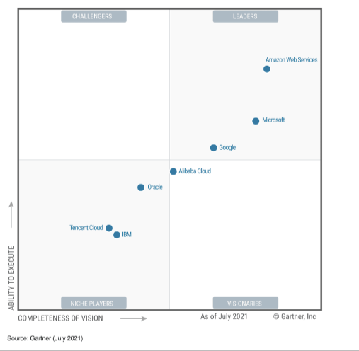{width="2.536111111111111in"
height="2.4819444444444443in"}

***Şekil 9:** AWS ve diğer lider bulut sağlayıcılarının pazar payı*

Müşteriler, bulut tabanlı altyapılarını barındırmak ve gittikleri her
yerde daha iyi performans, güvenlik, güvenilirlik ve ölçek sağlamak için
giderek artan oranda AWS\'yi tercih ediyor. AWS, raporda adı geçen en
iyi 7 satıcı arasından iş gerçekleştirme becerisi ve vizyon bütünlüğü
ölçümlerinde ilk sırayı alarak üst üste 11. kez 2021 Gartner Magic
Quadrant for Cloud Infrastructure and Platform Services listesinde
"Lider" unvanına layık görüldü.

27

AWS Cloud, dünya çapındaki 26 coğrafi bölgede 84 erişilebilirlik alanını
kapsar. Ayrıca, 24 erişilebilirlik alanının yanı sıra Avustralya,
Kanada, Hindistan, İsrail, Yeni Zelanda, İspanya, İsviçre ve Birleşik
Arap Emirlikleri\'nde (BAE) 8 AWS bölgesinin daha planlandığı
açıklanmıştır. Aşağıdaki resimde aktif ve duyurulan bölgeler noktalar
ile gösterilmiştir.

> 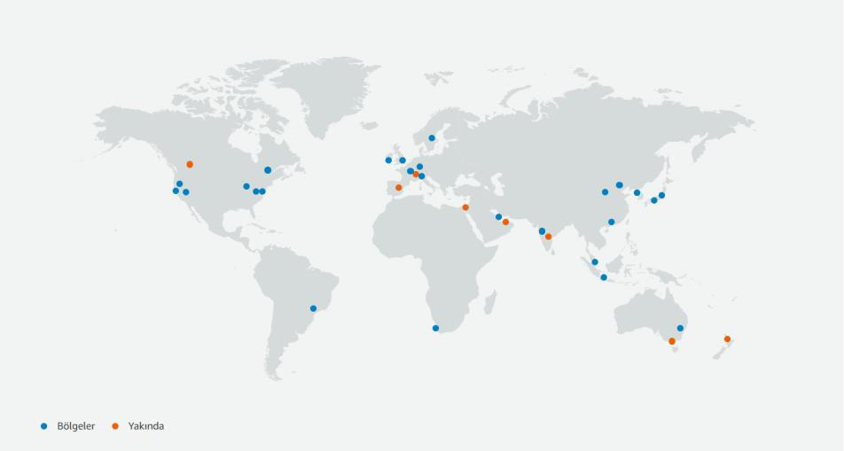{width="4.7625in"
> height="2.5458333333333334in"}

***Şekil 10:** AWS region (bölgelerin) dünyada konumlanması*

**2.3. AWS Yönetim Konsolu**\
AWS Management Console, AWS kaynaklarını yönetmek için geniş bir hizmet
konsolları koleksiyonunu içeren ve bunlara atıfta bulunan bir web
uygulamasıdır. İlk oturum açtığınızda konsol ana sayfasını görürsünüz.
Ana sayfa, her bir hizmet konsoluna erişim sağlar ve AWS ile ilgili
görevlerinizi gerçekleştirmek için ihtiyaç duyduğunuz bilgilere erişmek
için tek bir yer sunar. Ayrıca son ziyaret edilenler, AWS Health,
Trusted Advisor ve daha fazlası gibi widget\'lar ekleyerek, kaldırarak
ve yeniden düzenleyerek konsol ana sayfası deneyimini özelleştirmenize
olanak tanır.

Bireysel hizmet konsolları ise, bulut bilişim için çok çeşitli araçların
yanı sıra hesabınız ve faturalandırmanız hakkında bilgiler sunar.

> 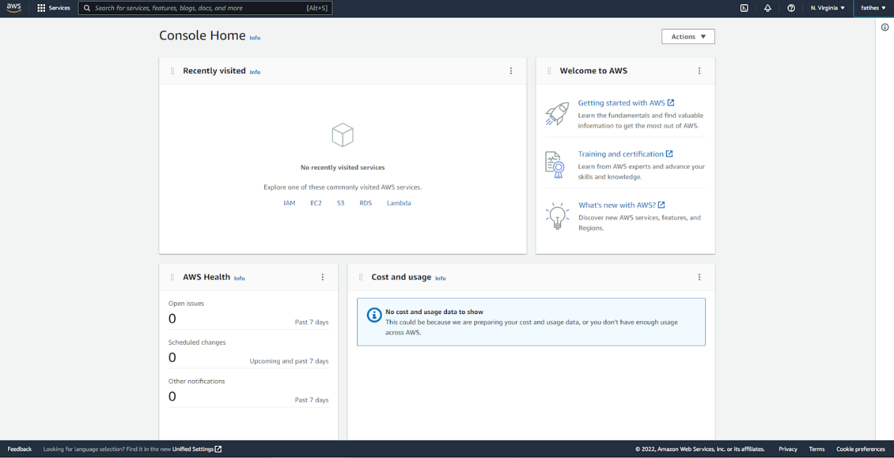{width="6.144444444444445in"
> height="3.15in"}

***Şekil 11:** AWS yönetim konsolu*

28

Sağ üstte kullanıcı adının sol tarafında (*Şekil: 11*'de N.Virginia
olarak görünen alan) "region" yani bölge seçilebilmektedir. Kaynaklar
hangi bölge üzerinden oluşturulmak istenirse o bölge seçilip servis
oluşturma işlemi sonrasında yapılmalıdır.

Sol üste bulunan 'Services' sekmesinde tüm servisler alt kategoriler
halinde listelenmiştir. Hangi uygulamanın hangi servis üzerinde
çalıştığını izlemek için ise arama alanına 'Resorces Groups' yani
'kaynak grupları' yazılabilir. Oluşturulan tüm kaynaklara bir "tag" yeni
etiket ataması yapılabilir. Böylelikle kaynakları birbirinden ayırmak
daha kolay olacaktır ve karışıklığın önüne geçilecektir. Etiketleme
işlemi bir anahtar-değer şeklinde tanımlanmaktadır. Örneğin satış
departmanı için oluşturulan sanal makine servisini 'departman:satis'
şeklinde etiketlemek mümkündür. Bu etiketlemeden sonra bu tag diğer
kaynaklara verildiğinde hepsi aynı sekme altında görünecektir.
Oluşturulan kaynakları bu şekilde sınıflandırmak ve etiketlere göre
kaynakların durumlarını izleyebilmek kullanıcıların işini oldukça
kolaylaştırmaktadır.

29

**3. AWS HİZMETLERİ**\
AWS aktif olarak 200'ü aşkın servisi müşterilerine hizmet olarak
sunmaktadır. Bu başlık altında kategoriler halinde servislere ve
servislerin açıklamalarına yer verilmektedir.

**3.1. Analiz Servisleri**\
**3.1.1. Amazon Athena**\
{width="0.8319444444444445in"
height="0.8305544619422572in"} olduğundan yönetilmesi gereken bir
altyapı yoktur ve yalnızca çalıştırdığınız sorgular için ödeme
yaparsınız.

> Amazon Athena, Amazon S3\'te standart SQL kullanarak veri analizi
> yapmanızı kolaylaştıran etkileşimli bir sorgu sistemidir. Athena
> sunucusuz (serverless)

Athena\'nın kullanımı kolaydır. Basitçe Amazon S3\'teki verilerinizi
belirtin, şemayı tanımlayın ve standart SQL kullanarak sorgulamaya
başlayın. Çoğu sonuç saniyeler içinde sunulur. Athena\'da verilerinizi
analize hazırlayacak karmaşık ETL (Extract, Transform, Load) işlerine
gerek yoktur. Böylece SQL becerileri olan herkesin büyük ölçekli veri
kümelerini hızlıca analiz etmesi kolaylaşır.

Athena, AWS Glue Veri Kataloğu ile entegre olup çeşitli hizmetler
arasında birleşik bir meta veri deposu oluşturmanıza, şemaları keşfedip
kataloğunuzu yeni ve değiştirilmiş tablo ve bölüm tanımlarıyla doldurmak
için veri kaynaklarını taramanıza ve şema sürümü oluşturmayı korumanıza
olanak sağlar.

**3.1.2. Amazon CloudSearch,**\
{width="0.8319444444444445in"
height="0.8319433508311461in"} Amazon CloudSearch, AWS Cloud\'da web
siteniz veya uygulamanız için bir arama çözümü kurmayı, yönetmeyi ve
ölçeklendirmeyi hem basit hem de uygun maliyetli hale getiren bir
yönetilen hizmettir. Amazon CloudSearch, 34 dilin yanı sıra vurgulama,
otomatik tamamlama ve

coğrafi mekânsal arama gibi popüler arama özelliklerini destekler.

**3.1.3. Amazon EMR (Elastic Map Reduce)**\
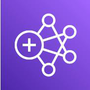{width="0.8319444444444445in"
height="0.8319433508311461in"} Özelleştirilmiş Amazon EC2 kümeleri,
Amazon EKS, AWS Outposts veya Amazon EMR Sunucusuz üzerinde çalıştırma
seçenekleriyle en yeni açık Büyük veri uygulamalarını ve petabayt
ölçeğinde veri analizlerini daha hızlı hale getirir. Şirket içi
çözümlerin yarısından daha az maliyetle çalıştırır.

> kaynaklı çerçeveleri kullanarak uygulamalar oluşturabilirsiniz.

Spark, Hive ve Presto\'nun performans için optimize edilmiş ve açık
kaynaklı API uyumlu sürümleriyle öngörülere 2 kata kadar daha hızlı
erişim imkânı sunmaktadır. EMR Studio\'daki EMR Notebooks\'u ve bilindik
açık kaynaklı araçları kullanarak uygulamalarınızı kolayca
geliştirmenize, görselleştirmenize ve uygulamalarınızdaki hataları
ayıklamanıza imkân sunmaktadır.

**3.1.4. Amazon FinSpace**\
{width="0.8319444444444445in"
height="0.8305544619422572in"} Amazon FinSpace, finansal hizmetler
endüstrisi (FSI - Financial Services Industry) için özel olarak
oluşturulmuş bir veri yönetimi ve analitik hizmetidir. FinSpace, analize
hazır olmak için petabaytlarca finansal veriyi bulmak ve hazırlamak için
harcadığınız süreyi aylardan dakikalara indirir.

Finansal hizmetler kuruluşları, portföy, aktüeryal ve risk yönetimi
sistemleri gibi dahili veri depolarından gelen verileri ve ayrıca
borsalardaki geçmiş menkul kıymet fiyatları gibi üçüncü

30

taraf veri akışlarından gelen petabaytlarca veriyi analiz eder. Doğru
verilerin bulunması, verilere uyumlu bir şekilde erişim izinlerinin
alınması ve analize hazırlanması aylar alabilir.

FinSpace, finansal analitik için bir veri yönetim sistemi oluşturmanın
ve sürdürmenin ağır yükünü ortadan kaldırır. FinSpace ile verileri
toplar ve varlık sınıfı, risk sınıflandırması veya coğrafi bölge gibi
ilgili iş kavramlarına göre kataloglarsınız. FinSpace, uyumluluk
gereksinimlerinize uygun olarak kuruluşunuz genelinde verileri
keşfetmeyi ve paylaşmayı kolaylaştırır. Veri erişim ilkelerinizi tek bir
yerde tanımlarsınız ve FinSpace, uyumluluk ve etkinlik raporlamasına
izin vermek için denetim günlüklerini tutarken bunları uygular. FinSpace
ayrıca analiz için veri hazırlamanız için zaman çubukları ve Bollinger
bantları gibi 100\'den fazla fonksiyondan oluşan bir kitaplık içerir.

**3.1.5. Amazon Kinesis**\
{width="0.8319444444444445in"
height="0.8305544619422572in"} Amazon Kinesis gerçek zamanlı akış
verilerini toplamayı, işlemeyi ve analiz etmeyi kolaylaştırır. Bu yüzden
zamanında öngörüler elde edebilir ve yeni bilgilere hızlı tepki
verebilirsiniz. Amazon Kinesis her ölçekteki akış verilerini uygun
maliyetle işlemeye yönelik önemli özellikler sunduğu gibi, uygulamanızın
gereksinimlerine en uygun araçları seçme esnekliği de getirir.

Amazon Kinesis ile makine öğrenimi, analiz ve diğer uygulamalar için
video, ses, uygulama günlükleri, web sitesi tıklama akışları ve IoT
telemetri verileri gibi gerçek zamanlı veriler alabilirsiniz. Amazon
Kinesis gelen verileri hemen işlemenize, analiz etmenize ve bu verilere
anında yanıt vermenize olanak tanır. İşleme sürecinin başlaması için tüm
verilerinizin toplanmasını beklemek zorunda kalmazsınız.

**3.1.6. Amazon Managed Streaming for Apache Kafka (MSK)**\
{width="0.8319444444444445in"
height="0.8305555555555556in"} Yüksek oranda erişilebilir Apache Kafka
ve Kafka Connect kümelerinin tedariki, yapılandırması ve bakımı da
dahil, operasyonel iş yükünü ortadan kaldırır. Apache Kafka için
tasarlanan uygulama ve araçları olduğu gibi kullanmaya başlayabilir (kod
değişikliği gerekmez) ve küme kapasitesini otomatik olarak
ölçeklendirebilirsiniz.

Yerel AWS entegrasyonlarını kullanarak güvenli, uygun ve üretime hazır
uygulamaları kolayca dağıtabilirsiniz. Amazon MSK ile maliyetleri düşük
tutun. Kullandıkça öde fiyatlandırması ile diğer sağlayıcıların
maliyetinin 1/13\'ü kadar düşük bir fiyatla sunulur.

**3.1.7. Amazon OpenSearch Service**\
{width="0.8319444444444445in"
height="0.8305544619422572in"} çalıştırma imkânı sunar. İhtiyacınız
olanı kolaylıkla bulmak için yapılandırılmamış ve yarı yapılandırılmış
verilerinizde hızlı bir şekilde arama ve Amazon OpenSearch Service,
Amazon ElasticSearch servisi yerine geçmiştir.

> OpenSearch\'ü topluluk odaklı, açık kaynaklı yazılımın önde gelen
> destekçisi ile analiz yapabilirsiniz. Otomatik tedarik, yazılım
> yükleme, düzeltme eki

uygulama, depolama katmanlama ve daha fazlasıyla operasyonel iş yükünü
ortadan kaldırabilir ve maliyeti azaltabilirsiniz. Anormallikleri gerçek
zamanlı olarak tespit etmek, kümelerinizi otomatik olarak ayarlamak ve
arama sonuçlarınızı kişiselleştirmek için makine öğrenimini (ML)
kullanabilirsiniz.

31

**3.1.8. Amazon QuickSight**\
{width="0.8319444444444445in"
height="0.8319433508311461in"} Amazon QuickSight, kuruluşunuzdaki
herkesin doğal dilde sorular sorarak, etkileşimli panolar yoluyla
inceleme yaparak veya makine öğrenimi destekli düzenleri ve aykırı
değerleri otomatik olarak arayarak verilerinizi anlamasına olanak
sağlar. QuickSight, müşteriler için her hafta milyonlarca pano
görünümünü destekleyerek müşteri son kullanıcılarının veriye dayalı
kararları

daha sağlıklı şekilde almasına imkân verir.

**3.1.9. Amazon RedShift**\
{width="0.8319444444444445in"
height="0.8319444444444445in"} Herkes için kolay analizlerle verilerden
saniyeler içinde öngörüler elde etmeye odaklanın. Veri ambarı
altyapınızı yönetme konusunu düşünmek zorunda kalmazsınız. Operasyonel
veri tabanları, data-lake\'ler, veri ambarları ve üçüncü taraf veri
kümelerindeki tüm verilerinizi analiz edebilir. Sorgu hızını iyileştiren
otomasyon sayesinde uygun ölçekte diğer bulut veri ambarlarından 3 kata
kadar

daha iyi fiyat performansı elde etme imkânı bulursunuz.

**3.1.10. AWS Data Exchange**\
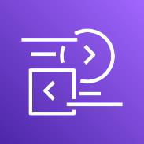{width="0.8319444444444445in"
height="0.8305555555555556in"} AWS Data Exchange, bulutta üçüncü taraf
verilerini bulmayı, kullanmayı ve bunlara abone olmayı kolaylaştırır.
Nitelikli veri sağlayıcılar arasında yılda birden fazla dilde 2,2
milyonun üzerinde benzersiz haber hikayesinden veri düzenleyen Reuters,
yılda 14 milyar sağlık hizmeti işlemi ve 1 trilyon USD alacak işleyen ve
anonimleştiren Change Healthcare, 330 milyondan fazla

küresel iş kaydından oluşan veri tabanının bakımını sağlayan Dun &
Bradstreet, 220 milyon benzersiz müşteriden konum verisi türeten ve 60
milyondan fazla küresel ticari mekân içeren Foursquare gibi kategori
liderleri vardır.

Bir veri ürününe abone olduktan sonra, AWS Data Exchange API\'sini
kullanarak verileri doğrudan Amazon Simple Storage Service\'e (S3)
yükleyebilir ve analiz etmek için bir dizi AWS analiz ve makine öğrenimi
(ML) hizmetinden yararlanabilirsiniz. Örneğin, mülk sigortacıları farklı
coğrafyalarda sigorta kapsama gereksinimlerini kalibre etme amacıyla
geçmiş hava durumu verilerine abone olabilir; restoranlar, genişleme
için ideal bölgeleri tanımlamak amacıyla nüfus ve konum verilerine abone
olabilir; akademik araştırmacılar, iklim değişikliği ile ilgili
çalışmalar yapmak için karbondioksit emisyon verilerine abone olabilir;
sağlık uzmanları, araştırma faaliyetlerini hızlandırmak için geçmiş
klinik çalışmalardan elde edilen toplu verilere abone olabilir.

AWS Data Exchange, veri sağlayıcıları için veri depolama, teslim etme,
faturalandırma ve yetkilendirme ihtiyacını ortadan kaldırarak buluta
geçen milyonlarca AWS müşterisine erişmeyi kolaylaştırır.

**3.1.11. AWS Data Pipeline**\
{width="0.8319444444444445in"
height="0.8305544619422572in"} AWS Data Pipeline, verilerinizi belirli
aralıklarla güvenilir bir şekilde işlemenize olanak sağlar. Farklı AWS
işlem ve depolama hizmetlerinin yanı sıra şirket içi veri kaynakları
arasında taşımanıza da yardımcı olan bir web hizmetidir. AWS Data
Pipeline ile verilerinize depolandıkları yerde düzenli olarak
erişebilir, uygun ölçekte dönüştürüp işleyebilir ve sonuçları Amazon S3,

Amazon RDS, Amazon DynamoDB ve Amazon EMR gibi AWS hizmetlerine
aktarabilirsiniz.

AWS Data Pipeline, kolayca hata toleranslı, yinelenebilir ve yüksek
oranda erişilebilir karmaşık veri işleme iş yükleri oluşturmanıza
yardımcı olur. Kaynakların erişilebilir olmasını sağlama, görevler arası
bağımlılıkları yönetme, tek tek görevlerde geçici hataları veya zaman
aşımlarını yeniden deneme ya da bir hata bildirim sistemi oluşturma
konusunda

32

endişelenmeniz gerekmez. AWS Data Pipeline, daha önce şirket içi veri
silolarında kilitli kalan verileri taşımanıza ve işlemenize de imkân
tanır.

**3.1.12. AWS Glue**\
{width="0.8319444444444445in"
height="0.8305544619422572in"} AWS Glue; analiz, makine öğrenimi ve
uygulama geliştirme için verilerin keşfedilmesini, hazırlanmasını ve
birleştirilmesini kolay hale getiren sunucusuz bir veri entegrasyonu
hizmetidir. AWS Glue, veri entegrasyonu için gereken tüm özellikleri
sunar ve böylece verilerinizi analiz etmeye başlayabilir. Bu sayede
aylar yerine dakikalar içinde verilerinizi kullanabilirsiniz.

Veri entegrasyonu; analiz, makine öğrenimi ve uygulama geliştirme için
verilerin hazırlanması ve birleştirilmesi işlemidir. Bu sürece farklı
kaynaklardan veri keşfetme ve çıkarma, verileri zenginleştirme,
temizleme, normalleştirme ve birleştirme; veri tabanlarından, veri
ambarlarında ve data-lake'lerde verilerin yüklenmesi ve düzenlenmesi
gibi birçok görev dâhildir. Bu görevler çoğu zaman farklı ürünler
kullanan farklı kullanıcı tipleri tarafından yürütülür.

AWS Glue, veri entegrasyonunu kolaylaştırmak için hem görsel hem kod
tabanlı arayüzler sağlar. Kullanıcılar AWS Glue Data Catalog kullanarak
verileri kolayca bulabilir ve bu verilere erişebilir. Veri mühendisleri
ve ETL (çıkarma, dönüştürme ve yükleme) geliştiricileri, AWS Glue Studio
içinde birkaç tıklamayla ETL iş akışlarını görsel olarak oluşturabilir,
yürütebilir ve izleyebilirler. Veri analizcileri ve veri bilimcileri,
kod yazmadan verileri görsel olarak zenginleştirmek, temizlemek ve
normalleştirmek için AWS Glue DataBrew'i kullanabilirler. Uygulama
geliştiricileri, farklı veri depolarında verileri birleştirmek ve
çoğaltmak için AWS Glue Elastic Views ile tanıdık yapısal sorgulama dili
olan SQL'i kullanabilirler.

**3.1.13. AWS Lake Formation**\
{width="0.8319444444444445in"
height="0.8319433508311461in"} AWS Lake Formation, günler içinde güvenli
bir data-lake kurmanızı kolaylaştıran bir hizmettir. Data-lake, tüm
verilerinizi hem orijinal hem de analize hazır halinde depolayan,
merkezi, düzenlenmiş ve güvenli bir depodur. Data-lake, veri depolarını
ortadan kaldırmanızı, öngörü kazanmak ve daha iyi iş kararları vermek
için farklı analiz türlerini birleştirmenizi sağlar.

Günümüzde data-lake kurmak ve yönetmek birçok manuel, karmaşık ve zaman
alan görev içermektedir. Bu görevler çeşitli kaynaklardan veri
yüklemeyi, bu veri akışlarını izlemeyi, bölümler ayarlamayı, şifrelemeyi
açmayı ve anahtarları yönetmeyi, dönüşüm işlerini tanımlamayı ve
işlemlerini izlemeyi, verileri sütun biçiminde organize etmeyi, yedekli
verileri tekilleştirmeyi ve bağlantılı kayıtları eşleştirmeyi içerir.
Data-lake\'e veri yüklendikten sonra veri kümelerine ayrıntılı erişim
vermeniz, zaman içindeki erişimi çok çeşitli analiz ve makine öğrenimi
(ML) araçları, hizmetleri genelinde denetlemeniz gerekir.

Lake Formation ile data-lake oluşturmak veri kaynaklarını, hangi erişim
ve güvenlik politikalarını uygulamak istediğinizi tanımlamak kadar
basittir. Daha sonra Lake Formation, veri tabanlarından ve nesne
depolarından veri toplamanıza ve kataloglamanıza, veriyi yeni Amazon
Simple Storage Service (S3) data-lake\'inize taşımanıza, makine öğrenimi
algoritmalarını kullanarak verilerinizi temizlemenize ve
sınıflandırmanıza ve sütun, satır ve hücre düzeylerinde ayrıntılı
denetimler kullanarak hassas verilerinize erişimi güvenli hale
getirmenize yardımcı olur. Kullanıcılarınız, mevcut veri kümelerini ve
uygun kullanımlarını tanımlayan merkezi bir veri kataloğuna erişebilir.
Kullanıcılar daha sonra bu veri kümelerini Amazon Redshift, Amazon
Athena, Apache Spark için Amazon EMR ve Amazon QuickSight gibi tercih
ettikleri analiz ve makine öğrenimi hizmetleriyle birlikte kullanabilir.
Lake Formation, AWS Glue\'daki özellikler temel alınarak oluşturulur.

33

**3.2. AR ve VR Servisleri**\
**3.2.1. Amazon Sumerian**\
{width="0.8319444444444445in"
height="0.8319433508311461in"} dönüştürür. Amazon Sumerian hizmeti artık
yeni müşteriler kabul etmemektedir.

> Amazon Sumerian, müşterilerin Babylon.js kullanarak sahneler yazmasını
> ve AWS Amplify ile yayınlamasını sağlamak için, mevcut deneyim ve
> işlevselliği

**3.3. Ağ İletişimi ve İçerik Teslimi Servisleri**\
**3.3.1. Amazon CloudFront**\
{width="0.8319444444444445in"
height="0.8319433508311461in"} Verileri, otomatik ağ eşleme ve akıllı
yönlendirme içeren, küresel olarak dağıtılmış 310\'dan fazla varlık
noktası (PoP) aracılığıyla sunarak gecikme süresini azaltır. Trafik
şifreleme ve erişim denetimleri ile güvenliği iyileştirir ve AWS Shield
Standard\'ı kullanarak hiçbir ilave ücret ödemeden DDoS saldırılarına
karşı savunma sağlar. Birleştirilmiş istekler, özelleştirilebilir
fiyatlandırma seçenekleri ve sıfır ücretle AWS kaynaklarından dışarı
veri aktarımı ile maliyetleri azaltır. Maliyeti, performansı ve
güvenliği dengelemek için sunuların işlem özelliklerini kullanarak AWS
içerik teslim ağı (CDN) ucunda çalıştırılan kodu özelleştirme imkânı
sunar.

**3.3.2. Amazon Route 53**\
Amazon Route 53, yüksek oranda erişilebilir ve ölçeklenebilir bir bulut
etki alanı
{width="0.8319444444444445in"
height="0.8305555555555556in"} adı sistemi (DNS) web hizmetidir.
"www.example.com" gibi adları bilgisayarların birbirine bağlanmak için
kullandığı 192.0.2.1 gibi sayısal IP adreslerine çevirerek
geliştiricilerin ve işletmelerin son kullanıcıları internet
uygulamalarına yönlendirmesi için son derece güvenilir ve uygun
maliyetli bir yöntem sunacak şekilde tasarlanmıştır. Amazon Route 53,
IPv6 ile de tam olarak uyumludur.

Amazon Route 53, kullanıcı isteklerini Amazon EC2 bulut sunucuları,
Elastic Load Balancing yük dengeleyicileri veya Amazon S3 klasörleri
gibi AWS\'de çalışan altyapılara etkili bir şekilde bağlar ve
kullanıcıları AWS dışındaki altyapılara yönlendirmek için de
kullanılabilir. Amazon Route 53\'ü kullanarak DNS durum denetimlerini
yapılandırabilir ve ardından Route 53 uygulama kurtarma denetleyicisi
ile uygulamanızın hatalardan kurtarma özelliğini sürekli olarak
izleyebilir ve uygulama kurtarma işlemini kontrol edebilirsiniz.

Amazon Route 53 trafik akışı, trafiği gecikme süresi tabanlı
yönlendirme, coğrafi DNS, coğrafi yakınlık ve ağırlıklı gidiş-dönüş
dahil olmak üzere çeşitli yönlendirme türleri üzerinden yönetmenizi
kolaylaştırır. Bunların tümü, çeşitli düşük gecikme süreli, hataya
dayanıklı mimariler oluşturulabilmesi için DNS yük devretme ile
birleştirilebilir. Amazon Route 53 trafik akışının basit görsel
düzenleyicisini kullanarak son kullanıcılarınızın tek bir AWS bölgesinde
ya da dünyanın farklı yerlerinde olmasından bağımsız olarak
uygulamalarınızın uç noktalarına nasıl yönlendirildiğini kolayca
yönetebilirsiniz. Amazon Route 53 ayrıca etki alanı adı kaydı da sunar.
"example.com" gibi etki alanı adları satın alıp yönetebilirsiniz ve
Amazon Route 53, etki alanlarınızın DNS ayarlarını otomatik olarak
yapılandırır.

34

**3.3.3. Amazon Virtual Private Cloud -- VPC (Sanal Özel Bulut)**\
{width="0.8319444444444445in"
height="0.8319433508311461in"} Bağlantıları koruma altına almanızı ve
izlemenizi sağlar, trafiği tarar ve sanal ağdaki bulut sunucularına
erişimi kısıtlayabilir. Sanal ağı oluşturmak, yönetmek ve doğrulamak
için daha az zaman harcamanızı hedefler. Kendi IP adresi aralığınızı
seçerek, alt ağlar oluşturarak ve yol tablolarını yapılandırarak sanal
ağınızı özelleştirebilirsiniz.

**3.3.4. AWS App Mesh**\
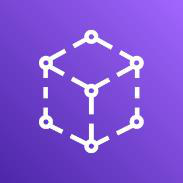{width="0.8319444444444445in"
height="0.8319444444444445in"} iletişimi sağlayan bir hizmet ağıdır. App
Mesh, uygulamalarınız için uçtan uca görünürlük ve yüksek düzeyde
erişilebilirlik sağlar.

> AWS App Mesh; hizmetlerinizin, birden çok türdeki işlem altyapısı
> üzerinde birbiriyle iletişim kurmasını kolaylaştırmak için uygulama
> düzeyinde ağ

Modern uygulamalar genellikle birden fazla hizmetten oluşur. Her bir
hizmet; Amazon EC2, Amazon ECS, Amazon EKS ve AWS Fargate gibi birden
çok türde işlem altyapısı kullanılarak oluşturulabilir. Bir uygulamadaki
hizmet sayısı arttıkça hataların yerini tam olarak tespit etmek,
hatalardan sonra trafiği yeniden yönlendirmek ve kod değişikliklerini
güvenli bir şekilde dağıtmak zorlaşır. Önceden bunun için izleme ve
denetim mantığını doğrudan kodunuzda oluşturmanız ve her değişiklikte
hizmetinizi yeniden dağıtmanız gerekiyordu.

AWS App Mesh, tutarlı görünürlük ve ağ trafiği denetimleri sağlayarak,
ayrıca güvenli hizmetler sunmanıza yardımcı olarak hizmetleri
çalıştırmayı kolaylaştırır. App Mesh, izleme verilerinin nasıl
toplandığını veya trafiğin hizmetler arasında nasıl yönlendirildiğini
değiştirmek için uygulama kodunu güncelleme ihtiyacını ortadan kaldırır.
App Mesh, her hizmeti izleme verilerini dışarı aktaracak şekilde
yapılandırır ve uygulamanız genelinde tutarlı iletişim denetim mantığı
uygular.

App Mesh\'i AWS Fargate, Amazon EC2, Amazon ECS, Amazon EKS ve AWS\'de
çalışan Kubernetes ile kullanarak uygulamanızı geniş ölçekte daha iyi
çalıştırabilirsiniz. App Mesh, şirket içinde çalışan uygulamalarınız
için de AWS Outposts ile entegre olur. App Mesh, açık kaynaklı Envoy
proxy\'sini kullandığından, çok çeşitli AWS çözüm ortağı araçları ve
açık kaynaklı araçlar ile uyumludur.

**3.3.5. AWS Cloud Map**\
AWS Cloud Map bir bulut kaynak keşfi hizmetidir. Cloud Map ile uygulama
{width="0.8319444444444445in"
height="0.8319433508311461in"} kaynaklarınız için özel adlar
belirleyebilir ve dinamik olarak değişen bu kaynakların güncel
konumlarını saklayabilirsiniz. Bu, web hizmetiniz daima kaynakların en
güncel konumlarını keşfedeceği için uygulamanızın erişilebilirliğini
artırır.

Modern uygulamalar genel olarak bir API üzerinden erişilebilir olan ve
belirli bir işlevi yerine getiren çeşitli hizmetlerden oluşur. Her bir
hizmet; veri tabanları, kuyruklar, nesne depoları ve müşteri tarafından
belirlenen mikro hizmetler gibi çeşitli başka kaynaklarla etkileşime
girer. İşlevini yerine getirebilmek için bağımlı olduğu bütün altyapı
kaynaklarının yerini bulabilmeye ihtiyaç duyar. Pek çok durumda, bütün
bu kaynak adlarını ve konumlarını manuel olarak uygulama kodu içinde
yönetirsiniz. Öte yandan manuel kaynak yönetimi, bağımlı altyapı
kaynaklarının sayısı arttıkça ya da mikro hizmetlerin sayısı trafiğe
bağlı olarak dinamik bir şekilde arttıkça/azaldıkça zaman alan ve hataya
yatkın bir sürece dönüşür. Üçüncü taraf hizmet keşif ürünlerini de
kullanabilirsiniz ancak bunlar için ek yazılım ve altyapı yükleyip
yönetmeniz gerekir.

35

Cloud Map; veri tabanları, kuyruklar, mikro hizmetler ve başka bulut
kaynakları gibi uygulama kaynaklarını özel adlarla kaydedebilmenizi
sağlar. Cloud Map, konumun güncel olduğundan emin olmak için sürekli
olarak kaynakların durumunu kontrol eder. Daha sonra uygulama, uygulama
sürümüne ve dağıtım ortamına dayalı olarak ihtiyaç duyulan kaynakların
konumu için kayıt defterini sorgulayabilir.

**3.3.6. AWS Cloud WAN**\
{width="0.8319444444444445in"
height="0.8319444444444445in"} güvenliği artırabilir. Tüm ağınızı tek
bir gösterge panosunda (dashboard) görüntüleyebilmenizi sağlar.
Konumlarınızı ve kaynaklarınızı birbirine Karmaşıklığı azaltmak için AWS
ve şirket içi ağlarınızı birleştirebilirsiniz.

> Hassas ağ trafiğini günlük verilerden izole etmek için ağı bölümlere
> ayırarak bağlamak için AWS küresel ağını kullanır.

**3.3.7. AWS Direct Connect**\
{width="0.8319444444444445in"
height="0.8319444444444445in"} AWS\'ye doğrudan bağlanarak ve genel
interneti kullanmak zorunda kalmadan uygulama performansını
artırabilirsiniz. Verilerinizi birden çok şifreleme seçeneğiyle ağınız
ile AWS arasında taşırken verilerinizin güvenliğini sağlamış olursunuz.
AWS\'nin veri aktarımı için talep ettiği düşük ücretlerle ağ iletişimi
maliyetlerinizi azaltır.

**3.3.8. AWS Global Accelerator**\
{width="0.8319444444444445in"
height="0.8305555555555556in"} AWS Global Accelerator, Amazon Web
Services\'in küresel ağ altyapısını kullanarak kullanıcı trafiğinizin
performansını %60\'a kadar artıran bir ağ hizmetidir. AWS Global
Accelerator, internet tıkandığında paket kaybını, sapmayı ve gecikmeyi
sürekli olarak düşük tutmak için uygulamanızın yolunu optimize eder.

Global Accelerator ile, uygulamanız için sabit bir giriş noktası görevi
gören ve kullanılabilirliği artıran iki global statik genel IP sağlanır.
Arka uçta, kullanıcıya yönelik değişiklikler yapmadan Application Load
Balancer, Network Load Balancer\'lar, EC2 bulut sunucuları ve esnek
IP\'ler gibi AWS uygulama uç noktalarınızı ekleyin veya kaldırın. Global
Accelerator, uç nokta hatasını azaltmak için trafiğinizi otomatik olarak
iyi durumdaki en yakın uç noktanıza yeniden yönlendirir.

**3.3.9. AWS Private 5G**\
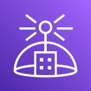{width="0.8319444444444445in"
height="0.8319444444444445in"} Özel bir 5G ağının düşük gecikme süresi
ve yüksek bant genişliği ile binlerce cihazı/makineyi birbirine bağlama
imkânı sunmaktadır. Uzun planlama döngüleri, karmaşık entegrasyonlar ve
otomatik kurulum olmadan ağınızı günler içinde kurup hemen sonrasında
çalıştırabilirsiniz. Tüm bağlı cihazlar için mevcut bilişim teknoloji
(BT) politikalarıyla bütünleşmiş ayrıntılı erişim kontrolleriyle ağınızı
güvence altına alırsınız. Ağ kapasitenizi isteğe bağlı olarak
ölçeklendirebilir veya birkaç tıklamayla cihaz ekleyip ve yalnızca
kullandığınız kapasite ve aktarım hızı için ödeme yaparsınız.

36

**3.3.10. AWS PrivateLink**\
AWS PrivateLink, trafiğinizi genel kullanıma yönelik internete açmadan
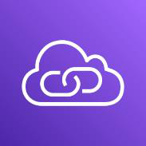{width="0.8319444444444445in"
height="0.8319433508311461in"} AWS PrivateLink, farklı hesaplar ve
VPC\'ler üzerinden hizmetlere bağlanmanızı kolaylaştırarak ağ mimarinizi
önemli ölçüde basitleştirir.

> VPC\'ler, AWS hizmetleri ve şirket içi ağlarınız arasında özel
> bağlantı sağlar.

AWS PrivateLink tarafından sağlanan VPC uç noktaları (end-points)
arabirimi, AWS çözüm ortakları tarafından sunulan hizmetlere ve AWS
Marketplace\'te bulunan çözümlere erişmenize olanak tanır. AWS
PrivateLink, Gateway Load Balancer uç noktalarını sağlayarak sanal ağ
gereçleriniz için aynı düzeyde güvenlik ve performans sağlar veya özel
trafik denetim mantığı sunar.

**3.3.11. AWS Transit Gateway**\
{width="0.8319444444444445in"
height="0.8305555555555556in"} karmaşık eşleme ilişkilerini sonlandırır.
Bulut yönlendiricisi olarak çalışır, her bağlantı yalnızca bir kez
yapılır.

> AWS Transit Gateway, Amazon Virtual Private Cloud'larınızı (VPCs) ve
> yerinde ağlarınızı bir merkez aracılığıyla bağlar. Ağınızı
> basitleştirir ve

Siz küresel olarak genişledikçe, bölgeler arası eşleme AWS küresel ağını
kullanarak AWS Transit Gateway'leri bağlar. Verileriniz otomatik olarak
şifrelenir ve asla herkese açık internette dolaşıma girmez. Ayrıca
merkezi konumundan dolayı AWS Transit Gateway Network Manager, yazılım
tabanlı geniş alan ağı (SD-WAN) cihazlarına bağlanırken bile ağınızın
tamamı üzerinde benzersiz bir görüşe sahiptir.

**3.3.12. AWS VPN**\
AWS VPN (Sanal Özel Ağ) çözümleri, şirket içi ağlarınız, uzak
ofisleriniz,
{width="0.8319444444444445in"
height="0.8319433508311461in"} AWS VPN iki hizmetten oluşur: AWS Siteden
Siteye (Site-to-Site) VPN ve AWS Client VPN. Her hizmet, ağ trafiğinizi
korumak için yüksek düzeyde istemci cihazlarınız ve AWS küresel ağı
arasında güvenli bağlantılar kurar.

kullanılabilir, yönetilen ve esnek bir bulut VPN çözümü sağlar. AWS
Siteden Siteye VPN, ağınız ile Amazon Virtual Private Cloud\'larınız
veya AWS Transit Gateway\'leriniz arasında şifreli tüneller oluşturur.
AWS Client VPN, uzaktan erişimi yönetmek için bir VPN yazılım istemcisi
kullanarak kullanıcılarınızı AWS\'ye veya şirket içi kaynaklara bağlar.

**3.3.13. Elastic Load Balancing (ELB)**\
Uygulamaların ölçeklenebilirliğini iyileştirmek için ağ trafiğini
dağıtmanıza
{width="0.8319444444444445in"
height="0.8305544619422572in"} imkân sunar. Bütünleşmiş sertifika
yönetimi, kullanıcı kimlik doğrulaması ve SSL/TLS şifre çözme ile
uygulamalarınızın güvenliğini sağlayan hizmetleri sunar. Uygulamaları
yüksek erişilebilirlik ve otomatik ölçeklendirme ile sunmanızı sağlar.
Uygulamalarınızın durumunu ve performansını gerçek zamanlı olarak
izleyebilir, sorunları ortaya çıkarın ve SLA uygunluğunu
sürdürebilirsiniz.

37

**3.4. Block Zinciri Servisleri**\
**3.4.1. Amazon Managed Blockchain**\
{width="0.8319444444444445in"
height="0.8305555555555556in"} Amazon Managed Blockchain, genel ağlara
katılmayı veya popüler açık kaynak çerçeveler olan Hyperledger Fabric ve
Ethereum\'u kullanarak ölçeklenebilir özel ağlar oluşturmayı ve
yönetmeyi kolaylaştıran, tam olarak yönetilen bir hizmettir. Blok
zinciri, birden fazla tarafın güvenilen merkezi bir otoriteye ihtiyaç

duymadan işlemler yürütebileceği uygulamalar oluşturmasını mümkün kılar.
Günümüzde mevcut teknolojilerle ölçeklenebilir bir blok zinciri ağı
oluşturmak, kurmak ve yönetmek zor ve karmaşık bir süreçtir. Bir blok
zinciri ağı oluşturmak için her ağ üyesinin manuel olarak donanım
tedarik etmesi, yazılım yüklemesi, erişim denetimine yönelik
sertifikalar oluşturup yönetmesi ve ağ iletişimi bileşenlerini
yapılandırması gerekir. Ayrıca blok zinciri ağını çalışır duruma
getirdikten sonra altyapıyı sürekli olarak izlemeniz ve işlem isteği
sayısındaki artışlar veya ağa yeni üye katılması ya da üyelerin ağdan
ayrılması gibi değişikliklere göre ağı uyarlamanız gerekir.

Amazon Managed Blockchain sadece birkaç tıklamayla genel ağlara
katılmanıza veya ölçeklenebilir özel ağlar kurup yönetmenize olanak
sağlayan, tam olarak yönetilen bir hizmettir. Amazon Managed Blockchain,
ağ oluşturmak veya bir genel ağa katılmak için gerekli iş yükünü ortadan
kaldırır ve milyonlarca işlem çalıştıran binlerce uygulamanın
taleplerini karşılayacak şekilde otomatik olarak ölçeklenir. Managed
Blockchain, ağınız hazır ve çalışır hale geldikten sonra blok zinciri
ağınızı yönetmenizi ve bakım işlemlerini yürütmenizi kolaylaştırır.
Sertifikalarınızı yönetir ve kolayca yeni üyeleri ağa katılmaya davet
etmenizi sağlar.

**3.4.2. Amazon Quantum Ledger Database (Amazon QLDB)**\
{width="0.8319444444444445in"
height="0.8305544619422572in"} Yerleşik kriptografik doğrulama, veri
değişikliklerinin üçüncü taraf doğrulamasını sağlar. QLDB ACID işlemleri
Amazon Kinesis\'e gerçek zamanlı Değiştirilemez ve şeffaf bir günlük
kullanarak her uygulama veri değişikliğinin sıralı bir geçmişini izler
ve muhafaza eder. Verilerinizin bütünlüğüne güvenir.

> akış desteği ile doğru, olaya dayalı sistemler oluşturabilir. Otomatik
> depolama

ve kaynak ölçeklendirme sağlayan sunucusuz mimariyle küçük başlayıp ve
yalnızca kullandığınız kadar ödeme seçeneğiniz bulunur.

**3.5. Bulut Finansal Yönetim Servisleri**\
**3.5.1. AWS Budgets**\
{width="0.8319444444444445in"
height="0.8305544619422572in"} İşletmeler ve kuruluşlar, bulut
maliyetlerine ilişkin planlar oluşturmaya ve beklentileri belirlemeye
ihtiyaç duyar. Bununla beraber bulut çevikliği, kullanımınızın dinamik
doğasına ayak uydurmak için, tahmini hesaplama süreçlerinizi ve
araçlarınızı uyarlamanızı gerektirir. Özel bütçeler oluşturabilir,
maliyetinizin ve kullanımınızın nasıl ilerlediğini takip eder ve maliyet
ya da kullanım eşik değeri aşıldığında hızlıca müdahale edebilirsiniz.

AWS Budgets, maliyetinizi ve kullanımınızı en basitten en karmaşık
kullanım örneklerine kadar izleyebilmeniz için özel bütçeler
ayarlamanıza olanak tanır. AWS Budgets\'ta, gerçek veya tahmini
maliyetiniz ve kullanımız, bütçe eşiğinizi aştığında ya da gerçek
rezerve edilmiş bulut sunucusu ve "Savings Plans" kullanımınız veya
kapsamınız, istediğiniz eşiğin altına düştüğünde e-posta veya SNS
bildirimi ile uyarı almayı seçebilirsiniz. AWS Budget Actions\'ta,
hesaplarınızdaki maliyet ve kullanım durumuna müdahale etmek için
belirli eylemler de yapılandırabilirsiniz. Böylece, maliyetiniz veya
kullanımınız eşiği aşarsa ya da aşacağı

38

öngörülürse istenmeyen aşırı harcamanın azaltılması için otomatik olarak
ya da onayınızla eylemler gerçekleştirilebilir.

**3.5.2. AWS Cost and Usage Report (CUR)**\
AWS Cost & Usage Report; AWS hizmetleri, fiyatlandırma, kredi, ücretler,
{width="0.8319444444444445in"
height="0.8319444444444445in"} "Savings Plans" hakkındaki ek meta
veriler dahil olmak üzere mevcut en kapsamlı AWS maliyet ve kullanım
veri kümesini içerir.

> vergiler, indirimler, maliyet kategorileri, rezerve edilmiş bulut
> sunucuları ve

AWS Cost & Usage Report (CUR); ürün koduna, kullanım türüne ve işleme
göre kullanımın hesap veya kuruluş düzeyinde kalem dökümünü sağlar. Bu
maliyetler ayrıca maliyet tahsisi etiketlerine ve Cost Categories\'e
göre düzenlenebilir. AWS Cost & Usage Report; saatlik, günlük veya aylık
ayrıntı düzeyinin yanı sıra yönetim ya da üye hesabı düzeyinde
oluşturulabilir. Doğru erişim yetkilerine sahip olmak kaydıyla,
kullanıcılar yönetim ve üye hesabı düzeyinde Cost & Usage Report\'a
erişebilir. Bu sayede yönetim hesabı sahipleri, üye hesapları için Cost
& Usage Report oluşturmak zorunda kalmaz.

**3.5.3. AWS Cost Explorer**\
AWS Cost Explorer, zaman içindeki AWS maliyetlerinizi ve kullanımınızı
{width="0.8319444444444445in"
height="0.8319433508311461in"} görselleştirmenize, anlamanıza ve
yönetmenize olanak tanıyan, kullanımı kolay bir arabirime sahiptir.
Maliyet ve kullanım verilerini analiz eden özel raporlar oluşturarak
hızlıca

kullanmaya başlayabilirsiniz. Verilerinizi yüksek bir düzeyde (örneğin
tüm hesaplarda toplam maliyet ve kullanım) analiz edebilir veya
trendleri belirlemek, maliyetleri artıran unsurları tespit etmek ve
anormallikleri saptamak için maliyet ve kullanım verilerinizi daha
derinlemesine inceleme imkânı sunar.

**3.5.4. Rezerve Edilmiş Bulut Sunucusu (RI) Raporlama**\
"Rezerve Edilmiş Bulut Sunucusu" kullanım ve kapsam raporları, AWS Cost
{width="0.8319444444444445in"
height="0.8305544619422572in"} sunucuları için özel kullanım ve kapsam
hedefleri belirleyebilir, hedefiniz doğrultusunda kaydettiğiniz
ilerlemeyi görselleştirebilir ve istek üzerine Explorer\'da hazır olarak
bulunur. Bu raporları kullanarak rezerve edilmiş bulut fiyatlara kıyasla
ne kadar tasarruf ettiğinize ilişkin bilgilere erişebilirsiniz.

Buradan, size sunulan filtreleme boyutlarını (hesap, bulut sunucusu
tipi, kapsam vb.) kullanarak temeldeki verileri daraltabilir ve bu
sayede rezervasyonlarınız hakkında daha fazla bilgiye ulaşabilirsiniz.

**3.5.5. Savings Plans**\
{width="0.8319444444444445in"
height="0.8305544619422572in"} Savings Plans, bir veya üç yıllık bir
süreliğine belirli bir kullanım taahhüdü (USD/saat şeklinde hesaplanan)
karşılığında istek üzerine fiyatlandırmaya kıyasla daha düşük fiyatlar
sunan esnek bir fiyatlandırma modelidir. AWS üç tür Savings Plans sunar;
Compute Savings Plans, EC2 Instance Savings Plans, ve Amazon SageMaker
Savings Plans. Compute Savings Plans, Amazon EC2, AWS Lambda ve AWS
Fargate üzerindeki kullanımlar için geçerlidir. EC2 Instance Savings
Plans, EC2 kullanımı ve Amazon SageMaker Savings Plans ise Amazon
SageMaker kullanımı için geçerlidir. AWS Cost Explorer\'da kolayca 1
veya 3 yıllık dönem için Savings Plans\'e kaydolabilir ve önerilerden,
performans raporlama olanaklarından ve bütçe uyarılarından faydalanarak
planlarınızı kolayca yönetebilirsiniz.

39

**3.6. Container Servisleri**\
**3.6.1. Amazon Elastic Container Registry (Amazon ECR)**\
{width="0.8319444444444445in"
height="0.8319433508311461in"} Görüntüleri otomatik şifreleme ve erişim
denetimleriyle "güvenli köprü metni aktarım protokolü" (HTTPS) üzerinden
güvenli bir şekilde paylaşıp ve Container görüntülerini altyapı
yüklemeden veya ölçeklendirmeden Amazon ECR\'ye aktarıp ve herhangi bir
yönetim aracını kullanarak çekebilirsiniz.

indirebilirsiniz. Ölçeklenebilir, dayanıklı bir mimari kullanarak
görüntülerinize daha hızlı erişir ve görüntülerinizi daha hızlı dağıtır.
Bununla beraber indirme sürelerini azaltır ve erişilebilirliği
iyileştirirsiniz.

**3.6.2. Amazon Elastic Container Service (Amazon ECS)**\
Tercih ettiğiniz sürekli entegrasyon ve sürekli teslim (CI/CD) ile
otomasyon
{width="0.8319444444444445in"
height="0.8319444444444445in"} Denetim düzlemini, düğümleri ve bulut
sunucularını yapılandırma gerekliliğini ortadan kaldırır, container\'lar
için AWS Fargate sunucusuz işlem sayesinde araçlarını kullanarak bulut
üzerinde binlerce "container" başlatabilirsiniz.

> zamanınızı optimize edebilirsiniz.

**3.6.3. Amazon Elastic Kubernetes Service (EKS)**\
VPC, ALB, EC2 Kubernetes çalışan düğümlerini (nodes) ve Amazon EKS\'yi
{width="0.8319444444444445in"
height="0.8305544619422572in"} yapılandırmanın birden fazla yolunu
keşfedebilirsiniz. Verimli işlem kaynak tedariki ve otomatik kubernetes
uygulama ölçeklendirmesiyle maliyetleri azaltır. Kümenizin denetim
düzlemine otomatik olarak uygulanan güvenlik düzeltme ekleriyle daha
güvenli bir kubernetes ortamı sağlar.

**3.6.4. AWS Copilot**\
{width="0.7986111111111112in"
height="0.7986111111111112in"} AWS Copilot, müşterilerin AWS\'de
kapsayıcılı uygulamaları hızla başlatmasına ve kolayca yönetmesine
olanak tanıyan bir komut satırı arabirimidir (CLI). AWS Copilot,
müşterilerin hızlı bir şekilde devreye almasına yardımcı olmak için
yerleşik örnekler ve rehberli deneyimler de dahil olmak üzere basit bir
bildirime dayalı komut seti sağlar. Uygulama kodunuzu yazdıktan sonra
Copilot, bir kayıt

defterine gönderme, bir görev tanımı oluşturma ve bir küme oluşturma
dahil olmak üzere dağıtım yaşam döngüsündeki her adımı otomatikleştirir.
Geliştirici üretkenliğini artırmak ve kapsayıcıları bulutta çalıştırmayı
basitleştirmek için AWS\'nin en iyi uygulamalarını temel alan yeni
uygulamalar için varsayılan uygulama türleri sağlanır. Üretime hazır
hizmetleri başlatmak için ihtiyacınız olan tek şey AWS Copilot, bir AWS
hesabı ve kodunuzdur. AWS Copilot genel kullanıma sunulmuştur.

**3.6.5. AWS Fargate**\
{width="0.8319444444444445in"
height="0.8305555555555556in"} Altyapıyı değil, uygulamalarınızı dağıtıp
yönetmenizi sağlar. Fargate, sunucuları ölçeklendirme, düzeltme eki
uygulama, koruma altına alma ve yönetmeyi kapsayan operasyonel iş yükünü
ortadan kaldırır. Uygulamalarınızı, Amazon CloudWatch, Container
Insights gibi AWS hizmetlerini içeren yerleşik entegrasyonlarla
izleyebilirsiniz. Üçüncü taraf araçlarıyla ölçümler ve günlükler
toplamanızı sağlar.

40

**3.6.6. Red Hat OpenShift Service on AWS**\
AWS\'de Red Hat OpenShift Hizmeti (ROSA), OpenShift\'i kullanmak için
{width="0.8319444444444445in"
height="0.8319433508311461in"} bütünleşmiş bir deneyim sağlar.
OpenShift\'e zaten aşinaysanız, AWS\'deki dağıtımlar için tanıdık
OpenShift API\'lerinden ve araçlarından yararlanarak uygulama geliştirme
sürecinizi hızlandırabilirsiniz. ROSA ile güvenli ve ölçeklenebilir
uygulamaları daha hızlı oluşturmak için çok çeşitli AWS bilgi işlem,
veri tabanı, analitik, makine öğrenimi, ağ iletişimi, mobil ve diğer
hizmetleri kullanabilirsiniz. ROSA, kullandığın kadar öde saatlik ve
yıllık faturalandırma, %99,95 SLA ve AWS ile Red Hat\'in ortak
desteğiyle birlikte gelir. ROSA, küme yaşam döngüsü yönetimini Red Hat
ve AWS\'ye taşıyarak uygulamaları dağıtmaya ve yeniliği hızlandırmaya
odaklanmanızı kolaylaştırır. ROSA ile kapsayıcılı uygulamaları mevcut
OpenShift iş akışlarınızla çalıştırabilir ve yönetimin karmaşıklığını
azaltabilirsiniz.

**3.7. Depolama Servisleri**\
**3.7.1. Amazon Elastic Block Store (EBS)**\
{width="0.8319444444444445in"
height="0.8319444444444445in"} SAP, Oracle ve Microsoft ürünleri gibi
görev açısından kritik uygulamalar dahil olmak üzere birçok zorlu,
yüksek performans gerektiren iş yükü için hızlı bir şekilde
ölçeklendirir. Erişilebilirlik alanında (AZ\'ler) replikasyon dahil
%99,999 erişilebilirlik ve io2 "Block Express" birimleriyle %99,999
dayanıklılık ile hatalara karşı koruma sağlar. İş yükünüze en uygun
depolama alanını

seçebilirsiniz. Birimler, GB başına dolar maliyetinden en hızlı IOPS ve
aktarım hızı ile yüksek performansa kadar değişkenlik gösterir.

**3.7.2. Amazon Elastic File System (EFS)**\
{width="0.8319444444444445in"
height="0.8319444444444445in"} AWS işlem hizmetleri için paylaşılan
dosya sistemlerini basit ve hızlı bir şekilde oluşturup
yapılandırabilirsiniz. Tedarik, dağıtım, düzeltme eki uygulama veya
bakım gerekmez. Dosyalar eklendikçe, kaldırıldıkça dosya sisteminizi
otomatik olarak ölçeklendirir ve gerektiğinde daha yüksek aktarım hızı
seviyelerine çıkarır. Yalnızca kullandığınız depolama alanı için ödeme
yaparsınız ve sık

erişilmeyen dosyaları otomatik olarak taşıyarak maliyetleri %92\'ye
kadar azaltır. %99,999999999 (11 adet 9) dayanıklılık ve %99,99\'a (4
adet 9) kadar erişilebilirlik için tasarlanmış, tam olarak yönetilen
dosya sistemiyle dosyalarınıza güvenli ve güvenilir bir şekilde
erişirsiniz.

**3.7.3. Amazon FSx**\
Amazon FSx, bulutta zengin özelliklere sahip, yüksek performanslı dosya
{width="0.8319444444444445in"
height="0.8319433508311461in"} sistemlerini başlatmayı, çalıştırmayı ve
ölçeklendirmeyi kolay ve uygun maliyetli hale getirir. Güvenilirliği,
güvenliği, ölçeklenebilirliği ve geniş yetenekleriyle çok çeşitli iş
yüklerini destekler. Amazon FSx, yüksek performans ve daha düşük TCO
sağlamak için en son AWS bilgi işlem, ağ

iletişimi ve disk teknolojileri üzerine kurulmuştur. Tam olarak
yönetilen bir hizmet olarak, donanım sağlama, düzeltme eki oluşturma ve
yedekleme işlemlerini gerçekleştirerek uygulamalarınıza, son
kullanıcılarınıza ve işinize odaklanmanızı sağlar.

Yaygın olarak kullanılan dört dosya sistemi arasından seçim
yapabilirsiniz: NetApp ONTAP, OpenZFS, Windows Dosya Sunucusu ve Lustre.

41

**3.7.4. Amazon S3 Glacier**\
Veri arşivleme için amaca özel olarak tasarlanan Amazon S3 Glacier
depolama
{width="0.8319444444444445in"
height="0.8319433508311461in"} sınıfları en yüksek performansı, veri
alımında en fazla esnekliği ve bulutta arşiv depolama için en düşük
maliyeti sunar. Tüm S3 Glacier depolama sınıfları neredeyse sınırsız
ölçeklenebilirlik sağlar ve %99,999999999 (11 adet dokuz) oranında veri
dayanıklılığı hedefiyle tasarlanmıştır. S3 Glacier depolama sınıfları,
arşiv verilerinize en hızlı erişim ve bulutta en düşük maliyetli arşiv
depolama imkânı veren seçenekler sunar.

**3.7.5. Amazon Simple Storage Service (S3)**\
{width="0.8319444444444445in"
height="0.8319433508311461in"} Amazon S3, her yerden ve her boyutta
veriyi almak için oluşturula nesne depolama alanıdır. Amazon Simple
Storage Service (Amazon S3); sektör lideri ölçeklenebilirlik, veri
erişilebilirliği, güvenlik ve performans sunan bir nesne depolama
hizmetidir. Her büyüklükteki ve her sektörden müşteriler istedikleri
miktarda veriyi data-lake, bulut temelli ve mobil uygulamalar gibi
neredeyse her türlü kullanım örneği için depolayıp koruyabilir.

**3.7.6. AWS Backup**\
AWS Backup, verileri AWS hizmetleri ve hibrit iş yükleri genelinde tek
bir
{width="0.8319444444444445in"
height="0.8319433508311461in"} merkezden ve otomatik olarak korumanızı
sağlar. AWS Backup, uygun ölçekte veri korumayı daha da kolaylaştıran
uygun maliyetli, tam olarak yönetilen, politikalara dayalı bir hizmet
sunar. AWS Backup, veri korumaya yönelik mevzuata uygunluğunuzu veya iş
politikalarınızı destekleme konusunda da size

yardımcı olur. AWS Organizations ile birlikte AWS Backup, kuruluşunuzun
AWS hesapları ve kaynakları genelinde yedekleme işlemlerinizi
yapılandırmak, yönetmek ve kontrol etmek için veri koruma politikalarını
tek bir merkezden dağıtmanızı sağlar. Kaynaklar arasında Amazon Elastic
Compute Cloud (Amazon EC2) bulut sunucuları, Amazon Elastic Block Store
(Amazon EBS) birimleri, Amazon Simple Storage Service (Amazon S3)
klasörleri, Amazon Relational Database Service (Amazon RDS) veri
tabanları (Amazon Aurora kümeleri dahil), Amazon DynamoDB tabloları,
Amazon Neptune veri tabanları, Amazon DocumentDB (MongoDB uyumluluğuyla)
veri tabanları, Amazon Elastic File System (Amazon EFS) dosya
sistemleri, Amazon FSx for Lustre dosya sistemleri, Amazon FSx for
Windows File Server dosya sistemleri ve AWS Storage Gateway birimleri
ile şirket içinde ve VMware CloudTM on AWS\'de yer alan VMware iş
yükleri yer alır.

**3.7.7. AWS Snow Family**\
Uygulamalar günümüzde, hiç olmadığı kadar hızlı bir şekilde buluta
taşınıyor.

{width="0.8319444444444445in"
height="0.8319433508311461in"} ötesinde daha fazla özellik ve performans
gerektirmektedir. AWS; akıllı, gerçek zamanlı duyarlılık sağlamak ve
aktarılan veri miktarını daha Yeni bir uygulama kategorisi, bulut uç
konumunda, hatta ağ uç konumunun da

etkin hale getirmek amacıyla veri işleme ve analiz süreçlerini, verinin
oluşturulduğu konuma gerektiğince yaklaştıran uç altyapısı ve yazılımı
sağlar. Bu, AWS tarafından yönetilen donanım ve yazılımın AWS bölgeleri
(region) dışındaki konumlara ve hatta AWS Outposts\'un dışında
dağıtılmasını içerir.

AWS Snow Family; basit, veri merkezi bulunmayan ortamlarda ve tutarlı
bir ağ bağlantısının olmadığı yerlerde operasyonları yürütmeye ihtiyaç
duyan müşterilere yardımcı olur. AWS Snowcone, AWS Snowball ve AWS
Snowmobile\'dan oluşan Snow Ailesi, çoğu yerleşik işlem özelliklerine
sahip bir dizi fiziksel cihaz ve kapasite noktası sunar. Bu hizmetler,
eksabayt düzeyine kadar veriyi AWS\'nin içine ve dışına fiziksel olarak
aktarmaya yardımcı olur. Snow

42

Family cihazları, AWS\'ye aittir ve AWS tarafından yönetilir, ayrıca AWS
güvenlik, izleme, depolama yönetimi ve işlem özellikleriyle entegre
olur.

**3.7.8. AWS Storage Gateway**\
{width="0.8319444444444445in"
height="0.8305544619422572in"} Neredeyse sınırsız bulut depolama alanına
erişim ile şirket için uygulamalar oluşturmanızı sağlar. AWS\'nin
buluttaki çeviklik, ekonomi ve güvenlik özelliklerinden yararlanırken
şirket içi uygulamalara düşük gecikme süreli veri erişimi sağlar.
Kullanıcı ve uygulama iş akışlarını sürdürerek işinizde kesinti olmadan
şirket içi uygulamaların bulut destekli depolamaya erişmesini mümkün

kılar. Yeni depolama donanımı dağıtmadan kullanıcılara ve uygulamalara
neredeyse sınırsız bulut depolama alanı sunar. Şifreleme, denetim
günlüğü ve bir kez yaz çok kez oku (WORM) depolaması gibi önemli
özelliklerle uygunluk çalışmalarınızı destekleyebilirsiniz.

**3.7.9. CloudEndure Disaster Recovery**\
{width="0.8319444444444445in"
height="0.8319433508311461in"} Boştaki kurtarma sitesi kaynaklarını
kaldırarak maliyetlerden tasarruf edin ve tam olağanüstü durum kurtarma
siteniz için yalnızca gerektiğinde ödeme yapmanızı sağlar.
Uygulamalarınızı dakikalar içinde, en güncel durumlarından veya belirli
bir noktadan kurtarır. Özel beceriler olmadan çok çeşitli uygulamaları
test etmek, kurtarmak ve geri döndürmek için birleşik bir süreçten
yararlanır.

**3.8. Geliştirici Araçları Servisleri**\
**3.8.1. Amazon Corretto**\
{width="0.8319444444444445in"
height="0.8319444444444445in"} Amazon Corretto, Open Java Geliştirme
Seti'nin (OpenJDK) ücretsiz, çok platformlu, üretime hazır bir
dağıtımıdır. Corretto, performans iyileştirmeleri ve güvenlik
düzeltmeleri içeren uzun vadeli destekle birlikte gelir. Amazon,
Corretto'yu binlerce üretim hizmetinde dâhilî olarak çalıştırır ve
Corretto'nun, Java SE standardı ile uyumlu olduğu onaylanmıştır.
Corretto sayesinde Linux,

Windows ve macOS dâhil olmak üzere popüler işletim sistemlerinde Java
uygulamalarını geliştirebilir ve çalıştırabilirsiniz.

**3.8.2. AWS Cloud Control API**\
AWS Bulut Kontrol API\'leri, geliştiricilere hizmetleri sezgisel ve
açıklayıcı bir
{width="0.8319444444444445in"
height="0.8305555555555556in"} şekilde yönetmek için bir dizi
standartlaştırılmış CRUDL API\'sini kullanma yeteneği verir. AWS Cloud
Control API, geliştiricilere AWS ve AWS CloudFormation Public
Registry\'de listelenen üçüncü taraf bulut kaynaklarıyla çalışan
standartlaştırılmış API\'ler sağlar. AWS Cloud Control API, iş
ortaklarına

yeni AWS özelliklerini ve hizmetlerini genellikle piyasaya sürüldükleri
gün programlı olarak kullanıma sunma olanağı sağlar.

**3.8.3. AWS Cloud Development Kit**\
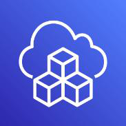{width="0.8319444444444445in"
height="0.8305555555555556in"} AWS Cloud Development Kit (AWS CDK),
bulut uygulaması kaynaklarınızı bilindik programlama dilleri kullanarak
tanımlamaya yönelik açık kaynaklı bir yazılım geliştirme çerçevesidir.
Bulut uygulamalarının tedariki, manuel eylemler gerçekleştirmenizi, özel
betikler yazmanızı, şablonları sürdürmenizi veya alana özgü diller
öğrenmenizi gerektiren zorlu bir süreç olabilir. AWS CDK,
uygulamalarınızın modellenmesi için programlama dillerinin bilindik
olmasından ve ifade gücünden yararlanır. Bulut uygulamalarını kolaylıkla

43

oluşturabilmeniz için bulut kaynaklarını işe yaradığı kanıtlanmış
varsayılan ayarlarla önceden yapılandıran ve yapı adı verilen üst düzey
bileşenler sağlar. AWS CDK, kaynaklarınızı AWS CloudFormation
aracılığıyla güvenli, tekrarlanabilir bir şekilde tedarik eder. Ayrıca,
kuruluşunuzun gereksinimleri dikkate alınarak tasarlanmış kendi özel
yapılarınızı oluşturma ve paylaşma olanağı sayesinde yeni projeleri
hızlandırmanıza yardımcı olur.

**3.8.4. AWS Cloud9**\
{width="0.8319444444444445in"
height="0.8319444444444445in"} WS Cloud9, yalnızca bir tarayıcıyı
kullanarak kodunuzu yazmanıza, çalıştırmanıza ve kodunuzdaki hataları
ayıklamanıza imkân tanıyan bulut tabanlı bir bütünleşmiş geliştirme
ortamıdır (IDE). Bir kod düzenleyicisi, hata ayıklayıcısı ve terminal
içerir. Cloud9, yeni projelere başlamadan önce dosyaları yüklemenize
veya geliştirme makinenizi yapılandırmanıza gerek kalmamasını

sağlamak için JavaScript, Python ve PHP gibi popüler programlama
dillerine yönelik temel araçlarla önceden paketlenmiş şekilde sunulur.
Cloud9 IDE\'niz bulut tabanlı olduğu için ofisinizden, evinizden ya da
dilediğiniz yerden İnternet\'e bağlı bir makine kullanarak projeleriniz
üzerinde çalışabilirsiniz. Sunucusuz uygulamalar geliştirmeye yönelik
sorunsuz bir deneyim de sunan Cloud9, sunucusuz uygulamalar için kolayca
kaynak tanımlamanıza, hataları ayıklamanıza ve yerel yürütme ile uzaktan
yürütme arasında geçiş yapmanıza imkân tanır. Cloud9 ile geliştirme
ortamınızı hızlıca ekibinizle paylaşabildiğiniz için eşli programlama
gerçekleştirebilir ve birbirinizin girişlerini gerçek zamanlı olarak
izleyebilirsiniz.

**3.8.5. AWS CloudShell**\
AWS CloudShell, AWS kaynaklarınızı güvenli bir şekilde yönetmeyi,
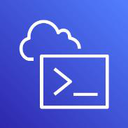{width="0.8319444444444445in"
height="0.8305555555555556in"} keşfetmeyi ve bunlarla etkileşim kurmayı
kolaylaştıran tarayıcı tabanlı bir kabuktur. CloudShell, konsol kimlik
bilgilerinizle önceden doğrulanmıştır. Ortak geliştirme ve operasyon
araçları önceden yüklenmiştir, bu nedenle yerel kurulum veya
yapılandırma gerekmez. CloudShell ile, AWS Komut Satırı

Arabirimi (AWS CLI) ile komut dosyalarını hızla çalıştırabilir, AWS
SDK\'larını kullanarak AWS hizmet API\'leriyle denemeler yapabilir veya
üretken olmak için bir dizi başka araç kullanabilirsiniz. CloudShell\'i
doğrudan tarayıcınızdan ve hiçbir ek ücret ödemeden kullanabilirsiniz.

**3.8.6. AWS CodeArtifact**\
{width="0.8319444444444445in"
height="0.8305555555555556in"} AWS CodeArtifact, her ölçekten kuruma,
yazılım geliştirme süreçlerinde kullanılan yazılım paketlerini güvenli
bir şekilde depolamaları, yayımlamaları ve paylaşmaları konusunda
kolaylık sağlayan tam olarak yönetilen bir yapıt deposu hizmetidir.
CodeArtifact, geliştiricilerin en son sürümlere erişebilmesi için genel
yapı havuzlarından yazılım paketlerini ve bağımlılıklarını otomatik

olarak alacak şekilde yapılandırılabilir. CodeArtifact, yaygın olarak
kullanılan paket yöneticileriyle çalışır ve Maven, Gradle, npm, yarn,
twine, pip ve NuGet gibi oluşturma araçlarıyla mevcut geliştirme iş
akışlarına entegrasyonu kolaylaştırır.

Geliştirme ekipleri genellikle hem açık kaynaklı yazılım paketlerini hem
de kuruluşları içinde oluşturulmuş paketleri kullanır. BT liderlerinin
bu yazılım paketlerine erişimi kontrol edebilmesi ve güvenliğini
doğrulayabilmesi gerekir. Ekipler, BT liderlerinin kullanılmak üzere
onayladığı güncel paketleri bulmak için bir yönteme ihtiyaç duyar. Bu
zorlukların üstesinden gelmek için BT liderleri, paketleri depolamak ve
paylaşmak için merkezi yapıt deposu hizmetlerine başvurur. Ancak mevcut
çözümler genellikle, ekiplerin kurulumu, ölçeklenmesi ve işletilmesi
karmaşık yazılım çözümleri için lisans satın almasını gerektirir.

44

AWS CodeArtifact, kuruluşun ihtiyaçlarına göre ölçeklenen, kullandıkça
öde yapıt deposu hizmetidir. CodeArtifact\'te, güncellenecek bir yazılım
veya yönetilecek bir sunucu yoktur. BT liderleri, yalnızca birkaç
tıklamayla geliştirme ekiplerinin ihtiyaç duydukları yazılım paketlerini
bulmasını ve kullanmasını kolaylaştıran merkezi havuzlar kurabilir. BT
liderleri ayrıca paketleri onaylayabilir ve kuruluş genelinde dağıtımı
kontrol edebilir, bu da geliştirme ekiplerinin güvenli yazılım paketleri
kullanmasını sağlar.

**3.8.7. AWS CodeBuild**\
Tam olarak yönetilen bir sürekli entegrasyon hizmeti olan AWS CodeBuild,
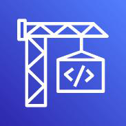{width="0.8319444444444445in"
height="0.8319444444444445in"} kaynak kodunu derler, çeşitli testler
çalıştırır ve dağıtıma hazır yazılım paketleri oluşturur. CodeBuild
sayesinde kendi derleme sunucularınızı tedarik etmeniz, yönetmeniz ve
ölçeklendirmeniz gerekmez. CodeBuild, derlemelerinizin kuyrukta çok
beklememesi için sürekli olarak ölçeklenir ve birden çok derlemeyi eş
zamanlı olarak işler. Önceden paketlenmiş derleme ortamlarını kullanarak
hızla çalışmaya başlayabilir veya kendi derleme araçlarınızı kullanan
özel derleme ortamları oluşturabilirsiniz. CodeBuild ile kullandığınız
işlem kaynakları için dakika başına ücret ödersiniz.

**3.8.8. AWS CodeCommit**\
{width="0.8319444444444445in"
height="0.8319433508311461in"} AWS CodeCommit, özel Git depoları
barındıran güvenli, yüksek düzeyde ölçeklendirilebilir, yönetilen bir
kaynak denetim hizmetidir. Ekiplerin, aktarım sırasında ve beklemedeyken
şifrelenmiş katkılarla kod üzerinde güvenli bir şekilde iş birliği
yapmasını kolaylaştırır. CodeCommit, kendi kaynak denetim sisteminizi
çalıştırma gereksiniminizi sona erdirerek bunun altyapısını
ölçeklendirme konusundaki endişelerinizi ortadan kaldırır. Koddan ikili
dosyalara kadar her şeyi depolamak için CodeCommit\'i kullanabilirsiniz.
Git\'in standart işlevini destekler ve böylece mevcut Git tabanlı
araçlarınızla sorunsuz bir şekilde çalışır.

**3.8.9. AWS CodeDeploy**\
AWS CodeDeploy; Amazon EC2, AWS Fargate, AWS Lambda ve şirket içinde
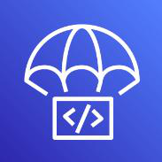{width="0.8319444444444445in"
height="0.8319433508311461in"} çalışan işlem hizmetlerine yazılım
dağıtımını otomatikleştiren ve tam olarak yönetilen bir dağıtım
hizmetidir. AWS CodeDeploy, hızla yeni özellikler yayınlamanızı
kolaylaştırır, uygulama dağıtımı sırasında kapalı kalma süresinden
kaçınmanıza yardımcı olur ve uygulamalarınızın güncellenmesi

sırasında karmaşık görevleri gerçekleştirir. AWS CodeDeploy ile yazılım
dağıtımlarını otomatikleştirerek manuel bir biçimde gerçekleştirilen,
hatalara açık işlemlere duyulan gereksinimi ortadan kaldırabilirsiniz.
Hizmet, dağıtım gereksinimlerinizi karşılayacak şekilde ölçeklenir.

**3.8.10. AWS CodePipeline**\
{width="0.8319444444444445in"
height="0.8305555555555556in"} AWS CodePipeline, hızlı ve güvenilir
uygulama ve altyapı güncellemeleri için yayın işlem hatlarınızı
otomatikleştirmenize yardımcı olan ve tam olarak yönetilen sürekli
teslim hizmetidir. CodePipeline, tanımladığınız yayın modeline göre bir
kod değişikliği gerçekleştiğinde yayın işleminizin derleme, test ve
dağıtım aşamalarını otomatikleştirir. Bu, yeni özellikleri ve
güncellemeleri hızla ve güvenilir bir şekilde teslim etmenize imkân
tanır. AWS CodePipeline'ı GitHub gibi üçüncü taraf hizmetlere veya kendi
özel eklentinize kolayca entegre edebilirsiniz. AWS CodePipeline ile
yalnızca kullandığınız kadar ödersiniz. Peşin ödeme veya uzun dönemli
taahhüt yoktur.

45

**3.8.11. AWS CodeStar**\
{width="0.8319444444444445in"
height="0.8319433508311461in"} AWS CodeStar, AWS\'de hızlı şekilde
uygulamalar geliştirmenize, oluşturmanıza ve dağıtmanıza olanak sağlar.
AWS CodeStar, birleşik bir kullanıcı arabirimi sağlayarak yazılım
geliştirme etkinliklerinizi tek bir yerden kolayca yönetmenize imkân
verir. AWS CodeStar ile sürekli teslim araç zincirinizin tamamını
dakikalar içinde ayarlayabilir, böylece daha hızlı kod

yayınlamaya başlayabilirsiniz. AWS CodeStar, tüm ekibinizin güvenli bir
şekilde birlikte çalışmasını kolaylaştırarak projelerinize erişimi
kolayca yönetmenizin yanı sıra sahipler, katkıda bulunan kişiler ve
görüntüleyiciler eklemenize imkân tanır. Her AWS CodeStar projesi,
Atlassian JIRA Software destekli bütünleşmiş bir sorun izleme özelliğini
içeren bir proje yönetim panosuyla sunulur. AWS CodeStar proje panosuyla
iş öğeleri kapsamınızdan ekiplerin son kod dağıtımlarına kadar yazılım
geliştirme sürecinizin tamamında ilerleme durumunu kolayca
izleyebilirsiniz.

**3.8.12. AWS Command Line Interface (CLI)**\
{width="0.8319444444444445in"
height="0.8305555555555556in"} çok AWS hizmetini komut satırından
kontrol edebilir ve betikler aracılığıyla otomatikleştirebilirsiniz.

> AWS Komut Satırı Arabirimi (CLI), AWS hizmetlerinizi yönetmek için
> kullanabileceğiniz birleşik bir araçtır. Tek bir aracı indirip
> yapılandırarak birden

**3.8.13. AWS Fault Injection Simulator**\
AWS Fault Injection Simulator, bir uygulamanın performansını,
gözlemlenme
{width="0.8319444444444445in"
height="0.8305555555555556in"} durumunu ve esnekliğini iyileştirmeyi
kolaylaştıran, AWS üzerinde hata yerleştirme deneyleri çalıştırmak için
tam olarak yönetilen bir hizmettir. Hata enjeksiyon deneyleri, CPU veya
bellek tüketiminde ani artış, sistemin nasıl tepki verdiğini gözlemleme
ve iyileştirmeler uygulama gibi yıkıcı olaylar yaratarak

test veya üretim ortamlarında bir uygulamayı vurgulama uygulaması olan
kaos mühendisliğinde kullanılır. Hata yerleştirme deneyi, ekiplerin
gizli hataları ortaya çıkarmak, kör noktaları izlemek ve dağıtılmış
sistemlerde bulunması zor performans darboğazlarını ortaya çıkarmak için
gereken gerçek dünya koşullarını yaratmasına yardımcı olur.

Fault Injection Simulator, ekiplerin uygulama davranışlarında güven
oluşturabilmesi için bir dizi AWS hizmetinde kontrollü hata ekleme
deneyleri kurma ve çalıştırma sürecini basitleştirir. Fault Injection
Simulator ile ekipler, istenen kesintileri oluşturan önceden
oluşturulmuş şablonları kullanarak deneyleri hızla kurabilir. Fault
Injection Simulator, belirli koşullar karşılandığında otomatik olarak
geri alma veya denemeyi durdurma gibi ekiplerin üretimde deneyler
yürütmesi için ihtiyaç duyduğu kontrolleri ve korkulukları sağlar.
Ekipler, konsolda birkaç tıklamayla, zaman içinde paralel veya sıralı
olarak meydana gelen yaygın dağıtılmış sistem arızaları ile karmaşık
senaryolar çalıştırabilir ve gizli zayıflıkları bulmak için gerekli
gerçek dünya koşullarını yaratmalarına olanak tanır.

**3.8.14. AWS X-Ray**\
AWS X-Ray, yazılım geliştiricilerin üretimi ve dağıtılmış uygulamaları
(ör.

{width="0.8319444444444445in"
height="0.8305544619422572in"} hatalarını ayıklamasına yardımcı olur.
X-Ray ile, performans sorunlarının ve hataların kök nedenini belirlemek
ve sorunlarını gidermek için uygulamanızın mikro hizmetler mimarisi
kullanılarak oluşturulanlar) analiz edip bunların ve temel hizmetlerinin
nasıl performans gösterdiğini anlayabilirsiniz. X-Ray, uygulamanızdan
geçen isteklerin uçtan uca görünümünü sunar ve uygulamalarınızın temel
bileşenlerinin bir haritasını gösterir. X-Ray'i kullanarak üç katmanlı
basit uygulamalardan

46

binlerce hizmet içeren karmaşık mikro hizmet uygulamalarına kadar birçok
uygulamayı hem geliştirme hem de üretim aşamasında analiz edebilirsiniz.

**3.9. Geçiş ve Aktarım Servisleri**\
**3.9.1. AWS Application Discovery Service**\
{width="0.8319444444444445in"
height="0.8319433508311461in"} AWS Application Discovery Service, şirket
içi veri merkezleri hakkında bilgi toplayarak kurumsal müşterilerin
geçiş projelerini planlamasına yardımcı olur. Veri merkezi geçişlerinin
planlanması, genellikle birbirine temelden bağımlı olan binlerce iş
yükünün hesaba katılmasını gerektirebilir. Sunucu kullanım

verileri ve bağımlılık eşlemesi, geçiş sürecinin önemli ilk
aşamalarıdır. AWS Application Discovery Service, iş yüklerinizi daha iyi
anlamanıza yardımcı olmak için sunucularınızdan yapılandırma, kullanım
ve davranış verilerini toplayıp sunar.

Toplanan veriler, AWS Application Discovery Service veri deposunda
şifrelenmiş biçimde saklanır. Bu verileri CSV dosyası olarak dışarı
aktarabilir ve AWS\'de çalıştırmanın toplam sahip olma maliyetini (TCO)
tahmin etmek ve AWS\'ye geçişinizi planlamak için kullanabilirsiniz. Bu
verilere AWS Migration Hub\'dan da erişilebilir. Burada, bulunan
sunucuları geçirebilir ve AWS\'ye geçiş süreci ilerlemelerini takip
edebilirsiniz.

**3.9.2. AWS Database Migration Service**\
AWS Database Migration Service (AWS DMS), veri tabanlarını AWS\'ye hızlı
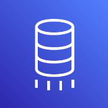{width="0.8319444444444445in"
height="0.8319444444444445in"} ve güvenli bir şekilde geçirmenize
yardımcı olur. Kaynak veri tabanı geçiş sırasında tamamen işlevsel kalır
ve veri tabanını kullanan uygulamaların kesinti süresini en aza indirir.
AWS Database Migration Service, en çok kullanılan ticari ve açık
kaynaklı veri tabanlarıyla çift yönlü olarak verilerinizin geçişini
gerçekleştirebilir.

AWS Database Migration Service, Oracle sistemleri arasında
gerçekleştirilen homojen geçişlerin yanı sıra Oracle veya Microsoft SQL
Server ile Amazon Aurora gibi farklı veri tabanı platformları arasında
gerçekleştirilen heterojen geçişleri de destekler. AWS Database
Migration Service ile, desteklenen herhangi bir kaynaktan desteklenen
herhangi bir hedefe düşük gecikmeyle verileri sürekli olarak
çoğaltabilirsiniz. Örneğin, yüksek oranda erişilebilir ve ölçeklenebilir
bir data-lake çözümü oluşturmak için birden fazla kaynaktaki verileri
Amazon Simple Storage Service\'a (Amazon S3) çoğaltabilirsiniz. Ayrıca
Amazon Redshift\'e veri akışı yaparak veri tabanlarını petabayt
ölçeğinde bir veri ambarında da birleştirebilirsiniz.

**3.9.3. AWS DataSync**\
{width="0.8319444444444445in"
height="0.8305555555555556in"} Veri şifreleme ve veri bütünlüğü
doğrulaması dahil olmak üzere uçtan uca güvenlik ile verilerinizi
güvenli bir şekilde AWS'ye taşımanızı sağlar. Veri yükleri arttıkça
sorunsuz bir şekilde ölçeklendirilen ve tam olarak yönetilen bir hizmet
ile yerinde veri taşıma maliyetini azaltır. Bant genişliğini daraltma,
geçiş programlama ve görev filtreleme ile veri taşıma iş yükünü
kolaylıkla

yönetilmesine yardımcı olur. Veri yineleme ve arşivleme için dosya ve
nesne verisini çok hızlı bir şekilde buluta geçirebilir.

47

**3.9.4. AWS Mainframe Modernization**\
{width="0.8319444444444445in"
height="0.8319433508311461in"} Geleneksel ana bilgisayarların donanım ve
personel maliyetlerini ortadan kaldırmak için uygulamalarınızı kolayca
taşıyabilir ve modernleştirir. Eski uygulamaları yeniden düzenlemek ve
dönüştürmek için altyapı, yazılım ve araçlarla uçtan uca geçişinizi
ayırır ve yönetir. Taşınan uygulamaları Mainframe Modernization
ortamında önceden maliyet olmadan dağıtabilir ve çalıştırabilir.

**3.9.5. AWS Migration Hub**\
{width="0.8319444444444445in"
height="0.8319444444444445in"} AWS ile yolculuğunuzu hızlandırmak ve
basitleştirmek için ihtiyaç duyduğunuz araçları sunan AWS Migration Hub,
buluta geçiş ve modernizasyon için tek adrestir. Kuruluşunuzda bulutun
gerekliliğini savunuyor veya mevcut BT varlıklarından oluşan veri
destekli bir envanter oluşturuyor olabilirsiniz. Belki de AWS\'ye geçiş
yapan uygulamaların portföyünü planlıyor, çalıştırıyor ve izliyorsunuz.
Veya halihazırda AWS\'de çalışan uygulamaları modernize ediyor
olabilirsiniz. Tüm bu durumlarda Migration Hub, bulut dönüşüm
yolculuğunuzda size yardımcı olabilir.

Migration Hub, herhangi bir AWS bölgesine geçişleri izlerken, BT varlığı
envanter verilerini depolamak için tek bir yer sağlar. Geçiş yaptıktan
sonra, uygulamalarınızın yerel AWS\'ye dönüşümünü hızlandırmak için
Migration Hub\'ı kullanabilirsiniz.

**3.9.6. AWS Server Migration Service**\
AWS Application Migration Service, buluta geçişinizi basitleştirir ve
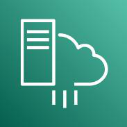{width="0.8319444444444445in"
height="0.8305544619422572in"} hızlandırır. Değişiklik olmadan ve
minimum kesinti süresi ile uygulamaları buluta geçirmenin avantajlarını
hızla fark etmenize olanak tanır. AWS Application Migration Service ile
uygulamalarınızı fiziksel altyapı, VMware vSphere, Microsoft Hyper-V,
Amazon Elastic Compute Cloud (AmazonEC2), Amazon Virtual Private Cloud
(Amazon VPC) ve diğer bulutlardan AWS\'ye geçirebilirsiniz.

**3.9.7. AWS Transfer Family**\
Mevcut kimlik doğrulama sistemlerinizi kullanarak dosya aktarımlarını
kolayca
{width="0.8319444444444445in"
height="0.8305544619422572in"} yönetin ve aktarım iş akışlarınızı
saatler için modernize edebilirsiniz. Tam olarak yönetilen, düşük kodlu
bir hizmetle bilgileri Amazon S3 veya Amazon EFS\'de depolayın, iş
akışlarını yönetin ve otomatik, olay odaklı görevleri
tetikleyebilirsiniz. Erişim denetimleriyle binlerce eş zamanlı
kullanıcıyı destekleyin ve her bir iş kolu kullanıcısı için işletmeler
arası (B2B) dosya aktarımlarınızı hızla ölçeklendirir. Güvenlik
gereksinimlerinizi veri şifreleme, VPC ve FIPS uç noktaları, uygunluk
sertifikaları ve daha fazlasıyla karşılar.

**3.9.8. AWS Application Migration Service**\
{width="0.8319444444444445in"
height="0.8305544619422572in"} AWS Uygulama Geçişi Hizmeti (AWS MGN),
değişiklik olmadan ve minimum kesinti süresi ile uygulamaları buluta
geçirmenin avantajlarını hızla fark etmenize olanak tanır. AWS
Application Migration Service, kaynak sunucularınızı fiziksel, sanal
veya bulut altyapısından AWS üzerinde yerel olarak çalışacak şekilde
otomatik olarak dönüştürerek uzun zaman alan ve hatalara açık olan
manuel süreçleri en aza indirir. Bu hizmet, aynı otomatikleştirilmiş
süreci geniş bir yelpazedeki uygulamalarda kullanmanıza olanak tanıyarak
geçişinizi daha da basitleştirir.

Geçiş öncesinde kesintiye yol açmayan testleri başlatarak da SAP, Oracle
ve SQL Server gibi en kritik uygulamalarınızın AWS üzerinde sorunsuz
çalışacağından emin olabilirsiniz.

48

**3.9.9. Migration Evaluator**\
{width="0.8319444444444445in"
height="0.8305555555555556in"} Kendi kendinize bir iş örneği oluşturmak
zaman alıcı bir süreç olabilir ve daima en uygun maliyetli seçenekleri
yansıtmayabilir. Geçiş yolculuğunuzun ilk adımı bir iş örneğidir.
Migration Evaluator\'da (eski adıyla TSO Logic) öngörülere ulaşabilir ve
AWS\'ye geçiş için karar verme sürecini hiçbir ücret ödemeden
hızlandırabilirsiniz. Veri toplama sürecinden sonra, şirket içi iş
yüklerinizi AWS

Cloud\'da çalıştırmaya yönelik tahmini maliyet ve tasarruf dahil olmak
üzere hızlıca bir değerlendirme alırsınız.

İlk değerlendirmenizi aldıktan sonra, ek öngörülere ihtiyaç duyulduğu
takdirde kuruluşunuz yönlendirici iş örnekleri oluşturmak üzere
Migration Evaluator ekibiyle birlikte çalışabilir. Ekip, geçiş
hedefinizi belirleyecek ve iş ihtiyaçlarınıza en uygun geçiş düzenlerini
bulmak için analiz kullanacaktır. Kuruluşunuz AWS uzmanlığına erişim,
birden fazla geçiş stratejisinin maliyetlerine yönelik görünürlük ve
mevcut yazılım lisanslarını yeniden kullanmanın maliyetleri nasıl daha
fazla azalttığına dair öngörüler elde eder. Sonuçlar, iş ve teknoloji
paydaşlarını daha uyumlu hale getirmek için şeffaf bir iş örneği
raporunda belirtilir ve geçiş yolculuğunuzdaki bir sonraki yönlendirici
adım sunulur.

**3.10. Güvenlik, Kimlik ve Uygunluk Servisleri**\
**3.10.1. Amazon Cognito**\
{width="0.8319444444444445in"
height="0.8305555555555556in"} Amazon Cognito, web ve mobil
uygulamalarınıza hızlı ve kolayca kullanıcı kaydı, oturum açma ve erişim
denetimi eklemenize olanak sağlar. Amazon Cognito, milyonlarca
kullanıcıya ölçeklenir ve Apple, Facebook, Google, Amazon gibi sosyal
kimlik sağlayıcılarının yanı sıra SAML 2.0 ve OpenID Connect
aracılığıyla kurumsal kimlik sağlayıcıları ile oturum açmayı destekler.

**3.10.2. Amazon Detective**\
Amazon Detective, olası güvenlik sorunlarını veya şüpheli etkinlikleri
analiz
{width="0.8319444444444445in"
height="0.8319444444444445in"} etmeyi, incelemeyi ve bunların temel
nedenini belirlemeyi kolaylaştırır. Amazon Detective, günlük verilerini
AWS kaynaklarınızdan otomatik olarak toplar, daha hızlı ve verimli
güvenlik araştırmaları yapmanızı sağlayan bağlantılı bir veri seti
oluşturmak için makine öğrenimi, istatistiksel analiz ve grafik
teorisini kullanır.

Amazon GuardDuty, Amazon Macie ve AWS Security Hub gibi AWS güvenlik
hizmetlerinin yanı sıra çözüm ortağı güvenlik ürünleri, olası güvenlik
sorunlarını veya bulgularını belirlemek için kullanılabilir. Bu
hizmetler, bir şeyler ters gittiğinde sizi uyarma ve bu sorunu düzeltmek
için nereye gideceğinizi belirtme konusunda son derece faydalıdır. Ancak
kimi zaman, temel nedeni yalıtmak ve harekete geçmek için daha derine
inmeniz ve daha fazla bilgiyi analiz etmeniz gereken bir güvenlik
bulgusu olabilir. Güvenlik bulgularının temel nedenini belirlemek,
genellikle pek çok farklı veri kaynağından günlüklerin toplanmasını ve
birleştirilmesini, verileri düzenlemek için ayıklama, dönüştürme ve
yükleme (ETL) araçlarını veya özel betik oluşturmayı ve ardından
güvenlik analistlerinin verileri analiz edip uzun araştırmalar yapmasını
içeren karmaşık bir süreç olabilir.

Amazon Detective, güvenlik ekiplerinizin kolayca araştırma yapmasını ve
bir bulgunun temel nedenine hızla ulaşmasını sağlayarak bu süreci
basitleştirir. Amazon Detective; Virtual Private Cloud (VPC) Akış
Günlükleri, AWS CloudTrail ve Amazon GuardDuty gibi birden çok veri
kaynağından trilyonlarca olayı analiz edebilir ve otomatik olarak
kaynaklarınız, kullanıcılarınız ve bunlar arasında zaman içinde
gerçekleşen etkileşimlere ilişkin birleştirilmiş, etkileşimli bir

49

görünüm oluşturur. Bu birleştirilmiş görünüm sayesinde, tüm ayrıntıları
ve bağlamı tek bir yerde görselleştirerek bulguların altında yatan
nedenleri belirleyebilir, ilgili geçmiş etkinlikleri ayrıntılı bir
şekilde inceleyebilir ve temel nedeni hızla belirleyebilirsiniz.

**3.10.3. Amazon GuardDuty**\
{width="0.8319444444444445in"
height="0.8319433508311461in"} tehditleri hızlı bir biçimde açığa
çıkarır. Otomatik yanıtları tetikleyerek tehditleri erken aşamalarda
hafifletir.

> Olası tehditleri sadece birkaç tıklamayla kuruluş çapında görünür hale
> getirir. AWS tehdit zekâsı, davranış modelleri ve üçüncü taraf
> güvenlik akışları ile

**3.10.4. Amazon Inspector**\
{width="0.8319444444444445in"
height="0.8305555555555556in"} Amazon Inspector, AWS üzerinde dağıtılmış
olan uygulamaların güvenlik ve mevzuat uyumluluğu seviyesini
geliştirmeye yardımcı olan otomatik güvenlik değerlendirmesi hizmetidir.
Amazon Inspector, uygulamaları güvenlik açıkları ve en iyi
uygulamalardan sapma açısından otomatik olarak değerlendirir. Bu
değerlendirmenin ardından Amazon Inspector, önem düzeyine göre

önceliklendirilmiş olan ayrıntılı bir güvenlik bulguları listesi
oluşturur. Bu bulgular doğrudan veya Amazon Inspector konsolu ya da API
aracılığıyla kullanıma sunulan ayrıntılı değerlendirme raporlarıyla
birlikte incelenebilir.

Amazon Inspector güvenlik değerlendirmeleri, Amazon EC2 bulut
sunucularınız için istenmeyen ağ erişimlerini ve bu EC2 bulut
sunucularındaki güvenlik açıklarını denetlemenize yardımcı olabilir.
Amazon Inspector değerlendirmeleri yaygın güvenlik en iyi uygulamaları
ve güvenlik açığı tanımlarına göre belirlenmiş önceden tanımlı kural
paketleri olarak sunulur. Yerleşik kuralların arasında EC2 bulut
sunucularınıza internet erişimin, uzaktan kök kullanıcıyla oturum açma
özelliğinin etkin olup olmadığının veya güvenlik açığına sahip yazılım
sürümlerinin yüklenip yüklenmediğinin kontrolü gibi örnekler mevcuttur.
Bu kurallar AWS güvenlik araştırmacıları tarafından düzenli aralıklarla
güncellenir.

**3.10.5. Amazon Macie**\
{width="0.8319444444444445in"
height="0.8305544619422572in"} Amazon Macie, AWS\'deki hassas
verilerinizi keşfetmek ve korumak için makine öğrenimi ve desen eşlemeyi
kullanan, tamamen yönetilen bir veri güvenliği ve veri gizliliği
hizmetidir. Kuruluşlar giderek artan veri hacimlerini yönetirken uygun
ölçekte hassas verilerini tanımlamak ve korumak her geçen gün daha
karmaşık, pahalı ve zaman alan bir iş olabilir. Amazon Macie, uygun
ölçekte hassas verilerin keşfedilmesini otomatik hale getirir ve
verilerinizi koruma maliyetini düşürür. Macie, AWS Organizations\'da
tanımladıklarınız hariç olmak üzere şifrelenmemiş klasörler, genel
erişime açık klasörler ve AWS hesaplarıyla paylaşılan klasörlerin bir
listesini içeren bir Amazon S3 klasörleri envanterini otomatik olarak
sağlar. Ardından Macie, makine öğrenimi ve desen eşleme tekniklerini
tanımlanması için seçtiğiniz klasörlere uygular ve kişiyi tanımlayabilir
bilgiler (PII) gibi hassas veriler konusunda sizi uyarır.

Macie\'nin uyarıları veya bulguları, AWS Management Console\'da aranıp
filtrelenebilir ve mevcut iş akışları ya da olay yönetimi sistemleriyle
kolay entegrasyon için daha önce Amazon CloudWatch Events olarak
adlandırılan Amazon EventBridge\'e gönderilebilir. Ayrıca, otomatik
iyileştirme eylemlerini gerçekleştirmek için AWS Step Functions gibi AWS
hizmetleriyle birlikte kullanılabilir. Bu, Sağlık Sigortası
Taşınabilirlik ve Sorumluluk Yasası

50

(HIPAA) ve Genel Veri Gizliliği Yönetmeliği (GDPR) gibi düzenlemeleri
karşılamaya yardımcı olabilir.

**3.10.6. AWS Artifact**\
{width="0.8319444444444445in"
height="0.8305555555555556in"} AWS Artifact, sizin için önemli olan
uyumlulukla ilgili bilgiler için gideceğiniz merkezi kaynağınızdır.
AWS\'nin güvenlik ve uyumluluk raporları ile bazı çevrimiçi anlaşmalara
isteğe bağlı erişim sunar. AWS Artifact\'te yer alan raporlar hizmet
kuruluşu denetimi (SOC) raporları, payment card industry (PCI) raporları
ve AWS güvenlik denetimlerinin uygulama ve işletme etkililiğini

doğrulayan coğrafyalar ve uyumluluk dikey öğelerinde akreditasyon
kuruluşlarından alınan sertifikaları içerir. AWS Artifact\'te yer alan
anlaşmalar iş ortağı ekini (BAA) ve gizlilik anlaşmasını (NDA) içerir.

**3.10.7. AWS Audit Manager**\
{width="0.8319444444444445in"
height="0.8319433508311461in"} AWS Audit Manager, yönetmelikler ve
sektör standartları ile ilişkili riskleri ve uyumluluğu değerlendirme
şeklinizi basitleştirmek için AWS kullanımınızı sürekli olarak
denetlemenize yardımcı olur. Audit Manager, denetimlerde sıklıkla
yaşanan "herkes iş başına" manuel yaklaşımını azaltmak için kanıt
toplamayı otomatik hale getirir ve işiniz büyüdükçe bulutta denetim
yeteneğinizi ölçeklendirmenize olanak tanır. Politika, prosedür ve
faaliyetlerinizin (yani kontrollerin) etkin bir şekilde işleyip
işlemediğini değerlendirmek Audit Manager ile oldukça kolaydır. Bir
denetim yapma zamanı geldiğinde AWS Audit Manager, kontrollerinize
ilişkin paydaş incelemelerini yönetmenize yardımcı olur ve çok daha az
manuel çabayla denetime hazır raporlar oluşturmanızı sağlar.

AWS Audit Manager'ın önceden oluşturulmuş çerçeveleri, AWS
kaynaklarınızı CIS AWS Foundations Benchmark, "Genel Veri Koruma
Yönetmeliği" (GDPR) ve "Ödeme Kartı Sektörü Veri Güvenliği Standardı"
(PCI DSS) gibi sektör standartları veya yönetmeliklerdeki
gerekliliklerle eşleştirerek bulut hizmetlerinden elde edilen kanıtların
denetçi dostu raporlara dönüştürülmesine yardımcı olur. Ayrıca, kişisel
iş gereklilikleriniz için bir çerçeveyi ve kontrollerini tamamen
özelleştirebilirsiniz. Seçtiğiniz çerçeveye bağlı olarak Audit Manager,
AWS hesaplarınızdan ve kaynaklarınızdan ilgili kanıtları (kaynak
yapılandırma anlık görüntüleri, kullanıcı etkinliği ve uyumluluk
denetimi sonuçları gibi) sürekli olarak toplayan ve düzenleyen bir
değerlendirme başlatır.

**3.10.8. AWS Certificate Manager (ACM)**\
{width="0.8319444444444445in"
height="0.8319433508311461in"} AWS Certificate Manager, AWS
hizmetleriyle ve dahili bağlantılı kaynaklarınızla kullanmak üzere genel
ve özel "Güvenli Yuva Katmanı/Aktarım Katmanı Güvenliği" (SSL/TLS)
sertifikalarını kolayca tedarik etmenize, yönetmenize ve dağıtmanıza
olanak sağlayan bir hizmettir. SSL/TLS sertifikaları, ağ iletişimlerinin
güvenliğini sağlamak ve özel ağlar üzerindeki kaynakların yanı sıra
İnternet üzerinden web sitelerinin kimliğini oluşturmak için de
kullanılır. AWS Certificate Manager, kullanıcının kendisinin yaptığı
zaman alıcı SSL/TLS sertifikası satın alma, karşıya yükleme ve yenileme
işlemlerini ortadan kaldırır.

AWS Certificate Manager ile hızlı şekilde bir sertifika isteyip Elastic
Load Balancing, Amazon CloudFront dağıtımları ve Amazon API Gateway
üzerindeki API\'ler gibi, ACM ile bütünleşmiş AWS kaynaklarında
sertifikayı dağıtabilir ve AWS Certificate Manager\'ın sertifika
yenileme işlemlerini gerçekleştirmesini sağlayabilirsiniz. Aynı zamanda,
dahili kaynaklarınız için özel sertifikalar oluşturmanıza ve sertifika
yaşam döngüsünü merkezi olarak yönetmenize olanak sağlar.

51

**3.10.9. AWS CloudHSM**\
{width="0.8319444444444445in"
height="0.8305555555555556in"} AWS CloudHSM, AWS Bulut\'ta kendi
şifreleme anahtarlarınızı kolayca oluşturmanızı ve kullanmanızı sağlayan
bulut tabanlı donanım güvenlik modülüdür (HSM). CloudHSM ile FIPS 140-2
Düzey 3 doğrulamalı HSM\'leri kullanarak kendi şifreleme anahtarlarınızı
yönetebilirsiniz. CloudHSM tarafından PKCS\#11, Java Cryptography
Extensions (JCE) ve Microsoft CryptoNG (CNG) kitaplıkları gibi endüstri
standardı API\'ler kullanılarak uygulamalarınızla entegrasyon olanağı
sağlanır.

CloudHSM standartlarla uyumludur ve yapılandırmalarınıza bağlı olarak
tüm anahtarlarınızı piyasadaki diğer çoğu HSM\'ye aktarmanıza imkân
tanır. Donanım tedarik etme, yazılım düzeltme eki uygulama, yüksek
erişilebilirlik ve yedeklemeler gibi zaman alan yönetim görevlerinizi
otomatikleştiren, tam olarak yönetilen bir hizmettir. CloudHSM, peşin
maliyet olmaksızın isteğe bağlı bir biçimde HSM kapasitesini artırıp
azaltarak hızla ölçeklendirmenize de imkân tanır.

**3.10.10. AWS Directory Service**\
AWS Managed Microsoft Active Directory (AD) olarak da bilinen Microsoft
{width="0.8319444444444445in"
height="0.8305555555555556in"} Active Directory için AWS Directory
Service, dizin bilgilerini kullanan iş yüklerinizin ve AWS
kaynaklarınızın AWS'de yönetilen Active Directory\'i (AD) kullanmasına
imkân tanır. AWS Managed Microsoft AD, Microsoft AD\'nin kendisi temel
alınarak oluşturulmuştur ve mevcut Active

Directory\'nizdeki verileri bulutla eşitlemenizi ya da buluta
çoğaltmanızı gerektirmez. Standart AD yönetim araçlarını kullanabilir,
Grup İlkesi ve tek oturum açma gibi yerleşik AD özelliklerinden
yararlanabilirsiniz. AWS Managed Microsoft AD ile Amazon EC2 ve Amazon
RDS for SQL Server bulut sunucularını kolayca etki alanınıza katabilir
ve AWS End User Computing (EUC) hizmetlerini (Amazon WorkSpaces gibi) AD
kullanıcıları ve gruplarıyla kullanabilirsiniz.

**3.10.11. AWS Firewall Manager**\
AWS Güvenlik Duvarı Yöneticisi, AWS Organizations'taki hesaplarınız ve
{width="0.8319444444444445in"
height="0.8305555555555556in"} uygulamalarınız genelinde güvenlik duvarı
kurallarını merkezi olarak yapılandırmanıza ve yönetmenize olanak
tanıyan bir güvenlik yönetimi hizmetidir. Yeni uygulamalar
oluşturuldukça, AWS Firewall Manager, ortak bir güvenlik kuralları
kümesi uygulayarak yeni uygulamaları ve kaynakları

uyumluluğa getirmeyi kolaylaştırır. Artık, merkezi bir yönetici
hesabından güvenlik duvarı kuralları oluşturmak, güvenlik ilkeleri
oluşturmak ve bunları tüm altyapınız genelinde tutarlı, hiyerarşik bir
şekilde uygulamak için tek bir hizmetiniz var.

AWS Firewall Manager\'ı kullanarak Application Load Balancer\'larınız,
API Gateway\'leriniz ve Amazon CloudFront dağıtımlarınız için AWS WAF
kurallarını kolayca kullanıma sunabilirsiniz. Application Load
Balancer\'larınız, ELB Classic Load Balancer\'larınız, Elastic IP
Adresleriniz ve CloudFront dağıtımlarınız için AWS Shield Advanced
korumaları oluşturabilirsiniz. Ayrıca yeni Amazon Virtual Private Cloud
(VPC) güvenlik gruplarını yapılandırabilir ve Amazon EC2, Application
Load Balancer (ALB) ve ENI kaynak türleriniz için mevcut VPC güvenlik
gruplarını denetleyebilirsiniz. AWS Web Application Firewall
kuruluşunuzdaki hesaplar ve VPC\'ler arasında dağıtabilirsiniz. Son
olarak, AWS Güvenlik Duvarı Yöneticisi ile VPC\'lerinizi Amazon Route 53
çözümleyicileri DNS güvenlik duvarı kurallarıyla da
ilişkilendirebilirsiniz.

52

**3.10.12. AWS Identity and Access Management (IAM)**\
AWS Identity and Access Management (IAM), tüm AWS genelinde ayrıntılı
{width="0.8319444444444445in"
height="0.8305555555555556in"} erişim denetimi sağlar. IAM ile kimlerin
hangi hizmet ve kaynaklara hangi koşullarda erişebileceğini
belirleyebilirsiniz. IAM politikalarıyla, en az ayrıcalıklı izinleri
sunmak için iş gücünüze ve sistemlerinize ilişkin izinleri yönetmenizi
sağlar.

**3.10.13. AWS Key Management Service (AWS KMS)**\
AWS Key Management Service (AWS KMS), birçok AWS hizmetinde ve
{width="0.8319444444444445in"
height="0.8319444444444445in"} uygulamalarınızda şifreleme anahtarları
oluşturup yönetmenizi ve bunların kullanımını denetlemenizi
kolaylaştırır. AWS KMS, anahtarlarınızı korumak için FIPS 140-2
kapsamında doğrulanmış veya doğrulanma sürecinde olan donanım güvenlik
modüllerini kullanan güvenli ve dayanıklı bir hizmettir. AWS

KMS, düzenleme ve mevzuat uyumluluğu gereksinimlerinizi karşılamanıza
yardımcı olmak amacıyla tüm anahtar kullanımlarının günlüklerini
sağlamak için AWS CloudTrail ile entegredir.

**3.10.14. AWS Network Firewall**\
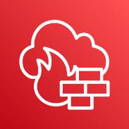{width="0.8319444444444445in"
height="0.8305555555555556in"} AWS Ağ Güvenlik Duvarı, tüm Amazon Sanal
Özel Bulutlarınız (VPC\'ler) için temel ağ korumalarını dağıtmayı
kolaylaştıran yönetilen bir hizmettir. Hizmet yalnızca birkaç tıklamayla
kurulabilir ve ağ trafiğinize göre otomatik olarak ölçeklenebilir,
böylece herhangi bir altyapıyı dağıtma ve yönetme konusunda
endişelenmenize gerek kalmaz. AWS Ağ Güvenlik Duvarı\'nın esnek kural
motoru, kötü amaçlı etkinliklerin yayılmasını önlemek için giden sunucu
ileti bloğu (SMB) isteklerini engellemek gibi ağ trafiği üzerinde size
ayrıntılı denetim sağlayan güvenlik duvarı kuralları tanımlamanıza
olanak tanır. Ayrıca, ortak açık kaynak kural biçimlerinde önceden
yazdığınız kuralları içe aktarabilir ve AWS iş ortakları tarafından
sağlanan yönetilen zekâ akışlarıyla entegrasyonları
etkinleştirebilirsiniz. AWS Ağ Network Firewall, AWS Ağ Güvenlik Duvarı
kurallarına dayalı politikalar oluşturabilmeniz ve ardından bu ilkeleri
VPC\'leriniz ve hesaplarınız arasında merkezi olarak uygulayabilmeniz
için AWS Güvenlik Duvarı Yöneticisi ile birlikte çalışır.

AWS Ağ Güvenlik Duvarı, yaygın ağ tehditlerine karşı koruma sağlayan
özellikler içerir. AWS Ağ Güvenlik Duvarı\'nın durum bilgisi olan
güvenlik duvarı, VPC\'lerinizin yetkisiz bir protokol kullanarak etki
alanlarına erişmesini önleme gibi ilkeleri uygulamak için bağlantıları
izleme ve protokol tanımlama gibi trafik akışlarından gelen bağlamı
içerebilir. AWS Network Firewall'in izinsiz giriş önleme sistemi (IPS),
imza tabanlı algılamayı kullanarak güvenlik açığından yararlanma
durumlarını belirleyebilmeniz ve engelleyebilmeniz için aktif trafik
akışı denetimi sağlar. AWS Network Firewall, kötü olduğu bilinen
URL\'lere giden trafiği durdurabilen ve tam nitelikli etki alanı
adlarını izleyebilen web filtrelemesi de sunar.

**3.10.15. AWS Resource Access Manager**\
{width="0.8319444444444445in"
height="0.8305555555555556in"} AWS Resource Access Manager (RAM);
kaynaklarınızı AWS hesapları, kuruluşunuz veya AWS Organizations\'ta yer
alan kuruluş birimleriniz (OU) genelinde, desteklenen kaynak türleri
için IAM rolleri ve IAM kullanıcıları ile güvenli şekilde paylaşmanıza
yardımcı olur. Transit gateway\'ler, alt ağlar, AWS

53

License Manager lisans yapılandırmaları, Amazon Route 53 Resolver
kuralları ve diğer kaynak türlerini paylaşmak için AWS RAM\'i
kullanabilirsiniz.

Birçok kuruluş, idari yalıtım veya faturalama yalıtımı oluşturmak ve
hataların etkisini sınırlandırmak için birden çok hesap kullanmaktadır.
AWS RAM sayesinde, birden fazla AWS hesabında yinelenen kaynaklar
oluşturmanız gerekmez. Bu, sahip olduğunuz hesapların her birinde kaynak
yönetmenin operasyonel iş yükünü azaltır. Bunun yerine, birden çok
hesaplı ortamınızda bir kaynağı bir kez oluşturabilir ve sonrasında
kaynak paylaşımı oluşturarak, bu kaynağı hesaplar arasında paylaşmak
için AWS RAM\'ii kullanabilirsiniz. Bir kaynak paylaşımı
oluşturduğunuzda paylaşılacak kaynakları seçer, her kaynak türü için AWS
RAM tarafından yönetilen izinleri belirler ve kaynaklara kimlerin
erişmesini istediğinizi tayin edersiniz. AWS RAM ücretsiz olarak
sunulur.

**3.10.16. AWS Secrets Manager**\
{width="0.8319444444444445in"
height="0.8305544619422572in"} tabanı kimlik bilgilerini, API
anahtarlarını ve diğer gizli dizileri yaşam döngüleri boyunca kolayca
rotasyona sokmanızı, yönetmenizi ve almanızı sağlar.

> AWS Secrets Manager uygulamalarınıza, hizmetlerinize ve BT
> kaynaklarınıza erişmek için gerekli olan gizli dizileri korumanıza
> yardımcı olur. Hizmet veri Kullanıcılar ve uygulamalar gizli dizileri
> Secrets Manager API\'lerine yaptıkları

çağrıyla aldığından, hassas bilgileri düz metin halinde kodlamanıza
gerek kalmaz. Secrets Manager; Amazon RDS, Amazon Redshift ve Amazon
DocumentDB için sağladığı yerleşik entegrasyon sayesinde gizli dizi
rotasyon özellikleri sunar. Hizmet, API anahtarları ve OAuth
belirteçleri gibi diğer gizli dizi türleri için de kullanılacak şekilde
genişletilebilir. Secrets Manager buna ek olarak AWS Cloud'daki, üçüncü
taraf hizmetlerdeki ve şirket içindeki kaynaklar için tek bir merkezden
ayrıntılı izin ve denetim gizli dizisi rotasyon özelliklerini kullanarak
gizli dizi erişimini denetlemenizi sağlar.

**3.10.17. AWS Security Hub**\
{width="0.8319444444444445in"
height="0.8319444444444445in"} veri biçiminde otomatik olarak toplar.
Ortalama çözüm süresini otomatik müdahale ve düzeltme eylemleriyle
hızlandırır.

> En iyi güvenlik uygulamalarından sapmaları tek tıklamayla tespit
> edebilirsiniz. Güvenlik bulgularını AWS ve çözüm ortağı hizmetlerinden
> standartlaştırılmış

**3.10.18. AWS Shield**\
{width="0.8319444444444445in"
height="0.8305544619422572in"} AWS Shield, AWS üzerinde çalışan
uygulamaları koruyan bir yönetilen Dağıtılmış Hizmet Engelleme (DDoS)
koruması hizmetidir. AWS Shield tarafından sunulan, uygulama kesinti ve
gecikme süresini en aza indiren her zaman açık algılama ve otomatik
satır içi risk azaltma özellikleri sayesinde DDoS korumasından
yararlanmak için AWS Support ekibine ulaşmanıza gerek kalmaz. AWS
Shield\'in Standard ve Advanced olmak üzere iki katmanı vardır.

Tüm AWS müşterileri, ek ücret ödemeden AWS Shield Standard\'ın otomatik
koruma özelliklerinden yararlanabilir. AWS Shield Standard, web sitenizi
ve uygulamalarınızı hedefleyen en yaygın, en sık karşılaşılan ağ ve
aktarım katmanı DDoS saldırılarına karşı savunma sağlar. AWS Shield
Standard hizmetini Amazon CloudFront ve Amazon Route 53 ile birlikte
kullandığınızda bilinen tüm altyapı (3. ve 4. katman) saldırılarına
karşı geniş kapsamlı erişilebilirlik korumasına sahip olursunuz.

Amazon Elastic Compute Cloud (EC2), Elastic Load Balancing (ELB), Amazon
CloudFront, AWS Global Accelerator ve Amazon Route 53 kaynakları
üzerinde çalışan uygulamalarınızı

54

hedef alan saldırılara karşı daha üst düzey koruma sağlamak için AWS
Shield Advanced çözümüne abone olabilirsiniz. AWS Shield Advanced,
Standard katmanla gelen ağ ve aktarım katmanı korumalarına ek olarak
büyük çaplı ve sofistike DDoS saldırılarına karşı ek algılama ve risk
azaltma özellikleri, saldırılar için neredeyse gerçek zamanlı görünürlük
ve web uygulamalarına yönelik bir güvenlik duvarı olan AWS WAF ile
entegrasyon olanağı sunar. AWS Shield Advanced ayrıca AWS Shield
Response Team (SRT) ekibine 7/24 erişimin yanı sıra Amazon Elastic
Compute Cloud (EC2), Elastic Load Balancing (ELB), Amazon CloudFront,
AWS Global Accelerator ve Amazon Route 53 ücretlerinizdeki DDoS kaynaklı
ani artışlara karşı koruma sağlar.

AWS Shield Advanced tüm Amazon CloudFront, AWS Global Accelerator ve
Amazon Route 53 uç konumlarında genel kullanıma sunulmuştur.
Uygulamanızın önünde Amazon CloudFront\'u dağıtarak dünyanın herhangi
bir yerinde barındırılan web uygulamalarınızı koruyabilirsiniz. Kaynak
sunucularınız Amazon Simple Storage Service (S3), Amazon Elastic Compute
Cloud (EC2), Elastic Load Balancing (ELB) veya AWS dışındaki özel bir
sunucu olabilir. İsterseniz AWS Shield Advanced çözümünü şu AWS
bölgelerinde Elastic Load Balancing veya Amazon EC2 üzerinde doğrudan
etkinleştirebilirsiniz: Kuzey Virginia, Ohio, Oregon, Kuzey California,
Montreal, Sao Paulo, İrlanda, Frankfurt, Londra, Paris, Stockholm,
Singapur, Tokyo, Sidney, Seul, Mumbai, Milan ve Cape Town.

**3.10.19. AWS Single Sign-On**\
AWS Single Sign-On (AWS SSO), AWS\'de iş gücü kimliklerinizi bir kez
{width="0.8319444444444445in"
height="0.8305544619422572in"} oluşturduğunuz veya bağladığınız ve AWS
kuruluşunuz genelinde erişimi merkezi olarak yönettiğiniz yerdir.
Yalnızca AWS hesaplarınıza veya bulut uygulamalarınıza erişimi yönetmeyi
seçebilirsiniz. Kullanıcı kimliklerini doğrudan AWS SSO\'da
oluşturabilir veya bunları Microsoft Active

Directory\'nizden veya Okta Universal Directory veya Azure AD gibi
standartlara dayalı bir kimlik sağlayıcıdan getirebilirsiniz. AWS SSO
ile ayrıntılı erişim tanımlamak, özelleştirmek ve atamak için birleşik
bir yönetim deneyimi elde edersiniz. İş gücü kullanıcılarınız;
kendilerine atanan tüm AWS hesaplarına, Amazon EC2 Windows bulut
sunucularına veya bulut uygulamalarına erişmek için bir kullanıcı
portalına sahip olur. AWS SSO, AWS IAM aracılığıyla AWS hesap erişim
yönetimiyle birlikte çalışacak veya bunun yerini alacak şekilde esnek
bir şekilde yapılandırılabilir.

**3.10.20. AWS WAF -- Web Uygulaması Güvenlik Duvarı**\
{width="0.8319444444444445in"
height="0.8319444444444445in"} AWS WAF, web uygulamalarınızı veya
API\'lerinizi erişilebilirliği etkileyebilecek, güvenliği tehlikeye
atabilecek veya aşırı kaynak kullanabilecek yaygın web açıklarına ve
botlara karşı korumanıza yardımcı olan bir web uygulaması güvenlik
duvarıdır. AWS WAF, bot trafiğini kontrol eden ve SQL ekleme veya
siteler arası betik oluşturma gibi yaygın saldırı modellerini

engelleyen güvenlik kuralları oluşturmanızı mümkün kılarak trafiğin
uygulamalarınıza nasıl ulaştığını kontrol etmenizi sağlar. Ayrıca,
belirli trafik modellerini filtreleyen kuralları da
özelleştirebilirsiniz. OWASP 10 önemli güvenlik riski ve aşırı kaynak
tüketen, ölçümlerde dengesizlik yaratan ya da kesinti süresine neden
olabilen otomatik botlar gibi sorunlara yönelmek için AWS ya da AWS
Marketplace Satıcıları tarafından yönetilen bir önceden yapılandırılmış
kurallar seti olan Managed rules for AWS Web Application Firewall'i
kullanarak hızlıca başlayabilirsiniz. Yeni sorunlar ortaya çıktıkça bu
kurallar düzenli olarak güncellenmektedir. AWS WAF; güvenlik kuralları
oluşturma, dağıtma ve bunların bakımını yapma işlemlerini
otomatikleştirmek için kullanabileceğiniz tam özellikli bir API içerir.

55

REST API\'leriniz için EC2, Amazon API Gateway veya GraphQL API\'leriniz
için AWS AppSync\'ta çalışan web sunucularınızı veya kaynak
sunucularınızı yöneten Application Load Balancer olan CDN çözümünüzün
bir parçası olarak Amazon CloudFront\'ta AWS WAF dağıtabilirsiniz. AWS
WAF ile sadece kullandıklarınız için ödeme yaparsınız ve fiyatlandırma,
dağıttığınız kural ve uygulamanızın aldığı web isteği sayısına göre
belirlenir.

**3.11. Kuantum Teknolojileri Servisleri**\
**3.11.1. Amazon Braket**\
{width="0.8319444444444445in"
height="0.8305555555555556in"} Tutarlı bir geliştirme araçları seti
kullanarak farklı türde kuantum bilgisayarları ve devre simülatörleri
ile kolayca çalışır. Hem kuantum hem de klasik iş yükleri için basit
fiyatlandırma ve yönetim denetimleriyle güvenilir bir bulutta kuantum
projeleri oluşturmanıza imkân sağlar. Kuantum bilgisayarlarına öncelikli
erişimle ve yönetilmesi gereken klasik altyapı olmadan hibrit
kuantum-klasik algoritmalarını daha hızlı çalıştırır. Uzman rehberliği
ve teknik destekle hızla yenilik yapın veya Amazon Quantum Solutions
Lab\'deki danışmanlarla birlikte çalışabilirsiniz.

**3.12. Makine Öğrenimi Servisleri**\
**3.12.1. Amazon Augmented AI (Amazon A2I)**\
{width="0.8319444444444445in"
height="0.8305555555555556in"} Bazı makine öğrenimi uygulamaları hassas
verilerin doğruluğundan emin olmak, sürekli iyileştirmeler sağlamak ve
modelleri güncellenen tahminlerle yeniden eğitmek için insan gözetimi
gerektirir. Ancak bu durumlarda, çoğunlukla sadece makine öğreniminin
veya sadece insanların olduğu sistemler arasında seçim yapmak zorunda
kalırsınız. Şirketler ise hem makine öğrenimi sistemlerini iş akışına
entegre ederek hem de istenen hassasiyeti garanti altına almak üzere
sonuçları insan gözetimi altında tutarak iki sistemin iyi yanlarını tek
bir potada eritmek istiyor.

Amazon Augmented AI, insanlar tarafından incelenmesi gereken iş
akışlarını oluşturmayı kolaylaştıran bir makine öğrenimi hizmetidir.
İnsan incelemesi imkanlarını tüm geliştiricilere sunan Amazon A2I,
AWS\'de veya başka bir yerde çalıştırılması fark etmeksizin, insan
inceleme sistemleri oluşturmanın veya çok sayıda insan inceleyiciyi
yönetmenin getirdiği ağır yükleri ortadan kaldırmaktadır.

**3.12.2. Amazon CodeGuru**\
{width="0.8319444444444445in"
height="0.8305544619422572in"} CodeGuru\'yu mevcut yazılım geliştirme iş
akışınıza entegre ederek uygulama geliştirme sırasında kod
incelemelerini otomatikleştirin, uygulamanın üretim Amazon CodeGuru, kod
kalitesini iyileştirmek için akıllı öneriler sağlayan ve bir uygulamanın
en maliyetli kod satırlarını belirleyen bir geliştirici aracıdır.

> sırasındaki performansını sürekli olarak izleyerek kod kalitesini
> iyileştirme,

uygulama performansını artırma ile toplam maliyeti azaltma konularında
öneriler ve görsel ipuçları sağlayın.

CodeGuru Reviewer, uygulama geliştirme sırasında kritik sorunları,
güvenlik açıklarını ve bulunması zor olan hataları tespit etmek için
makine öğrenimi ve otomatik akıl yürütme kullanır. Bununla beraber kod
kalitesini iyileştirmek için öneriler sağlar.

CodeGuru Profiler, geliştiricilerin bir uygulamanın en maliyetli kod
satırlarını bulmasına yardımcı olarak uygulamalarının çalışma süresi
davranışını anlamalarına ve kod verimsizliklerini ortadan
kaldırmalarına, performansı iyileştirmelerine ve işlem maliyetlerini
büyük ölçüde azaltmalarına yardımcı olur.

56

**3.12.3. Amazon Comprehend**\
{width="0.8319444444444445in"
height="0.8305555555555556in"} Belgelerdeki metinlerden, müşteri destek
biletlerinden, ürün incelemelerinden, e-postalardan, sosyal medya
akışlarından ve çok daha fazlasından değerli öngörüleri ortaya çıkarır.
Sigorta talepleri gibi belgelerden metin, anahtar kelime öbekleri,
konular, duygu analizi ve çok daha fazlasını ayıklayarak belge işleme iş
akışlarını basitleştirir. Makine öğrenimi deneyimi gerektirmeden
belgeleri sınıflandırmak ve terimleri belirlemek için bir model eğiterek
işletmenizi farklılaştırır. Belgelerden kişisel bilgileri (PII) tespit
edip düzenleyerek hassas verilerinizi koruyun ve bu verilere kimlerin
erişebileceğini kontrol edebilirsiniz.

**3.12.4. Amazon DevOps Guru**\
{width="0.8319444444444445in"
height="0.8319444444444445in"} Amazon DevOps Guru, bir uygulamanın
operasyonel performansını ve erişilebilirliğini iyileştirmeyi
kolaylaştırmak için tasarlanmış, makine öğrenimi (ML) destekli bir
hizmettir. DevOps Guru, normal çalışma düzenlerinden sapan davranışları
tespit etmeye yardımcı olur ve böylece, operasyonel sorunları
müşterileriniz etkilenmeden çok daha önce belirleyebilirsiniz.

DevOps Guru, Amazon.com ve AWS\'nin anormal uygulama davranışlarını
(örneğin yüksek gecikme süresi, hata oranları ve kaynak kısıtlamaları)
belirleme konusunda yıllara dayanan operasyonel mükemmelliğiyle
geliştirilen makine öğrenimi modellerini kullanır ve olası kesintilere
veya hizmet aksaklıklarına neden olabilecek kritik sorunların ortaya
çıkarılmasına yardımcı olur. DevOps Guru, kritik bir sorun tespit
ettiğinde otomatik olarak bir uyarı gönderir ve ilgili anormalliklerin
bir özetini, olası temel nedenini, ayrıca sorunun ne zaman ve nerede
oluştuğuna ilişkin bağlamı sunar. DevOps Guru, mümkün olduğunda sorunun
nasıl çözüleceğine ilişkin tavsiyeler de sunar.

Tek tıklamayla dağıtım sayesinde DevOps Guru, AWS uygulamalarınızdaki
operasyonel verileri otomatik olarak alır ve operasyonel verilerinizdeki
sorunları görselleştirmek için tek bir pano sunar. Manuel kurulum ya da
ML uzmanlığı gerekmeden AWS hesabınızdaki tüm kaynaklar, AWS
CloudFormation yığınlarınızdaki kaynaklar veya AWS etiketlerine göre
gruplandırılan kaynaklar için DevOps Guru\'yu etkinleştirerek kullanmaya
başlayabilirsiniz.

**3.12.5. Amazon Elastic Inference**\
{width="0.8319444444444445in"
height="0.8305544619422572in"} Amazon Elastic Inference, derin öğrenme
çıkarımı çalıştırma maliyetini %75\'e varan oranda azaltmak için Amazon
EC2 ve SageMaker bulut sunucularına veya Amazon ECS görevlerine düşük
maliyetli GPU destekli hızlandırma eklemenize olanak tanır. Amazon
Elastic Inference; TensorFlow, Apache MXNet, PyTorch ve ONNX modellerini
destekler.

Çıkarım, eğitilmiş bir model kullanarak tahminde bulunma işlemidir.
Derin öğrenme uygulamalarında, çıkarım iki nedenle toplam operasyonel
maliyetlerin %90 kadarını oluşturur. Bu nedenlerden ilki, bağımsız GPU
bulut sunucularının çıkarım için değil, genellikle model eğitimi için
tasarlanmış olmasıdır. Eğitim işleri, yüzlerce veri örneğini paralel
şekilde toplu olarak işlerken, çıkarım işleri genellikle tek bir girdiyi
gerçek zamanlı olarak işler ve bu nedenle az miktarda bir GPU işlemi
kullanır. Bu, bağımsız GPU çıkarımını maliyet açısından verimsiz hale
getirir. Öte yandan, bağımsız CPU bulut sunucuları matris işlemleri için
özelleştirilmemiştir ve bu nedenle derin öğrenme çıkarımı için
genellikle çok yavaştır. Söz konusu nedenlerden ikincisi, farklı
modellerin farklı CPU, GPU ve bellek gereksinimleri olmasıdır. Bir
kaynak için optimizasyon yapmak, diğer kaynakların yeterince
kullanılmamasına ve daha yüksek maliyetlere neden olabilir.

57

Amazon Elastic Inference, kodunuzda değişiklik yapmadan herhangi bir EC2
veya SageMaker bulut sunucusu tipine ya da ECS görevine doğru miktarda
GPU destekli çıkarım hızlandırması ekleyerek bu sorunların üstesinden
gelmenizi sağlar. Amazon Elastic Inference sayesinde AWS\'de
uygulamanızın genel işlem ve bellek gereksinimlerine en uygun CPU bulut
sunucusunu seçebilir ve ardından, kaynakları verimli bir şekilde
kullanmanıza ve maliyeti düşürmenize olanak tanıyan doğru miktarda GPU
destekli çıkarım hızlandırmasını ayrı şekilde yapılandırabilirsiniz.

**3.12.6. Amazon Forecast**\
Amazon.com ile aynı teknolojiyi kullanarak milyonlarca öğeyi tahmin edip
{width="0.8319444444444445in"
height="0.8305555555555556in"} operasyonları ölçeklendirir. Ayrıntılı
bir düzeyde doğru tahminlerle envanteri optimize edin ve israfı azaltır.
Sermaye kullanımını iyileştirin ve uzun vadeli kararları daha güvenle
almanıza yardımcı olur. Değişen talep düzeylerini karşılamak için
optimum personel ile müşteri memnuniyetini artırır.

**3.12.7. Amazon Fraud Detector**\
{width="0.8319444444444445in"
height="0.8319444444444445in"} özelleştirilmiş bir dolandırıcılık
algılama modeli oluşturmak için geçmiş verilerinizden ve 20 yılı aşkın
Amazon deneyiminden öngörüler elde edersiniz.

Geçmiş makine öğrenimi (ML) deneyimi olmadan dolandırıcılık algılama\
modelleri oluşturmanıza, dağıtmanıza ve yönetmenize yardımcı olur.
Doğru,\
Dolandırıcılığı hemen tespit etmeye başlarsınız, özelleştirilmiş iş
kurallarıyla\
modelleri kolayca geliştirebilir ve kritik tahminler oluşturmak için
sonuçları dağıtabilirsiniz.

**3.12.8. Amazon HealthLake**\
{width="0.8319444444444445in"
height="0.8305544619422572in"} Sağlık verilerini dakikalar içinde
depolayabilen, dönüştüren, sorgulayan ve analiz eden AWS servisidir.
Kolay arama ve sorgulama için, yapılandırılmamış verilerden doğal dil
işleme (NLP) ile anlam çıkarabilirsiniz. Amazon SageMaker makine
öğrenimi (ML) modellerini ve Amazon QuickSight analizlerini kullanarak
sağlık verileriyle tahminlerde bulunmanızı sağlar. "Hızlı Sağlık
Hizmetleri Birlikte Çalışabilirlik Kaynakları" (FHIR) formatı gibi
birlikte çalışabilirlik standartlarını desteklemektedir. Reçeteler,
prosedürler ve teşhisler dahil olmak üzere hasta sağlığı verilerinin
eksiksiz ve kronolojik bir görünümünü oluşturmanıza yardımcı olur.

**3.12.9. Amazon Kendra**\
{width="0.8319444444444445in"
height="0.8305555555555556in"} Amazon Kendra, makine öğrenimiyle (ML)
desteklenen akıllı bir arama hizmetidir. Kendra, çalışanlarınızın ve
müşterilerinizin aradıkları içerikleri, kuruluşunuzun içinde birden
fazla konuma ve içerik deposuna dağılmış olsa bile kolayca bulabilmesi
için web sitelerinize ve uygulamalarınıza yönelik kurumsal aramayı
baştan yaratıyor.

Amazon Kendra\'yı kullanarak, çok miktarda yapılandırılmamış veri
arasından arama yapmanız gerekmeden, ihtiyaç duyduğunuzda sorunlarınızın
cevabını bulabilirsiniz. Amazon Kendra tam olarak yönetilen bir
hizmettir. Bu nedenle sunucu tedarik etmenize ve makine öğrenimi modeli
oluşturmanıza, eğitmenize veya dağıtmanıza gerek yoktur.

**3.12.10. Amazon Lex**\
Etkileşimli yapay zekâ destekli chatbot'lar oluşturmanızı sağlayan AWS
{width="0.8319444444444445in"
height="0.8305555555555556in"} servisidir. Birçok dilde amacı anlayan,
bağlamı koruyan ve basit görevleri otomatikleştiren yapay zekayı kolayca
ekleyebilirsiniz. Çok kanallı etkileşimli yapay zekayı, donanım veya
altyapı konusunda endişelenmeden tek tıklamayla

58

tasarlayabilir ve dağıtabilirsiniz. Verileri sorgulamak, iş mantığı
yürütmek, performansı izlemek ve daha fazlası için diğer AWS
hizmetlerine sorunsuzca bağlanabilir.

**3.12.11. Amazon Lookout for Equipment**\
{width="0.8319444444444445in"
height="0.8305555555555556in"} Tahmine dayalı bakımın başarılı bir
şekilde gerçekleştirilmesi için benzersiz işletim koşullarınızda tüm
makine sensörlerinizden toplanan belirli verilerin kullanılması ve
ardından yüksek düzeyde doğru tahminler sağlamak için makine öğreniminin
(ML) uygulanması gerekir. Fakat ekipmanınız için bir ML çözümü uygulamak
zor ve zaman alıcı olabilir.

Amazon Lookout for Equipment, ML uzmanlığı gerektirmeksizin ekipmanınız
için yalnızca verilerinize dayalı bir makine öğrenimi modelini otomatik
olarak eğitmek üzere ekipmanınızdaki sensörlerden gelen verileri (ör.
jeneratördeki basınç, kompresörün akış hızı, fanların devir sayısı)
analiz eder. Lookout for Equipment, sensörlerden gelen verileri gerçek
zamanlı olarak analiz etmek ve makine arızalarına yol açabilecek erken
uyarı işaretlerini doğru bir şekilde tanımlamak için eşsiz ML modelinizi
kullanır. Böylece ekipman anormalliklerini hızlı bir şekilde ve
hassasiyetle tespit edebilir, sorunları hızla teşhis edebilir, maliyetli
kesinti süresini azaltmak için harekete geçebilir ve yanlış uyarıları
azaltabilirsiniz.

**3.12.12. Amazon Lookout for Metrics**\
Metriklerdeki anormallikleri otomatik olarak tespit edip ve temel
nedenini
{width="0.8319444444444445in"
height="0.8305555555555556in"} belirleyen AWS servisidir. Amazon Lookout
for Metrics, satış gelirinde veya müşteri edinme oranlarında ani bir
düşüş gibi iş ve operasyonel verilerdeki anormallikleri (yani normdan
aykırı değerleri) otomatik olarak tespit etmek ve teşhis etmek için
makine öğrenimini (ML) kullanır. Birkaç tıklamayla Amazon Lookout for
Metrics\'i Amazon S3, Amazon Redshift ve Amazon Relational Database
Service (RDS) gibi popüler veri depolarının yanı sıra Salesforce,
Servicenow, Zendesk gibi üçüncü taraf SaaS uygulamalarına
bağlayabilirsiniz. Sonrasında Marketo\'yu seçin ve işiniz için önemli
olan metrikleri izlemeye başlayın. Amazon Lookout for Metrics,
anormallikleri algılamak için kullanılan geleneksel yöntemlerden daha
hızlı ve doğru bir şekilde bu kaynaklardan gelen verileri otomatik
olarak inceler ve hazırlar. Sonuçları ayarlamak ve zaman içinde
doğruluğu artırmak için tespit edilen anormallikler hakkında geri
bildirim de sağlayabilirsiniz. Amazon Lookout for Metrics, aynı olayla
ilgili anormallikleri bir araya getirerek ve olası temel nedenin bir
özetini içeren bir uyarı göndererek, tespit edilen anormallikleri teşhis
etmeyi kolaylaştırır. Ayrıca, işiniz için en önemli olan şeylere
dikkatinizi öncelik verebilmeniz için anormallikleri önem derecesine
göre sıralar.

**3.12.13. Amazon Lookout for Vision**\
{width="0.8319444444444445in"
height="0.8305555555555556in"} Kalite denetimini otomatikleştirmek için
görüntü işleme kullanarak ürün kusurlarını tespit eden AWS servisidir.
En az 30 görüntüyle canlı işlem hattınızdaki anormallikleri tespit etmek
için kolayca bir makine öğrenimi (ML) modeli oluşturur. Hem hasarları
azaltmak ve önlemek hem de üretim kalitesini artırmak için görsel
anormallikleri gerçek zamanlı olarak belirler. Olası sorunları

tespit etmek ve düzeltici önlem almak için görsel inceleme verilerini
kullanarak planlanmamış kesinti sürelerini önleyin ve operasyonel
maliyetleri azaltır.

**3.12.14. Amazon Monitron**\
Tahmine dayalı bakım ve makine öğrenimi ile ekipmandaki plansız kesinti
{width="0.8319444444444445in"
height="0.8305555555555556in"} süresini azaltan AWS servisidir. Makine
öğrenimi (ML) ile makine sorunlarını henüz gerçekleşmeden tespit edip ve
harekete geçmenizi sağlar. Amazon Monitron\'un uçtan uca sistemi
vasıtasıyla hem kolay kurulum hem de otomatik

59

ve güvenli analiz ile ekipmanları dakikalar içinde izlemeye
başlayabilir. Amazon Monitron mobil ve web uygulamalarına girilen
teknisyen geri bildirimlerinden öğrendiği için sistemin doğruluğunu
sürekli olarak geliştirebilirsiniz.

**3.12.15. Amazon Personalize**\
{width="0.8319444444444445in"
height="0.8305544619422572in"} Kişiselleştirilmiş gerçek zamanlı
kullanıcı deneyimlerini uygun ölçekte daha hızlı oluşturmayı sağlayan
AWS servisidir. Amazon Personalize, geliştiricilerin Amazon.com
tarafından gerçek zamanlı kişiselleştirilmiş öneriler için kullanılan
makine öğrenimi (ML) teknolojisiyle aynı teknolojiyi kullanarak
uygulamalar oluşturmalarını sağlar.

Amazon Personalize, geliştiricilerin belirli ürün önerileri,
kişiselleştirilmiş ürün yeniden sıralamaları ve özelleştirilmiş doğrudan
pazarlama dâhil olmak üzere çok çeşitli kişiselleştirme deneyimleri
sunabilen uygulamalar oluşturmalarını kolaylaştırır. Amazon Personalize,
perakende ile medya ve eğlence gibi sektörler genelinde müşterilere
oldukça özelleştirilmiş öneriler sunmak üzere katı statik kurallara
dayalı öneri sistemlerinin ötesine geçen ve özel ML modellerini eğiten,
ayarlayan ve dağıtan tam olarak yönetilen bir makine öğrenimi
hizmetidir.

Amazon Personalize gerekli alt yapıyı tedarik eder ve verileri işleme,
özellikleri tanıma, en iyi algoritmaları kullanma ve modelleri eğitme,
optimize etme ve barındırma dâhil olmak üzere tüm ML işlem hattını
yönetir. Bir uygulama programlama arabirimi (API) yoluyla sonuç alır ve
minimum ücret ya da peşin taahhüt olmadan yalnızca kullandığınız kadar
ödeme yaparsınız. Tüm veriler özel ve güvenli olmak üzere şifrelenir ve
yalnızca kullanıcılarınız için öneriler oluşturmanız amacıyla
kullanılır.

**3.12.16. Amazon Polly**\
{width="0.8319444444444445in"
height="0.8319433508311461in"} sunduğu nöral metin seslendirme (NTTS)
sesleri sayesinde yeni bir makine öğrenimi yaklaşımıyla konuşma
kalitesinde gelişmiş iyileştirmeler sağlar.

Derin öğrenimi kullanarak metni gerçek hayattakine benzer konuşmaya\
dönüştüren AWS servisidir. Amazon Polly, Standart TTS seslerine ek
olarak\
Polly'nin Nöral TTS teknolojisi, haber anlatımı kullanım örneklerine
uyarlanmış\
bir Haber Spikeri okuma stilini de destekler.

Son olarak, Amazon Polly Brand Voice, kuruluşunuz için özel bir ses
oluşturabilir. Bu, özel olarak kuruluşunuzun kullanması için bir NTTS
sesi oluşturmak üzere Amazon Polly ekibiyle iş birliği yapacağınız özel
bir çalışmadır.

**3.12.17. Amazon Rekognition**\
Makine öğrenimiyle görüntü ve video analizinizi otomatikleştiren AWS
{width="0.8319444444444445in"
height="0.8305544619422572in"} servisidir. Sıfırdan makine öğrenimi (ML)
modelleri ve altyapı oluşturmadan uygulamalarınıza önceden eğitilmiş
veya özelleştirilebilir görüntü işleme API\'lerini hızla
ekleyebilirsiniz. Milyonlarca görüntüyü ve videoyu dakikalar içinde
analiz edin ve yapay zekâ (AI) ile insan görsel inceleme görevlerini
artırabilirsiniz. Tam olarak yönetilen yapay zekâ yetenekleriyle iş
gereksinimlerinize göre ölçeği artırın veya azaltın ve yalnızca analiz
ettiğiniz görüntüler ve videolar için ödeme yaparsınız.

**3.12.18. Amazon SageMaker**\
{width="0.8319444444444445in"
height="0.8305544619422572in"} Tam olarak yönetilen altyapı, araçlar ve
iş akışlarıyla her türlü kullanım örneği için makine öğrenimi (ML)
modelleri oluşturan, eğiten ve dağıtan AWS servisidir. SageMaker Canvas
ile görsel bir arabirim kullanarak makine öğrenimi tahminleri yapar.
SageMaker Studio ile verileri hazırlayabilir,

60

modelleri oluşturabilir, eğitip ve dağıtabilirsiniz. SageMaker MLOps ile
modelleri uygun ölçekte dağıtıp ve yönetebilirsiniz.

**3.12.19. Amazon SageMaker Data Labeling**\
{width="0.8319444444444445in"
height="0.8305555555555556in"} Makine öğrenimi modellerinin eğitimi için
yüksek kaliteli veri kümeleri oluşturmanızı sağlayan AWS servisidir.
Amazon SageMaker, iki veri etiketleme teklifi sunar: Amazon SageMaker
Ground Truth Plus ve Amazon SageMaker Ground Truth. Her iki seçenek de
görüntüler, metin dosyaları ve videolar gibi ham verileri tanımlamanıza
ve makine öğrenimi modelleriniz için yüksek kaliteli eğitim veri
kümeleri oluşturmak amacıyla bilgilendirici etiketler eklemenize olanak
tanır.

> • ***Amazon SageMaker Ground Truth Plus***\
> Amazon SageMaker Ground Truth Plus ile etiketleme uygulamaları
> oluşturmak ya da etiketleme iş gücünü kendi başınıza yönetmek zorunda
> kalmadan kolayca yüksek kaliteli eğitim veri kümeleri
> oluşturabilirsiniz. Amazon SageMaker Ground Truth Plus, veri
> etiketleme maliyetlerini %40\'a varan oranda azaltmaya yardımcı olur.
> Amazon SageMaker Ground Truth Plus, ML görevleri üzerine eğitilmiş
> uzman bir iş gücü sunar ve veri güvenliği, gizlilik ve uygunluk
> gereksinimlerinizi karşılamaya yardımcı olur. Siz yalnızca
> verilerinizi yüklersiniz ve Amazon SageMaker Ground Truth Plus, sizin
> adınıza veri etiketleme iş akışları oluşturup bu iş akışlarını
> yönetir.
>
> • ***Amazon SageMaker Ground Truth***\
> Hem veri etiketleme iş akışlarınızı oluşturma ve yönetme hem de kendi
> veri etiketleme iş gücünüzü yönetme esnekliğine sahip olmak
> istiyorsanız Amazon SageMaker Ground Truth\'u kullanabilirsiniz.
> SageMaker Ground Truth, verileri etiketlemeyi kolaylaştıran bir veri
> etiketleme hizmetidir ve size Amazon Mechanical Turk, üçüncü taraf
> sağlayıcılar ya da kendi özel iş gücünüzle insan yorumcular kullanma
> seçeneği sunar.

**3.12.20. Amazon Textract**\
{width="0.8319444444444445in"
height="0.8319444444444445in"} Basılı metni, el yazısını ve verileri
istediğiniz belgeden otomatik olarak ayıklayan AWS servisidir. Yapay
zekâ (AI) kullanarak, yapılandırma veya şablona gerek duymadan
belgelerden tablolar ve formlar gibi metin ve yapılandırılmış verileri
ayıklar. Belgelerden ilişkileri, yapıları ve metinleri ayıklayarak basit
optik karakter tanımanın (OCR) ötesine geçebilirsiniz. Sağlam

veri gizliliği, şifreleme, güvenlik kontrolleri aracılığıyla güvenliği
ve uyumluluğu iyileştirin ve HIPAA, GDPR gibi uyumluluk standartlarını
destekler. İncelikli veya hassas iş akışlarını yönetmek ve tahminleri
denetlemek için Amazon Augmented AI (A2I) ile insan incelemelerini
kolayca uygulayabilirsiniz.

**3.12.21. Amazon Transcribe**\
{width="0.8319444444444445in"
height="0.8319444444444445in"} iş öngörülerini çıkarmanızı sağlar. Tam
olarak yönetilen ve sürekli eğitilen son teknoloji konuşma tanıma
modelleriyle iş sonuçlarını iyileştirebilirsiniz. Etki Konuşmaları
otomatik olarak metne dönüştüren AWS servisidir. Müşteri aramaları,
video dosyaları, klinik konuşmaları ve çok daha fazlasından önemli
alanınıza özgü sözcükleri anlayan özel modellerle doğruluğu
artırabilirsiniz.

Hassas bilgileri maskeleyerek müşteri gizliliğini ve güvenliğini güvence
altına almanızı sağlar.

**3.12.22. Amazon Translate**\
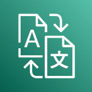{width="0.8319444444444445in"
height="0.8305555555555556in"} Akıcı ve doğru makine çevirisi sağlayan
AWS servisidir. Amazon Translate hızlı, yüksek kaliteli, uygun maliyetli
ve özelleştirilebilir dil çevirisi sunan bir nöral makine çevirisi
hizmetidir. Nöral makine çevirisi, geleneksel istatistiksel

61

ve kural tabanlı çeviri algoritmalarına kıyasla daha doğru ve daha doğal
çeviri sunmak üzere derin öğrenim modellerini kullanan bir dil çevirisi
otomasyonu biçimidir.

Amazon Translate ile farklı kullanıcılarınız için web siteleri ve
uygulamalar gibi içerikleri yerelleştirebilirsiniz, analiz için büyük
hacimlerde metinleri kolayca çevirebilirsiniz ve verimli bir şekilde
farklı dilleri konuşan kullanıcılar arasında iletişimi mümkün
kılabilirsiniz.

Intento, 2020 yılında Amazon Translate'i 14 dil çiftinde, 16 endüstri
sektöründe ve 8 içerik türünde en iyi makine çevirisi sağlayıcısı olarak
seçti.

**3.12.23. Apache MXNet on AWS**\
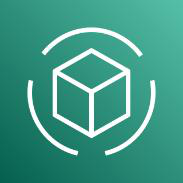{width="0.8319444444444445in"
height="0.8319433508311461in"} kullanımı kolay, sade bir API\'ye sahip
hızlı ve ölçeklenebilir bir eğitim ve çıkarsama çerçevesidir.

> Hızla eğitilen ve her yerde çalışan makine öğrenimi uygulamaları
> oluşturmanızı sağlayan AWS servisidir. Apache MXNet, makine öğrenimine
> yönelik

MXNet, beceri düzeyi ne olursa olsun tüm geliştiricilerin bulutta, uç
cihazlarında ve mobil uygulamalarda derin öğrenmeyi kullanmaya
başlamasına imkân tanıyan Gluon arabirimini içerir. Yalnızca birkaç
satır Gluon koduyla nesne algılama, konuşma tanıma, öneri sunma ve
kişiselleştirme için doğrusal regresyon, kıvrımlı ağlar ve yinelenen
LSTM\'ler oluşturabilirsiniz.

Uygun ölçekte makine öğrenimi modelleri oluşturmaya, eğitmeye ve
dağıtmaya yönelik bir platform olan Amazon SageMaker ile AWS\'de tümüyle
yönetilen bir MXNet deneyimini kullanmaya başlayabilirsiniz. Dilerseniz
AWS Deep Learning AMI\'lerini kullanarak MxNet'in yanı sıra TensorFlow,
PyTorch, Chainer, Keras, Caffe, Caffe2 ve Microsoft Cognitive Toolkit
gibi diğer çerçevelerle özel ortamlar ve iş akışları oluşturabilirsiniz.

**3.12.24. AWS Deep Learning AMI\'leri**\
{width="0.8319444444444445in"
height="0.8319433508311461in"} öğrenimi uygulayıcılarına ve
araştırmacılarına bulutta ve tüm ölçeklerde derin öğrenimi hızlandırmak
için kullanabilecekleri altyapıyı ve araçları sunar.

Hızlıca derin öğrenim uygulamaları oluşturmak için önceden
yapılandırılmış\
ortamlar sağlayan AWS servisidir. AWS Deep Learning AMI\'leri, makine\
TensorFlow, PyTorch, Apache MXNet, Chainer, Gluon, Horovod ve Keras
gibi\
popüler derin öğrenim framework'lerinin ve arabirimlerinin önceden
yüklendiği Amazon EC2 bulut sunucularını hızla başlatarak gelişmiş ve
özel AI modelleri eğitebilir, yeni algoritmalarla denemeler yapabilir
veya yeni beceriler ve teknikler edinebilirsiniz.

**3.12.25. AWS Deep Learning Containers**\
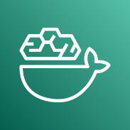{width="0.8319444444444445in"
height="0.8319433508311461in"} Derin öğrenme ortamlarını optimize
edilmiş, önceden paketlenmiş container görüntüleri ile hızlıca
ayarlamanızı sağlayan AWS servisidir. AWS Deep Learning Containers (AWS
DL Containers), ortamlarınızı sıfırdan oluşturma ve optimize etme gibi
karmaşık bir işlemi atlamanızı sağlayarak özel makine öğrenimi (ML)
ortamlarını hızla dağıtmanızı kolaylaştırmak amacıyla, derin öğrenme
çerçeveleri önceden yüklenmiş olarak sunulan Docker görüntüleridir. AWS
DL Containers; TensorFlow, PyTorch ve Apache MXNet'i destekler. AWS DL
Containers'ı Amazon SageMaker ve Amazon Elastic Kubernetes Service
(Amazon EKS) üzerinde, kendi kendine yönetilen Kubernetes'i Amazon EC2
ve Amazon Elastic Container Service (Amazon ECS) üzerinde
dağıtabilirsiniz. Container'lara Amazon Elastic Container Registry
(Amazon ECR) üzerinden ulaşabilir ve hiçbir ücret ödemeden AWS
Marketplace'i ziyaret edebilirsiniz. Yalnızca kullandığınız kaynaklar
için ödeme yaparsınız. Bu öğretici ile kullanmaya başlayın.

Docker container'ları, sürekli olarak birçok ortamda çalışan özel ML
ortamlarını dağıtmanın popüler bir yoludur. Ancak derin öğrenme için
container görüntülerini oluşturmak ve test

62

etmek zor ve hatalara açıktır, üstelik yazılım bağımlılıkları ve sürüm
uyumluluğu sorunları nedeniyle günler sürebilir. Ayrıca bu görüntüler,
ML iş yüklerini bir bulut sunucusu kümesi boyunca verimli bir şekilde
dağıtmak ve ölçeklendirmek için optimize edilmelidir ve bu işlem de özel
uzmanlık gerektirir. Çerçeve güncellemeleri yayınlandığında bu süreç
tekrarlanmalıdır. Tüm bunlar, geliştiricinin değerli zamanını alan ve
yenilik hızınızı yavaşlatan kaçınılmaz ağır yüklerdir.

AWS DL Containers, popüler derin öğrenme çerçevelerinin en son sürümleri
ve ihtiyaç duydukları kütüphanelerle önceden kurulmuş ve test edilmiş
Docker görüntüleri sağlar. AWS DL Containers, ML iş yüklerini AWS
üzerindeki bulut sunucusu kümelerinde verimli bir şekilde dağıtmak için
optimize edilmiştir. Böylece hemen yüksek performans ve
ölçeklenebilirlik elde edersiniz.

**3.12.26. AWS DeepComposer**\
{width="0.8319444444444445in"
height="0.8305555555555556in"} AWS DeepComposer, geliştiricilere makine
öğrenimini kullanmaya başlamaları için yaratıcı bir yol sunar. Makine
öğrenimi becerilerinizi genişletmek için tasarlanmış bir müzik klavyesi
ve en yeni makine öğrenimi teknikleriyle kelimenin tam anlamıyla
uygulamalı hale getirmenizi sağlar.

Tamamı yapay zekâ destekli, saniyeler içinde tamamen orijinal bir
şarkıya dönüşecek bir melodi oluşturmak için AWS DeepComposer klavyesini
kullanmaya başlayın. Geliştiricileri eğitmek için özel olarak tasarlanan
AWS DeepComposer, tek bir kod satırı yazmak zorunda kalmadan üretken AI
modelleri oluşturmaya başlamak için kullanılabilecek öğreticiler, örnek
kod ve eğitim verilerini içerir.

**3.12.27. AWS DeepLens**\
{width="0.8319444444444445in"
height="0.8319433508311461in"} ile makine öğrenimini kelimenin tam
anlamıyla yazılım geliştiricilerin denetimine bırakır.

> AWS DeepLens, derin öğrenme becerilerini genişletmek için tasarlanan
> önceden eğitimli modeller, kod, öğreticiler ve tümüyle
> programlanabilir bir video kamera

**3.12.28. AWS DeepRacer**\
{width="0.8319444444444445in"
height="0.8305544619422572in"} Beceri düzeyinden bağımsız olarak tüm
geliştiriciler bulut tabanlı bir 3B yarış simülatörü, pekiştirmeli
öğrenim tabanlı 1/18 ölçekli tam otonom yarış arabası ve global yarış
ligi aracılığıyla makine öğrenimini uygulamalı olarak deneyebilir. AWS
DeepRacer, pekiştirmeli öğrenime (RL) başlamanın ilginç ve eğlenceli bir
yolunu sunar. RL, eğitim modellerine, diğer makine öğrenimi
yöntemlerinden çok farklı bir yaklaşım getiren gelişmiş bir makine
öğrenimi (ML) tekniğidir. Süper gücünü, çok karmaşık davranışları hiçbir
etiketli eğitim verisi gerekmeksizin öğrenmesinden ve bir yandan uzun
vadeli hedef için optimizasyon yaparken diğer yandan kısa vadeli
kararlar alabilmesinden alır.

**3.12.29. AWS Inferentia**\
AWS tarafından özel olarak tasarlanmış yüksek performanslı makine
öğrenimi çıkarım çipidir. AWS\'nin vizyonu, derin öğrenmeyi günlük
geliştiriciler için yaygın hale getirmek ve düşük maliyetli, kullandıkça
öde kullanım modelinde sunulan son teknoloji altyapıya erişimi
demokratik hale getirmektir. AWS Inferentia, Amazon\'un derin öğrenme iş
yüklerini hızlandırmak için tasarlanmış ilk özel silikonudur ve bu
vizyonu gerçekleştirmeye yönelik uzun vadeli bir stratejinin parçasıdır.
AWS Inferentia, bulutta yüksek performanslı çıkarım

63

sağlamak, toplam çıkarım maliyetini azaltmak ve geliştiricilerin makine
öğrenimini iş uygulamalarına entegre etmelerini kolaylaştırmak için
tasarlanmıştır.

AWS Neuron yazılım geliştirme kiti (SDK), AWS Inferentia için iş
yüklerinin performansını optimize etmeye yardımcı olan bir derleyici,
çalışma zamanı ve profil oluşturma araçlarından oluşur. Geliştiriciler,
Tensorflow, PyTorch ve MXNet gibi popüler çerçeveler üzerinde
oluşturulmuş ve eğitilmiş karmaşık sinir ağı modellerini dağıtabilir ve
bunları AWS Inferentia tabanlı Amazon EC2 Inf1 bulut sunucularına
dağıtabilir. Bugün kullandığınız ML çerçevelerini kullanmaya devam
edebilir ve modellerinizi minimum kod değişikliğiyle ve satıcıya özel
çözümlere bağlanmadan Inf1\'e geçirebilirsiniz.

**3.12.30. AWS Panorama**\
{width="0.8319444444444445in"
height="0.8305555555555556in"} Uçta görüntü işleme operasyonlarınızı
iyileştirmenize yardımcı olan AWS servisidir. Yerel alan ağınızla
sorunsuz şekilde entegre olan AWS Panorama cihazları sayesinde mevcut
kamera filonuza görüntü işleme (CV) özelliğini ekleyebilirsiniz. Video
akışlarını milisaniyeler içinde analiz edebildiğiniz tek bir yönetim
arabiriminden yüksek doğruluk ve düşük gecikme süresi ile yerel olarak

tahminlerde bulunmanızı sağlar. Verilerinizin nerede depolandığını
kontrol edip sınırlı internet bant genişliğiyle çalışabilmek için video
akışlarınızı uçta işleyebilirsiniz.

**3.12.31. PyTorch on AWS**\
{width="0.8319444444444445in"
height="0.8305555555555556in"} AWS\'de kullanımı kolay, yüksek
performanslı derin öğrenme servislerinden biridir. PyTorch, makine
öğrenimi modelleri geliştirip bunları üretime dağıtmayı kolaylaştıran
açık kaynak bir derin öğrenme çerçevesidir. PyTorch geliştiricileri,
AWS\'nin Facebook ortaklığıyla oluşturup sürdürdüğü PyTorch model sunma
kitaplığı TorchServe\'ü kullanarak modelleri hızlı ve kolay şekilde
üretime

dağıtabilir. PyTorch, dağıtılan eğitime yönelik olarak, AWS üzerinde
yüksek performans için ayarlanmış dinamik hesaplama grafikleri ve
kitaplıkları da sağlar.

PyTorch modellerini uygun ölçekte oluşturmayı, eğitmeyi ve dağıtmayı hem
kolay hem de uygun maliyetli hale getiren, tam olarak yönetilen makine
öğrenimi hizmeti Amazon SageMaker ile PyTorch on AWS\'yi kullanmaya
başlayabilirsiniz. Altyapıyı kendiniz yönetmeyi tercih ediyorsanız özel
makine öğrenimi ortamlarını hızlı bir şekilde dağıtmak için PyTorch\'un
en son sürümüyle birlikte kaynaktan oluşturulmuş ve performans için
optimize edilmiş halde gelen AWS Deep Learning AMI\'lerini veya AWS Deep
Learning Containers\'ı kullanabilirsiniz.

**3.12.32. TensorFlow on AWS**\
TensorFlow, araştırmacıların ve geliştiricilerin, uygulamalarını makine
{width="0.8319444444444445in"
height="0.8319433508311461in"} öğrenimiyle geliştirmek için
kullanabilecekleri birçok derin öğrenme çerçevesinden biridir. AWS,
TensorFlow için geniş destek sağlayarak müşterilerin bilgisayarla görme,
doğal dil işleme, konuşma çevirisi ve daha pek çok alanda kendi
modellerini geliştirmelerine ve sunmalarına olanak tanır.

TensorFlow modellerini uygun ölçekte oluşturmayı, eğitmeyi ve dağıtmayı
kolay ve uygun maliyetli hale getiren, tam olarak yönetilen bir makine
öğrenimi hizmeti olan Amazon SageMaker\'ı kullanarak AWS\'de TensorFlow
kullanmaya başlayabilirsiniz. Altyapıyı kendiniz yönetmeyi tercih
ediyorsanız, özel makine öğrenimi ortamlarını hızlı bir şekilde dağıtmak
için TensorFlow\'un en son sürümüyle birlikte kaynaktan oluşturulan ve
performans için optimize edilmiş AWS Deep Learning AMI'lerini veya AWS
Deep Learning Container'larını kullanabilirsiniz.

64

**3.13. Medya Hizmetleri**\
**3.13.1. Amazon Elastic Transcoder**\
{width="0.8319444444444445in"
height="0.8319444444444445in"} Amazon Elastic Transcoder, bulutta medya
dönüştürme teknolojisidir. Yazılım geliştiricilere ve işletmelere medya
dosyalarını kaynak biçimlerinden akıllı telefonlar, tabletler ve PC\'ler
gibi cihazlarda oynatılabilecek sürümlere dönüştürmenin yüksek oranda
ölçeklenebilir, kullanımı kolay ve uygun maliyetli bir yöntemini sunacak
şekilde tasarlanmıştır.

**3.13.2. Amazon Interactive Video Service**\
{width="0.8319444444444445in"
height="0.8305555555555556in"} Etkileşim sağlayan canlı akış deneyimleri
oluşturan AWS servisidir. Kurulumu hızlı ve kolay olan Amazon
Interactive Video Service (Amazon IVS), etkileşimli video deneyimleri
oluşturmanızı sağlamak için tasarlanmış yönetilen bir canlı akış
çözümüdür. Canlı akışlarınızı, akış yazılımı kullanarak Amazon IVS\'ye
göndermeniz yeterlidir. Hizmet, düşük gecikmeli canlı videoyu dünyanın
dört

bir yanındaki izleyicilere sunmak ve ihtiyacınız olan her şeyi yapmak ve
canlı videonun yanı sıra etkileşimli deneyimler oluşturmaya
odaklanmanızı sağlamak üzere tasarlanmıştır. Amazon IVS oynatıcı
SDK\'si, zamanlı meta veri API\'leri ve sohbet akışı API'leri
aracılığıyla hedef kitle deneyimini özelleştirip geliştirerek kendi web
sitelerinizde ve uygulamalarınızda izleyicilerinizle daha değerli bir
ilişki kurabilirsiniz.

**3.13.3. Amazon Kinesis Video Streams**\
{width="0.8319444444444445in"
height="0.8319444444444445in"} Kayıttan yürütme, analiz ve makine
öğrenimi için medya akışlarını yakalayan, işleyen ve depolayan AWS
servisidir. Amazon Kinesis Video Streams, bağlantılı cihazlardan AWS\'ye
analiz, makine öğrenimi (ML), kayıttan yürütme ve diğer işlemler için
video akışını kolaylaştırır. Kinesis Video Streams, milyonlarca cihazdan
akışa alınan video verilerini almak için gereken tüm altyapıyı otomatik

olarak sağlar ve esnek şekilde ölçekler. Akışlarınızdaki video
verilerini dayanıklı şekilde depolar, şifreler ve dizinler, kullanımı
kolay API'ler aracılığıyla verilerinize erişmenize olanak sağlar.
Kinesis Video Streams, canlı ve istek üzerine görüntüleme için videoları
kayıttan yürütmenin yanı sıra Amazon Rekognition Video ile entegrasyon
ve Apache MxNet, TensorFlow ve OpenCV gibi makine öğrenimi çerçeveleri
için kitaplıklar aracılığıyla görüntü işleme ve video analizinden
yararlanan uygulamaları hızlı bir şekilde oluşturmanızı mümkün kılar.
Kinesis Video Streams, basit API'ler aracılığıyla web tarayıcıları,
mobil uygulamalar ve bağlantılı cihazlar arasında gerçek zamanlı medya
akışını ve etkileşimleri mümkün kılan açık kaynaklı WebRTC projesini de
destekler. Görüntülü sohbet ve eşler arası medya akışı, yaygın kullanım
alanlarından bazılarıdır.

Kullanmaya başlamak için AWS Management Console\'dan birkaç tıklamayla
bir Kinesis video akışı oluşturun. Daha sonra cihazlarınızda Kinesis
Video Streams SDK'sını yükleyebilir ve kayıttan yürütme, depolama ve
analiz için AWS'ye medya akışını başlatabilirsiniz.

**3.13.4. Amazon Nimble Studio**\
{width="0.8319444444444445in"
height="0.8305544619422572in"} Bulutta içerik oluşturmayı kolaylaştıran
AWS servisidir. Amazon Nimble Studio, yaratıcı stüdyoların görsel
efektler, animasyon ve etkileşimli içerik üretmesini, storyboard
taslağından nihai teslime kadar tamamen bulutta oluşturmasını sağlar.
AWS\'nin küresel altyapısında sanal iş istasyonlarına, yüksek hızlı
depolamaya ve ölçeklenebilir işlemeye erişim sayesinde, dünyanın

65

her yerindeki sanatçılarla hızla işe başlayabilir ve iş birliği
yapabilir ve daha hızlı içerik oluşturabilirsiniz.

**3.13.5. AWS Elemental Donanım ve Yazılım Çözümleri**\
{width="0.8319444444444445in"
height="0.8319433508311461in"} Video işleme ve teslimi için şirket içi
çözümler sunan AWS servisidir. AWS Elemental Donanım ve Yazılım
çözümleri, gelişmiş video işleme ve teslim teknolojilerini veri
merkezlerinize, ortak kullanım alanlarınıza veya şirket içi
tesislerinize getirir. Şirket içindeki video varlıklarını kodlama,
paketleme ve teslim etmenin yanı sıra bulut tabanlı video altyapısıyla
sorunsuz şekilde bağlantı kurmak için AWS Elemental Donanım ve Yazılım
çözümlerini dağıtabilirsiniz. AWS Cloud medya çözümleriyle kolay
entegrasyon için tasarlanan AWS Elemental Donanım ve Yazılım çözümleri;
fiziksel kamera ve yönlendirici arabirimleri, yönetilen ağ teslimi veya
ağ bant genişliği kısıtlamalarına uyum sağlamak için şirket içinde
kalması gereken video iş yüklerini destekler.

AWS Elemental Live, Conductor Live ve Statmux çözümlerinin iki çeşidi
bulunur: dağıtıma hazır donanımlar veya kendi donanımınıza yüklediğiniz
AWS lisanslı yazılımlar. AWS Elemental Link, kodlama ve izleyicilere
sunulmak üzere buluta canlı video gönderen kompakt bir donanım
cihazıdır.

**3.13.6. AWS Elemental MediaConnect**\
{width="0.8319444444444445in"
height="0.8305555555555556in"} Günümüzde yayıncılar ve içerik sahipleri,
yüksek değerli içeriklerini buluta göndermek veya dağıtım için
ortaklarına iletmek için uydu ağlarına veya fiber AWS tarafından sunulan
güvenilir canlı video aktarımı servisidir. AWS Elemental MediaConnect,
canlı video için yüksek kaliteli bir aktarım hizmetidir.

> bağlantılarına güveniyor. Hem uydu hem de fiber yaklaşımları
> pahalıdır,

kurulum için uzun teslim süreleri gerektirir ve değişen gereksinimlere
uyum sağlama esnekliğinden yoksundur. Daha çevik olmak için, bazı
müşteriler IP altyapısının üzerine canlı video ileten çözümler
kullanmayı denedi, ancak güvenilirlik ve güvenlik konusunda zorluk
yaşadı.

Artık AWS Elemental MediaConnect kullanarak IP tabanlı ağların
esnekliği, çevikliği ve ekonomisiyle birleştirilmiş uydu ve fiberin
güvenilirliğini ve güvenliğini elde edebilirsiniz. MediaConnect, uydu
veya fiber servislerinin zaman ve maliyetinin çok altında, görev
açısından kritik canlı video iş akışları oluşturmanıza olanak tanır.
MediaConnect\'i uzak bir etkinlik sitesinden (stadyum gibi) canlı video
almak, bir ortakla video paylaşmak (kablo TV dağıtıcısı gibi) veya
işleme için bir video akışını çoğaltmak (bir üst düzey hizmet gibi) için
kullanabilirsiniz. MediaConnect, güvenilir video aktarımını, son derece
güvenli akış paylaşımını ve gerçek zamanlı ağ trafiğini ve taşıma
altyapınıza değil içeriğinize odaklanmanıza olanak tanıyan video
izlemeyi bir araya getirir.

En yüksek kalitede, en düşük gecikme süreli iş akışları için
MediaConnect, sıkıştırılmamış videoyu AWS\'deki uygulamalar arasında
taşımak için AWS Cloud Digital Interface\'i (AWS CDI) destekler. AWS
Cloud\'a ve AWS Cloud\'dan yüksek kaliteli video taşımak için
MediaConnect\'te JPEG XS kodlama ve kod çözme özelliğini de
kullanabilirsiniz. Hibrit yayın denetimi, canlı prodüksiyon ve diğer
sıkıştırılmamış canlı video iş akışları için, AWS Elemental Live for
JPEG XS kodlama ve kod çözme dahil olmak üzere şirket içi altyapıyla
sorunsuz çalışan bulut tabanlı uygulamalar oluşturabilirsiniz.

66

**3.13.7. AWS Elemental MediaConvert**\
{width="0.8319444444444445in"
height="0.8305544619422572in"} Dağıtım veya arşivleme amacına yönelik
olarak istek üzerine içerik hazırlamak için video dosyalarını ve
klipleri işleyen AWS servisidir. AWS Elemental MediaConvert, yayın
düzeyinde özelliklere sahip, dosya tabanlı bir video dönüştürme
hizmetidir. Uygun ölçekte yayın ve çoklu ekran sunumu için kolayca istek
üzerine video (VOD) içeriği oluşturmanızı sağlar. Hizmet, gelişmiş video
ve ses özelliklerini, basit web hizmetleri arayüzü ve kullandıkça öde
fiyatlandırması ile birleştirir. AWS Elemental MediaConvert\'te, kendi
video işleme altyapınızı oluşturma ve çalıştırmanın karmaşıklığı
konusunda endişelenmeden ilgi çekici medya deneyimleri sunmaya
odaklanabilirsiniz.

**3.13.8. AWS Elemental MediaLive**\
{width="0.8319444444444445in"
height="0.8319433508311461in"} Herhangi bir cihaza yayın ve akış için
canlı videoyu kodlamanızı sağlayan AWS servisidir. AWS Elemental
MediaLive, yayın düzeyinde bir canlı video işleme hizmetidir. Yayın
yapan televizyonlara ve bağlı TV\'ler, tabletler, akıllı telefonlar ve
set üstü kutular gibi internete bağlı çok ekranlı cihazlara gönderilmek
üzere yüksek kaliteli video akışları oluşturmanıza olanak tanır. Hizmet,
canlı video akışlarınızı gerçek zamanlı olarak kodlayarak, daha büyük
boyutlu bir canlı video kaynağı alarak ve izleyicilerinize dağıtım için
daha küçük sürümlere sıkıştırarak çalışır. AWS Elemental MediaLive ile
gelişmiş yayın özellikleri, yüksek kullanılabilirlik ve kullandıkça öde
fiyatlandırmasıyla hem canlı etkinlikler hem de 7/24 kanallar için
akışları kolayca ayarlayabilirsiniz. AWS Elemental MediaLive, yayın
düzeyinde video işleme altyapısı oluşturma ve çalıştırma karmaşıklığı
olmadan izleyicileriniz için etkileyici canlı video deneyimleri
oluşturmaya odaklanmanıza olanak tanır.

**3.13.9. AWS Elemental MediaPackage**\
{width="0.8319444444444445in"
height="0.8305555555555556in"} İnternet cihazlarına teslim edilmek üzere
videoyu kolayca hazırlamanıza ve korumanıza imkân veren AWS servisidir.
AWS Elemental MediaPackage, videonuzu İnternet üzerinden teslim edilmek
üzere güvenilir bir şekilde hazırlar ve korur. AWS Elemental
MediaPackage, tek bir video girişinden bağlı TV\'lerde, cep
telefonlarında, bilgisayarlarda, tabletlerde ve oyun konsollarında

oynatılmak üzere biçimlendirilmiş video akışları oluşturur. DVR\'lerde
yaygın olarak bulunanlar gibi, izleyiciler için popüler video
özelliklerini (başlangıç, duraklatma, geri sarma vb.) uygulamayı
kolaylaştırır. AWS Elemental MediaPackage, içeriğinizi Dijital Haklar
Yönetimi (DRM) kullanarak da koruyabilir. AWS Elemental MediaPackage,
yüklemeye yanıt olarak otomatik olarak ölçeklenir, böylece
izleyicileriniz, ihtiyaç duyacağınız kapasiteyi önceden doğru bir
şekilde tahmin etmenize gerek kalmadan her zaman harika bir deneyim
yaşar.

**3.13.10. AWS Elemental MediaStore**\
{width="0.8319444444444445in"
height="0.8305544619422572in"} Canlı akışlı medya iş akışları için video
varlıklarını depolayan ve teslim eden AWS servisidir. AWS Elemental
MediaStore, medya için optimize edilmiş bir AWS depolama hizmetidir.
Canlı video içeriği akışı sağlamak için gereken performansı, tutarlılığı
ve düşük gecikmeyi sağlar. AWS Elemental MediaStore, video iş akışınızda
kaynak deposu görevi görür. Yüksek performans yetenekleri,

uzun vadeli, uygun maliyetli depolama ile birlikte en zorlu medya
dağıtım iş yüklerinin ihtiyaçlarını karşılar.

67

**3.13.11. AWS Elemental MediaTailor**\
Doğrusal kanal montajı ve kişiselleştirilmiş reklam eklemenize ortam
hazırlayan
{width="0.8319444444444445in"
height="0.8305555555555556in"} AWS servisidir. AWS Elemental
MediaTailor, video sağlayıcılarının mevcut video içeriğini kullanarak
doğrusal OTT (internet üzerinden teslim edilen) kanallar oluşturması ve
bu kanallardan veya diğer canlı akışlardan ve VOD içeriğinden
kişiselleştirilmiş reklamcılıkla para kazanmasına yönelik bir kanal

birleştirme ve kişiselleştirilmiş reklam ekleme hizmetidir. MediaTailor
ile, gerçek zamanlı canlı kodlamanın masrafı, karmaşıklığı ve yönetimi
olmadan sanal doğrusal kanallar oluşturulur ve canlı akışlar, çok
ekranlı video uygulamalarında TV benzeri bir deneyim sağlar. Reklamlar
içeriğe sorunsuz bir şekilde eklenir ve her bir reklam arası için para
kazanma fırsatlarını en üst düzeye çıkararak ve reklam engellemeyi
azaltarak bireysel izleyicilere göre uyarlanabilir. Hizmet, güvenilir,
ölçeklenebilir kanal montajı ve reklam kişiselleştirmesi sağlamak için
herhangi bir içerik dağıtım ağıyla çalışır.

**3.14. Nesnelerin İnterneti (IoT) Servisleri**

**3.14.1. FreeRTOS**\
{width="0.8319444444444445in"
height="0.8305555555555556in"} dağıtılmasını, güvenli hale
getirilmesini, bağlanmasını ve yönetilmesini kolaylaştıran, mikro
denetleyicilere yönelik açık kaynaklı ve gerçek zamanlı bir Mikro
denetleyiciler için gerçek zamanlı işletim sistemi sunan AWS servisidir.

> FreeRTOS, küçük ve düşük güç tüketimli uç cihazlarının
> programlanmasını, işletim sistemidir. MIT açık kaynak lisansı altında
> ücretsiz olarak dağıtılan

FreeRTOS, endüstri sektörlerinde ve uygulamalarında kullanılabilecek bir
çekirdeğe ve büyüyen bir yazılım kitaplığı setine sahiptir. Bu işletim
sistemi sayesinde küçük ve düşük güç tüketimli cihazlarınız AWS IoT Core
gibi AWS Cloud hizmetleriyle veya AWS IoT Greengrass gibi daha güçlü uç
cihazlarıyla güvenli bir şekilde bağlantı kurabilir. FreeRTOS,
güvenilirlik ve kullanım kolaylığına odaklanarak oluşturulmuştur ve uzun
vadeli destek bültenlerinin sağladığı öngörülebilirliği sunmaktadır.

Mikro denetleyiciler; gereçler, sensörler, fitness izleyicileri,
endüstriyel otomasyon ve otomobiller gibi birçok cihazda bulunabilen
basit ve kaynak kısıtlamalı işlemcilere sahiptir. Bu küçük cihazların
birçoğu bulutla veya yerel olarak başka cihazlarla bağlantı kurarak
fayda sağlayabilir ancak bu cihazlar sınırlı işlem gücüne ve bellek
kapasitesine sahip olup genellikle basit ve işlevsel görevleri
gerçekleştirir. Mikro denetleyiciler genellikle yerel ağlara veya buluta
bağlanma işlevine yerleşik olarak sahip olmayan işletim sistemleri
çalıştırır ve bu durum IoT uygulamaları için sorun oluşturur. FreeRTOS,
düşük güç tüketimli cihazları çalıştıracak çekirdeğin yanı sıra buluta
veya diğer uç cihazlarına güvenli bir şekilde bağlanmayı kolaylaştıran
yazılım kitaplıkları sağlayarak bu sorunun çözülmesine yardımcı olur. Bu
sayede siz de IoT uygulamaları için bu cihazlardan veri toplayıp
harekete geçebilirsiniz.

**3.14.2. AWS IoT 1-Click**\
{width="0.8319444444444445in"
height="0.8319433508311461in"} işlevlerini tetiklemesini sağlayan bir
hizmettir. AWS IoT 1-Click destekli cihazlar; teknik desteği
bilgilendirme, varlıkları izleme, ayrıca malların ve Basit cihazlardan
AWS Lambda işlevlerini tetiklemizi sağlayan AWS servisidir.

AWS IoT 1-Click, basit cihazların belirli bir eylemi yürütebilen AWS
Lambda\
hizmetlerin ikmali gibi eylemleri kolayca gerçekleştirmenizi sağlar. AWS
IoT\
1-Click destekli cihazlar, kullanıma hazır olarak sunulur ve kendi cihaz
yazılımınızı yazma veya güvenli bağlantı için yapılandırma ihtiyacını
ortadan kaldırır. AWS IoT 1-Click destekli cihazlar kolayca
yönetilebilir. Kolayca cihaz grupları oluşturabilir ve bu grupları,

68

tetiklendiğinde istediğiniz eylemi gerçekleştiren bir Lambda işleviyle
ilişkilendirebilirsiniz. Önceden oluşturulmuş raporlarla cihaz durumunu
ve etkinliğini de izleyebilirsiniz.

**3.14.3. AWS IoT Analytics**\
{width="0.8319444444444445in"
height="0.8319444444444445in"} IoT cihazları için analitik
servisleridir. AWS IoT Analytics, genellikle bir IoT analiz platformu
oluşturmak için gerekli maliyetler ve karmaşıklık konusunda
endişelenmeden çok büyük hacimli IoT verileri üzerinde sofistike analiz
işlemleri çalıştırmayı ve bunları operasyonel hale getirmeyi
kolaylaştıran, tam olarak yönetilen bir hizmettir. IoT verileri üzerinde
analiz işlemleri çalıştırarak

IoT uygulamaları ve makine öğrenimi kullanım örnekleri için daha iyi ve
daha doğru kararlar almanıza imkân tanıyacak öngörüler elde etmenin en
kolay yoludur.

IoT verileri yapılandırılmamış olduğundan yapılandırılmış verileri
işlemek için tasarlanmış geleneksel analitik ve iş zekâsı araçlarıyla
analiz edilmeleri zordur. IoT verileri genelde oldukça parazitli
işlemleri (sıcaklık, hareket veya ses gibi) kaydeden cihazlardan gelir.
Bu cihazlardan gelen veriler sıklıkla analiz gerçekleştirilmeden önce
temizlenmesi gereken önemli boşluklar, bozuk mesajlar ve yanlış değerler
içerebilir. Ayrıca IoT verileri yalnızca ek, üçüncü taraf veri girişleri
bağlamında anlam kazanır. Örneğin bahçe sulama sistemleri, çiftçilerin
ekinlere ne zaman su verilmesi gerektiğini belirlemesine yardımcı olmak
için nem sensörlerinden alınan verileri bahçeden alınan yağış
verileriyle zenginleştirerek hem suyun daha verimli kullanılmasına hem
de daha yüksek verim elde edilmesine imkân sağlar.

AWS IoT Analytics, IoT cihazlarından gelen verileri analiz etmek için
gerçekleştirilmesi gereken zor adımların her birini otomatikleştirir.
AWS IoT Analytics, IoT verilerini analiz için zaman serisi veri
deposunda kaydetmeden önce filtreler, dönüştürür ve zenginleştirir.
Hizmeti cihazlardan yalnızca ihtiyacınız olan verileri toplayacak
şekilde ayarlayabilir, verilerin işlenmesi için matematiksel dönüştürme
adımları uygulayabilir ve işlenen verileri depolamadan önce cihaz türü
ve konum gibi cihaza özgü meta verilerle zenginleştirebilirsiniz.
Ardından yerleşik SQL sorgu altyapısını kullanarak anlık veya
zamanlanmış sorgularla verilerinizi analiz edebilir veya daha karmaşık
analitik ve makine öğrenimi işlemleri gerçekleştirebilirsiniz. AWS IoT
Analytics, yaygın olarak karşılaşılan IoT durumları için önceden
oluşturulmuş modeller sayesinde makine öğrenimine hızlı bir şekilde
giriş yapmanızı sağlar.

Ayrıca, AWS IoT Analytics'te yürütülmek üzere bir container içinde
paketlenmiş kendi özel analizinizi de kullanabilirsiniz. AWS IoT
Analytics, Jupyter Notebook'ta veya kendi araçlarınızda (Matlab, Octave,
vb.) oluşturduğunuz özel analizlerin sizin belirttiğiniz zamanlamaya
göre yürütülmesini otomatikleştirir.

AWS IoT Analytics, analizleri operasyonel hale getiren ve petabaytlarca
IoT verisini destekleyecek şekilde otomatik olarak ölçeklenen, tam
olarak yönetilen bir hizmettir. AWS IoT Analytics ile milyonlarca
cihazdan gelen verileri analiz edebilir ve donanım veya altyapı yönetimi
yapmadan hızlı ve duyarlı IoT uygulamaları oluşturabilirsiniz.

**3.14.4. AWS IoT Button**\
Bulutta programlanabilen dash button servisidir. AWS IoT Button, Amazon
{width="0.8319444444444445in"
height="0.8305544619422572in"} Dash Button donanımını temel alan
programlanabilir bir düğmedir. Bu basit Wi- Fi cihazı kolayca
yapılandırılabilir ve geliştiricilerin cihaza özel kod yazmadan AWS IoT
Core, AWS Lambda, Amazon DynamoDB, Amazon SNS ve diğer birçok Amazon Web
Services hizmetini kullanmaya başlamasını sağlamak için tasarlanmıştır.

69

Düğmenin mantığını bulutta kodlayarak düğmeye basıldığında öğeleri
sayacak veya takip edecek, birini arayacak veya uyaracak, bir şeyi
başlatacak veya durduracak, hizmet siparişi verecek, hatta geri bildirim
sağlayacak şekilde yapılandırabilirsiniz. Örneğin, düğmeye basarak bir
arabanın kapılarını açabilir veya arabayı çalıştırabilir, garajınızın
kapısını açabilir, taksi çağırabilir, eşinizi veya bir müşteri
hizmetleri temsilcisini arayabilir, evde sık kullanılan temizlik
malzemelerinin, ilaçların veya ürünlerin kullanımını takip edebilir veya
evinizdeki aletleri uzaktan kontrol edebilirsiniz.

Düğmeyi Netflix için uzaktan kumanda, Philips Hue ampulünüz için
anahtar, Airbnb konukları için check-in/check-out cihazı veya en
sevdiğiniz pizzayı sipariş etme yöntemi olarak kullanabilirsiniz.
Düğmeyi API üzerinden Twitter, Facebook, Twilio, Slack ve hatta kendi
şirketinizin uygulamalarıyla entegre edebilirsiniz. Daha aklınıza
gelmeyen birçok şey için düğmeyi kullanabilirsiniz. AWS IoT Button ile
oluşturacağınız çözümleri görmek için sabırsızlanıyoruz!

**3.14.5. AWS IoT Core**\
{width="0.8319444444444445in"
height="0.8319433508311461in"} Cihazları buluta kolayca ve güvenli
şekilde bağlamanızı sağlayan AWS servisidir. Cihaz filolarınızı, sunucu
tedariki ve yönetimi olmadan kolay ve güvenilir bir şekilde
bağlayabilir, yönetebilir ve ölçeklendirebilirsiniz. WSS ve LoRaWAN
üzerinden MQTT, HTTPS ve MQTT dahil olmak üzere tercih ettiğiniz
iletişim protokolünü seçebilirsiniz. Karşılıklı kimlik doğrulaması ve

uçtan uca şifreleme sayesinde cihaz bağlantılarının ve verilerin
güvenliğini sağlarsınız. Cihaz verilerini tanımladığınız iş kurallarına
göre anında filtreleyin, dönüştürün ve bunlara göre bir eyleme
dökebilirsiniz.

**3.14.6. AWS IoT Device Defender**\
IoT cihazları için güvenlik yönetimi servisidir. WS IoT Device Defender,
IoT
{width="0.8319444444444445in"
height="0.8319433508311461in"} cihaz filonuzun güvenliğini sağlamanıza
yardımcı olan ve tam olarak yönetilen bir hizmettir. AWS IoT Device
Defender, cihazlarınızın en iyi güvenlik uygulamalarından sapmadığından
emin olunması amacıyla IoT yapılandırmalarınızı sürekli olarak denetler.
Yapılandırma, cihazlar birbirleri ile

ve bulut ile iletişim kurarken bilgileri güvenli tutmak için
ayarladığınız teknik bir denetimler kümesidir. AWS IoT Device Defender,
cihaz kimliğinin güvenliğini sağlama, cihazları doğrulama ve cihazlara
yetki verme ve cihaz verilerini şifreleme gibi IoT yapılandırılmalarının
sürdürülmesini kolaylaştırır ve yapar. AWS IoT Device Defender,
cihazınızdaki IoT yapılandırmalarını bir grup önceden tanımlı güvenlik
en iyi uygulamalarına karşı devamlı olarak denetler. AWS IoT Device
Defender, IoT yapılandırmalarınızda kimlik sertifikalarının birden fazla
cihaz arasında paylaşılması veya kimlik sertifikası iptal edilmiş bir
cihazın AWS IoT Core\'a bağlanmaya çalışması gibi güvenlik riski
oluşturabilecek bir boşluk varsa bir uyarı gönderir.

AWS IoT Device Defender ayrıca her cihaz için beklenen davranışların
dışındaki davranışlardaki sapmalar için cihazlardaki ve AWS IoT Core
üzerindeki güvenlik ölçümlerini sürekli izlemenizi sağlar. Cihazlarınız
için uygun davranışı tanımlayabilirsiniz ya da geçmiş verilere dayanan
normal cihaz davranışını modellemek için makine öğrenimini
kullanabilirsiniz. Tanımlanan davranışlar veya makine öğrenimi
modellerine göre bir şey doğru gözükmüyorsa AWS IoT Device Defender
sorunu azaltmak amacıyla bir eylemde bulunmanız için bir alarm yollar.
Örneğin, giden trafikte ani artışlar bir cihazın bir DDoS saldırısında
yer aldığını gösteriyor olabilir. AWS IoT Greengrass ve FreeRTOS,
değerlendirme için cihazlardan güvenlik ölçümleri sağlamak üzere AWS IoT
Device Defender ile otomatik olarak entegre olur.

70

AWS IoT Device Defender, AWS IoT Console'una, AWS CloudWatch\'a ve
Amazon SNS'e alarmlar gönderebilir. Bir alarmı temel alarak eylemde
bulunmanız gerektiğine karar verirseniz bir nesne grubuna nesne eklemek
gibi (örneğin, karantina) AWS IoT Device Defender yerleşik azaltma
eylemlerini veya güvenlik düzeltmeleri göndermek gibi ek azaltma
adımları atmak için AWS IoT Device Management\'ı kullanabilirsiniz.

**3.14.7. AWS IoT Device Management**\
{width="0.8319444444444445in"
height="0.8305544619422572in"} Birçok IoT dağıtımı yüz binlerce ila
milyonlarca cihazdan oluştuğundan, bağlı cihaz filolarının takip
edilmesi, izlenmesi ve yönetilmesi son derece önemlidir.

> Bağlı cihazları uygun ölçekte kaydetmeyi, düzenlemeyi, izlemeyi ve
> uzaktan yönetebilmeyi sağlayan AWS servisidir.

Dağıtımı yapıldıktan sonra IoT cihazlarınızın düzgün ve güvenli şekilde
çalıştığından emin olmanız gerekir. Ayrıca cihazlarınıza güvenli erişim
sağlamanız, cihaz durumunu izlemeniz, sorunları tespit edip uzaktan
gidermeniz, yazılım ve üretici yazılımı güncellemelerini yönetmeniz
gerekir.

AWS IoT Device Management, IoT cihazlarını uygun ölçekte ve güvenli bir
şekilde kaydetmeyi, düzenlemeyi, izlemeyi ve uzaktan yönetmeyi
kolaylaştırır. AWS IoT Device Management\'ta, bağlı cihazlarınızı tek
tek veya toplu olarak kaydedebilir ve izinleri kolayca yöneterek
cihazların güvenli kalmasını sağlayabilirsiniz. Ayrıca cihazlarınızı
düzenleyebilir, cihaz işlevselliğini izleyerek sorunları giderebilir,
filonuzdaki tüm IoT cihazlarının durumunu sorgulayabilir ve kablosuz
(OTA) olarak üretici yazılımı güncellemeleri gönderebilirsiniz. Bunların
tümünü tam olarak yönetilen bir web uygulaması aracılığıyla
gerçekleştirirsiniz. AWS IoT Device Management, cihaz türünden ve
işletim sisteminden bağımsızdır. Böylece, kısıtlama içeren
mikrodenetleyicilerden bağlantılı arabalara kadar tüm cihazları aynı
hizmet ile yönetebilirsiniz. AWS IoT Device Management, filolarınızı
ölçeklendirmenize, büyük ve çeşitli IoT cihazı dağıtımlarının yönetimi
için harcanan maliyet ve emeği azaltmanıza olanak tanır.

**3.14.8. AWS IoT Events**\
{width="0.8319444444444445in"
height="0.8305544619422572in"} IoT sensörlerinden ve uygulamalarından
gelen olayları kolayca belirlemenizi ve bunlara müdahale etmenizi
sağlayan AWs servisidir. AWS IoT Events, IoT sensörlerinden ve
uygulamalarından gelen olayları belirleyip bunlara müdahale etmeyi
kolaylaştıran, tam olarak yönetilen bir hizmettir. Olaylar, bir kayış
sıkıştığında ekipmandaki değişiklikler veya hareket dedektörlerinin
ışıkları ve güvenlik kameralarını devreye almak için hareket
sinyallerini kullanması gibi, beklenenden daha karmaşık durumları tespit
eden veri düzenleridir. IoT Events öncesinde verileri toplamak, bir
olayı tespit etmek için karar mantığı uygulamak ve bir olaya müdahale
etmek için başka bir uygulamayı tetiklemek üzere maliyetli, özel
uygulamalar oluşturmanız gerekirdi. IoT Events\'i kullanarak soğutucunun
sıcaklığı, solunum ekipmanından nem oranı ve motordaki kayış hızı gibi
farklı telemetri verileri gönderen binlerce IoT sensöründeki olayları
tespit etmek kolaydır. Alınacak ilgili veri kaynaklarını seçmeniz, basit
\"eğer-öyleyse-değilse\" ifadeleri kullanarak her olay için mantık
tanımlamanız ve bir olay meydana geldiğinde tetiklenecek alarmı veya
özel eylemi seçmeniz yeterlidir. IoT Events, birden çok IoT sensöründen
ve uygulamasından gelen verileri sürekli olarak izleyerek erken tespit
edebilmek ve olaylarla ilgili benzersiz bilgiler sağlamak için AWS IoT
Core ve AWS IoT Analytics gibi diğer hizmetlerle entegre olur. IoT
Events; sorunları hızlıca çözmek, bakım maliyetlerini azaltmak ve
operasyonel verimliliği artırmak için tanımladığınız mantığa göre
olaylara müdahale olarak otomatik şekilde alarmlar ve eylemler tetikler.

71

**3.14.9. AWS IoT FleetWise**\
{width="0.8319444444444445in"
height="0.8305555555555556in"} Araç verilerini kolayca toplamanızı,
dönüştürmenizi ve neredeyse gerçek zamanlı olarak buluta aktarmanızı
sağlayan AWS servisidir. Özel veri toplama sistemleri geliştirmeye
ihtiyaç duymadan, standartlaştırılmış filo genelindeki araç verilerine
erişmenizi sağlar. Tam olarak ihtiyaç duyduğunuz verileri buluta
gönderen akıllı filtreleme ile maliyetleri azaltırsınız ve daha verimli
veri

aktarımı gerçekleştirebilirsiniz. Sorunları daha hızlı tespit edip
azaltmak, olası geri çağırmaları önlemek ve müşterilere uzaktan yardımcı
olmak için araç durumu verilerini neredeyse gerçek zamanlı olarak ortaya
çıkarabilirsiniz.

**3.14.10. AWS IoT Greengrass**\
{width="0.8319444444444445in"
height="0.8319433508311461in"} kaldırabileceğiniz önceden oluşturulmuş
ya da özel modüler bileşenleri kullanarak daha hızlı oluşturabilirsiniz.
Cihaz yazılımı ve yapılandırmasını, Akıllı IoT cihazlarını daha hızlı
oluşturmanıza yardımcı olan AWS servisidir.

Cihaz yazılımı ayak izinizi kontrol etmek için kolayca ekleyebileceğiniz
veya\
üretici yazılımı güncellemeleri olmadan uzaktan ve uygun ölçekte
dağıtıp\
yönetebilirsiniz. Uç cihazlara, bulut işlemesini ve mantığını yerel
olarak kazandırabilir ve bağlantı kesintiliyken bile çalışmasını
sağlayabilirsiniz. Cihazlarınızı yalnızca yüksek değerli verileri
aktaracak şekilde programlayabilir ve zengin öngörüleri daha düşük
maliyetle göndermeyi kolaylaştırırsınız.

**3.14.11. AWS IoT RoboRunner**\
Robot filolarının sorunsuz bir şekilde birlikte çalışmasına yardımcı
olan
{width="0.8319444444444445in"
height="0.8305555555555556in"} uygulamalar oluşturan AWS servisidir.
Farklı satıcılardan robotlar arasında sorunsuz iş birliği ile çıktıyı
artırır ve işletme maliyetlerini azaltır. Farklı robot türlerini ve
satıcıları iş yönetimi sistemleriyle hızlı ve güvenli bir şekilde
entegre etmek için ortak bir uygulama mimarisi kullanır. Görev
düzenleme, paylaşılan alan yönetimi ve robot iş birliği için uygulama
oluşturmanın karmaşıklığını azaltır.

**3.14.12. AWS IoT SiteWise**\
Endüstriyel ekipmanlardan uygun ölçekte veri toplayan, düzenleyen ve
analiz
{width="0.8319444444444445in"
height="0.8319433508311461in"} eden AWS servisidir. Ek yazılım
geliştirmeden tüm endüstriyel ekipman kaynaklarınızdan veri
toplayabilir, yönetebilir ve görselleştirebilirsiniz. Uzaktan ekipman
performansı izleme yoluyla sorunları daha hızlı tespit edip ve

çözer. Otomatik, özelleştirilebilir veri görselleştirmelerinden elde
edilen bilgilerle tesis portföyünüzdeki süreçleri optimize etmektedir.
Endüstriyel verileri yerel olarak toplayan ve işleyen, uç ve bulut
genelinde sorunsuz bir şekilde çalışan hibrit endüstriyel uygulamalar
oluşturmanıza yardımcı olur.

**3.14.13. AWS IoT Things Graph**\
{width="0.8319444444444445in"
height="0.8319433508311461in"} IoT uygulamalarını göresel olarak
geliştirmenizi sağlayan AWS servisidir. AWS IoT Things Graph, IoT
uygulamaları oluşturmak için farklı cihazları ve web hizmetlerini görsel
olarak bağlamayı kolaylaştıran bir hizmettir. IoT uygulamaları günümüzde
akıllı evler, endüstriyel otomasyon ve enerji

yönetimi gibi, çok çeşitli kullanım örnekleri için görevleri
otomatikleştirmek üzere farklı araç ve web hizmetleri kullanılarak
oluşturulmaktadır. Yaygın biçimde benimsenmiş hiçbir standart
bulunmadığından, günümüzde geliştiricilerin, birbirine ve bunun yanı
sıra web hizmetlerine bağlanacak cihazları birden çok üreticiden
almaları zordur. Bu, IoT uygulamaları için geliştiricilerin ihtiyaç
duydukları cihaz ve web hizmetlerini birbirine bağlamak amacıyla çok

72

fazla kod yazmasını gerektirir. AWS IoT Things Graph, araçlar ve web
hizmetleri arasındaki etkileşimleri bağlamak ve koordine etmek için
görsel bir sürükle ve bırak arabirimi sağlayarak IoT uygulamalarını
hızlıca oluşturmanıza imkân tanır. Örneğin, ticari bir ziraat
uygulanmasında sulamayı otomatikleştirmek amacıyla nem, sıcaklık ve
sulama sistemi sensörleri arasındaki etkileşimleri buluttaki hava durumu
veri hizmetleri aracılığıyla tanımlayabilirsiniz. Modeller olarak
adlandırılan, protokoller ve arabirimler gibi düşük düzeyli ayrıntıları
gizleyen, karmaşık iş akışları oluşturmak için entegre etmesi kolay,
önceden oluşturulmuş, yeniden kullanılabilir bileşenler aracılığıyla
cihazları ve hizmetleri temsil edersiniz.

Bu önceden oluşturulmuş modelleri kameralar, hareket sensörleri ve
anahtarlar gibi popüler cihaz tiplerinin yanı sıra Amazon Simple Storage
Service (S3) veya Amazon Rekognition gibi web hizmetleri için kullanarak
AWS IoT Things Graph\'i kullanmaya başlayabilir ya da kendi özel
modellerinizi oluşturabilirsiniz. IoT uygulamalarınızı AWS Cloud\'a veya
uç ağ geçitleri ve kablolu uydu alıcıları gibi AWS IoT Greengrass
özellikli cihazlara sadece birkaç tıklamayla dağıtıp
çalıştırabilirsiniz. AWS IoT Greengrass, cihazların yerel olaylara
internet bağlantısı olmadan bile hızlıca müdahale edebilmesi için yerel
işlem ve güvenli bulut bağlantısı sunan, Raspberry Pi\'dan sunucu
düzeyindeki bir gerece kadar çok çeşitli cihazlarda çalışan bir
yazılımdır.

**3.14.14. AWS IoT TwinMaker**\
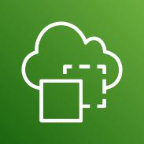{width="0.8319444444444445in"
height="0.8319444444444445in"} kurumsal uygulama verilerinizi, verileri
yeniden kaydetmeye veya başka bir konuma taşımaya gerek kalmadan,
bulunduğu yerde kullanmanıza imkân tanır.

Gerçek dünya sistemlerinin dijital ikizlerini kolayca oluşturarak
operasyonları\
optimize etmenize yardımcı olan AWS servisidir. Mevcut IoT, video ve\
Gerçek dünya ortamlarını doğru bir şekilde modellemek için veri
kaynaklarınızı\
fiziksel sistemlerin sanal kopyalarına bağlayan, otomatik olarak
oluşturulan bir bilgi grafiğiyle zamandan tasarruf edersiniz.
Verimliliği optimize etmek, üretimi artırmak ve performansı iyileştirmek
için sistemlerinizin ve operasyonlarınızın kapsamlı bir 3D görünümünü
elde edebilirsiniz.

**3.15. Oyun Teknolojisi Servisleri**\
**3.15.1. Open 3D Engine**\
{width="0.8305555555555556in"
height="0.8305544619422572in"} Open 3D Engine (O3DE) kullanıma sunuldu.
Lumberyard\'ın yerine geçen O3DE Kararlı 21.11 Sürümü, yeni bir Windows
yükleyicisi ve Linux desteğiyle kullanıma sunuldu. Temmuz ayında, Open
3D Foundation\'ın ve Apache 2.0 lisansı altında sunulan, AAA özellikli,
platformlar arası bir açık kaynak oyun altyapısı olan Open 3D Engine\'in
(O3DE) gelişini duyurduk. Oyun ve

simülasyon geliştiricilerine üretim işlem hatlarında iş birliği yapma,
bu işlem hatlarını özelleştirme ve denetleme konusunda daha fazla
seçenek sunmak istedik. Ayrıca Linux Foundation ve sektör ortaklarıyla
birlikte bir açık kaynak topluluğu oluşturuyoruz. Lumberyard\'ın yerine
geçen O3DE Kararlı 21.11 Sürümü, yeni bir Windows yükleyicisi ve Linux
desteğiyle kullanıma sunuldu.

**3.15.2. Amazon GameLift**\
{width="0.8305555555555556in"
height="0.8305544619422572in"} Bağlı bulut sunucuları ile çoklu oyuncu
deneyimlerini artıran bir AWS servisidir. Amazon GameLift, çok oyunculu
oyunlar için bulut sunucuları dağıtan, çalıştıran ve ölçeklendiren
çözümü barındıran tahsis edilmiş oyun sunucusudur. Tam olarak yönetilen
bir çözüm veya yalnızca ihtiyacınız olan

73

özelliği arıyorsanız GameLift; en iyi gecikme süresi, düşük oyuncu
bekleme süreleri ve maksimum maliyet tasarrufu sağlama için AWS\'nin
gücünden yararlanır.

**3.16. Robotik Servisler**\
**3.16.1. AWS RoboMaker**\
{width="0.8305555555555556in"
height="0.8305544619422572in"} Robotik simülasyonu çalıştırmanızı,
ölçeklendirmenizi ve otomatikleştirmenizi sağlayan AWS servisidir. Tek
bir API çağrısıyla büyük ölçekli ve paralel simülasyonlar
çalıştırabilirsiniz. Simülasyon iş yüklerini hesaplı bir şekilde
ölçeklendirebilir ve otomatikleştirebilirsiniz. Kullanıcı tanımlı,
rastgele 3B sanal ortamları kolayca oluşturmanıza imkân sunar.

**3.17. Son Kullanıcı Bilişimi Servisleri**\
**3.17.1. Amazon AppStream 2.0**\
{width="0.8305555555555556in"
height="0.8305555555555556in"} Uygulamalara ve kalıcı olmayan
masaüstlerine her konumdan güvenli, güvenilir ve ölçeklenebilir erişim
imkânı sunan AWS servisidir. Uygulamalara ve masaüstlerine dilediğiniz
yerden erişim sayesinde uzaktan çalışan iş gücünüzün olanaklarını
genişletebilir ve değişen koşullara hızlı tepki verebilirsiniz.
Verileri, korunmasız uç nokta cihazları yerine AWS\'de depolayarak
güvenliği güçlendirebilirsiniz. Çeşitli işlem, bellek ve depolama
seçeneği ile istek üzerine bulut ölçeklenebilirliği sayesinde
maliyetleri optimize etmiş olursunuz. Tam olarak yönetilen uygulama
teslimi ve %99,9 çalışma süresi sunan güvenilir AWS altyapısı ile
kesinti sürelerini minimuma indirebilirsiniz.

**3.17.2. Amazon WorkSpaces Web**\
{width="0.8305555555555556in"
height="0.8305555555555556in"} olarak yazılım (SaaS) uygulamalarına
güvenli erişimi kolaylaştırmak için özel olarak oluşturulmuş düşük
maliyetli, tam olarak yönetilen bir çalışma alanıdır.

Amazon WorkSpaces Web, cihazların veya özel istemci yazılımlarının
idari\
yükü olmadan, mevcut web tarayıcılarından dahili web sitelerine ve
hizmet\
Kullanıcıların ihtiyaç duyduğu tüm web tabanlı üretkenlik araçlarına
herhangi\
bir tarayıcıdan erişim sağlarken dahili içeriği kurumsal kontrollerle
koruyun.

WorkSpaces Web (WorkLink), müşterilerin, cihazların veya özel istemci
yazılımlarının idari yükü olmadan, çalışanlarına dahili web sitelerine
ve SaaS web uygulamalarına güvenli bir şekilde erişim sağlamasını
kolaylaştırır. WorkSpaces Web, kapasite yönetimi, ölçekleme ve tarayıcı
görüntülerinin bakımı gibi genel görevlerin yükünü kaldırırken,
kullanıcı etkileşimleri için uyarlanmış basit ilke araçları sağlar.

**3.17.3. Amazon WorkSpaces**\
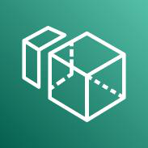{width="0.8305555555555556in"
height="0.8305555555555556in"} Kalıcı masaüstlerine her konumdan
güvenli, güvenilir ve ölçeklenebilir erişim imkânı sunan AWS servisidir.
Uygulamalara ve masaüstlerine dilediğiniz yerden erişim sayesinde
uzaktan çalışan iş gücünüzün olanaklarını genişletin ve değişen
koşullara hızlı tepki verebilirsiniz. Kullanıcı verilerini, korunmasız
uç nokta cihazları yerine AWS\'de depolayarak güvenliği
güçlendirirsiniz.

74

**3.18. Uydu Servisleri**\
**3.18.1. AWS Ground Station**\
Tam olarak yönetilen "Hizmet Olarak Yer İstasyonu" ile uyduları kolayca
{width="0.8305555555555556in"
height="0.8291655730533684in"} denetleyebileceğiniz ve verileri
alabileceğiniz AWS servisidir. AWS Ground Station, kendi yer istasyonu
altyapınızı oluşturmak veya yönetmekle uğraşmadan uydu iletişimlerini
denetlemenizi, verileri işlemenizi ve

işlemlerinizi ölçeklendirmenizi sağlayan, tam olarak yönetilen bir
hizmettir. Uydular; hava durumu tahminleri, yüzey görüntüleme, iletişim
ve video yayınları dahil olmak üzere çok çeşitli alanlarda kullanılır.
Yer istasyonları, küresel uydu ağlarının merkezini oluşturur. AWS Ground
Station sayesinde, AWS hizmetlerine ve düşük gecikmeli küresel fiber ağ
dahil olmak üzere AWS Küresel Altyapısı\'na doğrudan erişebilirsiniz.
Örneğin, indirilen verileri depolamak için Amazon S3\'ü, uydulardan veri
alımını yönetmek için Amazon Kinesis Data Streams\'i ve veri kümeleriniz
için geçerli olan özel makine öğrenimi uygulamalarını oluşturmak için
Amazon SageMaker\'ı kullanabilirsiniz. Yalnızca kullanılan gerçek anten
süresi için ödeme yaparak ve verileri ihtiyaç duyduğunuz yerde ve
zamanda indirmek için yer istasyonlarının küresel ayak izine güvenerek
yer istasyonu işlemlerinizin maliyetinde %80\'e kadar tasarruf
sağlayabilirsiniz. Uzun vadeli taahhütler yoktur ve işiniz
gerektirdiğinde uydu iletişimlerinizi istek üzerine hızla ölçeklendirme
olanağına sahip olursunuz.

**3.19. Uygulama Entegrasyonu Servisleri**\
**3.19.1. Amazon AppFlow**\
{width="0.8305555555555556in"
height="0.8291655730533684in"} Üçüncü taraf uygulamaları ve AWS
hizmetlerini kod olmadan güvenli bir şekilde entegre ederek veri
akışlarını otomatikleştiren AWS servisidir. Amazon AppFlow; Salesforce,
SAP, Zendesk, Slack ve ServiceNow gibi Hizmet Olarak Yazılım
uygulamaları ile Amazon S3 ve Amazon Redshift gibi

AWS hizmetleri arasında sadece birkaç tıklamayla güvenli veri aktarımı
yapmanıza olanak tanıyan, tam olarak yönetilen bir entegrasyon
hizmetidir. AppFlow sayesinde, veri akışlarını kurumsal ölçekte ve
seçtiğiniz sıklıkta (programlı biçimde, bir iş olayına yanıt olarak veya
istek üzerine) çalıştırabilirsiniz. Filtreleme ve doğrulama gibi veri
dönüştürme özelliklerini yapılandırarak ilave adımlar olmadan akışın bir
parçası olarak zengin ve kullanıma hazır veriler üretebilirsiniz.
AppFlow, hareket halindeki verileri otomatik olarak şifreler ve
kullanıcılara, AWS PrivateLink ile entegre olan SaaS uygulamaları için
verilerin genel internet üzerinden akışını kısıtlayarak güvenlik
tehditlerine maruz kalma riskini azaltma olanağı sunar.

**3.19.2. Amazon EventBridge**\
{width="0.8305555555555556in"
height="0.8291655730533684in"} AWS, mevcut sistemler veya SaaS
uygulamaları genelinde uygun ölçekte olay odaklı uygulamalar
geliştirmenize ortam sağlayan AWS servisidir. Amazon EventBridge sahip
olduğunuz uygulamalar, entegre Hizmet Olarak Yazılım (SaaS) uygulamaları
ve AWS hizmetleri tarafından oluşturulan olayları

kullanarak uygun ölçekte olay odaklı uygulamalar geliştirmeyi
kolaylaştıran sunucusuz bir olay veri yoludur. EventBridge; Zendesk veya
Shopify gibi olay kaynaklarından AWS Lambda ve diğer SaaS uygulamaları
gibi hedeflere gerçek zamanlı veri akışı sağlar. Olay yayıncısı ve
tüketici tamamen ayrıştırılmış haldeyken veri kaynaklarınıza gerçek
zamanlı olarak yanıt veren uygulama mimarileri oluşturmak üzere
verilerinizin nereye gönderileceğine karar vermek için yönlendirme
kuralları ayarlayabilirsiniz.

75

**3.19.3. Amazon Managed Workflows for Apache Airflow (MWAA)**\
{width="0.8305555555555556in"
height="0.8291666666666667in"} Apache Airflow için yüksek düzeyde
kullanılabilir, güvenli ve yönetilen iş akışı düzenlemesini sağlayan AWS
servisidir. Apache Airflow için Amazon Tarafından Yönetilen İş Akışları
(MWAA), bulutta uçtan uca veri ardışık düzenlerini uygun ölçekte kurmayı
ve çalıştırmayı

kolaylaştıran, Apache Airflow için yönetilen bir düzenleme hizmetidir.
Apache Airflow, \"iş akışları\" olarak adlandırılan süreç ve görev
dizilerini programlı olarak yazmak, planlamak ve izlemek için kullanılan
açık kaynaklı bir araçtır. Yönetilen İş Akışları ile, ölçeklenebilirlik,
kullanılabilirlik ve güvenlik için temel altyapıyı yönetmek zorunda
kalmadan iş akışları oluşturmak için Airflow ve Python\'u
kullanabilirsiniz. Yönetilen İş Akışları, iş akışı yürütme kapasitesini
ihtiyaçlarınızı karşılayacak şekilde otomatik olarak ölçeklendirir ve
verilere hızlı ve güvenli erişim sağlamanıza yardımcı olmak için AWS
güvenlik hizmetleriyle entegredir.

**3.19.4. Amazon MQ**\
{width="0.8305555555555556in"
height="0.8305555555555556in"} AWS tarafından sunulan tam olarak
yönetilebilir açık kaynak mesaj aracısı hizmetidir. Amazon MQ, Apache
ActiveMQ ve RabbitMQ için AWS'de mesaj aracıları ayarlayıp çalıştırmayı
kolaylaştıran bir yönetilen mesaj aracısı hizmetidir. Amazon MQ sizin
için ileti aracılarının tedarik, kurulum ve bakım işlemlerini yöneterek
operasyonel yükünüzü azaltır. Amazon MQ mevcut

uygulamalarınıza endüstride standart olan API'ler ve protokollerle
eriştiği için kodu yeniden yazmak zorunda kalmadan AWS'ye kolayca
aktarım gerçekleştirebilirsiniz.

**3.19.5. Amazon Simple Notification Service**\
Tümüyle yönetilen pub/sub mesajlaşma, SMS, e-posta ve mobil anlık
bildirimler
{width="0.8305555555555556in"
height="0.8305544619422572in"} uygulamadan uygulamaya (A2A) hem de
uygulamadan kişiye (A2P) iletişim için tam olarak yönetilen bir
mesajlaşma hizmetidir.

> servisidir. Amazon Simple Notification Service (Amazon SNS), hem

A2A pub/sub işlevi; dağıtılmış sistemler, mikro hizmetler ve olay
tabanlı sunucusuz uygulamalar arasında yüksek aktarım hızlı, gönderme
tabanlı, çoktan çoka mesajlaşmaya yönelik konular sunar. Yayıncı
sistemleriniz, Amazon SNS konularını kullanarak mesajları paralel işleme
için Amazon SQS kuyrukları, AWS Lambda işlevleri, HTTPS uç noktaları ve
Amazon Kinesis Data Firehose gibi çok sayıda abone sistemine
dağıtabilir. A2P işlevi kullanıcılara SMS, mobil anlık bildirimler ve
e-posta yoluyla uygun ölçekte mesajlar göndermenizi sağlar.

**3.19.6. Amazon Simple Queue Service**\
{width="0.8305555555555556in"
height="0.8291655730533684in"} Mikro hizmetler, dağıtılmış sistemler ve
sunucusuz uygulamalar için tümüyle yönetilen ileti kuyrukları
servisidir. Amazon Simple Queue Service (SQS), dağıtılmış sistemleri ve
sunucusuz uygulamaları birbirinden ayırmanıza ve ölçeklendirmenize imkân
tanıyan, tam olarak yönetilen bir iletileri kuyruğa alma hizmetidir.
SQS, mesajlaşmaya yönelik ara yazılımları yönetmenin ve

işletmenin getirdiği karmaşıklık ile ek iş yükünü ortadan kaldırarak
geliştiricilerin farklı işlere odaklanmasına imkân tanır. SQS ile ileti
kaybı yaşamadan veya diğer hizmetlerin erişilebilir olmasına gereksinim
duymadan yazılım bileşenleri arasında dilediğiniz hacimde ileti
gönderebilir, depolayabilir ve alabilirsiniz. AWS Management Console,
Command Line Interface veya tercih ettiğiniz SDK\'yi ve üç basit komutu
kullanarak SQS\'yi dakikalar içinde kullanmaya başlayabilirsiniz.

SQS iki tür ileti kuyruğu sunar. Standart kuyruklar tarafından en yüksek
aktarım hızı, en iyi çaba ilkesine göre sıralama ve en az bir kez teslim
olanakları sunulur. SQS FIFO kuyrukları,

76

iletilerin tam olarak bir kez ve tam olarak gönderildikleri sırada
işlenmesi konusunda güvence sağlayacak şekilde tasarlanmıştır.

**3.19.7. AWS Step Functions**\
Modern uygulamalar için görsel iş akışları sağlayan AWS servisidir. AWS
Step
{width="0.8305555555555556in"
height="0.8291666666666667in"} Functions, geliştiricilerin dağıtılmış
uygulamalar oluşturmak, BT ve iş süreçlerini otomatikleştirmek ve AWS
hizmetlerini kullanarak veri ve makine öğrenimi işlem hatları oluşturmak
için kullandığı az kod kullanımlı, görsel bir iş akışı hizmetidir. İş
akışları, geliştiricilerin daha yüksek değerli iş mantığına

odaklanabilmesi için hataları, yeniden denemeleri, paralelleştirmeyi,
hizmet entegrasyonlarını ve gözlemlenebilirliği yönetir.

**3.20. Veri Tabanı Servisleri**\
**3.20.1. Amazon Aurora**\
{width="0.8305555555555556in"
height="0.8291655730533684in"} Tam MySQL ve PostgreSQL uyumluluğuyla
rakipsiz yüksek performans ve küresel ölçekte erişilebilirlik için
tasarlanan AWS servisidir. Ticari veri tabanı maliyetinin onda biriyle
tam MySQL ve PostgreSQL uyumluluğunu sürdürürken, yüksek performans
gerektiren uygulamaları ve kritik iş yüklerini destekler. %99,99 çalışma
süresi SLA\'sıyla ve 1 dakikadan az sürede bölgeler arası olağanüstü
durum kurtarma özelliği içeren küresel replikasyonla desteklenen
Multi-AZ erişilebilirliği ile uygulamalar oluşturmanıza imkân tanır.
Sunucusuz gibi yenilikler dahil olmak üzere tam olarak yönetilen bir
veri tabanıyla üretkenliği artırıp toplam sahip olma maliyetini
düşürerek kullanıcılarınızı memnun eden uygulamalar oluşturmaya
odaklanırsınız. Standart araçlar kullanarak Aurora\'ya ve Aurora\'dan
kolayca MySQL veya PostgreSQL veri tabanları geçirebilir ya da Babelfish
for Aurora PostgreSQL ile eski SQL Server uygulamalarını minimum kod
değişikliğiyle çalıştırırsınız.

**3.20.2. Amazon DocumentDB**\
Tam olarak yönetilen bir belge veri tabanı hizmeti kullanarak JSON iş
yüklerini
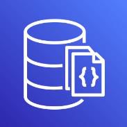{width="0.8305555555555556in"
height="0.8291655730533684in"} kolayca ölçeklendiren ve MongoDB ile
uyumlu AWS servisidir. İşlem ve depolamayı birbirinden bağımsız olarak
ölçeklendirerek saniyede milyonlarca belge okuma isteğini destekler.
Donanım tedariki, düzeltme eki uygulama, kurulum ve diğer veri tabanı
yönetim görevlerini otomatik hale getirir. Otomatik çoğaltma, sürekli
yedekleme ve sıkı ağ yalıtımı ile %99,999999999 oranında dayanıklılık
elde edersiniz. Apache 2.0 açık kaynak MongoDB 3.6 ve 4.0 API\'leriyle
mevcut MongoDB sürücülerini ve araçlarını kullanabilirsiniz.

**3.20.3. Amazon DynamoDB**\
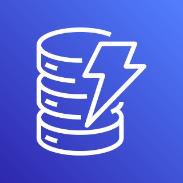{width="0.8305555555555556in"
height="0.8291655730533684in"} performansı, neredeyse sınırsız aktarım
hızı ve depolama, ayrıca otomatikleştirilmiş çok bölgeli replikasyon ile
uygulamaları teslim eder.

> Her ölçekte on milisaniyenin altında gecikme süresi performansı için
> hızlı, esnek NoSQL veri tabanı hizmetidir. On milisaniyenin altında
> tutarlı gecikme süresi Verilerinizi bekleme sırasında şifreleme,
> otomatik yedekleme ve geri yükleme,

ayrıca %99,999\'a varan erişilebilirliğe sahip bir SLA\'nın sunduğu
güvenilirlik garantisiyle korur. İhtiyaçlarınıza uyması için otomatik
olarak yukarı ve aşağı yönlü ölçeklenen, tam olarak yönetilen sunucusuz
bir veri tabanıyla inovasyona odaklanabilir ve maliyetleri optimize
edersiniz. Verilerinizle daha fazlasını yapabilmek için AWS
hizmetleriyle entegre edebilir. Analizler yapmak, öngörüler elde etmek
ve trafik eğilimlerini izlemek için yerleşik araçları kullanabilirsiniz.

77

**3.20.4. Amazon ElastiCache**\
Bellek içi önbelleğe alma özelliğiyle mikrosaniye düzeyinde gecikme
süresine
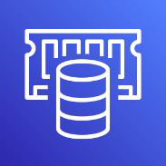{width="0.8305555555555556in"
height="0.8291655730533684in"} ulaşan ve ölçeklendiren AWS servisidir.
Uygulama performansını artırarak gecikme süresini mikro saniye düzeyine
indirir. İnternet ölçeğindeki en zorlu uygulamalarınızın
gereksinimlerini karşılamak için yalnızca birkaç tıklamayla
ölçeklendirilebilir. Kendi kendine yönetilen önbelleğe alma süreçlerinin
getirdiği maliyetleri azaltır ve operasyonel iş yükünü ortadan kaldırır.
İki popüler açık kaynaklı önbelleğe alma teknolojisi olan Redis veya
Memcached arasında seçim yaparak oluşturabilirsiniz.

**3.20.5. Amazon Keyspaces (for Apache Cassandra)**\
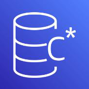{width="0.8305555555555556in"
height="0.8291655730533684in"} Amazon Keyspaces (for Apache Cassandra);
ölçeklenebilir, yüksek oranda erişilebilir ve yönetilen bir Apache
Cassandra uyumlu veri tabanı hizmetidir.

> Ölçeklenebilir, yüksek oranda erişilebilir ve yönetilen bir Apache
> Cassandra uyumlu veri tabanı hizmetidir.

Amazon Keyspaces ile Cassandra iş yüklerinizi, bugün kullandığınız
Cassandra uygulama kodu ve geliştirici araçlarını kullanarak AWS
üzerinde çalıştırabilirsiniz. Herhangi bir sunucu tedarik etmenize,
sunucuya düzeltme eki uygulamanıza veya sunucuyu yönetmenize ya da
herhangi bir yazılım yüklemenize, bakım yapmanıza veya işletmenize gerek
yoktur. Amazon Keyspaces, sunucusuz bir hizmettir. Bu nedenle, yalnızca
kullandığınız kaynaklar için ödeme yaparsınız ve hizmet, uygulama
trafiğine bağlı olarak tabloların ölçeklerini otomatik bir şekilde
artırıp azaltabilir. Neredeyse sınırsız bir aktarım hızı ve depolama ile
saniye başına binlerce istek sunan uygulamalar oluşturabilirsiniz.
Veriler varsayılan olarak şifrelenir ve Amazon Keyspaces belirli bir
noktaya kurtarma kullanarak sürekli olarak tablo verilerinizi
yedeklemenizi sağlar. Amazon Keyspaces, iş açısından kritik Cassandra iş
yüklerini uygun ölçekte çalıştırmanız için ihtiyacınız olan performansı,
esnekliği ve kurumsal özellikleri sunar.

**3.20.6. Amazon MemoryDB for Redis**\
Ultra hızlı performans için Redis uyumlu, dayanıklı, bellek içi veri
tabanı
{width="0.8305555555555556in"
height="0.8291655730533684in"} Arka arkaya beş yıl boyunca Stack
Overflow\'un en sevilen veri tabanı olan Redis ile uygulamaları hızla
oluşturabilirsiniz. Ultra hızlı performansla verilere hizmetidir.

erişebilir, günde 13 trilyondan fazla ve saniyede 160 milyondan fazla
istek işleyebilir.

Hızlı veri tabanı kurtarma ve yeniden başlatma için Multi-AZ işlem
günlüğü kullanan bellek içi depolama ile verileri dayanıklı bir şekilde
depolar. Uygulamanızın gereksinimlerini karşılamak için küme başına
birkaç gigabayttan yüz terabayttan fazla depolama alanına sorunsuz bir
şekilde ölçeklendirebilir.

**3.20.7. Amazon Neptune**\
Grafik uygulamalarını yüksek oranda bağlı veri kümeleriyle oluşturabilen
ve
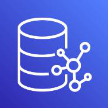{width="0.8305555555555556in"
height="0.8305555555555556in"} çalıştırabilen AWS servisidir. Kimlik,
bilgi, dolandırıcılık grafiği ve diğer uygulamaları yüksek performansla
oluşturup çalıştırır ve saniyede 100.000\'den fazla sorgu yürütebilir.
Gremlin, openCypher ve SPARQL gibi popüler açık kaynak kodlu API\'leri
kullanarak yüksek performanslı grafik uygulamaları dağıtır ve mevcut
uygulamaları kolayca geçirebilir. Grafik veri tabanlarını donanım
tedarik etme, yazılım düzeltme eki uygulama, kurulum, yapılandırma veya
yedekleme kaygısı olmadan çalıştırabilir ve peşin lisanslama ücretleri
ödemekten kurtulursunuz.

78

**3.20.8. Amazon RDS**\
Yalnızca birkaç tıklamayla bulutta bir ilişkisel veri tabanını kurun,
çalıştıran ve
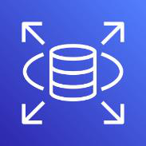{width="0.8305555555555556in"
height="0.8305544619422572in"} ölçeklendiren AWS servisidir. Altyapı
tedarik etmeye veya yazılım bakımına ihtiyaç olmadan verimsiz ve zaman
alıcı veri tabanı yönetim görevlerini ortadan kaldırır. Seçtiğiniz
ilişkisel veri tabanı altyapılarını bulutta veya şirket içinde dağıtır
ve ölçeklendirir. Amazon RDS Multi-AZ dağıtımları ile yüksek düzeyde
erişilebilirlik elde edebilirsiniz. Performansı kanıtlanmış on yıldan
fazla operasyonel uzmanlığın, en iyi güvenlik uygulamalarının ve
inovasyonun avantajlarından faydalanırsınız.

**3.20.9. Amazon Redshift**\
{width="0.8305555555555556in"
height="0.8291666666666667in"} Uygun ölçekte hızlı, kolay ve güvenli
bulut veri ambarı sayesinde öngörü elde etme sürenizi kısaltan AWS
servisidir. Herkes için kolay analizlerle verilerden saniyeler içinde
öngörüler elde etmeye odaklanmanızı sağlar. Veri ambarı altyapınızı
yönetme konusunu düşünmek zorunda kalmazsınız. Operasyonel veri
tabanları, data-lake\'ler, veri ambarları ve üçüncü taraf veri
kümelerindeki tüm verilerinizi analiz eder. Sorgu hızını iyileştiren
otomasyon sayesinde uygun ölçekte diğer bulut veri ambarlarından 3 kata
kadar daha iyi fiyat performansı elde etmenizi sağlar.

**3.20.10. Amazon Timestream**\
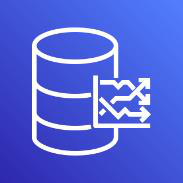{width="0.8305555555555556in"
height="0.8291655730533684in"} Amazon Timestream, IoT uygulamaları ve
operasyonel uygulamalar için, ilişkisel veri tabanlarının maliyetinin
1/10\'u kadar düşük bir maliyetle ve günde trilyonlarca olayın 1.000
kata kadar daha hızlı depolanmasını ve analizini kolaylaştıran hızlı,
ölçeklenebilir ve sunucusuz bir zaman serisi veri tabanı hizmetidir.
Amazon Timestream, yakın tarihli verileri bellekte tutarak ve geçmiş

verileri kullanıcı tanımlı politikalar temelinde maliyet açısından
optimize edilmiş bir depolama katmanına taşıyarak zaman serisi
verilerinin yaşam döngüsünü yönetmede size zaman ve maliyet tasarrufu
sağlar.

Amazon Timestream\'in amaca yönelik sorgu motoru, sorguda verilerin
bellekte mi yoksa maliyet açısından optimize edilmiş katmanda mı
bulunduğunu açıkça belirtmenize gerek kalmadan yakın tarihli ve geçmiş
verilere birlikte erişmenize ve bunları analiz etmenize olanak tanır.
Amazon Timestream, verilerinizdeki eğilimleri ve kalıpları neredeyse
gerçek zamanlı olarak belirlemenize yardımcı olan yerleşik zaman serisi
analiz fonksiyonlarına sahiptir. Amazon Timestream sunucusuzdur ve
kapasite ile performansı ayarlamak için ölçeği otomatik olarak artar
veya azalır. Böylece temeldeki altyapıyı yönetmenize gerek kalmaz ve
uygulamalarınızı oluşturmaya odaklanabilirsiniz.

**3.21. Yönetim & Yönetişim (Denetim) Servisleri**\
**3.21.1. Amazon CloudWatch**\
{width="0.8347211286089239in"
height="0.8333333333333334in"} AWS kaynaklarınızın ve uygulamalarınızın
AWS'de ve şirket içinde gözlemlenebilirliğini sağlayan AWS servisidir.
Amazon CloudWatch; DevOps mühendisleri, geliştiriciler, saha
güvenilirliği mühendisleri (SRE\'ler), BT yöneticileri ve ürün sahipleri
için geliştirilmiş bir

izleme ve gözlemlenebilirlik hizmetidir. CloudWatch; uygulamalarınızı
izlemenize, sistem genelindeki performans değişikliklerine müdahalede
bulunmanıza ve kaynak kullanımını optimize etmenize yarayan veriler ve
eyleme dönüştürülebilir öngörüler sağlar. CloudWatch, izleme verilerini
ve operasyonel verileri günlükler, ölçümler ve olaylar biçiminde toplar.
Operasyonel durum hakkında birleşik bir görünüme sahip olur, AWS\'de ve
şirket içinde çalışan AWS kaynaklarınız, uygulamalarınız ve
hizmetleriniz için tam görünürlük elde edersiniz. CloudWatch\'u
kullanarak ortamlarınızdaki anormal davranışları algılayabilir, alarmlar

79

kurabilir, günlükleri ve ölçümleri yan yana görselleştirebilir, otomatik
eylemler gerçekleştirebilir, sorunları giderebilir ve uygulamalarınızı
sorunsuz şekilde çalıştırmak için öngörüler edinebilirsiniz.

**3.21.2. Amazon Managed Grafana**\
Operasyonel ölçümleriniz, günlükleriniz ve izlemeleriniz için
ölçeklenebilir,
{width="0.8347211286089239in"
height="0.8333333333333334in"} Amazon Managed Grafana, Grafana Labs ile
iş birliği içinde geliştirilen açık kaynaklı Grafana için tam olarak
yönetilen bir hizmettir. Grafana, nerede güvenli ve yüksek düzeyde
kullanılabilir veri görselleştirme servisidir.

depolanırlarsa depolansınlar, ölçümlerinizi sorgulamanıza,
görselleştirmenize, anlamanıza ve bunlar üzerinde uyarı işlemleri
gerçekleştirmenize olanak tanıyan popüler bir açık kaynaklı analiz
platformudur.

Amazon Managed Grafana sayesinde, sunucu tedarik etmek, yazılım
yapılandırmak ve güncellemek veya üretimde Grafana\'yı güvende tutma ve
ölçeklendirme ile ilgili ağır işleri yapmak zorunda kalmadan
ölçümlerinizi, günlüklerinizi ve izlemelerinizi analiz edebilirsiniz.
Gözlemlenebilirlik panoları oluşturabilir, keşfedebilir ve bunları
ekibinizle paylaşabilir; Grafana altyapınızı yönetmek için daha az,
uygulamalarınızın durumunu, performansını ve kullanılabilirliğini
iyileştirmek için daha fazla zaman harcayabilirsiniz. Amazon Managed
Grafana\'yı, Amazon Managed Service for Prometheus, Amazon CloudWatch ve
Amazon Elasticsearch Service gibi AWS veri kaynakları, Datadog ve Splunk
gibi üçüncü taraf ISV\'ler ve InfluxDB gibi kendi kendini yöneten veri
kaynakları dahil olmak üzere gözlemlenebilirlik yığınınızdaki birden çok
veri kaynağına bağlayın. Amazon Managed Grafana, AWS konsolunda birkaç
tıklamayla birden fazla hesap ve bölge genelinde AWS verilerinizi
güvenli bir şekilde ekleyebilmeniz, sorgulayabilmeniz,
görselleştirebilmeniz ve analiz edebilmeniz için AWS hizmetleriyle yerel
olarak entegre olur.

**3.21.3. Amazon Managed Service for Prometheus**\
{width="0.8347211286089239in"
height="0.8347222222222223in"} Container\'larınız için yüksek oranda
erişilebilir, güvenli ve yönetilen izleme sağlayan AWS servisidir.
Amazon Managed Service for Prometheus, container içeren uygulamaları ve
altyapıyı büyük ölçekte izlemeyi kolaylaştıran Prometheus uyumlu bir
izleme ve

uyarı hizmetidir. Cloud Native Computing Foundation\'ın Prometheus
projesi, container ortamları için optimize edilmiş popüler bir açık
kaynak izleme ve uyarı çözümüdür. Amazon Managed Service for Prometheus
ile, temel altyapıyı ölçeklendirmek ve çalıştırmak zorunda kalmadan
container içeren iş yüklerinin performansını izlemek ve bunlar üzerinde
uyarı işlemleri gerçekleştirmek için açık kaynaklı Prometheus sorgu
dilini (PromQL) kullanabilirsiniz. Amazon Managed Service for
Prometheus, iş yükleri büyüdükçe veya küçüldükçe operasyonel ölçümlerin
alınmasını, depolanmasını, sorgulanmasını ve bunlar üzerinde uyarı
işlemleri yürütülmesini otomatik olarak ölçeklendirir, verilere hızlı ve
güvenli erişim sağlamak için AWS güvenlik hizmetleriyle entegre olur.
Hizmet, Amazon Elastic Kubernetes Service (Amazon EKS), Amazon Elastic
Container Service (Amazon ECS) ve AWS Distro for OpenTelemetry ile
entegredir.

**3.21.4. AWS Chatbot**\
{width="0.8347211286089239in"
height="0.8347222222222223in"} Chatbot ile uyarılar alabilir, tanılama
bilgilerini almak için komutlar çalıştırabilir, AWS kaynaklarını
yapılandırabilir ve iş akışlarını başlatabilirsiniz.

> AWS Chatbot, sohbet kanallarınızdaki AWS iş yüklerinizi izlemeyi,
> çalıştırmayı ve bunlarla ilgili sorunları gidermeyi kolaylaştıran
> etkileşimli bir aracıdır. AWS

80

Yalnızca birkaç tıklamayla, AWS bildirimleri alabilir ve AWS Command
Line Interface (CLI) komutlarını sohbet kanallarınızdan güvenli ve
verimli bir şekilde çalıştırabilirsiniz. AWS Chatbot, AWS hizmetleri ile
Slack kanallarınız veya Amazon Chime sohbet odaları arasındaki
entegrasyon ve güvenlik izinlerini yönetir. AWS Chatbot, ekibinizin
güncel kalmasını, iş birliği yapmasını ve AWS ortamınızda çalışan
uygulamalar için olaylara, güvenlik bulgularına ve diğer uyarılara hızla
yanıt vermesini kolaylaştırır. Ekibiniz, bağlamı diğer AWS yönetim
araçlarına geçirmeden AWS kaynaklarını güvenli bir şekilde
yapılandırmak, olayları çözmek ve Slack kanallarından görevleri
çalıştırmak için komutlar çalıştırabilir.

**3.21.5. AWS CloudFormation**\
{width="0.8347211286089239in"
height="0.8333333333333334in"} bölgelerindeki kaynakları tek bir
operasyonla yönetmenizi sağlar. Altyapınızı CloudFormation Registry,
geliştirici topluluğu ve kitaplığınızda Kod olarak altyapı ile bulut
tedarikini hızlandırmanızı sağlayan AWS servisidir.

> Altyapınızı dünya çapında ölçeklendirebilir ve tüm AWS hesaplarındaki
> ve

yayınlanan bulut kaynaklarını içerecek şekilde genişletebilir ve
yönetebilirsiniz. Kullanıma hazır uygulama dağıtımı ve yönetişim
denetimleri sunan AWS hizmet entegrasyonlarıyla kuruluşunuzdaki kaynak
yönetimini otomatikleştirir.

**3.21.6. AWS CloudTrail**\
{width="0.8347211286089239in"
height="0.8333333333333334in"} günlüklerini kullanarak kuruluşunuzu
cezalardan koruyabilirsiniz. Amazon EventBridge ile kullanıcı
etkinliğini ve olaylarını kaydederek güvenlik Kullanıcı etkinliklerini
ve API kullanımını izlemenizi sağlayan AWS servisidir.

SOC, PCI ve HIPAA gibi düzenlemelere uygunluğu kanıtlamak için
CloudTrail\
duruşunuzu iyileştirebilir ve otomatik iş akışı kuralları
ayarlayabilirsiniz. AWS\
bölgeleri (region) ve hesaplar genelinde kullanıcı etkinliğini ve API
kullanımını merkezi olarak kontrol edilen tek bir platformda yakalayıp
ve birleştirebilirsiniz.

**3.21.7. AWS Config**\
{width="0.8347211286089239in"
height="0.8347222222222223in"} AWS kaynaklarınızın yapılandırmalarını
kaydedin ve değerlendirmenizi sağlayan AWS servisidir. AWS Config, AWS
kaynaklarınızın yapılandırmalarını incelemenizi, denetlemenizi ve
değerlendirmenizi sağlayan bir hizmettir. Config, devamlı

olarak AWS kaynak yapılandırmalarınızı izler ve kaydeder; kayıtlı
yapılandırmaları istenen yapılandırmalara göre değerlendirmenizi
otomatikleştirmenizi sağlar. Config ile AWS kaynakları arasındaki ilişki
ve yapılandırmalardaki değişiklikleri inceleyebilir, ayrıntılı kaynak
yapılandırması geçmişlerine bakabilir ve dahili yönergelerinizde
belirtilen yapılandırmalara göre genel uyumluluğunuzu
belirleyebilirsiniz. Bu sayede mevzuat uyumluluğu denetimi, güvenlik
analizi, değişiklik yönetimi ve operasyonel sorun gidermeyi daha basit
hale getirebilirsiniz.

**3.21.8. AWS Control Tower**\
Güvenli ve çok hesaplı bir AWS ortamı oluşturmanın ve yönetmenin en
kolay
{width="0.8347211286089239in"
height="0.8333333333333334in"} Birden fazla AWS hesabınız veya ekibiniz
varsa bulut kurulumu ve yönetişimi, karmaşık ve zaman alıcı olabilir,
hızlandırmak istediğiniz yenilik sürecini yolu olarak sunulan AWS
servisidir.

yavaşlatabilir. AWS Control Tower, "landing zone" adında güvenli ve çok
hesaplı bir AWS ortamı oluşturup yönetmenin en kolay yolunu sunar. AWS
Organizations\'ı kullanarak landing zone\'unuzu oluşturur ve hem buluta
geçiş yapan binlerce müşteriyle çalışan AWS\'nin deneyimine dayalı en
iyi hayata geçirme uygulamalarını hem de sürekli hesap yönetimini ve

81

yönetişimi beraberinde getirir. Siz hesaplarınızın şirket politikalarına
uygun olmasının verdiği gönül rahatlığını yaşarken geliştiriciler birkaç
tıklamayla yeni AWS hesapları tedarik edebilir. Yönetişimi yeni ya da
mevcut hesapları kapsayacak şekilde genişletin ve bunların uygunluk
durumları hakkında hızlıca görünürlük elde edin. Yeni bir AWS ortamı
oluşturuyorsanız, AWS yolculuğunuza çıkıyorsanız ya da yeni bir bulut
girişimi başlatıyorsanız AWS Control Tower, yerleşik yönetişim ve en iyi
uygulamalarla hızlı bir başlangıç yapmanıza yardımcı olacaktır.

**3.21.9. AWS Distro for OpenTelemetry**\
{width="0.8347211286089239in"
height="0.8333333333333334in"} Tahmin edilebilir performansa sahip,
güvenli, üretime hazır, açık kaynaklı dağıtım servisidir. AWS Distro for
OpenTelemetry; OpenTelemetry projesinin güvenli, üretime hazır, AWS
destekli bir dağıtımıdır. Cloud Native Computing Foundation'ın bir

parçası olan OpenTelemetry, uygulama izleme amacıyla kullanılabilecek
dağıtılmış izleri ve ölçümleri toplamak için açık kaynaklı API'ler,
kitaplıklar ve aracılar sağlar. AWS Distro for OpenTelemetry sayesinde
uygulamalarınızı yalnızca bir kez kullanarak birden çok AWS ve çözüm
ortağı izleme çözümüne ilişkili ölçümler ve izler gönderebilirsiniz.
Kodunuzu değiştirmeden iz toplamak için otomatik kurma aracılarını
kullanın. AWS Distro for OpenTelemetry ayrıca AWS kaynaklarınızdan ve
yönetilen hizmetlerinizden meta veriler toplayarak size uygulama
performansı verilerini temel altyapı verileriyle ilişkilendirme ve
ortalama sorun çözme süresini kısaltma imkânı sunar. Amazon Elastic
Compute Cloud (EC2), Amazon Elastic Container Service (ECS), EC2
üzerinde Amazon Elastic Kubernetes Service (EKS), AWS Fargate ve AWS
Lambda üzerinde ve ayrıca yerinde çalışan uygulamalarınızı kurmak için
AWS Distro for OpenTelemetry'yi kullanın.

**3.21.10. AWS Launch Wizard**\
{width="0.8347211286089239in"
height="0.8347211286089239in"} AWS Başlatma Sihirbazı, Microsoft SQL
Server Always On ve HANA tabanlı SAP sistemleri gibi üçüncü taraf
uygulamalar için AWS kaynaklarını tek tek AWS\'de üçüncü taraf
uygulamalarını kolayca boyutlandırma, yapılandırma ve dağıtma hizmeti
sunan servistir.

AWS kaynaklarını manuel olarak belirlemeye ve sağlamaya gerek kalmadan
boyutlandırma, yapılandırma ve dağıtmanın rehberli bir yolunu sunar.
Başlamak için, hizmet konsolunda performans, düğüm sayısı ve bağlantı
dahil olmak üzere uygulama gereksinimlerinizi girersiniz. Başlatma
Sihirbazı, uygulamanızı dağıtmak ve çalıştırmak için EC2 bulut
sunucuları ve EBS birimleri gibi doğru AWS kaynaklarını tanımlar.
Başlatma Sihirbazı, tahmini bir dağıtım maliyeti sağlar ve güncellenmiş
bir maliyet değerlendirmesini anında görüntülemek için kaynaklarınızı
değiştirmenize olanak tanır. AWS kaynaklarını onayladığınızda, Başlatma
Sihirbazı, tam işlevli, üretime hazır bir uygulama oluşturmak için
seçilen kaynakları otomatik olarak sağlar ve yapılandırır.

AWS Başlatma Sihirbazı, sonraki dağıtımları hızlandırmak için temel
olarak hizmet edebilecek CloudFormation şablonları da oluşturur.
Başlatma Sihirbazı ek ücret ödemeden kullanılabilir.

Yalnızca çözümünüzü çalıştırmak için sağlanan AWS kaynakları için ödeme
yaparsınız.

**3.21.11. AWS License Manager**\
{width="0.8347211286089239in"
height="0.8347222222222223in"} AWS License Manager, AWS ve şirket içi
ortamlarda Microsoft, SAP, Oracle ve IBM gibi satıcılardan alınan
yazılım lisanslarını yönetmenizi kolaylaştırır.

> Yazılım lisansı kullanımını yönetmek, keşfetmek ve raporlamak için
> kurallar belirleyebileceğiniz AWS servisidir.

AWS License Manager yöneticilerin, lisans sözleşmelerinin koşullarını
yansıtan özelleştirilmiş

82

lisans kuralları oluşturmasına olanak tanır. Yöneticiler bu kuralları
kullanarak, bir sözleşmede belirtilenden daha fazla lisans kullanma gibi
lisans ihlallerini önlemeye yardımcı olabilir. AWS License Manager\'daki
kurallar, bulut sunucusunun başlatılmasını durdurarak veya yöneticileri
ihlal hakkında bilgilendirerek lisans ihlalini önlemeye yardımcı olur.
Yöneticiler, AWS License Manager panosu sayesinde tüm lisanslarının
kontrolünü ele alarak hepsini kolayca görebilir; uygunsuzluk, hatalı
raporlama ve fazla lisans kullanımından kaynaklanan ek maliyetlerle
karşı karşıya kalma riskini azaltır. Bağımsız yazılım satıcıları
(ISV\'ler) da AWS License Manager\'ı kullanarak lisansları kolayca
dağıtabilir ve takip edebilir.

AWS License Manager, Amazon EC2 Tahsis Edilmiş Ana Sunucular gerektiren
yazılım lisanslarınızın yönetimini de basitleştirir. Yöneticiler, AWS
License Manager\'da ana sunucu tahsisi ve ana sunucu kapasite kullanımı
için Tahsis Edilmiş Ana Sunucu yönetimi tercihlerini belirleyebilir.
Kurulumun ardından, bu idari işleri AWS License Manager\'ın üstlenmesi
sayesinde, tıpkı AWS\'nin sağladığı lisanslarla EC2 bulut sunucusu
başlatırken yaptığınız gibi bulut sunucularını sorunsuzca
başlatabilirsiniz.

AWS License Manager ek bir ücret olmadan sunulur. Yalnızca
uygulamalarınızı çalıştırmak için kullandığınız AWS kaynakları için
ödeme yaparsınız. Lisanslarınızı yönetmeye başlamak için AWS License
Manager konsolunu ziyaret edin.

**3.21.12. AWS Managed Services**\
AWS alt yapınızı sizin adınıza işleten servistir.

{width="0.8347211286089239in"
height="0.8333333333333334in"} AWS Managed Services (AMS), AWS
altyapınızı daha verimli ve güvenli bir şekilde çalıştırmanıza yardımcı
olur. AWS hizmetlerinden ve büyüyen bir otomasyon, yapılandırma ve
çalıştırma kitaplığından yararlanan AMS, hem yeni

hem de mevcut AWS ortamlarında operasyonel yeteneklerinizi artırabilir
ve optimize edebilir. Müşteriler ister yeni başlıyor ister bir veri
merkezini taşıyor veya bulutta optimize edilmiş çözümler oluşturuyor
olsun, devam eden operasyonel mükemmellik, bulutta başarının kritik bir
bileşenidir. AMS, kısa vadeli hızlandırıcı veya uzun vadeli bir çözüm
olarak bulut operasyonları becerilerinizi ve deneyiminizi artırmanıza
yardımcı olabilir; uygulamalarınızı ve işinizi bulutta dönüştürmeye
odaklanmanızı sağlar. AMS size operasyonel esneklik sağlar, güvenliği ve
uyumluluğu artırır ve kapasiteyi optimize etmenize ve belirlenen maliyet
tasarrufları için harekete geçmenize yardımcı olur. AMS, hem geleneksel
hem de modernize edilmiş iş yükleri için dedektif korkuluklar, izleme,
güvenlik ve olay yönetimi en iyi uygulamalarından yararlanarak tüm AWS
filonuz için tutarlı bir işletim modeli sağlar.

**3.21.13. AWS Management Console**\
{width="0.8333333333333334in"
height="0.8333333333333334in"}\
AWS Cloud\'a erişmek ve yönetmek için ihtiyaç duyduğunuz her şey tek bir
web arabiriminde bulunur.

**3.21.14. AWS Console Mobile Application**\
Hareket halindeyken AWS kaynaklarınıza bağlı kalmanızı sağlayan AWS
{width="0.8347211286089239in"
height="0.8333333333333334in"} hareket halindeyken vaka yanıtı desteği
sağlamak için belirli bir kaynak kümesini görüntülemenize ve yönetmenize
olanak tanır.

> servisidir. Amazon Web Services\'ın sunduğu AWS Console Mobile
> Application,

Console Mobile Application, tahsis edilmiş bir pano üzerinden kaynakları
izlemenizi ve belirli AWS hizmetlerine yönelik yapılandırma
ayrıntılarını, ölçümleri ve alarmları görüntülemenizi

83

sağlar. Pano, izin verilen kullanıcılara Amazon CloudWatch ve AWS Health
Dashboard\'un yanı sıra AWS Faturalama ve Maliyet Yönetimi üzerindeki
gerçek zamanlı verilerle birlikte hesap durumuna ilişkin genel bir bakış
sunar. Devam eden sorunları görüntüleyebilir ve hem grafikleri hem de
yapılandırma seçeneklerini içeren ayrıntılı bir görünüm için ilgili
CloudWatch alarm ekranını takip edebilirsiniz. Ayrıca, belirli AWS
hizmetlerinin durumunu kontrol edebilir, ayrıntılı kaynak ekranlarını
görüntüleyebilir ve belirli eylemleri gerçekleştirebilirsiniz.

Console Mobile Application\'ı kullanmak için mevcut bir AWS hesabının
bulunması gerekir. Kök Kullanıcı, IAM Kullanıcısı veya Birleştirilmiş
Rol ile oturum açıldıktan sonra Console Mobile Application, kimlikler
arasında kolayca geçiş yapabilmeniz için kimlik bilgilerinizi kaydeder.

Düzenli olarak yeni özellikler içeren güncellemeler yayınlıyoruz. Konsol
Mobil Uygulaması'nın Geri bildirim özelliği üzerinden, bize hangi
özelliklere ihtiyaç duyduğunuzu ve bunları nasıl kullanacağınızı
iletebilirsiniz. Size kulak veriyoruz.

**3.21.15. AWS OpsWorks**\
{width="0.8347211286089239in"
height="0.8347222222222223in"} yapılandırma yönetimi hizmetidir. Chef ve
Puppet, sunucularınızın yapılandırmalarını otomatikleştirmek için kod
kullanmanızı sağlayan Chef ve Puppet ile işlemlerinizi
otomatikleştirmenizi sağlayan AWS servisidir.

> AWS OpsWorks, Chef ve Puppet\'ın yönetilen bulut sunucularını sağlayan
> bir otomasyon platformlarıdır. OpsWorks, Chef ve Puppet\'ı kullanarak

sunucularınızın Amazon EC2 bulut sunucularınızda veya şirket içi bilişim
ortamlarınızda yapılandırma, dağıtım ve yönetim biçimini
otomatikleştirmenizi sağlar. OpsWorks üç teklife sahiptir: AWS Opsworks
for Chef Automate, AWS OpsWorks for Puppet Enterprise ve AWS OpsWorks
Stacks.

**3.21.16. AWS Organizations**\
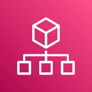{width="0.8347211286089239in"
height="0.8347222222222223in"} AWS kaynaklarınızı ölçeklendirirken
ortamınızı merkezi olarak yönetebileceğiniz ve idare edebileceğiniz AWS
servisidir. AWS Organizations, büyümeyle birlikte ortamlarınızı merkezi
olarak yönetmenize ve idare etmenize ve AWS kaynaklarınızı
ölçeklendirmenize

yardımcı olur. AWS Organizations'ı kullanarak programlama yoluyla yeni
AWS hesapları oluşturabilir ve kaynak ayırabilir, iş akışlarınızı
düzenlemek için hesapları gruplandırabilir, yönetim amacıyla hesaplara
veya gruplara politikalar uygulayabilir ve tüm hesaplarınız için tek bir
ödeme yöntemi kullanarak faturalamayı basitleştirebilirsiniz.

Ayrıca, AWS Organizations diğer AWS hizmetleriyle entegredir, bu nedenle
merkezi yapılandırmaları, güvenlik mekanizmalarını, denetim
gerekliliklerini ve kuruluşunuzda yer alan hesaplar arasındaki kaynak
paylaşımını tanımlayabilirsiniz. AWS Organizations, herhangi bir ek
ücret olmadan tüm AWS müşterileri tarafından kullanılabilir.

**3.21.17. AWS Personal Health Dashboard**\
{width="0.8347211286089239in"
height="0.8333333333333334in"} AWS ortamınızı etkileyen önemli olayları
ve değişiklikleri görüntüleyen servistir. AWS Personal Health Dashboard,
ortamınızı etkileyebilecek AWS olaylarına yönelik uyarılar ve rehberlik
sağlar. Service Health Dashboard, AWS hizmetlerinin genel durumunu
gösterirken Personal Health Dashboard, belirli AWS ortamınız hakkında
proaktif ve şeffaf bildirimler sunar.

Tüm AWS müşterileri Personal Health Dashboard\'a erişebilir. Personal
Health Dashboard, aktif olayları yönetmenize yardımcı olmak için son
olayları gösterir ve programlanmış

84

etkinlikler için plan yapabilmeniz amacıyla proaktif bildirimler sağlar.
AWS kaynaklarınızı etkileyebilecek değişiklikler hakkında bildirim almak
için bu uyarıları kullanın ve ardından, sorunları belirleyip çözmek için
kılavuzu takip edin.

**3.21.18. AWS Proton**\
{width="0.8347211286089239in"
height="0.8333333333333334in"} dağıtmasına yardımcı olmak için,
yönetilen ve onaylanmış yığınlarla korumalar ayarlamanızı sağlar.

> Container dağıtımları ve sunucusuz dağıtımlar için container
> yönetimini otomatikleştiren AWS servisidir. Geliştiricilerin
> uygulamaları oluşturmasına ve

Tek bir arayüzde altyapı sağlama ve kod dağıtımıyla geliştirici
üretkenliğini ve yeniliğini destekler. Kuruluşunuz genelinde tutarlı bir
mimariyi kolayca sürdürmek için uygulamaları tek bir tıklamayla
güncelleyebilirsiniz.

**3.21.19. AWS Resilience Hub**\
{width="0.8347211286089239in"
height="0.8333333333333334in"} Dayanıklılık hedeflerini değerlendirir
(Kurtarma Süresi Hedefi ve Kurtarma Noktası Hedefi).

> Uygulamalarınızı kesintilere karşı hazırlayan ve koruyan AWS
> servisidir. Kesintileri azaltmak için uygulama esnekliğini sürekli
> olarak doğrular ve izler.

Sorunları üretimde ortaya çıkmadan önce tanımlayabilir ve çözer.
Kurtarma maliyetlerini düşürürken iş sürekliliğini optimize eder.

**3.21.20. AWS Service Catalog**\
{width="0.8347211286089239in"
height="0.8333333333333334in"} AWS ürün kataloğunuzu oluşturmanıza,
düzenlemenize ve yönetmenize yardımcı olan AWS servisidir. AWS Service
Catalog, kurumların AWS\'de kullanılması için onaylanmış olan BT
hizmetlerinin kataloglarını oluşturmalarını ve yönetmelerini sağlar. Bu
BT

hizmetlerine sanal makine görüntüleri, sunucular, yazılımlar ve veri
tabanlarından bütün çok katmanlı uygulama mimarilerine kadar her şey
dâhildir. AWS Service Catalog dağıtılan BT hizmetlerini ve
uygulamalarınızı, kaynaklarınızı ve meta verilerinizi merkezden
yönetmenize olanak tanır. Bu durum süreçleri denetim altında tutmanıza
ve mevzuat uyumluluğu gereksinimlerinizi karşılamanıza yardımcı olur ve
kullanıcılarınızın yalnızca ihtiyaçları olan onaylı BT hizmetlerini
hızlı bir şekilde dağıtmasını sağlar. AWS Service Catalog AppRegistry
ile kuruluşlar AWS kaynaklarının uygulama içeriklerini anlayabilirler.
Maliyet, performans, güvenlik, uygunluk ve operasyonel durumu uygulama
düzeyinde takip etmek için uygulamalarınızı ve meta verilerini
tanımlayıp yönetebilirsiniz.

**3.21.21. AWS Systems Manager**\
{width="0.8347211286089239in"
height="0.8347211286089239in"} AWS kaynakları ve şirket içi kaynaklara
yönelik operasyon öngörüleri edinmenizi sağlayan servistir. Bulutta,
şirket içinde ve uç konumlarda görünürlüğü ve denetimi artırır.
Operasyonel sorunları saptama ve çözme süresini kısaltır. Bulut
sunucusunun düzeltme eki, yapılandırma ve özel politikanıza uygunluğunu
korur. Uygulamalarınızın ve kaynaklarınızın yapılandırmasını ve sürekli
yönetimini otomatikleştirir.

**3.21.22. AWS Trusted Advisor**\
{width="0.8347211286089239in"
height="0.8333333333333334in"} Maliyetleri azaltan, performansı ve
güvenliği iyileştiren AWS servisidir. AWS Trusted Advisor, en iyi AWS
uygulamalarını takip etmenize yardımcı olan öneriler sunar. Trusted
Advisor, denetimler kullanarak hesabınızı değerlendirir. Bu denetimler,
AWS altyapınızı optimize edecek, güvenliği ve performansı

85

iyileştirecek, genel maliyetleri düşürecek ve hizmet sınırlarını
izleyecek yollar belirler. Ardından, denetim önerilerini izleyerek
hizmetlerinizi ve kaynaklarınızı optimize edebilirsiniz.

AWS Basic Support ve AWS Developer Support müşterilerinin temel güvenlik
denetimlerine ve hizmet sınırlarına ilişkin tüm denetimlere erişimi
vardır. AWS Business Support ve AWS Enterprise Support müşterileri
maliyet optimizasyonu, güvenlik, hata toleransı, performans ve hizmet
sınırları dahil olmak üzere tüm denetimlere erişim sağlayabilmektedir.

**3.21.23. AWS Well-Architected Tool**\
{width="0.8347211286089239in"
height="0.8333333333333334in"} Mimarinizi gözden geçiren ve en iyi
uygulamaları sizin için belirleyen AWS servisidir. AWS Well-Architected
Tool, uygulamalarınızın ve iş yüklerinizin durumunu inceleyebilmeniz
için tasarlanmıştır, ayrıca en iyi mimari uygulamalar ve rehberlik için
merkezi bir yer sunar. AWS Well-Architected Tool, bulut mimarlarının
güvenli, yüksek performanslı, dayanıklı ve verimli uygulama altyapıları
oluşturmasına yardımcı olmak için geliştirilmiş AWS Well-Architected
Framework\'ü temel alır. Framework, AWS çözüm mimarları tarafından on
binlerce iş yükü analizinde kullanılmıştır, bunun yanı sıra bulut
mimarinizi değerlendirmek ve zamanla uygulama ihtiyaçlarınıza göre
şekillenecek tasarımları hayata geçirmek için tutarlı bir yaklaşım
sağlar.

AWS Well-Architected Framework tarafından sunulan standart rehberliğin
ve AWS tarafından geliştirilen lenslerin yanı sıra AWS Well-Architected
Tool, özel lensler kullanarak spesifik en iyi uygulama rehberliği
eklemenize olanak verir. Kuruluşunuzun en iyi uygulamaları vasıtasıyla
kendi sorularınızı geliştirerek ve iş yüklerinizi değerlendirerek kendi
sektörünüze özgü teknoloji ve yönetişim gerekliliklerine dayalı
incelemeler yürütebilirsiniz.

AWS Well-Architected Tool\'u kullanmak için iş yükünüzü tanımlayın, AWS
Well-Architected lenslerinden birini ya da kendi özel lensinizi kullanın
ve incelemenize başlayın. Ardından araç, tanımlanmış en iyi
uygulamalardan faydalanarak bulut için oluşturmanıza yardımcı olacak bir
eylem planı sunar. AWS Well-Architected Tool, AWS Management Console\'da
ücretsiz olarak sunulur.

**3.22. Ön Uç Web ve Mobil Servisleri**\
**3.22.1. Amazon API Gateway**\
Dilediğiniz ölçekte API\'ler oluşturabileceğiniz bunların bakımını yapan
ve
{width="0.8347211286089239in"
height="0.8347222222222223in"} güvenli olmasını sağlayan AWS servisidir.
Amazon API Gateway, geliştiriciler tarafından istenen ölçekte API\'ler
oluşturulup yayımlanmasını, bunların izlenmesini, bakımın yapılmasını ve
güvenliğinin sağlanmasını mümkün kılan, tam olarak yönetilen bir
hizmettir. API\'ler; uygulamaların arka uç

hizmetlerinizdeki verilere, iş mantığına veya işlevlere erişmesini
sağlayan \"giriş kapıları\" görevini görür. API Gateway\'i kullanarak
gerçek zamanlı çift yönlü iletişim uygulamalarını mümkün kılan RESTful
API\'leri ve WebSocket API\'leri oluşturabilirsiniz. API Gateway,
container\'lı ve sunucusuz iş yüklerine ek olarak web uygulamalarını da
destekler.

API Gateway, yüz binlerce API çağrısının kabul edilip işlenmesi için
gerekli olan trafik yönetimi, CORS desteği, yetkilendirme ve erişim
denetimi, kısıtlama, izleme, API sürüm yönetimi dahil olmak üzere tüm
görevleri üstlenir. API Gateway\'de minimum ücret veya peşin maliyet
yoktur. Aldığınız API çağrıları ve dışarı aktarılan veri miktarı
karşılığında ücret

86

ödersiniz ve API Gateway\'in katmanlı fiyatlandırma modeli sayesinde API
kullanımınızın ölçeği büyüdükçe maliyetinizi düşürebilirsiniz.

**3.22.2. Amazon Location Service**\
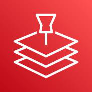{width="0.8347211286089239in"
height="0.8333333333333334in"} gizliliğini tehlikeye atmadan
uygulamalara konum işlevleri eklemelerini kolaylaştırır.

> Uygulamalarınıza güvenle ve kolayca konum verisi eklemenizi sağlayan
> AWS servisidir. Amazon Location Service, geliştiricilerin veri
> güvenliğini ve kullanıcı

Konum verileri, günümüz uygulamalarının önemli bir bileşenidir ve
varlıkları takip etmeden konuma dayalı pazarlamaya kadar farklı
özellikler sağlar. Ancak geliştiriciler, uygulamalarına konum işlevini
entegre ederken önemli engellerle karşılaşır. Buna maliyet, gizlilik ve
güvenlik açıkları ile yorucu ve yavaş entegrasyon işi dahildir.

Amazon Location Service uygun fiyatlı veri, takip ve bölge sınırı
özelliklerinin yanı sıra AWS hizmetleriyle yerel entegrasyonlar sağlar.
Böylece, özel geliştirmenin yüksek maliyeti olmadan hızlı bir şekilde
gelişmiş konum özellikli uygulamalar oluşturabilirsiniz. Amazon Location
Service ile konum verilerinizin kontrolü sizde olur ve tescilli
verileri, hizmetten alınan verilerle birleştirebilirsiniz. Amazon
Location Service küresel, güvenilir sağlayıcılar Esri ve HERE\'dan
yüksek kaliteli verileri kullanarak uygun maliyetli, konuma bağlı
hizmetler (LBS) sağlar.

**3.22.3. Amazon Pinpoint**\
Çok kanallı pazarlama iletişimi hizmeti sağlayan AWS servisidir.

{width="0.8347211286089239in"
height="0.8347222222222223in"} Amazon Pinpoint, esnek ve ölçeklenebilir
bir gelen ve giden pazarlama iletişimi hizmetidir. E-posta, SMS, anlık
bildirim, sesli bildirim ve uygulama içi mesajlaşma gibi kanallar
üzerinden müşterilerle bağlantı kurabilirsiniz. Amazon

Pinpoint\'in kurulumu ve kullanımı kolaydır ve tüm pazarlama iletişimi
senaryoları için esneklik sunar. Kampanya hedef kitlenizi doğru müşteri
segmentlerine ayırın ve iletilerinizi doğru içeriklerle kişiselleştirin.
Amazon Pinpoint\'teki teslimat ve kampanya ölçümleri, iletişimlerinizin
başarısını ölçer. Amazon Pinpoint, sizinle birlikte büyüyerek, kanallar
genelinde günlük milyarlarca iletiye kadar küresel olarak
ölçeklenebilir.

**3.22.4. Amazon Simple Email Service (SES)**\
Yüksek ölçekli gelen ve giden bulut e-posta hizmeti sunan AWS
servisidir.

{width="0.8347211286089239in"
height="0.8333333333333334in"} Amazon Simple Email Service (SES),
geliştiricilerin herhangi bir uygulamadan posta göndermesine olanak
tanıyan uygun maliyetli, esnek ve ölçeklenebilir bir e-posta hizmetidir.
Amazon SES\'yi işlemsel, pazarlama veya toplu e-posta iletimi gibi
birkaç farklı e-posta kullanım senaryosunu destekleyecek şekilde hızlıca
yapılandırabilirsiniz. Amazon SES\'nin esnek IP dağıtımı ve e-posta
kimlik doğrulaması seçenekleri, teslim edilebilirliği artırır ve
gönderenin itibarını korur. Analiz verilerinin gönderilmesi sayesinde de
her bir e-postanın etkisi ölçülür. Amazon SES sayesinde e-postaları
güvenli biçimde, global olarak ve uygun ölçekte gönderebilirsiniz.

**3.22.5. AWS Amplify**\
{width="0.8347211286089239in"
height="0.8333333333333334in"} Genişletilebilir tam yığın web
uygulamalarını ve mobil uygulamaları daha hızlı oluşturmanızı sağlayan,
başlaması kolay, ölçeklendirmesi kolay AWS servisidir. Kimlik
doğrulaması, depolama, veri ve daha fazlası ile tam yığın uygulamaları,
ön uç kullanıcı arabirimini ve arka uçları görsel olarak oluşturur.

87

Web uygulamalarını ve mobil uygulamaları birkaç kod satırıyla yeni ve
mevcut AWS kaynaklarına bağlar. Statik web sitelerini, tek sayfalı web
uygulamalarını ve sunucu tarafında oluşturulan uygulamaları sadece
birkaç tıklamayla oluşturup, dağıtıp barındırabilirsiniz. Yeni kullanım
örneklerini, DevOps uygulamalarını ve kullanıcı artışını desteklemek
için 175\'ten fazla AWS hizmetine erişme imkanını oluşturur.

**3.22.6. AWS AppSync**\
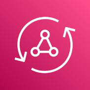{width="0.8347211286089239in"
height="0.8333333333333334in"} Ölçeklenebilir GraphQL API'ler ile
uygulama gelişimini hızlandırır. Kuruluşlar, ön uç geliştiricilere
birden fazla veri tabanını, mikro hizmeti ve API\'yi tek bir GraphQL uç
noktası ile sorgulama imkânı vererek uygulamaları daha hızlı
geliştirmelerine yardımcı olduğu için GraphQL ile API\'ler oluşturmayı
seçmektedir.

AWS AppSync, AWS DynamoDB, Lambda ve diğerleri gibi veri kaynaklarına
güvenli bir şekilde bağlanmanın getirdiği ağır yük ile başa çıkarak
GraphQL API'ler geliştirmeyi kolaylaştıran, tam olarak yönetilen bir
hizmettir. Performansı arttırmak için önbellekler ekleme, gerçek zamanlı
güncellemeleri desteklemeye yönelik abonelikler ve çevrimdışı
istemcilerin senkronize olmasını sağlayan istemci tarafı veri depoları
bu kadar kolay. AWS AppSync, dağıtıldığında API istek hacimlerini
karşılamak için GraphQL API yürütme altyapınızın ölçeğini otomatik
olarak büyütür ve küçültür.

**3.22.7. AWS Device Farm**\
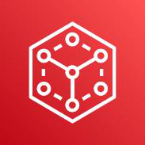{width="0.8347211286089239in"
height="0.8333333333333334in"} AWS Device Farm, hiçbir test altyapısı
tedarik etme ve yönetme ihtiyacı duymadan çok çeşitli masaüstü
tarayıcılarda ve gerçek mobil cihazlarda test AWS Cloud'da barındırılan
masaüstü tarayıcılarda ve gerçek mobil cihazlarda test yaparak web ve
mobil uygulamalarınızın kalitesini artırır.

yapma olanağı tanıyarak web ve mobil uygulamalarınızın kalitesini
artırmanızı sağlayan bir uygulama test hizmetidir. Test paketinizin daha
hızlı tamamlanması için testlerinizi birden fazla masaüstü tarayıcıda
veya gerçek cihazda aynı anda çalıştırmayı destekleyen bu hizmet,
uygulamanızdaki sorunları hızla tespit etmenize yardımcı olmak için
videolar ve günlük dosyaları oluşturur.

**3.23. İş Uygulamaları Servisleri**\
**3.23.1. Alexa for Business**\
Alexa for Business, kuruluşların ve çalışanların Alexa ile iş yerinde
daha yüksek
{width="0.8347211286089239in"
height="0.8333333333333334in"} verim elde etmelerini sağlayan bir
hizmettir. Alexa for Business sayesinde, çalışanlar Alexa'yı akıllı
asistanları gibi kullanarak toplantı odalarında, masalarında ve hatta
zaten evde veya hareket halindeyken kullandıkları Alexa cihazlarında
üretkenliği artırabilir. BT ve tesis yöneticileri, iş yerlerindeki
toplantı odalarının kullanımını ölçmek ve artırmak için de Alexa for
Business\'ı kullanabilir.

**3.23.2. Amazon Chime**\
{width="0.8347211286089239in"
height="0.8333333333333334in"} Amazon Chime, tek bir uygulama kullanarak
toplantı yapmanızı, sohbet etmenizi ve telefonla kuruluşunuzun içinde ve
dışında iş çağrıları yapmanızı sağlayan bir iletişim hizmetidir. Amazon
Chime ile müşteriler:

88

+---+-----------------------------------------------------------------+
| • | > HD video, ses, ekran paylaşma, toplantı sohbeti, arama        |
|   | > numaraları ve oda içi video konferans desteğiyle çevrimiçi    |
|   | > toplantılar yürütebilir ve bunlara katılabilir;               |
+===+=================================================================+
| • | > Masaüstü bilgisayar ve mobil cihazlar arasında gerçekleşen    |
|   | > sürekli iletişimler için sohbeti ve sohbet odalarını          |
|   | > kullanabilir;                                                 |
+---+-----------------------------------------------------------------+
| • | > Amazon Chime yönetim konsolunu kullanarak kurumsal            |
|   | > kullanıcıları idare edebilir, politikaları yönetebilir ve     |
|   | > SSO\'yu veya diğer gelişmiş özellikleri dakikalar içinde      |
|   | > ayarlayabilir.                                                |
+---+-----------------------------------------------------------------+

Amazon Chime; Windows, Mac, web, iOS, Android cihazlar için erişime
sunulan kullanımı kolay bir uygulama sağlar.

**3.23.3. Amazon Connect**\
{width="0.8347211286089239in"
height="0.8347222222222223in"} yardım etmeye başlayabilmeleri için
yalnızca birkaç tıklamayla iletişim merkezinizi ayarlayabilir ve
değişiklik yapabilirsiniz.

> Kullanımı kolay çok kanallı bulut iletişim merkezi ile daha düşük
> maliyetle üstün müşteri hizmeti sağlayan AWS servisidir. Temsilcilerin
> müşterilere hemen

Minimum ücretler, uzun vadeli taahhütler veya ön lisans ücretleri
olmadan geleneksel iletişim merkezi çözümlerine kıyasla %80\'e varan
tasarruf sağlayabilirsiniz. Her yerden çalışan on binlerce temsilciyi
ekleme esnekliği ile talebi karşılamak için ölçeği kolayca büyütüp
küçültebilirsiniz.

**3.23.4. Amazon Honeycode**\
{width="0.8347211286089239in"
height="0.8347211286089239in"} Amazon Honeycode, ekibinizin
çalışmalarını yönetmeye yönelik uygulamalar oluşturma gücü verir.
Programlama gerekmez. İşletmeniz değiştikçe Honeycode ile oluşturulmuş
özel uygulamanızı uyarlayabilirsiniz. Uygulamanızda veya verilerinde
yapılan tüm güncellemeler anında ekibinizle paylaşılır. Özel Honeycode
uygulamanızı, her ekip üyesinin yalnızca görmesi gereken verileri
görmesi ve başka bir şey görmemesi için yapılandırabilirsiniz.

Ekibinizin her yerden çalışabilmesi için web tarayıcıları ve mobil
cihazlar için özel Honeycode uygulamanızı oluşturabilirsiniz. Özel
Honeycode uygulamanızı, bir güncelleme olduğunda ekibe otomatik olarak
bildirimde bulunacak veya harekete geçme sırası geldiğinde insanlara
hatırlatacak şekilde ayarlayabilirsiniz.

**3.23.5. Amazon WorkDocs**\
Amazon WorkDocs, tam olarak yönetilen güvenli içerik oluşturma, depolama
{width="0.8347211286089239in"
height="0.8333333333333334in"} ve iş birliği hizmetidir. Amazon WorkDocs
ile kolayca içerik oluşturabilir, düzenleyebilir ve paylaşabilirsiniz.
Ayrıca içeriğiniz, AWS üzerinde merkezi olarak depolandığından,
istediğiniz yerden, istediğiniz cihazı kullanarak bu içeriğe
erişebilirsiniz. Amazon WorkDocs, başkalarıyla iş birliği yapmanızı
kolaylaştırır ve kolayca içerik paylaşmanıza, zengin geri bildirim
sağlamanıza ve belgeleri iş birliği halinde düzenlemenize olanak sağlar.
Dosya paylaşımlarını buluta taşıyarak eski dosya paylaşım altyapısını
kullanımdan kaldırmak için Amazon WorkDocs'u kullanabilirsiniz. Amazon
WorkDocs, mevcut sistemlerinizle entegrasyon sağlamanıza imkân tanır ve
kendi zengin içerikli uygulamalarınızı geliştirebilmeniz için zengin bir
API sunar. Amazon WorkDocs, AWS'de yerleşiktir ve içeriğinizin
güvenliği, dünyanın en büyük bulut altyapısında sağlanır.

Amazon WorkDocs'ta peşin ücret veya taahhüt yoktur. Yalnızca etkin
kullanıcı hesapları ve kullandığınız depolama alanı için ödeme
yaparsınız.

89

**3.23.6. Amazon WorkMail**\
Amazon WorkMail mevcut masaüstü ve mobil e-posta istemci uygulamalarını
{width="0.8347211286089239in"
height="0.8333333333333334in"} destekleyen, işletmelere yönelik güvenli
ve yönetilen bir e-posta ve takvim hizmetidir. Amazon WorkMail
kullanıcıların Microsoft Outlook, yerel iOS ve Android e-posta
uygulamaları, IMAP protokolünü destekleyen herhangi bir istemci
uygulaması gibi istedikleri istemci uygulamasından veya doğrudan bir web
tarayıcısından e-postalarına, kişilerine ve takvimlerine sorunsuz bir
şekilde erişmelerini sağlar. Amazon WorkMail\'i mevcut kurumsal
dizininize entegre edebilir, mevzuat uyumluluğu gereksinimlerini
karşılamak için e-posta günlüğü oluşturma özelliğini kullanabilir ve hem
verilerinizi şifreleyen anahtarları hem de verilerinizin depolandığı
konumu denetleyebilirsiniz. Ayrıca hizmeti Microsoft Exchange Server ile
birlikte çalışacak şekilde ayarlayabilir ve Amazon WorkMail SDK ile
kullanıcıları, grupları ve kaynakları programlamayla yönetebilirsiniz.

**3.24. İşlem Servisleri**\
**3.24.1. Amazon EC2**\
{width="0.8347211286089239in"
height="0.8333333333333334in"} Amazon Elastic Compute Cloud (Amazon
EC2), 500\'den fazla bulut sunucusu ve iş yükü ihtiyaçlarınızı en iyi
şekilde karşılamanıza yardımcı olacak en son Neredeyse tüm iş yükleri
için güvenli ve yeniden boyutlandırılabilir işlem kapasitesi sunan AWS
servisidir.

işlemci, depolama alanı, ağ iletişimi, işletim sistemi ve satın alma
modeli seçenekleri sayesinde en geniş ve kapsamlı işlem platformunu
sunar. Intel, AMD ve Arm işlemcileri destekleyen ilk büyük bulut
sağlayıcısı, istek üzerine EC2 Mac bulut sunucuları ve 400 Gbps Ethernet
ağ iletişimi sunan tek bulut hizmetiyiz. Makine öğrenimi eğitimi için en
iyi fiyat performansının yanı sıra buluttaki çıkarım bulut sunucuları
başına en düşük maliyeti sunuyoruz. Diğer bulut sağlayıcılarına kıyasla
AWS\'de daha fazla SAP, yüksek performanslı bilişim (HPC), makine
öğrenimi ve Windows iş yükleri çalıştırılıyor.

**3.24.2. Amazon EC2 Auto Scaling**\
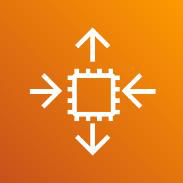{width="0.8347211286089239in"
height="0.8347222222222223in"} Değişen talebi karşılamak için işlem
kapasitesi ekleme veya kaldırma yapabilen AWS servisidir. Amazon EC2
Auto Scaling uygulama erişilebilirliğini korumanıza yardımcı olur ve EC2
bulut sunucularını tanımladığınız koşullara göre otomatik olarak

eklemenize veya kaldırmanıza olanak tanır. Filonuzun sağlığını ve
erişilebilirliğini korumak için EC2 Auto Scaling\'in filo yönetim
özelliklerini kullanabilirsiniz. EC2 bulut sunucularını eklemek veya
kaldırmak için EC2 Auto Scaling\'in dinamik ve tahmini ölçeklendirme
özelliklerini de kullanabilirsiniz. Dinamik ölçeklendirme, değişen
talebe cevap verir ve tahmini ölçeklendirme, öngörülen talebe göre doğru
sayıda EC2 bulut sunucusunu otomatik olarak zamanlar. Dinamik
ölçeklendirme ve tahmini ölçeklendirme, daha hızlı ölçeklendirmek için
birlikte kullanılabilir.

90

**3.24.3. Amazon Lightsail**\
{width="0.8347211286089239in"
height="0.8347211286089239in"} Düşük maliyetli, önceden yapılandırılmış
bulut kaynaklarıyla uygulamaları ve web sitelerini hızla oluşturmanızı
sağlayan AWS servisidir. Yalnızca birkaç tıklamayla bir web sitesi veya
uygulama oluşturabilirsiniz. Ağ iletişimi, erişim ve güvenlik
ortamlarını otomatik olarak yapılandırır. Büyüdükçe kolayca
ölçeklendirin veya kaynaklarınızı Amazon EC2 gibi daha geniş AWS
ekosistemine taşıyabilirsiniz.

**3.24.4. AWS App Runner**\
{width="0.8347211286089239in"
height="0.833332239720035in"} Geliştiriciler için geniş ölçekte üretim
web uygulamaları kolaylaştıran AWS servisidir. AWS App Runner,
geliştiricilerin container'lı web uygulamalarını ve API'leri uygun
ölçekte ve altyapı deneyimi gerekmeden hızla dağıtmasını kolaylaştıran,
tam olarak yönetilen bir hizmettir. Kaynak kodunuz veya container
görseli ile başlayın. App Runner, web uygulamasını otomatik olarak

oluşturur ve dağıtır, trafiği şifrelemeyle dengeler, trafik
ihtiyaçlarınızı karşılayacak şekilde ölçeklendirir ve hizmetlerinizin
özel bir Amazon VPC'sinde çalışan diğer AWS hizmetleri ve
uygulamalarıyla iletişim kurmasını kolaylaştırır. App Runner ile
sunucular veya ölçeklendirme üzerine düşünmek yerine, uygulamalarınıza
odaklanmanız için daha fazla vaktiniz olur.

**3.24.5. AWS Auto Scaling**\
Performans ve maliyet optimizasyonu için uygulama ölçeklendirme imkânı
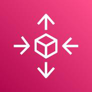{width="0.8347211286089239in"
height="0.8333333333333334in"} AWS Auto Scaling, uygulamalarınızı izler
ve kapasiteyi mümkün olan en düşük maliyet üzerinden kararlı,
öngörülebilir performansı koruyacak şekilde otomatik veren AWS
servisidir.

olarak ayarlar. AWS Auto Scaling ile birden çok hizmette birden çok
kaynak için uygulama ölçeklendirme kurulumu yapmak kolaydır. Hizmet
tarafından Amazon EC2 bulut sunucuları ve Spot Filoları, Amazon ECS
görevleri, Amazon DynamoDB tabloları ve dizinleri ile Amazon Aurora
Replikaları gibi kaynaklar için ölçeklendirme planları oluşturmanıza
imkân tanıyan basit, güçlü bir kullanıcı arabirimi sağlanır. AWS Auto
Scaling, performansı veya maliyeti optimize etmenize ya da bunlar
arasında bir denge sağlamanıza imkân tanıyan önerilerle ölçeklendirme
işlemini basitleştirir. Zaten Amazon EC2 bulut sunucularınızı dinamik
olarak ölçeklendirmek için Amazon EC2 Auto Scaling kullanıyorsanız artık
bunu AWS Auto Scaling ile birleştirerek diğer AWS hizmetleri için ek
kaynakları ölçeklendirebilirsiniz. AWS Auto Scaling ile uygulamalarınız
hep doğru zamanda, doğru kaynaklara sahip olur.

AWS Auto Scaling\'i AWS Management Console, Komut Satırı Arabirimi (CLI)
veya SDK aracılığıyla kullanmaya başlamak kolaydır. AWS Auto Scaling ek
ücret olmaksızın sunulur. Yalnızca uygulamalarınızı çalıştırmak için
gerekli olan AWS kaynakları ve Amazon CloudWatch izleme ücretleri
karşılığında ödeme yaparsınız.

**3.24.6. AWS Batch**\
Her ölçekte tam olarak yönetilen batch processing yapma imkânı tanıyan
AWS
{width="0.8347211286089239in"
height="0.8333333333333334in"} AWS Batch geliştiricilerin, bilim
insanlarının ve mühendislerin AWS\'de kolayca yüz binlerce toplu işlem
işi çalıştırmasına imkân tanır. AWS Batch, servisidir.

gönderilen toplu işin hacmine ve özel kaynak gereksinimlerine bağlı
olarak en uygun miktarda ve türde işlem kaynağını (ör. CPU veya bellek
için optimize edilmiş bulut sunucuları) dinamik olarak tedarik eder. AWS
Batch ile işleri çalıştırmak için kullandığınız toplu bilgi işlem
yazılımlarını veya sunucu kümelerini yükleyip yönetmeniz
gerekmediğinden, sonuçları analiz etmeye ve sorunları çözmeye
odaklanabilirsiniz. AWS Batch, toplu bilgi işlem iş yüklerinizi

91

AWS Fargate, Amazon EC2 ve Spot Bulut Sunucuları gibi AWS işlem
hizmetleri ve özelliklerinin tamamında planlar, zamanlar ve yürütür.

AWS Batch için ek ücret uygulanmaz. Yalnızca toplu işlerinizi depolamak
ve çalıştırmak amacıyla oluşturduğunuz AWS kaynakları (ör. EC2 bulut
sunucuları veya Fargate işleri) için ücret ödersiniz.

**3.24.7. AWS Compute Optimizer**\
{width="0.8347211286089239in"
height="0.8333333333333334in"} Maliyetleri azaltmak ve iş yükleriniz
için performansı artırmak amacıyla ideal AWS kaynaklarını öneren
servistir. AWS Compute Optimizer, geçmiş kullanım ölçümlerini analiz
etmek için makine öğrenimini kullanarak maliyetleri azaltmak ve
performansı artırmak

amacıyla iş yükleriniz için optimum AWS kaynakları önerir. Kaynakların
gereğinden fazla sağlanması, gereksiz altyapı maliyetine yol açarken,
kaynakların yetersiz sağlanması da zayıf uygulama performansına neden
olabilir. Compute Optimizer, kullanım verilerinize göre Amazon Elastic
Compute Cloud (EC2) bulut sunucusu tipleri, Amazon Elastic Block Store
(EBS) birimleri ve AWS Lambda işlevleri gibi üç tür AWS kaynağı için en
uygun yapılandırmaları seçmenize yardımcı olur.

Compute Optimizer, bulutta çeşitli iş yüklerini çalıştıran Amazon\'un
kendi deneyiminden elde edilen bilgileri uygulayarak iş yükü modelleri
belirler ve optimum AWS kaynakları önerir. Compute Optimizer; yoğun CPU
kullanıp kullanmadığı, günlük bir model sergileyip sergilemediği veya
bir iş yükünün yerel depolamaya sık sık erişip erişmediği gibi
düzinelerce tanımlayıcı özelliği belirlemek için iş yükünüzün
yapılandırmasını ve kaynak kullanımını analiz eder. Hizmet bu
özellikleri işler ve iş yükünün gerektirdiği donanım kaynağını tanımlar.
Compute Optimizer, öneriler sunmak için iş yükünün çeşitli donanım
platformlarında (örneğin Amazon EC2 bulut sunucusu tipleri) veya farklı
yapılandırmalar (örneğin Amazon EBS birim IOPS ayarları ve AWS Lambda
işlevi bellek boyutları) kullanarak nasıl performans gösterebileceğini
tahmin eder.

**3.24.8. AWS Elastic Beanstalk**\
AWS Elastic Beanstalk; Apache, Nginx, Passenger ve IIS gibi bilindik
sunucular
{width="0.8347211286089239in"
height="0.8333333333333334in"} web uygulamalarını ve hizmetleri dağıtıp
ölçeklendirmek için kullanımı kolay bir hizmettir.

> üzerinde Java, .NET, PHP, Node.js, Python, Ruby, Go ve Docker ile
> geliştirilmiş

Tek yapmanız gereken kodunuzu yüklemektir; kapasite tedariği, yük
dengeleme ve otomatik ölçeklendirmeden uygulama durumunu izlemeye kadar
dağıtımın her aşaması Elastic Beanstalk tarafından otomatik olarak
gerçekleştirilir. Öte yandan, uygulamanızı destekleyen AWS kaynakları
üzerindeki denetim tamamen sizde kalır ve temel kaynaklara dilediğiniz
zaman erişebilirsiniz.

Elastic Beanstalk için ek ücret uygulanmaz. Yalnızca uygulamalarınızı
depolamak ve çalıştırmak için gerekli AWS kaynaklarına ödeme yaparsınız.

**3.24.9. AWS Lambda**\
{width="0.8347211286089239in"
height="0.8333333333333334in"} Sunucuları veya kümeleri düşünmek zorunda
kalmadan kod çalıştırabileceğiniz AWS servisidir. Altyapı tedarik etmek
veya yönetmek zorunda kalmadan kod çalıştırabilirsiniz. Kod yazıp ".zip"
dosyası veya container görüntüsü olarak yüklemeniz yeterlidir. Günde
onlarca olaydan saniyede yüz binlerce olaya kadar her ölçekte kod
yürütme isteklerine otomatik olarak yanıt verir.

92

En yüksek kapasite için altyapıyı önceden tedarik etmek yerine yalnızca
kullandığınız işlem süresi için (milisaniye başına) ödeme yaparak
maliyetlerden tasarruf etmenizi sağlar. Doğru işlev belleği boyutuyla
kod yürütme süresini ve performansını optimize eder. Tedarik edilen eş
zamanlılık ile yüksek talebe çift haneli milisaniye cinsinden yanıt
verir.

**3.24.10. AWS Outposts Ailesi**\
Gerçekten tutarlı bir hibrit deneyim için AWS altyapısını ve
hizmetlerini şirket
{width="0.8347211286089239in"
height="0.8333333333333334in"} AWS Outposts, gerçekten tutarlı bir
hibrit deneyim için AWS altyapısını ve hizmetlerini neredeyse tüm şirket
içi veya uç konumlara sağlayan, tam olarak içinde çalıştırmanıza olanak
tanır.

yönetilen çözümlerden oluşan bir ailedir. Outposts çözümleri, yerel AWS
hizmetlerini şirket içinde çalıştırarak kullanımını genişletmenize
olanak tanır. Ayrıca, 1U ve 2U Outposts sunucularından 42U Outposts
raflarına ve birden çok raf dağıtımlarına kadar çeşitli form
faktörlerinde mevcuttur.

AWS Outposts\'ta bazı AWS hizmetlerini yerel olarak çalıştırabilir ve
yerel AWS bölgesinde sunulan çok sayıda hizmete bağlanabilirsiniz.
Bilinen AWS hizmetleri, araçları ve API\'lerini kullanarak uygulamaları
ve iş yüklerini şirket içinde çalıştırın. Outposts, şirket içi
sistemlere düşük gecikmeli erişim gerektiren iş yüklerini ve cihazları,
yerel veri işlemeyi, veri yerleşimini ve yerel sistem bağımlılıklarıyla
uygulama geçişini destekler.

**3.24.11. AWS Serverless Application Repository**\
Sunucusuz uygulamalar bulma, dağıtma ve yayımlama imkânı tanıyan AWS
{width="0.8347211286089239in"
height="0.8333333333333334in"} AWS Serverless Application Repository,
sunucusuz uygulamalara yönelik bir yönetilen depodur. Ekiplerin,
kuruluşların ve bireysel yazılım geliştiricilerin servisidir.

yeniden kullanılabilir uygulamaları depolayıp paylaşmalarına ek olarak
sunucusuz mimarileri yeni ve etkili yöntemlerle kolay bir şekilde
derleyip dağıtmalarını sağlamaktadır. Serverless Application Repository
hizmetini kullandığınızda uygulamanızı dağıtmadan önce kaynak kodunuzu
AWS üzerinde kopyalamanıza, derlemenize, paketlemenize veya
yayımlamanıza gerek kalmaz. Bunun yerine Serverless Application
Repository içindeki önceden derlenmiş uygulamaları sunucusuz
mimarilerinizde kullanarak ekiplerinizin aynı işleri birden fazla kez
yapma ihtimalini azaltabilir, kuruluşunuzun en iyi uygulamalarına bağlı
kalabilir ve piyasaya daha hızlı bir giriş yapabilirsiniz. AWS Identity
and Access Management (IAM) entegrasyonu her uygulama için kaynak
düzeyinde kontrol sağlayarak uygulamaları herkese açık olarak veya
belirli AWS hesaplarıyla özel olarak paylaşmanızı sağlar. Oluşturduğunuz
bir uygulamayı paylaşmak için AWS Serverless Application Repository'de
yayımlayın.

Her uygulama, kullanılan AWS kaynaklarını tanımlayan bir AWS Serverless
Application Model (SAM) şablonuyla paketlenir. Genel olarak paylaşılan
uygulamalar, uygulamanın kaynak koduna bir bağlantı da içerir.
Serverless Application Repository kullanımı ek ücrete tabi değildir.
Yalnızca dağıttığınız uygulamalarda kullanılan AWS kaynakları için ödeme
yaparsınız.

**3.24.12. AWS Wavelength**\
{width="0.8347211286089239in"
height="0.8347222222222223in"} 5G cihazlar için ultra düşük gecikme
süreli uygulamalar sağlamanızı mümkün kılan AWS servisidir. Bildiğiniz
AWS hizmetlerini, API\'leri ve araçları kullanarak herhangi bir eğitim
ihtiyacı olmadan yeni nesil uygulamalar oluşturabilirsiniz. Uygulamaları
bir kez geliştirir ve küresel 5G ağlarında yer alan birden çok
Wavelength Alanına dağıtımları ölçeklendirirsiniz. Yenilikçi 5G

93

uç uygulama geliştirme sürecini hızlandırmak için performansı
kanıtlanmış AWS altyapısı ve hizmetlerinden yararlanırsınız.

**3.24.13. VMware Cloud on AWS**\
{width="0.8347211286089239in"
height="0.8347222222222223in"} 200'den fazla AWS hizmet yelpazesi ile
daha hızlı bir şekilde buluta geçiş yapmanızı ve her yerden güvenli bir
şekilde çalışmanızı sağlayan AWS servisidir. AWS, tüm vSphere temelli iş
yükleri için VMware\'ın öncelikli açık bulut çözüm ortağıdır. VMware ve
AWS çözüm ortaklığı, hibrit bulut için daha hızlı, daha kolay ve uygun
maliyetli bir yol sunmanın yanı sıra müşterilerin daha hızlı pazara
ulaşmasını ve inovasyon hızını artırmasını sağlayan uygulamaları
modernleştirmesine imkân tanır. Çalışanlarınızın herhangi bir yerden
güvenli şekilde çalışmasını sağlamak üzere Sanal Masaüstü Altyapısı
(VDI) çözümlerimizle güvenli sanal uygulamalar ve masaüstleri sunmak
için mevcut becerilerinizi, süreçlerinizi ve yönetişiminizi kullanın.
VMware Cloud™ on AWS için Intel® Xeon® Ölçeklenebilir işlemciler
tarafından desteklenen yeni Amazon EC2 i3en.metal bulut sunucuları
yüksek ağ aktarım hızı ve düşük gecikme süresi sağlar. Böylece hızlı
veri merkezi tahliyesi, olağanüstü durum kurtarma ve uygulama
modernizasyonu için veri merkezlerini buluta taşıyabilirsiniz.

4 yılı aşkın ortak mühendislik sayesinde VMware ve AWS, kuruluşlara
çözüme entegre edilen gelişmiş VMware işlevlerinin yanı sıra destek ve
hizmet entegrasyonu için tek bir iletişim noktası sunmaktadır. Bu
nedenle VMware Cloud on AWS, tüm vSphere iş yükleri için tercih
ettiğimiz hizmettir.

94

**4. BAŞLICA SERVİSLERİN DETAYLI İNCELENMESİ** Bu başlık altında AWS
üzerinde sunulan en popüler ve önemli servislerin detaylı incelemesi
bulunmaktadır. Bu servisler başlıca şöyle listelenebilir:

+---+------------------+
| • | > IAM            |
|   | >                |
|   | > S3             |
|   | >                |
|   | > AWS CLI        |
|   | >                |
|   | > Glacier        |
|   | >                |
|   | > EC2            |
|   | >                |
|   | > EFS            |
|   | >                |
|   | > VPC            |
|   | >                |
|   | > Direct Connect |
|   | >                |
|   | > CloudFront     |
|   | >                |
|   | > Route53        |
|   | >                |
|   | > RDS            |
|   | >                |
|   | > Redshift       |
|   | >                |
|   | > DynomoDB       |
|   | >                |
|   | > Elasticache    |
|   | >                |
|   | > CloudWatch     |
|   | >                |
|   | > CloudTrail     |
+===+==================+
| • |                  |
+---+------------------+
| • |                  |
+---+------------------+
| • |                  |
+---+------------------+
| • |                  |
+---+------------------+
| • |                  |
+---+------------------+
| • |                  |
+---+------------------+
| • |                  |
+---+------------------+
| • |                  |
+---+------------------+
| • |                  |
+---+------------------+
| • |                  |
+---+------------------+
| • |                  |
+---+------------------+
| • |                  |
+---+------------------+
| • |                  |
+---+------------------+
| • |                  |
+---+------------------+
| • |                  |
+---+------------------+
| • | > ...            |
+---+------------------+

**4.1. Fatura Alarmı Oluşturma**\
Servisleri kullanmaya geçmeden önce fatura alarmı oluşturmak
mantıklıdır. Böylelikle beklenti dışı bir fiyatlandırma ile karşı
karşıya kalma olasılığınız düşecektir. Fatura alarmını oluşturmak
aşağıdaki adımlar izlenmelidir.

> a)AWS Managment Console (Yönetim Konsolu) üzerinde sağ üstte bulunan
>
> kullanıcı adına tıklanmalıdır.
>
> 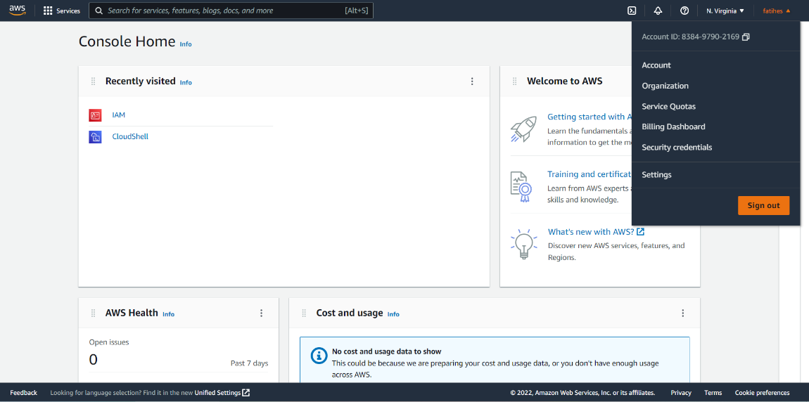{width="5.201388888888889in"
> height="2.5833333333333335in"}

***Şekil 12:** AWS yönetim konsolu ana sayfası.*

> b)Açılan menü üzerinden "Biling Dashboard" yani faturalandırma kontrol
> paneli
>
> seçeneğine tıklanır.
>
> c)Açılan kontrol panelinde sol tarafta bulunan menülerden "Budgets"
> yani
>
> bütçeler seçeneğine tıklanır.

95

> 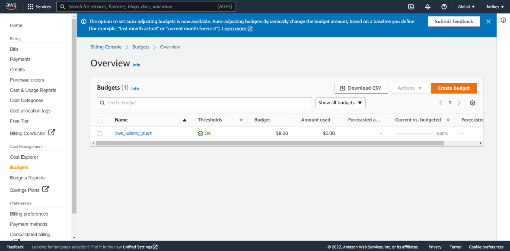{width="4.747222222222222in"
> height="2.341666666666667in"}

***Şekil 13:** AWS faturalandırma kontrol paneli.*

> d)Turuncu "Create budget" butonuyla birlikte bir bütçe oluşturulmaya
> başlanır. e)Bütçe oluşturma butonuna bastıktan sonra 5 adımdan oluşan
> bütçe oluşturma sayfası kullanıcıları karşılar.
>
> 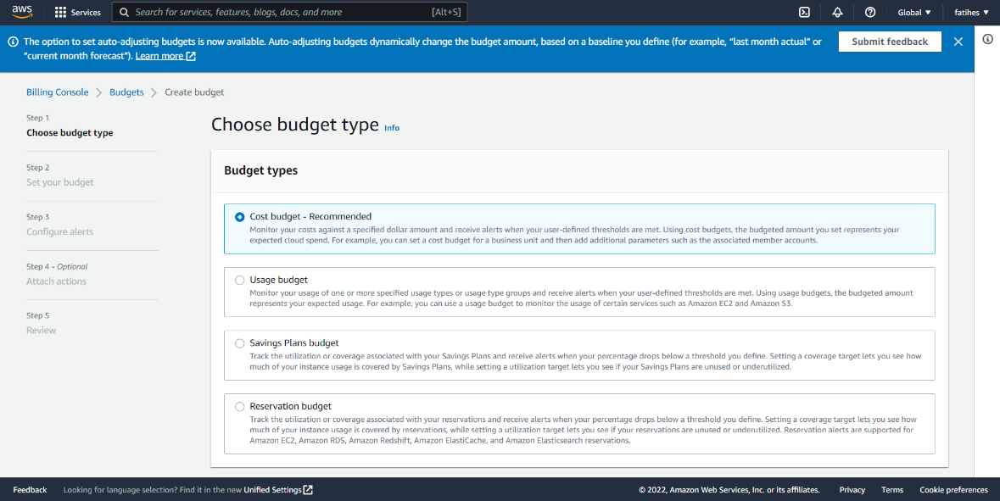{width="4.722222222222222in"
> height="2.3694444444444445in"}

***Şekil 14:** AWS budget türleri*

> f)Bu adımlar sırasıyla şu şekildedir:
>
> • **Adım 1:** Bütçe türünün seçilmesi.
>
> Seçilebilecek dört farklı bütçe türü bulunmaktadır:

+-------+-------------------------------------------------------------+
| **‒** | > **Maliyet bütçesi (AWS tarafından önerilen):**            |
+=======+=============================================================+
| **‒** | > Maliyetlerinizi belirli bir dolar tutarına göre izler ve  |
|       | > kullanıcı tanımlı                                         |
+-------+-------------------------------------------------------------+
|       | > eşiklere ulaşıldığında uyarılar alırsınız. Maliyet        |
|       | > bütçelerini kullanarak,                                   |
+-------+-------------------------------------------------------------+
|       | > belirlediğiniz bütçe ödemek istediğiniz maksimum tutar    |
|       | > olacaktır, beklenen bulut harcamanızı temsil eder.        |
|       | > Örneğin, bir iş birimi için bir                           |
+-------+-------------------------------------------------------------+
|       | > maliyet bütçesi ayarlayabilir ve ardından ilişkili üye    |
|       | > hesapları gibi ek parametreler ekleyebilirsiniz.          |
|       | >                                                           |
|       | > **Kullanım bütçesi:**                                     |
+-------+-------------------------------------------------------------+
|       | > Bir veya daha fazla belirtilen kullanım türü / kullanım   |
|       | > türü grubu                                                |
+-------+-------------------------------------------------------------+
|       | > kullanımınızı izler ve kullanıcı tanımlı eşiklerinize     |
|       | > ulaşıldığında uyarılar                                    |
+-------+-------------------------------------------------------------+
|       | > alırsınız. Kullanım bütçelerini kullanarak, bütçelenen    |
|       | > tutar, beklenen                                           |
+-------+-------------------------------------------------------------+
|       | > kullanımınızı temsil eder. Örneğin, Amazon EC2 ve Amazon  |
|       | > S3 gibi                                                   |
+-------+-------------------------------------------------------------+
|       | > belirli hizmetlerin kullanımını izlemek için bir kullanım |
|       | > bütçesi                                                   |
+-------+-------------------------------------------------------------+

96

+-------+-------------------------------------------------------------+
| **‒** | > kullanabilirsiniz. Böylelikle bu servislerin her biri     |
|       | > için ne kadar bütçe değerinde kullanım olacağını          |
|       | > belirtebilirsiniz.                                        |
|       | >                                                           |
|       | > **Tasarruf planları bütçesi:**                            |
+=======+=============================================================+
| **‒** | > Tasarruf planlarınızla ilişkili kullanımı veya kapsamı    |
|       | > takip eder ve                                             |
+-------+-------------------------------------------------------------+
|       | > yüzdeniz tanımladığınız eşiğin altına düştüğünde uyarılar |
|       | > alın. Bir                                                 |
+-------+-------------------------------------------------------------+
|       | > kapsam hedefi belirlemek, örnek kullanımınızın ne         |
|       | > kadarının tasarruf                                        |
+-------+-------------------------------------------------------------+
|       | > planları tarafından kapsandığını görmenizi sağlarken bir  |
|       | > kullanım hedefi                                           |
+-------+-------------------------------------------------------------+
|       | > belirlemek, tasarruf planlarınızın kullanılmadığını veya  |
|       | > yeterince kullanılmadığını görmenizi sağlar.              |
|       | >                                                           |
|       | > **Rezervasyon bütçesi:**                                  |
+-------+-------------------------------------------------------------+
|       | > Rezervasyonlarınızla ilişkili kullanımı veya kapsamı      |
|       | > takip eder ve                                             |
+-------+-------------------------------------------------------------+
|       | > yüzdeniz tanımladığınız eşiğin altına düştüğünde uyarı    |
|       | > alın. Kapsam                                              |
+-------+-------------------------------------------------------------+
|       | > hedefi belirlemek, bulut sunucusu kullanımınızın ne       |
|       | > kadarının rezervasyonlar tarafından kapsandığını          |
|       | > görmenizi sağlarken bir                                   |
+-------+-------------------------------------------------------------+
|       | > kullanım hedefi belirlemek, rezervasyonlarınızın          |
|       | > kullanılmadığını veya                                     |
+-------+-------------------------------------------------------------+
|       | > yeterince kullanılmadığını görmenizi sağlar. Amazon EC2,  |
|       | > Amazon RDS, Amazon Redshift, Amazon ElastiCache ve Amazon |
|       | > ElasticSearch servisleri için rezervasyon uyarıları       |
|       | > desteklenir.                                              |
+-------+-------------------------------------------------------------+

> • **Adım 2:** Bütçenin belirlenmesi.

+-------+-------------------------------------------------------------+
| **‒** | > Bu adım altında yapılacak ilk işlem oluşturulacak bütçeye |
|       | > bir isim vermek olacaktır. 1-100 karakter arasında bir    |
|       | > bütçe ismi belirlenir.                                    |
|       | >                                                           |
|       | > Bütçe tutarının ayarlanması alanında ilk olarak günlük,   |
|       | > aylık, üç ayda bir veya                                   |
+=======+=============================================================+
| **‒** |                                                             |
+-------+-------------------------------------------------------------+
| **‒** | > yıllık olmak üzere hangi periyotlarla faturalandırılmak   |
|       | > istediğiniz belirtilir.                                   |
+-------+-------------------------------------------------------------+
|       | > Sonrasında bütçe bu periyotlar arasında sürekli           |
|       | > yenilensin mi yoksa sadece belirli bir aralıkta mı        |
|       | > geçerli olacağına karar verilir. Bütçeleme yönetimi       |
+-------+-------------------------------------------------------------+
|       | > altında fixed (tek bir tutara göre planlanır), planned    |
|       | > (her bütçeleme periyodu için ayrı bir bütçe belirlenir)   |
|       | > ve aut-adjusting (önceki kullanımlara göre                |
+-------+-------------------------------------------------------------+
|       | > otomatik oluşturulur) olmak üzere üç seçenek vardır. Son  |
|       | > aşama olarak bütçeniz miktarını dolar cinsinden           |
|       | > belirtmeniz istenir.                                      |
+-------+-------------------------------------------------------------+
|       | > Bütçe kapsamı alanı altında tüm AWS servisleri için mi    |
|       | > yoksa belirli servisler için mi bütçenin tanımlandığı     |
|       | > belirlenir.                                               |
+-------+-------------------------------------------------------------+

> • **Adım 3:** Uyarıların yapılandırılması.

+-------+-------------------------------------------------------------+
| **‒** | > Bu aşamada belirlenen bütçenin kullanıcı tarafından       |
|       | > belirlenen bir yüzde değerine geldiğinde yine kullanıcı   |
|       | > tarafından belirlenen e-posta adresine uyarı maili        |
|       | > gönderilir.                                               |
+-------+-------------------------------------------------------------+

> • **Adım 4:** Opsiyonlu olan eylem eklenmesi.

+-------+-------------------------------------------------------------+
| **‒** | > Bir bütçe eylemi, maliyet bilincine sahip bir kültürü     |
|       | > güçlendirmek için maliyet tasarrufu yanıtlarını           |
|       | > tanımlamanıza ve tetiklemenize olanak tanır. EC2 bulut    |
|       | > sunucusunun daha fazla maliyete maruz kalmasını durdurmak |
|       | > gibi uyarı eşiğiniz aşıldığında çalıştırılan eylemleri    |
|       | > ekleme seçeneğiniz vardır. Eylem eklemek istediğiniz      |
|       | > uyarıları seçebilir, ardından bu eylemleri                |
|       | > tanımlayabilirsiniz.                                      |
+-------+-------------------------------------------------------------+

> • Adım 5: Gözden geçirilmesi.

+-------+-------------------------------------------------------------+
| **‒** | > Bu aşamada ise oluşturulacak olan bütçe ayarları gözden   |
|       | > geçirilir ve bütçe oluşturulur.                           |
+-------+-------------------------------------------------------------+

97

**4.2. IAM (Identity and Access Management) Servisi Kullanımı** AWS
Identity and Access Management (IAM), tüm AWS genelinde ayrıntılı erişim
denetimi sağlar. IAM ile kimlerin hangi hizmet ve kaynaklara hangi
koşullarda erişebileceğini belirleyebilirsiniz. IAM politikalarıyla, en
az ayrıcalıklı izinleri sunmak için iş gücünüze ve sistemlerinize
ilişkin izinleri yönetebilirsiniz.

IAM ile kullanıcıların iş gücü ve iş yükleri için AWS izinlerini
yönetebilirsiniz. Kullanıcıların iş gücü için, AWS hesaplarına erişimi
ve bu hesaplardaki izinleri yönetmek amacıyla AWS Single Sign-On\'u (AWS
SSO) kullanmanız AWS tarafından tavsiye edilir. AWS SSO, AWS kuruluşunuz
genelinde IAM rollerini ve politikalarını (policy) sağlamayı ve
yönetmeyi kolaylaştırır. İş yükü izinleri için IAM rollerini ve
politikalarını kullanabilirsiniz ve iş yükleriniz için yalnızca gerekli
erişimi verirsiniz.

IAM politikalarını kullanarak belirli AWS hizmet API\'lerine ve
kaynaklarına erişim izni verebilirsiniz. Ayrıca, belirli bir AWS
kuruluşundaki kimliklere erişim izni vermek veya belirli bir AWS hizmeti
aracılığıyla erişim vermek gibi erişimin verildiği belirli koşulları
tanımlayabilirsiniz.

> 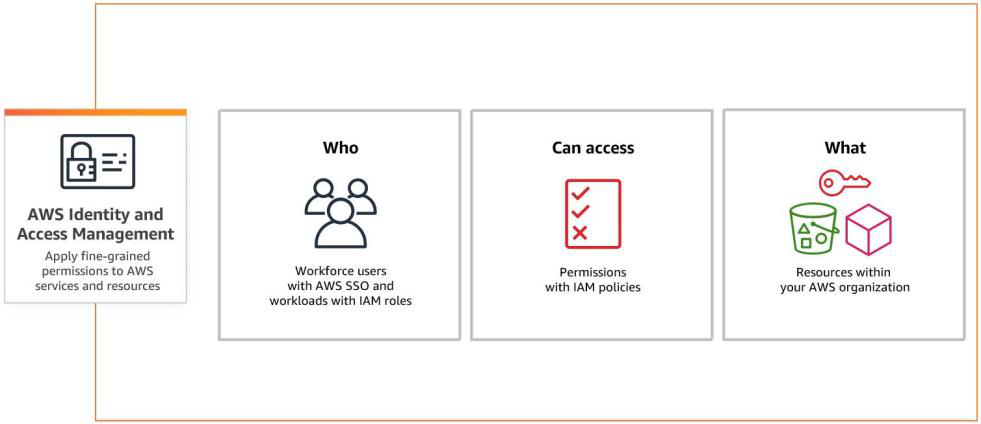{width="4.906944444444444in"
> height="2.1236100174978128in"}

***Şekil 15:** AWS IAM servisi çalışma diyagramı*

Bir AWS hesabınız var ise halihazırda bir "root" yani kök hesaba
sahipsiniz. Ancak AWS işlemleri root hesabı ile yapmanızı tavsiye etmez.
Root hesaplar sonsuz bir yetkiye sahiptir ve yapılan eylemler geri
alınamaz.

> 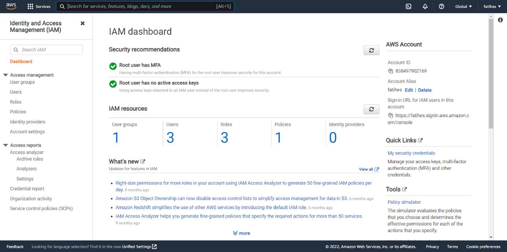{width="5.870833333333334in"
> height="2.9069444444444446in"}

***Şekil 16:** AWS IAM control paneli*

98

IAM servisi altında dört temel konu vardır: Users (kullanıcılar), groups
(gruplar), role (roller) ve policy (poliçeler/politikalar).

**4.2.1. Kullanıcılar**\
IAM kullanıcısı, bir hesapta AWS ile etkileşim kurmak için kullanılan
uzun vadeli kimlik bilgilerine sahip bir kimliktir.

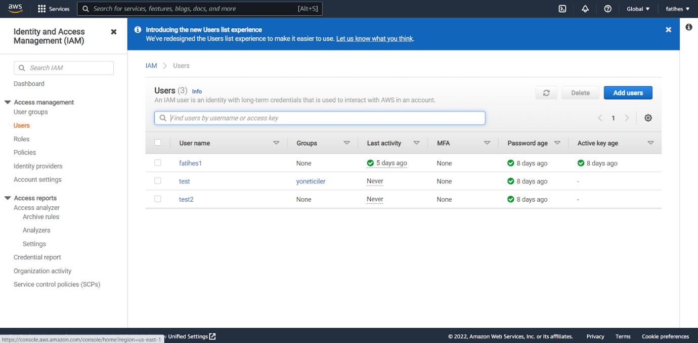{width="6.268054461942257in"
height="3.091666666666667in"}

***Şekil 17:** AWS IAM servisinde tanımlı kullanıcıların listesi*

IAM kontrol paneli üzerinde sol tarafta bulunan "Users" seçeneğinden
sonra mavi "Add user" butonunu kullanarak yeni bir IAM kullanıcısı
oluşturulur.

+-------+-------------------------------------------------------------+
| **‒** | > İlk aşamada bir IAM kullanıcısı için kullanıcı adı        |
|       | > belirlenmesi beklenir. Sonrası ise                        |
+=======+=============================================================+
| **‒** | > AWS kaynaklarına erişim yöntemi seçilmelidir. İki seçenek |
|       | > bulunmaktadır. Bunlar "Erişim anahtarı - Programlı        |
|       | > erişim" (AWS API, CLI, SDK ve diğer geliştirme araçları   |
|       | > için bir erişim anahtarı kimliği ve gizli erişim anahtarı |
|       | > sağlar.) ve "Şifre - AWS                                  |
+-------+-------------------------------------------------------------+
|       | > Yönetim Konsolu erişimi" (Kullanıcıların AWS Management   |
|       | > Console\'da oturum                                        |
+-------+-------------------------------------------------------------+
|       | > açmasına olanak tanıyan bir parolayı etkinleştirir.)      |
|       | > seçenekleridir. AWS yönetim                               |
+-------+-------------------------------------------------------------+
|       | > konsolu erişim seçildiğinde kullanıcıya atanacak otomatik |
|       | > bir şifre olmasını isteyip                                |
+-------+-------------------------------------------------------------+
|       | > istemediğimiz ve kullanıcın ilk girişinde şifresini       |
|       | > değiştirme zorunluluğu olup olmamasını seçtiğimiz ekran   |
|       | > gelir.                                                    |
|       | >                                                           |
|       | > İzinler (permissions) kısmında ise kullanıcıya verilecek  |
|       | > izinler tanımlanır. Bu izinler, daha önce oluşturulmuş    |
|       | > bir kullanıcıya verilen yetkilendirmeler atanabilir,      |
|       | > kullanıcı                                                 |
+-------+-------------------------------------------------------------+
| **‒** | > direkt bir grubun izinleri atanır veya yeni izinler       |
|       | > tanımlanabilmektedir. Poliçeler JSON                      |
+-------+-------------------------------------------------------------+
|       | > formatında dosyalardır ve oluşturulan kullanıcının hangi  |
|       | > servislere izninin olduğunu ve hangi serviste hangi       |
|       | > eylemlerine izin veriliyor gibi kısıtlamalar              |
|       | > oluşturulmasını sağlar.                                   |
|       | >                                                           |
|       | > Sonraki aşamada bir etiket atanması beklenir. Etiketler   |
|       | > anahtar-değerler çiftleri                                 |
+-------+-------------------------------------------------------------+
| **‒** | > şeklindedir. Örneğin insan kaynakları bölümünde çalışan   |
|       | > Ahmet adında bir çalışan için "department-hr:ahmet"       |
|       | > şeklinde bir etiket root kullanıcının ilerleyen           |
|       | > süreçlerde işini kolaylaştıracaktır.                      |
|       | >                                                           |
|       | > En son gözden geçirme aşamasından sonra eğer ki ilk       |
|       | > aşamada "Erişim anahtarı -                                |
+-------+-------------------------------------------------------------+
|       | > Programlı erişim" seçilmiş ise tek sefer görünecek olan   |
|       | > erişim anahtarı ve gizli erişim                           |
+-------+-------------------------------------------------------------+
|       | > anahtarı görünecektir. AWS tarafından bu bilgilerinin     |
|       | > ".csv" formatında indirilmesi tavsiye edilir.             |
+-------+-------------------------------------------------------------+

99

**4.2.2. Gruplar**\
Kullanıcı grubu, IAM kullanıcılarının bir koleksiyonudur. Bir kullanıcı
koleksiyonu için izinleri belirtmek için grupları kullanılır.

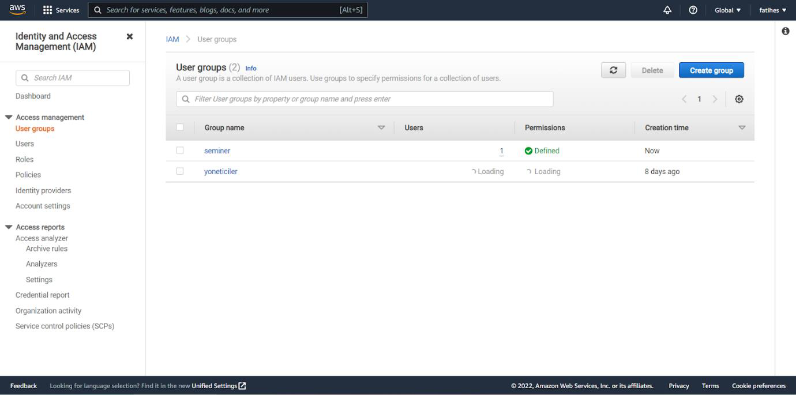{width="6.268054461942257in"
height="3.1152777777777776in"}

***Şekil 18:** AWS IAM servisinde tanımlı grupların listesi*

Bir grup tanımlamak için IAM kontrol paneli üzerinde sol tarafta bulunan
"User Groups" seçeneğinden sonra mavi "Create group" butonunu kullanarak
yeni bir kullanıcı grubu oluşturulur. Gruba bir isim ve sonrasında
halihazırda var olan IAM kullanıcılarından hangilerini bu gruba eklemek
istediğiniz sorulur. Son aşama olarak ise izinleri belirtecek poliçenin
seçilmesi veya JSON formatında yazılması beklenir.

Grubu oluştur dedikten sonra grup tanımlanmış olur. Bu gruba eklenecek
her üye grubun sahip olduğu izinlere sahip olacaktır.

**4.2.3. Roller**\
IAM rolü, kısa süreler için geçerli olan kimlik bilgileriyle belirli
izinlere sahip oluşturabileceğiniz bir kimliktir. Roller, güvendiğiniz
varlıklar tarafından üstlenilebilir.

> 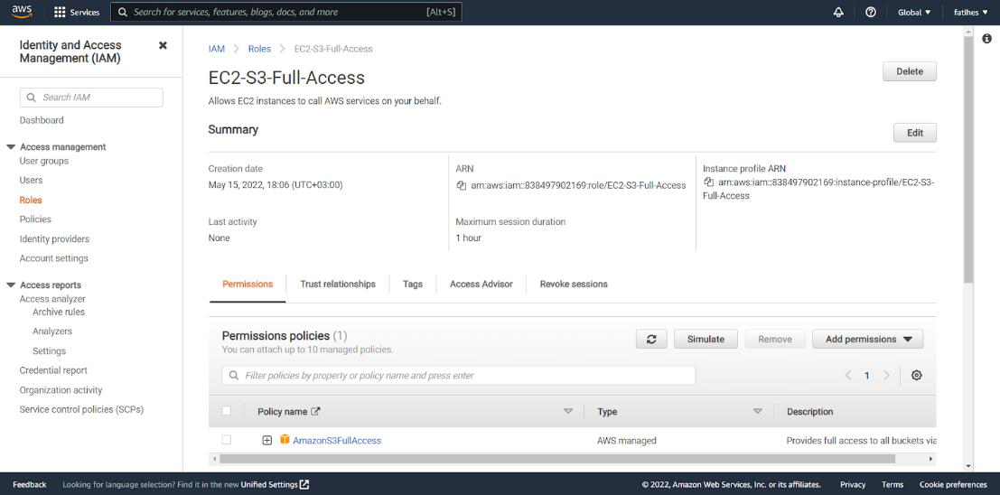{width="5.663888888888889in"
> height="2.804165573053368in"}

***Şekil 19:** AWS IAM servisinde tanımlı rollerin listesi*

100

AWS kaynaklarının başka bir AWS kaynağına veya dışarıdan bir
kullanıcının sahip olduğunuz AWS kaynaklarına erişebilmesi için
oluşturulan yetki seviyeleridir.

Bir rol tanımlamak için IAM kontrol paneli üzerinde sol tarafta bulunan
"Roles" seçeneğinden sonra mavi "Create role" butonunu kullanarak yeni
bir kullanıcı grubu oluşturulur. Role oluşturma üç adımdan oluşur:

+-------+-------------------------------------------------------------+
| **‒** | > Adım 1: Güvenilir varlık seçilmesi.                       |
+=======+=============================================================+
| **‒** | > Seçilebilecek 5 farklı varlık bulunur: AWS servisi, AWS   |
|       | > hesabı, web kimliği,                                      |
+-------+-------------------------------------------------------------+
| **‒** | > SAML 2.0 federasyonu (kendi aktif dizininizden bir        |
|       | > kaynağa), özel olarak                                     |
+-------+-------------------------------------------------------------+
|       | > belirlenen varlık (kullanıcı tarafından tanımlanır)       |
|       | > seçenekleri sunulur. Sonrasında ise hangi servise         |
|       | > rol/kullanıcıya atanacağı seçilir.                        |
|       | >                                                           |
|       | > Adım 2: İzinlerin eklenmesi.                              |
|       | >                                                           |
|       | > Servis, kullanıcı veya varlığa hangi izinler verileceği   |
|       | > seçilir veya kullanıcı tarafından JSON formatında         |
|       | > oluşturulur.                                              |
|       | >                                                           |
|       | > Adım 3: Adlandırma, gözden geçirme ve oluşturma.          |
|       | >                                                           |
|       | > Son aşamada ise role bir isim, tanımlama atanır. Gözden   |
|       | > geçirme işlemleri ile                                     |
+-------+-------------------------------------------------------------+
| **‒** |                                                             |
+-------+-------------------------------------------------------------+
| **‒** |                                                             |
+-------+-------------------------------------------------------------+
| **‒** |                                                             |
+-------+-------------------------------------------------------------+
|       | > yapılan konfigürasyonlar kontrol edilir. En son aşamada   |
|       | > opsiyonlu olarak etiket ekleme işlemi vardır.             |
+-------+-------------------------------------------------------------+

Bu işlemler sonunda rol oluşturulmuş olur.

**4.2.4. Poliçeler**\
Politika (poliçe), AWS\'de izinleri tanımlayan bir nesnedir. Genel
amaçları yetki dağıtmaktır. JSON ile kullanıcı tanımlı olabileceği gibi
kontrol paneli üzerinden GUI ile de oluşturulabilir.

{width="6.268054461942257in"
height="3.1027766841644793in"}

***Şekil 20:** AWS IAM servisinde tanımlı poliçelerin listesi*

Bir rol tanımlamak için IAM kontrol paneli üzerinde sol tarafta bulunan
"Policies" seçeneğinden sonra mavi "Create Policy" butonunu kullanarak
yeni bir kullanıcı grubu oluşturulur.

Sırayla bir servis, hareket (eylem), kaynak ve talep koşulları seçilerek
oluşturulabileceği gibi JSON formatı üzerinden kullanıcı tarafından elle
de tanımlanabilir.

101

Örneğin, S3 servisi üzerinde listeleme ama aynı zamanda çok faktörlü
doğrulama şartı koşan rol aşağıdaki JSON formatı ile tanımlanır.

> {width="4.444444444444445in"
> height="3.0652777777777778in"}

***Şekil 21:** AWS Policy örneği*

Poliçe tanımlandıktan sonra opsiyonlu olarak etiket bilgisi beklenir. En
son aşamada ise poliçeye bir isim ve tanım atanır. Sonrasında poliçe
tanımlanmış olur. Oluşturulan poliçe kullanıcı ve gruplara izin olarak
atanırken kullanılabilir.

**4.3. S3 (Simple Storage Service) Servisi Kullanımı**\
Amazon Simple Storage Service (Amazon S3); sektör lideri
ölçeklenebilirlik, veri erişilebilirliği, güvenlik ve performans sunan
bir nesne depolama hizmetidir. Her büyüklükteki ve her sektörden
müşteriler istedikleri miktarda veriyi data-lake, bulut temelli ve mobil
uygulamalar gibi neredeyse her türlü kullanım örneği için depolayıp
koruyabilir. Uygun maliyetli depolama sınıfları ve kullanımı kolay
yönetim özellikleri sayesinde maliyetlerinizi optimize edebilir,
verilerinizi düzenleyebilir ve hassas ayarlanmış erişim denetimlerini
belirli iş, kuruluş ve uygunluk gereksinimlerini karşılayacak şekilde
yapılandırabilirsiniz.

{width="6.268054461942257in"
height="2.361111111111111in"}

***Şekil 22:** AWS S3 servisi çalışma diyagramı.*

AWS tarafından sunulan başka bir servis olan Amazon Elastic Block Store
ile farkları şu şekildedir:

102

+-------+-------------------------------------------------------------+
| **‒** | > Amazon EBS blok tabanlıdır, Amazon S3 ise obje            |
|       | > tabanlıdır.                                               |
|       | >                                                           |
|       | > Amazon EBS'de veriler disk imajları şeklindedir, Amazon   |
|       | > S3'te ise objeler ve meta datalar olarak depolanabilir.   |
|       | >                                                           |
|       | > Amazon EBS'de bir bilgisayara bağlanarak işletim sistemi, |
|       | > uygulama, veri tabanı vb. kurulabilirken Amazon S3'te     |
|       | > kurulamaz.                                                |
+=======+=============================================================+
| **‒** |                                                             |
+-------+-------------------------------------------------------------+
| **‒** |                                                             |
+-------+-------------------------------------------------------------+

Amazon S3 servisi günümüzde popüler olan OneDrive, GoogleCrive, ICloud
gibi SaaS servislerine benzer ancak çok daha fazlasıdır.

Kullanıcılar Amazon S3 üzerinde sınırsız depolamaya sahiptir, tek şart
tek bir dosyanın boyutunun 5 TB'den fazla olmamasıdır. S3 depolama
birimlerine bucket yani kova denmektedir. S3 üzerinde oluşturulan ilk
şey bucket'lardır. Bucket nihayetinde nesnelerin depolanacağı
konteynerlerdir. Kullanıcılar bir veya daha fazla bucket'a sahip
olabilir. Bucket'lar region yani bölge bazlıdır. Bir bucket nesne
deposunun yanı sıra meta datalar da tutar. Meta data nesnelerin
özelliklerini belirleyen "veri hakkında veri" olarak düşünülebilir.
Örnek olarak; objenin yaratılma tarihi, boyutu, dosya türü gibi değerler
o obje ile tutulan meta datalardır.

**4.3.1. Amazon S3 Bucket Oluşturma ve Temel İşlemler**

{width="6.2972222222222225in"
height="3.1555555555555554in"}

***Şekil 23:** AWS S3 bucket oluşturma ekranı.*

> 1.Bir bucket oluşturulurken ilk aşamada bucket için bir isim
> belirlenmelidir. Bucket'lar
>
> unique yani benzersiz bir isme sahip olmalıdır.
>
> 2.İsim belirlendikten sonra hangi bölgede oluşturulmak istendiği
> seçilir. Bucket'lar
>
> region bazlıdır; yani bir bucket bir bölgede tutulabilir, bölgeler
> arası dağıtılamaz.
>
> 3.Opsiyonlu olarak bucket oluşturma kısmındaki diğer ayarlar ile
> uğraşmak yerine daha
>
> önceden oluşturulmuş bir bucket için seçilen ayarların kopyalanması
> tercih edilebilir.
>
> 4.Nesne sahipliği kısmında, Diğer AWS hesaplarından bu pakete yazılan
> nesnelerin sahipliğini ve erişim kontrol listelerinin (ACL'ler- Access
> Control Lists) kullanımını kontrol edebilirsiniz. Nesne sahipliği,
> nesnelere erişimi kimlerin belirleyebileceğini belirler.
>
> 5.Geçtiğimiz yıllarda genel erişime açık bucket'larda birçok sorun
> çıkmasından dolayı
>
> AWS varsayılan olarak bu bucket'ların genel (public) erişime kapalı
> oluşturur. Bucket oluşturulurken bu ayar değiştirilebilir.

103

> {width="4.648611111111111in"
> height="2.9472222222222224in"}

***Şekil 24:** AWS S3 erişim tanımlama ayarlamaları.*

> 6.Sürüm oluşturma, bir nesnenin birden çok varyantını aynı kovada
> tutmanın bir yoludur.
>
> Amazon S3 klasörünüzde depolanan her nesnenin her sürümünü korumak,
> almak ve geri yüklemek için sürüm oluşturmayı kullanabilirsiniz. Sürüm
> oluşturma ile hem istenmeyen kullanıcı eylemlerinden hem de uygulama
> hatalarından kolayca kurtulabilirsiniz. Bu hizmet sayesinde
> yanlışlıkla silinen bir dosyanın eski versiyonuna kolaylıkla
> dönülebilir.
>
> 7.Bucket'ı etiketleyerek depolama maliyetini veya diğer kriterleri
> takip edebilirsiniz. 8.Bu pakette depolanan yeni nesneleri otomatik
> olarak şifreleyin seçeneği ile depolanan her dosyanın şifrelenmesini
> sağlarsınız.
>
> 9.Nesne kilidi (Object Lock) seçeneğini etkinleştirerek; nesnelerin
> belirli bir süre veya
>
> süresiz olarak silinmesini veya üzerine yazılmasını önlemenize
> yardımcı olmak için bir kez yaz çok oku (WORM) modelini kullanarak
> nesneleri depolamaya devam edersiniz.
>
> Bu aşamalar sonunda bucket oluşturulmuş olur. Bucket'ların
> listelendiği alanda bucket'a giriş yapılabilir ve sonrasında dilenirse
> ekranın sağında bulunan, turuncu "Upload" butonuyla dosya
> yüklenebilir.
>
> Yüklenen bir dosya hakkındaki meta-data'lar aşağıdaki görselde
> belirtilmiştir.
>
> {width="5.865277777777778in"
> height="0.30416557305336833in"}

***Şekil 25:** AWS S3 bucket'ına yüklenen bir dosyanın listelenmesi*

> Bu meta veriler sistem tarafından tanımlıdır. Kullanıcılar dosyalarına
> diledikleri durumunda "anahtar:değer" ikilisi şeklinde meta data
> tanımlayabilir ve sonrasında meta dataya göre dosya getirme işlemleri
> uygulanabilir.
>
> AWS S3 yapısal olarak 3 farklı depolama çözümüne sahiptir. Bu çözümler
> alt yapı olarak çeşitli farklılıklar içermektedir.

+-------+-------------------------------------------------------------+
| **‒** | > S3 Standard: Varsayılan depolama çözümüdür. Depolanan her |
|       | > obje 3 farklı erişilebilirlik alanı arasında kopyalanır.  |
|       | > Servis %99,999999999 (11 tane 9) erişilebilirlik sunar.   |
|       | > 24 saat içerisinde maksimum 8 saniye erişememe            |
|       | > yaşanabilir. Aynı zamanda 1 milyar dosyanın sadece 1'i    |
|       | > bozulabilir ve kaybolabilir.                              |
+-------+-------------------------------------------------------------+

104

+-------+-------------------------------------------------------------+
| **‒** | > S3 Standard-IA: Çok sık erişilmeyen ancak ihtiyaç         |
|       | > duyulması durumunda da çok süre                           |
+=======+=============================================================+
| **‒** | > geçmeden erişilmesi istenen dosyalar bu katmanda bulunur. |
|       | > Servis %99,999999999 (11 tane 9) erişilebilirlik sunar.   |
|       | > Günde maksimum 1 dakika 26 saniye bir kesilme             |
+-------+-------------------------------------------------------------+
|       | > yaşanabilir. Standard katmana göre daha ucuzdur ancak     |
|       | > dosyalara erişim başına ekstra ücretlendirilir.           |
|       | >                                                           |
|       | > S3 One Zone-IA yukarıda belirtilen iki katmanın aksine    |
|       | > tek bir erişilebilirlik alanında tutulur. Günde 7 dakika  |
|       | > 30 saniyeye kadar kesinti yaşanabilir. Nadir erişilen ve  |
|       | > kaybolması durumunda kriz yaratmayacak verilere burada    |
|       | > yer verilir.                                              |
+-------+-------------------------------------------------------------+

2018 sonuna kadar bu 3 katman bulunurken 2018 yılında AWS yeni bir
özellik tanıttı. S3 Intelligent-Tiering ile depolanan objelerin bu üç
katman arası transfer ve yönetimini kullanıcıdan alıp otomatik hale
getirmeye başlamıştır.

Bununla beraber bir katman gibi görünen S3 Glacier, S3'ten tamamen
bağımsızdır. Uzun dönem ve sık erişilmeyen dosyaları saklamak için
kullanılır. Firmaların birkaç yıl bünyesinde tutma zorunluluğu olduğu
arşiv dosyaları burada tutulabilir. Talep edildiği durumda birkaç saat
içerisinde hazırlanır ve kullanıcıya sunulur.

Objeleri bu farklı tier'larda yani katmanlarda konumlandırmanın birden
fazla yolu vardır:

+-------+-------------------------------------------------------------+
| **‒** | > Obje upload edilirken seçilebilir.                        |
|       | >                                                           |
|       | > Upload edilen dosyanın sonrasında özelliklerinden         |
|       | > düzenlenebilir.                                           |
+=======+=============================================================+
| **‒** |                                                             |
+-------+-------------------------------------------------------------+
| **‒** | > Bir kurala bağlanarak belirli süre erişilmeyen objelerin  |
|       | > daha ucuz katmanlara geçişi sağlanabilir.                 |
+-------+-------------------------------------------------------------+

S3 fiyatlandırmada üç temel metriğe göre hesaplanır:

+-------+-------------------------------------------------------------+
| **‒** | > GB cinsinden toplam depolanan veri boyutuna,              |
|       | >                                                           |
|       | > S3'ten dış dünyaya transfer edilen (indirme, erişme vb.)  |
|       | > veri boyutuna,\                                           |
|       | > Toplam obje erişim isteği, kriterlerine göre              |
|       | > fiyatlandırılır. Genel anlamda dosya tutmak oldukça ucuz  |
|       | > olsa da tutulan dosyalara erişmek pahalıdır.              |
+=======+=============================================================+
| **‒** |                                                             |
+-------+-------------------------------------------------------------+
| **‒** |                                                             |
+-------+-------------------------------------------------------------+

Amazon S3'e dosyalar upload edildikten hemen sonra erişime açılırken,
daha önce upload edilmiş bir dosyada yapılan silme ve düzenleme gibi
işlemlerin sonucuna erişmek zaman (milisaniye) alacaktır. Bunun sebebi
birçok cihazda güncelleme yapma zorunluluğudur.

Amazon S3'ün gücü Dropbox, Google Drive gibi dosya depolama servisinden
ziyade bu hizmetin çok uygun fiyatlara yazılımların içine gömülme imkânı
sunmasıdır.

**4.3.2. S3 Bucket Özellikleri**

> {width="4.1125in"
> height="2.35in"}

***Şekil 26:** AWS S3 bucket yönetim sayfası*

105

Bir bucket açıldığında yukarıdaki görseldeki gibi bir ekran kullanıcıyı
karşılar. Properties yani özellikler sekmesini bu başlık altında
derinlemesine inceleyelim.

**4.3.2.1. Genel Bakış**\
Bu bölüm altında bucket'ın hangi bölge (region) altında barındığı, ARN
(Amazon Resource Name) yani amazon kaynak ismi bilgisi ve bucket'ın
oluşturulma tarihi gibi bilgilere yer verilmiştir. ARN servislerin
birbirleriyle iletişim kurmasını sağlayan kimliktir.

**4.3.2.2. Bucket Versiyonlama**\
Bir bucket üzerinde aktif edilmesi durumunda tekrar kapatılamayan bir
özelliktir. Sadece durdurulabilir. S3 bucket obje tabanlı dosya
deposudur. Dosyaların yanlışlıkla silinmesine karşı önlem olarak
versiyonlama kullanılabilir. S3 bucket bu özellik açıldığında dosyada
yapılan her değişiklikte eski ve yeni halini tutar. Örneğin daha önceden
S3 bucket'ına atılmış bir dosyada değişiklik yaptınız, S3 iki versiyonu
da tutacaktır. Dosyayı sil dediğimizde ise dosyaya "delete marker" adı
verilen bir işaretçi konulacaktır. Bu dosya kullanıcı tarafından
görünmeyecektir ve bir API isteği atıldığında dosya listelenmeyecektir.
Ancak dosya S3 bucket'ı içerisinde durmaya devam edecektir. Dosyanın
geri yüklenmesi gerektiğinde ise konuşlanmış olan delete marker'ın
silinmesi yeterli olacaktır. Objelerin listelendiği alanda versiyonları
göster seçeneğine tıklanırsa dosyanın eski versiyonları da görünür.
Dosyanın eski versiyonun obje URL bilgisi değiştirilmiştir. İşin
temelinde silmek için konulan işaretçi de bir yeni versiyon gibi
görünmektedir.

**4.3.2.3. Etiketler**\
Bucket'ı etiketleyerek depolama maliyetini veya diğer kriterleri takip
edebilme imkânı sunar.

**4.3.2.4. Varsayılan şifreleme**\
Bu pakette depolanan yeni nesneleri otomatik olarak şifrelemenizi
sağlayan özelliktir. Şifrelemek için iki farklı yöntem sunmaktadır.
Amazon S3 tarafından yönetilen anahtarlar (SSE-S3); Amazon S3\'ün sizin
için oluşturduğu, yönettiği ve kullandığı bir şifreleme anahtarıdır. AWS
Key Management Service anahtarı (SSE-KMS); AWS Key Management Service
(AWS KMS) tarafından korunan bir şifreleme anahtarıdır.

**4.3.2.5. Akıllı Katmanlama Arşivi Yapılandırmaları**\
Akıllı katmanlı depolama sınıfında depolanan nesnelerin, uzun süreler
boyunca nadiren erişilecek nesneler için optimize edilmiş arşiv erişimi
(Archive Access) katmanına veya derin arşiv erişimi katmanına (Deep
Archive Access) indirgenmesini sağlar.

2021'den sonra S3'e katılmış bir özelliktir. Bucket içerisinde tutulan
bazı dosyalara az erişilirken bazılarına erişim çok fazla ise bu
dosyaları farklı katmanlarda tutmak maddi açıdan önem arz etmektedir. Ne
sıklıkla eriştiğini kullanıcı tarafından el yordamıyla kontrol edilmesi
yerine, bu özellik sayesinde az erişilen dosyalar alt katmanlara doğru
otomatik olarak indirilir. Bu otomatikleştirme işlemi ise sadece katman
sınıfı olarak "Intelligent-Tiering" olarak ayarlanan dosyalarda aktif
olacaktır.

**4.3.2.6. Sunucu Erişim Günlüğü**\
Paketinize erişim isteklerini günlüğe kaydetmenizi sağlayan özelliktir.
S3 bucket'larına birçok obje yüklüyoruz, bu objelere de kullanıcılar
istek atıyor. Eğer ki dosyaya kim ne zaman, nereden erişmiş gibi
kayıtları tutmak istersek bu özelliği aktif hale getirmeliyiz. Bu işlem
için bu günlük bilgilerin yazılacağı yeni bir bucket'a ihtiyaç
duyulacaktır.

106

**4.3.2.7. AWS CloudTrail Veri Olayları**\
CloudTrail konsolunda Amazon S3 nesne düzeyinde API işlemlerini günlüğe
kaydetmek için CloudTrail veri olaylarını yapılandırabileceğiniz
özelliktir. Yani API erişimi kim tarafından sağlanmış gibi verileri
tutmanızı sağlar.

**4.3.2.8. Olay Bildirimi**\
Bu servisi kullanırken ilk olarak bir isim belirlenmelidir. Sonrasında
istenirse prefix veya suffix değeri belirtilerek dosya filtrelenebilir.
Özellik aktifleştirildiğinde ise S3 bucket içerisinde dosya oluşturma,
silme, düzenleme gibi eylemlerin yapılması durumunda e-posta atma gibi
değişik yöntemlerle yönetici hesabının bilgilendirilmesi sağlanır.

**4.3.2.9. Aktarım İvmesi**\
Daha hızlı veri aktarımları için hızlandırılmış bir uç nokta
kullanılmasını sağlayan özelliktir. Müşterinin 2 TB gibi yüksek ölçekli
bir arşive sahip olduğunu varsayalım ve kullanıcı bu arşivi S3
bucket'ına atmak istiyor. Bu işlem normal upload işlemi ile oldukça uzun
bir süre alacaktır.

Bu özelliğin açılması ile normal CLI veya konsol üzerindeki upload url
bilgisi yerine Amazon kendi CDN ağını kullanarak dosya aktarımı
hızlandırmaya çalışacaktır. Eğer ki Amazon dosya aktarım süresini
belirli bir ölçekte azaltırsa ekstra ücretlendirme uygulayacaktır.

**4.3.2.10. Object Lock**\
Nesnelerin belirli bir süre veya süresiz olarak silinmesini veya üzerine
yazılmasını önlemenize yardımcı olmak için bir kez yaz çok oku (WORM)
modelini kullanarak nesnelerin depolanmasını sağlayan servistir. Temel
mantıkta versiyonlamaya benzer olsa da aslında versiyonlama özelliği
açık olan bir dosya yine de silinebilir. Silinmemesi için belirli bir
süre belirtilebilir veya sonsuza kadar silinmemesi talep edilebilir. Bu
özellik sadece S3 bucket'ı oluşturulurken açılabilmektedir.

**4.3.2.11. Talep Eden Öder**\
Etkinleştirildiğinde, istek sahibi, istekleri ve veri aktarım
maliyetlerini öder ve bu pakete anonim erişim devre dışı bırakılır.
Çünkü Amazon anonim erişimi kime ücretlendireceğini belirleyemez.

**4.3.2.12. Static Web Hosting**\
S3 obje tabanlı depolama çözümü olsa da statik web sayfalarını host
edebilir. S3 bir sunucu olmadığı için dinamik web sayfalarını host
edemez. Bir statik web sayfasını canlıya almak için ilk olarak web
sayfası dosyaları S3 bucket'ına upload edilir. "Static web hosting"
özelliği aktif hale getirilir ve index sayfasının ve hata sayfasının yol
(path) bilgileri verildikten sonra web sayfası birkaç saniye içerisinde
erişilebilir olacaktır.

**4.3.3. İzinler**\
**4.3.3.1. Genel Bakış**\
Bu bölümde bucket'ın izinleri özetlenmektedir.

**4.3.3.2. Genel Erişimi Engelle (Bucket Ayarları)**\
Bucket'lara ve nesnelere erişim kontrol listeleri (ACLs), paket
ilkeleri, erişim noktası ilkeleri veya tümü aracılığıyla genel erişim
verilir. Tüm S3 klasörlerinize ve nesnelerinize genel erişimin
engellendiğinden emin olmak için tüm genel erişimi engelle seçeneğini
açın. Bu ayarlar yalnızca bu paket ve erişim noktaları için geçerlidir.
AWS, tüm genel erişimi engelle özelliğini açmanızı önerir, ancak bu
ayarlardan herhangi birini uygulamadan önce uygulamalarınızın herkese
açık erişim olmadan düzgün şekilde çalışacağından emin

107

olmalısınız. Paketlerinize veya içindeki nesnelere bir düzeyde genel
erişime ihtiyacınız varsa, belirli depolama kullanım durumlarınıza
uyacak şekilde bireysel ayarları özelleştirebilirsiniz.

**4.3.3.3. Bucket Poliçeleri**\
JSON\'da yazılan bucket politikası, bucket'ta depolanan nesnelere erişim
sağlar. Paket politikaları, diğer hesapların sahip olduğu nesneler için
geçerli değildir. ACL yani erişim kontrol listelerinde sadece bu
kullanıcı şu yetkiye sahip olsun gibi basit koşullandırmalar
ayarlanabilir. Ancak örneğin sadece belirli IP aralığından erişime izin
verilmesi veya şu kullanıcılar sadece okurken, şu kullanıcılar sadece
yazma erişimine sahip olsun gibi ayarlamalar bu özellik sayesinde
yapılabilir. Özetle; daha karmaşık bir erişim kontrolü ayarlanmak
istenirse bu ayarlamalar erişim kontrol listeleri üzerinden değil de
bucket poliçeleri üzerinden yapılabilir.

**4.3.3.4. Bucket Ownership**\
Diğer AWS hesaplarından bu pakete yazılan nesnelerin sahipliğini ve
erişim kontrol listelerinin (ACL\'ler) kullanımını kontrol etmenizi
sağlayan özelliktir. Nesne sahipliği (Bucket Ownership), nesnelere
erişimi kimlerin belirleyebileceğini belirtirsiniz.

**4.3.3.5. Erişim Kontrol Listesi (Access Control List- ACL)**\
Bucketa kimlerin erişebileceğinin belirtildiği yerdir. Objeleri
listeleme, yeni obje yazma ve aynı zamanda okuma/yazma gibi yetkiler
tanımlanabilir.

**4.3.3.6. Kaynaklar Arası Kaynak Paylaşımı (Croos-origin Resource
Sharing- CORS)**\
JSON\'da yazılan CORS yapılandırması, bir etki alanında yüklenen istemci
web uygulamalarının farklı bir etki alanındaki kaynaklarla etkileşime
girmesi için bir yol tanımlar. Bu özelliği bir senaryo üzerinden
özetlemek gerekirse; www.abc.com ve www.def.com olmak üzere iki alan adı
olduğunu varsayalım. "abc.com" bazı kaynakları "def.com" üzerinden
çekmek istiyor. Bu durum varsayılan olarak def.com tarafından
engellenmiş olarak kabul edelim. CORS kuralları nedeniyle, def.com,
abc.com tarafından gelen isteklerine yanıt vermelidir. Bu özelliğin S3
içerisinde yer edinme nedeni ise, S3 static web sayfalarını host
edebilir. Bu durumda S3 bucket'ı sunucu gibi davranarak CORS ayarlarına
bakarak izin verir veya reddeder.

**4.3.4. Metrikler**\
**4.3.4.1. Bucket Metrikleri**\
Paketinizdeki kullanım, istek ve veri aktarımı etkinliği için ölçümleri
keşfedebileceğiniz bir özelliktir. Metrikler ayrıca Amazon
CloudWatch\'ta da mevcuttur.

> {width="3.3180555555555555in"
> height="1.9930555555555556in"}

***Şekil 27:** AWS S3 bucket istatisliklerini izleme alanı*

108

**4.3.4.2. Depolama Sınıfı Analizi**\
Nesneleri uygun depolama sınıfına ne zaman geçireceğinize karar
vermenize yardımcı olması için depolama erişim modellerini analiz
etmenizi sağlayan özelliktir. Bu özellik sayesinde bir bucket seçersiniz
ve S3 tüm dosyalar ile ilgili analizi yapıp ".csv" formatı ile
belirtilen bucket'a yazacaktır.

**4.3.4.3. Çoğaltma Metrikleri**\
S3 çoğaltma metrikleri, çoğaltma yapılandırmanızdaki çoğaltma kuralları
için ayrıntılı ölçümler sağlar. Çoğaltma ölçümleriyle, bekleyen
baytları, bekleyen işlemleri ve çoğaltma gecikmesini izleyerek
çoğaltmanın dakika dakika ilerlemesini izleyebilirsiniz.

**4.3.5. Yönetim**\
**4.3.5.1. Yaşam Döngüsü Kuralları**\
Nesnelerin başka bir depolama sınıfına geçişi, arşivlenmesi veya belirli
bir süre sonra silinmesi gibi bir nesnenin ömrü boyunca Amazon S3\'ün
gerçekleştirmesini istediğiniz eylemleri tanımlamak için yaşam döngüsü
kurallarını kullanırız. Objelerin depolama sınıfları (standard, glacier
vb.) arası geçinin otomatik kurallara bağlanabilmesini sağlayan kurallar
burada yazılır.

**4.3.5.2. Çoğaltma Kuralları**\
Amazon S3\'ün sunucu tarafı şifreleme, replika sahipliği, replikaları
başka bir depolama sınıfına geçirme ve daha fazlası gibi replikasyon
sırasında uygulamasını istediğiniz seçenekleri tanımlamak için
replikasyon kurallarını kullanılır. Her S3 bucket'ı sadece bir bölgede
durur. Başka bir bölge de bir bucket yaratılarak ve çoğaltma kuralları
tanımlanarak ana bucket üzerinde yapılan her işlemin, yeni oluşturulmuş
bucket için de gerçekleşmesi sağlanır. Bu özellik sayesinde bucket
yedeği alırken aynı zamanda farklı lokasyondaki pazarlardan erişimi
kolaylaştırır.

**4.3.5.3. Envanter Yapılandırmaları**\
Nesnelerinizin ve meta verilerinizin düz bir dosya listesini oluşturmak
için bir pakette envanter yapılandırmaları oluşturabilirsiniz. Bu
zamanlanmış raporlar, paketteki tüm nesneleri içerebilir veya paylaşılan
bir önekle (prefix) sınırlandırılabilir. Örneğin, bucket üzerinde
bulunan bir milyon veriyi belirli özelliklerini görebileceğiniz şekilde
bir ".csv", Apache ORC veya Apache Parquest formatında dosya
oluşturmanızı sağlar.

**4.3.6. Erişim Noktaları**\
Amazon S3 erişim noktaları, S3\'teki paylaşılan veri kümeleri için uygun
ölçekte veri erişimini yönetmeyi kolaylaştırır. Erişim noktaları, S3
nesne işlemlerini gerçekleştirmek için kullanabileceğiniz paketlere
eklenen ağ uç noktaları olarak adlandırılır. Bir erişim noktası diğer
bir erişim noktası ARN\'si ile aynı işlevselliği sağlar ve normalde veri
erişimi için bir S3 grup adının kullanıldığı her yerde kullanım için
ikame edilebilir. Erişim noktaları yeni bir S3 bucket'ı açılmış gibidir.
Kendisine ait poliçe, erişim kontrol listesi değerlerine sahiptir.
Bununla beraber yine kendisine ait url ve ARN yani amazon kaynak ismine
sahiptir. S3 bucket'ına erişen her bir uygulama için, bir erişim noktası
oluşturularak karmaşanın önüne geçilir.

109

**4.4. AWS Command Line Interface (CLI)**\
AWS Komut Satırı Arabirimi (CLI), AWS hizmetlerinizi yönetmek için
kullanabileceğiniz birleşik bir araçtır. Tek bir aracı indirip
yapılandırarak birden çok AWS hizmetini komut satırından kontrol
edebilir ve betikler aracılığıyla otomatikleştirebilirsiniz.

+-------+-------------------------------------------------------------+
| **‒** | > **Linux Shell:** Linux veya macOS\'ta komutları           |
|       | > çalıştırmak için bash, zsh ve tcsh gibi yaygın kabuk      |
|       | > programlarını kullanılabilir.                             |
|       | >                                                           |
|       | > **Windows Command Line:** Windows\'ta komutları Windows   |
|       | > komut isteminde veya PowerShell\'de çalıştırabilirsiniz.  |
|       | >                                                           |
|       | > **Remotely:** PuTTY veya SSH gibi bir uzak terminal       |
|       | > programı veya AWS Systems Manager ile Amazon Elastic      |
|       | > Compute Cloud (Amazon EC2) örneklerinde komut             |
|       | > çalıştırabilirsiniz.                                      |
+=======+=============================================================+
| **‒** |                                                             |
+-------+-------------------------------------------------------------+
| **‒** |                                                             |
+-------+-------------------------------------------------------------+

AWS Management Console\'daki tüm IaaS (hizmet olarak altyapı) AWS
yönetim, yönetim ve erişim işlevleri, AWS API ve AWS CLI\'da mevcuttur.
Yeni AWS IaaS özellikleri ve hizmetleri, başlatma sırasında veya
başlatmadan sonraki 180 gün içinde API ve CLI aracılığıyla tam AWS
Management Console işlevselliği sağlar.

AWS CLI, AWS hizmetlerinin genel API\'lerine doğrudan erişim sağlar. AWS
CLI ile bir hizmetin yeteneklerini keşfedebilir ve kaynaklarınızı
yönetmek için kabuk komut dosyaları geliştirebilirsiniz. Düşük seviyeli,
API eşdeğeri komutlara ek olarak, birkaç AWS hizmeti, AWS CLI için
özelleştirmeler sağlar. Özelleştirmeler, karmaşık bir API\'ye sahip bir
hizmetin kullanımını basitleştiren daha üst düzey komutlar içerebilir.

Yönetim konsolu üzerinden yapılan her işlem komut satırlarıyla da
yapılabilir. Belli aralıklarla tekrarlanan işlemler için bash script'ler
oluşturularak otomatikleştirilebilir.

"aws configure" komutu ile AWS komut satırına bağlanılma isteği
oluşturulur. Sırasıyla tanımlanmış olan IAM hesabının erişim anahtarı ve
gizli erişim anahtarı bilgileri girilir. Sonrasında bir bölge
belirtilmedikçe varsayılan olarak hangi bölgenin seçilmesi istendiği
sorulur. Son sorulan girdi ise varsayılan çıktıların hangi formatta
istendiğidir. Buna yaygın olan JSON ile cevap verilebilir. AWS komut
satırları "aws SERVIS_ADI PARAMETRE" formatında çalışır. Örneğin S3
içerisinde bulunan tüm bucket'ların listelenmesi için "aws s3 ls"komutu
kullanılır. En temel komut ise yardım komutudur. Amazon S3 içerisindeki
kullanılabilecek komutları görmek için "aws s3 help" komutu yeterli
olacaktır.

**4.5. Amazon S3 Glacier**

> {width="5.273611111111111in"
> height="2.558333333333333in"}

***Şekil 28:** Amazon S3 Glacier servisi ana sayfası*

110

> Veri arşivleme için en düşük maliyetli ve milisaniye düzeyinde erişim
> sunan uzun vadeli, güvenli ve dayanıklı depolama sınıflarıdır. Amazon
> S3 Glacier depolama sınıfları, performans ihtiyaçlarınızı karşılamak
> için milisaniye ile saat düzeyinde farklı alım süreleri içeren
> seçenekler sağlar. S3 Glacier Instant Retrieval depolama sınıfı, tıbbi
> görüntüler veya haber medya varlıkları gibi anında erişim gerektiren
> arşivler için milisaniyeler içinde erişim olanağı sunar. S3 Glacier
> Flexible Retrieval, üç erişim seçeneği sunmaktadır: genellikle 1-5
> dakika içinde tamamlanan hızlandırılmış alımlar, genellikle 3-5 saat
> içinde tamamlanan standart alımlar ve büyük hacimli veriler için
> genellikle 5-12 saat içinde tamamlanan ücretsiz toplu alımlar. Amazon
> S3 Glacier Deep Archive depolama sınıfı, 12-48 saat arasında değişen
> iki alma seçeneği sunar.
>
> Amazon S3 Glacier servisi neredeyse tüm işlevlerini komut ekranı
> üzerinden yapmaya izin verir. Mahzen, kısaca mantıksal depolar olarak
> düşünülebilir. Mahzenlerin içerisine arşivler oluşturulur. Arşivler S3
> bucket'ları gibi veri depolarıdır. Yönetim konsolu üzerine sadece
> vault (mahzen) açılmasına izin verir. Arşiv oluşturma, dosya yükleme,
> dosya çekme gibi işlemler sadece komut ekranından yapılabilir.
>
> S3'teki glacier storage tier (katman) bu servis üzerinden yönetilemez.
> Glacier servisinde depolansa da sadece ve sadece S3 üzerinden
> yönetilir/erişilir.
>
> **4.5.1. Glacier Kullanımı**\
> *\# KAYNAK: / Özgür ÖZTÜRK - Bulut Bilişimin Temelleri ve AWS Çözüm*\
> *Mimarlığına Giriş Eğitimi (Udemy)*\
> *\# 0: Komut satırından "egitimvault" diye bir vault (mahzen)
> yaratılır*\
> aws glacier create-vault \--account-id - \--vault-name egitimvault\
> *\# 1: 3 mb boyutunda largefile isimli bir dosya yaratılır*\
> dd if=/dev/urandom of=largefile bs=3145728 count=1\
> *\# 2: Dosya split ile bölünür*\
> split \--bytes=1048576 \--verbose largefile chunk\
> *\# 3: Multipart upload için bir alan açılır*\
> aws glacier initiate-multipart-upload \--account-id -
> \--archive-description \"multipart upload test\" \--part-size 1048576
> \--vault-name egitimvault\
> *\# Komutu sonucu şu şekildedir:*\
> {\
> \"location\": \"/097479760550/vaults/egitimvault/multipart\
> uploads/ssW0KxfMgdJ4LTRposuVTpPgrGsTAPze_GQUwtFWrJwIKEkNOdX_F0z\
> yNAA_pQIptvpZueGWWUszGZ446HBIE9aWWVr\",\
> \"uploadId\":
> \"ssW0KxfMgdJ4LTRposuVTpPgrGsTAPze_GQUwtFWrJwIKEkNOdX_F0zyNAA_pQIptvpZueGWWUszGZ446HBIE9aWWVr\"\
> }\
> *\# 4: Sonra bu uploadID değerini bir değişkene atıyoruz ve multipart
> upload\'a başlıyoruz*\
> \$UPLOADID=\"ssW0KxfMgdJ4LTRposuVTpPgrGsTAPze_GQUwtFWrJwIKEkNOdX_F0z\
> yNAA_pQIptvpZueGWWUszGZ446HBIE9aWWVr\"

111

> aws glacier upload-multipart-part \--upload-id \$UPLOADID \--body
> chunkaa \--range \'bytes 0-1048575/\*\' \--account-id - \--vault-name
> egitimvault\
> aws glacier upload-multipart-part \--upload-id \$UPLOADID \--body
> chunkab \--range \'bytes 1048576-2097151/\*\' \--account-id -
> \--vault-name egitimvault\
> aws glacier upload-multipart-part \--upload-id \$UPLOADID \--body
> chunkac \--range \'bytes 2097152-3145727/\*\' \--account-id -
> \--vault-name egitimvault\
> *\# 5: Openssl ile dosyanın hashını çıkarıyoruz ki buradaki dosya ile
> giden dosya aynı mı kontrol edebilelim*\
> \$ openssl dgst -sha256 -binary chunkaa \> hash1\
> \$ openssl dgst -sha256 -binary chunkab \> hash2\
> \$ openssl dgst -sha256 -binary chunkac \> hash3\
> *\# 6: İlk 2 hashi yeni bir dosya yapıyoruz sonra onun da da hashini
> alıyoruz* \$ cat hash1 hash2 \> hash12\
> \$ openssl dgst -sha256 -binary hash12 \> hash12hash\
> *\# 7: Sonra bunu üçüncü dosyayla birleştiriyoruz ve en sonunda o hash
> değerini değişkene atıyoruz*\
> \$ cat hash12hash hash3 \> hash123\
> \$ openssl dgst -sha256 hash123\
> SHA256(hash123)=\
> 9628195fcdbcbbe76cdde932d4646fa7de5f219fb39823836d81f0cc0e18aa67\
> \$
> TREEHASH=9628195fcdbcbbe76cdde932d4646fa7de5f219fb39823836d81f0cc0e18aa67
> *\# 8: Son olarak da upload'u tamamlıyoruz*\
> aws glacier complete-multipart-upload \--checksum \$TREEHASH
> \--archive-size 3145728 \--upload-id \$UPLOADID \--account-id -
> \--vault-name egitimvault
>
> **4.6. Amazon Elastic Compute Cloud (EC2) Servisi Kullanımı** Amazon
> EC2, zorlu iş ihtiyaçlarını karşılamak için güvenli, stabil, yüksek
> performanslı ve uygun maliyetli işlem altyapısı sağlar. En önemli ve
> en çok kullanılan AWS hizmetidir. AWS tarafından sunulan sanal sunucu
> yaratılmasını sağlayan IaaS hizmetidir.
>
> **4.6.1. EC2 Fiyatlandırma**\
> Amazon EC2\'yi ücretsiz deneyebilirsiniz. Amazon EC2 bulut sunucuları
> için ödeme yapmanın beş yolu vardır: İstek üzerine, savings plans,
> rezerve edilmiş bulut sunucuları ve spot bulut sunucuları.
> Kullanımınız için tahsis edilmiş fiziksel sunucularda EC2 bulut
> sunucusu kapasitesi sağlayan "Tahsis Edilmiş Konak Sunucular" için de
> ödeme yapabilirsiniz.

+-------+-----------------------------+-----------------------------+
| **‒** | > **İstek Üzerine:** İstek  |                             |
|       | > üzerine bulut             |                             |
|       | > sunucularını kullanırken  |                             |
|       | > hangi bulut sunucularını  |                             |
|       | > çalıştırdıysanız ona göre |                             |
|       | > saatlik veya saniyelik    |                             |
|       | > olarak işlem kapasitesi   |                             |
|       | > ücreti ödersiniz.         |                             |
+=======+=============================+=============================+
|       | > Uzun vadeli taahhüt veya  |                             |
|       | > peşin ödeme gerekmez.     |                             |
|       | > Uygulamanızın             |                             |
|       | > gereksinimlerine          |                             |
+-------+-----------------------------+-----------------------------+
|       | > bağlı olarak işlem        |                             |
|       | > kapasitenizi artırıp      |                             |
|       | > azaltabilir ve yalnızca   |                             |
|       | > kullandığınız bulut       |                             |
|       | > sunucusu için belirtilen  |                             |
|       | > saatlik ücretleri         |                             |
|       | > ödersiniz.                |                             |
+-------+-----------------------------+-----------------------------+
|       | > İsteğe Bağlı bulut        |                             |
|       | > sunucuları aşağıdakiler   |                             |
|       | > için önerilir:            |                             |
+-------+-----------------------------+-----------------------------+
|       | •                           | > Peşin ödeme veya uzun     |
|       |                             | > vadeli taahhüt olmaksızın |
|       |                             | > Amazon EC2\'nin düşük     |
|       |                             | > maliyetini ve esnekliğini |
|       |                             | > tercih eden kullanıcılar. |
+-------+-----------------------------+-----------------------------+
|       | •                           | > Kesintiye uğratılamayan   |
|       |                             | > kısa vadeli, ani          |
|       |                             | > artışlara yol açan veya   |
|       |                             | > tahmin edilemeyen iş      |
|       |                             | > yüklerine sahip           |
|       |                             | > uygulamalar.              |
|       |                             | >                           |
|       |                             | > Amazon EC2 üzerinde ilk   |
|       |                             | > kez geliştirilen veya     |
|       |                             | > test edilen uygulamalar.  |
+-------+-----------------------------+-----------------------------+
|       | •                           |                             |
+-------+-----------------------------+-----------------------------+

112

+-------+-----------------------------+-----------------------------+
| **‒** | > **Spot Bulut              |                             |
|       | > Sunucuları:** Amazon EC2  |                             |
|       | > spot bulut sunucuları,    |                             |
|       | > isteğe bağlı seçeneğine   |                             |
+=======+=============================+=============================+
| **‒** | > göre %90\'a kadar         |                             |
|       | > indirimli fiyatlar        |                             |
|       | > karşılığında yedek Amazon |                             |
|       | > EC2 işlem kapasitesi      |                             |
|       | > talep etmenize imkân      |                             |
|       | > tanır.                    |                             |
+-------+-----------------------------+-----------------------------+
|       | > Spot bulut sunucuları     |                             |
|       | > aşağıdakiler için         |                             |
|       | > önerilir:\                |                             |
|       | > • Başlangıç ve bitiş      |                             |
|       | > zamanı esnek olan         |                             |
|       | > uygulamalar.              |                             |
+-------+-----------------------------+-----------------------------+
|       | •                           | > Ticari açıdan yalnızca    |
|       |                             | > işlem fiyatları çok düşük |
|       |                             | > olduğunda makul olan      |
|       |                             | > uygulamalar.              |
|       |                             | >                           |
|       |                             | > Çok miktarda ek kapasite  |
|       |                             | > konusunda acil bilişim    |
|       |                             | > gereksinimleri olan       |
|       |                             | > kullanıcılar.             |
+-------+-----------------------------+-----------------------------+
|       | •                           |                             |
+-------+-----------------------------+-----------------------------+
|       | > **Savings Plans:**        |                             |
|       | > Savings plans, 1 veya 3   |                             |
|       | > yıl boyunca sürekli bir   |                             |
|       | > kullanım tutarına (USD /  |                             |
|       | > saat olarak ölçülen)      |                             |
|       | > taahhüt etmeye karşılık   |                             |
|       | > olarak EC2 ve Fargate     |                             |
|       | > kullanımında düşük        |                             |
|       | > fiyatlar sunan esnek bir  |                             |
|       | > fiyatlandırma modelidir.  |                             |
+-------+-----------------------------+-----------------------------+
| **‒** | > **Tahsis Edilmiş          |                             |
|       | > Konaklar:** Tahsis        |                             |
|       | > edilmiş konaklar,         |                             |
|       | > kullanımınıza tahsis      |                             |
|       | > edilen fiziksel EC2       |                             |
|       | > sunucularıdır. Tahsis     |                             |
|       | > edilmiş konaklar, kendi   |                             |
|       | > lisans koşullarınıza tabi |                             |
|       | > olan Windows Server, SQL  |                             |
|       | > Server ve SUSE Linux      |                             |
|       | > Enterprise Server gibi    |                             |
|       | > mevcut sunucu sınırlamalı |                             |
|       | > yazılım lisanslarınızı    |                             |
|       | > kullanmanıza imkân        |                             |
|       | > tanıyarak maliyetlerinizi |                             |
+-------+-----------------------------+-----------------------------+
| **‒** | > düşürmenize ve aynı       |                             |
|       | > zamanda uyumluluk         |                             |
|       | > gereksinimlerinizi        |                             |
|       | > karşılamanıza yardımcı    |                             |
|       | > olabilir.                 |                             |
|       | >                           |                             |
|       | > • İsteğe bağlı olarak     |                             |
|       | > (saatlik) satın           |                             |
|       | > alınabilir.               |                             |
|       | >                           |                             |
|       | > • İsteğe bağlı seçeneğine |                             |
|       | > göre %70\'e kadar         |                             |
|       | > indirimli bir fiyat       |                             |
|       | > karşılığında rezervasyon  |                             |
|       | > olarak satın alınabilir.  |                             |
+-------+-----------------------------+-----------------------------+
|       | > **Rezerve Edilmiş Bulut   |                             |
|       | > Sunucuları:** Amazon EC2  |                             |
|       | > rezerve bulut sunucuları  |                             |
|       | > (RI), isteğe bağlı        |                             |
|       | > fiyatlandırmaya kıyasla   |                             |
|       | > önemli ölçüde bir indirim |                             |
|       | > (%72\'ye kadar) sağlar ve |                             |
|       | > belirli bir               |                             |
|       | > erişilebilirlik alanında  |                             |
|       | > (AZ) kullanıldığında      |                             |
|       | > kapasite rezervasyonu     |                             |
|       | > sunar. Rezerve bulut      |                             |
|       | > sunucuları, isteğe bağlı  |                             |
|       | > bulut sunucusu            |                             |
|       | > fiyatlandırmasına kıyasla |                             |
|       | > önemli                    |                             |
+-------+-----------------------------+-----------------------------+
|       | > oranlarda (%72\'ye kadar) |                             |
|       | > indirim sağlar. Bir       |                             |
|       | > yandan Dönüştürülebilir   |                             |
|       | > Rezerve Bulut             |                             |
|       | > Sunucularını kullanırken  |                             |
|       | > rezerve bulut sunucusu    |                             |
|       | > fiyatlandırması           |                             |
|       | > avantajından              |                             |
+-------+-----------------------------+-----------------------------+
|       | > yararlanırken diğer       |                             |
|       | > yandan da aileleri,       |                             |
|       | > işletim sistemi türlerini |                             |
|       | > ve kiracıları değiştirme  |                             |
|       | > esnekliğine sahip         |                             |
|       | > olursunuz.                |                             |
+-------+-----------------------------+-----------------------------+

**4.6.2. Amazon EC2 Bulut Sunucusu Tipleri**\
Amazon EC2, farklı kullanım örnekleri için optimize edilmiş çok sayıda
bulut sunucusu tipi seçeneği sunar. Bulut sunucusu türleri çeşitli CPU,
bellek, depolama ve ağ iletişimi kapasitesi birleşimlerinden oluşur ve
uygulamalarınız için uygun kaynak karışımını seçebilme esnekliği sağlar.
Her bulut sunucusu türü bir veya daha fazla bulut sunucusu boyutu
içerir. Böylece kaynaklarınızı hedef iş yükünüze göre
ölçeklendirebilmenize imkân tanır.

+-------+-------------------------------------------------------------+
| •     | > **Genel Amaçlı:** Genel amaçlı bulut sunucuları; işlem,   |
|       | > bellek ve ağ kaynakları arasında                          |
+=======+=============================================================+
| **‒** | > denge sağlar ve çeşitli iş yükleri için kullanılabilir.   |
|       | > Web sunucuları ve kod depoları gibi                       |
+-------+-------------------------------------------------------------+
|       | > bu kaynakları eşit oranlarda kullanan uygulamalar için bu |
|       | > bulut sunucuları idealdir.                                |
+-------+-------------------------------------------------------------+
|       | > Xcode IDE üzerinde iOS, iPadOS, macOS, WatchOS ve tvOS    |
|       | > uygulamaları geliştirme, üretme, test etme ve bunlarda    |
|       | > oturum açma gibi kullanım örnekleri mevcuttur.            |
|       | >                                                           |
|       | > T, M ve A tipi sunucular bu kategoridedir.                |
+-------+-------------------------------------------------------------+
| **‒** | > M6g bulut sunucuları, A1 bulut sunucuları, T2 bulut       |
|       | > sunucuları ve m3.medium dışında her vCPU, Intel Xeon veya |
|       | > AMD EPYC çekirdeğinin bir iş parçacığıdır.                |
+-------+-------------------------------------------------------------+
| **‒** | > T4g ve M6g bulut sunucuları üzerindeki her vCPU, AWS      |
|       | > Graviton2 işlemcinin bir çekirdeğidir.                    |
|       | >                                                           |
|       | > A1 bulut sunucuları üzerindeki her vCPU, "AWS Graviton    |
|       | > İşlemcinin" bir çekirdeğidir.                             |
+-------+-------------------------------------------------------------+
| **‒** |                                                             |
+-------+-------------------------------------------------------------+

113

+-------+-------------------------------------------------------------+
| **‒** | > AVX, AVX2 ve gelişmiş ağ iletişimi yalnızca HVM AMI\'ler  |
|       | > ile başlatılan bulut sunucularında bulunur.               |
+=======+=============================================================+
| **‒** | > Bu sayı, bu bulut sunucusu tipi için varsayılan ve en     |
|       | > yüksek vCPU sayısıdır. Bu bulut                           |
+-------+-------------------------------------------------------------+
| **‒** | > sunucusu türünü başlatırken özel bir vCPU sayısı          |
|       | > belirtebilirsiniz. Geçerli vCPU sayısı                    |
+-------+-------------------------------------------------------------+
|       | > ve bu özelliği kullanmaya başlama hakkında daha ayrıntılı |
|       | > bilgi edinmek için CPU optimizasyonu belgelerinin yer     |
|       | > aldığı bu sayfayı ziyaret edin.                           |
|       | >                                                           |
|       | > Bu M4 bulut sunucuları bir Intel Xeon E5-2686 v4          |
|       | > (Broadwell) işlemci üstünde başlatılabilir.               |
|       | >                                                           |
|       | > Belirli bir ağ bant genişliğine \"Varan\" şeklinde        |
|       | > işaretlenen bulut sunucuları, bir taban bant genişliğine  |
|       | > sahiptir ve taban ağ genişliklerinin ötesine elden gelen  |
|       | > en iyi şekilde artış için bir ağ G/Ç kredisi mekanizması  |
|       | > kullanabilirler.                                          |
+-------+-------------------------------------------------------------+
| **‒** |                                                             |
+-------+-------------------------------------------------------------+
| •     | > **İşlem İçin Optimize Edilmiş:** İşlem için optimize      |
|       | > edilmiş bulut sunucuları, yüksek                          |
+-------+-------------------------------------------------------------+
| **‒** | > performanslı işlemcilerden yararlanan işleme bağlı        |
|       | > uygulamalar için idealdir. Bu                             |
+-------+-------------------------------------------------------------+
|       | > ailedeki bulut sunucuları toplu işleme iş yükleri, medya  |
|       | > dönüştürme, yüksek                                        |
+-------+-------------------------------------------------------------+
|       | > performanslı web sunucuları, yüksek performanslı bilişim  |
|       | > (HPC), bilimsel modelleme,                                |
+-------+-------------------------------------------------------------+
|       | > tahsis edilmiş oyun sunucuları ve reklam sunucusu         |
|       | > altyapıları, makine öğrenimi                              |
+-------+-------------------------------------------------------------+
|       | > çıkarımı ve diğer yoğun işlem içeren uygulamalar için     |
|       | > oldukça uygundur. Yüksek                                  |
+-------+-------------------------------------------------------------+
|       | > performanslı bilişim (HPC), toplu işleme, reklam sunma,   |
|       | > video kodlama, oyun, bilimsel                             |
+-------+-------------------------------------------------------------+
|       | > modelleme, dağıtılmış analiz ve CPU temelli makine        |
|       | > öğrenimi çıkarımı gibi kullanım örnekleri mevcuttur.      |
|       | >                                                           |
|       | > C tipi sunucular bu kategoride yer alır.                  |
+-------+-------------------------------------------------------------+
| **‒** | > C7g bulut sunucuları üzerindeki her vCPU, AWS Graviton3   |
|       | > işlemcisinin bir çekirdeğidir.                            |
+-------+-------------------------------------------------------------+
| **‒** | > C6g ve C6gn bulut sunucuları üzerindeki her vCPU, AWS     |
|       | > Graviton2 işlemcinin bir çekirdeğidir.                    |
|       | >                                                           |
|       | > AVX, AVX2 ve gelişmiş ağ iletişimi yalnızca HVM AMI\'ler  |
|       | > ile başlatılan bulut sunucularında bulunur.               |
+-------+-------------------------------------------------------------+
| **‒** |                                                             |
+-------+-------------------------------------------------------------+
| **‒** | > Bu sayı, bu bulut sunucusu tipi için varsayılan ve en     |
|       | > yüksek vCPU sayısıdır. Bu bulut                           |
+-------+-------------------------------------------------------------+
| **‒** | > sunucusu türünü başlatırken özel bir vCPU sayısı          |
|       | > belirtebilirsiniz. Geçerli vCPU sayısı                    |
+-------+-------------------------------------------------------------+
|       | > ve bu özelliği kullanmaya başlama hakkında daha ayrıntılı |
|       | > bilgi edinmek için CPU Optimizasyonu belgelerinin yer     |
|       | > aldığı bu sayfayı ziyaret edin.                           |
|       | >                                                           |
|       | > Belirli bir ağ bant genişliğine \"Varan\" şeklinde        |
|       | > işaretlenen bulut sunucuları, bir taban                   |
+-------+-------------------------------------------------------------+
| •     | > bant genişliğine sahiptir ve taban ağ genişliklerinin     |
|       | > ötesine elden gelen en iyi şekilde artış için bir ağ G/Ç  |
|       | > kredisi mekanizması kullanabilirler.                      |
+-------+-------------------------------------------------------------+
|       | > **Bellek İçin Optimize Edilmiş:** Bellek için optimize    |
|       | > edilmiş bulut sunucuları, bellekte büyük veri kümeleri    |
|       | > işleyen iş yükleri için hızlı performans sunmak üzere     |
|       | > tasarlanmıştır. Açık kaynaklı veri tabanları, bellek içi  |
|       | > önbellekler, gerçek zamanlı                               |
+-------+-------------------------------------------------------------+
| **‒** | > büyük veri analizleri gibi yoğun bellek ihtiyacı olan     |
|       | > uygulamalar gibi kullanım alanları mevcuttur.             |
|       | >                                                           |
|       | > R, X, Z ve U tipi sunucular bu kategoride yer alır.       |
+-------+-------------------------------------------------------------+
| **‒** | > R6g ve X2gd bulut sunucuları üzerindeki her vCPU, AWS     |
|       | > Graviton2 işlemcinin bir çekirdeğidir.                    |
|       | >                                                           |
|       | > Belirli bir ağ bant genişliğine \"Varan\" şeklinde        |
|       | > işaretlenen bulut sunucuları, bir taban                   |
+-------+-------------------------------------------------------------+
| **‒** |                                                             |
+-------+-------------------------------------------------------------+
| •     | > bant genişliğine sahiptir ve taban ağ genişliklerinin     |
|       | > ötesine elden gelen en iyi şekilde artış için bir ağ G/Ç  |
|       | > kredisi mekanizması kullanabilirler.                      |
+-------+-------------------------------------------------------------+
|       | > **Hızlandırılmış Bilişim:** Hızlandırılmış bilişim bulut  |
|       | > sunucuları; kayan nokta sayı                              |
+-------+-------------------------------------------------------------+
|       | > hesaplamaları, grafik işleme veya veri deseni eşleme gibi |
|       | > işlevleri CPU\'lar üzerinden                              |
+-------+-------------------------------------------------------------+

114

+-------+-------------------------------------------------------------+
| **‒** | > çalışan yazılımların erişemeyeceği bir verimlilik         |
|       | > düzeyinde gerçekleştirmek için                            |
+=======+=============================================================+
|       | > donanım hızlandırıcıları veya ortak işlemcileri kullanır. |
|       | > Makine öğrenimi, yüksek                                   |
+-------+-------------------------------------------------------------+
|       | > performanslı bilişim, hesaplamalı akışkanlar dinamiği,    |
|       | > hesaplamalı finans, sismik                                |
+-------+-------------------------------------------------------------+
|       | > analiz, konuşma tanıma, sürücüsüz araçlar ve ilaç         |
|       | > keşifleri gibi kullanım alanları mevcuttur.               |
|       | >                                                           |
|       | > F, P ve G tipi sunucular bu kategoride yer alır.          |
|       | >                                                           |
|       | > Belirli bir ağ bant genişliğine varan şeklinde            |
|       | > işaretlenen bulut sunucuları, bir taban bant              |
+-------+-------------------------------------------------------------+
| **‒** |                                                             |
+-------+-------------------------------------------------------------+
| •     | > genişliğine sahiptir ve taban ağ genişliklerinin ötesine  |
|       | > elden gelen en iyi şekilde artış için bir ağ G/Ç kredisi  |
|       | > mekanizması kullanabilirler.                              |
+-------+-------------------------------------------------------------+
|       | > **Depolama İçin Optimize Edilmiş:** Depolama için         |
|       | > optimize edilmiş bulut sunucuları;                        |
+-------+-------------------------------------------------------------+
| **‒** | > yerel depolama üzerindeki çok büyük veri kümelerine       |
|       | > yüksek, sıralı okuma ve yazma                             |
+-------+-------------------------------------------------------------+
|       | > erişimi gerektiren iş yükleri için tasarlanmıştır. Bu     |
|       | > bulut sunucuları, uygulamalara saniye başına on binlerce  |
|       | > düşük gecikmeli, rastgele G/Ç işlemi (IOPS) göndermek     |
|       | > için optimize edilmiştir. Bu bulut sunucuları; ilişkisel  |
|       | > veri tabanları (MySQL, MariaDB ve PostgreSQL) ve NoSQL    |
|       | > veri tabanları (KeyDB, ScyllaDB ve Cassandra) gibi orta   |
|       | > boyutlu veri kümelerine sahip olan ve yüksek işlem        |
|       | > performansı ile yüksek ağ aktarım                         |
+-------+-------------------------------------------------------------+
|       | > hızından yararlanabilecek G/Ç yoğun ve iş açısından       |
|       | > kritik iş yükleri için saniye başına                      |
+-------+-------------------------------------------------------------+
|       | > işlem sayısını (TPS) en üst düzeye çıkarır. Ayrıca arama  |
|       | > altyapıları ve veri analizi iş yükleri gibi yerel         |
|       | > depolama alanlarındaki orta boyutlu veri kümelerine çok   |
|       | > hızlı erişim gerektiren iş yükleri için idealdirler.      |
|       | >                                                           |
|       | > R, X, Z ve U tipi sunucular bu kategoride yer alır.       |
|       | >                                                           |
|       | > i3.metal, 36 fiziksel çekirdek üstünde 72 mantıksal       |
|       | > işlemci sunar.                                            |
+-------+-------------------------------------------------------------+
| **‒** |                                                             |
+-------+-------------------------------------------------------------+

Sunucu tipleri modelleri belirli bir isimlendirme standarttı takip
edilerek oluşturulmuştur. Örneğin; m4.large model bir sunucu genel
amaçlı M tipi bir sunucun 4.jenarasyonudur. İlk yaratılan jenerasyon 1.
olanlardır. Yıllar geçtikçe gelişen teknoloji ile yeni işlemciler,
sunucu donanımları geliştirilir ve yeni sunucu makinelerinde barınacak
sanal makineler için farklı model ismi kullanılır. AWS yeni jenerasyon
servislerini teşvik amaçlı daha uygun fiyata sunmaktadır. Bununla
birlikte "m4.large" da bulunan large kelimesi de sanal sunucunun
özelliklerini temsilen kullanılır. Nano, micro ile başlayarak 24XLarge
haline kadar farklı modeller bulunur. Bu artış sanal sunucunun RAM, bant
genişliği, depolama, CPU performansı gibi değerlerini temsil etmektedir
ve 24XLarge'a yaklaştıkça bu değerler daha yüksek olur.

AWS, 2018 yılının sonuna doğru 2 yeni instance ortaya çıkarmıştır. ARM
tabanlı işlemciler bulunduran sanal makinelerdir. M5a ve T3a modelleri
ise AMD işlemci bulunduran sunuculardır.

**4.6.3. Depolama Modelleri**\
Amazon EC2 iş yüklerinin depolama gereksinimi birbirinden çok farklı
olabilir. Yerleşik bulut sunucusu geçici diskine ek olarak, diğer bulut
depolama iş yükü gereksinimleri için uygun Amazon Elastic Block Store
(Amazon EBS) ve Amazon Elastic File System (Amazon EFS) seçeneklerini de
sunar. Amazon EBS, Amazon EC2 bulut sunucuları ile kullanılmak üzere
kalıcı, yüksek oranda erişilebilir, tutarlı ve düşük gecikmeli blok
depolama hacimleri sunarken Amazon EFS, paylaşılan erişime yönelik
basit, ölçeklenebilir, kalıcı ve tam yönetilen bulut dosya depolaması
sunar.

115

***Tablo 1:** EFS ve EBS Karşılaştırılması*

+----------------------------------+----------------------------------+
| **Amazon Elastic File System     | **Amazon Block Store (EBS)**     |
| (EFS)**                          |                                  |
+==================================+==================================+
| Instance'e fiziksel olarak       | Kalıcı veri deposudur,           |
| bağlıdır.                        | instance'den bağımsız.           |
+----------------------------------+----------------------------------+
| Kalıcı olmayan veri deposu.      | Block tabanlı (base) depolama.   |
+----------------------------------+----------------------------------+
| Veri başka bir makinede replika  | AZ içerisinde birden fazla       |
|                                  | cihazda replika                  |
| edilmez.                         |                                  |
|                                  | edilir.                          |
+----------------------------------+----------------------------------+
| Snapshot desteği yok.            | Snapshot desteği bulunur.        |
+----------------------------------+----------------------------------+
| SSD veya HDD                     | SSD veya HDD                     |
+----------------------------------+----------------------------------+

Amazon Instance Store (Ephemeral); herhangi bir sanal makinenin üzerinde
çalıştığı fiziksel sunucuya doğrudan bağlı disklerin kullanıldığı
depolama yöntemine verilen isimdir. Direkt bağlı olduğu için yüksek
erişimiz hızı ve düşük gecikme sunar. Disk giriş/çıkış hızının önemli
olduğu depolama için optimize edilmiş D, H ve I ailelerinin bazıları bu
modeldedir. Sanal makine kullanıcıdan bağımlı veya bağımsız kapanırsa
veriler gider.

EBS ise aktif olarak çok daha fazla kullanılan depolama modelidir.
Amazon EBS, depolama performansınızı ve maliyetinizi uygulamalarınızın
ihtiyaçlarına göre uyarlayabilmeniz için performans özellikleri ve
fiyatları bakımından farklılık gösteren aşağıdaki birim türlerini
sağlar. Hacim türleri şu kategorilere girer:

+-------+-------------------------------------------------------------+
| **‒** | > **Solid State Drives (SSD):** Baskın performans           |
|       | > özniteliğinin IOPS olduğu, küçük G/Ç                      |
+=======+=============================================================+
| **‒** | > boyutuna sahip sık okuma/yazma işlemlerini içeren         |
|       | > işlemsel iş yükleri için optimize edilmiştir.             |
|       | >                                                           |
|       | > **Hard Disk Drives (HDD):** Baskın performans             |
|       | > özniteliğinin aktarım hızı olduğu büyük akış iş yükleri   |
|       | > için optimize edilmiştir.                                 |
|       | >                                                           |
|       | > **Önceki Nesil:** Verilere seyrek olarak erişilen ve      |
|       | > performansın birincil öneme sahip                         |
+-------+-------------------------------------------------------------+
| **‒** |                                                             |
+-------+-------------------------------------------------------------+
|       | > olmadığı küçük veri kümelerine sahip iş yükleri için      |
|       | > kullanılabilen sabit disk sürücüleri. Bunun yerine        |
|       | > geçerli nesil bir birim türünü düşünmeniz AWS tarafından  |
|       | > önerilir.                                                 |
+-------+-------------------------------------------------------------+

Örnek yapılandırması, Giriş/Çıkış özellikleri ve iş yükü talebi gibi EBS
birimlerinin performansını etkileyebilecek çeşitli faktörler vardır. Bir
EBS biriminde sağlanan IOPS\'yi tam olarak kullanmak için EBS için
optimize edilmiş örnekleri kullanmalısınız.

**4.6.4. İşletim Sistemi Çeşitleri**\
Amazon Machine Image\'lar (AMI\'ler), Microsoft Windows\'un yanı sıra
Amazon Linux 2, Ubuntu, Red Hat Enterprise Linux, CentOS, SUSE ve
Debian\'ın da aralarında bulunduğu Linux dağıtımlarını içeren ve her
geçen gün daha da genişleyen bir dizi işletim sistemi ile önceden
yapılandırılmıştır. AWS bizlere olabildiğince fazla seçenek sunmak için
çözüm ortaklarını ve topluluğuyla çalışır. AWS Marketplace, iyi bilinen
satıcılar tarafından sağlanan ve EC2 bulut sunucularınızda çalışacak
şekilde tasarlanmış geniş bir ticari ve ücretsiz yazılım seçenek
yelpazesine sahiptir.

116

**4.6.5. EC2 Servisi ile Sanal Makine Oluşturulması**

{width="6.268054461942257in"
height="3.084722222222222in"}

***Şekil 29:** Amazon EC2 servisi kontrol paneli*

EC2 kontrol merkezine ilk girildiğinde sol bölümde temel-yan servisleri
hakkında bilgiler ve ayarlamalara yer verilir. Orta bölümde sahip olunan
kaynaklar, bölge ve AZ durumları bulunur. Instances (running)
seçeneğinde çalışıyor olanlar görünür ancak şu an çalışan bir instance'a
sahip değiliz. Turuncu launch instance butonuna tıklayarak ilk sanal
makinemizi oluşturabiliriz. Adımlar sırasıyla şu şekildedir:

+---+-----------------------------------------------------------------+
| • | > **Name and Tags:** İlk olarak kurulacak sanal makineye bir    |
|   | > isim verilmelidir. İsteğe bağlı olarak etiket ataması da      |
|   | > yapılabilir.                                                  |
|   | >                                                               |
|   | > **Application and OS Images (Amazon Machine Image):** AMI,    |
|   | > bulut                                                         |
+===+=================================================================+
| • |                                                                 |
+---+-----------------------------------------------------------------+
| • | > sunucunuzu başlatmak için gereken yazılım yapılandırmasını    |
|   | > (işletim sistemi,                                             |
+---+-----------------------------------------------------------------+
|   | > uygulama sunucusu ve uygulamalar) içeren bir şablondur.       |
|   | > Amazon Linux, Ubuntu, Microsoft, Red Hat, SUSE Linux gibi     |
|   | > opsiyonlar sunulur. Sonrası mimarinin kaç bit olması          |
|   | > gerektiğini belirleyebilirsiniz.                              |
|   | >                                                               |
|   | > **Instance Type:** Başlık 4.6.2'de belirlenen şekilde micro,  |
|   | > small gibi seçeneklerin bulunduğu bulut sunucusu tipi         |
|   | > seçilir.                                                      |
|   | >                                                               |
|   | > **Key Pair (Login):** Bulut sunucunuza güvenli bir şekilde    |
|   | > bağlanmak için bir anahtar çifti kullanabilirsiniz. Örneğin   |
|   | > başlatmadan önce seçilen anahtar çiftine                      |
+---+-----------------------------------------------------------------+
| • |                                                                 |
+---+-----------------------------------------------------------------+
| • | > erişiminiz olduğundan emin olun. Bu AWS tarafından            |
|   | > önerilmektedir. Böylelikle bulut sunucunuz güvende olacaktır. |
|   | >                                                               |
|   | > **Network Setting:** Bu alanda bağlantı ayarlarına yer        |
|   | > verilmektedir. Güvenlik                                       |
+---+-----------------------------------------------------------------+
| • | > grubu şeklinde güvenlik duvarı belirlenebilir. Bununla        |
|   | > beraber spesifik IP aralığından bağlanmaya izin verilmesi     |
|   | > gibi ayarlar bulunur.                                         |
|   | >                                                               |
|   | > **Configure Storage:** Bu alanda depolama alnınızı konfigüre  |
|   | > etmenize imkân sunulur.                                       |
|   | >                                                               |
|   | > **Advaced Detail:** Bu alan altında ise daha detaylı ayarlara |
|   | > yer verilmiştir. Bulut                                        |
+---+-----------------------------------------------------------------+
| • |                                                                 |
+---+-----------------------------------------------------------------+
|   | > sunucu kapatıldığında ne olsun gibi seçenekler burada yer     |
|   | > alır. Veya sunucu ilk başlatıldığı anda çalıştırılması        |
|   | > istenen bir komut var ise bu belirtilebilir.                  |
+---+-----------------------------------------------------------------+

Bu kılavuzun bu aşamasında şu seçimler ile devam edelim.

+---+------------------------------------------------------------------------+
| • | +---+----------------------------------------------------------------+ |
|   | |   | > İsim olarak 'seminer1' seçiyoruz.                            | |
|   | |   | >                                                              | |
|   | |   | > İşletim sistemi imajı olarak Amazon Linux seçip ilerliyoruz. | |
|   | +===+================================================================+ |
|   | |   |                                                                | |
|   | +---+----------------------------------------------------------------+ |
|   |                                                                        |
|   | •                                                                      |
|   |                                                                        |
|   | •                                                                      |
+===+========================================================================+
| • |                                                                        |
+---+------------------------------------------------------------------------+

117

> • Instance type alanında ücretsiz deneme imkânı sunulan 't2.micro'
> seçeneğini seçiyoruz.
>
> • Key pair alanı için anahtar oluşturulması gerekmektedir. Bu yüzden
> Create new key pair diyoruz. Key'e isim olarak,
> "connection-ec2-from-windows" ismini verelim. Anahtar çifti tipini RSA
> ve gizli key formatını da 'ppk' seçiyoruz. Pem formatı OpenSSH için
> '.ppk'formatı ise windows üzerinden sunucuya bağlanırken kullanılacak
> olan PuTTY aracı için kullanılır. Bu seçimlerden sonra dosya
> bilgisayara inecektir.
>
> • Gelişmiş ayarlarda bulunan 'Tenancy' seçeneğini 'Shared' yani
> paylaşımlı olarak belirliyoruz.
>
> • Yine gelişmiş ayarlarda bulunan 'User data' alanına şu kod satırı
> yazılır:\
> \#!/bin/bash\
> yum update -y, böylelikle bulut sunucu ilk açıldığında güncellemeleri
> otomatik olarak yapacaktır.
>
> • Ağ ayarları alanında, Firewall için SSH, HTTP ve HTTPS
> seçeneklerinin üçünü de seçelim. Ve tüm bu seçimler için bağlantı
> kısıtlaması olmasın. Yani 0.0.0.0/0 şeklinde atanmış olur. Böylece
> IPv4 adresinden gelen tüm isteklere izin verilir. • Launch instance
> diyerek bulut sunucusu ayağa kaldırılacaktır.

PuTTY uygulamasını açtıktan sonra bağlanmak için ilk işlem olarak
"ec2-user\@PUBLIC_IP_ADDRESS" formatında PUBLIC_IP_ADDRESS kısmında
kendi seminer1 adında oluşturduğumuz bulut sunucunun IP adresini ekleriz
Sonrasında ise yine PuTTY üzerinden sol tarafta bulunan alanda,
connection→SSH→Auth üzerinde doysa seçme kısmında indirilmiş olan gizli
şifre dosyasını seçeriz. Sonrasında 'open' diyerek sunucuya bağlanılır.
Bağlantıdan sonra *Şekil: 30*'daki gibi bir ekran bizi karşılar. 'sudo
su' komutuyla root kullanıcı olduktan sonra işlevlere sonsuz yetki
sahibi oluruz.

> {width="4.4277766841644794in"
> height="2.7916666666666665in"}
>
> ***Şekil 30:** PuTTY ile AWS EC2 sanal bulut sunucusuna bağlanılmış
> hali.*

Bu işlemden sonra daha önce S3 bucket üzerinde canlıya alınan siteyi
sunucu üzerinden canlıya alalım. Bu işlem için ilk olarak nginx
kullanılmalıdır. amazon-linux-extras install nginx1.12komutuyla indirmiş
oluruz. service nginx startile servis çalıştırılır. chkconfig nginx
onkomutuyla ise sunucu her açıldığında otomatik çalıştırılmasını sağlar.

Daha önceden S3 başlığında, EC2 üzerinden S3'e tam erişim için
oluşturulan IAM rolünü bu bulut sunucuya atamamız gerekir. Bulut sunucu
seçiliyken, Actions→Secuirty→Modify IAM role seçeneklerini takip ederek
oluşturulmuş olan role ataması yapılır.

118

> {width="5.179166666666666in"
> height="1.2777777777777777in"}

***Şekil 31:** AWS EC2 instance'a güvenlik grubu eklenmesi*

Tarayıcı üzerinden http://\[PUBLIC_IP_ADDRESS\] şekline girildiğinde
nginx'in karşılama sayfası ortaya çıkacaktır.

Atanan rolü kullanmak için ilk olarak aws s3 lskomutu ile S3 üzerinde
oluşturulmuş bucket'lar listelenecektir. S3 üzerinde static bir web
sayfası bulunuyordu. Onu nginx sunucu üzerinde yayınlamak için aşağıdaki
adımları takip ederiz:

+---+-----------------------------------------------------------------+
| • | > cd /usr/share/nginx/htmldizinine gideriz.                     |
|   | >                                                               |
|   | > rm index.htmldiyerek var olan html dosyası silinir.           |
|   | >                                                               |
|   | > aws s3 ls \[BUCKET_NAME\] ile static web sayfasının bulunduğu |
|   | > bucket kontrol edilir.                                        |
|   | >                                                               |
|   | > aws s3 cp s3://\[BUCKET_NAME\]/index.html .komutu ile         |
|   | > bulunulan dizine dosyalar kopyalanır.                         |
|   | >                                                               |
|   | > Aynı şekilde aws s3 cp s3://\[BUCKET_NAME\]/clouds.jpg        |
|   | > .komutu ile bulunan dizine görsel de alınır.                  |
|   | >                                                               |
|   | > http://\[PUBLIC_IP_ADDRESS\] adresine gittiğimizde web        |
|   | > sayfası görünecektir.                                         |
+===+=================================================================+
| • |                                                                 |
+---+-----------------------------------------------------------------+
| • |                                                                 |
+---+-----------------------------------------------------------------+
| • |                                                                 |
+---+-----------------------------------------------------------------+
| • |                                                                 |
+---+-----------------------------------------------------------------+
| • |                                                                 |
+---+-----------------------------------------------------------------+

**4.6.6. Elastic Load Balancing Service (ELB)**\
EC2 ve container'lar ile kullanılabilen bir servistir. AWS'in
yönetilebilen yük dağıtım servisidir. Uygulamaların ölçeklenebilirliğini
iyileştirmek için ağ trafiğini dağıtmanıza imkân tanır. Bütünleşmiş
sertifika yönetimi, kullanıcı kimlik doğrulaması ve SSL/TLS şifre çözme
ile uygulamalarınızın güvenliğini sağlarsınız. Uygulamaları yüksek
erişilebilirlik ve otomatik ölçeklendirme ile sunabilirsiniz.
Uygulamalarınızın durumunu ve performansını gerçek zamanlı olarak
izleyebilir, sorunları ortaya çıkarabilir ve SLA uygunluğunu
sürdürebilirsiniz. Elastic Load Balancing (ELB), gelen uygulama
trafiğini bir veya daha fazla erişilebilirlik alanında (AZ) birden çok
hedef ve sanal cihaz arasında otomatik olarak dağıtır.

> {width="4.959722222222222in"
> height="2.5041655730533683in"}

***Şekil 32:** Amazon ELB (yük dengeleyici) çalışma diyagramı*

119

**4.6.7. EC2 Auto Scaling**\
Amazon EC2 Auto Scaling uygulama erişilebilirliğini korumanıza yardımcı
olur ve EC2 bulut sunucularını tanımladığınız koşullara göre otomatik
olarak eklemenize veya kaldırmanıza olanak tanır. Filonuzun sağlığını ve
erişilebilirliğini korumak için EC2 Auto Scaling\'in filo yönetim
özelliklerini kullanabilirsiniz. EC2 bulut sunucularını eklemek veya
kaldırmak için EC2 Auto Scaling\'in dinamik ve tahmini ölçeklendirme
özelliklerini de kullanabilirsiniz. Dinamik ölçeklendirme, değişen
talebe cevap verir ve tahmini ölçeklendirme, öngörülen talebe göre doğru
sayıda EC2 bulut sunucusunu otomatik olarak zamanlar. Dinamik
ölçeklendirme ve tahmini ölçeklendirme, daha hızlı ölçeklendirmek için
birlikte kullanılabilir.

İster bir isterse binlerce Amazon EC2 bulut sunucusu çalıştırıyor olun,
Amazon EC2 Auto Scaling'i kullanarak hatalı Amazon EC2 bulut
sunucularını ve kötü durumdaki uygulamaları tespit edebilir ve bulut
sunucularını müdahale etmeden değiştirebilirsiniz. Bu durum,
uygulamanızın beklediğiniz işlem kapasitesine sahip olduğundan emin
olmanızı sağlar. Amazon EC2 Auto Scaling, EC2 bulut sunucuları için filo
yönetimini otomatikleştirme amacıyla üç temel işleve sahiptir:

> • Çalışan bulut sunucularının durumunu izleme
>
> Amazon EC2 Auto Scaling, uygulamanızın trafik aldığından ve EC2 bulut
> sunucularının düzgün çalıştığından emin olmanızı sağlar. Amazon EC2
> Auto Scaling düzenli olarak sistem durumu denetimleri gerçekleştirerek
> iyi durumda olmayan bulut sunucularını belirler.
>
> • Kötü durumdaki bulut sunucularını otomatik olarak değiştirme
>
> Kötü durumdaki bir bulut sunucusu denetimden geçemediğinde Amazon EC2
> Auto Scaling bunu otomatik olarak sonlandırır ve yenisiyle değiştirir.
> Bu da bulut sunucusunun değiştirilmesi gerektiğinde manuel olarak
> müdahale etmenize gerek kalmadığı anlamına gelir.
>
> • Erişilebilirlik alanlarındaki kapasiteyi dengeleme
>
> Amazon EC2 Auto Scaling, bulut sunucularını alanlar arasında otomatik
> olarak dengeleyebilir ve yeni bulut sunucularını her zaman tüm
> filonuzdaki alanlar arasında mümkün olduğunca dengeli olacak şekilde
> başlatır.

EC2 Auto Scaling kullanıcılara esneklik sunmaktadır. Örneğin bir
kullanıcı, sanal makineleri 5 dakika boyunca %90'dan fazla CPU kaynağı
kullanırsa, yeni sanal makine oluştur ve bu sanal makine diğer sanal
makinelerin CPU kaynağı kullanımı %30 değerinin altına düşene kadar
çalısın şeklinde bir talimat oluşturabilir. Böylelikle kullanıcı tüm
süreci otomatikleştirebilir.

**4.6.8. EC2 Placment Group**\
Yeni bir EC2 bulut sunucusu başlattığınızda, EC2 hizmeti ilgili
arızaları en aza indirmek için bulut sunucusunu tüm bulut sunucularınız
temel donanıma yayılacak şekilde yerleştirmeye çalışır. İş yükünüzün
gereksinimlerini karşılamak için birbirine bağlı bir grup örneğin
yerleşimini etkilemek için yerleşim gruplarını kullanabilirsiniz. İş
yükünün türüne bağlı olarak, aşağıdaki yerleştirme stratejilerinden
birini kullanarak bir yerleşim grubu oluşturabilirsiniz:

+-------+-------------------------------------------------------------+
| **‒** | > **Küme --** Bir erişilebilirlik alanı içinde birbirine    |
|       | > yakın paketlerdir. Yani aynı makinede çalışır. Bu         |
|       | > strateji, iş yüklerinin, HPC uygulamalarında tipik olan,  |
|       | > sıkıca bağlanmış                                          |
+-------+-------------------------------------------------------------+

120

+-------+-----------------------------+-----------------------------+
| **‒** | > düğümler arası iletişim   |                             |
|       | > için gerekli olan düşük   |                             |
|       | > gecikmeli ağ              |                             |
|       | > performansını elde        |                             |
+=======+=============================+=============================+
|       | > etmesini sağlar. AWS bu   |                             |
|       | > hizmeti kullanırken       |                             |
|       | > kullanıcılardan dikkat    |                             |
|       | > etmesi gereken uyarıları  |                             |
|       | > bulunur:                  |                             |
+-------+-----------------------------+-----------------------------+
|       | •                           | > Aynı EC2 Instance         |
|       |                             | > tiplerini kullanılmasını  |
|       |                             | > önerir. m4.xlarge ile     |
|       |                             | > c4.xlarge gibi farklı     |
|       |                             | > tiplerde olmamasını       |
|       |                             | > önerir.                   |
|       |                             | >                           |
|       |                             | > Bu işlemin tek bir        |
|       |                             | > oluşturma isteği ile      |
|       |                             | > yapılmasını ister. İlk    |
|       |                             | > başta dört sunucu ile     |
+-------+-----------------------------+-----------------------------+
|       | •                           |                             |
+-------+-----------------------------+-----------------------------+
|       | > başlayarak sonradan 3     |                             |
|       | > tane daha ekleme          |                             |
|       | > yapılmamasını bekler.     |                             |
|       | > Kurulumun iyi planlanması |                             |
|       | > ve tek seferde            |                             |
|       | > gerçekleştirilmesi        |                             |
|       | > istenir.                  |                             |
|       | >                           |                             |
|       | > • Bir sanal makineyi      |                             |
|       | > durdurup, tekrar          |                             |
|       | > başlatırken hepsinin aynı |                             |
|       | > anda yapılmasını          |                             |
|       | > istemektedir.             |                             |
|       | >                           |                             |
|       | > **Bölümleme --**          |                             |
|       | > Örneklerinizi mantıksal   |                             |
|       | > bölümler arasında yayar,  |                             |
|       | > böylece bir bölümdeki     |                             |
+-------+-----------------------------+-----------------------------+
| **‒** | > örnek grupları, temel     |                             |
|       | > donanımı farklı           |                             |
|       | > bölümlerdeki örnek        |                             |
|       | > gruplarıyla paylaşmaz. Bu |                             |
+-------+-----------------------------+-----------------------------+
|       | > strateji genellikle       |                             |
|       | > Hadoop, Cassandra ve      |                             |
|       | > Kafka gibi büyük          |                             |
|       | > dağıtılmış ve çoğaltılmış |                             |
|       | > iş                        |                             |
+-------+-----------------------------+-----------------------------+
|       | > yükleri tarafından        |                             |
|       | > kullanılır. Uygulamanın   |                             |
|       | > farklı fiziksel           |                             |
|       | > sunucularda olmasını,     |                             |
|       | > fiziksel sunucuya bir     |                             |
|       | > sorun olması durumunda    |                             |
|       | > tüm hizmetin durmasının   |                             |
|       | > istendiği durumlarda      |                             |
|       | > uygulanır.                |                             |
|       | >                           |                             |
|       | > **Yayılma --** İlişkili   |                             |
|       | > arızaları azaltmak için   |                             |
|       | > küçük bir örnek grubunu   |                             |
|       | > farklı temel donanımlara  |                             |
|       | > yerleştirir.              |                             |
+-------+-----------------------------+-----------------------------+

EC2, temelde binlerce fiziksel sunucunun biri üzerinde çalışan sanal
makinelerdir. EC2 üzerinde oluşturulmuş sanal makineleriniz birbirinden
farklı fiziksel makinelerde çalışıyor olabilir. Her ne kadar sunucular
arasında iletişim çok hızlı olabilse de bazı durumlarda bu hızın
yetersiz olduğu durumlar oluşabilir. Yani çok düşük gecikmeye ihtiyaç
duyulabilir. Diğer bir deyişle ise low latency (düşük gecikme) ve high
throughput (yüksek verim) gerektiği durumlarda kullanıma uygundur.

**4.6.9. EC2 Detaylı Kullanımı**\
**4.6.9.1. Windows İşletim Sistemine Sahip Sanal Makine Kurulması**\
Windows işletim sistemine sahip bir sanal makine oluşturmadan önce bir
güvenlik grubu (security group) oluşturulmalıdır. Bu güvenlik grubu
üzerinden hangi bağlantılara izin verileceği gibi tanımlamalar yapılır.
Bir güvenlik grubu oluşturmak için EC2 kontrol paneli üzerinde sol
tarafta bulunan Netwrok & Security kategorisinden Security Groups
seçilir. Kullanıcının karşısına çıkacak olan ekran *Şekil: 33*'te
belirtilmiştir.

> {width="6.018055555555556in"
> height="2.9791666666666665in"}

***Şekil 33:** AWS EC2 güvenlik gruplarının listelendiği sayfa.*

121

Açılan sayfada sağ üstte bulunan buton ile yeni bir güvenlik grubu
oluşturulabilir. İlk işlem olarak güvenlik grubuna bir isim ve açıklama
girilmelidir. Bu aşamadan sonra "Inbound rules" altında kurallar
tanımlanır. Bu kurallar oluşturulan sanal makineye bağlanmak için
kullanılabilecek yöntemleri tanımlamaktadır. Sırasıyla SSH, HTTP ve
HTTPS için destination yani hedef seçeneği "custom" yapılır ve hedef
alanına 0.0.0.0/0 tanımlanır. Bu tanımlama sayesinde IPv4 ve IPv6 olmak
üzere iki hedeften de gelecek tüm istekler ile sanal makinaya erişilmesi
sağlanır. Bu varsayılan isteklerin yanında Windows üzerinden uzak
masaüstü bağlantısı ile erişebilmek için ek bir tanımlama daha
yapılmalıdır. Bu tanımlama şu şekilde oluşturulur:

Tip olarak "Custom TCP Protocol" seçilir. "Port range" değeri 3389
olarak tanımlanır ve yukarıda tanımlanan kurallarda olduğu gibi hedef
için değer 0.0.0.0/0 olarak belirlenir. Böylelikle her cihazdan erişime
açık bir uzak sunucu oluşturulmuş olur.

Güvenlik grubu tanımlandıktan sonra Windows işletim sistemine sahip
sanal makine oluşturulmalıdır. EC2 kontrol paneli üzerinden "Launch
instance" butonuyla bir sanal makine oluşturulur. Sanal makineyi
oluşturmak için aşağıdaki adımlar izlenebilir:

+---+-----------------------------------------------------------------+
| • | > Application and OS Images ayarı olarak arama alanına Windows  |
|   | > 2016 yazılır ve base "Microsoft Windows Server 2016 Base"     |
|   | > AMI'ı seçilir.                                                |
+===+=================================================================+
| • | > Instance type olarak sunucunun gereksinimine göre bir tür     |
|   | > seçilir. Bu kılavuz için ücretsiz kullanma imkânı sunulan     |
|   | > t2.micro kullanılmıştır.                                      |
|   | >                                                               |
|   | > Key Pair seçeneğinde başlık 4.6.5. EC2 Servisi ile Sanal      |
|   | > Makine Oluşturulması üzerinde oluşturulmuş olan key yani      |
|   | > anahtar kullanılabilir.                                       |
+---+-----------------------------------------------------------------+
| • |                                                                 |
+---+-----------------------------------------------------------------+
| • | > Network settings altında bulunan Firewall için değeri bu      |
|   | > başlık altında oluşturulan                                    |
+---+-----------------------------------------------------------------+
| • | > güvenlik grubu seçilmelidir. Bu işlem için "Select existing   |
|   | > security group" seçeneği kullanılarak, oluşturulmuş olan      |
|   | > güvenlik grubu seçilir.                                       |
+---+-----------------------------------------------------------------+
|   | > Gelişmiş ayrıntılar seçeneğinin altında bulunan IAM instance  |
|   | > profile kısmında daha önce oluşturulmuş olan                  |
|   | > EC2-S3-Full-access rolü seçilir.                              |
|   |                                                                 |
|   | Son işlem olarak turuncu "Launch instance" butonu ile sanal     |
|   | makine oluşturulur.                                             |
+---+-----------------------------------------------------------------+
| • |                                                                 |
+---+-----------------------------------------------------------------+

Bu işlemler sonucunda Windows işletim sistemine sahip sanal makine
oluşturulmuş olur. Oluşturulan sanal makine seçili iken actions butonuna
tıklanır ve alt sekmelerde görünen security sonrasında ise "Get Windows
password" diyerek Windows işletim sistemine sahip sanal makineye
bağlanırken kullanılacak olan şifre ve DNS bilgileri verilir. Şifreyi
vermeden önce private key istemektedir. Bu adımda daha önce bilgisayara
indirilen dosya kullanılır. Tüm işlemler sonunda uzak sunucudaki sanal
bilgisayara bağlanmak için aşağıdaki bilgiler AWS tarafından sunulur:

+---+-------------------------+
| • | > Public DNS bilgisi    |
|   | >                       |
|   | > Kullanıcı adı bilgisi |
|   | >                       |
|   | > Parola bilgisi        |
+===+=========================+
| • |                         |
+---+-------------------------+
| • |                         |
+---+-------------------------+

Bu işlemlerden sonra yerel bilgisayar üzerinden Windows tuşu + R tuşuna
basılır. Ekrana çıkan çalıştır dosyasına "mstsc" komutu girilir ve uzak
masaüstü bağlantısı ekranı gelir. AWS tarafından sağlanan bilgiler ile
bağlantı sağlanır. Böylelikle uzak sunucuda bulunan Windows sanal
bilgisayara kullanıcı ara yüzü üzerinden erişilmiş olur.

**4.6.9.2. Sanal Makineye Yeni Volume Eklenmesi**\
Windows sanal makineye uzak sunucu bağlantısı ile bağlanıldığında
*Şekil: 34*'teki ekran kullanıcıyı karşılar.

122

{width="6.268054461942257in"
height="3.5208333333333335in"}

***Şekil 34:** AWS EC2 ile oluşturulmuş Windows sanal makinesine
bağlanıldığındaki ekran*

Şimdi sırayla şu adımları izleyerek disk yönetim sistemine girelim:

+-------+-------------------------------------------------------------+
| **‒** | > Sol altta bulunan Windows tuşuna tıklayalım.              |
|       | >                                                           |
|       | > Açılan menüde "Server Manager" seçeneğini seçelim.        |
|       | >                                                           |
|       | > Karşımıza çıkan *Şekil: 35*'teki ekranda ilk etapta sol   |
|       | > tarafta bulunan "local server" seçeneğini sonrasında sağ  |
|       | > üstte bulunan "tools" seçeneklerine sırasıyla tıklayalım. |
+=======+=============================================================+
| **‒** |                                                             |
+-------+-------------------------------------------------------------+
| **‒** |                                                             |
+-------+-------------------------------------------------------------+

> {width="5.301388888888889in"
> height="2.9819444444444443in"}

***Şekil 35:** Sanal bulut sunucunun sunucu yönetim ekranı*

+-------+-------------------------------------------------------------+
| **‒** | > Tools seçeneğine tıklandığında açılır menüden "Computer   |
|       | > Management" ve sonrasında ekrana gelen pencere de sol     |
|       | > altta bulunan "Disk Management" seçeneklerini takip       |
|       | > edelim.                                                   |
+=======+=============================================================+
| **‒** | **‒** Karşımıza instance kurulurken seçtiğimiz kök yani     |
|       | root volume gelecektir.                                     |
+-------+-------------------------------------------------------------+

123

Bazı durumlarda sanal makinenin depolama alanına arttırmaya ihtiyaç
duyulur. Fiziksel makinelerde bu işlem yeni bir depolama aygıtı alıp
eklemek veya var olan ile yer değiştirmek şeklinde oluşturulur. Bulut
bilişimin sunduğu bir diğer avantaj olan esneklik burada devreye girer.
Var olan dosyaları kaybetmeden depolama alanı arttırılabilir. Şimdi yeni
bir volume ekleyip bu volüme ile sanal makineyi birleştirelim.

Bu işlemi yapmak için sırasıyla aşağıdaki adımlar izlenebilir:

+-------+-------------------------------------------------------------+
| **‒** | > EC2 kontrol paneli açılır.                                |
+=======+=============================================================+
| **‒** | > Sol menüde bulunan seçeneklerden "Elastic Block Store"    |
|       | > altında bulunan "Volumes" seçeneğine tıklanır.            |
|       | >                                                           |
|       | > Sağ üstte bulunan turuncu "Create volume" seçeneği ile    |
|       | > oluşturma işlemi başlatılır. Volume türü ve alanı         |
|       | > seçilir. Bu kılavuz için gp2 ve 20 GiB seçenekleri ile    |
|       | > devam edelim.                                             |
|       | >                                                           |
|       | > Bir diski (volume) bir sanal makineye bağlamak için bu    |
|       | > iki kaynağın aynı AZ yani                                 |
+-------+-------------------------------------------------------------+
| **‒** |                                                             |
+-------+-------------------------------------------------------------+
| **‒** |                                                             |
+-------+-------------------------------------------------------------+
| **‒** |                                                             |
+-------+-------------------------------------------------------------+
| **‒** | > erişilebilirlik alanında olması gerekir. Windows sanal    |
|       | > makinemizin hangi AZ üzerinde                             |
+-------+-------------------------------------------------------------+
|       | > barındığını bulmak için EC2 kontrol panelinde listelenen  |
|       | > instance'ler içerisinde görebilir. Bu kılavuz             |
|       | > hazırlanırken oluşturulmuş olan sanal makine "eu-west-1c" |
|       | > AZ'sinde bulunmaktadır. Bu yüzden volume oluşturulurken   |
|       | > bu değer seçilir.                                         |
|       | >                                                           |
|       | > Oluşturulurken dikkat edilmesi gereken bir diğer durum,   |
|       | > volume oluşturulma anında                                 |
+-------+-------------------------------------------------------------+
| **‒** | > Encryption seçeneğinin aktif edilebilmesidir. Ancak,      |
|       | > sanal makine oluşturulurken disk                          |
+-------+-------------------------------------------------------------+
|       | > seçimi ekranında seçilen kök volume için bu seçenek aktif |
|       | > edilemiyordu. Bir sanal                                   |
+-------+-------------------------------------------------------------+
|       | > makinenin ilk oluşturulan root volume için bu seçenek     |
|       | > açılamaz. Ancak EBS diskler oluşturulurken şifreleme      |
|       | > seçeneği seçilerek oluşturulabilir.                       |
|       | >                                                           |
|       | > İsteğe bağlı olarak oluşturulan volume'e bir tag değeri   |
|       | > atanabilir.                                               |
|       | >                                                           |
|       | > Son adım olarak turuncu "Create volume" seçeneğine        |
|       | > tıklanır.                                                 |
+-------+-------------------------------------------------------------+
| **‒** |                                                             |
+-------+-------------------------------------------------------------+

Volume oluşturulduktan sonra bu volume bir sanal makineye atanmalıdır ki
kullanılabilsin. Bu işlem için atanacak volume seçili iken "Actions"
butonu kullanılır ve "Attach volume" seçeneğine tıklanır. Açılan sayfada
hangi instance için (sanal makine) atama yapılacağı seçilir ve "Attach
volume" butonu ile atama yapılır.

Bu işlemlerden sonra Windows sanal makineye döndüğümüzde aşağıdaki
*Şekil: 36* bizi karşılar.

> {width="3.283333333333333in"
> height="2.3736100174978128in"}

***Şekil 36:** Windows işletim sistemine sahip instance'ın tanımlı
volume'leri (disk)*

Görüldüğü gibi az önce oluşturulan disk başarıyla sanal makineye
eklenmiştir. Ancak diskin aktifleştirilmesi gerekmektedir. Bunun için:

124

+-------+-------------------------------------------------------------+
| **‒** | > Disk 1 yazısına sağ tıklanır ve "Online" seçeneğine       |
|       | > tıklanır.                                                 |
+=======+=============================================================+
| **‒** | > Disk 1 yazısına tekrardan sağ tıklanır ve bu sefer        |
|       | > "Inıtilaze disk" seçeneğine tıklanır. Sunulan iki         |
|       | > opsiyondan GPT olan seçilir. Disk makineye tanıtılmış     |
|       | > olur.                                                     |
+-------+-------------------------------------------------------------+
| **‒** | > Bu işlemden sonra artık diskin makineye bağlanması        |
|       | > gereklidir. Bunun için ilk olarak sağ tık yaparak "New    |
|       | > Volume" seçilir.                                          |
+-------+-------------------------------------------------------------+
| **‒** | > Diskin ne kadarını tanıtılması istendiği sorulur. Bu      |
|       | > kılavuz çerçevesinde tamamı diyerek devam edebiliriz.     |
+-------+-------------------------------------------------------------+
| **‒** | > Windows işletim sisteminde disklere bir harf atanır. D    |
|       | > harfi seçili iken devam edebiliriz.                       |
+-------+-------------------------------------------------------------+
| **‒** | > Diski formatlamak istenilip/istenilmediği sorulur.        |
|       | > "Perform a quick format" opsiyonu seçili iken devam       |
|       | > edilir. En son adımda "Finish" diyerek işlemler           |
|       | > tamamlanır.                                               |
+-------+-------------------------------------------------------------+

Windows tuşuna basıp "This PC" diye aratarak bilgisayarım seçeneğine
gidilir. Bu ekrana gidildiğinde sanal makine oluşturulurken belirtilen
root volume ve az önce oluşturulmuş olan EBS volume aşağıdaki *Şekil:
37*'deki gibi görülür.

> {width="4.3375in"
> height="2.448611111111111in"}

***Şekil 37:** Windows işletim sistemine sahip sanal makine*

Gerektiği durumda volume'lerin listelendiği listeden, gerekli volume
seçilerek Actions ve modify volume seçenekleri ile kapasite arttırmak
mümkündür. Örneğin az önce oluşturulan EBS volume değerini 20 GB daha
arttıralım. Windows sanal makineye girildiğinde yeni 20 GB boyuta sahip
disk tanımlanmış olur.

Bu volume istenirse yukarıdaki işlemlerde yapıldığı gibi yeni bir harf
ataması ile bir disk olarak atanabilir. İstenirse de var olan, cihaz
tarafından tanınan, volume'e sağ tıklayarak "Extend volume" seçeneği ile
var olan volume genişletilebilir. Böylelikle dosyalar silinmeden var
olan disk depolama kapasitesi arttırılmış olur.

**4.6.9.3. RAID Konfigürasyonu**\
Amazon EBS ile, bulut sunucunuz için belirli RAID yapılandırması işletim
sistemi tarafından desteklendiği sürece, geleneksel bir yalın donanım
sunucuyla kullanabileceğiniz standart RAID yapılandırmalarından herhangi
birini kullanabilirsiniz. Bunun nedeni, tüm RAID\'in yazılım düzeyinde
gerçekleştirilmesidir.

Amazon EBS birim verileri, tek bir bileşenin arızalanmasından
kaynaklanan veri kaybını önlemek için bir erişilebilirlik alanındaki
birden çok sunucu arasında çoğaltılır. Bu çoğaltma, Amazon EBS
birimlerini tipik ticari disk sürücülerinden on kat daha güvenilir hale
getirir.

Bir RAID 0 dizisi oluşturmak, bir dosya sistemi için tek bir Amazon EBS
biriminde sağlayabileceğinizden daha yüksek bir performans düzeyi elde
etmenize olanak tanır.

125

Girdi/Çıktı performansı çok önemli olduğunda RAID 0 kullanılır. RAID 0
ile G/Ç, birimler arasında bir şerit halinde dağıtılır. Bir birim
eklerseniz, doğrudan aktarım hızı ve IOPS eklemesini elde edersiniz.
Ancak, şeridin performansının kümedeki en kötü performans gösteren birim
ile sınırlı olduğunu ve kümedeki tek bir birimin kaybının dizi için tam
bir veri kaybıyla sonuçlandığını unutmamak gerekir.

Bir RAID 0 dizisinin elde edilen boyutu, içindeki birimlerin
boyutlarının toplamıdır ve bant genişliği, içindeki birimlerin
kullanılabilir bant genişliğinin toplamıdır. Örneğin, 4.000 sağlanan
IOPS\'ye sahip iki adet 500 GiB io1 biriminin her biri, kullanılabilir
8.000 IOPS bant genişliği ve 1.000 MiB/s aktarım hızı ile 1000 GiB RAID
0 dizisi oluşturur.

RAID 5 ve RAID 6, Amazon EBS için önerilmez çünkü bu RAID modlarının
eşlikli yazma işlemleri, birimleriniz için mevcut olan IOPS\'nin bir
kısmını tüketir. RAID dizinizin yapılandırmasına bağlı olarak bu RAID
modları, RAID 0 yapılandırmasından %20-30 daha az kullanılabilir IOPS
sağlar. Artan maliyet, bu RAID modlarında da bir etkendir; aynı birim
boyutları ve hızları kullanıldığında, 2 hacimli RAID 0 dizisi, maliyeti
iki katına çıkan 4 hacimli RAID 6 dizisinden daha iyi performans
gösterebilir.

RAID 1\'in Amazon EBS ile kullanılması da önerilmez. Veriler aynı anda
birden çok birime yazıldığından RAID 1, RAID olmayan yapılandırmalara
göre Amazon EC2\'den Amazon EBS\'ye daha fazla bant genişliği
gerektirir. Ek olarak, RAID 1 herhangi bir yazma performansı
iyileştirmesi sağlamaz.

Linux işletim sistemine sahip bir sanal bulut sunucuda RAID 0 dizisi
kurmak önemlidir. Bu prosedürü gerçekleştirmeden önce RAID 0 dizinizin
ne kadar büyük olması gerektiğine ve kaç IOPS sağlamak istediğinize
karar vermeniz gerekir. Bu işlemi tamamlamak için şu adımlar
izlenebilir:

+-------+-------------------------------------------------------------+
| **‒** | Diziniz için Amazon EBS birimlerini oluşturun. Diziniz için |
|       | aynı boyuta ve IOPS                                         |
+=======+=============================================================+
| **‒** | performans değerlerine sahip birimler oluşturun. EC2 bulut  |
|       | sunucunuzun kullanılabilir bant genişliğini aşan bir dizi   |
|       | oluşturmadığınızdan emin olun.                              |
|       |                                                             |
|       | Amazon EBS birimlerini diziyi barındırmak istediğiniz       |
|       | örneğe ekleyin.                                             |
+-------+-------------------------------------------------------------+
| **‒** | Yeni eklenen Amazon EBS birimlerinden mantıksal bir RAID    |
|       | cihazı oluşturmak için mdadmkomutunu kullanın.              |
|       | number_of_volumesiçin dizinizdeki birim sayısını ve         |
|       | device_name yerine dizideki her birim için aygıt adlarını   |
|       | (/dev/xvdf gibi) değiştirin. Ayrıca dizi için MY_RAID       |
|       | değerini kendi benzersiz adınızla değiştirebilirsiniz.      |
|       |                                                             |
|       | Cihaz adlarını bulmak için lsblkkomutu ile sanal            |
|       | makinenizdeki cihazları listeleyebilirsiniz.                |
+-------+-------------------------------------------------------------+
| **‒** |                                                             |
+-------+-------------------------------------------------------------+
| **‒** | Bir RAID 0 dizisi oluşturmak için aşağıdaki komutu          |
|       | çalıştırın (diziyi şeritlemek için \--level=0seçeneğine     |
|       | dikkat edin):                                               |
+-------+-------------------------------------------------------------+
| **‒** | sudo mdadm \--create \--verbose /dev/md0 \--level=0         |
|       | \--name=MY_RAID \--raid                                     |
+-------+-------------------------------------------------------------+
|       | devices=number_of_volumes device_name1 device_name2         |
+-------+-------------------------------------------------------------+
|       | RAID dizisinin başlatılması ve eşitlenmesi için zaman       |
|       | tanıyın. Bu işlemlerin ilerlemesini aşağıdaki komutla takip |
|       | edebilirsiniz:                                              |
+-------+-------------------------------------------------------------+
|       | sudo cat /proc/mdstat\                                      |
|       | Aşağıdaki örnek çıktıdır:                                   |
+-------+-------------------------------------------------------------+

> Personalities : \[raid0\]\
> md0 : active raid0 xvdc\[1\] xvdb\[0\]\
> 41910272 blocks super 1.2 512k chunks
>
> unused devices: \<none\>

126

> Genel olarak, aşağıdaki komutla RAID diziniz hakkında ayrıntılı
> bilgileri görüntüleyebilirsiniz:\
> sudo mdadm \--detail /dev/md0\
> Aşağıdaki örnek çıktıdır:
>
> /dev/md0:\
> Version : 1.2\
> Creation Time : Wed May 19 11:12:56 2021\
> Raid Level : raid0\
> Array Size : 41910272 (39.97 GiB 42.92 GB) Raid Devices : 2\
> Total Devices : 2\
> Persistence : Superblock is persistent
>
> Update Time : Wed May 19 11:12:56 2021 State : clean\
> Active Devices : 2\
> Working Devices : 2\
> Failed Devices : 0\
> Spare Devices : 0
>
> Chunk Size : 512K
>
> Consistency Policy : none
>
> Name : MY_RAID\
> UUID : 646aa723:db31bbc7:13c43daf:d5c51e0c Events : 0
>
> Number Major Minor RaidDevice State\
> 0 202 16 0 active sync /dev/sdb
>
> 1 202 32 1 active sync /dev/sdc

  **‒**   RAID dizinizde bir dosya sistemi oluşturun ve bu dosya sistemine daha sonra bağlandığınızda kullanmak üzere bir etiket verin. Örneğin, MY_RAID etiketli bir ext4 dosya sistemi oluşturmak için aşağıdaki komutu çalıştırın:
  ------- -----------------------------------------------------------------------------------------------------------------------------------------------------------------------------------------------------------------------------
  **‒**   sudo mkfs.ext4 -L MY_RAID /dev/md0
          Uygulamanızın gereksinimlerine veya işletim sisteminizin sınırlamalarına bağlı
          olarak, ext3 veya XFS gibi farklı bir dosya sistemi türü kullanabilirsiniz (ilgili dosya sistemi oluşturma komutu için dosya sistemi belgelerinize bakın).
          RAID dizisinin önyükleme sırasında otomatik olarak yeniden birleştirildiğinden emin olmak için RAID bilgilerini içerecek bir yapılandırma dosyası oluşturun:
          sudo mdadm \--detail \--scan \| sudo tee -a /etc/mdadm.conf
          Amazon Linux dışında bir Linux dağıtımı kullanıyorsanız bu komutu
          değiştirmeniz gerekebilir. Örneğin, dosyayı farklı bir konuma yerleştirmeniz veya \--examineparametresini eklemeniz gerekebilir. Daha fazla bilgi için Linux bulut sunucunuzda man mdadm.confdosyasını çalıştırın.

127

+-------+-------------------------------------------------------------+
| **‒** | > Yeni RAID yapılandırmanız için blok cihaz modüllerini     |
|       | > düzgün şekilde önceden yüklemek üzere yeni bir ram disk   |
|       | > görüntüsü oluşturun:                                      |
+=======+=============================================================+
| **‒** | > sudo dracut -H -f /boot/initramfs-\$(uname -r).img        |
|       | > \$(uname -r)                                              |
|       | >                                                           |
|       | > RAID diziniz için bir bağlama noktası oluşturun.          |
+-------+-------------------------------------------------------------+
| **‒** | > sudo mkdir -p /mnt/raid                                   |
|       | >                                                           |
|       | > Son olarak, oluşturduğunuz bağlama noktasına RAID         |
|       | > aygıtını monte edin:                                      |
+-------+-------------------------------------------------------------+
|       | > sudo mount LABEL=MY_RAID /mnt/raid\                       |
|       | > RAID aygıtınız artık kullanıma hazırdır.                  |
+-------+-------------------------------------------------------------+

Linux işletim tarafında durum böyledir. Daha önceki başlıklar altında
oluşturduğumuz Windows işletim sistemine sahip sanal bilgisayara RAID 5
konfigürasyonun nasıl yapıldığını beraber görelim. Bu işlemler için
sırasıyla aşağıdaki adımlar tanımlanır.

+-------+-------------------------------------------------------------+
| **‒** | > *Başlık4.6.9.2. Sanal Makineye Yeni Volume Eklenmesi*     |
|       | > konusunu referans alarak                                  |
+=======+=============================================================+
| **‒** | > 3 adet volume oluşturarak başlayalım. Her volume'e tür    |
|       | > olarak gp2, erişilebilirlik                               |
+-------+-------------------------------------------------------------+
|       | > alanı olarak Windows sanal makine ile aynı AZ'yi ve       |
|       | > sırasıyla etiket değerlerini                              |
+-------+-------------------------------------------------------------+
|       | > de name anahtarına karşılık 'birinci', 'ikinci' ve        |
|       | > 'ucuncu' şeklinde değerler atayalım.                      |
+-------+-------------------------------------------------------------+
|       | > Oluşturulan volume'leri sırasıyla Windows işletim         |
|       | > sistemine sahip sanal makineye                            |
+-------+-------------------------------------------------------------+
| **‒** | > 'attach' işlemini uygulayalım. Yani oluşan diskleri, bu   |
|       | > sanal makineye bağlayalım.                                |
+-------+-------------------------------------------------------------+
|       | > Windows sanal makinemize, uzak masaüstü bağlantısı ile    |
|       | > bağlandığımızda tüm diskler disk yönetimi ekranında       |
|       | > görünecektir.                                             |
+-------+-------------------------------------------------------------+
| **‒** | > Tüm diskleri sırasıyla sağ tıklama ile 'online' yapalım.  |
|       | > Online olan her diski de sağ tık ile GTP olarak           |
|       | > başlatalım (initilaze).                                   |
|       | >                                                           |
|       | > Disklerden birine sağ tıklarsak "New RAID-5 Volume"       |
|       | > seçeneğini kullanabiliriz. Tüm diskleri sırasıyla         |
|       | > 'selected' alanına çekelim.                               |
+-------+-------------------------------------------------------------+
| **‒** |                                                             |
+-------+-------------------------------------------------------------+
| **‒** | > Üç tane 20 GB disk kullanmamıza rağmen, total alan 40 GB  |
|       | > görünmektedir. Bunun sebebi RAID-5 dizisidir. RAID-5      |
|       | > dizisi diğer disklerde birer parity bloğu tutuğu için tüm |
|       | > depolama alanı kullanılmayacaktır.                        |
+-------+-------------------------------------------------------------+
| **‒** | > İleri diyerek bir harf ve isim ataması yapıp kurulumu     |
|       | > tamamlarız. Kurulum                                       |
+-------+-------------------------------------------------------------+
|       | > tamamlanırken diskleri dinamik diske çevirmek için        |
|       | > işletim sistemi izin isteyebilir. Bu adımda izin verip    |
|       | > devam edilmelidir.                                        |
+-------+-------------------------------------------------------------+

Tüm bu işlemlerden sonra bilgisayarım üzerinden baktığımızda raid-5
diski görünür. Her dosya üç diske birden yazılacaktır. Disklerden biri
kaybedilse bile dosyalara ve diğer raid-5 disklerine erişmeye devam
edebiliriz.

Bu işlemlerden sonra Windows işletim sistemine sahip sanal makineyi
silmek için terminate edebiliriz. Terminate edilen sanal makinenin kök
diski otomatik silinirken, EBS üzerinden sonradan oluşturulan diskler
otomatik olarak silinmez. Başka bir sanal bilgisayara aktarılmak üzere
bekletilir.

**4.6.9.4. EC2 ile Snapshots Kullanımı**\
EBS birimleri, Amazon EC2 için birincil kalıcı depolama seçeneğidir. Bu
blok depolamayı, veri tabanları gibi yapılandırılmış veriler veya bir
birimdeki dosya sistemindeki dosyalar gibi yapılandırılmamış veriler
için kullanabilirsiniz.

EBS birimleri belirli bir Erişilebilirlik Alanına yerleştirilir.
Birimler, herhangi bir tek bileşenin arızalanmasından kaynaklanan veri
kaybını önlemek için birden çok sunucu arasında çoğaltılır.
Başarısızlık, hacmin boyutuna ve performansına bağlı olarak hacmin
tamamen veya kısmen kaybolması anlamına gelir.

128

EBS hacimleri, yüzde 0,1-0,2\'lik bir yıllık başarısızlık oranı (AFR)
için tasarlanmıştır. Bu, EBS birimlerini, yaklaşık yüzde 4\'lük bir AFR
ile başarısız olan tipik ticari disk sürücülerinden 20 kat daha
güvenilir hale getirir. Örneğin, 1 yıl boyunca çalışan 1.000 EBS
biriminiz varsa, bir veya iki birimin başarısız olmasını beklemelisiniz.

Amazon EBS, verilerinizin belirli bir zamanda yedeklerini almak için bir
anlık görüntü özelliğini de destekler. Tüm EBS birim türleri, dayanıklı
anlık görüntü yetenekleri sunar ve yüzde 99,999 kullanılabilirlik için
tasarlanmıştır.

Amazon EBS, herhangi bir EBS biriminin anlık görüntülerini (yedeklerini)
oluşturma olanağı sağlar. Anlık görüntü, EBS birimlerinizin yedeklerini
oluşturmaya yönelik temel bir özelliktir. Bir anlık görüntü, EBS
biriminin bir kopyasını alır ve onu birden fazla Erişilebilirlik
Alanında yedekli olarak depolandığı Amazon S3\'e yerleştirir. İlk anlık
görüntü, birimin tam bir kopyasıdır; devam eden anlık görüntüler
yalnızca artımlı blok düzeyindeki değişiklikleri depolar.

Anlık görüntüyü aldığınız aynı bölgedeki Amazon EC2 konsolundan bir geri
yükleme işlemi gerçekleştirebilir, bir anlık görüntüyü silebilir veya
etiketler gibi anlık görüntü meta verilerini güncelleyebilirsiniz.

Bir anlık görüntünün geri yüklenmesi, tam birim verileriyle yeni bir
Amazon EBS birimi oluşturur. Yalnızca kısmi bir geri yüklemeye
ihtiyacınız varsa, birimi farklı bir cihaz adı altında çalışan örneğe
ekleyebilirsiniz. Ardından onu bağlayın ve verileri yedekleme biriminden
üretim birimine kopyalamak için işletim sistemi kopyalama komutlarını
kullanın.

AWS, AMI\'ler ve anlık görüntüler oluşturmak ve yönetmek için çok sayıda
seçenek sunar. İhtiyaçlarınızı karşılayan yaklaşımı kullanabilirsiniz.
Birçok müşterinin karşılaştığı yaygın bir sorun, anlık görüntü yaşam
döngüsünü yönetmek ve anlık görüntüleri amaca, saklama ilkesine vb. göre
net bir şekilde hizalamaktır. Uygun etiketleme olmadan, anlık
görüntülerin yanlışlıkla veya otomatik bir temizleme işleminin parçası
olarak silinme riski vardır. Ayrıca, hala gerekli olup olmadıklarına
dair net bir anlayış olmadığı için tutulan eski anlık görüntüler için
ödeme yapabilirsiniz.

Bir AMI, bir bulut sunucusu başlatmak için gereken bilgileri sağlar.
AMI, görüntü oluşturulduğunda örneğe eklenen EBS birimlerinin kök
birimini ve anlık görüntülerini içerir. Yalnızca EBS anlık
görüntülerinden yeni örnekler başlatamazsınız; bir AMI\'den yeni
örnekler başlatmanız gerekir.

Bir AMI oluşturduğunuzda, kullandığınız hesapta ve bölgede oluşturulur.
AMI oluşturma süreci, örneğe eklenen her birim için Amazon EBS anlık
görüntüleri oluşturur ve AMI, bu Amazon EBS anlık görüntülerine atıfta
bulunur. Bu anlık görüntüler Amazon S3\'te bulunur ve son derece
dayanıklıdır.

EC2 bulut sunucunuzun bir AMI\'sini oluşturduktan sonra, bulut
sunucusunu yeniden oluşturmak veya örneğin daha fazla kopyasını
başlatmak için AMI\'yi kullanabilirsiniz. Ayrıca, uygulama geçişi veya
DR için AMI\'leri bir bölgeden diğerine kopyalayabilirsiniz.

129

> {width="4.154166666666667in"
> height="2.183332239720035in"}

***Şekil 38:** AWS EC2 AMI çalışma prensibi diyagramı*

VMWARE sanal makinesi gibi bir sanal makineyi AWS\'ye geçirmiyorsanız,
bir EC2 bulut sunucusundan bir AMI oluşturulmalıdır. Amazon EC2
konsolundan bir AMI oluşturmak için örneği seçin, eylemleri seçin,
görüntüyü seçin ve ardından görüntü (Image) oluştur opsiyonunu seçin.

Bir AMI yaratmak tek bir bulut sunucu ayarı oluşturmak ve bu bulut
sununun kök diskinin snapshot'ını alarak diğer bulut sunucuları bu
snapshot ile oluşturmak adına önemlidir. Böylelikle birden fazla aynı
özelliklere sahip makine oluşturulmak istenildiğinde işlem oldukça
kolaylaşır. Örneğin; önceki başlıklar altında oluşturduğumuz Amazon
Linux işletim sistemine sahip bulut sunucuya nginx ve S3 içerisinde
bulunan static web sayfasını almıştık. Eğer bu işlem birden fazla sanal
makine için yapılacak ise, EC2 instance'ının snaphot'u alınır ve diğer
sanal makineler bu snapshot ile oluşturulan AMI'lardan oluşturulur. Bu
işlemleri yapmak için aşağıdaki adımlar izlenebilir:

+-------+-------------------------------------------------------------+
| **‒** | > İlk olarak snapshot'ı alınacak olan bulut sunucu makinesi |
|       | > kapatılmalıdır. Aktif olarak çalışan bir sanal makinenin  |
|       | > snapshot'ını almak risklidir ve sorunlar çıkarabilir.     |
|       | >                                                           |
|       | > Sanal makineyi kapattıktan sonra EC2 kontrol panelinde    |
|       | > sol tarafta bulunan elastic block store alt başlığına     |
|       | > gidilir ve snapshots seçeneği tıklanır.                   |
|       | >                                                           |
|       | > Az önce kapatılan sanal makinenin volume'ü seçilerek      |
|       | > oluşturulma başlanır. Bir açıklama ve isim tag'i          |
|       | > belirlenir.                                               |
+=======+=============================================================+
| **‒** |                                                             |
+-------+-------------------------------------------------------------+
| **‒** |                                                             |
+-------+-------------------------------------------------------------+
| **‒** |                                                             |
+-------+-------------------------------------------------------------+
| **‒** | > AWS de bulunan EBS üzerinden yaratılmış volüme'lerin o    |
|       | > andaki kopyasını alma işlemine snapshots denir. Bu        |
|       | > snapshot'lar S3 bucket'ında tutulur ancak gidip S3        |
|       | > bucket'ından erişilemez ve görüntülenmez. Tüm işlemler    |
|       | > EC2 kontrol paneli üzerinden gerçekleştirilir.            |
+-------+-------------------------------------------------------------+
| **‒** | > Oluşturulmuş bir snapshot'tan yeni bir volume veya AMI    |
|       | > yaratılabilir. Sonrasında                                 |
+-------+-------------------------------------------------------------+
| **‒** | > bu AMI ile tüm değişiklikleri tutan yeni sanal makineler  |
|       | > oluşturulabilir. Başka bir region veya bulunan region     |
|       | > altında kopyalama yapılabilir.                            |
+-------+-------------------------------------------------------------+
|       | > Daha önceki başlıklarda bir root diskin                   |
|       | > şifrelenmeyeceğini belirtmiştik. Ancak                    |
+-------+-------------------------------------------------------------+
| **‒** | > root diskin snapshot'u alınır ve kopyalama yaparken       |
|       | > şifreleme seçeneği açılabilir. Sonrasında bu disk         |
|       | > oluşturulacak bir sanal makinenin kök diski olarak        |
|       | > seçilir ise kök disk şifrelenmiş şekilde başlatılmış      |
|       | > olur.                                                     |
+-------+-------------------------------------------------------------+
|       | > Snapshot seçili iken create volume ile tür, boyut, AZ     |
|       | > gibi değerler ile sıfırdan bir volume oluşturulma         |
|       | > işlemleri gibi oluşturma yapılabilir.                     |
|       | >                                                           |
|       | > Bu başlık altında AMI oluşturmaya odaklanacağımız için;   |
|       | > create image diyerek işlemlere başlayabiliriz.            |
+-------+-------------------------------------------------------------+
| **‒** |                                                             |
+-------+-------------------------------------------------------------+

130

+-------+-------------------------------------------------------------+
| **‒** | > Bir isim verilmesi istenir, sonrasında mimari ve açıklama |
|       | > seçilir. İsim olarak BaseAMI ve mimari olarak x86-64      |
|       | > değerlerini seçerek devam edelim.                         |
|       | >                                                           |
|       | > Sanallaştırma türü olarak "Hardware virtuilaziton"        |
|       | > seçilir ve oluşturulur.                                   |
+=======+=============================================================+
| **‒** |                                                             |
+-------+-------------------------------------------------------------+
| **‒** | > AMI oluşturduktan sonra yeni instance oluşturulurken      |
|       | > işletim sistemi seçilen                                   |
+-------+-------------------------------------------------------------+
| **‒** | > ekranda AMI üzerinden oluşturulma yapılmasını             |
|       | > istediğimizi ve benim AMI'larım seçeneği altında          |
|       | > oluşturulan BaseAMI seçilir.                              |
+-------+-------------------------------------------------------------+
|       | > Sonrasında önceki başlıklar altında anlatıldığı gibi bir  |
|       | > instance oluşturulur.                                     |
+-------+-------------------------------------------------------------+
| **‒** | > Güvenlik grubu, IAM rolü gibi değişkenler seçilir. Gizli  |
|       | > şifreye hala sahip olduğumuz onayını verdikten sonra      |
|       | > instance çalıştırılır.                                    |
|       | >                                                           |
|       | > Başarıyla tamamladığımızı görmek için                     |
|       | > http://\[PUBLIC_IP_ADDRESS\]adresine                      |
+-------+-------------------------------------------------------------+
|       | > gittiğimizde, daha önce oluşturulmuş olan sanal makinede  |
|       | > barınan web sayfası görünecektir.                         |
+-------+-------------------------------------------------------------+

Tüm bu işlemler özellikle sistem mimarlarına birden fazla aynı
konfigürasyona sahip bulut sunucu oluştururken büyük oranda kolaylık
sağlar ve zamandan tasarruf ettirir.

**4.6.9.5. EC2 ile Elastic Loud Balancer Kullanımı**\
Elastic Load Balancing, gelen trafiğinizi bir veya daha fazla
erişilebilirlik alanında EC2 bulut sunucuları, kapsayıcılar ve IP
adresleri gibi birden çok hedefe otomatik olarak dağıtır. Kayıtlı
hedeflerinin sağlığını izler ve trafiği yalnızca sağlıklı hedeflere
yönlendirir. Elastic Load Balancing, gelen trafikteki değişikliklere
yanıt olarak yük dengeleyici kapasitenizi otomatik olarak ölçeklendirir.

Yük dengeleyici, iş yüklerini sanal sunucular gibi birden çok işlem
kaynağına dağıtır. Yük dengeleyici kullanmak, uygulamalarınızın
kullanılabilirliğini ve hata toleransını artırır.

Uygulamalarınıza yönelik genel istek akışını kesintiye uğratmadan,
ihtiyaçlarınız değiştikçe yük dengeleyicinize işlem kaynakları
ekleyebilir ve bu kaynakları kaldırabilirsiniz.

Yük dengeleyicinin istekleri yalnızca sağlıklı olanlara göndermesi için
işlem kaynaklarının durumunu izleyen sistem durumu denetimlerini
yapılandırabilirsiniz. Ayrıca, bilgi işlem kaynaklarınızın ana işlerine
odaklanabilmesi için şifreleme ve şifre çözme işini yük dengeleyicinize
devredebilirsiniz.

Bir load balancer yani yük dengeleyici oluşturmak için ilk olarak EC2
kontrol panelinde solda bulunan menüden "Load Balancing" başlığı altında
bulunan "Load Balancers" seçeneğine tıklanır. Sonrası "Create Load
Balancer" butonu ile yük dengeleyici oluşturulmaya başlanır.

Bu başlık altında izleyeceğimiz adımlar bir senaryoya göre
ilerlemektedir. Bir web sitemizin olduğunu (şu an EC2 bulut sunucuların
ikisinde de aynı web sayfası var.) düşünelim. Birden fazla sunucuda bu
web sitesini barındırmak ve bir kesinti olması durumunda, hizmete devam
etmek istiyoruz. Bu senaryo öznelinde aşağıdaki adımları izleyerek ilk
yük dengeleyicimizi oluşturalım:

+-------+-------------------------------------------------------------+
| **‒** | > Yük dengeleyici türü seçim ekranında Application Load     |
|       | > Balancer seçeneğini seçelim.                              |
|       | >                                                           |
|       | > Bir isim atamamız gerekiyor. "ilklb" (ilk load balancer)  |
|       | > adını verelim.                                            |
|       | >                                                           |
|       | > Şema bilgisi olarak Internet-facing seçeneğini seçelim.   |
|       | > Çünkü senaryo uyarınca                                    |
+=======+=============================================================+
| **‒** |                                                             |
+-------+-------------------------------------------------------------+
| **‒** |                                                             |
+-------+-------------------------------------------------------------+
| **‒** | > bizim elde ettiğimiz trafik dış dünyadan gelecek ve       |
|       | > içeride kaynaklar arasında paylaşılacaktır.               |
|       | >                                                           |
|       | > IP adres türü olarak IPv4'ü seçelim.                      |
+-------+-------------------------------------------------------------+
| **‒** | > Network mapping altında tüm erişilebilirlik alanlarını    |
|       | > seçelim. Bu seçenekler trafiği hangi AZ'lerde bulunan     |
|       | > kaynaklar arasında dağıtacağımızı sorar.                  |
+-------+-------------------------------------------------------------+

131

+-------+-------------------------------------------------------------+
| **‒** | > Güvenlik grubu olarak daha önceki başlıklarda             |
|       | > oluşturduğumuz. "Ec2-secuirtygroup" seçeneği ile devam    |
|       | > edelim.                                                   |
|       | >                                                           |
|       | > Listener olarak varsayılan olan HTTP -- 80 port seçeneği  |
|       | > ile devam edelim. Default                                 |
+=======+=============================================================+
| **‒** |                                                             |
+-------+-------------------------------------------------------------+
| **‒** | > action kısmında "Create target group" seçeneği ile bir    |
|       | > hedef grubu oluşturalım.                                  |
+-------+-------------------------------------------------------------+
|       | > Hedef türü olarak "Instances" seçip bir grup ismi         |
|       | > belirleyelim. Health cheks başlığı altında AWS'nin        |
|       | > sunucuya belli aralıklarla istek atmasını ve cevap alması |
+-------+-------------------------------------------------------------+
|       | > durumunda trafik akışına devam etmesi için gerekli        |
|       | > ayarlar bulunur. Bu değerleri varsayılan olarak           |
|       | > bırakabiliriz.                                            |
+-------+-------------------------------------------------------------+
|       | > Oluşturulan target grubu load balancer üzerinden seçelim  |
|       | > ve create ile yük dengeleyicimizi oluşturalım.            |
+-------+-------------------------------------------------------------+
| **‒** | > EC2 kontrol paneli üzerinden "Load Balancing" başlığı     |
|       | > altında bulunan, "Target                                  |
+-------+-------------------------------------------------------------+
| **‒** | > Groups" seçeneğine tıklayalım. Target seçili iken açılan  |
|       | > ekranda "targets" sekmesine sahip olunan iki instance'ı   |
|       | > ekleyelim ve kaydedelim.                                  |
+-------+-------------------------------------------------------------+
|       | > Tüm bu işlemler sonunda tanımlanan load balancer'in DNS   |
|       | > değerinden siteye ulaşılabilir.                           |
+-------+-------------------------------------------------------------+

Farkı görmek zor olacaktır. Bu yüzden sanal makinelere sırayla
bağlanarak index.html dosyasında bir değişiklik yapabiliriz. Böylelikle
yük dengeleyici çalışma mantığı daha kalıcı olacaktır. Bu işlem için şu
adımları izleyelim:

+-------+-------------------------------------------------------------+
| **‒** | > İlk sunucuya PuTTY aracı ile bağlanalım.                  |
|       | >                                                           |
|       | > sudo sukomutu ile yönetici yetkisi elde edelim.           |
|       | >                                                           |
|       | > nano /usr/share/nginx/html/index.htmlkomutu ile           |
|       | > index.htmldosyamızı nano editör ile açalım. Sayfa         |
|       | > içerisinde \<body\>etiketleri arasında bulunan bir yere   |
+=======+=============================================================+
| **‒** |                                                             |
+-------+-------------------------------------------------------------+
| **‒** |                                                             |
+-------+-------------------------------------------------------------+
| **‒** | > "SUNUCU1" yazalım. Ctrl + X, sonrasında y ve enter        |
|       | > tuşları ile kaydı tamamlayalım.                           |
|       | >                                                           |
|       | > Bu işlemleri diğer sunucu için de uygulayalım ve bu sefer |
|       | > "SUNUCU2" yazalım.                                        |
+-------+-------------------------------------------------------------+

Yukarıdaki işlemler yapıldıktan sonra tanımlanan yük dengeleyici DNS
adresine ulaşıp sayfayı birkaç kez yenilediğimizde "SUNUCU1" ve
"SUNUCU2" yazılarını göreceğiz. Load balancer iki sunucuyu da eş zamanlı
kullanmaktadır.

Hedef grupların listelendiği ekrana gelirsek ve oluşturulmuş olan hedef
gruba tıklarsak sunucuların durumu görünecektir.

{width="6.268054461942257in"
height="1.2930555555555556in"}

***Şekil 39:** AWS EC2 hedef grup sunucularının listelenmesi ve
durumları*

EC2 kontrol paneli üzerinden sunuculardan birini kapatmamız durumunda o
sunucu unhealthy yani sağlıksız olarak işaretlenecektir ve yük
dengeleyici sadece diğer sunucu üzerinden hizmet vermeye devam
edecektir. Bunu şu durumda sayfayı yenileyerek görebiliriz.

**4.6.9.6. EC2 ile Auto Scaling Kullanımı**\
Amazon EC2 Auto Scaling, uygulamanızın yükünü işlemek için doğru sayıda
Amazon EC2 bulut sunucusuna sahip olduğunuzdan emin olmanıza yardımcı
olur. Otomatik ölçeklendirme grupları adı verilen EC2 örnekleri
koleksiyonları oluşturursunuz. Her Auto Scaling grubunda minimum örnek
sayısını belirtebilirsiniz ve Amazon EC2 Auto Scaling, grubunuzun asla
bu

132

boyutun altına düşmemesini sağlar. Her Auto Scaling grubunda maksimum
örnek sayısını belirtebilirsiniz ve Amazon EC2 Auto Scaling, grubunuzun
asla bu boyutun üzerine çıkmamasını sağlar. Grubu oluştururken veya
sonrasında herhangi bir zamanda istediğiniz kapasiteyi belirtirseniz
Amazon EC2 Auto Scaling, grubunuzun bu kadar çok örneğe sahip olmasını
sağlar. Ölçeklendirme ilkelerini belirtirseniz Amazon EC2 Auto Scaling,
uygulamanızdaki talep arttıkça veya azaldıkça bulut sunucularını
başlatabilir veya sonlandırabilir.

Örneğin, aşağıdaki *Şekil: 40*'ta verilen otomatik ölçeklendirme
grubunun minimum boyutu bir örnek, istenen kapasitesi iki örnek ve
maksimum boyutu dört örnektir. Tanımladığınız ölçeklendirme ilkeleri,
belirttiğiniz ölçütlere göre minimum ve maksimum örnek sayınız dahilinde
örnek sayısını ayarlar.

{width="2.180554461942257in"
height="1.5777766841644794in"}

***Şekil 40:** EC2 Auto Scaling servisi çalışma diyagramı*

Auto Scaling, iki temel bileşenden oluşur bunların ilki "Launch
Configuration"dur. Bu bileşen sadece auto scaling servisinde bulunmaz.
Bir sanal bulut sunucusu oluştururken AMI, rol, güvenlik grubu gibi
birçok ayar yapılandırılır. Launch Configuration ise bu seçilen
ayarların hepsinin bir kere belirlenip bir dosyada tutulmasıdır. Auto
scaling servisi bir sunucu oluştururken bu ayarlamaları otomatik olarak
oluşturduğunuz launch configuration üzerinden alacaktır. Oluşturmak için
aşağıdaki adımlar izlenmelidir:

+-------+-------------------------------------------------------------+
| **‒** | > EC2 kontrol paneli üzerinde sol tarafta bulunan           |
|       | > menülerden "Auto Scaling" başlığı altında bulunan "Launch |
|       | > Configuration" seçeneğine tıklanır.                       |
|       | >                                                           |
|       | > Create diyerek ilk başlatma yapılandırması (Launch        |
|       | > Configuration) oluşturulur. İlk olarak bir isim           |
|       | > belirlenmelidir. Bu kılavuz kapsamında adını              |
|       | > "ilk-launchconfig" olarak belirleyelim.                   |
|       | >                                                           |
|       | > AMI olarak daha önceki başlıklarda oluşturulan "BaseAMI"  |
|       | > ı seçelim.                                                |
|       | >                                                           |
|       | > Instance type olarak t2.micro seçeneği seçelim.           |
|       | >                                                           |
|       | > IAM rolü olarak yine daha önceki başlıklarda oluşturulan  |
|       | > "EC2-S3-Full-Access" seçeneğini kullanalım.               |
|       | >                                                           |
|       | > Volume, varsayılan olarak gelen root volume'ü olarak      |
|       | > kalsın.                                                   |
|       | >                                                           |
|       | > Güvenlik grubu olarak daha önceki başlıklarda             |
|       | > oluşturulmuş olan "Ec2-Secuirty-Group" opsiyonu ile devam |
|       | > edelim.                                                   |
|       | >                                                           |
|       | > Key pair için daha önce Windows işletim sistemine         |
|       | > bağlanmak için sahip olduğumuz anahtarı kullanalım.       |
+=======+=============================================================+
| **‒** |                                                             |
+-------+-------------------------------------------------------------+
| **‒** |                                                             |
+-------+-------------------------------------------------------------+
| **‒** |                                                             |
+-------+-------------------------------------------------------------+
| **‒** |                                                             |
+-------+-------------------------------------------------------------+
| **‒** |                                                             |
+-------+-------------------------------------------------------------+
| **‒** |                                                             |
+-------+-------------------------------------------------------------+
| **‒** |                                                             |
+-------+-------------------------------------------------------------+
| **‒** |                                                             |
+-------+-------------------------------------------------------------+

Launch Configuration yani başlatma yapılandırması başarıyla
tamamlandıktan sonra yine sol menüde aynı başlık altında bu "Auto
Scaling Group" seçeneğini kullanalım. Aşağıdaki adımları takip ederek
auto scaling group oluşturabiliriz:

+-------+-------------------------------------------------------------+
| **‒** | > Create butonu ile ayarlamalara başlayalım.                |
|       | >                                                           |
|       | > Bir isim verelim. Bu kılavuz kapsamında isim olarak       |
|       | > "ilk-auto-scaling-group" adını kullanıyoruz.              |
+=======+=============================================================+
| **‒** |                                                             |
+-------+-------------------------------------------------------------+

133

+-------+-------------------------------------------------------------+
| **‒** | > Launch template bilgisi istenen alanda, sağ üstte bulunan |
|       | > "switch the launch configuration" seçeneğini kullanalım.  |
|       | >                                                           |
|       | > Bu ayarlamadan sonra az önce oluşturulan                  |
|       | > "ilk-launch-config"i seçelim. İleri diyerek sonraki adıma |
|       | > geçelim.                                                  |
+=======+=============================================================+
| **‒** |                                                             |
+-------+-------------------------------------------------------------+
| **‒** | > Network seçenekleri kısmında VPC değerini varsayılan      |
|       | > olarak bırakalım ve tüm AZ değerlerini ekleyelim. İleri   |
|       | > diyerek sonraki adıma geçelim.                            |
+-------+-------------------------------------------------------------+
| **‒** | > Auto scaling grup kapsamında oluşacak sanal bulut         |
|       | > sunucuları bir load balancer                              |
+-------+-------------------------------------------------------------+
| **‒** | > arkasında çalıştırabiliriz. Load balancing kısmında var   |
|       | > olan load balancer'ı                                      |
+-------+-------------------------------------------------------------+
|       | > seçmek istediğimi belirtip. Daha önceki başlıkta seçili   |
|       | > olan load balancer'ı seçelim.                             |
|       | >                                                           |
|       | > Health check kısmında ELB seçeneğini işaretleyelim. İleri |
|       | > diyerek sonraki adıma geçelim.                            |
|       | >                                                           |
|       | > Aynı anda min. 2 sanal bulut sunucumuzun olmasını         |
|       | > belirtmek için desired ve                                 |
+-------+-------------------------------------------------------------+
| **‒** |                                                             |
+-------+-------------------------------------------------------------+
| **‒** | > minimum kapasite değerlerini 2 olarak ayarlayalım.        |
|       | > Maksimum kapasite değerini ise 4 olarak atayalım.         |
+-------+-------------------------------------------------------------+
|       | > Scaling policies kısmında "Target tracking scaling        |
|       | > policy" seçeneğini seçelim. Alta çıkan yeni seçeneklerde  |
|       | > metrik türü olarak Avarage CPU Utilization                |
+-------+-------------------------------------------------------------+
| **‒** | > seçeneğini kullanıp değer olarak 30 verelim. Böylelikle   |
|       | > aynı anda çalışan iki                                     |
+-------+-------------------------------------------------------------+
|       | > sunucu %30 üzerinde CPU kullanmaya başlarsa yeni bir      |
|       | > sunucu eklenecek ve %30 altına geri düşmesi durumunda     |
|       | > tekrar sunucuları silecek yani terminate edecektir.       |
+-------+-------------------------------------------------------------+
|       | > Notification kısmında olası bir yeni makine               |
|       | > oluşturulmasında AWS SNS servis aracılığı ile e-posta     |
|       | > almak isteyip-istemediğimizi sorar. Şimdilik eklemeden    |
|       | > devam edelim.                                             |
|       | >                                                           |
|       | > Oluştur diyerek auto scaling grubumuzu oluşturalım.       |
+-------+-------------------------------------------------------------+
| **‒** |                                                             |
+-------+-------------------------------------------------------------+

EC2 kontrol panelini girdiğimizde oluşturulan yeni iki sanal makine
listelenecektir. Targets grubuna bakıyoruz ve load balancers içerisinde
DNS adresini açalım. Daha önceki ilk iki sunucudaki web sayfasının
aynısı görünecektir. Ve bu sefer diğer ikisinin index.html dosyasında
yaptığımız değişikliğin olmadığı web sayfası yani orijinal hali
görünecektir.

EC2 kontrol paneli üzerinden oluşturulan instance'lerden birini
terminate edelim ve sonrasında auto scaling groups'ta bulunan
"ilk-auto-scaling-group" seçili iken aşağıda açılan pencereden
"Activity" sekmesi aşağıdaki gibi görünecektir.

{width="6.268054461942257in"
height="2.091666666666667in"}

***Şekil 41:** AWS EC2 Auto Scaling servisinin raporları*

Şekli incelersek terminate edilen yani silinen instance yerine yenisinin
oluşturulduğu bildirilmiştir.

Daha önceden manuel olarak oluşturulan iki sunucu varken auto scale
group neden yeni sunucu yaratır? Bu sorunun cevabı şu şekilde
özetlenebilir: Auto Scaling grup, kullanıcıların mevcut

134

instance ortamına bakmaz. Çünkü her ne kadar sanal makineler aynı işlemi
yapsa da auto scaling grup var olan sunucuların ne iş yaptığını bilemez.
Bu durumdan dolayı, auto scaling gruba var olan sunucuları tanıtmamız
gerekir. Bu eylem için, sanal bulut sunucu seçili iken, Actions →
Instance settings → Attach to Auto Scaling Group seçenekleri izlenir. Bu
işlem iki sunucuya da uygulanır.

Bu işlemler tamamlandıktan sonra, auto scale gruba dönünce desired
kapasite değeri 2'den 4'e çıkmış olarak görünür. Manuel olarak eklenen
sanal bulut sunucuları bu sayıyı (arzu edilen kapasite) arttırır. Bu
işlemi düzenlemek için, oluşturulan grup seçili iken Actions→ Edit →
Desired Capacity değeri tekrardan ikiye indirilir. Auto scaling grupta,
activity history üzerinde bu güncelleme değerlerine yer verilir.

Şimdi de %30 üzerinde CPU kullanımında yeni sunucu eklenmesi durumunu
gözlemleyelim. Bunu gerçek zamanlı olarak binlerce kullanıcı
bulamayacağımız için bir paket yardımıyla yapacağız. Aktif olarak
çalışan iki sanal makineden birine bağlanalım PuTTY üzerinden
bağlanalım. Sonra sırasıyla aşağıdaki adımları izleyelim:

+-------+-------------------------------------------------------------+
| **‒** | > sudo su, komutu ile root yetkisini alalım.                |
+=======+=============================================================+
| **‒** | > yum install                                               |
|       | > https://dl.f                                              |
|       | edoraproject.org/pub/epel/epel-release-latest-7.noarch.rpm, |
|       | > ile gerekli indirmeyi yapalım.                            |
|       | >                                                           |
|       | > yum install stress, ile kurulumu yapalım.                 |
|       | >                                                           |
|       | > stress \--cpu 80 \--timeout 2000, komutu ile CPU          |
|       | > kullanımını başlatalım ve EC2 instance içerisinde         |
|       | > monitoring yaparak izleyelim.                             |
+-------+-------------------------------------------------------------+
| **‒** |                                                             |
+-------+-------------------------------------------------------------+
| **‒** |                                                             |
+-------+-------------------------------------------------------------+

Auto scaling %30'u geçince tespit edecektir. İki sunucunun ortalaması
%30 değerinden yüksek olduğu için iki tane yeni instance oluşturulmaya
otomatik olarak başlanır.

Auto scaling tüm bu işlemlerin verilen yörüngelerde otomatik olarak
tanımlanmasını sağlamaktadır.

**4.7. Amazon Elastic File System (EFS) Servisi Kullanımı**\
Amazon S3 başlığı altında, obje ve blok tabanlı iki çeşit depolama
birimi olduğundan bahsetmiştik. EFS servisi üçüncü farklı bir depolama
çeşidi değildir. EFS servisi temelinde block tabanlı bir disk
yapılandırma servisidir. İşlemlerin arka planında EFS'yi oluşturan yapı
ile EBS'i oluşturan yapı neredeyse aynıdır.

+-------+-------------------------------------------------------------+
| **‒** | > EBS ile bir disk oluşturulur ve bu makineye disk olarak   |
|       | > bağlanır,                                                 |
+=======+=============================================================+
| **‒** | > EFS'te ise bir dosya sistemi oluşturulup makinedeki bir   |
|       | > klasör veya noktaya bağlanarak kullanılır.                |
+-------+-------------------------------------------------------------+

EC2'de bir sanal makineye atanan EBS tabanlı disk dolarsa veya yetersiz
kalırsa manuel olarak disk boyutunun arttırılabildiğini önceki
başlıklarda incelemiştik. EBS'in ilk sıkıntısı bu durumdur. Her
gereksinim olduğunda manuel olarak yeni bir blok tabanlı disk oluşturmak
zorunda kalırız. EBS ve diğer tüm blok tabanlı disk yapıları ortam sanal
olsa bile spesifik bir boyutta oluşturulup, gereksinime göre
genişletmeler manuel olarak yapılmalıdır. EBS tabanlı disklerin diğer
bir kısıttı ise belirli bir zamanda sadece tek bir makineye atanabilir.
Yani EBS tabanlı bir disk aynı andan birden fazla makineye atanamaz. EFS
bu sorunlara çözüm olmak amacıyla üretilen depolama servisidir.

EFS, EBS gibi belirli bir değer verilerek yaratılıp, manuel olarak
genişletilmesi gereken bir depolama birimi değildir. Ne kadar dosya
atılır ise sistem o kadar büyür, dosyaların silinmesi durumunda da
sistem aynı şekilde küçülecektir.

135

EFS'ler, istenilen sayıda EC2 sanal makinesine ve yerel sunucuya aynı
anda bağlı olabilir.

EFS'in kullanımı bir senaryo üzerinden anlatmak gerekirse; önceki
başlıklarda bir web sayfasını yüksek erişilebilirlik için birden fazla
sanal makinede çalıştırmıştık. Bu yöntem teoride iyi olsa da web
sayfasını güncellememiz gereken bir durumda nasıl bir aksiyon almamız
gerekir? Tüm sanal makinelerde aynı güncelleme işlemi tek tek
yapılmalıdır. Bu yorucu ve külfetli işlem yerine, web sayfasının tüm
kaynak kodlarını tek bir yerde tutup, tüm sanal makinelerin bu depolanan
alana erişmesini sağlamak çok daha verimli bir çözüm yöntemidir. Bu
çözüm için Amazon, EFS'i kullanıcılarına sunmaktadır.

EFS, bir disk değildir. Bu yüzden herhangi bir makineye bağlayıp üzerine
işletim sistemi kurulamaz. Temelde ağ dosya sistemi (network file
system) tabanlı bir dosya deposudur.

**4.7.1. Amazon Elastic File System (EFS) Detayları**\
Bir EFS oluşturmadan önce EC2 kontrol paneline ulaşalım. Bu başlığın
ilerleyen kısmında EFS üzerinden bir dosya sistemi kuracağız.
Oluşturulan EFS'i bir güvenlik grubuna atayarak, bu güvenlik grubu
sayesinde EC2 makinenin dosya sistemine erişimini sağlamış olacağız.

Network & security başlığı altında, güvenlik grupları seçeneğine
tıklayarak yeni bir tane oluşturmaya başlanır.

+-------+-------------------------------------------------------------+
| **‒** | > İsim olarak "MountTarget" diyelim.                        |
|       | >                                                           |
|       | > Açıklama kısmına ise "EFS mount target" diyerek devam     |
|       | > edebiliriz.                                               |
+=======+=============================================================+
| **‒** |                                                             |
+-------+-------------------------------------------------------------+
| **‒** | > Inbound kurallarda NFS seçilir, IP değeri belirtilen      |
|       | > kaynak (source) alanında ise aramaya "ec2" yazılır ve     |
|       | > çıkan seçeneklerden "Ec2-Security-Group" seçeneği         |
|       | > kullanılır.                                               |
|       | >                                                           |
|       | > Şu ana kadar source alanına hep bir IP adresi yazarken bu |
|       | > aşamada bir güvenlik grubu seçtik. Bunun sebebi ise       |
|       | > Ec2-Sec-Group, güvenlik grubuna dahil olanların           |
|       | > oluşturulacak olan EFS'e erişebilmesini tanımlamak        |
|       | > içindir.                                                  |
+-------+-------------------------------------------------------------+
| **‒** |                                                             |
+-------+-------------------------------------------------------------+
| **‒** | > Servislerden EFS kontrol paneline erişilir ve yeni bir    |
|       | > EFS oluşturulmaya başlanır.                               |
|       | >                                                           |
|       | > AWS tarafından tanımlı gelen varsayılan VPC de devam      |
|       | > edilir.                                                   |
+-------+-------------------------------------------------------------+
| **‒** |                                                             |
+-------+-------------------------------------------------------------+
| **‒** | Erişilebilirlik olarak "regional" seçilerek bulunan region  |
|       | içerisinde bulunan tüm                                      |
+-------+-------------------------------------------------------------+
| **‒** | > AZ'lerden erişilmesi sağlanır. Böylelikle bir AZ'de sorun |
|       | > çıksa bile diğer AZ'ler sayesinde veri kaybı yaşanmaz.    |
|       | > Tüm AZ'lerde bulunan varsayılan güvenlik                  |
+-------+-------------------------------------------------------------+
|       | > grubunu kaldırıp az önce oluşturduğumuz güvenlik grubunu  |
|       | > tüm AZ'lere bağlayalım.                                   |
+-------+-------------------------------------------------------------+
|       | > Lifecycle managment alanı Amazon S3 servisinde olduğu     |
|       | > gibi dosyaların belirli                                   |
+-------+-------------------------------------------------------------+
| **‒** | > zaman diliminde az erişilmesi halinde bulunduğu katmanı   |
|       | > değiştirmeye dayanan bir sistemdir.                       |
+-------+-------------------------------------------------------------+
|       | > Performans olarak "General Purpose" seçilmesi bu aşamada  |
|       | > gayet yeterli olacaktır. Max I/O saniye başına çok daha   |
|       | > fazla verim (throughput) sunar.                           |
|       | >                                                           |
|       | > Verim modu olarak "bursting" seçeneği ile devam edelim.   |
+-------+-------------------------------------------------------------+
| **‒** |                                                             |
+-------+-------------------------------------------------------------+
| **‒** | > Network Access adımında erişilebilirliği "regional"       |
|       | > seçtiğimiz için üç AZ için de güvenlik grubu tanımlaması  |
|       | > yapılmış olarak gelir.                                    |
+-------+-------------------------------------------------------------+
| **‒** | > AWS'nin yakın yıllarda sunduğu dosya sistemi poliçeleri   |
|       | > vardır. Bu poliçeler gibi Amazon S3 servisindeki gibi,    |
|       | > sadece okuma, sadece yazma gibi erişim kısıtlamaları      |
|       | > tanımlanabilir.                                           |
|       | >                                                           |
|       | > Bir EFS oluşturma işleminin sonunda açılan sayfa da       |
|       | > Amazon tarafından EFS'nin                                 |
+-------+-------------------------------------------------------------+
| **‒** |                                                             |
+-------+-------------------------------------------------------------+
|       | > bir sanal makineye nasıl bağlanacağı hakkında talimatları |
|       | > çıkacaktır. Bu adımları izleyerek bağlama işlemi          |
|       | > yapılabilir.                                              |
+-------+-------------------------------------------------------------+

136

EFS'i sanal makinelere bağlamak için öncelikle EC2 kontrol paneline
giderek iki adet sanal makine oluşturalım. Daha önceden oluşturulmuş
olan sanal makineler "Auto Scaling" sırasında kullanıldığı için sıfırdan
yenilerini oluşturmak bu kılavuz doğrultusunda daha sorunsuz olacaktır.
Kılavuzun önceki başlıklarında oluşturulan baseAMI'ı kullanarak iki adet
yeni sanal makine oluşturalım ve isimlerini "firstVM" ve "secondVM"
olarak ayarlayalım. Sonrasında aşağıdaki işlemleri kullanarak bağlantıyı
sağlayalım:

+-------+-----------------------------+-----------------------------+
| **‒** | > PuTTY aracını kullanarak  |                             |
|       | > firstVM isimli sanal      |                             |
|       | > makineye bağlanalım.      |                             |
|       | >                           |                             |
|       | > sudo sukomutu ile         |                             |
|       | > yetkilendirmeyi edinelim. |                             |
|       | >                           |                             |
|       | > sudo yum install -y       |                             |
|       | > amazon-efs-utils, komutu  |                             |
|       | > ile EFS gereksinimlerini  |                             |
|       | > temin edelim.             |                             |
|       | >                           |                             |
|       | > EFS'nin bir               |                             |
|       | > dizine/dosyaya (folder)   |                             |
|       | > bağlanması gereklidir. Bu |                             |
|       | > yüzden ilk olarak mkdir   |                             |
|       | > efs komutu ile efs adında |                             |
|       | > bir dizin oluşturalım.    |                             |
|       | >                           |                             |
|       | > Sonrasında sudo mount -t  |                             |
|       | > efs \<EFS_DNS_BURAYA\>    |                             |
|       | > efs komutu ile EFS'i      |                             |
|       | > oluşturulan dizine        |                             |
|       | > bağlayalım.               |                             |
|       | >                           |                             |
|       | > cd efskomutu ile dizine   |                             |
|       | > ulaşalım ve sonrasında    |                             |
|       | > nano deneme.txtkomutu ile |                             |
|       | > bir                       |                             |
+=======+=============================+=============================+
| **‒** |                             |                             |
+-------+-----------------------------+-----------------------------+
| **‒** |                             |                             |
+-------+-----------------------------+-----------------------------+
| **‒** |                             |                             |
+-------+-----------------------------+-----------------------------+
| **‒** |                             |                             |
+-------+-----------------------------+-----------------------------+
| **‒** |                             |                             |
+-------+-----------------------------+-----------------------------+
| **‒** | > dosya oluşturup           |                             |
|       | > içerisinde birkaç satır   |                             |
|       | > metin girelim. Metin      |                             |
|       | > girme işleminden sonra    |                             |
|       | > CTRL + Xve sonrasında y   |                             |
|       | > ile kaydedip çıkalım.     |                             |
+-------+-----------------------------+-----------------------------+
|       | > EFS'e birden fazla sanal  |                             |
|       | > makine bağlantı           |                             |
|       | > sağlayabilir. Bunun için  |                             |
|       | > diğer sanal               |                             |
+-------+-----------------------------+-----------------------------+
| **‒** | > makineye PuTTY aracı ile  |                             |
|       | > bağlanalım ve sonrasında  |                             |
|       | > bu dizine de sudo mkdir   |                             |
|       | > efs komutu ile "efs"      |                             |
|       | > adında bir dizin          |                             |
|       | > oluşturalım.              |                             |
|       | >                           |                             |
|       | > Dizin oluşturulduktan     |                             |
|       | > sonra sudo mount -t efs   |                             |
|       | > \<EFS_DNS_BURAYA\>        |                             |
|       | > efskomutu ile bu dizini   |                             |
|       | > de EFS'e bağlayalım.      |                             |
+-------+-----------------------------+-----------------------------+
| **‒** | cd                          | efskomutu ile dizine        |
|       |                             | girdikten sonra "ls" komutu |
|       |                             | ile dosyaları               |
+-------+-----------------------------+-----------------------------+

> listelediğimizde diğer sanal makine tarafından oluşturulmuş olan dosya
> ve içerik erişilebilir olarak görünecektir.

Bu işlemler sonucunda bir EFS dosya sistemi birden fazla sanal makine
tarafından erişilmiş olacaktır.

**4.8. Virtual Private Cloud -- VPC (Sanal Özel Bulut)**\
Amazon Virtual Private Cloud (Amazon VPC); kaynak ayırma, bağlantı ve
güvenlik dahil olmak üzere sanal ağ ortamınız üzerinde size tam kontrol
sağlar. VPC\'nizi AWS hizmeti konsolunda ayarlayarak başlayabilirsiniz.
Ardından, Amazon Elastic Compute Cloud (EC2) ve Amazon Relational
Database Service (RDS) bulut sunucuları gibi kaynaklar ekleyebilirsiniz.
Son olarak, VPC\'lerinizin hesaplarda, erişilebilirlik alanlarında veya
AWS bölgelerinde birbirleriyle nasıl iletişim kuracağını
tanımlayabilirsiniz. Aşağıdaki örnekte, ağ trafiği her bölgedeki iki VPC
arasında paylaşılmaktadır.

137

{width="6.268054461942257in"
height="3.1041666666666665in"}

***Şekil 42:** VPC yapısının görselleştirilmesi*

Veri merkezi, birden fazla makinenin ve çeşitli donanımsal cihazların
bir arada bulunduğu ve birbirleri arasında dış dünyadaki diğer cihazlar
ile iletişim kurduğu fiziksel topluluktur. Fiziksel haberleşme, ağ
kabloları ile bağlı bulunan, switch, router, repeater, firewall, load
balancer gibi cihazlarla oluşturduğumuz; fiziksel ağlar üzerinde
konuşlanmış mantıksal ağ yapıları ile sağlanır.

Bulutta erişilen fiziksel bir ağ bulunmamaktadır. Bu fiziksel ağı simüle
eden ve üzerinde mantıksal yapılar kurmamıza imkân tanıyan yapılara VPC
yani Türkçe karşılığı ile sanal özel ağ denir. Oluşturulan sanal ağ,
kullanıcıya özeldir. Kullanıcı izin vermedikçe buraya konuşlanan
kaynaklara kimse erişemez.

EC2 alt yapısını, bu sanal özel ağ altında konuşlandırıp bu cihazların
hem kendi aralarında hem de dış dünya ile veri alışverişini
sağlayabiliriz.

AWS hesabındaki her region bir tane varsayılan VPC ile gelir. Her region
için 5 VPC daha üretilebilir. Eğer VPC gereklilik sayısı beşten fazla
ise AWS'den talep edilebilir. Her VPC, kullanıcılar için önceden tanımlı
olan bir IP aralığına sahiptir. Yani bir özel ağ içerisinde
kullanılabilecek IP aralığı tanımlanmıştır. VPC'de en geniş özel CDR
10.0.0.0/16'dır. IP değeri 10.0.0.0 -- 10.0.255.255 arasında bir değer
alabilir. VPC'ler public veya private olacak şekilde alt ağlara
bölünebilir. Bu alt ağlar (subnet) belirli bir AZ'de durur. Bir alt ağ
birden fazla AZ'ye genişletilemez.

VPC içerisinde tüm trafik yönlendirmesini "Routing Table" ile yapılır.
Bu tanımlar X alt ağından Y alt ağına, Z alt ağından internete nasıl
gidileceğini anlatan konfigürasyonları içerir.

Güvenlik için ağ alt yapısında hangi alt ağ, hangi trafiğe gidebilsin
veya hangi alt ağ hangi trafik ile dışarı çıkabilsin gibi kurallar
tanımlanır. Bu kuralların bütününe network access control list (ACL)
denir.

Public alt ağlarını internet erişimini sağlayan evimizdeki ADSL
yönlendiriciler gibi Internet Gateway bulunur. Kendi şirket ağ alt
yapısı ile bu VPC arasında direkt bir bağlantı olacak olan VPN
bağlantısını sonlandırmak için VPN Gateway kullanılır. S3 veya DynamoDB
gibi diğer AWS servislerine bu VPC'den direkt ulaşmak adına private end
point (özel son nokta) linkleri de yaratılabilir.

138

Hem kullanıcıların kendi hesabındaki diğer VPC'ler hem de başka
hesaplarda bulunan VPC'ler ile "pear" denilen ayarlamalar ile VPC'ler
arası direkt bağlantı kurulur. Peer bağlantıları ile farklı VPC'ler
arasında kaynakların birbirine erişmesini sağlar.

**4.8.1. VPC Kullanımı**\
Bu başlık altında kılavuzun bundan sonraki kısımlarında kullanabilmek
üzere varsayılan VPC yanına yeni bir VPC oluşturalım.

Bir VPC oluşturulurken IP aralığı iyi seçilmelidir, AWS daha sonra bu
aralığı genişletmeye izin vermez. Oluşturulacak VPC aşağıdaki *Şekil:
43*'teki gibi tasarlanacaktır. VPC, 3 public ve 3 tane private olmak
üzere toplamda 6 tane alt ağ içerecektir. Her alt ağ için IP aralığı
yine *Şekil: 43* üzerinde belirtilmiştir. Örneğin AZ-A'da bulunan
"Public Subnet 1A" için IP aralığı 10.10.10.0/24 olarak verilmiştir. Bu
tanımlama 10.10.10.0 - 10.10.10.255 arasındaki tüm IP değerlerini
kapsar. Toplamda 256 adet IP adresi tanımlanmıştır. Ancak 10.10.10.0
adresi alt ağın adını belirlediği ve 10.10.10.255 broadcast yani genel
yayın IP adresi olarak tanımlandığı için bu IP değerleri kullanılamaz.
Bununla beraber 10.10.10.1 IP değeri VPC router için, 10.10.10.2 IP
değeri DNS için, 10.10.10.3 IP değeri ise reserve olarak ayrılmış olduğu
için bu IP değerleri kullanılamaz. Bu yüzden tanımlı olan alt ağda 256 -
5 olmak üzere toplam 251 adet IP değeri kullanılabilir.

> {width="5.834722222222222in"
> height="3.2875in"}

***Şekil 43:** Kılavuz kapsamında oluşturulacak VPC*

**4.8.2. İlk VPC Oluşturma**\
Yeni bir VPC oluşturmak için ilk olarak VPC servisinin kontrol paneline
erişilir. "Create VPC" butonu kullanılarak varsayılan olarak gelen
haricinde ilk VPC oluşturulmaya başlanabilir.

+-------+-------------------------------------------------------------+
| **‒** | > Resources to create alanında VPC and more seçili kalır.   |
|       | >                                                           |
|       | > Name "tag" kısmına bu kılavuz kapsamında "ilkVPC" adını   |
|       | > verelim.                                                  |
|       | >                                                           |
|       | > IPv4 CIDR block değeri olarak yukarıdaki şemada görüldüğü |
|       | > gibi 10.10.0.0/16 değerini girelim ve "no IPv6 CIDR       |
|       | > block" opsiyonu seçili iken devam edelim. Tenancy         |
|       | > bilgisini varsayılan olarak bırakalım.                    |
|       | >                                                           |
|       | > Number of AZs alanında, kaç AZ üzerinde                   |
|       | > kullanılabileceğini belirtmemiz gerekiyor. Yukarıda       |
|       | > verilen *Şekil: 43*'te 3 AZ bulunduğu için bu değeri 3    |
|       | > yapalım.                                                  |
+=======+=============================================================+
| **‒** |                                                             |
+-------+-------------------------------------------------------------+
| **‒** |                                                             |
+-------+-------------------------------------------------------------+
| **‒** |                                                             |
+-------+-------------------------------------------------------------+
| **‒** |                                                             |
+-------+-------------------------------------------------------------+

139

+-------+-------------------------------------------------------------+
| **‒** | > Public subnet, private subnet, NAT gateway ve VPC         |
|       | > endpoints değerlerini bekleyen                            |
+=======+=============================================================+
| **‒** | > alanları 0 veya None olarak seçelim. Bu kısımları bu      |
|       | > kılavuz kapsamında adım adım oluşturacağız.               |
+-------+-------------------------------------------------------------+
|       | > En altta bulunan DNS opsiyonlarından "Enable DNS          |
|       | > hostnames" seçili olmalıdır. Bu işlemin seçili olmaması   |
|       | > durumunda VPC altında barınan EC2'lere DNS host-name      |
|       | > değeri verilmez. Haliyle bu makineler DNS host-name       |
|       | > olmadan birbirleriyle haberleşemeyecektir.                |
+-------+-------------------------------------------------------------+
| **‒** | > Create VPC diyerek işlemler tamamlanır ve "ilkVPC" adında |
|       | > sanal bulut ağı oluşturulmuş olur.                        |
+-------+-------------------------------------------------------------+

VPC kontrol paneline girdiğimizde, az önce oluşturulan ilkVPC ve
varsayılan olarak AWS tarafından atanmış VPC görünmektedir. Bu aşamadan
sonra *Şekil: 44*'te görünen sol menüleri kullanarak VPC için gerekli
bileşenleri tanımlama başlayacağız.

{width="6.268054461942257in"
height="3.2375in"}

***Şekil 44:** VPC servisi kontrol paneli*

**4.8.3. Internet Gateway Oluşturma**\
İlk olarak VPC ile internet arasında bağlantı kurmak üzere bir Internet
Gateway oluşturmamız gerekiyor. Bu işlem için solda bulunan "Internet
Gateway"e tıklayalım ve sonrasında "Create internet gateway" diyelim.

+-------+-------------------------------------------------------------+
| **‒** | > İsim etiketi olarak "ilkIG" diyelim ve oluşturalım.       |
+=======+=============================================================+
| **‒** | > Oluşturulmuş olan gateway seçili iken Actions → Attach to |
|       | > VPC seçeneklerini takip ederek az önce oluşturulan        |
|       | > "ilkVPC"ye bu gateway'i bağlayalım.                       |
+-------+-------------------------------------------------------------+

Gateway oluşturduktan sonra VPC'ye dış dünyaya gidecek paketleri az önce
yaratılan yönlendiriciye (Interget Gateway) teslim et, o dış dünyaya
göndersin yapılandırması yapılmalıdır. Bu işlem için yine ekranın
solunda bulunan "Route tables" seçeneği kullanılır. ilkVPC için otomatik
oluşturulan route table seçili iken Actions → Edit routes seçenekleri
takip edilir. Varsayılan bir yönlendirme tanımlaması bulunmaktadır. Bu
hedef yerel ağ ise target değerinin local olduğunu yani ağ içerisinde
olduğunu belirtir. Add route seçeneği ile yeni bir yönlendirme ekleyelim
ve destination değerini 0.0.0.0/0 ve target değerini az önce oluşturulan
"ilkIG" isimli Internet Gateway olarak belirleyelim. "Save changes"
diyerek yapılan değişiklikler kaydedilir. Yeni eklenen yönlendirme
kuralı ile destination değeri yerel ağ IP

140

değeri olmadığı tüm durumlarda internete erişmek için kullanılacak olan
Internet Gateway'e yönlendirme sağlanmış olur.

**4.8.4. Alt Ağlar Oluşturma**\
Bu aşamadan sonra alt ağların oluşturulması gerekmektedir. Bu işlem için
ekranın solunda bulunan "Subnets" seçeneği kullanılır. Bu seçeneğe
tıklandığında 3 adet alt ağ listelenmektedir. Bu alt ağlar varsayılan
olarak gelen VPC'ye ait alt ağlardır. "Create subnet" diyerek yeni alt
ağlar oluşturulabilir.

+-------+-------------------------------------------------------------+
| **‒** | > Alt ağın hangi VPC için tanımlandığı belirtilir bu        |
|       | > aşamada "ilkVPC" isimli sanal özel bulut seçilir.         |
|       | >                                                           |
|       | > İsim etiket değeri için "eu-west-1a-public" diyelim.      |
|       | >                                                           |
|       | > AZ olarak "eu-west-1a" seçeneğini kullanabiliriz.         |
+=======+=============================================================+
| **‒** |                                                             |
+-------+-------------------------------------------------------------+
| **‒** |                                                             |
+-------+-------------------------------------------------------------+
| **‒** | > IPv4 CIDR block alanına *Şekil: 45*'te belirtildiği gibi  |
|       | > 10.10.10.0/24 tanımlamasını uygulayalım.                  |
|       | >                                                           |
|       | > Create subnet diyerek ilk AZ'de bulunan public subnet     |
|       | > oluşturulmuş olur.                                        |
+-------+-------------------------------------------------------------+
| **‒** |                                                             |
+-------+-------------------------------------------------------------+
| **‒** | > Sırada yine aynı AZ'de bulunan private subnet'i           |
|       | > oluşturalım. Public subnet'te olduğu gibi "ilkVPC" ismine |
|       | > sahip VPC'yi seçelim.                                     |
|       | >                                                           |
|       | > İsimlendirme olarak "eu-west-1a-private" tanımlaması      |
|       | > yapalım.                                                  |
|       | >                                                           |
|       | > AZ olarak yine "eu-west-1a" seçeneğini kullanabiliriz.    |
+-------+-------------------------------------------------------------+
| **‒** |                                                             |
+-------+-------------------------------------------------------------+
| **‒** |                                                             |
+-------+-------------------------------------------------------------+
| **‒** | > IPv4 CIDR block alanına *Şekil: 45*'te belirtildiği gibi  |
|       | > 10.10.11.0/24 tanımlamasını                               |
+-------+-------------------------------------------------------------+
|       | > uygulayalım. Create subnet diyerek ilk AZ'de bulunan      |
|       | > private alt ağ da oluşturulmuş olur.                      |
+-------+-------------------------------------------------------------+

Bu işlemleri "eu-west-1b" AZ'si için de public Ipv4 CIDR değerleri
10.10.20.0/24 (public subnet) ve 10.10.21.0/24 (private) olacak şekilde
tekrarlayalım. Son AZ için de IPv4 CIDR değerleri 10.10.30.0/24 (public)
ve 10.10.31.0/24 (private) olacak şekilde aynı işlemleri uygulayalım.
Tüm işlemler bittikten sonra VPC üzerinde barınan üç public ve üç
private olmak üzere toplamda altı tane alt ağ oluşturulmuş olur. Tüm
işlemler tamamlandığında *Şekil: 45*'teki gibi alt ağlara sahip oluruz.

{width="6.268054461942257in"
height="1.4166666666666667in"}

***Şekil 45:** Alt ağların (subnets) listelendiği panel*

**4.8.5. Private Alt Ağları Kısıtlama**\
Şu anda altı tane subnet (alt ağ) her özelliğiyle aynı. Public ve
private olarak isimlendirdik ancak bu alt ağların kısıtlarını nasıl
tanımlayacağız? Bu işlem için yönlendirme tabloları (route tables)
kullanılır. Bu aşamada bizim istediğimiz üç alt ağın internete
girebilirken diğer üçünün erişmemesini istiyoruz. Solda bulunan menüden
"Route Tables" seçeneğini kullanarak private alt ağlar için yeni
yönlendirme kuralları tanımlayalım. İsim olarak "ilkRT-Private" ve VPC
değeri olarak ise listeden oluşturduğumuz "ilkVPC" seçilir.

Oluşturulmuş olan route table seçili iken altta açılan ekrandan Subnet
associations → Edit subnet associations seçenekleri takip edilir. Tüm
private olan alt ağlar seçilir ve kaydedilir.

141

Oluşturulmuş olan route table zaten varsayılan olarak sadece yerel
(local) istekleri kullanır bundan dolayı ekstra bir konfigürasyon
yapmamıza gerek yoktur.

Alt ağların listelendiği ekrana dönelim ve public olan alt ağlardan
birini seçelim. Sonrasında sırasıyla Actions →Edit subnet settings →
Auto-assign IP setting başlığı altında bulunan "Enable auto-assign
public IPv4 adress" kutucuğu seçili hale getirip işlemleri kaydedelim.

**4.8.6. Alt Ağlara EC2 Sanal Makineler Oluşturma**\
Bu aşamadan sonra "eu-west-1a-public" ve "eu-west-1a-private" alt ağları
için birer EC2 sanal makinesi kuracağız. Oluşturulan public alt ağında
bulunan EC2 sanal makinesi varsayılan route table'ı kullanacaktır. Yani
router'a (Internet Gateway) gidecek. Private alt ağında bulunan EC2
sanal makinesi ise private için oluşturulan router table kullanacaktır.
Yani sadece yerel (local) ağ içinde kullanılacaktır.

Ancak private 1A ağında kurulacak olan bir sanal makineye bir public IP
olmadan nasıl erişeceğiz? Bu durum için public alt ağlardan birinde
"jumpbox" adı verilen bir sanal makine kurulur. Dış dünyadan bu
jumpbox'a bağlanıp daha sonrasında private alt ağ bulunan makinelere bu
yapılar üzerinden geçiş sağlayacağız.

EC2 kontrol paneline gidip "launch instance" diyerek sanal makineleri
oluşturmaya başlayalım:

+-------+-------------------------------------------------------------+
| **‒** | > "ilkPublicVM" ismini ataylım.                             |
+=======+=============================================================+
| **‒** | > Application and OS Images alanında önceki başlıklarda     |
|       | > oluşturulmuş olan "BaseAMI"ı seçelim.                     |
|       | >                                                           |
|       | > Instance type olarak "t2.micro" seçili kalabilir.         |
|       | >                                                           |
|       | > Key pair olarak daha önceden oluşturulmuş olan anahtarı   |
|       | > kullanacağımızı belirtiriz. Network Setting alanında edit |
|       | > diyerek VPC'yi oluşturduğumuz "ilkVPC" olarak seçiyoruz.  |
|       | > Subnet olarak "eu-west-1a-public" seçeneğini kullanalım.  |
|       | > "Auto-assign public IP" seçeneğini enable yapalım.        |
|       | >                                                           |
|       | > Security group kısmında yeni bir güvenlik grubu           |
|       | > oluşturalım. Çünkü security grouplar                      |
+-------+-------------------------------------------------------------+
| **‒** |                                                             |
+-------+-------------------------------------------------------------+
| **‒** |                                                             |
+-------+-------------------------------------------------------------+
| **‒** |                                                             |
+-------+-------------------------------------------------------------+
| **‒** |                                                             |
+-------+-------------------------------------------------------------+
| **‒** | > VPC'ler ile ilişkilendirilir. Daha önceki başlıklarda     |
|       | > kullandığımız security group bu VPC için kullanılamaz.    |
|       | >                                                           |
|       | > "EC2-Sec-Group" adında bir güvenlik grubu oluşturuyoruz.  |
|       | > (Varsayılan olarak gelen                                  |
+-------+-------------------------------------------------------------+
| **‒** | > VPC'de de bu isimle oluşturmuştuk.) Açıklama alanına      |
|       | > "ilkVPC icin sec group"                                   |
+-------+-------------------------------------------------------------+
|       | > yazalım. SSH, HTTP ve HTTPS için kurallar tanımlayalım ve |
|       | > hepsinin source alanını                                   |
+-------+-------------------------------------------------------------+
|       | > "0.0.0.0/0, ::/0" yapalım böylelikle bu kurallar hem IPv4 |
|       | > hem de IPv6 için her yerden gelen isteklere izin          |
|       | > verecektir.                                               |
|       | >                                                           |
|       | > Advanced details kısmında bulunan "IAM Instance profile"  |
|       | > alanını önceki başlıklar altında oluşturulmuş olan        |
|       | > "EC2-S3-Full-Access" seçelim ve diğer ayarları varsayılan |
|       | > olarak bırakarak devam edelim.                            |
+-------+-------------------------------------------------------------+

Yukarıdaki adımlarının hepsini "ilkPrivateVM" isminde bir instance
oluşturacak şekilde tekrar etmeliyiz. Farklı olan şey ise yeni bir
güvenlik grubu oluşturmak yerine az önce oluşturulan "EC2-Sec-Group"
seçilir ve bu sefer "Auto-assign public IP" seçeneği disable bırakılır.
Sanal makinenin barınacağı ağı da "eu-west-1a-private" olarak seçmeyi
unutmayalım.

Private alt ağda oluşturulan sanal makinenin özelliklerine bakarsak
"Public IPv4" adres değeri yok. Private IPv4 bulunuyor. Bu sanal makine
VPC içerisindeki sanal makinelere erişebilir ancak dış dünyadan
erişilemeyecektir.

142

**4.8.7. EC2 Sanal Makineler Arası Haberleşme Kontrolü**\
Sunucuların birbirine iletişim kurup kuramayacağı belirlemek için "ping"
komutu kullanılır. Ancak özellikle EC2 kontrol paneli üzerinden az önce
oluşturulan güvenlik grubuna yeni bir kural eklemeliyiz.

+-------+-------------------------------------------------------------+
| **‒** | > EC2 kontrol paneli üzerinden solda bulunan menü           |
|       | > yardımıyla "Security group" sekmesine geçilir.            |
|       | >                                                           |
|       | > "EC2-Security-Group" seçili iken altta açılan menüde      |
|       | > "Inbound rules" seçeneği düzenle denir.                   |
|       | >                                                           |
|       | > Tür olarak "All ICMP - IPv4" seçilir ve source olarak     |
|       | > "0.0.0.0/0" ataması yapılır.                              |
+=======+=============================================================+
| **‒** |                                                             |
+-------+-------------------------------------------------------------+
| **‒** |                                                             |
+-------+-------------------------------------------------------------+

PuTTY yardımıyla public olan alt ağda bulunan EC2 sanal makineye
bağlanalım.

ping \[PRIVATE_EC2_IP_ADDRESS\] komutu ile public sanal makineden,
private olan sanal makineye istekte bulunur. Ve ping komutu sonucunda
haberleşmede bir sorun olmadığı görülecektir.

Peki bu aşamadan sonra private olan sanal makineye nasıl bağlanacağız?
Bu işlem için ilk olarak ".pem"uzantılı dosya metin belgesi olarak
açılır ve içerisindeki tüm metin kopyalanır. Daha sonraki aşamada ise
public sunucuda iken nano baglanti.pemkomutu ile bir metin dosyası
açılır ve kopyalanan içerik buraya yapıştırılır. CTRL + X, y ve enter
tuşlarına basılarak dosya kaydedilir. chmod 400 baglanti.pemkomutu ile
parolayı bulunduran dosyaya yetkilendirme verilir. ssh -i baglanti.pem
ec2-user@\[PRIVATE_EC2_IP_ADDRESS\]enter ve sonrasında gelen soruya
"yes" diyerek private olan sanal makineye bağlanılır.

**4.8.8. VPC'lerde Güvenlik**\
Bu başlık altında VPC'lerde AWS tarafından sağlanan güvenlik araçları
incelenmektedir.

Network Access Control List - ACL (Ağ Erişim Kontrol Listesi), atandığı
alt ağın, hangi kaynaktan, hangi türde trafiği kabul edeceğini, hangi
hedefe hangi türde trafik göndereceğini belirlediğimiz kurallar
bütünüdür.

Her alt ağ en azından bir tane ACL'e atanmak zorundadır. Hepsi için ayrı
ayrı da tanımlanabilir, bir ACL birden fazla alt ağa da atanabilir. Bu
kısım kullanıcının ağ tasarımına göre değişkenlik göstermektedir.
ACL'ler alt ağ seviyesinde güvenlik grupları (security group) olarak
düşünülebilir. Nasıl ki security gruplar, tek tek makina veya kaynaklara
atıyor isek, ACL'ler de alt ağlara dolayısıyla alt ağ altında barınan
kaynaklara atanmış olur. Aralarındaki en temel fark ise; ACL'ler alt
ağlara atanır ve alt ağ bazında erişim kuralları belirlememizi sağlar.
Güvenlik grupları ise makinelere ve kaynaklara atanır bu yüzden makine
bazında erişimi tanımlar/sağlar.

Varsayılan güvenlik gruplarında bütün portlar kapalıdır. Güvenlik grubu
içinde port ve protokol tanımlamaları ile artık belirli portlara erişime
izin verilmiş olur.

İki network accees control list - ACL, bir alt ağa atanamaz ancak bir
ACL birden fazla alt ağa bağlanabilir. Bir alt ağ belirli bir anda
sadece bir ACL'ye sahiptir. ACL, atandığı alt ağdaki bütün kaynaklar
üzerinde geçerlidir. ACL üzerinde kurallar X'ten Y'ye gelen bir istek
kabul veya reddedilsin üzerine tasarlanmıştır. En temel kural ise,
herhangi bir source'tan, herhangi bir destination'a, herhangi port
üzerinden gider ise DENY yani engelledir. Bu kural en alttadır. Bu
kuralın üstünde tanımlı kurallardan herhangi birine uymaz ise en alttaki
bu kurala gelir ve istek reddedilir. Network ACL'ler, atandığı alt ağın
içindeki makineler birbirleriyle erişmeleri durumunda bu ACL kuralları
yine geçerli olacaktır.

143

**4.8.8.1. ACL Oluşturulması**\
VCP kontrol panelinde solda bulunan menüden "Network ACLs" seçeneğine
tıkladıktan sonra "Create Network ACL" diyerek ilk ağ erişim kontrol
listesi tanımlamasına başlayalım:

+-------+-------------------------------------------------------------+
| **‒** | > İsim olarak "denemeACL" ve VPC olarak da "ilkVPC"         |
|       | > girdilerini kullanalım ve ACL'yi oluşturalım.             |
+=======+=============================================================+
| **‒** | > Oluşturulan "denemeACL" seçili iken aşağıda açılan menüde |
|       | > güvenlik gruplarına                                       |
+-------+-------------------------------------------------------------+
| **‒** | > benzer şekilde "Inbounded rules", "outbounded rules" ve   |
|       | > bir alt ağa atamak için "Subnet associations" seçenekleri |
|       | > bulunur.                                                  |
+-------+-------------------------------------------------------------+
|       | > "Inbounded rules" sekmesine gelerek düzenlemeye           |
|       | > başlayalım. Varsayılan olarak gelen kuralda nereden veya  |
|       | > hangi port üzerinden geldiği fark etmeksizin isteği       |
|       | > reddetmeye                                                |
+-------+-------------------------------------------------------------+
|       | > dayalı bir kural bulunmaktadır. Bu kuralın üzerine yeni   |
|       | > kurallar tanımlanmalıdır. Tanımlanan kurallar *Şekil:     |
|       | > 46*'daki gibidir.                                         |
+-------+-------------------------------------------------------------+

> {width="5.508333333333334in"
> height="1.4055555555555554in"}

***Şekil 46:** ACL oluştururken tanımlanan "Inbounded" kurallar*

+-------+-------------------------------------------------------------+
| **‒** | > Oluşturulan bu ACL'yi bir alt ağa atarsak artık o atanan  |
|       | > alt ağda bulunan kaynaklara dış dünyadan erişmek isteyen  |
|       | > tüm istekler ve paketler bu ACL süzgecinden geçer.        |
+=======+=============================================================+
| **‒** | > Her paketin yukarıdan aşağıya doğru tek tek kurallara     |
|       | > uygunluğu bakılır. Gelen paket veya istek ile ilgili      |
|       | > tanım varsa o tanım uygulanır. Tanım yoksa en alttaki     |
|       | > varsayılan kurala gelir ve istek reddedilir.              |
+-------+-------------------------------------------------------------+
| **‒** | > Alt ağdan dışarı trafik çıkışı isteniyorsa "outbounded    |
|       | > rules" üzerinden gerekli tanımlamaların yapılması da      |
|       | > gerekmektedir.                                            |
+-------+-------------------------------------------------------------+
| **‒** | > Tüm bunlardan sonra "Subnet Associations" üzerinden       |
|       | > istenilen alt ağlara bu ACL                               |
+-------+-------------------------------------------------------------+
|       | > ataması yapılabilir. Kılavuzun bu aşamasında oluşturulan  |
|       | > ACL herhangi bir alt ağa atanmamaktadır.                  |
+-------+-------------------------------------------------------------+

**4.8.9. Elastic IP Adresi Atanması**\
Bir EC2 sanal makinesi kapatılıp, tekrar açıldığında public IP adresi
değişecektir. AWS dünyasında IP adresleri sabit ve makineye atanmış
(dedicate) değildir. EC2 konsolu üzerinden spesifik bir IP değerini
kendine alamazsınız.

Bazı durumlarda bu IP değişimi sakıncalıdır. Bir lisans bu IP değerine
atanabilir veya tanımlamalar bu IP adresine göre konfigüre edilmiş
olabilir.

Sabit bir IP adresine ihtiyacımız bu gibi durumlardan dolayı oluşabilir.
VPC kontrol panelinde "Elastic IPs" seçeneğinde "Allocate new address"
seçilir. Böylelikle AWS bize bir IP adresini dedicate yani atamış olur.
Oluşturulan IP adresi seçili iken Actions → Associate Elastic IP
addresses → Instance seçilir ve böylelikle o instance her zaman bu IP
değerini kullanarak açılacaktır.

**4.8.10. NAT Gateway Oluşturulması**\
VPC içinde alt ağlar oluştururken private ve public gibi
sınıflandırmalar yapmıştık. Bu isimlendirmelerin işlevleri yönlendirme
tablosu (route table) üzerinden sağlanmıştı. 0.0.0.0/0

144

değerine sahip Internet Gateway tanımlaması sayesinde de public alt ağda
bulunan makineler internete erişebiliyor.

Bununla beraber private alt ağda bulunan sanal makinelerin internet
erişimi bulunmamakta. Güncelleme ve bazı paket gereksinimi gibi
durumlarda bu makinelerin internet erişimine ihtiyacı olacaktır. Bu
sorunun üzerinden gelmek için ise NAT Gateway kullanılır. Bu NAT
Gateway'i public alt ağlardan bir tanesine bağlarız. Daha sonrasında,
private alt ağın yönlendirme tablosunda, internete erişmek istediği
durumlarda NAT Gateway'e paketleri iletmesi için bir yönlendirme
tanımlanır. Böylelikle private alt ağda bulunan sanal makineler
internete erişebilir ancak Internet Gateway kullanmadığı için dışarıdan
bu cihazlara erişilemez. Private alt ağlar için istenilen de tam olarak
budur.

VPC kontrol panelinde solda bulunan ekrandan "NAT Gateways" seçeneğine
tıklanır ve sonrasında "Create" diyerek yeni bir NAT Gateway
oluşturulmaya başlanır.

+-------+-------------------------------------------------------------+
| **‒** | > İlk olarak bir isim beklemektedir. "ilk-NAT-GW" diyerek   |
|       | > bu adımı geçelim.                                         |
|       | >                                                           |
|       | > Oluşturulacak NAT Gateway'in hangi ağda barındırmak       |
|       | > istediğinizi sorar.                                       |
+=======+=============================================================+
| **‒** |                                                             |
+-------+-------------------------------------------------------------+
| **‒** | > Az önceki ekranda oluşturulan "Elastic IP" bir instance'a |
|       | > atadıysanız ilk olarak o IP'yi                            |
+-------+-------------------------------------------------------------+
| **‒** | > release etmeniz yani serbest bırakmanız gerekir. (Yeni    |
|       | > bir Elastic IP adresi de üretilebilir.) Sonrasında NAT    |
|       | > Gateway oluştururken bu elastic IP adresini "Elastic IP   |
|       | > allocation ID" kısmında seçmemiz gerekir.                 |
|       | >                                                           |
|       | > Sonrasında oluşturma işlemleri tamamlanır.                |
|       | >                                                           |
|       | > VPC kontrol panelinde solda bulunan menüden "Route        |
|       | > tables" sekmesine tıklanır. Private alt ağlar için        |
|       | > oluşturduğumuz "ilkRT-Private" seçili iken alta açılan    |
|       | > kısımdan routes ordan da edit routes seçenekleri ile yeni |
|       | > bir yönlendirme ekleme ekranına geçilir.                  |
+-------+-------------------------------------------------------------+
| **‒** |                                                             |
+-------+-------------------------------------------------------------+
| **‒** |                                                             |
+-------+-------------------------------------------------------------+
| **‒** | > Public yönlendirme tablosunda destination değeri          |
|       | > 0.0.0.0/0 iken target değerini Internet                   |
+-------+-------------------------------------------------------------+
|       | > Gatewat seçmiştik. Private yönlendirme tablosunda ise     |
|       | > 0.0.0.0/0 destination değeri için target değerini az önce |
|       | > oluşturulan NAT Gateway seçilir ve kaydedilir.            |
+-------+-------------------------------------------------------------+

*Bu kılavuz kapsamında öğrenmek için bu adımları yapmanız durumunda NAT
Gateway ve Elastic IP için AWS ödeme çıkaracaktır. Bu servisleri
kullandıktan sonra kapatılmaması durumunda sürpriz faturalar ile
karşılanabilir. Bu konuya dikkat etmenizi rica ederim.*

**4.8.11. NAT EC2 Instance**\
Private alt ağda bulunan sanal makinelerin internete erişebilmesi için
tek yöntem NAT Gateway değildir. Bu yöntem AWS tarafından yönetilir ve
kullanıcı ekstra bir şey yapmaz. Bunun yerine kullanıcılar kendileri
tarafından yönetilebilen ve arka planda bu işlemi EC2 üzerinden
yapabilirler. Buna NAT EC2 Instance denilmektedir. VPC veya alt ağ
yapımız büyük ise bazı TCP temelli ayarlamalar yapılması gerekmektedir.
Bu gibi durumlarda NAT Instance kullanılmalıdır. Bu işlemler için
aşağıdaki adımlar izlenmelidir:

+-------+-------------------------------------------------------------+
| **‒** | > EC2 kontrol paneline erişilir ve "Launch instances"       |
|       | > seçeneği ile yeni bir EC2 sanal makine oluşturulmaya      |
|       | > başlanır.                                                 |
|       | >                                                           |
|       | > Bir isim atanabilir, bu aşamada "ilk-NAT-EC2" ismini      |
|       | > verelim.                                                  |
+=======+=============================================================+
| **‒** |                                                             |
+-------+-------------------------------------------------------------+
| **‒** | > Application and OS Images kısmında ise arama kısmına      |
|       | > gelinir ve ilk olarak Community AMIs kısmında "NAT"       |
|       | > araması yapılır. Sonuç olarak çıkan instance seçilir.     |
|       | >                                                           |
|       | > Instance type olarak "t2.micro" yeterli olacaktır.        |
|       | >                                                           |
|       | > Key pair olarak var olan anahtarın kullanıldığı           |
|       | > belirtilir.                                               |
|       | >                                                           |
|       | > Network settings alanında VPC olarak "ilkVPC", subnet     |
|       | > olarak "eu-west-1a-public", güvenlik grubu olarak         |
|       | > "EC2-Sec-Group" seçilir.                                  |
+-------+-------------------------------------------------------------+
| **‒** |                                                             |
+-------+-------------------------------------------------------------+
| **‒** |                                                             |
+-------+-------------------------------------------------------------+
| **‒** |                                                             |
+-------+-------------------------------------------------------------+

145

+-------+-------------------------------------------------------------+
| **‒** | > Configure storage bölümünde ise "General Purpuse SSD      |
|       | > -gp2" seçilir. Bunun seçilme sebebi ise NAT Instance'ın   |
|       | > hızlı olması gereksinimidir.                              |
+=======+=============================================================+
| **‒** | > Instance'ı oluşturduktan sonra yapılması gereken ilk      |
|       | > işlem, oluşturulan instance seçili                        |
+-------+-------------------------------------------------------------+
| **‒** | > iken Actions → Networking → Change source/destination     |
|       | > check →stop işlemleri                                     |
+-------+-------------------------------------------------------------+
|       | > uygulanır. Bu işlem yapılmaz ise NAT instance kendisine   |
|       | > gelen paket, kendisi ile ilgili değilse o paketi düşürür. |
|       | > Ancak bir NAT instance'a kendisi ile ilgili paket gelmese |
|       | > dahi bunu gerekli yönlendirmeler ile aktarmalıdır. Bu     |
|       | > özelliğin durdurulma nedeni budur. VPC kontrol paneline   |
|       | > dönelim ve route tables menüsüne geçelim.                 |
|       | >                                                           |
|       | > Private alt ağlar için oluşturulmuş olan "ilkRT-Private"  |
|       | > seçili iken aşağıda açılan menüde "Routes" ve sonrasında  |
|       | > "Edit routes" seçenekleri takip edilir. NAT Gateway       |
+-------+-------------------------------------------------------------+
| **‒** |                                                             |
+-------+-------------------------------------------------------------+
|       | > ile oluşturulan yönlendirme yerine destination değeri     |
|       | > yine 0.0.0.0/0 olan ve target değeri ise                  |
|       | > Instance→ilk-NAT-EC2 seçilir.                             |
+-------+-------------------------------------------------------------+

Konuyu kısaca tekrar ele almak gerekirse bir private alt ağda bulunan
EC2 sanal makinesinin internete erişebilmesi için iki yöntem
bulunmaktadır:

+-------+-------------------------------------------------------------+
| **‒** | > NAT Gateway: Tamamı AWS tarafından yönetilen bir          |
|       | > hizmettir.                                                |
|       | >                                                           |
|       | > NAT Instance: Kullanıcı tarafından oluşturulup,           |
|       | > ayarlanıp, yönetilir. Daha ucuzdur ve TCP temelinde bazı  |
|       | > ayarlamalar yapmaya imkân tanır. Örneğin UDP paketlerine  |
|       | > NAT                                                       |
+=======+=============================================================+
| **‒** |                                                             |
+-------+-------------------------------------------------------------+
|       | > Gateway izin vermemektedir, ancak gerektiği durumda       |
|       | > kullanıcı NAT Instance üzerinden UDP paketlerine izin     |
|       | > verecek bir tanımlama yapabilir.                          |
+-------+-------------------------------------------------------------+

**4.8.12. End-point (Uç Nokta) Oluşturulması**\
Bu konuya bir senaryo üzerinden bakalım. Diyelim ki sanal
makinalarımızın farklı görevleri var. Görevlerden biri bu makinelerin
düzenli olarak AWS S3 servisine gidip bucketler'dan dosya alıyor veya
yazıyor. Şu durumda VPC içindeki sanal makine, S3 servisine giderken
nasıl bir yol izleyecek? Elbette normal bir bilgisayar gibi davranacak;
internet üzerinden erişecektir. AWS bunun için end-point hizmetini
sunmaktadır. Bu hizmet sayesinde, S3'e erişmek isteyen bu makine
interneti dolaşıp servise gelmek yerine AWS'nin yerel ağı üzerinden
erişim sağlayabilecektir. Bir end-point oluşturmak için şu adımlar
izlenebilir:

+-------+-------------------------------------------------------------+
| **‒** | > VPC kontrol panelinde solda bulunan menü üzerinden        |
|       | > "Endpoints" sekmesine tıklanır ve "Create endpoint"       |
|       | > butonu kullanılır.                                        |
|       | >                                                           |
|       | > İsim olarak "ilk-end-point" diyelim ve sonraki adıma      |
|       | > geçelim.                                                  |
|       | >                                                           |
|       | > Niçin yaratılmak istendiği sorulur. Bu aşamada AWS        |
|       | > servisleri (AWS services) seçilir. Aşağıdaki arama        |
|       | > kısmına s3 (com.amazonaws.eu-west-1.s3) yazılır ve        |
|       | > gerekli servis seçilir.                                   |
|       | >                                                           |
|       | > "ilkVPC" üzerinde kurulmak istendiği belirtilir.          |
|       | >                                                           |
|       | > Oluşturulacak end-point'e göre hangi noktaların           |
|       | > güncellenmesi istendiği sorulur. bu                       |
+=======+=============================================================+
| **‒** |                                                             |
+-------+-------------------------------------------------------------+
| **‒** |                                                             |
+-------+-------------------------------------------------------------+
| **‒** |                                                             |
+-------+-------------------------------------------------------------+
| **‒** |                                                             |
+-------+-------------------------------------------------------------+
| **‒** |                                                             |
+-------+-------------------------------------------------------------+
| **‒** | > aşamada hem public alt ağ için olan hem de private alt ağ |
|       | > için olan yönlendirme tabloları seçilir.                  |
|       | >                                                           |
|       | > Policy kısmı "Full access" seçili olarak bırakılır.       |
+-------+-------------------------------------------------------------+

VPC kontrol paneli üzerinden yönlendirme tablolarına ulaşırsak her
ikisine de yeni bir yönlendirmenin tanımlandığı görülür. Böylelikle
makine S3 servisine erişmek istediğinde internete çıkmak yerine, AWS
tarafından sunulan ağ içerisinde paket transferleri hızlıca tanımlanır.
Gecikmeyi minimum düzeye indirir.

**4.8.13. VPC Peering**\
VPC eşleme (peering) bağlantısı, iki VPC arasındaki trafiği özel IPv4
adresleri veya IPv6 adresleri kullanarak yönlendirmenizi sağlayan bir ağ
bağlantısıdır. Her iki VPC\'deki örnekler, aynı ağ içindeymiş gibi
birbirleriyle iletişim kurabilir. Kendi VPC\'leriniz arasında veya başka

146

bir AWS hesabındaki bir VPC ile bir VPC eşleme bağlantısı
oluşturabilirsiniz. VPC\'ler farklı bölgelerde olabilir (bölgeler arası
VPC eşleme bağlantısı olarak da bilinir).

AWS, bir VPC eşleme bağlantısı oluşturmak için bir VPC\'nin mevcut
altyapısını kullanır. Ne bir ağ geçidi ne de bir VPN bağlantısıdır ve
ayrı bir fiziksel donanıma bağlı değildir. İletişim veya bant genişliği
darboğazı için tek bir hata noktası yoktur.

Bir VPC eşleme bağlantısı, veri aktarımını kolaylaştırmanıza yardımcı
olur. Örneğin, birden fazla AWS hesabınız varsa, bir dosya paylaşım ağı
oluşturmak için VPC\'leri bu hesaplar arasında eşleyebilirsiniz. Diğer
VPC\'lerin, sizin VPC\'lerinizden birinde sahip olduğunuz kaynaklara
erişmesine izin vermek için bir VPC eşleme bağlantısı da
kullanabilirsiniz.

> {width="4.747222222222222in"
> height="2.675in"}

***Şekil 47:** Birbirinden bağımsız iki VPC*

Yukarıda *Şekil: 47*'de, "EC2 instance B", VPC-B ağının altında bulunan
"EC2 instance Z" sanal makinesi ile iletişim kurmak isterse ve bu
makineler public alt ağ içerisinde ise bu iletişim internet ile
sağlanır.

VPC-A ve VPC-B'yi tek bir network (ağ) gibi konuşlandırmak istersek; bu
iki VPC arasında bir peer kurulur. Böylelikle VPC-A ve VPC-B arasında
belirlenen kurallara göre iletişim kurulabilir.

Yukarıda verilen *Şekil: 47*'de bir VPC-C ağı eklediğimizi düşünelim.
VPC-A ile VPC-B peer bağlantısı ile birbirleri ile iletişim kuruyorlar.
Buluta sonradan eklenen VPC-C ile de VPC-B arasında bir peer
oluşturmamız durumunda; VPC-C'nin VPC-A ağına doğrudan erişebileceği
anlamı **çıkarılamaz**.

Şu an bu kılavuz kapsamında region'a atanan varsayılan VPC ve
tarafımızca oluşturulan "ilkVPC" isimli VPC olmak üzere iki adet ağ
bulunmaktadır. Bu iki ağı peer bağlantısı ile birbirlerine bağlayalım.
Şu adımları izleyebiliriz:

+-------+-------------------------------------------------------------+
| **‒** | > VPC kontrol panelinde sol tarafta bulunan "peering        |
|       | > connections" seçeneğine tıklayalım ve "create peering     |
|       | > connection" ile oluşturmaya başlayalım.                   |
|       | >                                                           |
|       | > İsim olarak "ilk-Peer" diyelim.                           |
|       | >                                                           |
|       | > VPC ID (Requester) olarak varsayılan (default) VPC'yi     |
|       | > seçelim.                                                  |
+=======+=============================================================+
| **‒** |                                                             |
+-------+-------------------------------------------------------------+
| **‒** |                                                             |
+-------+-------------------------------------------------------------+
| **‒** | > Hangi VPC ile bağlayacağımız seçilir. Peering region      |
|       | > bazlı değildir. Bununla beraber                           |
+-------+-------------------------------------------------------------+
|       | > VPC'lerin IP adres blokları çakışmamalıdır. VPC'ler       |
|       | > paketlerin nereye gideceğini bilemez. Bu yüzden farklı    |
|       | > CIDR değerleri olmalıdır.                                 |
+-------+-------------------------------------------------------------+

147

+-------+-------------------------------------------------------------+
| **‒** | > Hangi VPC ile bağlayacağımızı seçmek için sırasıyla "My   |
|       | > account" ve "This region" seçenekleri tıklanmış iken      |
|       | > aşağıda açılan opsiyonlardan "ilkVPC" isimli VPC seçilir. |
|       | >                                                           |
|       | > İki ağ da bize aittir. Bir hesap başka bir VPC üzerinde   |
|       | > olsaydı bu konuda onay gerekmektedir. Ancak iki VPC'de    |
|       | > bizim hesabımızda olduğu için "ilk-Peer" seçili iken      |
|       | > Actions →Accept Request adımları izlenir.                 |
|       | >                                                           |
|       | > Bu aşamadan sonra yönlendirme tabloları güncellenmelidir. |
|       | > Varsayılan VPC'ye ait                                     |
+=======+=============================================================+
| **‒** |                                                             |
+-------+-------------------------------------------------------------+
| **‒** |                                                             |
+-------+-------------------------------------------------------------+
| **‒** | > yönlendirme tablosu seçili iken "Routes" ve "Edit routes" |
|       | > seçenekleri kullanılır.                                   |
+-------+-------------------------------------------------------------+
|       | > Sonrasında "ilkVPC"nin IPv4 CIDR değeri olan 10.10.0.0/16 |
|       | > girilir. Target değeri olarak "Peering connections" ve    |
|       | > hemen ardından az önce oluşturulan "ilk-Peer" seçilir.    |
+-------+-------------------------------------------------------------+
|       | > Aynı şekilde "ilkVPC" ağına ait yönlendirme tablosuna da  |
|       | > varsayılan VPC'nin CIDR                                   |
+-------+-------------------------------------------------------------+
|       | > değeri olan 172.31.0.0/16 girilir. Target değeri olarak   |
|       | > yine "Peering connections" ve hemen ardından az önce      |
|       | > oluşturulan "ilk-Peer" seçilir.                           |
+-------+-------------------------------------------------------------+

Bu işlemlerin sonunda artık iki ağ aralarında internete çıkma
gereksinimi duymadan iletişim kurabilecektir. VPC konusunda bu kılavuzda
değinilecek konular bu şekilde sonlanmıştır.

**4.9. AWS Direct Connect & VPN Servisi**\
AWS Direct Connect, dahili ağınızı standart bir ethernet fiber optik
kablo üzerinden bir AWS Direct Connect konumuna bağlar. Kablonun bir ucu
yönlendiricinize, diğer ucu bir AWS Direct Connect yönlendiricisine
bağlıdır. Bu bağlantıyla, ağ yolunuzdaki internet servis sağlayıcılarını
atlayarak doğrudan genel AWS hizmetlerine (örneğin, Amazon S3\'e) veya
Amazon VPC\'ye sanal arabirimler oluşturabilirsiniz. Bir AWS Direct
Connect konumu, ilişkili olduğu bölgede AWS\'ye erişim sağlar. Diğer tüm
genel bölgelerdeki genel AWS hizmetlerine erişmek için genel bir bölgede
veya AWS GovCloud\'da (ABD) tek bir bağlantı kullanabilirsiniz.

> {width="5.048611111111111in"
> height="2.779166666666667in"}

***Şekil 48:** AWS Direct Connect servisinin çalışma mantığı*

Önceki başlık altında VPC konusunu ele alırken, VPC'lerin izole birer
ortam olduğunu ama VPC peering ile de bu VPC'leri birbirleriyle
bağlayabildiğimizden bahsetmiştik. Peki, şöyle bir senaryo ile karşı
karşıya kaldığımızda ne yapacağız: VPC'yi genişletmek istediğimiz ortam
başka bir VPC değil de kendi veri merkezimiz ise nasıl bir yol
izlemeliyiz? Bu konuda iki yönteme başvurulabilir: VPN ve AWS Direct
Connect.

VPN'in AWS tarafındaki sanal ucuna virtual private gateway denir. Firma
da bulunan fiziksel uca da customer gateway adı verilmektedir. Trafik
internet üzerinden şifreli olarak iletilecektir.

148

Ancak hız hem firmanın alt yapı hızına hem de AWS hızına göre
değişecektir. Bu durumlardan dolayı AWS Direct Connect servisini
kullanmak kullanıcılara daha verimli bir hizmet sunar.

Direct Connect, AWS'nin dünya genelinde birçok ağ bağlantısı partneri
ile yaptığı anlaşmalar sonucu oluşturduğu bir bağlantı servisidir. Henüz
Türkiye'de kullanıma açılmamış bir servistir.

Türkiye'de olma durumunu senaryo üzerinden ele alalım. AWS, Turk Telekom
gibi kendi yüksek bağlantı hızlı veri merkezi olan servis sağlayıcılar
ile anlaşarak; onların bağlantı merkezi ile AWS arasına geniş bantlı,
kapalı devre bir bağlantı kurar. Firma, bu bağlantı noktasına MPLS gibi
tamamen kapalı, firmaya özel bir bağlantı çeker. Hızı ve özellikleri
firmanın seçimine bırakılır. Varsayalım ki bu firma, 1GB per seconds ve
10 GB per seconds olmak üzere iki bağlantı seçeneği sunuyor. Direct
connect hizmeti veren partner bu bağlantıyı sağlar.

Firma, endüstri standardı olan 802.1Q WLAN'larla, birden fazla VPC'ye ya
da AWS'nin S3 gibi public servislerine bu bağlantı üzerinden güvenli ve
düşük gecikmeli olarak bağlantı sağlayabilir. Böylelikle müşterileri bu
partner firmaları köprü olarak kullanarak, AWS üzerinde barınan VPC'ler
ile kendi firmalarında bulunan veri merkezlerini bağlayarak ağ alt
yapılarını genişletmiş olur.

**4.10. Amazon CloudFront**\
CloudFront servisinin daha iyi anlaşılması için öncelikle CDN (Content
Delivery Network) yani içerik dağıtım ağının ne olduğunun bilinmesi
gerekir.

**4.10.1. CDN Nedir?**

İçerik dağıtım ağı (CDN), internet içeriğinin hızlı teslimatını sağlamak
için birlikte çalışan, coğrafi olarak dağıtılmış bir sunucu grubunu
ifade eder.

Bir CDN, HTML sayfaları, JavaScript dosyaları, stil sayfaları, resimler
ve videolar dahil olmak üzere internet içeriğinin yüklenmesi için
gereken varlıkların hızlı bir şekilde aktarılmasına izin verir. CDN
hizmetlerinin popülaritesi artmaya devam ediyor ve bugün web trafiğinin
çoğu, Facebook, Netflix ve Amazon gibi büyük sitelerden gelen trafik de
dahil olmak üzere, CDN\'ler aracılığıyla sunuluyor.

Düzgün yapılandırılmış bir CDN, web sitelerinin dağıtılmış hizmet reddi
(DDOS) saldırıları gibi bazı yaygın kötü niyetli saldırılara karşı
korunmasına da yardımcı olabilir.

**4.10.2. CDN Kullanmanın Avantajları Nedir?**

Bir CDN kullanmanın faydaları, bir internet mülkünün boyutuna ve
ihtiyaçlarına bağlı olarak değişse de çoğu kullanıcı için birincil
faydalar 4 farklı bileşene ayrılabilir:

> 1.*[Web sitesi yükleme sürelerini iyileştirme]{.ul}* - Yakındaki bir
> CDN sunucusunu kullanarak web sitesi ziyaretçilerine daha yakın içerik
> dağıtarak, ziyaretçiler daha hızlı sayfa yükleme süreleri yaşarlar.
> Ziyaretçiler yavaş yüklenen bir siteden uzakta tıklamaya daha meyilli
> olduklarından, bir CDN hemen çıkma oranlarını azaltabilir ve
> insanların sitede geçirdikleri süreyi artırabilir. Başka bir deyişle,
> daha hızlı bir web sitesi, daha fazla ziyaretçinin kalacağı ve daha
> uzun süre bağlı kalacağı anlamına gelir.
>
> 2.*[Bant genişliği maliyetlerini azaltmak]{.ul}* - web sitesi
> barındırma için bant genişliği tüketim maliyetleri, web siteleri için
> birincil giderdir. Önbelleğe alma ve diğer optimizasyonlar yoluyla
> CDN\'ler, bir kaynak sunucunun sağlaması gereken veri miktarını
> azaltabilir ve böylece web sitesi sahipleri için barındırma
> maliyetlerini azaltabilir.
>
> 3.*[Artan içerik kullanılabilirliği ve yedeklilik]{.ul}* - Büyük
> miktarda trafik veya donanım
>
> arızası, normal web sitesi işlevini kesintiye uğratabilir. Dağıtılmış
> yapıları sayesinde,

149

> bir CDN daha fazla trafiği işleyebilir ve donanım arızalarına birçok
> kaynak sunucudan daha iyi dayanabilir.
>
> 4.*[Web sitesi güvenliğini iyileştirme]{.ul}* - Bir CDN, DDoS azaltma,
> güvenlik sertifikalarında iyileştirmeler ve diğer optimizasyonlar
> sağlayarak güvenliği artırabilir

**4.10.3. CDN Nasıl Çalışır?**

Özünde, bir CDN, içeriği mümkün olduğunca hızlı, ucuz, güvenilir ve
güvenli bir şekilde teslim etme hedefiyle birbirine bağlı bir sunucu
ağıdır. Hızı ve bağlantıyı iyileştirmek için bir CDN, sunucuları farklı
ağlar arasındaki değişim noktalarına yerleştirir.

Bu internet değişim noktaları (IXP\'ler), farklı internet
sağlayıcılarının farklı ağlarından kaynaklanan trafiğe birbirlerine
erişim sağlamak için bağlandığı birincil konumlardır. Bir CDN
sağlayıcısı, bu yüksek hızlı ve yüksek düzeyde bağlantılı konumlara
bağlantı kurarak, yüksek hızlı veri dağıtımında maliyetleri ve geçiş
sürelerini azaltabilir.

Bir CDN, sunucuların IXP\'lere yerleştirilmesinin ötesinde, standart
istemci/sunucu veri aktarımlarında bir dizi optimizasyon yapar.
CDN\'ler, veri merkezlerini dünya çapında stratejik konumlara
yerleştirir, güvenliği artırır ve çeşitli arıza türlerinden ve internet
tıkanıklığından kurtulmak için tasarlanmıştır.

**4.10.4. CloudFront Hizmeti**\
Amazon CloudFront en temelde AWS'nin CDN hizmetidir. Dünya çapında
binlerce katman 1/2/3 telekomünikasyon operatörüyle uyumlu çalışan
Amazon CloudFront, optimum performans için gerekli tüm başlıca erişim
ağlarıyla bağlantılıdır ve yüzlerce terabit dağıtılmış kapasiteye
sahiptir. CloudFront uç konumları; dünyanın dört bir yanını dolaşan
tamamen yedekli, çok sayıda 100 GbE paralel fiberin oluşturduğu ve hem
kaynak getirme işlemlerinin hem de dinamik içerik hızlandırmasının
iyileştirilmesi için on binlerce ağ ile bağlantılı olan AWS ağ omurgası
aracılığıyla AWS bölgelerine (AWS Region) bağlıdır.

Amazon CloudFront, son kullanıcılara daha düşük gecikme süresiyle içerik
teslim etmek için 47 ülkedeki 90'dan fazla şehirde, 410'dan fazla varlık
noktasından (PoP) (400'den fazla uç konumu ve 13 adet bölgesel orta
katman önbelleği) oluşan küresel bir ağ kullanır.

> {width="4.473611111111111in"
> height="2.5277777777777777in"}

***Şekil 49:** AWS Edge Location konumları*

CDN hizmeti "Edge Location" adı verilen veri merkezlerinden bu hizmeti
sağlar. Bu veri merkezleri, AWS'nin bölgelerinden (region) ayrıdır. Bu
veri merkezlerinde sadece CloudFront hizmeti sunulur. CloudFront temelde
aşağıda belirtilen hizmetleri sunar:

150

+-------+-------------------------------------------------------------+
| **‒** | > Statik resim, css ve diğer medya dosyalarını önbellekler. |
+=======+=============================================================+
| **‒** | > Web formları, yorum ve giriş kutuları, "sepete ekle"      |
|       | > düğmeleri veya son kullanıcılardan veri yükleyen diğer    |
|       | > özelliklere sahip dinamik içeriği de önbellekler.         |
|       | >                                                           |
|       | > Canlı video yayınları ve talebe bağlı video (Live         |
|       | > Streaming ve On-Demand Video) isteklerini de ön           |
|       | > belleklemenize imkân tanır.                               |
|       | >                                                           |
|       | > HTTP GET, HEAD, POST, PUT, DELETE, OPTIONSve PATCH        |
|       | > isteklerini destekler. API isteklerini hızlandırır.       |
|       | >                                                           |
|       | > Lambda\@Edge\                                             |
|       | > AWS Shiled ile entegre Layer 3-4 Ddos Mitigation ve AWS   |
|       | > WAF ile entegre Layer 7 koruması\                         |
|       | > SSL/TSL desteği                                           |
+-------+-------------------------------------------------------------+
| **‒** |                                                             |
+-------+-------------------------------------------------------------+
| **‒** |                                                             |
+-------+-------------------------------------------------------------+
| **‒** |                                                             |
+-------+-------------------------------------------------------------+
| **‒** |                                                             |
+-------+-------------------------------------------------------------+
| **‒** |                                                             |
+-------+-------------------------------------------------------------+
| **‒** |                                                             |
+-------+-------------------------------------------------------------+

**4.10.5. CloudFront Servisinin Kullanımı**\
CloudFront kontrol paneline gittikten sonra, "Create a CloudFront
distribution" butonu ile hizmeti kullanmak için ilk adım atılabilir.
Sonrasında aşağıdaki adımlar takip edilebilir:

+-------+-------------------------------------------------------------+
| **‒** | > 'Origin Domain' alanına yayınlanmak istenen web sayfasını |
|       | > seçilir. Listelenenlerde bu kılavuz kapsamında AWS S3     |
|       | > bucket'ında yayınlanan web sayfası ve yine bu kılavuz     |
+=======+=============================================================+
| **‒** | > kapsamında "Load Balancer" servisi ile yükü farklı        |
|       | > sunuculara dağıtılan yayında bulunan web sayfası çıkar.   |
|       | > Bununla beraber dış dünyadan da bir domain girilebilir.   |
|       | > Bu kılavuz kapsamında load balancer kullanarak yayında    |
|       | > olan web sayfasını seçelim. Origin path kısmında spesifik |
|       | > olarak bir dizin (örneğin web sayfasındaki sadece         |
+-------+-------------------------------------------------------------+
| **‒** | > görsellerin bulunduğu bir dizin gibi) seçilebilir. Bu     |
|       | > aşamada boş bırakarak kök dizini seçmiş olalım.           |
|       | >                                                           |
|       | > Bir isim girilmesini beklemektedir. Bir isim belirterek   |
|       | > sonraki aşamaya geçilir.                                  |
+-------+-------------------------------------------------------------+
| **‒** | > Opsiyonel olarak sunulan "Add custom header" alanı bu     |
|       | > aşamada boş bırakılır. Bu alan                            |
+-------+-------------------------------------------------------------+
| **‒** | > kaynak sunucuya atılacak her istekte eklenmek istenen bir |
|       | > HTTP header bulunuyor ise                                 |
+-------+-------------------------------------------------------------+
|       | > o eklenebilir. Birden fazla CDN sunucusu kullanırken      |
|       | > paketin nereden geldiğini HTTP loglarından görmek için    |
|       | > önemlidir.                                                |
|       | >                                                           |
|       | > "Default cache behavior" seçeneği altında bulunan "Path   |
|       | > pattern" başlığı varsayılan olan "\*" olarak bırakılır.   |
|       | > Böylelikle tüm static dosyalar önbelleklenir.             |
+-------+-------------------------------------------------------------+
| **‒** | > Sonraki aşamada "Compress objects automatically" seçeneği |
|       | > vardır. Burada eğer ki                                    |
+-------+-------------------------------------------------------------+
| **‒** | > içerik sıkıştırılabilir ise CloudFront otomatik olarak    |
|       | > sıkıştırsın mı diye kullanıcıya sorar. Bu aşamada bu      |
|       | > soruya da hayır diyelim.                                  |
+-------+-------------------------------------------------------------+
|       | > Viewer protocol policy seçeneğinde, dağıtımın dışarıdan   |
|       | > gelen isteklere nasıl yanıt vereceği belirtilir. Bu kısmı |
|       | > HTTP ve HTTPS olarak seçebiliriz.                         |
|       | >                                                           |
|       | > Sonrasında ise izin verilen HTTP metotlarının seçilmesini |
|       | > ister. GET, HEAD ve OPTION basit işlem istekleri içindir. |
|       | > Ancak POST, PATCH, DELETE gibi metotlar                   |
+-------+-------------------------------------------------------------+
| **‒** |                                                             |
+-------+-------------------------------------------------------------+
| **‒** | > iletişim formu ve S3 hizmetinden dosyalarının             |
|       | > eklenip/silinmesi gibi istekler için gerekli metotlardır. |
+-------+-------------------------------------------------------------+
|       | > Sonrasında ise "Restrict viewer access" seçeneği bulunur. |
|       | > İzleyici erişimini kısıtlarsanız, izleyicilerin           |
|       | > içeriğinize erişmek için CloudFront imzalı URL\'leri veya |
+-------+-------------------------------------------------------------+
| **‒** | > imzalı tanımlama bilgilerini kullanması gerekir. Bu       |
|       | > kılavuz kapsamında hayır diyerek devam edelim.            |
|       | >                                                           |
|       | > "Cache key and origin requests" seçeneği önerilen seçenek |
|       | > ile devam edelim.                                         |
|       | >                                                           |
|       | > "AWS WAF web ACL" seçeneğini de varsayılan değer olarak   |
|       | > "None" bırakalım.                                         |
+-------+-------------------------------------------------------------+
| **‒** |                                                             |
+-------+-------------------------------------------------------------+
| **‒** | > Alternate domain name (CNAME) alanı, CloudFront otomatik  |
|       | > DNS atayacak ancak                                        |
+-------+-------------------------------------------------------------+
|       | > sizin web sayfanızın domain bilgilerinin girilmesini      |
|       | > bekler. Bu aşamada boş bırakabiliriz.                     |
+-------+-------------------------------------------------------------+

151

+-------+-------------------------------------------------------------+
| **‒** | > Custom SSL gibi diğer tüm seçenekleri bu aşamada          |
|       | > varsayılan değeri olarak bırakıp oluşturalım.             |
+-------+-------------------------------------------------------------+

Dağıtım durumu uygun olana kadar bekleyelim. Bu işlem yarım saat kadar
sürebilmektedir. Dağıtım aktif olduğunda ayarlar üzerinden
özelleştirmeler yapılabilir. Örneğin;

+-------+-------------------------------------------------------------+
| **‒** | > Restrictions seçeneğinden "Geo Restrictions" ile dağıtıma |
|       | > çeşitli coğrafi bölgelerden erişimi engelleyebilirsiniz.  |
|       | >                                                           |
|       | > Bununla beraber "White-list" ile de dağıtıma sadece hangi |
|       | > coğrafi bölge veya ülkelerden bağlanmasını                |
|       | > sağlayabilirsiniz.                                        |
+=======+=============================================================+
| **‒** |                                                             |
+-------+-------------------------------------------------------------+
| **‒** | > CloudFront'ta bulunan Invalidation özelliği sayesinde     |
|       | > anında güncelleme yapılabilir. Somut bir örnek vermek     |
|       | > gerekirse bir web sayfasını yayına aldınız ve bu sayfaya  |
|       | > gelen                                                     |
+-------+-------------------------------------------------------------+
|       | > istek sayesinde bir static görsel önbelleklendi. Sonradan |
|       | > fark ettiğinizde yanlış bir                               |
+-------+-------------------------------------------------------------+
|       | > görsele yer verdiğinizi fark ettiniz. Ancak görsel çoktan |
|       | > önbelleklendi ve yaşama süresi (TTL) bitene kadar CDN     |
|       | > hizmeti sunan sunucuda duruyor. Hemen silinebilmesi için  |
+-------+-------------------------------------------------------------+
|       | > "Create Invalidation" kullanılır. Böylelikle TTL süresine |
|       | > aldırış etmeden gerekli düzenleme uygulanır.              |
+-------+-------------------------------------------------------------+

Domain bilgileri ile siteye bağlandığınızda bir GET isteği yapıldığı
Chrome tarayıcının geliştirici kısmında görünür. Headers kısmına
baktığımızda ise "X-Cache: Hit from cloudfront" gibi bir bilgi ile bu
istek sonucunun, CloudFront sunucuları üzerinden geldiğini belirtir.

**4.11. Amazon Route53**\
Route53 servisinin daha iyi anlaşabilmesi için DNS'in (Domian Name
System) yani alan adı sisteminin ne olduğu anlaşılmalıdır.

**4.11.1. DNS Nedir?**

Etki Alanı Adı Sistemi (DNS), internetin telefon rehberidir. İnsanlar,
bilgilere nytimes.com veya espn.com gibi alan adları aracılığıyla
çevrimiçi olarak erişir. Web tarayıcıları, "İnternet Protokolü (IP)"
adresleri aracılığıyla etkileşime girer. DNS, tarayıcıların internet
kaynaklarını yükleyebilmesi için alan adlarını IP adreslerine çevirir.

İnternete bağlı her cihazın, diğer makinelerin cihazı bulmak için
kullandığı benzersiz bir IP adresi vardır. DNS sunucuları, insanların
192.168.1.1 (IPv4\'te) gibi IP adreslerini veya
2400:cb00:2048:1::c629:d7a2 (IPv6\'da) gibi daha karmaşık yeni alfa
sayısal IP adreslerini ezberleme ihtiyacını ortadan kaldırır.

**4.11.2. DNS Nasıl Çalışır?**

DNS çözümleme süreci, bir ana bilgisayar adının (www.example.com gibi)
bilgisayar dostu bir IP adresine (192.168.1.1 gibi) dönüştürülmesini
içerir. İnternetteki her cihaza bir IP adresi verilir ve bu adres uygun
internet cihazını bulmak için gereklidir- belirli bir evi bulmak için
sokak adresinin kullanılması gibi. Bir kullanıcı bir web sayfası
yüklemek istediğinde, kullanıcının web tarayıcısına yazdıkları
(example.com) ile example.com web sayfasını bulmak için gereken makine
dostu adres (IP adresi) arasında bir çeviri yapılmalıdır.

DNS çözümlemesinin arkasındaki süreci anlamak için, bir DNS sorgusunun
geçmesi gereken farklı donanım bileşenleri hakkında bilgi edinmek
önemlidir. Web tarayıcısı için, DNS araması \"perde arkasında\"
gerçekleşir ve ilk istek dışında kullanıcının bilgisayarından herhangi
bir etkileşim gerektirmez.

152

**4.11.3. DNS Aramasında Bulunan Adımlar**\
Çoğu durumda DNS, bir alan adının uygun IP adresine çevrilmesiyle
ilgilenir. Bu sürecin nasıl çalıştığını öğrenmek için, bir web
tarayıcısından, DNS arama sürecinden geçerken ve tekrar geri dönerken
bir DNS aramasının yolunu takip etmek yardımcı olur. Adımlara bir göz
atalım.

Genellikle DNS arama bilgileri, sorgulayan bilgisayarın içinde yerel
olarak veya DNS altyapısında uzaktan önbelleğe alınır. Bir DNS
aramasında genellikle 8 adım vardır. DNS bilgileri önbelleğe
alındığında, DNS arama sürecindeki adımlar atlanır, bu da onu daha hızlı
hale getirir. Aşağıdaki örnek, hiçbir şey önbelleğe alınmadığında tüm 8
adımı özetlemektedir.

DNS aramasındaki 10 adım:

> {width="4.195833333333334in"
> height="2.7916666666666665in"}

***Şekil 50:** DNS arama süreci*

> 1.Bir kullanıcı bir web tarayıcısına \'example.com\' yazar ve sorgu
> internete gider. Bir DNS özyinelemeli çözümleyici tarafından alınır.
>
> 2.Çözümleyici daha sonra bir DNS kök ad sunucusunu sorgular.
>
> 3.Kök sunucu daha sonra çözümleyiciye, etki alanları için bilgileri
> depolayan bir üst 4.
>
> düzey etki alanı (TLD) DNS sunucusunun (.com veya .net gibi) adresiyle
> yanıt verir. example.com'u ararken isteğimiz ".com" TLD'ye
> yönlendirilir.
>
> 4.Çözümleyici daha sonra ".com" TLD'ye bir istekte bulunur.
>
> 5.TLD sunucusu daha sonra etki alanının ad sunucusunun IP adresi olan
> example.com ile yanıt verir.
>
> 6.Son olarak, özyinelemeli çözümleyici, etki alanının ad sunucusuna
> bir sorgu gönderir.
>
> example.com için IP adresi daha sonra ad sunucusundan çözümleyiciye
> döndürülür. 7.DNS çözümleyici daha sonra web tarayıcısına başlangıçta
> istenen etki alanının IP adresiyle yanıt verir.
>
> 8.DNS aramasının 8 adımı, example.com için IP adresini döndürdüğünde,
> tarayıcı web
>
> sayfası için istekte bulunabilir:\
> 9.Tarayıcı, IP adresine bir HTTP isteğinde bulunur.
>
> 10.Bu IP'deki sunucu, tarayıcıda oluşturulacak web sayfasını döndürür.

153

**4.11.4. Amazon Route53**\
Amazon Route 53, yüksek oranda erişilebilir ve ölçeklenebilir bir bulut
etki alanı adı sistemi (DNS) web hizmetidir. www.example.com gibi adları
bilgisayarların birbirine bağlanmak için kullandığı 192.0.2.1 gibi
sayısal IP adreslerine çevirerek geliştiricilerin ve işletmelerin son
kullanıcıları internet uygulamalarına yönlendirmesi için son derece
güvenilir ve uygun maliyetli bir yöntem sunacak şekilde tasarlanmıştır.
Amazon Route 53, IPv6 ile de tam olarak uyumludur.

Amazon Route 53 trafik akışı, trafiği gecikme süresi tabanlı
yönlendirme, coğrafi DNS, coğrafi yakınlık ve ağırlıklı gidiş-dönüş
dahil olmak üzere çeşitli yönlendirme türleri üzerinden yönetmenizi
kolaylaştırır ve bunların tümü, çeşitli düşük gecikme süreli, hataya
dayanıklı mimariler oluşturulabilmesi için DNS yük devretme ile
birleştirilebilir. Amazon Route 53 trafik akışının basit görsel
düzenleyicisini kullanarak son kullanıcılarınızın tek bir AWS bölgesinde
ya da dünyanın farklı yerlerinde olmasından bağımsız olarak
uygulamalarınızın uç noktalarına nasıl yönlendirildiğini kolayca
yönetebilirsiniz. Amazon Route 53 ayrıca etki alanı adı saydı da sunar.
example.com gibi etki alanı adları satın alıp yönetebilirsiniz ve Amazon
Route 53, etki alanlarınızın DNS ayarlarını otomatik olarak
yapılandırır.

Route 53 sadece bir DNS hizmeti değildir. İnternet trafiğini DNS
sunucusu üzerinden, çeşitli kurallar ile dağıtma hizmeti de sağlar. Bir
nevi "Load balencing" hizmeti sağlayan bu servis, gelen istekleri
coğrafi olarak ya da gecikme bazlı dağıtma şansı da verir. Health check
yani sağlık kontrolü özelliği sayesinde servis erişilmez durumda ise
adresi yayınlanmayacaktır. Böylelikle kullanıcıların fail-over
senaryoları kurmasına imkân tanır.

**4.11.5. Route 53 Servisinin Kullanımı**\
Bu kılavuz kapsamında ve bu başlık altında yapılacak işlemler için ilk
olarak EC2 kontrol panelinden daha önceki başlıklar altında oluşturulan
BaseAMI seçilir. Actions → Copy AMI → US East (Virginia) yapılır.
Böylelikle artık Virginia bölgesinde bir EC2 instance oluşturulurken bu
AMI kullanılabilir hale gelir. Bu başlık altına iki tanesi EU- Irlanda
ve bir tanesi US Virginia olmak üzere toplamda üç EC2 instance üzerinden
ilerleyecektir. Bu aşamada yukarıda belirtilen 3 EC2 instance
oluşturulur.

İrlanda bölgesinde iken Route 53 servisinin kontrol merkezine erişelim.
Domian registiration alanından bir adet domain name alalım. Bu kısım, bu
doküman kapsamında isteğe bağlıdır. AWS bu kısımda belirtilen domain
için ücret kesimi yapacaktır. Domain için gerekli kişisel bilgiler
verildikten sonra bu domain adresi artık alan kullanıcıya ait olur.

Route 53 kontrol panelinde iken "Create Hosted Zone" seçeneğini
kullanarak domain için bir alan oluşturulmuş olur. Oluştur denildiğinde
private ve public olmak üzere iki seçenek sunar. Public domain,
dışarıdan erişime açıktır ve ekstra ücret talep eder. Private domain ise
VPC içerisinde bulunan cihazlar için özel DNS çözümlemesi sunar. Private
bir domain oluşturularak başlayalım. Aşağıdaki adımlar izlenebilir:

+-------+-------------------------------------------------------------+
| **‒** | > Domain name değerini "seminer.local" olarak belirleyelim. |
|       | > Türü olarak ise private yani                              |
+=======+=============================================================+
| **‒** | > özel bir domain olsun. Hangi ağda olduğunu seçerken ise   |
|       | > bu kılavuz içerisinde oluşturulan ilkVPC'yi seçelim.      |
|       | >                                                           |
|       | > Oluşturulduğu anda SOA ve NS isimlendirme kuralları       |
|       | > otomatik olarak oluşturulur.                              |
+-------+-------------------------------------------------------------+
| **‒** | > SOA (Start Of Authority), yönetimsel kayıtların bulunduğu |
|       | > kuralları tanımlar ve NS                                  |
+-------+-------------------------------------------------------------+
|       | > için bu zone üzerinde barındırılan yetkili sunucuları     |
|       | > tutar. Her iki kayıt için de bir TTL değeri vardır.       |
|       | >                                                           |
|       | > Her DNS sunucusu hem zone içi varsayılan olarak hem de    |
|       | > her kayıtta ayrı ayrı olmak üzere bir time to live (TTL)  |
|       | > süresine sahiptir. DNS sunucudan bir sorgu atılıp cevap   |
+-------+-------------------------------------------------------------+

154

+-------+-------------------------------------------------------------+
| **‒** | > alınınca belirtilen TTL süresi kadar DNS sunucu bu kaydı  |
|       | > üzerinde barındırır. Bu süre boyunca DNS sunucusuna yeni  |
|       | > sorgu gitmez, böylelikle DNS sunucusuna yük               |
+=======+=============================================================+
|       | > binmemiş olur. Bununla beraber IP adresi sık sık          |
|       | > değişiyor ise veya migration tarzı geçiş hizmeti          |
|       | > yapılıyor ise TTL süresinin kısa olması tavsiye edilir.   |
+-------+-------------------------------------------------------------+
|       | > Create record set ile bir A kaydı oluşturalım. "name"     |
|       | > değeri olarak "test", TTL olarak 5 dakika, value olarak   |
|       | > da 1.2.3.4 değerlerini belirtelim. A kaydı DNS'in en      |
|       | > temel                                                     |
+-------+-------------------------------------------------------------+
| **‒** | > kaydıdır. Bu kayıt sayesinde bu DNS sunucusuna            |
|       | > "test.seminer.local" adresinin IP adresi sorulur ise      |
|       | > 1.2.3.4 değerini döndürür.                                |
+-------+-------------------------------------------------------------+
|       | > Bu kaydın başarılı olup olmadığını test etmek için        |
|       | > "ilkVPC" ağında bulunan public                            |
+-------+-------------------------------------------------------------+
|       | > EC2 instane'ına bağlanalım. ping test.seminer.localkomutu |
|       | > ile iletişim kurmaya çalışalım. Dönen çıktıdan            |
|       | > anlaşılacağı gibi EC2 instance, DNS sunucusundan kayda    |
+-------+-------------------------------------------------------------+
|       | > bakarak öğrendi ve istek atmayı denedi. Hosted zone bu    |
|       | > VPC'ye atandığı için EC2 buraya sorgu atabilir hale       |
|       | > geldi. Sorgusuna cevap olarak gelen IP ile pin komutu ile |
|       | > iletişim kurmaya çalıştı.                                 |
+-------+-------------------------------------------------------------+

İlk A kaydı oluşturularak, bu kaydın aslında bir IP adresi yerine
kullanılacak bir yerel domain name sağladığını görmüş olduk. Aşağıdaki
adımları da takip ederek bir CNAME kaydı oluşturalım.

+-------+-------------------------------------------------------------+
| **‒** | > Create record set ile bir CNAME kaydı oluşturalım. name   |
|       | > değerini "www" olarak belirtelim. CNAME kaydının, A       |
|       | > kaydından farkı oldukça basittir. A kaydı, bir nevi       |
|       | > makine ismi ile IP adresini eşleştirir. CNAME kaydı ise   |
|       | > bu IP adresine başka isimlerle de erişebilmesini          |
|       | > sağlamaktır. Bu işlem zaten A kaydı ile yapılsa da IP     |
|       | > adresi değiştiği an tüm kayıtlar tekrardan manuel olarak  |
|       | > güncellemek zorunda kalacaktık. CNAME kaydı ile bu        |
|       | > külfetli işten kurtulmuş oluruz.                          |
+-------+-------------------------------------------------------------+

Alias kaydı ise CNAME kaydının teoride aynısıdır. Farkı ise CNAME kaydı
kullanıcı tarafından oluşturulur ve güncellenir. Alias kaydı ise AWS
tarafından güncellenir. Örneğin alias kaydını bir yük dağıtıcısına
bağlarsak (Load Balancer) ve yük dağıtıcısının IP adres değeri
değişirse, alias kaydı otomatik olarak yeni IP ile tüm kayıtları
günceller. CNAME kaydı ücretsiz iken alias kaydı ücretlendirilir.

Şimdi ise Route 53 kontrol paneli üzerinden sağlık kontrolü oluşturalım.
(Bu başlık altında bu kısımdan sonrası ücretli olan public domain ile
ilgilidir.) Health check yani sağlık kontrolü sayesinde servisin veya
kaynağın sağlıklı bir şekilde çalışıp çalışmadığını kontrol eder. Şu an
da başlığın başında oluşturulan EC2 instance'ları için birer sağlık
kontrolü oluşturalım. İlk sunucu için sağlık kontrolü oluştururken
aşağıdaki işlemler izlenebilir:

+-------+-------------------------------------------------------------+
| **‒** | > İsim olarak WebServerIr1 ve tür olarak end-point seçelim. |
+=======+=============================================================+
| **‒** | > IP adresi üzerinden monitoring yapılmasını isteyelim ve   |
|       | > protokol olarak HTTP protokolünü seçelim.                 |
+-------+-------------------------------------------------------------+
| **‒** | > IP adresi alanına EC2 sanal makinesinin public IP         |
|       | > değerini girelim. Port olarak HTTP istekleri için         |
|       | > kullanılan 80 portunu belirtelim.                         |
+-------+-------------------------------------------------------------+

Yukarıdaki adımları diğer iki sunucu için da farklı isim ve sanal
makinelerin IP adreslerine dikkat ederek tekrar oluşturalım.

Public domain için create record set diyerek ilk olarak bir A kaydı
oluşturalım. İsim değerini "website" olarak belirleyelim. Böylelikle
alan adına ek olarak alan adının başında "website." olan hali de bu
hosted zone'da yer alır.

Route 53 servisi temelde basit yük dengeleme (Load Balancing) hizmeti
sunabilir. Bu kısım routing policy seçeneğindeki opsiyonlara göre
şekillenir. İlk olarak ağırlıklı anlamına gelen

155

"weighted" poliçesine göre bir kural tanımlayalım ve ilk olarak İrlanda
konumunda bulunan sunuculardan birinin IP değerini kullanarak ve weight
değeri 10 olacak şekilde bir kural tanımlayalım. Sonrasında yine aynı
kayıt işlemini bu sefer Virginia konumundaki sanal makine IP adresi ve
weight değeri 90 olarak oluşturalım. Bu kayıt sayesinde kullanıcılardan
gelen 10 istekten biri Avrupa\'da bulunan EC2 instance tarafından diğer
dokuzu ise Amerika'da bulunan EC2 instance tarafından cevap
verilecektir. Ağırlıklı olduğu gibi gecikme süresi ve konumlarına göre
de kurallar tanımlanabilir. Böylelikle DNS seviyesinde bir load
balancing işlemi uygulanmış olur.

AWS bu şekilde tek tek tanımlanan kurallarda karmaşıklık oluşabileceğini
fark ettiği için Route 53 kontrol panelinde bulunan "Traffic Policies"
özelliğini devreye almıştır. Bu şekilde bir nevi görsel bir arayüz (GUI)
kullanılarak tüm işlemler bir akış şeması gibi belirlenir. Bu özellik
tanımlanan kuralların daha kolay anlaşılmasını sağlar.

**4.12. Amazon Relational Database Service (RDS)**\
En temelde AWS tarafından sunulan ve yönetilen SQL veri tabanı
hizmetidir.

**4.12.1. İlişkisel Veri Tabanı Nedir?**

İlişkisel bir veri tabanı, aralarında önceden tanımlanmış ilişkiler
bulunan bir veri öğeleri topluluğudur. Bu öğeler, sütunlar ve satırlar
içeren bir dizi tablo olarak düzenlenir. Tablolar, veri tabanında temsil
edilecek nesneler hakkında bilgi tutmak için kullanılır. Bir tablodaki
her sütun belirli bir tür veriyi tutar ve bir alan, bir özniteliğin
gerçek değerini depolar. Tablodaki satırlar, bir nesnenin veya varlığın
ilgili değerlerinin bir koleksiyonunu temsil eder. Bir tablodaki her
satır, birincil anahtar adı verilen benzersiz bir tanımlayıcı ile
işaretlenebilir ve yabancı anahtarlar kullanılarak birden çok tablo
arasındaki satırlar ilişkilendirilebilir. Bu verilere, veri tabanı
tablolarının kendilerini yeniden düzenlemeden birçok farklı yoldan
erişilebilir.

**4.12.2. AWS RDS Nedir?**

Amazon RDS, size tanıdık gelecek şu altı veri tabanı altyapısı arasından
seçim yapma imkânı sağlayan yönetilen bir ilişkisel veri tabanıdır:
Amazon Aurora, MySQL, MariaDB, PostgreSQL, Oracle ve Microsoft SQL
Server. Bu, mevcut veri tabanlarınız ile kullandığınız kodun,
uygulamaların ve araçların Amazon RDS ile kullanılabileceği anlamına
gelir. Amazon RDS; tedarik, düzeltme eki uygulama, yedekleme, kurtarma,
hata tespiti ve onarım gibi rutin veri tabanı görevlerini üstlenir.

Amazon RDS, üretim iş yüklerinizi erişilebilirlik ve güvenilirlik
açısından geliştirmek için çoğaltma hizmetini daha kolay bir şekilde
kullanmanızı sağlar. Multi-AZ dağıtım seçeneğini kullanırken görev
açısından kritik iş yüklerini yüksek erişilebilirliğin yanı sıra
birincil veri tabanınızdan zaman uyumlu olarak çoğaltılan ikincil veri
tabanınıza otomatik ve yerleşik yük devretme özelliklerinden
faydalanarak çalıştırabilirsiniz. Okuma replikalarını kullanarak, yoğun
okuma gerektiren veri tabanı iş yüklerinin ölçeğini tek bir veri tabanı
dağıtımının kapasitesini aşacak şekilde genişletebilirsiniz.

RDS servisinde, veri tabanının çalıştığı makinenin yönetimi ve bakımı
AWS sorumluluğundadır.

RDS kullanılırken ilk aşamada kullanılacak veri tabanı motoru seçilir.
Sonrasında ise kullanılacak disk tipi seçilmelidir. Veri tabanlarında
kullanılacak diskin I/O değeri önem arz eder. RDS bu konuda iki tip disk
sunmaktadır.

> **‒** General Purpose (SSD): GB başında 3 iops ve maksimum 3000 iops
> seçeneği

156

+-------+-------------------------------------------------------------+
| **‒** | > Provisioned IOPS (SSD): 20 GB ile 64 TB arası depolama    |
|       | > desteği ve maksimum 40000 iops seçeneği                   |
+-------+-------------------------------------------------------------+

RDS özelliklerinin bazılarını sıralamak gerekirse:

+-------+-------------------------------------------------------------+
| **‒** | > On-Demand ve Reserved Instance 2018 sonunda Aurora ile    |
|       | > Serverless imkânı da getirmiştir.                         |
|       | >                                                           |
|       | > Instance durdurma ve başlatma imkânı sunar. 7 gün sonra   |
|       | > otomatik olarak terminate olur.                           |
|       | >                                                           |
|       | > Birkaç tıklama ile instance boyutu küçültülebilir ya da   |
|       | > büyütülebilir.                                            |
|       | >                                                           |
|       | > Kesintisiz depolama genişletme imkânı sunar.              |
|       | >                                                           |
|       | > Otomatik bakım ve güncelleme AWS tarafından sağlanır.     |
|       | >                                                           |
|       | > Otomatik yedekleme, manuel yedekleme, snapshot ve         |
|       | > snapshot kullanılarak yeni veri tabanı oluşturma          |
|       | > özellikleri sunar.                                        |
|       | >                                                           |
|       | > Günün istenilen anına yedekten geri dönme imkânı          |
|       | > sunmaktadır. Bu özelliği "Transaction Logs" sayesinde     |
|       | > sağlar.                                                   |
|       | >                                                           |
|       | > Yedekten geri yüklenirken bulunan veri tabanı üzerine     |
|       | > değil **yeni bir veri tabanı oluşturarak** devam eder.    |
+=======+=============================================================+
| **‒** |                                                             |
+-------+-------------------------------------------------------------+
| **‒** |                                                             |
+-------+-------------------------------------------------------------+
| **‒** |                                                             |
+-------+-------------------------------------------------------------+
| **‒** |                                                             |
+-------+-------------------------------------------------------------+
| **‒** |                                                             |
+-------+-------------------------------------------------------------+
| **‒** |                                                             |
+-------+-------------------------------------------------------------+
| **‒** |                                                             |
+-------+-------------------------------------------------------------+

RDS'in en popüler iki özelliği şu şekildedir:

+-------+-------------------------------------------------------------+
| **‒** | > **Multi AZ:** Bir tanesi aktif bir tanesi pasif olmak     |
|       | > üzere iki veri tabanı barındırır. Sadece                  |
+=======+=============================================================+
| **‒** | > aktif olan çalışır. Aktif olanın bulunduğu AZ'de oluşan   |
|       | > bir senaryoda pasif olan hizmete devam eder. Böylelikle   |
|       | > kullanıcılara olan hizmette kesinti minimum tutulur.      |
|       | >                                                           |
|       | > • Veri tabanının aynı bölge (region) içerisinde bulunan   |
|       | > farklı bir AZ'de senkron bir kopyası oluşturulur.         |
|       | >                                                           |
|       | > • Aktif-Pasif cluster özelliğini kullanır.                |
|       | >                                                           |
|       | > Otomatik fail-over imkanına sahiptir. •\                  |
|       | > • Kesintisiz çalışma ve felaketten kurtarma senaryoları   |
|       | > için kullanılır.                                          |
|       | >                                                           |
|       | > • Performans artışı sağlamaz.                             |
|       | >                                                           |
|       | > **Read Replica:** Veri tabanları genellikle veri okuma    |
|       | > amacıyla kullanılır. Okuma işlemi sayısı veri tabanına    |
|       | > yazma işlemine kıyasla çok daha yüksektir.                |
|       | >                                                           |
|       | > Veri tabanının aynı veya farklı bölgede (region)          |
|       | > oluşturulan bir veya birden •\                            |
|       | > fazla asenkron kopyasıdır.                                |
|       | >                                                           |
|       | > • Bir cluster değildir.                                   |
|       | >                                                           |
|       | > • READ Only özelliğinde bir kopyadır.                     |
|       | >                                                           |
|       | > • Performans artışı sağlamak için kullanılır.             |
+-------+-------------------------------------------------------------+

**4.12.3. AWS RDS Kullanımı**

> {width="4.493055555555555in"
> height="2.247221128608924in"}

***Şekil 51:** RDS servisi ile veri tabanı oluşturma ekranı*

157

RDS kullanırken bu kılavuz kapsamında aşağıdaki adımlar izlenebilir:

+-------+-------------------------------------------------------------+
| **‒** | > Veri tabanı oluşturma yöntemi olarak seçili olan          |
|       | > "Standard create" ile devam edelim. Veri tabanı motoru    |
|       | > (engine) olarak MySQL seçelim. MySQL'in hangi versiyonunu |
|       | > ile ilerlemek istediğimizi soran alanda en son sürümü     |
|       | > kullanarak ilerleyelim.                                   |
+=======+=============================================================+
| **‒** |                                                             |
+-------+-------------------------------------------------------------+
| **‒** | > "Templates" alanında kılavuz kapsamı boyunca ekstra fazla |
|       | > ücret ödemek                                              |
+-------+-------------------------------------------------------------+
| **‒** | > istemediğimiz için "Free tier" seçeneğini kullanalım. Bu  |
|       | > seçeneği kullanmamızdan ötürü birçok RDS özelliği         |
|       | > kullanılamayacaktır. Aynı zamanda servisi kullanırken     |
|       | > ekstra bir ücret ödememize de engel olur.                 |
+-------+-------------------------------------------------------------+
|       | > "DB Instance Identifer" alanında bir isim belirlememiz    |
|       | > gerekecek: "calisanlardb" ile devam edelim.               |
|       | >                                                           |
|       | > Veri tabanına bağlanmak için kullanıcı adı ve parola      |
|       | > belirlememiz gerekecektir. İstediğiniz kullanıcı adı ve   |
|       | > parola ikilisini kullanabilirsiniz.                       |
|       | >                                                           |
|       | > Instance tipi olarak "db.t2.micro" ile devam edelim.      |
|       | >                                                           |
|       | > Depolama tipi olarak "General Purpose (SSD)" ve boyut     |
|       | > olarak ise 20 GB belirleyelim. Hangi VPC üzerinde         |
|       | > barındırmak istediğimizi soracaktır. Default VPC ve       |
|       | > subnet ile devam edelim.                                  |
|       | >                                                           |
|       | > Normalde veri tabanlarına public access olmaz ancak bu    |
|       | > kılavuz kapsamında yaptıklarımızı izleyebilmek için bu    |
|       | > seçeneği evet olarak işaretleyelim.                       |
+-------+-------------------------------------------------------------+
| **‒** |                                                             |
+-------+-------------------------------------------------------------+
| **‒** |                                                             |
+-------+-------------------------------------------------------------+
| **‒** |                                                             |
+-------+-------------------------------------------------------------+
| **‒** |                                                             |
+-------+-------------------------------------------------------------+
| **‒** |                                                             |
+-------+-------------------------------------------------------------+
| **‒** | > Güvenlik grubu için "Create New" seçeneği ile devam       |
|       | > edelim. Güvenlik grubu ismi olarak "firstRSDsecGroup"     |
|       | > diyelim.                                                  |
|       | >                                                           |
|       | > AZ olarak "eu-west-1a" seçeneğini kullanalım.             |
|       | >                                                           |
|       | > Veri tabanı doğrulaması olarak "Password authentication"  |
|       | > seçeneği ile devam edelim. Böylelikle birkaç adım önce    |
|       | > oluşturulan kullanıcı adı ve parola ile                   |
|       | > bağlanılabilecektir. "Additional configuration" başlığı   |
|       | > altında bir veri tabanı oluşturabiliriz. İsim değeri      |
|       | > olarak "personalbilgi" girelim ve diğer seçenekleri       |
|       | > varsayılan olarak bırakalım. Back-up seçenekleri altında  |
|       | > belirlediğiniz bir zamanda yedeklemeleri otomatik         |
|       | > almasını sağlayabilirsiniz.                               |
|       | >                                                           |
|       | > Create diyerek ilk RDS servisini ve veri tabanını         |
|       | > oluşturalım.                                              |
+-------+-------------------------------------------------------------+
| **‒** |                                                             |
+-------+-------------------------------------------------------------+
| **‒** |                                                             |
+-------+-------------------------------------------------------------+
| **‒** |                                                             |
+-------+-------------------------------------------------------------+
| **‒** |                                                             |
+-------+-------------------------------------------------------------+
| **‒** |                                                             |
+-------+-------------------------------------------------------------+

Veri tabanının kurulması ve ayağa i tabanına bağlanacağımız aracı
indirebiliriz. bu URL üzerinden MySQL Workbench aracı ücretsiz olarak
indirilebilir. İndirme işleminden sonra normal bir uygulama kurar gibi
uygulama kurulur.

RDS kontrol paneli üzerinde, databases sekmesinde az önce oluşturulan
veri tabanı aktif olana kadar bekleyelim. Enable olduğunda ilk olarak bu
veri tabanına bağlanmak için güvenlik grubuna bir kural eklememiz
gerekecektir. Bu işlem için; EC2 kontrol paneli → Güvenlik Grupları →
Veri tabanı için oluşturulan güvenlik grubu (firstRSDsecGroup) →
Inbounded Rules → Edit, adımları takip edilir. Bulunduğumuz makineden
otomatik bağlanma için makine IP adres ile bir kural tanımlanmış
durumda. O kuralı düzenleyelim ve "Source" alanını "Anywhere - IPv4" ve
"Anywhere - IPv6" seçeneklerini ekleyelim.

MySQL Workbench aracını açalım ve "MySQL Connections" yazısının
yanındaki + tuşuna basalım.

158

> {width="5.879166666666666in"
> height="3.3305555555555557in"}

***Şekil 52:** MySQL çalışma alanına bağlantı ekleme sayfasu*

Gelen pencerede Connection Name alanına bir isim atayalım: "AWS RDS"
diyerek ilerleyelim. Sonrasında "Hostname" alanı için ilk olarak RDS
kontrol panelinde veri tabanlarının listelendiği alanda calisanlardb
veri tabanını bulalım ve tıklayalım. Karşımıza gelen ekrandan veri
tabanına ait end-point değerini hostname kullanarak kullanalım.
Kullanıcı adı ve parola alanını RDS servisini oluştururken
belirlediğimiz ikiliyi kullanarak devam edelim. "OK" diyelim ve
sonrasında veri tabanına bağlanalım. Sol üstte bulunan personelbilgi
bizim veri tabanımız olacaktır. Altında listelenen seçeneklerden
"Tables"a sağ tık yaparak yeni bir tablo oluşturalım. Tablo adı ve
tabloya eklenecek sütunları aşağıdaki *Şekil: 53*'te verilmiştir.

> {width="6.059722222222222in"
> height="2.0638877952755905in"}

***Şekil 53:** Oluşturulan tablonun sütünları.*

Apply dedikten sonra aşağıdaki *Şekil: 54*'te görüldüğü gibi bu tablonun
SQL dili ile kodlanmış hali verilecektir. Tekrar "Apply" diyerek tabloyu
oluşturmuş oluruz.

159

> {width="3.202777777777778in"
> height="3.1013888888888888in"}

***Şekil 54:** Oluşturulan tablonun SQL komutları*

Sonrasında yukarıda bulunan Query ekranına şu komutu girelim:

INSERT INTO personeller (personal_no, ad ,soyad, dogum_tarihi) VALUES
(1, \"Fatih\", \"ES\", \"12-02-199\");bu komutla oluşturulan tabloya bir
kayıt eklenecektir. Kaydı görmek için ise SELECT \* FROM
personalbilgi.personeller;komutu kullanılabilir.

**4.12.4. Multi AZ ve Read Replica Özelliklerin Kullanılması**\
RDS'in en önemli özelliklerini kullanmaya geçmeden önce RDS kontrol
panelini detaylı tanıyalım. Bu detaylandırma işlemime kontrol panelinde
sol tarafta bulunan alt başlıklar ile başlayalım.

{width="6.268054461942257in"
height="3.238888888888889in"}

+-------+------+
| **‒** |   -- |
|       |   -- |
+=======+======+
|       |      |
+-------+------+
|       |      |
+-------+------+

+-------+-------------------------------------------------------------+
| **‒** | > Snapshots: Veri tabanı yedekleme işlemidir. Oluşan        |
|       | > yedekler (back-up) burada                                 |
+=======+=============================================================+
| **‒** | > listelenir. Öncelikle yedekler alınır sonrasında yapılan  |
|       | > işlemler ise transaction loglar olarak kaydedilir. Bu     |
|       | > aşamada bu başlık altında bir tane manueal olarak         |
|       | > oluşturalım.                                              |
|       | >                                                           |
|       | > Automated backups: Yedekleme ayarlamaları ve istenilen    |
|       | > spesifik bir başlığa dönme işlemleri bu başlık altında    |
|       | > yapılır.                                                  |
|       | >                                                           |
|       | > Reserved instances: Bir veri tabanı instance'ı belirli    |
|       | > bir süreliğine rezerve edilerek daha ucuza mal            |
|       | > edilebilir.                                               |
|       | >                                                           |
|       | > Subnet groups: Bu veri tabanını bu alt ağlarda çalıştır,  |
|       | > gibi ayarlamalar yapılabilir. Parameter groups: Veri      |
|       | > tabanı instance (MySQL, MSSQL vb.) birçok alt özellik     |
+-------+-------------------------------------------------------------+
| **‒** |                                                             |
+-------+-------------------------------------------------------------+
| **‒** |                                                             |
+-------+-------------------------------------------------------------+
| **‒** |                                                             |
+-------+-------------------------------------------------------------+
| **‒** | > barındırabilir. Yeni instance'ler bu ayarlamalar ile AMI  |
|       | > hizmetinde olduğu gibi oluşturulabilir.                   |
|       | >                                                           |
|       | > Option groups: Parameter groups ile aynıdır. Sadece       |
|       | > farklı ayarlamaları tutarlar.                             |
|       | >                                                           |
|       | > Events: Veri tabanı ile ilgili yapılmış olayların         |
|       | > raporları tutulur.                                        |
+-------+-------------------------------------------------------------+
| **‒** |                                                             |
+-------+-------------------------------------------------------------+
| **‒** | > Event subscriptions: SNS yardımıyla kullanılır. Oluşan    |
|       | > güncel olayları SNS servisi ile size bildirmesini         |
|       | > sağlayabilirsiniz.                                        |
|       | >                                                           |
|       | > Recommendations: AWS tarafından veri tabanınız için       |
|       | > verilen önerileri kapsar.                                 |
+-------+-------------------------------------------------------------+
| **‒** |                                                             |
+-------+-------------------------------------------------------------+

Bu alt başlıkları inceledikten sonra Databases→calisanlardb→Actions
seçeneklerini tanıyalım.

> {width="5.729166666666667in"
> height="2.1416666666666666in"}

***Şekil 55:** Bir RDS'in "Actions" seçenekleri*

+-------+-------------------------------------------------------------+
| **‒** | > Stop, reboot ve delete İngilizce isimlerinden de          |
|       | > anlaşılacağı üzere instance'ı durdurmak, yeniden başlamak |
|       | > ve silmek için kullanılır.                                |
+=======+=============================================================+
| **‒** | > Create read replica ise önceki başlıkta değindiğimiz READ |
|       | > only kopya oluşturmak için kullanılır.                    |
|       | >                                                           |
|       | > Create Aurora read replica ise bulunan veri tabanını      |
|       | > Amazon Aurora Engine'ı üzerinden kopyalamak için          |
|       | > kullanılır.                                               |
|       | >                                                           |
|       | > Take snapshot seçeneği ile veri tabanı instance'ının o    |
|       | > anda bir kopya kaydı oluşturulur.                         |
+-------+-------------------------------------------------------------+
| **‒** |                                                             |
+-------+-------------------------------------------------------------+
| **‒** |                                                             |
+-------+-------------------------------------------------------------+
| **‒** | > Restore to point in time seçeneği daha önceden            |
|       | > oluşturulmuş bir snapshot'a dönmek için kullanılır.       |
|       | >                                                           |
|       | > Migrate snapshot seçeneği ise RDS'in başka bir veri       |
|       | > tabanı Engine'ı ile yeniden oluşturmasını sağlar.         |
+-------+-------------------------------------------------------------+
| **‒** |                                                             |
+-------+-------------------------------------------------------------+

Kontrol panelindeki alt başlıkları incelerken bir snapshot almıştık,
bunu kullanarak belirli özelliklerin nasıl kullanılacağını adım adım
görelim.

+-------+-------------------------------------------------------------+
| **‒** | > İlk olarak restore to point in time diyelim.              |
|       | >                                                           |
|       | > RDS üzerinden alınan bir back-up ile birebir aynı RDS'e   |
|       | > dönülemeyeceğini belirtmiştik. Bir back-up'tan dönmek     |
|       | > için her seferinde yeni bir instance yaratılır bu yüzden  |
|       | > sanki sıfırdan bir RDS instance oluşturuluyor gibi        |
|       | > seçenekler sunulur.                                       |
+=======+=============================================================+
| **‒** |                                                             |
+-------+-------------------------------------------------------------+

161

+-------+-------------------------------------------------------------+
| **‒** | > Geri dönüş işlemi sırasında ilk önce alınan back-up'a     |
|       | > dönülür sonrasında ise belirtilen zamana kadar uygulanmış |
|       | > tüm transaction logları yeni oluşturulan instance         |
|       | > üzerinde uygular.                                         |
+-------+-------------------------------------------------------------+

> *A)Multi AZ Özelliğinin Kullanılması*

"calisanlardb" adlı RDS instance seçili iken modify diyelim ve
Availability & durability seçeneği altında bulunan "Multi AZ deployment"
seçeneğini aktif hale getirelim. Şimdi mi uygulansın diye sorduğunda ise
evet diyelim. Bir süre sonra status seçeneği available olduğunda
calisanlardb→Actions→Reboot→Reboot with failover diyelim. Bu durumda
aktif instance kapatıldığı an diğer AZ'de bulunan instance çalışmaya
başlayacaktır.

> *B)Read Replica Özelliğinin Kullanılması*

Veri tabanının okuma işlemlerine hız katmak yani veri tabanının
performansını arttırmak için "Read Replica" özelliği kullanılır bu
özelliği kullanmak için şu adımlar izlenebilir:

+-------+-------------------------------------------------------------+
| **‒** | > RDS kontrol paneli → Databases → calisanlardb → Actions → |
|       | > create read replica seçeneklerini takip edelim.           |
|       | >                                                           |
|       | > DB instance identifier alanına "calisanlardb-frankfurt"   |
|       | > diyelim.                                                  |
|       | >                                                           |
|       | > Bölge olarak "EU (Frankfurt)" seçeneğini kullanalım.      |
|       | >                                                           |
|       | > Imstance type olarak yine db.t2.micro seçelim.            |
|       | >                                                           |
|       | > Volume tip olarak General Purpose (SSD),                  |
|       | >                                                           |
|       | > Multi-AZ seçeneğini kapalı tutalım.                       |
|       | >                                                           |
|       | > Public access'e izin verelim.                             |
|       | >                                                           |
|       | > Database authentication seçeneğini yine "Password         |
|       | > authentication" seçelim. Böylelikle ana veri tabanına     |
|       | > bağlanırken kullandığımız kullanıcı adı parola ikilisi    |
|       | > ile bağlanabiliriz.                                       |
|       | >                                                           |
|       | > Ve create read replica diyerek işlemleri tamamlayalım.    |
+=======+=============================================================+
| **‒** |                                                             |
+-------+-------------------------------------------------------------+
| **‒** |                                                             |
+-------+-------------------------------------------------------------+
| **‒** |                                                             |
+-------+-------------------------------------------------------------+
| **‒** |                                                             |
+-------+-------------------------------------------------------------+
| **‒** |                                                             |
+-------+-------------------------------------------------------------+
| **‒** |                                                             |
+-------+-------------------------------------------------------------+
| **‒** |                                                             |
+-------+-------------------------------------------------------------+
| **‒** |                                                             |
+-------+-------------------------------------------------------------+

AWS kontrol paneli üzerinden bölgeyi "EU (Frankfurt)" olarak
değiştirelim. Sırasıyla RDS kontrol paneli → Databases →
calisanlardb-frankfurt seçeneklerini takip edelim. Status alanı
erişilebilir olduğu anda daha önceden bağlandığımız gibi MySQL Workbench
aracı üzerinden yeni oluşan veri tabanına bağlanalım. INSERT INTO
personeller (personal_no, ad ,soyad, dogum_tarihi) VALUES (2, \"X adı\",
\"Y soyadı\", \"DD-MM-YYYY\"); girelim ve ver itabanı bize hata
fırlatacaktır. Hata olarak, Error Code:1290. The MySQL server is running
with the --read-only option so it connot execute this statment. Bu
hatadan anlaşılacağı üzere read replica ile oluşan veri tabanlarından
sadece okuma işlemi yapılabilmektedir. Yazma işlemi uygulanamaz.

Bu konu altında bilinmesi gereken son şey ise bir veri tabanı
silindikten sonra o veri tabanına ait otomatik oluşturulan
snapshot'larda **silinir**. Ancak kullanıcı tarafından elle oluşturulmuş
snapshot'lar **silinmez**.

**4.13. RedShift (Bulut Veri Ambarı)**\
Amazon Redshift, her ölçekte en iyi fiyat performansını sunmak için AWS
tarafından tasarlanan donanım ve makine öğrenimi kullanarak veri
ambarları, operasyonel veri tabanları ve data-lake\'ler bünyesindeki
yapılandırılmış ve yarı yapılandırılmış verileri analiz etmek üzere SQL
kullanır.

162

> {width="5.801388888888889in"
> height="2.8111100174978128in"}

***Şekil 56:** RedShift servisi çalışma şeması*

Veri ambarınızın yönetimini düşünmek zorunda kalmadan saniyeler içinde
veriden ön görülere ulaşmaya ve iş sonuçlarınızı elde etmeye
odaklanmanızı sağlar.

Amazon Redshift Sunucusuz: Veri ambarı altyapısını ayarlayıp yönetmeye
gerek kalmadan analizleri saniyeler içinde kolayca çalıştırmanızı ve
ölçeklendirmenizi sağlayan, Amazon Redshift\'in sunucusuz seçeneğidir.
Redshift sunucusuz sayesinde veri analistleri, geliştiriciler, iş
uzmanları ve veri bilimcileri dahil her kullanıcı, verileri veri
ambarına yükleyip sorgulamak suretiyle kolayca öngörüler elde edebilir.

Sorgu Düzenleyicisi v2: Veri keşfi ve analizine yönelik web tabanlı bir
analist workbench\'i ile Amazon Redshift verilerinizi ve
data-lake\'inizi veri analistleri, veri mühendisleri ve diğer SQL
kullanıcıları için daha erişilebilir kılmak üzere SQL\'i
kullanabilirsiniz. Sorgu düzenleyicisi v2, sorgu sonuçlarını tek bir
tıklamayla görselleştirmenize, şemalar ve tablolar oluşturmanıza,
verileri görsel olarak yüklemenize ve veri tabanı nesnelerine göz
atmanıza olanak sağlar. Ayrıca SQL sorgularını, analizleri,
görselleştirmeleri ve ek açıklamaları yazarak ekibinizle güvenli bir
şekilde paylaşmanız için sezgisel bir düzenleyici sunar.

Otomatik Tablo Tasarımı: Amazon Redshift, kullanıcı iş yüklerini izler
ve sorgu hızlarını optimize etmek üzere verilerin fiziksel yerleşimini
iyileştirmek için sofistike algoritmalar kullanır. Otomatik tablo
optimizasyonu, performansı kümenin iş yüküne göre optimize etmek için en
iyi sıralama ve dağıtım anahtarlarını seçer. Amazon Redshift bir
anahtarı uygulamanın küme performansını iyileştireceğini belirlerse
yöneticinin müdahalesine gerek kalmadan tablolar otomatik olarak
değiştirilir. Otomatik vakum silme, otomatik tablo sıralama ve otomatik
analiz ek özellikleri de Redshift kümeleri için manuel bakım ve
iyileştirme ihtiyacını ortadan kaldırarak hem yeni kümeler hem de üretim
iş yükleri için en yüksek performansı sağlar.

Kendi araçlarınızı kullanarak sorgulama yapın: Amazon Redshift size
konsoldan sorgu çalıştırma veya SQL istemci araçlarını, kitaplıklarını
veya Amazon Quicksight, Tableau, PowerBI, QueryBook ve Jupyter Notebook
dahil veri bilimi araçlarını bağlama esnekliğini sunar.

Amazon Redshift ile etkileşim kuracak basit bir API: Amazon Redshift her
türlü geleneksel, bulut temelli ve container\'lı, sunucusuz web
hizmetleri tabanlı uygulamalar ve olay odaklı uygulamalarla verilere
sorunsuz şekilde erişmenize olanak tanır. Amazon Redshift Veri API\'si,

163

AWS SDK tarafından desteklenen Python, Go, Java, Node.js, PHP, Ruby ve
C++ gibi programlama dilleri ve platformlarından veri erişimini, alımını
ve çıkışını basitleştirir. Veri API\'si, sürücüleri yapılandırma ve veri
tabanı bağlantılarını yönetme ihtiyacını ortadan kaldırır. Bunun yerine,
Veri API\'si tarafından sağlanan güvenli bir API uç noktasını çağırarak
bir Amazon Redshift kümesinde SQL sorguları çalıştırabilirsiniz. Veri
tabanı bağlantılarını yönetme ve verileri arabelleğe alma işini Veri
API\'si üstlenir. Veri API\'si zaman uyumsuz olduğundan, sonuçlarınızı
daha sonra alabilirsiniz. Sorgu sonuçlarınız 24 saat boyunca depolanır.

Hata toleranslı: Veri ambarı kümenizin güvenilirliğini artıran çok
sayıda özellik vardır. Örneğin Amazon Redshift, kümenin durumunu sürekli
olarak izler. Arızalanan sürücülerden verileri otomatik olarak yeniden
çoğaltır ve hata toleransı için düğümleri gerektikçe yeniler. Kümelerin
herhangi bir veri kaybı veya uygulama değişikliği olmadan alternatif
erişilebilirlik alanlarına (AZ) taşınması da mümkündür.

SQL tabanlı veri tabanları iki farklı sistem üzerine inşa edilmiştir:

+-------+-------------------------------------------------------------+
| **‒** | > OLTP (On-line Transaction Processing)\                    |
|       | > • Veri Tabanı (RDS)\                                      |
|       | > • Veri girişi ve veri manipülasyonu\                      |
|       | > • Operasyonel günlük veri işlemleri için\                 |
|       | > Veri analiz sorgularını çalıştırmak veri tabanının        |
|       | > performansını düşürüyor ve • mevcut iş akışının           |
|       | > yavaşlamasına neden oluyor.                               |
|       | >                                                           |
|       | > • Mevcut verileri saklamak için kullanılır.               |
|       | >                                                           |
|       | > OLAP (On-line Analytical Processing)\                     |
|       | > • Veri Ambarı (RedShift)\                                 |
|       | > Veri analizi •\                                           |
|       | > • Birleştirilmiş birden fazla kaynaktan gelen veri ile    |
|       | > analiz için kullanılır. • Oluşan veriyi analiz etmek için |
|       | > bu kullanılır.                                            |
+=======+=============================================================+
| **‒** |                                                             |
+-------+-------------------------------------------------------------+

Bu servisi bir senaryo üzerinden ele alalım. Diyelim ki Türkiye'nin 81
iline hizmet veren bir online web mağazası yönetiyoruz. Kullanıcıların,
kullanıcı adı, adı, soyadı; mağaza ürünleri, ürünlerin bilgileri bir
yapıda tutulmalıdır. Bununla beraber yapılan satın alma işlemleri, kredi
kartı bilgileri ve fatura bilgileri de tutulmalıdır.

Pazarlama bölümünün şöyle bir talepte bulunduğunu varsayalım: Yeni bir
kampanya üzerinde çalışılıyor. Bu yüzden İç Anadolu bölgesinde en çok
satılan on temizlik malzemesi ürününü ve satış rakamlarını listelememiz
bekleniyor. Bununla beraber kadın-erkek, yaş aralıklarına göre satılma
oranlarını da listelememiz ve bu sonuçları geçen senenin aynı verileri
ile karşılaştırmanız istenir.

Gerekli SQL sorgusu karmaşık da olsa hazırladık diyelim. Sorguyu
çalıştırırsak web sitesi yavaşlayacak çünkü sorgu sistem kaynaklarını
tüketecektir. Bu yüzden veri ambarları kullanılır.

Bununla beraber senaryomuzu genişletirsek, diğer ülkelerde de mağazalar
açtığımızı ve bu sorguyu tüm ülkeler için yapmamız istenirse. Bu iyice
zor bir süreç haline gelir. Kullanıcının verilerin tek bir ortamda
toplanıp sonrasında analiz etmesi gerekmektedir. Bu ihtiyaçtan dolayı
veri ambarları ortaya çıkmıştır.

164

**4.14. DynomoDB**\
DynamoDB hizmetinin ne olduğunu daha iyi anlamak için ilişkisel olmayan
veri tabanının ne olduğunu anlaşılmalıdır.

**4.14.1. İlişkisel Olmayan Veri Tabanları**\
NoSQL veri tabanları, belirli veri modelleri için özel olarak
tasarlanmıştır ve modern uygulamalar oluşturmaya yönelik esnek şemalara
sahiptir. NoSQL veri tabanları uygun ölçekte geliştirme kolaylığı,
işlevselliği ve performansıyla geniş çaplı olarak kabul görmüştür.

NoSQL veri tabanlarında, verilere erişmek ve onları yönetmek için
çeşitli veri modelleri kullanılır. Bu tür veri tabanları, özellikle
büyük veri hacmi, düşük gecikme süresi ve esnek veri modelleri
gerektiren uygulamalar için optimize edilmiştir. Bu gereksinimler, diğer
veri tabanlarının veri tutarlılığı kısıtlamalarının bir kısmı
esnetilerek karşılanır.

Basit bir kitap veri tabanının şemasını modelleme örneğini ele alalım:

İlişkisel bir veri tabanında genellikle bir kitap kaydı gizlenerek (veya
"normalleştirilerek") ayrı tablolarda depolanırken, ilişkiler birincil
ve yabancı anahtar kısıtlamaları tarafından tanımlanır. Bir örnek
üzerinden ele almak istersek; bu örnekte Books (Kitaplar) tablosu ISBN,
Book Title (Kitap Başlığı) ve Edition Number (Baskı Sayısı) sütunlarına;
Authors (Yazarlar) tablosu AuthorID (Yazar Kimliği) ve Author Name
(Yazar Adı) sütunlarına; Author-ISBN (Yazar-ISBN) tablosu ise AuthorID
(Yazar Kimliği) ve ISBN sütunlarına sahiptir. İlişkisel model, veri
tabanının yedekliliği azaltacak şekilde normalleştirilmiş ve genel
olarak depolama için optimize edilmiş tablolar arasında başvurusal
bütünlük uygulamasına imkân tanıyacak şekilde tasarlanmıştır.

Bir NoSQL veri tabanında, kitap kaydı genellikle bir JSON belgesi olarak
saklanır. Her kitap için öğe, ISBN, Book Title (Kitap Başlığı), Edition
Number (Baskı Sayısı), Author Name (Yazar Adı) ve AuthorID (Yazar
Kimliği) bilgileri tek bir belgede öznitelikler olarak depolanır. Bu
modelde, veriler sezgisel yazılım geliştirme ve yatay ölçeklenebilirlik
için optimize edilir.

NoSQL veri tabanları, harika kullanıcı deneyimleri sunulması amacıyla
esnek, ölçeklenebilir, yüksek performanslı ve yüksek oranda işlevsel
veri tabanları gerektiren mobil, web ve oyun gibi birçok modern uygulama
için idealdir.

+-------+-------------------------------------------------------------+
| **‒** | > **Esneklik:** NoSQL genellikle daha hızlı ve daha fazla   |
|       | > yinelemeli yazılım geliştirmeyi mümkün kılan esnek        |
|       | > şemalar sağlar. Esnek veri modeli sayesinde NoSQL veri    |
|       | > tabanları yarı yapılandırılmış ve yapılandırılmamış       |
|       | > veriler için idealdir.                                    |
|       | >                                                           |
|       | > **Ölçeklenebilirlik:** NoSQL veri tabanları genellikle    |
|       | > pahalı ve kalıcı sunucular                                |
+=======+=============================================================+
| **‒** |                                                             |
+-------+-------------------------------------------------------------+
| **‒** | > eklenerek ölçeği artırılabilecek şekilde değil,           |
|       | > dağıtılmış donanım kümeleri kullanılarak                  |
+-------+-------------------------------------------------------------+
|       | > ölçeği genişletilebilecek şekilde tasarlanır. Bazı bulut  |
|       | > sağlayıcıları bu işlemleri arka planda, tam olarak        |
|       | > yönetilen bir hizmet olarak gerçekleştirir.               |
|       | >                                                           |
|       | > **Yüksek performans:** NoSQL veri tabanları, benzer       |
|       | > işlevlerin ilişkisel veri tabanlarıyla gerçekleştirilmesi |
|       | > ile karşılaştırıldığında daha yüksek performansı mümkün   |
|       | > kılan belirli veri modelleri ve erişim desenleri için     |
|       | > optimize edilmiştir.                                      |
|       | >                                                           |
|       | > **Yüksek oranda işlevsel:** NoSQL veri tabanları, her     |
|       | > biri ilgili veri modeli için özel olarak tasarlanmış      |
|       | > yüksek oranda işlevsel API\'ler ve veri türleri sağlar.   |
+-------+-------------------------------------------------------------+
| **‒** |                                                             |
+-------+-------------------------------------------------------------+

165

**4.14.2. DynamoDB Servisi**

AWS, SQL tabanlı hizmetlerdeki gibi birden fazla veri tabanı motoru
desteği yerine AWS tarafından oluşturulmuş sıfırdan NoSQL bir veri
tabanı hizmetidir.

RDS'ten farklı olarak, instance boyutu (size) seçmeyi ya da kendi
VPC'niz içine koyacağınız bir sunucudan hizmet vermek gibi bir hizmet
sunmaz. Altyapısı tamimiyle AWS tarafından yönetilmektedir. Read ve
write kapasitesine göre ölçeklendirir.

Bu servisi de bir senaryo üzerinden ele alalım. Bir mobil uygulamamız
olduğunu ve bu mobil uygulamanın veri tabanına günde 5 milyon okuma, 5
milyon yazma işlemi yaptığını düşünelim. Toplam veri tabanı boyutunun 8
GB ve günün her anında trafiğin neredeyse aynı olduğunu varsayarsak
aşağıdaki işlemler yapılabilir. Ve her yazma ve okuma işleminin maksimum
1KB olduğunu varsayalım.

Bir gün 24 saat = 86 400 saniye eder.

> **‒** Yazma işlemi için ödenecek tutar:
>
> 5 milyon / 86 400 = 57.87 saniyedeki yazma işlemi sayısıdır. 1 yazma
> kapasitesi ile 1 KB'lık 1 yazma işlemi yapabilir.
>
> 58 x 0.47 \$ = 27.26 \$ / Ay → Aylık yazma işlemi için 27.26 \$
> ödenir.
>
> **‒** Okuma işlemi için ödenecek tutar:
>
> 5 milyon / 86 400 = 57.87 saniyedeki okuma işlemi sayısıdır. 1 okuma
> kapasitesi ile 1KB'lik 2 okuma işlemi yapılabilmektedir.
>
> 29 x 0.09 \$ = 2.61 \$ / Ay → Aylık okuma işlemi için 2.61 \$ ödenir.

Totalde 8 GB boyuta sahipti veri tabanı → 8 x 0.25 \$ = 2 \$ / Ay
ödenir.

Totalde 27.26 \$ + 2.61 \$ + 2\$ = 31.87 \$ dolar ödenir.

DynamoDB'nin en önemli özelliği global-table'dır. Multi region'da
okuma/yazma işlemi sağlar. Streams özelliği aktif edilmelidir. Streams
ile yapılan her işlemin kaydı tutulur. Tabloya kayıt girince e-posta
atılacak uygulamalar gibi tetiklenebilir. Streams, transaction log'a
benzer. DynamoDB, accelerator ile in-memory caching sağlar. Hız
arttırmaktadır. 35 güne kadar otomatik yedeklemenin yanı sıra manuel
yedekleme imkânı da sunmaktadır. Bununla beraber kayıtlara TTL değeri
atanabilir. Bu TTL değeri geldiğinde kayıt otomatik olarak silinecektir.

**4.14.3. DynamoDB Kullanılması**

DynamoDB kontrol paneline gidelim ve sonrasında "Create table" diyelim.
Sonrasında aşağıdaki işlemler izlenebilir:

+-------+-------------------------------------------------------------+
| **‒** | > İsim alanını RDS'te olduğu gibi "calisanlardb" olarak     |
|       | > belirleyelim.                                             |
|       | >                                                           |
|       | > Partition key alanına "personel_no" ve türünü de "number" |
|       | > seçelim.                                                  |
|       | >                                                           |
|       | > Default settings seçeneğini değiştirelim ve Customize     |
|       | > settings diyelim.                                         |
+=======+=============================================================+
| **‒** |                                                             |
+-------+-------------------------------------------------------------+
| **‒** |                                                             |
+-------+-------------------------------------------------------------+
| **‒** | > Capacity calculator başlığı altında kaç read ve write     |
|       | > kapasite değerine sahip olmak istediğimizi belirtiriz.    |
+-------+-------------------------------------------------------------+

166

> **‒** Şifrelemeyi ve diğer seçenekleri varsayılan olarak bırakalım ve
> devam edelim.

Veri tabanını oluşturduktan sonra bilgileri görüntülerken bir PORT
bilgisi veya sunucu bilgisinin olmadığı fark edilir. Sadece ARN (Amazon
Resource Name) bulunmaktadır. Yani DynamoDB ile bağlantı kurmanın tek
yolu AWS SDK ile direkt olarak bağlanmaktır.

TTL özelliği için "attr" olarak 'ttl' olarak belirtelim böylelikle
verilere 'ttl' adlı bir key verdiğimizde bu değere ulaşıldığında veri
otomatik olarak silinecektir. Global tables özelliği, Multi AZ'nin ve
read replicanın bir benzeri olarak düşünülebilir.

Back-up'tan geri yükleme işlemi yapılırken aynı RDS'te olduğu gibi
**yeni bir tablo oluşturulur** ve back-up oradan başlatılır.

Ekranın solunda DAX adında bir alt başlık bulunur. DynomoDB 10
milisaniye gibi bir sürede yazma/okuma yapabilir. Ama bazı durumlarda bu
değer bile yüksektir. Bu durumlarda DAX kullanılır. DAX, DyanmoDB ile
uygulama arasına konuşlanır ve bir cacheing cluster olarak
düşünülebilir.

**4.15. ElastiCache**

AWS tarafından sunulan, in-memory cache, yani hafıza içi ön bellekleme
servisidir. Amazon ElastiCache, esnek ve gerçek zamanlı kullanım
örneklerini destekleyen, tam olarak yönetilen bir bellek içi önbelleğe
alma hizmetidir. ElastiCache\'i uygulama ve veri tabanı performansını
yükselten önbelleğe alma işlemi için veya oturum depoları, oyun puan
tabloları, akış ve analiz gibi veri dayanıklılığı gerektirmeyen kullanım
örneklerine yönelik birincil veri deposu olarak kullanabilirsiniz.
ElastiCache, Redis ve Memcached ile uyumludur.

> {width="5.697222222222222in"
> height="1.8902777777777777in"}

***Şekil 57:** ElastiCache servis şeması*

Amazon ElastiCache for Redis\'teki Global Datastore, tam olarak
yönetilen, hızlı, güvenilir ve güvenli bölgeler arası çoğaltma sağlar.
Global Datastore ile, bir bölgede ElastiCache for Redis kümenize
yazabilir ve verilerin diğer iki bölgeler arası çoğaltma kümesinden
okunabilmesini sağlayarak, bölgeler arasında düşük gecikmeli okumalara
ve olağanüstü durum kurtarmaya olanak sağlayabilirsiniz.

Küresel ayak izine sahip gerçek zamanlı uygulamalar için tasarlanan
Redis için Global Datastore, tipik olarak 1 saniyenin altındaki bölgeler
arası çoğaltma gecikmesini destekler ve son kullanıcılara daha yakın
coğrafi yerel okumalar sağlayarak uygulamalarınızın yanıt verme hızını
artırır. Beklenmedik bir bölgesel bozulma durumunda, sağlıklı bölgeler
arası çoğaltma kümelerinden biri, tam okuma/yazma yeteneklerine sahip
birincil küme haline gelebilir. Bir

167

kez başlatıldığında, promosyon genellikle 1 dakikadan daha kısa sürede
tamamlanarak başvurularınızın kullanılabilir durumda kalmasına olanak
tanır. Bölgeler arası veri aktarım trafiğini güvence altına almak için
Global Datastore, aktarım sırasında şifreleme kullanır.

Mevcut bir kümeyle başlayarak veya birincil olarak kullanılacak yeni bir
küme oluşturarak global veri deposu kurabilirsiniz. Global Datastore
oluşturmak, ElastiCache için AWS Management Console\'da yalnızca birkaç
tıklama alır veya en son AWS SDK veya CLI indirilerek
otomatikleştirilebilir. Global Datastore, Amazon CloudFormation\'da da
desteklenir.

Bu servisi de bir senaryo üzerinden anlamlandırmak gerekirse; bir web
mağazamız olduğunu düşünelim, her giren kullanıcıya ana sayfada en çok
satın alınan ürünler listelensin. Siteye günde 10 000 ziyaretçi gelse
sistem 10 000 defa veri tabanı üzerinden en çok satılan ürünler
sorgulanacaktır. Bu durum veri tabanına ağır yük verecektir.

Bu durumdaki gibi sık kullanılan ve aynı işin tekrarlandığı durumlar
sorun teşkil eder, BT dünyası bu duruma çözüm olarak **hafıza içi
önbellek** servislerini sunmuştur.

Web uygulaması ile veri tabanı arasına in-memory cache barındıran bir
makine bağlanır ve aynı soru geldiğinde cevabı önbellekten otomatik
olarak verir. Böylelikle hem gecikme süresi hem de total veri dönüş
süresi kısalacaktır. Böylelikle veri tabanı üzerindeki yük de
azalacaktır.

Bu teknolojinin en çok kullandığı alanlardan biri de oturum (session)
bilgilerinin tutulmasıdır. Bu bilgiler önbellekte tutulur. In-memory
cache; bu tarz hızlı erişilmesi gereken, geçici ortak kullanıma uygun
verilerin tutulması için de oldukça sık kullanılır.

ElastiCache servisi, en popüler iki in-memory caching servisi olan
"Memcached" ve "Redis" desteğine sahiptir. Bu iki yapının özellikleri
ise şöyledir:

+-------+------+
| **‒** |   -- |
|       |   -- |
+=======+======+
|       |      |
+-------+------+

+-------+-------------------------------------------------------------+
| **‒** | > Node sayısını bir (1) olarak bırakalım.                   |
|       | >                                                           |
|       | > Yeni bir alt ağ oluşturuyor, alt ağ adı olarak            |
|       | > "my-subnet-memcached" diyelim. VPC olarak da              |
|       | > oluşturduğumuz "ilkVPC"yi seçelim.                        |
|       | >                                                           |
|       | > AZ olarak spesifik bir AZ belirtmeyelim.                  |
|       | >                                                           |
|       | > Güvenlik grubu olarak "Ec2-Sec-Group" seçelim; ilerleyen  |
|       | > kısımda bu grup için bir inbounded rule ekleyeceğiz.      |
|       | >                                                           |
|       | > Maintenance window seçeneğini no preference olarak        |
|       | > seçelim.                                                  |
|       | >                                                           |
|       | > Ve oluşturma işlemini tamamlayalım.                       |
|       | >                                                           |
|       | > EC2 kontrol paneli → Security Groups → Ec2-Sec-Group için |
|       | > Inbounded rule ekleyelim. Custom TPC, 11211 portu ve      |
|       | > source olarak anywhere seçelim ve tamamlayalım işlemleri. |
+=======+=============================================================+
| **‒** |                                                             |
+-------+-------------------------------------------------------------+
| **‒** |                                                             |
+-------+-------------------------------------------------------------+
| **‒** |                                                             |
+-------+-------------------------------------------------------------+
| **‒** |                                                             |
+-------+-------------------------------------------------------------+
| **‒** |                                                             |
+-------+-------------------------------------------------------------+
| **‒** |                                                             |
+-------+-------------------------------------------------------------+

Bu aşamadan sonra işlemler tamamlanacaktır. VPC başlığı altında
oluşturduğumuz public instance'lardan birine bağlanalım. Bağlandıktan
sonra yum install telnetkomutu ile bağlantı için gerekli olan paketi
indirelim. ElastiCache'in end-point noktasını kopyalayalım ve
sonrasında. EC2 instance üzerinde telnet \[ELASTICACHE_ENDPOINT\] 11211
komutunu girelim ve elasticache servisi ile bağlantıyı tamamlayalım.

Komut olarak set a 0 0 7komutunu girelim. Sonrasında "merhaba" string
değerini girelim. Sonrasında get a komutunu girdiğimizde "merhaba"
string değeri karşımıza çıkar. Bu a gibi tüm veriler RAM üzerinde
tutulur ve veri tabanı önünde konumlandırılmıştır.

**4.16. CloudWatch**

CloudWatch, AWS dünyasının monitoring yani izleme servisidir. Bu konunun
anlaşılması için monitoring teriminin ne olduğu anlaşılmalıdır.

**4.16.1. Monitoring (İzleme) Nedir?**

Modern işletmeye güç veren BT altyapısı, bir dizi karmaşık mimari form
faktörü alabilir: sanallaştırılmış, yazılım tanımlı, hibrit ve çoklu
bulut, şirket içi ve tesis dışı veri merkezi dağıtımları. BT
kesintilerinin veya performans düşüşlerinin her saniyesi işletmelere
milyonlarca dolarlık gelir fırsatlarına mal olabileceğinden, altyapının
ne kadar iyi performans gösterdiğine dikkat etmek önemlidir.

Bu, BT izlemeyi değerli bir uygulama haline getirir ve daha derin bir
incelemeye değer. Bu makalede, ağ performansının hem iş hem de teknik
yönlerini kapsayan geniş BT izleme kavramını keşfedeceğiz.

BT izlemenin amacı, BT altyapınızın ve temeldeki bileşenlerin gerçek
zamanlı olarak ne kadar iyi performans gösterdiğini belirlemektir. BT
izleme, kaynak sağlama, BT güvenliği veya kullanım eğilimlerini
değerlendirmek için iyi bilgilendirilmiş kararlar almak için
kullanıcıların BT sorunlarını gerçek zamanlı olarak tanımlamasına olanak
tanır.

BT izleme teknolojilerinin genellikle üç ana bileşeni vardır:

+-------+------+
| **‒** |   -- |
|       |   -- |
+=======+======+
|       |      |
+-------+------+
|       |      |
+-------+------+

**4.16.2. CloudWatch Servisi**

Amazon CloudWatch; AWS, hibrit ve şirket içi uygulamalarla altyapı
kaynakları için veri ve eyleme dönüştürülebilir öngörüler sağlayan bir
izleme ve yönetim hizmetidir. Tüm performans ve operasyon verilerinizi
depolarda (sunucu, ağ veya veri tabanı) izlemek yerine günlük ve ölçüm
biçiminde tek bir platformda toplayabilir ve bu verilere erişim
sağlayabilirsiniz. CloudWatch yığınınızın (uygulamalar, altyapı ve
hizmetler) tamamını izlemenizi ve otomatikleştirilmiş eylemler
gerçekleştirip ortalama çözüm süresini (MTTR) kısaltmak için alarmları,
günlükleri ve olay verilerini kullanmanızı sağlar. Bu sayede önemli
kaynaklarınızı boşa çıkarabilir, uygulama geliştirme ve işletme değerini
artırma alanlarına odaklanabilirsiniz.

CloudWatch, uygulama performansını optimize etmenize, kaynak kullanımını
yönetmenize ve sistem çapındaki operasyonel durumu anlamanıza yardımcı
olan eyleme dönüştürülebilir öngörüler sunar. CloudWatch en fazla bir
saniyelik ölçüm ve günlük verisi görünürlüğü, 15 ay veri saklama
(ölçümler) ve ölçümleri temel alan hesaplamalar yapmanızı sağlar. Bu da
maliyet optimizasyonu için geçmişe dönük analiz gerçekleştirmenin yanı
sıra uygulamaları ve altyapı kaynaklarını optimize etmek amacıyla gerçek
zamanlı öngörüler elde etmenizi mümkün kılar. Container\'lı
uygulamalarınızı ve mikro hizmetlerinizi izlemek, bunların sorunlarını
gidermek ve bunlar hakkında uyarılar almak için CloudWatch Container
Insights\'ı kullanabilirsiniz. CloudWatch, DevOps mühendislerinin
sorunları yalıtıp hızla çözmesine yardımcı olmak için CPU, bellek, disk
ve ağ verileri gibi işlem kullanımı bilgilerinin yanı sıra container
yeniden başlatma hataları gibi tanılama bilgilerini toplar ve özetler.
Container Insights; Amazon ECS for Kubernetes (EKS), Amazon Elastic
Container Service (ECS), AWS Fargate ve bağımsız Kubernetes (k8s) gibi
container yönetim hizmetlerinden öngörüler sunar.

Bulut üzerinde bir sistemin veya altyapının çalıştığını varsayalım. Bu
sistemde bir sorun oluştuğunda tek tek tüm sunuculara bağlanıp tüm
bileşenleri kontrol etmek zahmetli olacaktır. Büyük ve karmaşık yapılar
için ise bu yöntem imkansızlaşır.

Monitoring ile sistemlerde bulunan bileşenleri çeşitli ve önceden
belirlenen özelliklerini izleyerek bu konuda rapor sunabiliriz.
CloudWatch servisi CPU kullanımı, ağ bağlantı raporu gibi altyapı
izlemede oldukça başarılıdır. Bununla beraber kısıtlı olarak da olsa
uygulama izleme imkânı sunar.

CloudWatch servisinin asıl gücü ise metriklerin ayarlanan varsayılan
değerlerin dışına çıktığı anda SNS servisini kullanarak alarm
verebiliyor olmasıdır. Bu alarmlar ile başka olaylar
tetikleyebilirsiniz. Böylelikle sorun çözümü otomatize edilebilir.

**4.16.3. CloudWatch Servisinin Kullanılması**

CloudWatch servisini kullanmaya geçmeden önce bu kılavuz kapsamında
birkaç ayarlama yapmalıyız. IAM kontrol paneline ulaşalım, burada sol
menüde bulunan AMIs alt başlığına geçelim. Daha önceden oluşturduğumuz
"baseAMI"'ı düzenleyelim ve "Monitoring Cloudwatch" seçeneğini
kullanılabilir hale getirelim. Sonrasında bu AMI'ı kullanarak bir adet
EC2 instance oluşturalım. İsim değerini "cloudWatchizleme" yapabiliriz.

EC2 instance oluşturduktan sonra CloudWatch kontrol paneline ulaşalım.
Şimdi servisi tanımaya, özelliklerini kullanmaya başlayabiliriz.

170

> {width="5.7347222222222225in"
> height="2.75in"}

***Şekil 58:** CloudWatch kontrol paneli*

Sol menüde bulunan alt başlıkları birer birer inceleyebiliriz.

**4.16.3.1 Dashboard**

Kendimize izleme için panolar oluşturabileceğimiz alt başlıktır. İzlemek
istediğimiz tüm servisleri ve metrikleri belirleyerek bu alan üzerinden
izleyebiliriz. İlk panomuzu oluşturalım.

+-------+-------------------------------------------------------------+
| **‒** | > AWS ilk aşamada bir isim vermemizi istiyor. Bu adımda     |
|       | > "ilkDashboard" ismini kullanalım ve sonrasında "Create    |
|       | > dashboard" seçeneği ile ilk panomuzu oluşturalım.         |
+-------+-------------------------------------------------------------+

> {width="4.086111111111111in"
> height="2.1597222222222223in"}

***Şekil 59:** Pano çeşitleri*

+-------+-------------------------------------------------------------+
| **‒** | > Oluşturulabilecek birçok pano türü bulunmaktadır. Line,   |
|       | > stacked area, number                                      |
+=======+=============================================================+
| **‒** | > bunlardan sadece birkaçıdır. CPU üzerindeki yükü görmek   |
|       | > için line widget'ı kullanmak mantıklı iken S3 bucket'ları |
|       | > içerisindeki obje sayısını görmek için number widget tipi |
|       | > daha uygun olacaktır. Bu aşamada 'Line' seçelim ve devam  |
|       | > edelim.                                                   |
|       | >                                                           |
|       | > Karşımıza çıkan ekranda verileri hangi kaynaktan          |
|       | > alacağımızı sorar. "Metrics" ve "Logs" olan bu iki        |
|       | > kaynaktan, 'metrics' seçeneği ile devam edelim.           |
|       | >                                                           |
|       | > Karşımıza çıkan ekranda aktif servislerimizin bulunduğu   |
|       | > kategoriler görünecektir. Buradan EC2 sanal makinemizi    |
|       | > seçelim. Sonrasında "Per-Instance Metric" ile devam       |
|       | > edelim.                                                   |
+-------+-------------------------------------------------------------+
| **‒** |                                                             |
+-------+-------------------------------------------------------------+

171

+-------+-------------------------------------------------------------+
| **‒** | > Aşağıda tüm EC2 instaneler listelenecektir. Başlığın      |
|       | > basında oluşturduğumuz                                    |
+=======+=============================================================+
| **‒** | > "cloudWatchizleme" adlı instance'ı seçelim. Metric name   |
|       | > olarak ise "CPUUtilization" opsiyonunu kullanabiliriz.    |
+-------+-------------------------------------------------------------+
|       | > Grafik zamanla oluşacaktır ve sağ üstte bulunan zaman     |
|       | > periyotları ile grafik periyodunu ölçeklendirebilirsiniz. |
|       | >                                                           |
|       | > Yeni bir widget daha ekleyelim ve bu widget için S3       |
|       | > servisini seçelim. Storage metric                         |
+-------+-------------------------------------------------------------+
| **‒** |                                                             |
+-------+-------------------------------------------------------------+
| **‒** | > ve sonrasında istediğimiz bir S3 bucket ismini seçerek    |
|       | > metric olarak "NumberOfObject"i seçekerek ilerleyelim.    |
|       | >                                                           |
|       | > Artık dashboard başlığı altında belirttiğimiz metric      |
|       | > değerlerine göre izleme yapabiliriz.                      |
+-------+-------------------------------------------------------------+

**4.16.3.2 Alarms**

Burada olası durumlarda belirttiğimiz optimal değerler dışına
çıkıldığında e-posta almamızı sağlayabiliriz. Create alarm diyerek
başlayalım.

+-------+-------------------------------------------------------------+
| **‒** | > "Select metric" dediğimizde aynı dashboard'da olduğu gibi |
|       | > karşımıza servisler gelecektir. EC2'yi seçip devam edelim |
|       | > ve sonrasında "Per-Instance Metric" diyelim.              |
+=======+=============================================================+
| **‒** | > Yine aynı şekilde "cloudWatchizleme" adlı instance'ı      |
|       | > seçelim ve metric olarak "CPUUtilization" opsiyonu ile    |
|       | > devam edelim.                                             |
|       | >                                                           |
|       | > Sontrasında "Conditions" başlığı altında istediğimiz      |
|       | > koşulu belirleriz. Greater/Equal ve value olarak 80       |
|       | > belirleyelim. Bu alarm, seçtiğimiz instance'ın CPU        |
|       | > kullanım oranı %80'ı geçtiğinde alarmı tetikleyecektir.   |
+-------+-------------------------------------------------------------+
| **‒** |                                                             |
+-------+-------------------------------------------------------------+
| **‒** | > "Missing data treatment" başlığı altında veri akışı       |
|       | > almadığında bu durumda ne yapsın bunu belirlememiz        |
|       | > gerekir. "Treat missing data as good" olarak devam        |
|       | > edebiliriz. Bu                                            |
+-------+-------------------------------------------------------------+
| **‒** | > seçenekle bir veri gelmediğinde yine de izlemeye devam    |
|       | > edecektir. "Treat missing data as bad" seçeneğinde veri   |
|       | > gelmediğinde otomatik olarak alarmı tetikler.             |
|       | >                                                           |
|       | > "Notification" başlığı altında belirtiğimiz oluştuğunda   |
|       | > bunu hangi durum olarak belirtmesi istediğini seçeriz.    |
|       | > "In alarm" seçeneği ile devam edelim.                     |
|       | >                                                           |
|       | > Bildirimi nasıl göndereceğini sorduğunda ise "Create new  |
|       | > topic" diyerek bir SNS topic'i ve e-posta adresi          |
|       | > girmemizi ister. Create topic dediğimizde onay için       |
|       | > e-posta adresimize bir onay e-postası gelebilir.          |
|       | >                                                           |
|       | > Bu durum yaşandığında otomatik "Auto scaling actions"     |
|       | > altında tetiklenebilir veya                               |
+-------+-------------------------------------------------------------+
| **‒** |                                                             |
+-------+-------------------------------------------------------------+
| **‒** |                                                             |
+-------+-------------------------------------------------------------+
| **‒** | > "EC2 actions" altında bu durum yaşandığında makineyi      |
|       | > durdur, yeniden başlat gibi aksiyonlar alınabilir.        |
|       | >                                                           |
|       | > En son aşamada bir alarm name ve açıklama eklenir.        |
|       | > Sonrasında alarm oluşturulmuş olur. Belirtilen koşul      |
|       | > oluştuğunda otomatik olarak belirtilen e-posta adresine   |
|       | > uyarı epostası gelecektir.                                |
+-------+-------------------------------------------------------------+

**4.16.3.3 Events**

Events başlığı altında aynı alarm için olduğu gibi, belirtilen bir durum
olması durumunda başka bir olay tetiklenebilir. Alarm özelliğinden
ayıran en önemli özellik ise spesifik olarak bir instance seçebilir veya
herhangi bir instance diyerek instance'lardan herhangi birinde
belirttiğiniz koşul yaşandığında başka bir olay tetikleyebilirsiniz.

Bir diğer önemli fark ise alarm hizmeti üzerinden sadece SNS hizmeti ile
bildirim servisi kullanılabilirken, events özelliği ile birlikte bir EC2
instance oluştuğunda otomatik olarak bir lambda (ileriki başlıklarda
değinilecek) işlevini tetikleyebilirsiniz.

172

**4.16.3.4 Metrics**

Dashboard alt başlığındaki özelliğe oldukça benzerdir. Bu özellik ile
bir dashboard oluşturmadan hızlı bir şekilde bir servis hakkında bir
veya birden fazla metrik hakkında bilgi alabilirsiniz.

Dashboard üzerinde özellikler yani metrikler önceden belirlenir ve
düzenli olarak izlenir. Ancak metrics alt başlığında o an herhangi bir
servisin istediğiniz bir metriğini görüntüleyebilirsiniz.

**4.16.3.5 Logs**

Bu alt özelliği bir senaryo üzerinden ele alalım. EC2 sanal makinesinde
bir web sayfanız var ve bu web sayfasına dair bağlantı bilgilerinin
nginx aracının access log kayıtlarında tutulduğunu varsayalım. Log
kayıtlarını makinelere bağlanarak gerekli dizinde okuyabiliriz. Instance
sayısı arttığında ise durum içinden çıkılmaz bir hal alabilir. Bu
zahmetli iş yerine birkaç ayarlama ile log kayıtlarının otomatik olarak
CloudWatch log sayfasına atılmasını sağlayabiliriz.

Bu işlem için öncelikle bir IAM rol oluşturmalıyız. EC2 kontrol paneli
üzerinden rol oluşturma ekranına gelelim. İzin (permission) olarak
CloudWatchAgentAdmin yetkisini EC2 üzerinden erişilebilir hale getirecek
bir rol oluşturduktan sonra bu role "cloudWatchAgent" ismini etiket
olarak atayalım. EC2 kontrol panelinde daha önceden oluşturduğumuz
"cloudWatchizleme" adlı instance'a bu rolü 'Actions' menüsü üzerinden
ayarlayalım.

Bu işlemlerden sonra CloudWatch kontrol paneline dönerek bir log grup
oluşturabiliriz. Bu işlemi de yaptıktan sonra EC2 instance'ına PuTTY
gibi bir yardımcı uygulama ile bağlanabiliriz. Bağlandıktan sonra
aşağıdaki adımları takip edelim.

+---+-------+-------+-------+-------+-------+-------+------+-------+
| • | İlk   | o     | ge    | ag    | mak   | ind   | için | >     |
|   |       | larak | rekli | ent'i | ineye | irmek |      | "wget |
+===+=======+=======+=======+=======+=======+=======+======+=======+
| • | > h   |       |       |       |       |       |      |       |
|   | ttps: |       |       |       |       |       |      |       |
|   | //s3. |       |       |       |       |       |      |       |
|   | amazo |       |       |       |       |       |      |       |
|   | naws. |       |       |       |       |       |      |       |
|   | com/a |       |       |       |       |       |      |       |
|   | mazon |       |       |       |       |       |      |       |
|   | cloud |       |       |       |       |       |      |       |
|   | watch |       |       |       |       |       |      |       |
+---+-------+-------+-------+-------+-------+-------+------+-------+
|   | >     |       |       |       |       |       |      |       |
|   | agent |       |       |       |       |       |      |       |
|   | /amaz |       |       |       |       |       |      |       |
|   | on_li |       |       |       |       |       |      |       |
|   | nux/a |       |       |       |       |       |      |       |
|   | md64/ |       |       |       |       |       |      |       |
|   | lates |       |       |       |       |       |      |       |
|   | t/ama |       |       |       |       |       |      |       |
|   | zon-c |       |       |       |       |       |      |       |
|   | loudw |       |       |       |       |       |      |       |
|   | atch- |       |       |       |       |       |      |       |
|   | agent |       |       |       |       |       |      |       |
|   | .rpm" |       |       |       |       |       |      |       |
|   | > kom |       |       |       |       |       |      |       |
|   | utunu |       |       |       |       |       |      |       |
|   | >     |       |       |       |       |       |      |       |
|   | kulla |       |       |       |       |       |      |       |
|   | nabil |       |       |       |       |       |      |       |
|   | iriz. |       |       |       |       |       |      |       |
|   | >     |       |       |       |       |       |      |       |
|   | >     |       |       |       |       |       |      |       |
|   | Sonra |       |       |       |       |       |      |       |
|   | sında |       |       |       |       |       |      |       |
|   | > bu  |       |       |       |       |       |      |       |
|   | > ag  |       |       |       |       |       |      |       |
|   | ent'i |       |       |       |       |       |      |       |
|   | > rpm |       |       |       |       |       |      |       |
|   | > y   |       |       |       |       |       |      |       |
|   | ardım |       |       |       |       |       |      |       |
|   | ıyla, |       |       |       |       |       |      |       |
|   | > şu  |       |       |       |       |       |      |       |
|   | >     |       |       |       |       |       |      |       |
|   |  kodu |       |       |       |       |       |      |       |
|   | >     |       |       |       |       |       |      |       |
|   | kulla |       |       |       |       |       |      |       |
|   | narak |       |       |       |       |       |      |       |
|   | > kur |       |       |       |       |       |      |       |
|   | alım: |       |       |       |       |       |      |       |
|   | >     |       |       |       |       |       |      |       |
|   |  sudo |       |       |       |       |       |      |       |
|   | > rpm |       |       |       |       |       |      |       |
|   | > -U  |       |       |       |       |       |      |       |
+---+-------+-------+-------+-------+-------+-------+------+-------+
| • | >     |       |       |       |       |       |      |       |
|   |  ./am |       |       |       |       |       |      |       |
|   | azon- |       |       |       |       |       |      |       |
|   | cloud |       |       |       |       |       |      |       |
|   | watch |       |       |       |       |       |      |       |
|   | -agen |       |       |       |       |       |      |       |
|   | t.rpm |       |       |       |       |       |      |       |
+---+-------+-------+-------+-------+-------+-------+------+-------+
|   | Ku    |       |       |       |       |       |      |       |
|   | rulum |       |       |       |       |       |      |       |
|   | i     |       |       |       |       |       |      |       |
|   | şlemi |       |       |       |       |       |      |       |
|   | de    |       |       |       |       |       |      |       |
|   | tama  |       |       |       |       |       |      |       |
|   | mland |       |       |       |       |       |      |       |
|   | ıktan |       |       |       |       |       |      |       |
|   | sonra |       |       |       |       |       |      |       |
|   | "sudo |       |       |       |       |       |      |       |
|   | /     |       |       |       |       |       |      |       |
|   | opt/a |       |       |       |       |       |      |       |
|   | ws/am |       |       |       |       |       |      |       |
|   | azon- |       |       |       |       |       |      |       |
|   | cloud |       |       |       |       |       |      |       |
|   | watch |       |       |       |       |       |      |       |
+---+-------+-------+-------+-------+-------+-------+------+-------+
| • | > age |       |       |       |       |       |      |       |
|   | nt/bi |       |       |       |       |       |      |       |
|   | n/ama |       |       |       |       |       |      |       |
|   | zon-c |       |       |       |       |       |      |       |
|   | loudw |       |       |       |       |       |      |       |
|   | atch- |       |       |       |       |       |      |       |
|   | agent |       |       |       |       |       |      |       |
|   | -conf |       |       |       |       |       |      |       |
|   | ig-wi |       |       |       |       |       |      |       |
|   | zard" |       |       |       |       |       |      |       |
|   | > kod |       |       |       |       |       |      |       |
|   | > pa  |       |       |       |       |       |      |       |
|   | rçası |       |       |       |       |       |      |       |
|   | > ile |       |       |       |       |       |      |       |
|   | > wiz |       |       |       |       |       |      |       |
|   | ard'ı |       |       |       |       |       |      |       |
|   | > ça  |       |       |       |       |       |      |       |
|   | lıştı |       |       |       |       |       |      |       |
|   | rabil |       |       |       |       |       |      |       |
|   | iriz. |       |       |       |       |       |      |       |
+---+-------+-------+-------+-------+-------+-------+------+-------+
|   | > Bu  |       |       |       |       |       |      |       |
|   | > aşa |       |       |       |       |       |      |       |
|   | madan |       |       |       |       |       |      |       |
|   | >     |       |       |       |       |       |      |       |
|   | sonra |       |       |       |       |       |      |       |
|   | >     |       |       |       |       |       |      |       |
|   | agent |       |       |       |       |       |      |       |
|   | > b   |       |       |       |       |       |      |       |
|   | irçok |       |       |       |       |       |      |       |
|   | >     |       |       |       |       |       |      |       |
|   |  soru |       |       |       |       |       |      |       |
|   | > s   |       |       |       |       |       |      |       |
|   | oraca |       |       |       |       |       |      |       |
|   | ktır. |       |       |       |       |       |      |       |
|   | > Bu  |       |       |       |       |       |      |       |
|   | > sor |       |       |       |       |       |      |       |
|   | uları |       |       |       |       |       |      |       |
|   | > i   |       |       |       |       |       |      |       |
|   | stedi |       |       |       |       |       |      |       |
|   | ğimiz |       |       |       |       |       |      |       |
|   | > şe  |       |       |       |       |       |      |       |
|   | kilde |       |       |       |       |       |      |       |
|   | >     |       |       |       |       |       |      |       |
|   | ayarl |       |       |       |       |       |      |       |
|   | arız. |       |       |       |       |       |      |       |
+---+-------+-------+-------+-------+-------+-------+------+-------+
| • | So    |       |       |       |       |       |      |       |
|   | rular |       |       |       |       |       |      |       |
|   | devam |       |       |       |       |       |      |       |
|   | ed    |       |       |       |       |       |      |       |
|   | erken |       |       |       |       |       |      |       |
|   | w     |       |       |       |       |       |      |       |
|   | izard |       |       |       |       |       |      |       |
|   | taraf |       |       |       |       |       |      |       |
|   | ından |       |       |       |       |       |      |       |
|   | her   |       |       |       |       |       |      |       |
|   | hangi |       |       |       |       |       |      |       |
|   | bir   |       |       |       |       |       |      |       |
|   | log   |       |       |       |       |       |      |       |
|   | dosy  |       |       |       |       |       |      |       |
|   | asını |       |       |       |       |       |      |       |
|   | mo    |       |       |       |       |       |      |       |
|   | nitor |       |       |       |       |       |      |       |
|   | etmek |       |       |       |       |       |      |       |
+---+-------+-------+-------+-------+-------+-------+------+-------+
| • | > is  |       |       |       |       |       |      |       |
|   | teyip |       |       |       |       |       |      |       |
|   | >     |       |       |       |       |       |      |       |
|   |  iste |       |       |       |       |       |      |       |
|   | mediğ |       |       |       |       |       |      |       |
|   | imizi |       |       |       |       |       |      |       |
|   | >     |       |       |       |       |       |      |       |
|   | soran |       |       |       |       |       |      |       |
|   | > bir |       |       |       |       |       |      |       |
|   | >     |       |       |       |       |       |      |       |
|   |  soru |       |       |       |       |       |      |       |
|   | > g   |       |       |       |       |       |      |       |
|   | elece |       |       |       |       |       |      |       |
|   | ktir. |       |       |       |       |       |      |       |
|   | > Bu  |       |       |       |       |       |      |       |
|   | > s   |       |       |       |       |       |      |       |
|   | oruya |       |       |       |       |       |      |       |
|   | >     |       |       |       |       |       |      |       |
|   |  evet |       |       |       |       |       |      |       |
|   | > di  |       |       |       |       |       |      |       |
|   | yerek |       |       |       |       |       |      |       |
|   | > ngi |       |       |       |       |       |      |       |
|   | nx'in |       |       |       |       |       |      |       |
|   | > log |       |       |       |       |       |      |       |
|   | > k   |       |       |       |       |       |      |       |
|   | onumu |       |       |       |       |       |      |       |
|   | > ile |       |       |       |       |       |      |       |
|   | >     |       |       |       |       |       |      |       |
|   |  iler |       |       |       |       |       |      |       |
|   | leyec |       |       |       |       |       |      |       |
|   | eğiz. |       |       |       |       |       |      |       |
|   | >     |       |       |       |       |       |      |       |
|   | > Log |       |       |       |       |       |      |       |
|   | >     |       |       |       |       |       |      |       |
|   | dosya |       |       |       |       |       |      |       |
|   | sının |       |       |       |       |       |      |       |
|   | > n   |       |       |       |       |       |      |       |
|   | erede |       |       |       |       |       |      |       |
|   | > old |       |       |       |       |       |      |       |
|   | uğunu |       |       |       |       |       |      |       |
|   | > s   |       |       |       |       |       |      |       |
|   | oraca |       |       |       |       |       |      |       |
|   | ktır. |       |       |       |       |       |      |       |
|   | >     |       |       |       |       |       |      |       |
|   | /var/ |       |       |       |       |       |      |       |
|   | log/n |       |       |       |       |       |      |       |
|   | ginx/ |       |       |       |       |       |      |       |
|   | acces |       |       |       |       |       |      |       |
|   | s.log |       |       |       |       |       |      |       |
|   | dosya |       |       |       |       |       |      |       |
|   | > y   |       |       |       |       |       |      |       |
|   | olunu |       |       |       |       |       |      |       |
|   | > bu  |       |       |       |       |       |      |       |
|   | > s   |       |       |       |       |       |      |       |
|   | oruya |       |       |       |       |       |      |       |
|   | >     |       |       |       |       |       |      |       |
|   | cevap |       |       |       |       |       |      |       |
|   | > o   |       |       |       |       |       |      |       |
|   | larak |       |       |       |       |       |      |       |
|   | > gir |       |       |       |       |       |      |       |
|   | eriz. |       |       |       |       |       |      |       |
+---+-------+-------+-------+-------+-------+-------+------+-------+
| • | Log   |       |       |       |       |       |      |       |
|   | grup  |       |       |       |       |       |      |       |
|   | ismi  |       |       |       |       |       |      |       |
|   | o     |       |       |       |       |       |      |       |
|   | larak |       |       |       |       |       |      |       |
|   | az    |       |       |       |       |       |      |       |
|   | önce  |       |       |       |       |       |      |       |
|   | oluş  |       |       |       |       |       |      |       |
|   | turdu |       |       |       |       |       |      |       |
|   | ğumuz |       |       |       |       |       |      |       |
|   | g     |       |       |       |       |       |      |       |
|   | rubun |       |       |       |       |       |      |       |
|   | i     |       |       |       |       |       |      |       |
|   | smini |       |       |       |       |       |      |       |
|   | gi    |       |       |       |       |       |      |       |
|   | rebil |       |       |       |       |       |      |       |
|   | iriz. |       |       |       |       |       |      |       |
|   | Bu    |       |       |       |       |       |      |       |
|   | aşa   |       |       |       |       |       |      |       |
|   | madan |       |       |       |       |       |      |       |
+---+-------+-------+-------+-------+-------+-------+------+-------+
| • | >     |       |       |       |       |       |      |       |
|   | sonra |       |       |       |       |       |      |       |
|   | > s   |       |       |       |       |       |      |       |
|   | tream |       |       |       |       |       |      |       |
|   | >     |       |       |       |       |       |      |       |
|   | ismi, |       |       |       |       |       |      |       |
|   | >     |       |       |       |       |       |      |       |
|   | başka |       |       |       |       |       |      |       |
|   | > bir |       |       |       |       |       |      |       |
|   | > log |       |       |       |       |       |      |       |
|   | > do  |       |       |       |       |       |      |       |
|   | syası |       |       |       |       |       |      |       |
|   | > is  |       |       |       |       |       |      |       |
|   | teyip |       |       |       |       |       |      |       |
|   | >     |       |       |       |       |       |      |       |
|   |  iste |       |       |       |       |       |      |       |
|   | mediğ |       |       |       |       |       |      |       |
|   | imizi |       |       |       |       |       |      |       |
|   | > s   |       |       |       |       |       |      |       |
|   | orar. |       |       |       |       |       |      |       |
|   | >     |       |       |       |       |       |      |       |
|   | Başka |       |       |       |       |       |      |       |
|   | > bir |       |       |       |       |       |      |       |
|   | > log |       |       |       |       |       |      |       |
|   | >     |       |       |       |       |       |      |       |
|   |  dosy |       |       |       |       |       |      |       |
|   | asını |       |       |       |       |       |      |       |
|   | > iz  |       |       |       |       |       |      |       |
|   | lemek |       |       |       |       |       |      |       |
|   | >     |       |       |       |       |       |      |       |
|   |  iste |       |       |       |       |       |      |       |
|   | mediğ |       |       |       |       |       |      |       |
|   | imizi |       |       |       |       |       |      |       |
|   | > b   |       |       |       |       |       |      |       |
|   | elirt |       |       |       |       |       |      |       |
|   | iriz. |       |       |       |       |       |      |       |
+---+-------+-------+-------+-------+-------+-------+------+-------+
|   | >     |       |       |       |       |       |      |       |
|   | Hangi |       |       |       |       |       |      |       |
|   | > AWS |       |       |       |       |       |      |       |
|   | > cr  |       |       |       |       |       |      |       |
|   | edent |       |       |       |       |       |      |       |
|   | ial'ı |       |       |       |       |       |      |       |
|   | >     |       |       |       |       |       |      |       |
|   | kulla |       |       |       |       |       |      |       |
|   | nacağ |       |       |       |       |       |      |       |
|   | ımızı |       |       |       |       |       |      |       |
|   | >     |       |       |       |       |       |      |       |
|   | sordu |       |       |       |       |       |      |       |
|   | ğunda |       |       |       |       |       |      |       |
|   | > SDK |       |       |       |       |       |      |       |
|   | > ile |       |       |       |       |       |      |       |
|   | >     |       |       |       |       |       |      |       |
|   | devam |       |       |       |       |       |      |       |
|   | > e   |       |       |       |       |       |      |       |
|   | debil |       |       |       |       |       |      |       |
|   | iriz. |       |       |       |       |       |      |       |
|   | > So  |       |       |       |       |       |      |       |
|   | nunda |       |       |       |       |       |      |       |
|   | > c   |       |       |       |       |       |      |       |
|   | onfig |       |       |       |       |       |      |       |
|   | > dos |       |       |       |       |       |      |       |
|   | yamız |       |       |       |       |       |      |       |
|   | >     |       |       |       |       |       |      |       |
|   | hazır |       |       |       |       |       |      |       |
|   | > d   |       |       |       |       |       |      |       |
|   | urumd |       |       |       |       |       |      |       |
|   | adır. |       |       |       |       |       |      |       |
+---+-------+-------+-------+-------+-------+-------+------+-------+

173

+---+------------------+-------------+------+------------------+
| • | > Bir sonraki    |             |      |                  |
|   | > aşamaya        |             |      |                  |
|   | > geçmeden önce  |             |      |                  |
|   | > ilk olarak     |             |      |                  |
|   | > mkdir          |             |      |                  |
|   | > /usr/sha       |             |      |                  |
|   | re/colletdkomutu |             |      |                  |
|   | > ile            |             |      |                  |
+===+==================+=============+======+==================+
| • | > bir dizin      |             |      |                  |
|   | > oluşturulur.   |             |      |                  |
|   | > Sonrasında cd  |             |      |                  |
|   | > /usr/sha       |             |      |                  |
|   | re/colletdkomutu |             |      |                  |
|   | > ile            |             |      |                  |
|   | > oluşturulan    |             |      |                  |
|   | > dizine gidilir |             |      |                  |
|   | > ve touch       |             |      |                  |
|   | > types.dbkomutu |             |      |                  |
|   | > ile "types.db" |             |      |                  |
|   | > adında bir     |             |      |                  |
|   | > dosya          |             |      |                  |
|   | > oluşturulur.   |             |      |                  |
+---+------------------+-------------+------+------------------+
|   | En son           | aşamada ise | sudo | /opt/aws/ama     |
|   |                  |             |      | zon-cloudwatch-a |
|   |                  |             |      | gent/bin/amazon- |
+---+------------------+-------------+------+------------------+

> cloudwatch-agent-ctl -a fetch-config -m ec2 -c
> file:/opt/aws/amazoncloudwatch-agent/bin/config.json -skomutu ile
> işlemler tamamlanır.

Yukarıda işlemleri tamamlandıktan sonra CloudWatch kontrol panelinde
bulunan "Logs" alt başlığına kayıtlar bir süre sonra yüklenmeye
başlayacaktır ve log kayıtları güncellendikçe, CloudWatch üzerindeki
kayıtlar da güncellenecektir.

**4.17. CloudTrail**

AWS CloudTrail, denetim, güvenlik izleme ve operasyonel sorun giderme
sağlar. CloudTrail, AWS hizmetlerinde kullanıcı etkinliğini ve API
çağrılarını olay olarak kaydeder. CloudTrail etkinlikleri, \"kim, neyi,
nerede ve ne zaman yaptı?\" sorularını yanıtlamanıza yardımcı olur.

CloudTrail iki tür olayı kaydeder:

> **‒**Amazon Simple Storage Service (Amazon S3) paketleri oluşturma
> veya silme gibi
>
> kaynaklar üzerinde kontrol düzlemi eylemlerini yakalayan yönetim
> olayları.
>
> **‒**Amazon S3 nesnesini okuma veya yazma gibi bir kaynak içindeki
> veri düzlemi
>
> eylemlerini yakalayan veri olayları.

CloudTrail bu olayları üç özellikte kullanır:

> **‒**Olay geçmişi, hiçbir ek ücret ödemeden 90 günlük kontrol düzlemi
> eylemleri geçmişi
>
> sağlar. Temel denetim yeteneklerinin bir parçası olarak CloudTrail,
> değişmezliği etkinleştirmek için şifreleme ve günlük dosyası
> doğrulaması için müşteri tarafından yönetilen anahtarlar sağlar.
> Yalnızca ücretli özellikleri kullandığınız kadar ödersiniz.
>
> Aşağıdaki özelliklerden bazıları ücretsiz olarak sağlanmaktadır.
> Asgari ücret veya ön taahhüt gerekmez.
>
> **‒**CloudTrail Lake, denetim ve güvenlik amacıyla AWS\'de kullanıcı
> ve API etkinliğini
>
> yakalamak, depolamak, erişmek ve analiz etmek için yönetilen bir veri
> gölüdür.
>
> Etkinlik günlüklerinizi (kontrol düzlemi ve veri düzlemi) yedi yıla
> kadar toplayabilir, değişmez bir şekilde saklayabilir ve arama ve
> analiz için günlükleri saniyeler içinde sorgulayabilirsiniz. BT
> denetçileri, denetim gereksinimlerini karşılamak için CloudTrail
> Lake\'i tüm etkinliklerin değişmez bir kaydı olarak kullanabilir.
> Güvenlik yöneticileri, kullanıcı etkinliğinin dahili ilkelere uygun
> olmasını sağlayabilir ve DevOps mühendisleri, yanıt vermeyen bir
> Amazon Elastic Compute Cloud (EC2) örneği veya erişimin reddedilen bir
> kaynak gibi operasyonel sorunları giderebilir. **‒**İzler, Amazon
> CloudWatch Logs ve Amazon EventBridge\'e isteğe bağlı teslimat ile bu
>
> olayları Amazon S3\'te teslim edip depolayarak AWS hesap
> etkinliklerinin kaydını yakalar. Bu olaylar, güvenlik izleme
> çözümlerinize eklenebilir. CloudTrail tarafından yakalanan günlükleri
> aramak ve analiz etmek için kendi üçüncü taraf çözümlerinizi veya
> Amazon Athena gibi çözümlerinizi kullanabilirsiniz. AWS
> Organizations\'ı kullanarak tek bir AWS hesabı veya birden çok AWS
> hesabı için yollar oluşturabilirsiniz. AWS CloudTrail Insights, API
> çağrı hacimlerindeki anormal

174

> davranışlar için kontrol düzlemi olaylarını analiz eder ve kaynak
> sağlamadaki ani artışlar veya periyodik aktivitedeki boşluklar gibi
> olağandışı etkinlikleri tespit edebilir.

CloudTrail ile CloudWatch servisinin karıştırılmamasına dikkat
edilmelidir. CloudTrail servisi AWS hesabınızın **yönetim, uyumluluk ve
operasyonel risk denetimini** sağlarken CloudWatch AWS hesabınızdaki
kaynakların **performans ve hatalarını izlemeyi** sağlayan monitoring
servisidir.

**4.17.1. CloudTrail Servisinin Kullanımı**

> {width="5.698611111111111in"
> height="2.7319444444444443in"}

***Şekil 60:** CloudTrail kontrol paneli*

CloudTrail kontrol paneline ulaştığımızda *Şekil: 60*'takı gibi bir
ekran bizi karşılar. Dashboard alt başlığı altında son 90 günlük ana
olayların kaydı bulunur. Benzer şekilde Event History alt başlığında da
90 günlük kayıtların tamamı bulunur. Dashboard buradan ana kayıtları
çeker ve kendi üzerinde gösterir.

Trails başlığı altında ise trail oluşturulur. Bazı durumlarda kayıtların
90 günden fazla tutulması gerekmektedir. Bu kayıtların toplanıp S3
bucket'larında saklanmasını trail hizmeti sağlar. 90 günden fazla kayıt
tutulmadaki temel sebepler ise firma politikaları veya güvenlik amaçlı
olabilmektedir.

"Create a trail" diyerek ilk trail'i oluşturmaya başlayabiliriz.
Sonrasında aşağıdaki adımlar izlenebilir:

+-------+-------------------------------------------------------------+
| **‒** | > İlk olarak bu hizmet için bir isim beklemektedir.         |
|       | > "ilkTrail" olarak atama yapalım.                          |
+=======+=============================================================+
| **‒** | > Sonrasında depolama konumu isteyecektir. Yeni bir S3      |
|       | > bucket oluştur seçeneğini kullanalım.                     |
|       | >                                                           |
|       | > "Customer managed AWS KMS key" alanında "New" diyelim ve  |
|       | > girdi alanına "cloudWatckKey" girelim.                    |
|       | >                                                           |
|       | > Events başlığı altında hangi tip kayıtların tutulmasını   |
|       | > istediği soruları. Data-event ve Insights event isteğe    |
|       | > göre tutulabilir. Bu aşamada sadece "Managment events"    |
|       | > seçeneği ile devam edelim.                                |
|       | >                                                           |
|       | > "API activity" olarak hem Read (Okuma) hem de Write       |
|       | > (Yazma) işlemlerinin kayıtlarını tutmak istediğimizi      |
|       | > belirtelim.                                               |
|       | >                                                           |
|       | > En son aşamada "Create" ile oluşturalım.                  |
+-------+-------------------------------------------------------------+
| **‒** |                                                             |
+-------+-------------------------------------------------------------+
| **‒** |                                                             |
+-------+-------------------------------------------------------------+
| **‒** |                                                             |
+-------+-------------------------------------------------------------+
| **‒** |                                                             |
+-------+-------------------------------------------------------------+

175

+-------+-------------------------------------------------------------+
| **‒** | > S3 servisine gittiğimizde logların tutulması için bir     |
|       | > bucket oluşturulduğu görünür. Bölge, yıl, ay ve günlere   |
|       | > göre klasör edilmiştir. Kayıtlara ulaştığımızda JSON      |
|       | > formatında kayıt dosyalarımızın oluştuğu görülecektir.    |
+-------+-------------------------------------------------------------+

Bu adımlar sayesinde 90 günü aşan kayıtlar tutulabilir.

**4.18. CloudFormation**

Önceki başlıkta en temelinde bir web uygulamasının front, back ve veri
tabanı olmak üzere 3 temel bileşenden oluştuğundan bahsetmiştik. Bu
bileşenler bir altyapı oluştururken instance'ler, gateway'ler, router
tabloları gibi birçok alt bileşen kullanmanız gerekecektir. Bu işlem
birden fazla sefer yapılıyor ise her seferinde bileşenler oluşturulup
sonrasında da gerekli bağlantıları kurmak zahmetli bir hal alacaktır.

AWS CloudFormation, altyapıyı kod olarak ele alarak ilgili AWS ve üçüncü
taraf kaynaklarından oluşan bir koleksiyonu modellemenin, bunları hızlı
ve tutarlı bir şekilde sağlamanın ve yaşam döngüleri boyunca yönetmenin
kolay bir yolunu sunar. Bir CloudFormation şablonu, istediğiniz
kaynakları ve bağımlılıklarını açıklar, böylece bunları bir yığın olarak
başlatabilir ve yapılandırabilirsiniz. Kaynakları tek tek yönetmek
yerine, bir yığının tamamını tek bir birim olarak, ihtiyaç duyduğunuz
sıklıkta oluşturmak, güncellemek ve silmek için bir şablon
kullanabilirsiniz. Birden çok AWS hesabı ve AWS bölgesi genelinde
yığınları yönetebilir ve sağlayabilirsiniz.

CloudFormation temelde iki bileşenden oluşur. Bunlardan biri
**CloudFormation template** diğeri ise **CloudFormation Stack**'tir.

İstediğiniz hizmet veya uygulama mimarileri için JSON veya YAML
formatında template'ler oluşturabiliriz. AWS CloudFormation'ın bu
template üzerinde bulunan hizmetlerin veya uygulamaların hızlı/güvenilir
bir şekilde kurulmasını sağlayabilirsiniz. (stack olarak da
adlandırılır.) Ayrıca stack'leri gerektiğinde kolayca güncelleyebilir
veya çoğaltabilirsiniz.

Oluşturulan template dosyası yerel makinede veya S3 bucket'inde
tutulabilir. Sonrasında ise CloudFormation aracılığıyla bu template
dosyasını kullanarak bir stack yaratırsınız. AWS sizin belirlediğiniz
kaynakları, belirlediğiniz şekilde oluşturacaktır.

Bununla beraber stack oluşturulmuş olsa bile template üzerinde yapılan
bir güncelleme hazırlanmış stack üzerine uygulanabilir.

Bir template dosyası aşağıdaki bileşenleri içerebilir:

+-------+-------------------------------------------------------------+
| **‒** | > **Version:** Template'e versiyon numarası atayarak        |
|       | > gelişimini takip etmenize ve birden fazla versiyonunu     |
|       | > yaratmanıza imkân sağlar.                                 |
|       | >                                                           |
|       | > **Description:** Template ile ilgili açıklama girmek      |
|       | > istenildiği zaman kullanılır. Örneğin bu template neden   |
|       | > oluşturuldu, amacı nedir, sonucunda ne olacak tarzı       |
|       | > yazılı bir açıklama girilebilir.                          |
|       | >                                                           |
|       | > **MetaData:** Template'in temel özelliklerini ve template |
|       | > hakkında ek bilgiler tutabilirsiniz. Örneğin              |
|       | > AWS::CloudFormation::Designer attribute'u ile bu          |
|       | > template'i kim oluşturuldu bilgisi tutulabilir.           |
|       | >                                                           |
|       | > **Parameters:** Yaratılacak kaynaklarla ilgili seçilmesi  |
|       | > gereken seçenekleri bu kısımda                            |
+=======+=============================================================+
| **‒** |                                                             |
+-------+-------------------------------------------------------------+
| **‒** |                                                             |
+-------+-------------------------------------------------------------+
| **‒** |                                                             |
+-------+-------------------------------------------------------------+
|       | > belirleyebilirsiniz. Örneğin EC2 sanal makine yaratılan   |
|       | > bir template'e parameters kısmında "KeyPair seçimi"       |
|       | > parametresini girerseniz daha sonra bu template'den       |
+-------+-------------------------------------------------------------+

176

+-------+-------------------------------------------------------------+
| **‒** | > yaratılacak bir stack'in yaratılma aşamasında kullanıcıya |
|       | > hangi keypair'i kullanmak                                 |
+=======+=============================================================+
|       | > istediğini soracak ve kullanıcın girdiği değer o sanal    |
|       | > makine yaratılırken kullanılacaktır.                      |
|       | >                                                           |
|       | > **Conditions:** Şartlar bu kısımda belirlenir. Eğer şu    |
|       | > seçildiyse bunu yap ama seçilmediyse şunu yap şeklinde    |
|       | > koşula göre yön belirleyebilirsiniz.                      |
|       | >                                                           |
|       | > **Outputs:** Stack yaratımı sonucunda kullanıcıya geri    |
|       | > bildirmek istediğiniz bilgileri bu kısımda belirlersiniz. |
|       | > Örneğin, yaratılan EC2 sanal makinelerinin ip adres       |
|       | > bilgilerini                                               |
+-------+-------------------------------------------------------------+
| **‒** |                                                             |
+-------+-------------------------------------------------------------+
| **‒** | > ekranda kullanıcıya göstermek isterseniz bunu Outputs     |
|       | > kısmında seçmeniz gerekmektedir.                          |
|       | >                                                           |
|       | > **Resources:** Her template'de mutlaka bulunması şart     |
|       | > olan tek alandır. O template ile yaratılmasını            |
|       | > istediğiniz kaynakları belirlersiniz.                     |
+-------+-------------------------------------------------------------+

**4.18.1. CloudFormation Servisinin Kullanımı**

"Create a stack" diyerek ilk stack'imizi oluşturalım. Bu aşamada
template dosyasını AWS tarafından sunulan hazır bir template olarak
devam edeceğiz. Normalde template dosyalarının JSON formatında olduğunu
belirtmiştik. Ancak AWS tarafından sunulan "Template Designer" ile bir
GUI üzerinden bu dosyalar oldukça kolay bir şekilde oluşturulabilir.
"Create a stack" dedikten sonra aşağıdaki adımları izleyelim:

+-------+-------------------------------------------------------------+
| **‒** | > "Prerequisite - Prepare template" başlığı altında         |
|       | > "Template is ready" opsiyonu seçili iken Amazon S3 URL    |
|       | > bilgisi ile devam edeceğimiz şekilde ayarlama yapalım.    |
|       | > "Amazon S3 URL" alanına                                   |
|       | > "                                                         |
|       | https://s3-us-west-2.amazonaws.com/cloudformationtemplates- |
|       | us-west-2/VPC_AutoScaling_and_ElasticLoadBalancer.template" |
|       | > bilgisini                                                 |
+=======+=============================================================+
| **‒** |                                                             |
+-------+-------------------------------------------------------------+
| **‒** | > girelim. Bu adresi tarayıcıdan açtığımızda JSON           |
|       | > formatında bir template dosyası olduğunu görebiliriz.     |
|       | >                                                           |
|       | > View in Designer dediğimizde *Şekil: 61*'deki gibi        |
|       | > görünüm oluşacaktır.                                      |
+-------+-------------------------------------------------------------+
|       | > {width="5.323611111111111in" |
|       | > height="2.4527766841644794in"}                            |
+-------+-------------------------------------------------------------+

***Şekil 61:** AWS Stack Designer*

+-------+-------------------------------------------------------------+
| **‒** | > Stack için bir isim girmemiz beklenmektedir. İsim alanına |
|       | > "ilkCFstack" girelim.                                     |
|       | >                                                           |
|       | > Instance sayısı olarak 1 ve türü olarak ise t2.micro'yu   |
|       | > seçelim.                                                  |
+=======+=============================================================+
| **‒** |                                                             |
+-------+-------------------------------------------------------------+
| **‒** | > "KeyName" değeri olarak daha önceki başlıklarda           |
|       | > oluşturduğumuzu key'i (windows sanal makinesine bağlanmak |
|       | > için oluşturulan) seçelim.                                |
|       | >                                                           |
|       | > VPC olarak "ilkVPC" ismini verdiğimiz VPC'yi subnet'ler   |
|       | > altında da sadece public olan subnet'leri seçelim.        |
|       | >                                                           |
|       | > Permission alanında eğer ki bir yetki gereksinimi varsa   |
|       | > gerekli IAM role seçilir, bu template için bir yetki      |
|       | > gereksinimi yoktur.                                       |
+-------+-------------------------------------------------------------+
| **‒** |                                                             |
+-------+-------------------------------------------------------------+
| **‒** |                                                             |
+-------+-------------------------------------------------------------+

177

+-------+-------------------------------------------------------------+
| **‒** | > "Stack creation options" başlığı altında "Time-out"       |
|       | > özelliği bulunmaktadır. Belirtilen                        |
+=======+=============================================================+
| **‒** | > süre içerisinde stack oluşumu tamamlanmaz ise o ana kadar |
|       | > oluşan tüm kaynakları siler ve oluşturma işlemini         |
|       | > durdurur. Şimdilik bu özellikte kapalı olsun.             |
|       | >                                                           |
|       | > "Stack failure options" ise stack oluşturulurken bir hata |
|       | > oluşması durumunda oluşturma işlemini tamamıyla durdurup  |
|       | > kaynakları silsin mi yoksa o hatalı adımı atlayıp devam   |
|       | > mı etsin seçeneği sunulur.                                |
+-------+-------------------------------------------------------------+

Belirtilen URL ile oluşturulacak stack oluşumu biraz süre alabilir.
10-15 dk kadar geçen bir süreden sonra stack tamamıyla oluştuğunda
"Outputs" ekranında bize bir URL verir. Bu URL'e tarayıcıdan
gittiğimizde AWS tarafından bize dönen "Tebrikler" web sayfası
görüntülenir.

Stack silinmesi durumunda ise stack'i oluşturan tüm kaynaklar silinmeye
başlar, böylelikle kullanıcının tüm kaynakları tek tek bulup
kaldırmanıza gerek kalmamış olur.

**4.19. SNS (Simple Notification Service)**

Amazon Simple Notification Service (Amazon SNS), hem uygulamadan
uygulamaya (A2A) hem de uygulamadan kişiye (A2P) iletişim için tam
olarak yönetilen bir mesajlaşma hizmetidir.

A2A pub/sub işlevi; dağıtılmış sistemler, mikro hizmetler ve olay
tabanlı sunucusuz uygulamalar arasında yüksek aktarım hızlı, gönderme
tabanlı, çoktan çoğa mesajlaşmaya yönelik konular (topic) sunar. Yayıncı
sistemleriniz, Amazon SNS konularını kullanarak mesajları paralel işleme
için Amazon SQS kuyrukları, AWS Lambda işlevleri, HTTPS uç noktaları ve
Amazon Kinesis Data Firehose gibi çok sayıda abone sistemine
dağıtabilir. A2P işlevi kullanıcılara SMS, mobil anlık bildirimler ve
e-posta yoluyla uygun ölçekte mesajlar göndermenizi sağlar.

SNS servisi iki adet topic türü seçmemize imkân sunar:

+-------+-----------------------------+-----------------------------+
| **‒** | > **Standard Topics:**      |                             |
|       | > Standart konular,         |                             |
|       | > uygulamanız birden fazla  |                             |
|       | > kez ve düzensiz gelen     |                             |
+=======+=============================+=============================+
|       | > mesajları işleyebildiği   |                             |
|       | > sürece birçok senaryoda   |                             |
|       | > kullanılabilir, örneğin:  |                             |
|       | > mesajların medya          |                             |
|       | > kodlamasına yayılması,    |                             |
|       | > dolandırıcılık tespiti,   |                             |
|       | > vergi hesaplaması, arama  |                             |
|       | > indeksi ve kritik uyarı   |                             |
|       | > uygulamaları.             |                             |
+-------+-----------------------------+-----------------------------+
|       | •                           | > Maksimum aktarım hızı     |
|       |                             | > (Maximum throughput):     |
|       |                             | > Standart konular,         |
|       |                             | > saniyede neredeyse        |
|       |                             | > sınırsız sayıda mesajı    |
|       |                             | > destekler.                |
|       |                             | >                           |
|       |                             | > En iyi çabayla sıralama   |
|       |                             | > (Best-effort ordering):   |
|       |                             | > Bazen mesajlar            |
|       |                             | > yayınlandıklarından       |
|       |                             | > farklı bir sırayla teslim |
|       |                             | > edilebilir.               |
+-------+-----------------------------+-----------------------------+
|       | •                           |                             |
+-------+-----------------------------+-----------------------------+

> {width="4.404166666666667in"
> height="1.0930555555555554in"}

***Şekil 62:** Standard topic mesaj iletimi*

+---+-----------------------------------------------------------------+
| • | > En iyi çaba tekilleştirme (Best-effort deduplication): Bir    |
|   | > mesaj en az bir kez teslim edilir, ancak bazen bir mesajın    |
|   | > birden fazla kopyası teslim edilebilir. Birden çok abonelik   |
|   | > türü (Multiple subscription types): Mesajlar, uygulamadan     |
|   | > uygulama (A2A) uç noktalarına (Amazon SQS, Amazon Kinesis     |
|   | > Data Firehose,                                                |
+===+=================================================================+
| • |                                                                 |
+---+-----------------------------------------------------------------+

178

+-------+-----------------------------+-----------------------------+
| **‒** | > AWS Lambda, HTTPS) ve     |                             |
|       | > uygulamadan kişi (A2P) uç |                             |
|       | > noktalarına (SMS, mobil   |                             |
|       | > push, ve e-posta)         |                             |
|       | > gönderilebilir.           |                             |
|       | >                           |                             |
|       | > • Mesaj yayılımı (Message |                             |
|       | > fanout): Her hesap        |                             |
|       | > 100.000 standart konuyu   |                             |
|       | > (topic) destekleyebilir   |                             |
|       | > ve her konu 12,5 milyona  |                             |
|       | > kadar aboneliği           |                             |
|       | > destekler.                |                             |
|       | >                           |                             |
|       | > FIFO Topics: FIFO         |                             |
|       | > konuları, operasyonların  |                             |
|       | > ve olayların sırasının    |                             |
|       | > kritik olduğu veya        |                             |
|       | > yinelemelerin tolere      |                             |
|       | > edilemediği durumlarda,   |                             |
|       | > uygulamalar arasında      |                             |
|       | > mesajlaşmayı geliştirmek  |                             |
|       | > için tasarlanmıştır.      |                             |
|       | > Örneğin: mesajların banka |                             |
|       | > işlem günlüğüne           |                             |
|       | > yayılması, stok izleme,   |                             |
|       | > uçuş takibi, envanter     |                             |
|       | > yönetimi ve fiyat         |                             |
|       | > uygulamaları              |                             |
|       | > güncellemesi.             |                             |
+=======+=============================+=============================+
|       | •                           | > Yüksek aktarım hızı (High |
|       |                             | > throughput): FIFO         |
|       |                             | > konuları, FIFO konusu     |
|       |                             | > başına (hangisi önce      |
|       |                             | > gelirse) saniyede 300     |
|       |                             | > veya 10 MB\'a kadar       |
|       |                             | > iletiyi destekler.        |
+-------+-----------------------------+-----------------------------+
|       | •                           | > Kesin sıralama (Strict    |
|       |                             | > ordering): Mesajların     |
|       |                             | > yayınlandığı ve teslim    |
|       |                             | > edildiği sıra kesinlikle  |
|       |                             | > korunur (yani ilk giren   |
|       |                             | > ilk çıkar).               |
+-------+-----------------------------+-----------------------------+

> {width="4.479166666666667in"
> height="0.5277777777777778in"}

***Şekil 63:** FIFO topic mesaj iletimi*

+---+-----------------------------------------------------------------+
| • | > Kesin veri tekilleştirme (Strict deduplication): Yinelenen    |
|   | > iletiler teslim edilmez.                                      |
+===+=================================================================+
| • | > Veri tekilleştirme, mesajın yayınlanma zamanından itibaren 5  |
|   | > dakikalık bir aralık içinde gerçekleşir.                      |
|   | >                                                               |
|   | > SQS FIFO abonelikleri (SQS FIFO subscriptions): Mesajlar,     |
|   | > Amazon SQS FIFO kuyruklarına teslim edilebilir.               |
|   | >                                                               |
|   | > Mesaj yayılımı (Message fanout): Her hesap 1.000 FIFO         |
|   | > konusunu (topic) destekleyebilir ve her konu 100 adede kadar  |
|   | > aboneliği destekler.                                          |
+---+-----------------------------------------------------------------+
| • |                                                                 |
+---+-----------------------------------------------------------------+

Olay güdümlü bilgi işlem, yayıncı hizmetleri tarafından tetiklenen
olaylara yanıt olarak abone hizmetlerinin otomatik olarak iş
gerçekleştirdiği bir modeldir. Bu paradigma, bu iş akışlarını yerine
getirmek için toplu ve bağımsız olarak çalışan hizmetleri ayrıştırırken
iş akışlarını otomatikleştirmek için uygulanabilir. Amazon SNS, çok
çeşitli AWS olay kaynakları ve olay hedefleriyle yerel entegrasyona
sahip, olay odaklı bir merkezdir.

> {width="6.222222222222222in"
> height="2.973611111111111in"}

***Şekil 64:** Amazon SNS çalışma şeması*

179

Kısaca, Amazon SNS servisi, çeşitli hedeflere duyurular gönderilmesini
sağlar. SNS, bir push yani itme tabanlı duyuru servisidir. Temelde
kullanıcılar SNS servisinden talep etmez, SNS o kullanıcılara duyuruları
iletir.

SNS temelde üç bileşenden oluşur:

+-------+-------------------------------------------------------------+
| **‒** | > **Publisher:** Duyuruyu gönderen kullanıcı veya           |
|       | > gönderilmesi için tetikleyen servis. **Topic:** Hedef     |
|       | > kitle olarak tanımlanabilir. Duyuruyu alacak grupların    |
|       | > oluşturulmasını sağlar.                                   |
|       | >                                                           |
|       | > **Subscriber:** Oluşturulan topic'e abone olmuş kişiler   |
|       | > veya yönlendirilen servisler.                             |
+=======+=============================================================+
| **‒** |                                                             |
+-------+-------------------------------------------------------------+
| **‒** |                                                             |
+-------+-------------------------------------------------------------+

CloudWatch servisini işlerken belirli şartların sağlanması durumunda
alarm oluşturup SNS servisi ile iletmiştik. Bu durumda CloudWatch
servisi publisher yani yayıncı konumundadır. Bu tarz durumlar için
öncelikle bir topic oluşturulmalıdır. Sonrasında duyuruları almasını
istediğimiz kaynakları bu topic'e abone yaparız. Böylelikle durum
tetiklenmesinde ileti almalarını sağlarız.

**4.19.1. SNS Servisinin Kullanımı**

SNS kontrol paneline ulaştığımızda yan menüde dashboard, topics,
subscriptions ve mobile alt başlıkları görünür. Topic ve subscription
konularının ne olduğuna yukarıda değinmiştik. Mobile alt başlığında ise
mobil uygulamalar ile duyuru oluşturma ve yayma, SMS servisi
bulunmaktadır.

> {width="6.093055555555556in"
> height="2.986111111111111in"}

***Şekil 65:** SNS servisi kontrol paneli*

Bu kılavuz kapsamında bir topic oluşturalım ve e-posta atmayı deneyelim.
Bu işlemler aşağıdaki adımlar uygulanabilir:

+-------+-------------------------------------------------------------+
| **‒** | > Topics alt başlığına gidelim ve 'Create Topic' butonu ile |
|       | > ilk konuyu oluşturmaya başlayalım.                        |
|       | >                                                           |
|       | > İlk olarak hangi tür bir topic oluşturmak istediğimiz     |
|       | > sorulur. Bu kılavuz kapsamında standard türü              |
|       | > kullanacağız.                                             |
|       | >                                                           |
|       | > Hizmet bir isim ataması bekler. İsim olarak 'alarmlar2'   |
|       | > diyelim.                                                  |
+=======+=============================================================+
| **‒** |                                                             |
+-------+-------------------------------------------------------------+
| **‒** |                                                             |
+-------+-------------------------------------------------------------+

180

+-------+-------------------------------------------------------------+
| **‒** | > Display name özelliği ise kullanıcılara yani abonelere    |
|       | > e-posta attığımızda görünecek isimdir. 'Seminer Alarm'    |
|       | > olarak belirleyebiliriz.                                  |
+=======+=============================================================+
| **‒** | > Şifreleme (Encryption) seçeneğini disable olarak          |
|       | > belirleyelim. Özel veriler olması durumunda bu özelliğin  |
|       | > aktif olması önem arz eder.                               |
+-------+-------------------------------------------------------------+
| **‒** | > Erişimi türü başlığında ise metot olarak 'Basic' seçelim. |
|       | > Advanced seçmemiz                                         |
+-------+-------------------------------------------------------------+
| **‒** | > durumunda bir JSON policy dosyası oluşturmamız gerekir.   |
|       | > Bu aşamada basit bir SNS topic'i oluşturduğumuz için      |
|       | > sorun olmayacaktır.                                       |
|       | >                                                           |
|       | > Bu topic üzerinden kimler mesaj iletebilir özelliği için  |
|       | > "Only the topic owner" diyelim. Böylelikle sadece bu      |
|       | > konuyu oluşturan kullanıcı bu topic üzerinden duyuru      |
|       | > iletebilir.                                               |
+-------+-------------------------------------------------------------+
| **‒** | > Bu konuya kimler abone olabilir kısmında ise "Everyone"   |
|       | > diyerek ilerleyelim. Birazdan bir e-postayı abone yaparak |
|       | > e-posta ileteceğiz.                                       |
+-------+-------------------------------------------------------------+
| **‒** | > Delivery retry policy (HTTP/S) başlığı altında bir HTTPS  |
|       | > uç noktasına iletmemiz                                    |
+-------+-------------------------------------------------------------+
| **‒** | > durumunda kaç deneme yapması gerektiğini, denemeler       |
|       | > arasında ne kadar süre olmasını istediğimiz gibi          |
|       | > değerleri tanımlarız. Bu aşamada bir uç noktaya duyurusu  |
|       | > yapmayacağımız için varsayılan olarak bırakalım.          |
+-------+-------------------------------------------------------------+
|       | > Delivery status logging başlığı altında ise duyurunun     |
|       | > kullanıcıya iletilip iletilmediğine dair bilgi almak için |
|       | > kullanılır. Sunduğu seçeneklerde e-posta olmadığı için    |
|       | > varsayılan ayarı ile bırakalım. Son olarak "Create"       |
|       | > diyerek konuyu oluşturalım.                               |
|       | >                                                           |
|       | > Subscriptions alt başlığına gidelim ve "Create            |
|       | > subscriptions" diyelim. İlk olarak "topic" seçmemizi      |
|       | > isteyecektir. Az önce oluşturulan "alarmlar2" konusunu    |
|       | > seçelim.                                                  |
|       | >                                                           |
|       | > Protocol olarak email ve end-point olarak ise dilediğiniz |
|       | > bir e-posta hesabınızı girebilirsiniz. Oluştur diyelim    |
|       | > sonrasında girdiğimiz e-posta adresine gelen onay         |
|       | > mailindeki talimatı (onay bağlantısı) uygulayarak konuya  |
|       | > abone olalım.                                             |
|       | >                                                           |
|       | > Topics alt başlığına geri dönelim ve oluşturulan          |
|       | > "alamlar2" konusuna tıklayalım. "Publish message" butonu  |
|       | > ile ilk duyurumuzu oluşturalım.                           |
+-------+-------------------------------------------------------------+
| **‒** |                                                             |
+-------+-------------------------------------------------------------+
| **‒** |                                                             |
+-------+-------------------------------------------------------------+
| **‒** |                                                             |
+-------+-------------------------------------------------------------+
| **‒** |                                                             |
+-------+-------------------------------------------------------------+
| **‒** | > İlk olarak bir konu belirleyelim. Bu aşamada "Deneme      |
|       | > Konu" diyebiliriz. Sonrasında e-posta içeriğini girelim.  |
|       | > Bu alana herhangi bir şey yazabilirsiniz.                 |
|       | >                                                           |
|       | > En altta ise "Message attributes" başlığı bulunmaktadır.  |
|       | > Bu aşamada mail duyuruları için anlamsız gelse de HTTPS   |
|       | > uç noktalarına bu attributes özelliği ile gerekli         |
|       | > parametreleri geçmek için kullanabiliriz.                 |
|       | >                                                           |
|       | > "Publish message" butonu ilk duyurumuzu yayınlayalım.     |
|       | > E-posta dakikalar içerisinde hedef e-posta adresine       |
|       | > ulaşacaktır.                                              |
+-------+-------------------------------------------------------------+
| **‒** |                                                             |
+-------+-------------------------------------------------------------+
| **‒** |                                                             |
+-------+-------------------------------------------------------------+

SNS servisinde kullanıcılar bu ara yüzü kullanarak e-posta atmazlar.
Bunun yerine diğer AWS servisleri ile SNS servisinin tetiklenmesini
sağlarlar.

Mobile alt başlığında bulunan push notifications seçeneği mobil
uygulamalara bildirim atmanıza imkân tanır. Google, Microsoft ve Apple
gibi firmaların kendi push notification servisleri bulunur. Bu
servisleri kullanarak AWS üzerinden bildirim atmanıza imkân tanır.

**4.20. SQS (Simle Queue Service)**

Amazon Simple Queue Service (SQS), dağıtılmış sistemleri ve sunucusuz
uygulamaları birbirinden ayırmanıza ve ölçeklendirmenize imkân tanıyan,
tam olarak yönetilen bir iletileri kuyruğa alma hizmetidir. SQS,
mesajlaşmaya yönelik ara yazılımları yönetmenin ve işletmenin getirdiği
karmaşıklık ile ek iş yükünü ortadan kaldırarak geliştiricilerin farklı
işlere odaklanmasına imkân tanır. SQS ile ileti kaybı yaşamadan veya
diğer hizmetlerin erişilebilir olmasına gereksinim duymadan yazılım
bileşenleri arasında dilediğiniz hacimde ileti gönderebilir,
depolayabilir ve alabilirsiniz. AWS Management Console, Command Line

181

Interface veya tercih ettiğiniz SDK\'yi ve üç basit komutu kullanarak
SQS\'yi dakikalar içinde kullanmaya başlayabilirsiniz.

SQS iki tür ileti kuyruğu sunar. **Standart kuyruklar** tarafından en
yüksek aktarım hızı, en iyi çaba ilkesine göre sıralama ve en az bir kez
teslim olanakları sunulur. SQS **FIFO kuyrukları**, iletilerin tam
olarak bir kez ve tam olarak gönderildikleri sırada işlenmesi konusunda
güvence sağlayacak şekilde tasarlanmıştır.

Bu servis kapsamında SNS servisinde olduğu gibi standart ve FIFO olmak
üzere iki kuyruk türü sunulmaktadır.

Bu servisi bir senaryo üzerinden incelemek gerekirse, bir otel için
online rezervasyon servisimiz olduğunu varsayalım. Bu konuya kadar
gördüğümüz üzere front-end, back-end ve veri tabanı için sunucular
barındırıyoruz. Kullanıcı client üzerinden rezervasyon seçimini yapıyor
sonrasında bu seçimler back-end servisi üzerinde işlenerek veri tabanına
yazılıyor ve kullanıcıya gerekli dönüt yapılıyor.

Otel olarak bir kampanya yaptığımızı varsayalım. Sistem yoğun trafik
altında kalacaktır ve bir süre sonra servis hizmet reddi verecektir.
Kullanıcılar sistemin web sayfasına dahi giremeyecektir. Sistemin
tasarımı *Şekil: 66*'daki gibi düşünülebilir.

> {width="5.709722222222222in"
> height="1.6416655730533682in"}

***Şekil 66:** SQS servisi için verilen senaryodaki sistem şeması*

Bu sistemde kullanıcıların hata alması yerine başka bir çözüm bulunması
gerekmektedir. Fronend web sunucularını ile back-end web sunucuları
arasında bulunan Elactic Load Balancing servisini kaldırıp buraya boş
bir kova koyduğumuzu düşünelim. Tüm istekler bu kovaya düşer ve back-end
sunucu ve veri tabanı uygun oldukça kovadan gelen istekler çekilir.
Böylelikle sisteme erişen kullanıcılara direkt hata vermek yerine
"İşleminiz yapılıyor..." gibi bir ekran ile çok kısa bir süre bekleterek
işlemi gerçekleştirebiliriz.

AWS de bu kova işlemini SQS servisi yapmaktadır. Standart kuyrukta sıra
garantisi yoktur ancak limitsizdir. FIFO kuyruğu içe sıraya önem verir
ancak limit barındırır.

182

**4.20.1. SQS Servisinin Kullanımı**

> {width="5.279166666666667in"
> height="2.624998906386702in"}

***Şekil 67:** Amazon SQS kontrol paneli*

SQS kontrol paneline ulaşalım ve ilk kuyruğu oluşturmaya başlayalım. Bu
işlem için aşağıdaki adımları takip edebiliriz:

+-------+-------------------------------------------------------------+
| **‒** | > Create Queue diyerek ilk kuyruğumuzu oluşturmaya          |
|       | > başlayalım.                                               |
|       | >                                                           |
|       | > Kuyruk türü olarak standard kuyruk seçeneğini kullanalım. |
|       | >                                                           |
|       | > İsim olarak "ilkSQS" diyebiliriz.                         |
|       | >                                                           |
|       | > Konfigürasyon ayarlarında "Visibility timeout consumer"   |
|       | > yani mesajı çekecek hizmet                                |
+=======+=============================================================+
| **‒** |                                                             |
+-------+-------------------------------------------------------------+
| **‒** |                                                             |
+-------+-------------------------------------------------------------+
| **‒** |                                                             |
+-------+-------------------------------------------------------------+
| **‒** | > iletiyi çektiğinde bu iletici kuyrukta ne kadar kalsın    |
|       | > ayarlamasıdır. Varsayılan olarak bırakalım.               |
+-------+-------------------------------------------------------------+
|       | > "Message retention period" ise mesaj kaç güne kadar       |
|       | > kuyrukta bekleyebilsin ayarlamasıdır.                     |
|       | >                                                           |
|       | > "Maximum message size" mesajın maksimum büyüklüğünü       |
|       | > belirlediğimiz alandır. "Delivery delay" seçeneğinde ise  |
|       | > ileti kuyruğa alındığında ne kadar süre erişilmesine izin |
|       | > verilmemesi gerektiğini belirttiğimiz değerdir.           |
+-------+-------------------------------------------------------------+
| **‒** |                                                             |
+-------+-------------------------------------------------------------+
| **‒** |                                                             |
+-------+-------------------------------------------------------------+
| **‒** | > "Receive message wait time" bir istek kuyrukta ne kadar   |
|       | > süre bekleyeceğini tanımlar. Yani ileti çekici kaç saniye |
|       | > aralıklarla bir ileti çekmelidir.                         |
|       | >                                                           |
|       | > "Dead-letter queue" alt başlığında işlenemeyen bir        |
|       | > iletinin belirli bir deneme sayısından sonra incelenmek   |
|       | > üzere başka kuyruğa alınmasıdır.                          |
|       | >                                                           |
|       | > Diğer ayarları varsayılan olarak bırakalım ve "Create     |
|       | > queue" diyelim.                                           |
|       | >                                                           |
|       | > SQS servisi normalde AWS SDK ile programın içine kod      |
|       | > olarak eklenir. Ama simüle                                |
+-------+-------------------------------------------------------------+
| **‒** |                                                             |
+-------+-------------------------------------------------------------+
| **‒** |                                                             |
+-------+-------------------------------------------------------------+
| **‒** |                                                             |
+-------+-------------------------------------------------------------+
|       | > etmek için oluşturulan "ilkSQS" kuyruğu seçili iken;      |
|       | > "send and receive messages"                               |
+-------+-------------------------------------------------------------+
|       | > denilebilir. Sonra yine aynı butona tıklandığında en      |
|       | > aşağıda "pull" diyerek az önce yayınlanan mesaj           |
|       | > görüntülenebilir.                                         |
+-------+-------------------------------------------------------------+

**4.21. SWF (Simple Workflow Service)**

Amazon Simple Workflow Service (Amazon SWF), dağıtılmış bileşenler
arasında çalışmayı koordine eden uygulamalar oluşturmayı kolaylaştırır.
Amazon SWF\'de görev, uygulamanızın bir bileşeni tarafından
gerçekleştirilen mantıksal bir çalışma birimini temsil eder. Uygulama
genelinde görevleri koordine etmek, uygulamanın mantıksal akışına göre
görevler arası bağımlılıkları, zamanlamayı ve eş zamanlılığı yönetmeyi
içerir. Amazon SWF, ilerlemelerini

183

takip etme ve durumlarını koruma gibi temel karmaşıklıklar hakkında
endişelenmeden görevleri uygulama ve koordine etme konusunda size tam
kontrol sağlar.

> {width="3.705554461942257in"
> height="3.5in"}

***Şekil 68:** SWF servisi çalışma şeması*

Amazon SWF\'yi kullanırken görevleri gerçekleştirmek için çalışanları
(workers) uygularsınız. Bu çalışanlar, Amazon Elastic Compute Cloud
(Amazon EC2) gibi bulut altyapısında veya kendi tesislerinizde
çalışabilir. Uzun süren veya başarısız olabilen, zaman aşımına
uğrayabilen, yeniden başlatma gerektirebilecek ya da değişen aktarım
hızı ve gecikme süresiyle tamamlanabilecek görevler oluşturabilirsiniz.
Amazon SWF, görevleri depolar ve hazır olduklarında çalışanlara atar.
İlerlemelerini izler ve tamamlanma ayrıntıları da dahil olmak üzere
durumlarını korur. Görevleri koordine etmek için Amazon SWF\'den her
görevin en son durumunu alan ve sonraki görevleri başlatmak için
kullanan bir program yazarsınız. Amazon SWF, uygulamanın bağımsız
bileşenlerdeki arızalara karşı dayanıklı olması için uygulamanın yürütme
durumunu dayanıklı bir şekilde korur. Amazon SWF ile bu uygulama
bileşenlerini bağımsız olarak uygulayabilir, dağıtabilir,
ölçeklendirebilir ve değiştirebilirsiniz.

Amazon SWF, çeşitli uygulama gereksinimlerini destekleyecek özellikler
sunar. Medya işleme, web uygulaması arka uçları, iş süreci iş akışları
ve analitik işlem hatları dahil olmak üzere görevlerin koordinasyonunu
gerektiren bir dizi kullanım durumu için uygundur.

Kısaca özetlemek gerekirse; SWF servisi bir işlemin durumunu başından
sonuna kadar takip etmek için kullanılır. Bu servis, alt görevlerin
durumlarını ve işlem sonuçlarını tutar. SWF servisi temelde bir iş
yapmıyor, yapılan işin düzgün sırayla yapılabilmesini ve gerekli
aksiyonların tetikletilebilmesini sağlar. Üç bölümden oluşur:

+-------+-------------------------------------------------------------+
| **‒** | > **Workflow Starter:** Uygulama başlatıcıdır.              |
|       | >                                                           |
|       | > **Worflow Decider:** Koordinasyon sağlar. Çıktılara göre  |
|       | > başka durumları ve servisleri tetikleyebilir. Örneğin bir |
|       | > online alışveriş sitesindeki stok kontrolü işlemi gibi.   |
|       | >                                                           |
|       | > **Workflow Worker:** Esas işi yapan ve sonuçları dönen    |
|       | > bileşen olarak düşünülebilir.                             |
+=======+=============================================================+
| **‒** |                                                             |
+-------+-------------------------------------------------------------+
| **‒** |                                                             |
+-------+-------------------------------------------------------------+

184

Aslında workflow, SQS hizmetinde bir kuyruk yaratarak ve sonrasında bu
kuyruğu programlayarak üretilebilir. Ancak; AWS bunu ayrı bir servis
olarak sunmanın kullanıcılara kolaylık sağlayacağına inanmıştır. Bununla
beraber kimi durumlarda SWF, SQS hizmeti yerine de kullanılabilir.

**4.22. SES (Simple Email Service)**

Amazon Simple Email Service (SES), geliştiricilerin herhangi bir
uygulamadan posta göndermesine olanak tanıyan uygun maliyetli, esnek ve
ölçeklenebilir bir e-posta hizmetidir. Amazon SES\'yi işlemsel,
pazarlama veya toplu e-posta iletimi gibi birkaç farklı e-posta kullanım
senaryosunu destekleyecek şekilde hızlıca yapılandırabilirsiniz. Amazon
SES\'nin esnek IP dağıtımı ve e-posta kimlik doğrulaması seçenekleri,
teslim edilebilirliği artırır ve gönderenin itibarını korur. Analiz
verilerinin gönderilmesi sayesinde de her bir e-postanın etkisi ölçülür.
Amazon SES sayesinde e-postaları güvenli biçimde, global olarak ve uygun
ölçekte gönderebilirsiniz.

Amazon SES, Amazon SES konsolu, basit posta aktarma protokolü (SMTP)
arayüzü ve Amazon SES API'sı dahil olmak üzere e-posta gönderimi için
çeşitli yöntemler sunar. AWS komut satırı arabirimi (AWS CLI) veya bir
AWS yazılım geliştirme kiti (SDK) kullanarak API'ya erişebilirsiniz.

**4.22.1. SES Esnek Dağıtım Seçenekleri 4.22.1.1. Paylaşımlı IP
Adresleri**

Varsayılan olarak Amazon SES, diğer Amazon SES müşterileriyle paylaşılan
IP adreslerinden e-posta gönderir. Paylaşılan adresler, kurulu IP'lerle
hemen gönderime başlamak isteyen birçok müşteri için mükemmel bir
seçenektir. Temel Amazon SES fiyatlandırmasına dahildir ve yüksek teslim
edilebilirlik sağlamak için itibarları dikkatle izlenir.

**4.22.1.2. Özel IP Adresleri**

Kendi IP itibarını yönetmek isteyen müşteriler için Amazon SES
hesabınızla kullanmak amacıyla özel IP adresleri kiralayabilirsiniz. Bu
IP adresi havuzlarını oluşturmak için özel IP havuzları özelliğini de
kullanabilirsiniz. Müşteriler bu özel IP'lerden gelen tüm trafiği
gönderebilir veya belirli kullanım örneklerini belirli IP'lerle uyumlu
hale getirmek için yapılandırma kümelerini kullanabilir.

**4.22.1.3. Sahip Olunan IP Adresleri**

Amazon SES ayrıca Bring Your Own IP (BYOIP) özelliğini de destekler. Bu
özellik, Amazon SES aracılığıyla e-posta göndermek için sahip olduğunuz
bir IP adresi aralığını kullanmanızı sağlar. Bu, mevcut yatırımlardan
yararlanmayı ve diğer e-posta servis sağlayıcılarından geçişi
kolaylaştırır.

Kısaca özetlemek gerekirse; AWS tarafından sunulan e-posta gönderim
servisidir. Uygulamalar aracılığıyla e-posta iletimi yapar. Teslim
edilemeyen iletileri kopyalamak yani depolamak için bir e-posta sunucusu
lazımdır.

185

Gmail, hotmail gibi bir servis değildir. Yani günlük kullanım için
tasarlanmamıştır. Binlerce farklı e-posta adresine, tek bir API çağrısı
üzerinden kampanya maili gönderme gibi senaryolarda kullanılır. Bununla
birlikte iletilme oranları gibi istatiksel değerleri de döndürür.

SMTP server olarak, AWS SDK ile yarattığınız uygulamanın içinden ya da
AWS CLI kullanarak komut satırından e-posta gönderilmesini sağlar.

**4.22.2. SES Servisinin Kullanımı**

AWS yönetim konsolu üzerinden SES kontrol paneline ulaştıktan sonra
"create identity" seçeneğine tıklayalım ve sonrasında aşağıdaki adımları
takip edelim:

+-------+-------------------------------------------------------------+
| **‒** | > Identity details başlığı altında "domain" ve "Email       |
|       | > address" olmak üzere iki seçenek                          |
+=======+=============================================================+
| **‒** | > bulunur. Domain alanı seçilmesi durumunda bir domain      |
|       | > tanıtılır ve sonrasında o domain'e bağlı olan tüm e-posta |
|       | > adresleri otomatik eklenmiş olur. Biz "Email address"     |
|       | > seçeneği ile ilerleyelim ve bir e-posta adresi girelim.   |
|       | >                                                           |
|       | > E-posta adresine gelen doğrulama mailini onaylayalım.     |
|       | >                                                           |
|       | > Domain tanıtımı yapılması durumunda ise onay işlemi bir   |
|       | > TXT bir CNAME ve bir tane de MX kaydı oluşturularak       |
|       | > yapılır.                                                  |
+-------+-------------------------------------------------------------+
| **‒** |                                                             |
+-------+-------------------------------------------------------------+
| **‒** | > Eğer ki domain AWS üzerinden temin edilmiş ise            |
|       | > "useRoute53" seçeneği de kullanılabilir. Bu alan          |
|       | > kayıtlarını otomatik yapacaktır.                          |
|       | >                                                           |
|       | > E-posta gönderirken başlangıç aşamasında spam olma        |
|       | > durumuna karşın sadece onaylanan e-postalar ve domainlere |
|       | > e-posta gönderilebilir. Sonrasında belirli bir süre       |
|       | > geçtikten sonra "Request a sending limit increase"        |
|       | > diyerek onaylanmamış e-postalara da ileti gönderebilir    |
|       | > hale gelirsiniz.                                          |
+-------+-------------------------------------------------------------+
| **‒** |                                                             |
+-------+-------------------------------------------------------------+
| **‒** | > Solda bulunan "Dedicated IPs" alt başlığı sayesinde       |
|       | > hizmete sabit bir IP atayabilirsiniz. Bazı durumlarda     |
|       | > mailin sabit bir IP adresinden gitmesi gerekmektedir.     |
|       | >                                                           |
|       | > Solda bulunan "Configuration sets" alt başlığı sayesinde  |
|       | > ise gönderilen mailin açılıpaçılmadığı gibi e-posta ait   |
|       | > durum raporlarının CloudWatch, SNS veya Kinesis           |
+-------+-------------------------------------------------------------+
| **‒** |                                                             |
+-------+-------------------------------------------------------------+
| **‒** | > hizmetlerinde tutulmasını sağlayabilirsiniz. "Create set" |
|       | > diyerek bir set oluşturalım ve adını "ConfigSet" olarak   |
|       | > belirleyelim. Sonrasında başka bir işlem yapmamıza gerek  |
|       | > yok.                                                      |
|       | >                                                           |
|       | > Solda bulunan "Cross-account notifications" alt başlığı   |
|       | > sayesinde başka bir hesap adına gönderilen e-postalar ile |
|       | > ilgili bildirim almanızı sağlar.                          |
|       | >                                                           |
|       | > Solda bulunan "Email templates" alt başlığı sayesinde     |
|       | > bazı kalıp e-postalar atabilirsiniz. E-posta template'i   |
|       | > sabittir. Sadece kullanıcı adı gibi değerler değişir.     |
|       | > Bunun için bir JSON dosyası oluşturalım ve adını          |
|       | > "myTemplate.json" olarak belirleyelim. Dosya örneğin şu   |
|       | > şekilde olabilir:                                         |
+-------+-------------------------------------------------------------+
| **‒** |                                                             |
+-------+-------------------------------------------------------------+

> {width="5.061111111111111in"
> height="1.3374989063867018in"}

***Şekil 69:** Kılavuz kapsamında oluşturulan "myTemplate.json" dosyası*

+-------+------+
| **‒** |   -- |
|       |   -- |
+=======+======+
|       |      |
+-------+------+

+-------+-------------------------------------------------------------+
| **‒** | > "aws ses create-template \--cli-input-json                |
|       | > file://myTemplate.json" komutunu girelim ve template'i    |
|       | > ses servisine tanımlayalım.                               |
+=======+=============================================================+
| **‒** | > Sonrasında "myemail.json" adında bir JSON dosyası da mail |
|       | > için oluşturalım. Bu JSON dosyası şu şekilde              |
|       | > görünecektir:                                             |
+-------+-------------------------------------------------------------+

> {width="5.061111111111111in"
> height="2.048611111111111in"}

***Şekil 70:** Kılavuz kapsamında oluşturulan "myemail.json" dosyası*

Bu JSON dosyasında "Template" değeri az önce yüklediğim template iken

"ConfigurationSetName" değeri ise oluşturduğumuz "ConfigSet"
bileşeninden gelir. Son adım olarak aşağıdaki komutu girelim:

> aws ses send-templated-email \--cli-input-json file://myemail.json

Bu komut sayesinde verilen kullanıcı ve ürün adi değişken değerlerine
göre "ToAddresses" içerisinde bulunan e-posta adresine e-posta iletilmiş
olur.

**4.23. Amazon Kinesis**

Amazon Kinesis gerçek zamanlı akış verilerini toplamayı, işlemeyi ve
analiz etmeyi kolaylaştırdığından, zamanında öngörüler elde edebilir ve
yeni bilgilere hızlı tepki verebilirsiniz. Amazon Kinesis her ölçekteki
akış verilerini uygun maliyetle işlemeye yönelik önemli özellikler
sunduğu gibi, uygulamanızın gereksinimlerine en uygun araçları seçme
esnekliği de getirir. Amazon Kinesis ile makine öğrenimi, analiz ve
diğer uygulamalar için video, ses, uygulama günlükleri, web sitesi
tıklama akışları ve IoT telemetri verileri gibi gerçek zamanlı veriler
alabilirsiniz. Amazon Kinesis gelen verileri hemen işlemenize, analiz
etmenize ve bu verilere anında yanıt vermenize olanak tanır. İşleme
sürecinin başlaması için tüm verilerinizin toplanmasını beklemek zorunda
kalmazsınız.

Kinesis servisini bir senaryo üzerinden ele almak istersek şu senaryoya
bakabiliriz; bir banka sistemimiz var ve müşterilerin yaptığı her işlem
sonucu ortada bir dolandırıcılık var mı diye kontrol ediyoruz.
Dolandırıcılık var ise kartı bloke etmemiz ve müşteriye bilgi verilmesi
gerekiyor. Yani bir "fraud detection" işlemi yapıyoruz.

Fraud detection her alışverişle ilgili kart bilgisi, lokasyon gibi
değerleri tutar. Diyelim ki bu bilgileri bir veri tabanına kaydediyor.
Algoritma belli aralıklarla analiz yapıp dolandırıcılık olup olmadığına
karar veriyor. Bu senaryoda veri toplaması, düzenlenmesi ve kaydedilmesi
bu sürece ekstra külfet ekliyor. Diğer bir sorun ise gerçek zamanlı bir
analizin yapılamıyor olmasıdır. Belirli aralıklarla yapılan kontrolün
sonucu, tespit için sistem geç kalmış olabilir.

187

AWS Kinesis veri üreticisi ile veri tüketici arasında mesajları
yayınlamak için kanal görevi gören, gerçek zamanlı veri toplama-dağıtma
servisidir. SQS kuyruklarına benzerdir ve 3 temel bileşene sahiptir.

+-------+-------------------------------------------------------------+
| **‒** | > EC2 Instances, Client, Server gibi **veri üreten          |
|       | > sistemler**,\                                             |
|       | > SQS kuyruğuna benzer yapıda olan ve Shard adı verilen     |
|       | > kayıtlardan oluşan **Kinesis kuyruğu,**\                  |
|       | > Ve **verileri okuyan** EC2 Instances gibi cihazlar.       |
|       | > Sonrası bu okunan veriler S3, DynomoDB, RedShift gibi     |
|       | > diğer servislere aktarılabilir.                           |
+=======+=============================================================+
| **‒** |                                                             |
+-------+-------------------------------------------------------------+
| **‒** |                                                             |
+-------+-------------------------------------------------------------+

Amazon Kinesis altında Video Streams, Data Streams, Data Firehouse ve
Data Analytics olmak üzere dört ayrı özellik barındırır.

**4.23.1. Kinesis Video Streams**

Amazon Kinesis Video Streams, bağlantılı cihazlardan AWS\'ye analiz,
makine öğrenimi (ML), kayıttan yürütme ve diğer işlemler için video
akışını kolaylaştırır. Kinesis Video Streams, milyonlarca cihazdan akışa
alınan video verilerini almak için gereken tüm altyapıyı otomatik olarak
sağlar ve esnek şekilde ölçekler. Akışlarınızdaki video verilerini
dayanıklı şekilde depolar, şifreler ve dizinler, kullanımı kolay API'ler
aracılığıyla verilerinize erişmenize olanak sağlar. Kinesis Video
Streams, canlı ve istek üzerine görüntüleme için videoları kayıttan
yürütmenin yanı sıra Amazon Rekognition Video ile entegrasyon ve Apache
MxNet, TensorFlow ve OpenCV gibi makine öğrenimi çerçeveleri için
kitaplıklar aracılığıyla görüntü işleme ve video analizinden yararlanan
uygulamaları hızlı bir şekilde oluşturmanızı mümkün kılar. Kinesis Video
Streams, basit API'ler aracılığıyla web tarayıcıları, mobil uygulamalar
ve bağlantılı cihazlar arasında gerçek zamanlı medya akışını ve
etkileşimleri mümkün kılan açık kaynaklı WebRTC projesini de destekler.
Görüntülü sohbet ve eşler arası medya akışı, yaygın kullanım
alanlarından bazılarıdır.

Kullanmaya başlamak için AWS Management Console\'dan birkaç tıklamayla
bir Kinesis video akışı oluşturun. Daha sonra cihazlarınızda Kinesis
Video Streams SDK'sını yükleyebilir ve kayıttan yürütme, depolama ve
analiz için AWS'ye medya akışını başlatabilirsiniz. Kinesis Video
Streams ile yalnızca kullandığınız kadar ödersiniz. Peşin taahhüt ya da
minimum ücret yoktur.

Kısaca; video ve ses akışlarını AWS bulutuna aktarılarak daha sonra
makine öğrenmesi uygulamaları gibi uygulamalar tarafından işlenmesine
imkân tanır.

**4.23.2. Kinesis Data Streams**

Amazon Kinesis Data Streams, büyük ölçüde ölçeklenebilir, dayanıklı ve
düşük maliyetli bir veri akışı hizmetidir. Kinesis Veri Akışları, web
sitesi tıklama akışları, veri tabanı olay akışları, finansal işlemler,
sosyal medya akışları, BT günlükleri ve konum izleme olayları gibi yüz
binlerce kaynaktan saniyede gigabaytlarca veriyi sürekli olarak
yakalayabilir. Toplanan veriler, gerçek zamanlı gösterge tabloları,
gerçek zamanlı anormallik algılama, dinamik fiyatlandırma gibi gerçek
zamanlı analitik kullanım durumlarına izin vermek için milisaniyeler
içinde sunulur.

Amazon Kinesis Data Streams\'te yönetmeniz gereken bir sunucu yoktur.
İstek üzerine modu, çalışan uygulamalar için gereken kapasiteyi tedarik
etme veya yönetme ihtiyacını ortadan

188

kaldırır. Kapasitenizi Kinesis Data Streams ile saniyede gigabaytlarca
veri akışı sağlayacak şekilde ayarlayın. İstek üzerine moduyla otomatik
tedarik ve ölçeklendirmeye erişin.

Kinesis Data Streams\'te saatlik 0,015 USD\'den başlayan fiyatlarla
yalnızca kullandığınız kadar ödeme yapın. İstek üzerine modu sayesinde,
fazla tedarik etme konusunda endişelenmenize gerek yoktur. AWS\'de hızla
analiz, sunucusuz ve uygulama entegrasyonu çözümleri oluşturmak için
diğer AWS hizmetleriyle yerleşik entegrasyonları kullanın.

Kısaca; bir anahtar (key) kullanarak, kayıtların yönlendirilmesi
sıralanması, **birden fazla istemcinin** gelen iletileri aynı anda
okumasını ve 7 güne kadar geçmiş mesajların tekrarlanmasını sağlar.
Birden fazla istemcinin okumasındaki en önemli sebep ise bir istemci
fraud detection yaparken diğer bir istemci demografik ayrım yapan
grafikler oluşturabilir.

SQS'in asıl amacı ise birden fazla servis arasında mesaj alışverişine
tampon olmaktı. Bir mesaj gelir, saklanır, tek bir tüketici okuyabilir
ve sonrasında silinir.

**4.23.3. Kinesis Data Firehouse**

Amazon Kinesis Data Firehose, akış verilerini veri depolarına ve analiz
araçlarına yüklemenin en kolay yoludur. Kinesis Data Firehose, yüz
binlerce kaynaktan gelen büyük hacimli akış verilerini yakalamayı,
dönüştürmeyi ve Amazon S3, Amazon Redshift, Amazon OpenSearch Service,
Kinesis Data Analytics, genel HTTP uç noktaları ve bunlara yüklemeyi
kolaylaştıran tam olarak yönetilen bir hizmettir. Datadog, New Relic,
MongoDB ve Splunk gibi servis sağlayıcılar, neredeyse gerçek zamanlı
analitik ve içgörü sağlar.

Akış verilerini kolayca yakalamanızı, dönüştürmenizi ve yüklemenizi
sağlar. Bir teslim akışı oluşturur, hedefinizi seçer ve yalnızca birkaç
tıklamayla gerçek zamanlı veri akışını başlatabilirsiniz. İşlem, bellek
ve ağ kaynaklarını sürekli yönetim olmadan otomatik olarak tedarik
edilir ve ölçeklendirilir.

Ham akış verilerini Apache Parquet gibi formatlara dönüştürebilir ve
kendi işleme hatlarınızı oluşturmadan akış verilerini dinamik olarak
bölümlere ayırabilirsiniz. Amazon Simple Storage Service (S3) ve Amazon
Redshift gibi 30'dan fazla tam olarak entegre edilmiş AWS hizmeti ve
akış hedefiyle bağlantı kurmanıza imkân tanır.

Kısaca; Akışlı verileri düzenleyip S3 ya da RedShift gibi hedeflere
kaydeder ve otomatik olarak gereksinimlere göre genişleyebilir.

**4.23.4. Kinesis Data Analytics**

Apache Flink uygulamalarınızı sürekli çalıştırır ve hiçbir kurulum
maliyeti ve sunucu yönetme ihtiyacı olmadan otomatik olarak
ölçeklendirir. Amazon Kinesis Data Streams ve Amazon MSK gibi veri
kaynaklarından saniyenin altında gecikme süreleriyle veri işleyebilir ve
olaylara gerçek zamanlı olarak müdahale edebilirsiniz.

Yönetilen Apache Zeppelin not defterlerini Kinesis Data Analytics Studio
ile kullanarak akış verilerini etkileşimli bir şekilde analiz etmenize
imkân tanır. SQL, Java, Python veya Scala\'da uygulamalar
geliştirebilir. Zaman aralıklarında birleştirme, filtreleme, toplama ve
diğer işlemleri gerçekleştirebilirsiniz.

189

Kısaca; Firehouse ve Streams servislerin bir araya getirilmiş hali
olarak düşünülebilir. Akışlı veriler üstünde standart SQL sorguları
çalıştırma imkânı verir.

**4.24. AWS Config**

AWS Config, AWS kaynaklarınızın yapılandırmalarını incelemenizi,
denetlemenizi ve değerlendirmenizi sağlayan bir hizmettir. Config,
devamlı olarak AWS kaynak yapılandırmalarınızı izler ve kaydeder;
kayıtlı yapılandırmaları istenen yapılandırmalara göre değerlendirmenizi
otomatikleştirmenizi sağlar. Config ile AWS kaynakları arasındaki ilişki
ve yapılandırmalardaki değişiklikleri inceleyebilir, ayrıntılı kaynak
yapılandırması geçmişlerine bakabilir ve dahili yönergelerinizde
belirtilen yapılandırmalara göre genel uyumluluğunuzu
belirleyebilirsiniz. Bu sayede mevzuat uyumluluğu denetimi, güvenlik
analizi, değişiklik yönetimi ve operasyonel sorun gidermeyi daha basit
hale getirebilirsiniz.

AWS Config ile AWS kaynaklarınızın yapılandırma değişikliklerini sürekli
izleme ve kaydetme imkânınız olur. Ayrıca, Config dilediğiniz zaman AWS
kaynaklarınızın, bu kaynakların yapılandırmalarının ve EC2 bulut
sunucuları içindeki yazılım yapılandırmalarının envanterini çıkarmanıza
olanak tanır. Önceki bir duruma göre değişiklik algılandığında
incelemeniz ve harekete geçmeniz için bir Amazon Simple Notification
Service (SNS) bildirimi gönderilebilir.

> {width="5.1777766841644794in"
> height="2.4444444444444446in"}

***Şekil 71:** AWS Config servisi çalışma şeması*

AWS Config, AWS kaynağı yapılandırmalarınızın kurumunuzun politikaları
ve yönergeleriyle genel mevzuat uyumluluğu durumunu sürekli olarak
denetlemenize ve değerlendirmenize imkân tanır. AWS Config, AWS
kaynaklarını tedarik etmeye ve yapılandırmaya yönelik kurallar sağlama
olanağı sunar. Bu kurallar bağımsız olarak sağlanabilir veya tek bir
tıklamayla kuruluşunuzun tamamına dağıtılabilen bir paket (uyumluluk
paketi olarak da bilinir) içinde uyumluluğu düzeltme eylemleriyle
birleştirilmiş olabilir. Kurallarınızdan farklı olan kaynak
yapılandırmaları veya yapılandırma değişiklikleri, sürekli olarak uyarı
alabilmeniz için otomatik olarak Amazon Simple Notification Service
(SNS) bildirimlerini ve Amazon CloudWatch events\'i tetikler. Ayrıca,
genel mevzuat uyumluluğu durumunuzu denetlemek ve mevzuata uyumlu
olmayan kaynakları hızla tespit etmek için görsel panodan da
yararlanabilirsiniz.

AWS Config ile kaynaklar arasındaki ilişkileri izleyebilir ve değişiklik
yapmadan önce kaynak bağımlılıklarını inceleyebilirsiniz. Bir değişiklik
gerçekleştiğinde kaynağın yapılandırma

190

geçmişini hızla gözden geçirebilir ve geçmişteki herhangi bir noktada
kaynağın yapılandırmasının nasıl göründüğünü öğrenebilirsiniz. Config,
bir kaynak yapılandırmasında yapılan bir değişikliğin diğer
kaynaklarınızı nasıl etkileyeceğini değerlendirmek için
kullanabileceğiniz bilgiler sağlayarak değişiklikle ilgili olayların
etkisinin en aza inmesini sağlar.

CloudTrail bölümünde, servis için kayıt defteri niteliğinde bir servis
olduğundan bahsetmiştik. Config servisi ise ne işlem yapıldığını tutar.
Farklı şöyle düşünebiliriz:

+-------+----------------+---------+----------------+----------------+
| **‒** | > CloudTrail:  |         |                |                |
+=======+================+=========+================+================+
| **‒** | > •AWS         |         |                |                |
|       | > hesabınızın  |         |                |                |
|       | > yönetimini,  |         |                |                |
|       | > uyumluluk,   |         |                |                |
|       | > operasyonel  |         |                |                |
|       | > denetim ve   |         |                |                |
|       | > risk         |         |                |                |
+-------+----------------+---------+----------------+----------------+
|       | > denetimini   |         |                |                |
|       | > sağlayan biz |         |                |                |
|       | > hizmettir.   |         |                |                |
|       | > CloudTrail   |         |                |                |
|       | > ile, AWS     |         |                |                |
|       | > altyapınızı  |         |                |                |
|       | >              |         |                |                |
|       |  kaydedebilir, |         |                |                |
|       | > sürekli      |         |                |                |
|       | > izleyebilir  |         |                |                |
|       | > ve           |         |                |                |
|       | > kor          |         |                |                |
|       | uyabilirsiniz. |         |                |                |
+-------+----------------+---------+----------------+----------------+
|       | > •CloudTrail  |         |                |                |
|       | > servisi      |         |                |                |
|       | > kayıtlarıyla |         |                |                |
|       | > "Kim?"       |         |                |                |
|       | > sorusuna     |         |                |                |
|       | > cevap verir. |         |                |                |
+-------+----------------+---------+----------------+----------------+
|       | > •Operasyonel |         |                |                |
|       | > denetim ve   |         |                |                |
|       | > risk         |         |                |                |
|       | > denetimde    |         |                |                |
|       | > k            |         |                |                |
|       | ullanılabilir. |         |                |                |
|       | > AWS Config:  |         |                |                |
+-------+----------------+---------+----------------+----------------+
|       | > •AWS         |         |                |                |
|       | > k            |         |                |                |
|       | aynaklarınızın |         |                |                |
|       | > konfi        |         |                |                |
|       | gürasyonlarını |         |                |                |
|       | >              |         |                |                |
|       |  denetlemenizi |         |                |                |
|       | > ve           |         |                |                |
|       | > değ          |         |                |                |
|       | erlendirmenizi |         |                |                |
+-------+----------------+---------+----------------+----------------+
|       | > sağlayan bir |         |                |                |
|       | > hizmettir.   |         |                |                |
|       | > Config, AWS  |         |                |                |
|       | > kaynak       |         |                |                |
|       | > konfi        |         |                |                |
|       | gürasyonlarını |         |                |                |
|       | > sürekli      |         |                |                |
|       | > olarak       |         |                |                |
+-------+----------------+---------+----------------+----------------+
|       | > izler ve     | İstenen | konf           | > değ          |
|       | > kaydeder.    |         | igürasyonların | erlendirmesini |
|       | > oto          |         |                |                |
|       | matikleştirir. |         |                |                |
+-------+----------------+---------+----------------+----------------+
|       | > •Config      |         |                |                |
|       | > servisi      |         |                |                |
|       | >              |         |                |                |
|       |  kayıtlarıyla, |         |                |                |
|       | > "Nasıl?"     |         |                |                |
|       | > sorusunun    |         |                |                |
|       | > cevabını     |         |                |                |
|       | > verir.       |         |                |                |
+-------+----------------+---------+----------------+----------------+
|       | > •Bütünlük ve |         |                |                |
|       | > uyumluluk    |         |                |                |
|       | > denetiminde  |         |                |                |
|       | > k            |         |                |                |
|       | ullanılabilir. |         |                |                |
+-------+----------------+---------+----------------+----------------+

AWS Config, AWS kaynaklarının konfigürasyonlarını, gözlemenizi,
denetlemenizi ve değerlendirmenizi sağlayan hizmettir. İki temel hizmet
sunmaktadır:

+-------+-------------------------------------------------------------+
| **‒** | > Devreye alındığı andan itibaren belirtilen kaynakları     |
|       | > izler. Tüm konfigürasyon                                  |
+=======+=============================================================+
| **‒** | > değişikliklerini not eder ve zaman çizelgesi içeren bir   |
|       | > ekranda raporlar. Bir önceki gün sağlıklı çalışan bir     |
|       | > servis bir sonraki gün çalışmıyor ise bu ekrandan         |
|       | > inceleyerek sorunun neden oluştuğunu anlaşılabilir.       |
|       | >                                                           |
|       | > Uyumluluk kuralları yaratmaya imkân veren "Rules" hizmeti |
|       | > vardır. Config servisinin, bu uyumluluk kurallarına uyup  |
|       | > uymadığını denetler. Örneğin, yaratılan tüm EBS           |
+-------+-------------------------------------------------------------+
|       | > volume'lerinin bir sanal makineye bağlı olma kuralı       |
|       | > tanımlayıp kural dışına çıkıldığında bunu raporlaması     |
|       | > sağlanır.                                                 |
+-------+-------------------------------------------------------------+

**4.24.1 AWS Config Kullanımı**

Öncelikle bu servisin çalışmasını simüle etmek için bir sanal makine
oluşturalım. Bu iş için EC2 kontrol paneline gidelim ve "BaseAMI"ı
kullanarak, t2.micro, varsayılan VPC de konuşlanan ve adı
"AWSConfigDeneme" olan bir sanal makine oluşturalım. Güvenlik grubu
olarak "Ec2-Sec-Group" seçilebilir. Sonrasında da bir tane Elastic IP
oluşturalım ancak şu an için herhangi bir instance'a atamayalım. Sanal
makine ve Elastic IP oluşturduktan sonra aşağıdaki adımları takip
edebiliriz:

+-------+-------------------------------------------------------------+
| **‒** | > AWS Config servisinin kontrol paneline ulaşalım ve        |
|       | > "GetStarted" ile işlemlere başlayalım.                    |
+=======+=============================================================+
| **‒** | > Kayıtları tüm kaynaklardan mı yoksa belirli bir kaynaktan |
|       | > mı çekmek istediğimizi                                    |
+-------+-------------------------------------------------------------+
|       | > belirtmemiz gerekiyor. Bu aşamada "Record all resources   |
|       | > supported in this region"                                 |
+-------+-------------------------------------------------------------+
|       | > diyelim. Bir role seçebilir veya AWS'nin uygun bir rol    |
|       | > oluşturmasına izin verebiliriz.                           |
+-------+-------------------------------------------------------------+

191

+-------+-------------------------------------------------------------+
| **‒** | > "Create AWS Config service-linked role" seçeneğini        |
|       | > kullanarak yeni bir rol yaratmasını isteyelim.            |
+=======+=============================================================+
|       | > Kayıtları nereye kaydetmemiz gerektiğini belirtmemiz      |
|       | > gereken alanda "Create a bucket" diyerek yeni bir S3      |
|       | > bucket'ı oluşturmak istediğimizi belirtelim.              |
+-------+-------------------------------------------------------------+
| **‒** | > "Stream configuration changes and notifications to an     |
|       | > Amazon SNS topic" seçeneğini bu aşamada seçmemize gerek   |
|       | > yok.                                                      |
|       | >                                                           |
|       | > Diğer ayarları varsayılan olarak bırakarak "next"         |
|       | > diyelim.                                                  |
+-------+-------------------------------------------------------------+
| **‒** |                                                             |
+-------+-------------------------------------------------------------+
| **‒** | > Karşımıza çıkan "AWS Managed Rules" ekranında arama       |
|       | > çubuğuna "eip" yazalım ve "eip-attached" kuralını seçerek |
|       | > "next" diyelim.                                           |
|       | >                                                           |
|       | > Son aşamada "Confirm" diyerek ilk konfigürasyonu (config) |
|       | > oluşturalım.                                              |
+-------+-------------------------------------------------------------+
| **‒** |                                                             |
+-------+-------------------------------------------------------------+

Bu aşamadan sonra oluşturulan config tüm kaynakları izleyecek ve bize
raporlar oluşturacaktır. Normalde uzun süreçte oluşacak bazı aksiyonları
arka arkaya yapıp bir nevi servisin kullanımını simüle edelim. Bu
aşamada aşağıdaki adımları takip edebiliriz:

+-------+-------------------------------------------------------------+
| **‒** | > EC2 kontrol paneline gidelim ve "AWSConfigDeneme" sanal   |
|       | > makinesini durduralım.                                    |
+=======+=============================================================+
| **‒** | > EC2 kontrol paneli üzerinden sanal makinemizle aynı AZ'de |
|       | > bulunacak şekilde bir                                     |
+-------+-------------------------------------------------------------+
| **‒** | > "volume" yaratalım. Actions'ı kullanarak bu volume'ü      |
|       | > "AWSConfigDeneme" sanal makinesine bağlayalım.            |
+-------+-------------------------------------------------------------+
|       | > EC2 kontrol paneli üzerinden adı "Deneme1" olan bir       |
|       | > Network Interface oluşturalım. Auto assign IP, güvenlik   |
|       | > grubu olarak varsayılan VPC güvenlik grubunu atayalım.    |
|       | >                                                           |
|       | > Sonrasında ise bu interface'i "AWSConfigDeneme" sanal     |
|       | > makinesine atayalım. Instances ekranına geri dönerek      |
|       | > sanal makineyi tekrar başlatalım.                         |
|       | >                                                           |
|       | > Elastic IP'yi Action üzerinden az önce oluşturduğumuz     |
|       | > "Deneme1" isimli Network                                  |
+-------+-------------------------------------------------------------+
| **‒** |                                                             |
+-------+-------------------------------------------------------------+
| **‒** |                                                             |
+-------+-------------------------------------------------------------+
|       | > Interface'e atayalım (bağlayalım). Sonrasında birkaç      |
|       | > dakika sonra Elastic IP atamasını geri alalım.            |
+-------+-------------------------------------------------------------+

AWS Config kontrol paneline döndüğümüzde bir saat içerisinde tüm
kaynakların listelendiği görülecektir. EC2 Instances → AWSConfigDeneme
sanal makinesinin ID değerine ait instance'ı seçelim. Configuration
Timeline seçeneğinde verilen tutulduğunu ve bir zaman çizelgesi olarak
raporlandığı görülecektir.

Rules alt başlığında ise uyumsuzluk olduğunu belirtir. Çünkü oluşturulan
Elastic IP herhangi bir sanal makine veya network interface'e
bağlanmamış durumdadır. Böylelikle servis hakkında raporlarla ve
kurallara sistemimiz ve kaynakların daha verimli kullanılması AWS Config
servisi sayesinde sağlanmış olur.

**4.25. AWS OpsWork**

AWS OpsWorks, Chef ve Puppet\'ın yönetilen bulut sunucularını sağlayan
bir yapılandırma yönetimi hizmetidir. Chef ve Puppet, sunucularınızın
yapılandırmalarını otomatikleştirmek için kod kullanmanızı sağlayan
otomasyon platformlarıdır. OpsWorks, Chef ve Puppet\'ı kullanarak
sunucularınızın Amazon EC2 bulut sunucularınızda veya şirket içi bilişim
ortamlarınızda yapılandırma, dağıtım ve yönetim biçimini
otomatikleştirmenizi sağlar.

Bir senaryo üzerinden servisi daha somut olarak anlamayı deneyelim. Bir
web mağazası yönettiğimizi varsayalım. Ortamda; 6 tane front-end, 5 tane
back-end ve 2 tane veri tabanı sunucusu bulunduğunu varsayalım.
CloudFormation template ile bunun birkaç tık ile kurulacağından
bahsetmiştik. Sunucular kurulduktan sonra;

> **‒** Nginix kurulumunun tamamlanması,

192

+-------+------+
| **‒** |   -- |
|       |   -- |
+=======+======+
|       |      |
+-------+------+
|       |      |
+-------+------+
|       |      |
+-------+------+
|       |      |
+-------+------+
|       |      |
+-------+------+
|       |      |
+-------+------+

sunucuları tedarik edebilir, otomatik ölçeklendirmeyi etkinleştirebilir
ve bulut sunucularınızı Chef Solo kullanarak Chef tarifleriyle
yapılandırabilirsiniz. Bu sayede paket yükleme, dilleri veya çerçeveleri
programlama, yazılımları yapılandırma ve benzer birçok görevi
otomatikleştirebilirsiniz.

**4.26. AWS Lambda & Amazon API Gateway 4.26.1. AWS Lambda**

AWS Lambda, olaylara yanıt olarak kodunuzu çalıştıran ve temel işlem
kaynaklarını otomatik olarak yöneten bir sunucusuz işlem hizmetidir. Bu
olaylar, bir e-ticaret sitesinde kullanıcının bir ürünü alışveriş
sepetine koyması gibi durum değişikliklerini veya güncellemeleri
içerebilir. AWS Lambda\'yı kullanarak diğer AWS hizmetlerinizi özel
mantıkla genişletebilir veya AWS\'nin ölçek, performans ve güvenlik
düzeyinde çalışan kendi arka uç hizmetlerinizi oluşturabilirsiniz. AWS
Lambda, Amazon API Gateway aracılığıyla gönderilen HTTP istekleri,
Amazon Simple Storage Service (Amazon S3) klasörlerindeki nesnelerde
yapılan değişiklikler, Amazon DynamoDB\'de gerçekleştirilen tablo
güncellemeleri ve AWS Step Functions durum geçişleri gibi birden fazla
olaya yanıt olarak otomatik olarak kod çalıştırır.

> {width="5.563888888888889in"
> height="1.6166655730533683in"}

***Şekil 72:** AWS Lambda servisi çalışma şeması*

Lambda, kodunuzu yüksek erişilebilirliğe sahip bir işlem altyapısında
çalıştırır ve işlem kaynaklarınıza ilişkin tüm yönetim görevlerini
üstlenir. Bunlar, sunucu ve işletim sistemi bakımı, kapasite tedariki ve
otomatik ölçeklendirme, kod ve güvenlik düzeltme eki dağıtımı, kod
izleme ve günlük kaydını içerir. Sizin tek yapmanız gereken kodu
sağlamaktır.

Bu servisi somut şekilde açıklamak için bir senaryo üzerinden
ilerleyelim. Tek başına olan bir geliştirici, bir python uygulaması ile
bir sosyal medyadan belirli bir hashtag'e sahip görselleri çekiyor,
sonrasında bu görsele bir watermark (görünmez imza) ekliyor. Sonrasında
bu görseli de S3 bucket'a ve DynamoDB'ye yolluyor.

Bu senaryoda, altyapı yönetimi zahmetli ve karmaşık bir iştir. Kodu
yazıp uygulamayı oluşturmak işin sadece bir kısmını oluşturuyor. Bu
uygulamanın (veya kodun) bir ortamda kesintisiz bir şekilde müşterilerin
hizmetine sunulması ise ekstra emek isteyen bir süreçtir. Bunlara ek
olarak kodun çalışması gereken bir sunucuda barınması gerekecektir. Bu
duruma sektör Function as a Service (FaaS) konseptini ortaya
çıkarmıştır.

FaaS, kullanıcıların bir sunucu yönetmeden uygulama geliştirmelerine ve
işlevleri dağıtmalarına olanak sağlayan ve işlem verimliliğini arttıran
bir bulut bilişim modelidir. FaaS'ın temelindeki konsept, serverless
(sunucusuz) olarak bilinen konsepttir. Bu konseptte tüm bilişim
altyapısı bulut bilişim sağlayıcısı tarafından yönetilir ve bizler
sadece kod ile

194

ilgileniriz. Kodun çalıştırılması ve sonucun gönderilmesi için gereken
tüm altyapı servisi sağlayıcının görevidir.

AWS'nin serverless hizmeti ise Lambda servisidir. Lambda Python,
Node.js, Go ve C\# kodu çalıştırıp bir işlem sunucusu verir.

**4.26.2. Amazon API Gateway**

Amazon API Gateway, geliştiriciler tarafından istenen ölçekte API\'ler
oluşturulup yayımlanmasını, bunların izlenmesini, bakımın yapılmasını ve
güvenliğinin sağlanmasını mümkün kılan, tam olarak yönetilen bir
hizmettir. API\'ler; uygulamaların arka uç hizmetlerinizdeki verilere,
iş mantığına veya işlevlere erişmesini sağlayan \"giriş kapıları\"
görevini görür. API Gateway\'i kullanarak gerçek zamanlı çift yönlü
iletişim uygulamalarını mümkün kılan RESTful API\'leri ve WebSocket
API\'leri oluşturabilirsiniz. API Gateway, container\'lı ve sunucusuz iş
yüklerine ek olarak web uygulamalarını da destekler.

> {width="6.0055555555555555in"
> height="2.6430555555555557in"}

***Şekil 73:** Amazon API Gateway servisi çalışma şeması*

API Gateway, yüz binlerce API çağrısının kabul edilip işlenmesi için
gerekli olan trafik yönetimi, CORS desteği, yetkilendirme ve erişim
denetimi, kısıtlama, izleme, API sürüm yönetimi dahil olmak üzere tüm
görevleri üstlenir. API Gateway\'de minimum ücret veya peşin maliyet
yoktur. Aldığınız API çağrıları ve dışarı aktarılan veri miktarı
karşılığında ücret ödersiniz ve API Gateway\'in katmanlı fiyatlandırma
modeli sayesinde API kullanımınızın ölçeği büyüdükçe maliyetinizi
düşürebilirsiniz. İki adet API tipi sunar:

+-------+-------------------------------------------------------------+
| **‒** | > **RESTful API'ler:** HTTP API'ler kullanarak sunucusuz iş |
|       | > yükleri için optimize edilmiş                             |
+=======+=============================================================+
| **‒** | > RESTful API'ler ve HTTP arka uçlar oluşturun. HTTP        |
|       | > API'ler, sadece API proxy\'si                             |
+-------+-------------------------------------------------------------+
|       | > işlevselliği gerektiren API'ler oluşturmak için en iyi    |
|       | > seçenektir. API\'leriniz, tek bir çözümde API proxy\'si   |
|       | > işlevselliğine ve API yönetim özelliklerine ihtiyaç duyan |
|       | > API\'lere yönelikse, API Gateway çözümü ayrıca REST       |
|       | > API'ler de sunar.                                         |
|       | >                                                           |
|       | > **WEBSOCKET API'ler:** WebSocket API\'lerini kullanarak,  |
|       | > sohbet uygulamaları ve akış panoları gibi gerçek zamanlı  |
|       | > çift yönlü iletişim uygulamaları oluşturun. API           |
+-------+-------------------------------------------------------------+
|       | > Gateway, arka uç hizmetinizle istemcileriniz arasındaki   |
|       | > ileti aktarımını işleyen kalıcı bir bağlantı oluşturur.   |
+-------+-------------------------------------------------------------+

195

Bu iki servisin aynı başlık altında oluşturulma sebebi ise AWS Lambda
ile de bir nevi mikro servisler yaratılabilir. Bu servislere, giriş
noktasında ortak bir authentication (kimlik doğrulama) alt yapısı
gerekir. Bu hizmeti API Gateway ile sağlarız.

**4.27. ECS, EKS, ECR & Fargate**\
**4.27.1. Amazon ECS (Elastic Container Service)**

Amazon Elastic Container Service (Amazon ECS), kapsayıcı olan iş
yüklerini AWS\'de kolayca dağıtmanıza olanak tanır. Amazon ECS\'nin
güçlü basitliği, tek bir Docker kapsayıcısından tüm kurumsal uygulama
portföyünüzü yönetmeye kadar büyümenize olanak tanır. Konteyner iş
yüklerinizi, bir kontrol düzlemi veya düğümleri yönetmenin karmaşıklığı
olmadan bulutta ve şirket içinde kullanılabilirlik alanları genelinde
çalıştırabilir ve ölçeklendirme yapabilirsiniz.

**4.27.2. Amazon EKS (Elastic Kubernetes Service)**

Amazon Esnek Kubernetes Hizmeti (Amazon EKS), AWS\'de ve yerinde
Kubernetes çalıştırmanızı kolaylaştıran bir yönetilen Kubernetes
hizmetidir. Kubernetes; container\'lı uygulamaların dağıtım,
ölçeklendirme ve yönetim süreçlerini otomatikleştirmeye yönelik bir açık
kaynak sistemdir. Amazon EKS, sertifikalı bir şekilde Kubernetes
uyumludur, yani yukarı akış Kubernetes\'te çalışan mevcut uygulamalar
Amazon EKS ile uyumludur.

Amazon EKS, container\'ları planlama, uygulama erişilebilirliğini
yönetme, küme verilerini depolama ve diğer temel görevlerden sorumlu
Kubernetes denetim düzlemi düğümlerinin erişilebilirliği ve
ölçeklenebilirliğini otomatik olarak yönetir.

Amazon EKS, Kubernetes uygulamalarınızı hem Amazon Elastic Compute Cloud
(Amazon EC2) hem de AWS Fargate\'te çalıştırmanıza olanak sağlar. Amazon
EKS ile AWS altyapısının performansı, ölçeği, güvenirliği ve
erişilebilirliğinden tamamen faydalanmanın yanı sıra yük dağıtımı için
Application Load Balancer\'lar (ALB\'ler), rol tabanlı erişim denetimi
(RBAC) ile AWS Identity and Access Management (IAM) entegrasyonu ve pod
ağı için AWS Virtual Private Cloud (VPC) desteği gibi AWS ağ iletişimi
ve güvenlik hizmetleri ile olan entegrasyonlardan faydalanabilirsiniz.

**4.27.3. Amazon ECR (Elastic Container Registry)**

Amazon Elastic Container Registry (Amazon ECR); Amazon Elastic Container
Service (Amazon ECS) ve Amazon Elastic Kubernetes Service (Amazon EKS)
ile entegre edilmiştir; bu, her iki düzenleyici ile uygulamalar için
container görüntülerini kolayca depolayıp çalıştırabileceğiniz anlamına
gelir. Yapmanız gereken tek şey, uygulamalarınız için uygun görüntüleri
almak üzere Amazon ECS veya Amazon EKS için görev veya pod tanımınızda
Amazon ECR deposunu belirtmektir.

Amazon ECR, Open Container Initiative (OCI) standartlarını ve Docker
Registry HTTP API V2\'yi destekler. Bu, mevcut geliştirme iş akışınızı
sürdürerek Amazon ECR ile etkileşim kurmak için Docker CLI komutlarını
(ör. itme, çekme, listeleme, etiketleme) veya tercih ettiğiniz Docker
araçlarını kullanmanıza olanak tanır. Bulutta, şirket içinde veya yerel
bilgisayarınızda herhangi bir Docker ortamından Amazon ECR\'ye kolayca
erişebilirsiniz. Amazon ECR, depolarınızda Docker container
görüntülerini ve ilgili OCI yapıtlarını depolamanıza olanak tanır.

196

**4.27.4. AWS Fargate**

AWS Fargate, kapsayıcılarınızı AWS\'de dağıtmanın kolay bir yoludur.
Basitçe söylemek gerekirse, Fargate EC2 gibidir ancak size sanal bir
makine vermek yerine bir kapsayıcı alırsınız. Temeldeki örnekleri
yönetmek zorunda kalmadan kapsayıcıları temel bir bilgi işlem ilkesi
olarak kullanmanıza olanak tanıyan bir işlem motorudur. Tek yapmanız
gereken kapsayıcı imajınızı oluşturmak, CPU ve bellek gereksinimlerini
belirlemek, ağ ve IAM politikalarınızı tanımlamak ve başlatmak. Fargate
ile uygulama ihtiyaçlarınızı yakından karşılayacak esnek yapılandırma
seçeneklerine sahip olursunuz ve saniye başına ayrıntı düzeyiyle
faturalandırılırsınız.

> {width="5.9in"
> height="1.7722211286089238in"}

***Şekil 74:** AWS Fargate servisinin şeması*

En iyi kısım ise, aynı ECS temel öğelerinin, API\'lerinin ve AWS
entegrasyonlarının tümünü kullanmaya devam edebilirsiniz. Fargate,
Amazon Virtual Private Cloud (Amazon VPC), AWS Identity and Access
Management (IAM), Amazon CloudWatch ve yük dengeleyicilerle yerel
entegrasyonlar sağlar. Fargate görevleri, AWSVPC ağ modunu kullanır ve
kaynaklarınızla güvenli bir şekilde iletişim kurmak için VPC\'nizde bir
Elastik Ağ Arayüzü (ENI) sağlar. AWS Komut Satırı Arabirimi (CLI) ile
bir Fargate görevini başlatmak basittir.

**4.28. AWS KMS (Key Management Service)**

Bu konunun öneminin anlaşılması açısından şifreleme yani encryption'un
neden kullanıldığı ve önemi bilinmelidir.

**4.28.1. Encryption Nedir?**

Şifreleme (encryption), yalnızca yetkili tarafların bilgileri
anlayabilmesi için verileri karıştırmanın bir yoludur. Teknik anlamda,
insan tarafından okunabilen düz metinlerin, şifreli metin olarak da
bilinen anlaşılmaz metne dönüştürülmesi işlemidir. Daha basit bir
ifadeyle, şifreleme, okunabilir verileri alır ve rastgele görünecek
şekilde değiştirir. Şifreleme, bir şifreleme anahtarının kullanılmasını
gerektirir. Şifreleme anahtarı ise; şifreli bir mesajın hem
göndericisinin hem de alıcısının üzerinde anlaşmaya vardığı bir dizi
matematiksel değer.

> {width="4.040276684164479in"
> height="0.5388877952755905in"}

***Şekil 75:** Şifreleme mantığı şeması*

197

Şifrelenmiş veriler rastgele görünse de şifreleme mantıklı ve
öngörülebilir bir şekilde ilerler ve şifrelenmiş verileri alan ve doğru
anahtara sahip olan bir tarafın verilerin şifresini çözerek onu düz
metne dönüştürmesine izin verir. Gerçekten güvenli şifreleme, üçüncü bir
tarafın kaba kuvvetle, başka bir deyişle anahtarı tahmin ederek şifreli
metnin şifresini çözmesi veya kırması pek olası olmadığı kadar karmaşık
anahtarlar kullanır.

Şifreleme anahtarı, verileri rastgele görünecek şekilde değiştirmek için
bir şifreleme algoritması içinde kullanılan bir karakter dizisidir.
Fiziksel bir anahtar gibi, verileri kilitler (şifreler), böylece
yalnızca doğru anahtara sahip birinin kilidini açabilmesi (şifresini
çözebilmesi).

**4.28.2. AWS KMS**

AWS Key Management Service (AWS KMS), birçok AWS hizmetinde ve
uygulamalarınızda şifreleme anahtarları oluşturup yönetmenizi ve
bunların kullanımını denetlemenizi kolaylaştırır. AWS KMS,
anahtarlarınızı korumak için FIPS 140-2 kapsamında doğrulanmış veya
doğrulanma sürecinde olan donanım güvenlik modüllerini kullanan güvenli
ve dayanıklı bir hizmettir. AWS KMS, düzenleme ve mevzuat uyumluluğu
gereksinimlerinizi karşılamanıza yardımcı olmak amacıyla tüm anahtar
kullanımlarının günlüklerini sağlamak için AWS CloudTrail ile
entegredir.

AWS Key Management Service (KMS), verilerinizi korumak için kullanılan
şifreleme anahtarları üzerinde size merkezi kontrol sağlar. Hizmet,
diğer AWS hizmetleriyle entegre olduğundan, bu hizmetlerde depoladığınız
verileri şifrelemeyi ve bunların şifresini çözen anahtarlara erişimi
kontrol etmeyi kolaylaştırır. AWS KMS ayrıca AWS CloudTrail ile
entegredir. Böylelikle size kimin hangi anahtarları, hangi kaynaklarda
ve ne zaman kullandığını denetleme olanağı sağlar. AWS KMS,
geliştiricilerin doğrudan veya AWS SDK\'yı kullanarak uygulama kodlarına
kolayca şifreleme veya dijital imza işlevi eklemesine olanak tanır. AWS
Encryption SDK, uygulamalarında yerel olarak verileri
şifrelemesi/şifresini çözmesi gereken geliştiriciler için bir kök
anahtar sağlayıcısı olarak AWS KMS\'yi destekler.

AWS KMS, anahtarlarınızın yaşam döngüsü ve izinleri üzerinde size
merkezi denetim sağlar. Dilediğiniz zaman yeni anahtarlar oluşturabilir
ve anahtarları kimlerin kullanabileceğinden ayrı olarak kimlerin
yönetebileceğini kontrol edebilirsiniz. AWS KMS tarafından oluşturulan
anahtarları kullanmaya alternatif olarak, anahtarları kendi anahtar
yönetimi altyapınızdan içe aktarabilir veya AWS CloudHSM kümenizde
depolanan anahtarları kullanabilirsiniz. AWS KMS\'de oluşturulan kök
anahtarların, önceden şifrelenmiş verileri yeniden şifrelemeye gerek
kalmadan yılda bir kez otomatik olarak döndürülmesini seçebilirsiniz.
Hizmet, önceden şifrelenmiş verilerin şifresini çözmek için kök
anahtarın eski sürümlerini otomatik olarak hazır tutar. Kök
anahtarlarınızı yönetebilir ve kullanımlarını AWS Management
Console\'dan veya AWS SDK veya AWS Komut Satırı Arabirimi\'ni (CLI)
kullanarak denetleyebilirsiniz.

**4.28.3. KMS Servisinin Kullanımı**

KMS servisinin kontrol paneline ulaştığımızda sol tarafta 3 farklı alt
başlık bulunmaktadır. Bu alt başlıklara yakından bakmak gerekirse:

+-------+-------------------------------------------------------------+
| **‒** | > **AWS Managed Keys:** AWS tarafından oluşturulan ve       |
|       | > yönetilen anahtarlardır. SNS, EBS ve RDS konu             |
|       | > başlıklarında otomatik yaratılan anahtarlar bu kategori   |
|       | > altında bulunur ve Amazon'un Key Store'unda depolanır.    |
+-------+-------------------------------------------------------------+

198

+-------+-------------------------------------------------------------+
| **‒** | > **Customer Managed Keys:** AWS üzerinden kullanıcıların   |
|       | > oluşturduğu ve yönettiği ancak yine de Amazon Key Store   |
|       | > içerisinde depolanan anahtarlar bu alt başlık altında     |
|       | > listelenir ve oluşturulur.                                |
|       | >                                                           |
|       | > **Customer Key Stores:** AWS CloudHSM (Hardware Security  |
|       | > Module) ile Amazon kullanıcılarına özel atanmış bir alan  |
|       | > ayırır ve bu alanı kullanıcıya atar. Kullanıcıya ait      |
|       | > anahtarlar artık bu alanda depolanır.                     |
+=======+=============================================================+
| **‒** |                                                             |
+-------+-------------------------------------------------------------+

Customer managed key alt başlığına giderek bir anahtar (key) oluşturalım
ve sonrasında bu anahtarın bir servisteki verileri şifrelemesini
sağlayalım. Bunun için şu adımları izleyebiliriz:

+-------+-------------------------------------------------------------+
| **‒** | > "Create key" diyerek ilk manuel anahtar oluşturma         |
|       | > işlemine başlayabiliriz.                                  |
|       | >                                                           |
|       | > Anahtar tipi olarak simetrik (Symmetric) türünü seçelim.  |
+=======+=============================================================+
| **‒** |                                                             |
+-------+-------------------------------------------------------------+
| **‒** | > Key usage olarak da varsayılan olan "Encrypt and decrypt" |
|       | > seçeneği ile devam edebiliriz.                            |
|       | >                                                           |
|       | > Key material origin olarak KMS'i seçelim böylelikle tüm   |
|       | > özellikleri ile KMS üzerinde duracaktır.                  |
|       | >                                                           |
|       | > Tek bölgeye ait bir anahtar olsun bu yüzden               |
|       | > "Single-Region key" diyelim.                              |
|       |                                                             |
|       | Alias olarak "ilkKey" diyelim. Diğer alanları boş bırakarak |
|       | sonraki aşamaya geçelim.                                    |
+-------+-------------------------------------------------------------+
| **‒** |                                                             |
+-------+-------------------------------------------------------------+
| **‒** |                                                             |
+-------+-------------------------------------------------------------+
| **‒** |                                                             |
+-------+-------------------------------------------------------------+
| **‒** | > Key administrators alanında bu anahtarı hangi             |
|       | > kullanıcıların yönetilmesi izin verileceği                |
+-------+-------------------------------------------------------------+
| **‒** | > sorulur. Bir rol veya kullanıcı seçilebilir. Aktif        |
|       | > olduğumuz kullanıcıyı seçelim ve devam edelim.            |
+-------+-------------------------------------------------------------+
|       | > Define key usage permissions alanında ise bu anahtarı     |
|       | > kimler kullanabilir ayarlaması yapılır. Bu kısımda da     |
|       | > yine aktif olduğumuz kullanıcıyı seçelim.                 |
+-------+-------------------------------------------------------------+
| **‒** | > Son sayfa da bir policy gösterilir ve onayla diyerek bu   |
|       | > adım geçilir. Artık bir anahtara sahip oluruz.            |
|       | >                                                           |
|       | > Anahtar seçili iken Key Actions → Schedule key deletion   |
|       | > seçeneği oluşturulan                                      |
+-------+-------------------------------------------------------------+
| **‒** |                                                             |
+-------+-------------------------------------------------------------+
| **‒** | > anahtarın bir süre sonra silinmesini sağlar. Ancak        |
|       | > unutulmamalıdır ki anahtar silinirse bu anahtarla         |
|       | > oluşturulan verileri daha sonra tekrar okuyamayız.        |
+-------+-------------------------------------------------------------+
|       | > Hemen EC2 kontrol paneline ulaşalım ve EBS altında bir    |
|       | > volume oluşturalım. gp2 general purpose ssd ve alan       |
|       | > olarak da 10 Gb akab seçilim. Encryption alanında ise     |
+-------+-------------------------------------------------------------+
| **‒** | > "Encrypt this volume" dedikten sonra aşağıda çıkan seçim  |
|       | > alanından az önce oluşturulan "ilkKey" seçilebilir.       |
|       | >                                                           |
|       | > Bu aşamadan sonra volume'e yazılacak tüm veriler bu       |
|       | > anahtarla şifrelenerek yazılacaktır.                      |
+-------+-------------------------------------------------------------+

Böylelikle KMS servisi sayesinde farklı servisler için oluşturulan
anahtarları tek bir yerden yönetme imkanına sahip oluruz.

**4.29. AWS Directory Service**

AWS Managed Microsoft Active Directory (AD) olarak da bilinen Microsoft
Active Directory için AWS Directory Service, dizin bilgilerini kullanan
iş yüklerinizin ve AWS kaynaklarınızın AWS'de yönetilen Active
Directory\'i (AD) kullanmasına imkân tanır. AWS Managed Microsoft AD,
Microsoft AD\'nin kendisi temel alınarak oluşturulmuştur ve mevcut
Active Directory\'nizdeki verileri bulutla eşitlemenizi ya da buluta
çoğaltmanızı gerektirmez. Standart AD yönetim araçlarını kullanabilir,
grup ilkesi ve tek oturum açma gibi yerleşik AD özelliklerinden
yararlanabilirsiniz. AWS Managed Microsoft AD ile Amazon EC2 ve Amazon
RDS for SQL Server bulut sunucularını kolayca etki alanınıza katabilir
ve AWS En User Computing (EUC) hizmetlerini (Amazon WorkSpaces gibi) AD
kullanıcıları ve gruplarıyla kullanabilirsiniz.

199

Bu servisi bir örnek üzerinden ele alalım. Bir firmada çalıştığımızı
varsayalım. 5 çalışanımızın ve her birinin de kendisine ait bir iş
bilgisayarı olduğunu düşünelim. Bununla beraber bu beş çalışan için veri
saklama ve dosya paylaşma için bir adet sunucu ayırdığımızı varsayalım.
Her kullanıcı kendi iş bilgisayarına bir parola ve kullanıcı adı ikilisi
ile giriş sağlayabiliyor. Çalışanların sunucu üzerinde hesabı
olmamasından dolayı kullanıcılar sunucu üzerinden dosya paylaşamıyor.
Her kullanıcıya iş bilgisayarında bulunan kullanıcı adı parola ikilisi
ile sunucuda bir hesap açalım. Olası bir durumda kullanıcı kendi iş
bilgisayarının şifresini değiştirse de sunucuda bulunan şifre
değişmeyecektir. Çünkü bu iki hesap sadece aynı kullanıcı adı ve
parolaya sahip tamamıyla farklı hesaplar.

Bu sorun dizin servisleri ile çözülmüştür. Kullanıcı adı, parola ve
diğer ek bilgileri kendi üzerinde tutmak yerine bu bilgiler bir dizin
servisinin yüklü olduğu sunucuda tutulur. Her ihtiyaç olduğunda bu
sunucudan bilgiler çekilerek kullanılır. Dizin servisleri böylelikle
kullanıcı yönetimi, kimlik doğrulama ve kullanıcı yetkilendirme
işlemlerine yardım etmiş olur.

Bu alanda dünyada en popüler olan uygulamalardan biri Microsoft Active
Directory diğeri ise aynı hizmeti veren açık kaynaklı SAMBA4'tür.

AWS Managed Microsoft AD, AWS ortamında Microsoft Active Directory
oluşturmanızı sağlar.

+-------+-------------------------------------------------------------+
| **‒** | > Standart ve Enterprise sürümleri mevcuttur.               |
|       | >                                                           |
|       | > Std 30000 objeye kadar, Ent 500000 objeye teorik          |
|       | > limitleri bulunur.                                        |
|       | >                                                           |
|       | > Trust oluşturma dahil tüm Active Directory özellikleri    |
|       | > mevcuttur.                                                |
+=======+=============================================================+
| **‒** |                                                             |
+-------+-------------------------------------------------------------+
| **‒** |                                                             |
+-------+-------------------------------------------------------------+
| **‒** | > Kurulu bulunan bölge (region) içerisindeki 2 ayrı AZ'de   |
|       | > birer domain controller ile gelir ve ek domain controller |
|       | > eklenebilir.                                              |
+-------+-------------------------------------------------------------+

Bununla beraber Ad Connector;

+-------+-------------------------------------------------------------+
| **‒** | > Active Directory Proxy hizmetidir.                        |
+=======+=============================================================+
| **‒** | > Small ve large olmak üzere iki seçenek sunar. Small       |
|       | > seçenek 500 kullanıcıya kadar uygunken, large sürümü 5000 |
|       | > kullanıcıya kadar uyumluluk sağlar.                       |
|       | >                                                           |
|       | > Mevcut on-premise active directory (AD) kurulumunu VPC    |
|       | > içerisinde genişletmeye imkân tanır.                      |
+-------+-------------------------------------------------------------+
| **‒** |                                                             |
+-------+-------------------------------------------------------------+

SAMBA4 için ise Simple AD bulunur, Simple AD;

+-------+-------------------------------------------------------------+
| **‒** | > Yönetilen Linux Samba4 dizin hizmetidir.                  |
|       | >                                                           |
|       | > Small ve large olmak üzere iki seçenek sunar. Small       |
|       | > seçenek 2000 kullanıcıya kadar uygunken, large sürümü     |
|       | > 20000 kullanıcıya kadar uyumluluk sağlar.                 |
|       | >                                                           |
|       | > Trust vb. gelişmiş active directory (AD) özellikleri      |
|       | > desteklenmez.                                             |
+=======+=============================================================+
| **‒** |                                                             |
+-------+-------------------------------------------------------------+
| **‒** |                                                             |
+-------+-------------------------------------------------------------+

Amazon Cognito Your User Pools ise;

+-------+-------------------------------------------------------------+
| **‒** | > Amazon Cognite Your User Pools, Amazon Cognito'daki bir   |
|       | > kullanıcı dizinidir. Bir                                  |
+=======+=============================================================+
| **‒** | > kullanıcı havuzuyla, kullanıcılarınız web veya mobil      |
|       | > uygulamanızda Amazon Cognito aracılığıyla oturum          |
|       | > açabilirler.                                              |
|       |                                                             |
|       | Uygulamalarınıza kullanıcı kaydı ve oturum açma özellikleri |
|       | eklemenize imkân tanır.                                     |
+-------+-------------------------------------------------------------+
| **‒** | > Kullanıcı havuzundan SAML kimlik sağlayıcıları ile        |
|       | > birlikte Facebook, Google ve Amazon ile giriş yapma       |
|       | > imkânı sağlar.                                            |
+-------+-------------------------------------------------------------+

200

Bununla beraber AWS'nin en yeni servislerinden olan AWS Cloud Directory
hiyerarşik veri tutmak için özelleştirilmiş bir dizin hizmetidir.
Geliştiriciler için kolay kullanım imkânı sunar.

**4.30. AWS Snowball**

> {width="1.9083333333333334in"
> height="1.9083333333333334in"}

***Şekil 76:** Snowball adı verilen kutu*

AWS Snow Ailesi konsolunda tercih edilen cihazınızı seçin: Snowball Edge
Compute Optimized ya da Snowball Edge Storage Optimized. Bir Amazon S3
klasörü ile iş oluşturun, takip için Amazon Simple Notification Service
(Amazon SNS) seçeneğini seçin ve Amazon EC2 AMI'ları ve bir GPU gibi
seçenekleri yapılandırın. AWS, cihazı hazırlar ve size gönderir ve sizde
yaklaşık 4-6 gün içinde cihazı alırsınız. Cihaz vardığında güce bağlayın
ve kilidini açmak için AWS OpsHub kullanın. LAN bağlantınıza bağlayın.
Cihazı yönetmek, veri aktarmak veya EC2 bulut sunucularını başlatmak
için AWS OpsHub kullanın. İşiniz bittiğinde kapatın ve cihazı AWS'ye
gönderin. Nakliye etiketi otomatik olarak elektronik mürekkep ekranında
gösterilir. AWS bölgesine cihaz vardığında yerleşik klasörünüzde
(klasörlerinizde) depolanan veriler S3 klasörünüze taşınır ve yaklaşık
olarak cihazı yüklemeniz için geçen süre içerisinde onaylanırlar. Sonra
tüm veriler güvenli bir şekilde cihazdan silinir ve tüm müşteri
bilgilerinden arındırılır.

> {width="5.808333333333334in"
> height="2.1875in"}

***Şekil 77:** AWS Snowball servisinin çalışma şeması*

**4.31. AWS Storage Gateway**

AWS Storage Gateway, neredeyse sınırsız bulut depolama alanına şirket
içinde erişim sağlayan bir hibrit bulut depolama hizmetidir. Depolama
yönetimini basitleştirmek ve önemli hibrit bulut depolama kullanım
senaryolarının maliyetlerini azaltmak için Storage Gateway\'i
kullanabilirsiniz. Bunlar, yedekleri buluta taşımayı, bulut depolama
tarafından desteklenen

201

şirket içi dosya paylaşımlarını kullanmayı ve şirket içi uygulamalar
için AWS\'deki verilere düşük gecikme süreli erişim sağlamayı içerir.

Bu kullanım örneklerini desteklemek için hizmet, şirket içi uygulamaları
sorunsuz bir şekilde bulut depolamaya bağlayan ve verileri düşük gecikme
süresi için yerel olarak önbelleğe alan dört farklı ağ geçidi türü
sağlar: Teyp Ağ Geçidi, Amazon S3 Dosya Ağ Geçidi, Amazon FSx Dosya Ağ
Geçidi ve Hacim Ağ Geçidi erişim.

**4.31.1. Amazon S3 File Gateway**

Amazon S3 File Gateway, endüstri standardı NFS ve SMB dosya
protokollerini kullanarak dosyaları Amazon S3\'te nesneler olarak
depolamanıza ve bu dosyalara veri merkezinizden veya Amazon EC2\'den NFS
ve SMB aracılığıyla erişmenize veya bu dosyalara erişmenize olanak
tanıyan bir dosya arabirimi sunar. Doğrudan Amazon S3\'te nesneler
olarak. Sahiplik, izinler ve zaman damgaları dahil olmak üzere POSIX
tarzı meta veriler, dosyayla ilişkili nesnenin kullanıcı meta
verilerinde Amazon S3\'te kalıcı bir şekilde depolanır. Nesneler S3\'e
aktarıldıktan sonra, yaşam döngüsü yönetimi ve "Bölgeler Arası Çoğaltma"
(CRR) gibi yerel S3 nesneleri ve paket politikaları olarak yönetilebilir
ve doğrudan paketinizde depolanan nesnelere uygulanabilir. Amazon S3
File Gateway ayrıca SMB dosya paylaşımı kullanıcı işlemleri için denetim
günlüklerini Amazon CloudWatch\'ta yayınlar.

Müşteriler, şirket içi dosya verilerini Amazon S3\'te (Microsoft SQL
Server ve Oracle veri tabanları ve günlükleri dahil) nesneler olarak
yedeklemek ve AWS hizmetleri tarafından işlenmek üzere şirket içi
uygulamalar tarafından oluşturulan verileri kullanan hibrit bulut iş
akışları için Amazon S3 File Gateway\'i kullanabilir makine öğrenimi
veya büyük veri analitiği gibi.

**4.31.2. Amazon FSx File Gateway**

Amazon FSx File Gateway, sektör standardı SMB protokolünü kullanarak
bulutta tam olarak yönetilen, son derece güvenilir ve ölçeklenebilir
dosya paylaşımlarına hızlı, düşük gecikme süreli şirket içi erişim
sağlar. Müşteriler, tam NTFS desteği, gölge kopyalar ve Erişim Kontrol
Listeleri (ACL\'ler) dahil olmak üzere Windows yerel uyumluluğuyla
Amazon FSx\'te dosya verilerini depolayabilir ve bunlara erişebilir.
Kullanıcı veya grup dosya paylaşımları, web içeriği yönetimi ve medya iş
akışları gibi şirket içi dosya tabanlı iş uygulamalarınız ve iş
yükleriniz için Amazon FSx File Gateway\'i kullanın.

Amazon FSx File Gateway ile, Ağa Bağlı Depolama (NAS) dizilerinde veya
dosya sunucusu sanal makinelerinde depolanan şirket içi dosya tabanlı
uygulama verilerinizi sorunsuz bir şekilde entegre olan ölçeklenebilir
paylaşılan dosya erişimi için Windows Dosya Sunucusu için FSx\'e kolayca
geçirebilir ve birleştirebilirsiniz (Mevcut ortamınızla). HDD dosya
depolama seçeneğiyle, Windows Dosya Sunucusu için Amazon FSx, Windows
uygulamaları ve iş yükleri için bulutta en düşük maliyetli dosya
depolamayı veya yoğun performans gerektiren iş yükleri için SSD
depolamayı sunar.

Amazon FSx File Gateway kullanan müşteriler, basitleştirilmiş depolama
yönetimi ve veri koruması için diğer bütünleşmiş AWS hizmetlerinden de
yararlanabilir. Denetim ve analiz gerçekleştirmek için KOBİ kullanıcı
işlemlerinin günlüklerini otomatik olarak Amazon CloudWatch\'a
gönderebilir ve merkezi yedekleme ve saklama için AWS Backup\'ı
kullanabilirsiniz.

202

**4.31.3.Tape Gateway**

Teyp Ağ Geçidi, sanal teyp sürücülerinden oluşan iSCSI tabanlı bir sanal
teyp kitaplığı (VTL) ve şirket içi yedekleme uygulamanız için bir sanal
ortam değiştirici sunar. En önde gelen yedekleme uygulamalarıyla
uyumludur, böylece teyp tabanlı yedekleme iş akışlarınızı kullanmaya
devam edebilirsiniz. Tape Gateway, sanal bantlarınızı Amazon Simple
Storage Service\'te (Amazon S3) depolar ve otomatik olarak yenilerini
oluşturarak yönetimi ve AWS\'ye geçişinizi basitleştirir.

VTL arayüzü, fiziksel teyp altyapısı sermaye giderlerini, çok yıllı
bakım sözleşmesi taahhütlerini ve devam eden medya maliyetlerini
azaltmanıza yardımcı olur. Yalnızca kullandığınız kapasite için ödeme
yaparsınız ve ihtiyaçlarınız arttıkça ölçeklenirsiniz. Petabayt
ölçeğinde herhangi bir teyp veri geçişi ihtiyaçlarınız için, fiziksel
teyp verilerinizi S3 Glacier esnek alma katmanına veya S3 Glacier Deep
Archive\'a taşımak için Tape Gateway\'li bir Snowball Edge Storage
Optimized cihazı kullanabilir ve uzun vadeli depolama maliyetlerinizi
daha da azaltabilirsiniz. AWS\'de sanal teypler olarak depolanan
verilerinize, AWS\'de çalışan bir Teyp Ağ Geçidi aracılığıyla veya ağ
üzerinden veri merkezinizde erişebilirsiniz.

Tape Gateway ile artık medyayı tesis dışındaki tesislerde depolamanız ve
bant medyasını bir nesilden diğerine manuel olarak geçirmeniz
gerekmeyecek.

**4.31.4. Volume Gateway**

Volume Gateway, iSCSI protokolünü kullanarak uygulamalarınızın blok
depolama birimlerini sunar. Bu birimlere yazılan veriler, birimlerinizin
anlık görüntüleri olarak eş zamansız olarak yedeklenebilir ve bulutta
Amazon EBS anlık görüntüleri olarak depolanabilir. Hizmetin yerel anlık
görüntü planlayıcısını veya AWS Backup hizmetini kullanarak şirket içi
Volume Gateway birimlerinizi yedekleyebilirsiniz. Her iki durumda da
birim yedekleri, AWS\'de Amazon EBS anlık görüntüleri olarak depolanır.
Bu anlık görüntüler, yalnızca değiştirilen blokları yakalayan artımlı
yedeklemelerdir. Tüm anlık görüntü depolama alanı, depolama
ücretlerinizi en aza indirmek için sıkıştırılır.

Müşteriler genellikle yerel uygulamaları yedeklemek için Volume
Gateway\'i seçer ve bunu EBS anlık görüntülerine veya önbelleğe alınmış
birim klonlarına dayalı olağanüstü durum kurtarma için kullanır. AWS
Backup ile Volume Gateway entegrasyonu, müşterilerin Storage Gateway
birimlerini kullanan şirket içi uygulamaları korumak için AWS Backup
hizmetini kullanmasını sağlar. AWS Backup hem önbelleğe alınmış hem de
depolanmış birimlerin yedeklenmesini ve geri yüklenmesini destekler. AWS
Backup\'ı Volume Gateway ile birlikte kullanmak, yedekleme yönetimini
merkezileştirmenize, operasyonel yükünüzü azaltmanıza ve uyumluluk
gereksinimlerini karşılamanıza yardımcı olur.

**4.32. AWS Organizations**

AWS Organizations, büyümeyle birlikte ortamlarınızı merkezi olarak
yönetmenize ve idare etmenize ve AWS kaynaklarınızı ölçeklendirmenize
yardımcı olur. AWS Organizations'ı kullanarak programlama yoluyla yeni
AWS hesapları oluşturabilir ve kaynak ayırabilir, iş akışlarınızı
düzenlemek için hesapları gruplandırabilir, yönetim amacıyla hesaplara
veya gruplara politikalar uygulayabilir ve tüm hesaplarınız için tek bir
ödeme yöntemi kullanarak faturalamayı basitleştirebilirsiniz.

203

Ayrıca, AWS Organizations diğer AWS hizmetleriyle entegredir, bu nedenle
merkezi yapılandırmaları, güvenlik mekanizmalarını, denetim
gerekliliklerini ve kuruluşunuzda yer alan hesaplar arasındaki kaynak
paylaşımını tanımlayabilirsiniz. AWS Organizations, herhangi bir ek
ücret olmadan tüm AWS müşterileri tarafından kullanılabilir.

**4.32.1. Avantajları**

+-------+-------------------------------------------------------------+
| **‒** | > AWS Organizations, programlama yoluyla yeni AWS hesapları |
|       | > oluşturmanızı                                             |
+=======+=============================================================+
| **‒** | > sağlayarak ortamınızı hızlı bir şekilde ölçeklendirmenize |
|       | > yardımcı olur. Bir AWS hesabı, kaynaklarınız için bir     |
|       | > container görevi görür. Birden fazla hesap kullanmak size |
+-------+-------------------------------------------------------------+
|       | > yerleşik güvenlik sınırları kazandırır. Ayrıca,           |
|       | > ekiplerinize atanmış hesaplar sağlayarak ekiplerinizi     |
|       | > güçlendirir; böylece AWS CloudFormation StackSets         |
|       | > kullanarak kaynakları ve izinleri otomatik olarak tedarik |
|       | > edebilirsiniz.                                            |
+-------+-------------------------------------------------------------+
|       | > Organizations'ı, ekiplerinize belirlediğiniz güvenli      |
|       | > sınırlar içerisindeyken ihtiyaç                           |
+-------+-------------------------------------------------------------+
| **‒** | > duydukları kaynaklar ile oluşturma özgürlüğü sunan        |
|       | > politikalar uygulamak için                                |
+-------+-------------------------------------------------------------+
|       | > kullanabilirsiniz. Hesapları, bir uygulama veya hizmet    |
|       | > için çalışan bir grup hesap olan kurum birimleri (OU)     |
|       | > içerisinde düzenleyerek OU'larınız için hedeflenen        |
|       | > yönetim sınırları oluşturmak amacıyla hizmet denetim      |
|       | > politikaları (SCP) uygulayabilirsiniz.                    |
+-------+-------------------------------------------------------------+
|       | > Hesaplardan gelen tüm etkinliklerin değiştirilemez bir    |
|       | > günlüğünü oluşturmak için AWS CloudTrail'i kullanarak     |
|       | > uygun ölçekte denetimi yönetin. AWS Backup ile yedekleme  |
|       | > gereksinimlerinizi uygulayabilir ve izleyebilir veya AWS  |
|       | > Config ile önerilen yapılandırma kriterlerinizi           |
|       | > kaynaklar, AWS bölgeleri ve hesaplar arasında merkezi     |
+-------+-------------------------------------------------------------+
|       | > olarak tanımlayabilirsiniz. Ayrıca, hesaplar arası        |
|       | > güvenlik denetimleri belirlemek veya                      |
+-------+-------------------------------------------------------------+
|       | > hesaplar arasında uygulanan politikaları yönetmek ve      |
|       | > görmek için AWS Control Tower'ı kullanabilirsiniz.        |
+-------+-------------------------------------------------------------+

> Bunların yanı sıra, güvenlik hizmetlerini merkezi olarak yönetme
> (Amazon GuardDuty ile tehditleri tespit etme veya AWS IAM Access
> Analyzer ile istenmeyen erişimleri inceleme) yoluyla kaynaklarınızı
> koruyabilirsiniz.

+-------+-------------------------------------------------------------+
| **‒** | > AWS Single Sign-On (SSO) ve Active Directory'niz ile      |
|       | > kurumunuzdaki herkes için                                 |
+=======+=============================================================+
| **‒** | > kullanıcı odaklı izin yönetimini basitleştirin. İş        |
|       | > kategorileri için özel izinler oluşturarak                |
+-------+-------------------------------------------------------------+
|       | > az ayrıcalıklı uygulamalar kullanın. Ayrıca, hizmet       |
|       | > denetim politikalarını (SCP)                              |
+-------+-------------------------------------------------------------+
|       | > kullanıcılara, hesaplara veya OU'lara uygulayarak AWS     |
|       | > hizmetlerine erişimi kontrol edebilirsiniz.               |
|       | >                                                           |
|       | > AWS Resource Allocation Management (RAM) ile kritik       |
|       | > kaynakları kuruluşunuz                                    |
+-------+-------------------------------------------------------------+
| **‒** | > içerisinde paylaşarak kaynak kopyalanmasını               |
|       | > azaltabilirsiniz. Organizations aynı                      |
+-------+-------------------------------------------------------------+
|       | > zamanda AWS License Manager ile yazılım lisans            |
|       | > anlaşmalarınızı yerine getirmenize ve AWS Service Catalog |
|       | > ile BT hizmetlerine ve özel ürünlere yönelik bir kataloğu |
|       | > elinizde bulundurmanıza yardımcı olur.                    |
|       | >                                                           |
|       | > AWS Organizations, tek bir fatura ile maliyetleri         |
|       | > basitleştirmenizi ve miktar üzerinden                     |
+-------+-------------------------------------------------------------+
|       | > yapılan indirimlerden faydalanmanızı sağlar. Ayrıca, AWS  |
|       | > Compute Optimizer ve AWS Cost Explorer gibi hizmetler ile |
|       | > kuruluşunuzda kullanımı optimize edebilirsiniz.           |
+-------+-------------------------------------------------------------+

Kısaca özetlemek gerekirse; firmalar birden fazla AWS hesabı yaratarak
işlemlerini bu alt hesaplara böler. Departmanlar olarak bölünen bu
hesapların bir çatı altında bulundurularak toplu faturalandırması
sağlanır. Böylelikle AWS tarafından sunulan indirimlerden yararlanır
iken aynı zamanda şirket alt bölümlerine ayrılmış hesaplar sayesinde
departmanlar arasında yeterli izolasyon sağlanmış olur.

204

**4.33. AWS DataSync**\
AWS DataSync, şirket içi depolama ile Amazon S3, Amazon Elastic File
System (Amazon EFS) veya Amazon FSx arasında büyük miktarda veriyi
çevrimiçi olarak taşır. Veri aktarımlarıyla ilgili manuel görevler,
geçişleri yavaşlatabilir ve BT operasyonlarına yük getirebilir.
DataSync, kopyalama işlerini komut dosyası oluşturma, aktarımları
zamanlama ve izleme, verileri doğrulama ve ağ kullanımını optimize etme
dahil olmak üzere bu görevlerin çoğunu ortadan kaldırır veya otomatik
olarak gerçekleştirir. DataSync yazılım aracısı, ağ dosya sisteminize
(Network File System - NFS) ve sunucu ileti bloğu (SMB) depolamanıza
bağlanır, böylece uygulamalarınızı değiştirmeniz gerekmez. DataSync,
internet veya AWS Direct Connect bağlantıları üzerinden, açık kaynaklı
araçlardan 10 kata kadar daha yüksek hızlarda yüzlerce terabayt ve
milyonlarca dosyayı aktarabilir. Aktif veri kümelerini veya arşivleri
AWS\'ye geçirmek, verileri zamanında analiz ve işleme için buluta
aktarmak veya iş sürekliliği için verileri AWS\'ye çoğaltmak için
DataSync\'i kullanabilirsiniz.

**4.44. Amazon FSx for Windows File Server**\
Amazon FSx for Windows File Server, uygulamalarınız ve son
kullanıcılarınız için güvenilir, performanslı ve güvenli paylaşılan
dosya depolamayı başlatmanızı ve ölçeklendirmenizi kolaylaştırır. Amazon
FSx ile, birden çok kullanılabilirlik bölgesine (AZ\'ler) yayılabilen ve
sektör standardı Sunucu İleti Bloğu (Server Message Block - SMB)
protokolü kullanılarak binlerce işlem bulut sunucusundan erişilebilen
son derece dayanıklı ve kullanılabilir dosya sistemleri
başlatabilirsiniz. Zengin bir yönetim ve güvenlik özellikleri seti
sağlar ve Microsoft Active Directory (AD) ile bütünleşir. Amazon FSx,
geniş bir iş yükü yelpazesine hizmet etmek için yüksek düzeyde dosya
sistemi aktarım hızı ve IOPS ve tutarlı bir milisaniyenin altında
gecikme süreleri sağlar.

Amazon FSx, Windows Server üzerine kuruludur ve son kullanıcı dosya geri
yükleme, kullanıcı kotaları ve erişim kontrol listeleri (ACL\'ler) gibi
zengin bir yönetimsel özellikler seti sağlar. Windows Server\'ın SMB
protokolü için yerel desteğiyle, Windows tabanlı uygulamalar tam uyumlu
paylaşımlı dosya deposuna erişebilir. SMB dosya paylaşımlarına Linux ve
MacOS\'tan da erişilebildiğinden, işletim sisteminden bağımsız olarak
herhangi bir uygulama veya kullanıcı depolamaya erişebilir. Amazon FSx,
kullanıcı erişimini denetlemek için şirket içi Microsoft Active
Directory\'nizin yanı sıra AWS Microsoft Managed AD ile entegre olur.

> {width="6.215277777777778in"
> height="2.447221128608924in"}

***Şekil 78:** Amazon FSx çalışma şeması*

205

Amazon FSx, SMB protokolünü destekleyerek dosya sisteminizi Amazon EC2,
Amazon ECS, VMware Cloud on AWS, Amazon WorkSpaces ve Amazon AppStream
2.0 bulut sunucularına bağlayabilir. Amazon FSx, Windows Server 2008 ve
Windows 7\'den başlayarak tüm Windows sürümlerini ve mevcut Linux ve
MacOS sürümlerini destekler. Amazon FSx ayrıca AWS Direct Connect veya
AWS VPN aracılığıyla şirket içi erişimi ve VPC Peering veya AWS Transit
Gateway kullanarak birden çok VPC, hesap ve bölgeden erişimi destekler.
Amazon FSx File Gateway, sık erişilen dosya verileri için yerel bir
önbellekle verimli, düşük gecikme süreli şirket içi erişim sağlar.

Amazon FSx tam olarak yönetilen bir hizmet olduğundan, bulutta
güvenilir, performanslı ve güvenli paylaşılan dosya depolamayı
başlatmayı ve ölçeklendirmeyi kolaylaştırır. AWS Management Console, AWS
CLI veya AWS SDK\'yı kullanarak birkaç AZ\'yi kapsayan Amazon FSx dosya
sistemlerini dakikalar içinde kolayca oluşturabilirsiniz. Amazon FSx,
dosya sunucularını ve depolama birimlerini kurar ve tedarik eder,
verileri çoğaltır, yük devretme ve yeniden çalışmayı yönetir ve yönetim
ek yükü ihtiyacının çoğunu ortadan kaldırır. Amazon FSx, Windows Server
yazılım güncellemeleriyle de ilgilenir.

AWS DataSync ile kendi kendini yöneten dosya sistemlerinizi Amazon FSx
üzerinde tam olarak yönetilen Windows depolama alanına kolayca
taşıyabilirsiniz. AWS DataSync ile entegrasyon, verileri internet veya
AWS Direct Connect üzerinden kopyalamayı otomatikleştirir ve hızlandırır
ve dosyalarınızı dosya öznitelikleri ve meta verilerle birlikte
kopyalar.

**4.45. Amazon Aurora Serverless**\
Amazon Aurora Serverless, Amazon Aurora için isteğe bağlı bir otomatik
ölçeklendirme yapılandırmasıdır. Otomatik olarak başlar, kapanır ve
uygulamanızın ihtiyaçlarına göre kapasite ölçeğini büyütür veya
küçültür. Herhangi bir veri tabanı kapasitesini yönetmeden veri
tabanınızı bulutta çalıştırmanıza imkân tanır.

> {width="4.509722222222222in"
> height="2.4611111111111112in"}

***Şekil 79:** Amazon Aurora Serverless servis şeması*

Veri tabanı kapasitesini manuel olarak yönetmek değerli zamanınızı
alabilir ve veri tabanı kaynaklarının verimsiz kullanılmasına yol
açabilir. Aurora Serverless ile, basitçe bir veri tabanı

206

uç noktası oluşturur, isteğe bağlı olarak dilediğiniz veri tabanı
kapasitesi aralığını belirtir ve uygulamalarınızı bağlarsınız. Veri
tabanı etkin durumdayken kullandığınız veri tabanı kapasitesi için
saniye bazında ödeme yaparsınız ve Amazon RDS Management Console'da
birkaç tıklamayla standart ile sunucusuz yapılandırmalar arasında geçiş
yapabilirsiniz.

Veri tabanı sağlama ve kapasitesini yönetme karmaşasını ortadan
kaldırır. Veri tabanı, uygulamalarınızın ihtiyaçlarına uygun şekilde
otomatik olarak başlatılır, kapatılır ve ölçeklendirilir.

İşlem ve bellek kapasitesini istemci bağlantılarını kesintiye uğratmadan
rahatça, gerektiği gibi ölçeklendirir.

Yalnızca kullandığınız veri tabanı kaynakları için saniye bazında ödeme
yapın. Gerçekten çalışmayan veri tabanı bulut sunucuları için ödeme
yapmazsınız.

+-------+------+-------+-------+-------+-------+-------+-------+-------+
| D     | hata | t     | kendi | ke    | ona   | A     | depol | > üz  |
| ağıtı |      | olera |       | ndine | rılan | urora | aması | erine |
| lmış, |      | nslı, |       |       |       |       |       |       |
+=======+======+=======+=======+=======+=======+=======+=======+=======+
| yap   |      |       |       |       |       |       |       |       |
| ıland |      |       |       |       |       |       |       |       |
| ırılm |      |       |       |       |       |       |       |       |
| ıştır |      |       |       |       |       |       |       |       |
| ve    |      |       |       |       |       |       |       |       |
| veri  |      |       |       |       |       |       |       |       |
| ka    |      |       |       |       |       |       |       |       |
| ybına |      |       |       |       |       |       |       |       |
| karşı |      |       |       |       |       |       |       |       |
| k     |      |       |       |       |       |       |       |       |
| oruma |      |       |       |       |       |       |       |       |
| için  |      |       |       |       |       |       |       |       |
| 6     |      |       |       |       |       |       |       |       |
| y     |      |       |       |       |       |       |       |       |
| oldan |      |       |       |       |       |       |       |       |
| r     |      |       |       |       |       |       |       |       |
| eplik |      |       |       |       |       |       |       |       |
| asyon |      |       |       |       |       |       |       |       |
| sa    |      |       |       |       |       |       |       |       |
| ğlar. |      |       |       |       |       |       |       |       |
+-------+------+-------+-------+-------+-------+-------+-------+-------+

Şu anda (Ağustos 2022) ön izleme aşamasında olan Amazon Aurora
Serverless v2, bir saniyeden kısa bir süre içinde anında yüzlerce
işlemden yüz binlerce işleme kadar ölçeklenebilir. Ölçeklendirildikçe,
uygulamanın ihtiyaç duyduğu doğru miktarda veri tabanı kaynağını
sağlamak için kapasiteyi küçük artışlarla ayarlar. Herhangi bir veri
tabanı kapasitesini yönetmeniz gerekmemektedir, yalnızca uygulamanızın
kullandığı kapasite için ödeme yaparsınız ve en yüksek yük için tedarik
kapasitesi maliyetine kıyasla veri tabanı maliyetinizin %90\'ına kadar
tasarruf edebilirsiniz.

Aurora Serverless v2 (Ön izleme), geliştirme ve test ortamları, web
siteleri ve seyrek, aralıklı veya öngörülemeyen iş yüklerine sahip
uygulamalardan yüksek ölçek ve yüksek kullanılabilirlik gerektiren en
zorlu, iş açısından kritik uygulamalara kadar her tür veri tabanı iş
yükünü destekler. Global Veri tabanı, Multi-AZ dağıtımları ve okuma
kopyaları dahil tüm Aurora özelliklerini destekler. Aurora Serverless v2
(Ön izleme) şu anda yalnızca MySQL uyumluluğuna sahip Aurora için ön
izleme modunda mevcuttur.

**4.46. AWS Global Accelerator**\
AWS Global Accelerator, yerel ve global kullanıcılar için
uygulamalarınızın performansını iyileştirmek için hızlandırıcılar
oluşturduğunuz bir hizmettir. Seçtiğiniz hızlandırıcı türüne bağlı
olarak ek avantajlar elde edebilirsiniz:

Standart bir hızlandırıcı ile, küresel bir izleyici kitlesi tarafından
kullanılan internet uygulamalarınızın kullanılabilirliğini
artırabilirsiniz. Standart bir hızlandırıcı ile Global Accelerator,
trafiği AWS küresel ağı üzerinden istemciye en yakın bölgedeki uç
noktalara yönlendirir.

Özel bir yönlendirme hızlandırıcıyla, bir veya daha fazla kullanıcıyı
birçok hedef arasından belirli bir hedefe eşleyebilirsiniz. Global
Accelerator, birden çok AWS bölgesindeki uç noktaları destekleyen global
bir hizmettir.

207

> {width="4.7347222222222225in"
> height="2.515277777777778in"}

***Şekil 80:** AWS Global Accelerator servisi çalışma şeması*

Varsayılan olarak Global Accelerator, hızlandırıcınızla
ilişkilendirdiğiniz statik IP adresleri sağlar. Statik IP adresleri, AWS
uç ağından herhangi bir şekilde yayınlanır. IPv4 için Global
Accelerator, iki statik IPv4 adresi sağlar. İkili yığın için Global
Accelerator toplam dört adres sağlar: iki statik IPv4 adresi ve iki
statik IPv6 adresi. IPv4 için Global Accelerator\'ın sağladığı adresleri
kullanmak yerine, bu giriş noktalarını Global Accelerator\'a (BYOIP)
getirdiğiniz kendi IP adres aralıklarınızdan IPv4 adresleri olacak
şekilde yapılandırabilirsiniz.

Statik IP adresleri, hızlandırıcıyı devre dışı bıraksanız ve artık
trafiği kabul etmese veya yönlendirmese bile, hızlandırıcınız var olduğu
sürece ona atanmış olarak kalır. Ancak, bir hızlandırıcıyı sildiğinizde,
ona atanan statik IP adreslerini kaybedersiniz, dolayısıyla artık
bunları kullanarak trafiği yönlendiremezsiniz. Bir hızlandırıcıyı silme
izinleri olan kullanıcıları sınırlamak için Global Accelerator ile
etiket tabanlı izinler gibi IAM politikalarını kullanabilirsiniz.

Standart hızlandırıcılar için Global Accelerator, trafiği sistem
durumuna, istemci konumuna ve yapılandırdığınız ilkelere göre optimum
bölgesel uç noktaya yönlendirmek için AWS küresel ağını kullanır ve bu
da uygulamalarınızın kullanılabilirliğini artırır. Standart
hızlandırıcılar için uç noktalar, bir AWS bölgesinde veya birden çok
bölgede bulunan Ağ Yük Dengeleyiciler, Uygulama Yük Dengeleyiciler,
Amazon EC2 bulut sunucuları veya Elastic IP adresleri olabilir. Hizmet,
istemcilerden gelen internet trafiğinin her zaman sağlıklı uç noktalara
yönlendirilmesini sağlamak için sağlık veya yapılandırmadaki
değişikliklere anında tepki verir.

**4.47. AWS Control Tower**

> {width="5.045833333333333in"
> height="1.8569433508311461in"}

***Şekil 81:** AWS Control Tower çalışma şeması*

208

Birden fazla AWS hesabınız veya ekibiniz varsa bulut kurulumu ve
yönetişimi, karmaşık ve zaman alıcı olabilir. Bu yüzden bu durumlar
hızlandırmak istediğiniz yenilik sürecini yavaşlatabilir. AWS Control
Tower, landing zone adında güvenli ve çok hesaplı bir AWS ortamı
oluşturup yönetmenin en kolay yolunu sunar. AWS Organizations\'ı
kullanarak landing zone\'unuzu oluşturur. Bu sayede hem buluta geçiş
yapan binlerce müşteriyle çalışan AWS\'nin deneyimine dayalı en iyi
hayata geçirme uygulamalarını hem de sürekli hesap yönetimini ve
yönetişimi beraberinde getirir. Siz hesaplarınızın şirket politikalarına
uygun olmasının verdiği gönül rahatlığını yaşarken geliştiriciler birkaç
tıklamayla yeni AWS hesapları tedarik edebilir. Yönetişimi yeni ya da
mevcut hesapları kapsayacak şekilde genişletebilir ve bunların uygunluk
durumları hakkında hızlıca görünürlük elde edebilirsiniz. Yeni bir AWS
ortamı oluşturuyorsanız, AWS yolculuğunuza çıkıyorsanız ya da yeni bir
bulut girişimi başlatıyorsanız AWS Control Tower, yerleşik yönetişim ve
en iyi uygulamalarla hızlı bir başlangıç yapmanıza yardımcı olacaktır.

**4.48. AWS Backup**

> {width="5.454166666666667in"
> height="2.570832239720035in"}

***Şekil 82:** AWS Backup çalışma şeması*

Verileri AWS hizmetleri ve hibrit iş yükleri genelinde tek bir merkezden
ve otomatik olarak korumak için AWS Backup\'ı kullanabilirsiniz. AWS
Backup, uygun ölçekte veri korumayı daha da kolaylaştıran uygun
maliyetli, tam olarak yönetilen, politikalara dayalı bir hizmet sunar.
AWS Backup, veri korumaya yönelik mevzuata uygunluğunuzu veya iş
politikalarınızı destekleme konusunda da size yardımcı olur. AWS
Organizations\'ta, yedekleme etkinliğini şirketinizin AWS hesapları ve
kaynakları genelinde yapılandırmak, yönetmek ve idare etmek amacıyla
veri koruma politikalarını merkezi olarak dağıtmak için AWS Backup\'ı
kullanabilirsiniz. Desteklenen kaynaklar şunları içerir:

+-------+-------------------------------------------------------------+
| **‒** | > Amazon Elastic Compute Cloud (Amazon EC2) Bulut           |
|       | > Sunucuları                                                |
+=======+=============================================================+
| **‒** | > Amazon EC2 üzerinde Windows Volume Shadow Copy Service    |
|       | > (VSS) destekli                                            |
+-------+-------------------------------------------------------------+
| **‒** | > uygulamalar (Windows Server, Microsoft SQL Server ve      |
|       | > Microsoft Exchange Server                                 |
+-------+-------------------------------------------------------------+
|       | > dahil)                                                    |
+-------+-------------------------------------------------------------+
|       | > Amazon Elastic Block Store (Amazon EBS) birimleri         |
+-------+-------------------------------------------------------------+
| **‒** | > Amazon Simple Storage Service (Amazon S3) klasörleri      |
+-------+-------------------------------------------------------------+

209

+-------+-------------------------------------------------------------+
| **‒** | > Amazon Relational Database Service (Amazon RDS)           |
|       | > veritabanları (Amazon Aurora                              |
+=======+=============================================================+
| **‒** | > kümeleri dahil)                                           |
+-------+-------------------------------------------------------------+
|       | > Amazon DynamoDB tabloları                                 |
+-------+-------------------------------------------------------------+
| **‒** | > Amazon Neptune veritabanları                              |
+-------+-------------------------------------------------------------+
| **‒** | > Amazon DocumentDB (MongoDB uyumlu) veritabanları          |
+-------+-------------------------------------------------------------+
| **‒** | > Amazon Elastic File System (Amazon EFS) dosya sistemleri  |
+-------+-------------------------------------------------------------+
| **‒** | > Amazon FSx for NetApp ONTAP dosya sistemleri              |
+-------+-------------------------------------------------------------+
| **‒** | > Amazon FSx for Lustre dosya sistemleri                    |
+-------+-------------------------------------------------------------+
| **‒** | > Amazon FSx for Windows File Server dosya sistemleri       |
+-------+-------------------------------------------------------------+
| **‒** | > Amazon FSx for OpenZFS dosya sistemleri                   |
+-------+-------------------------------------------------------------+
| **‒** | > AWS Storage Gateway birimleri                             |
+-------+-------------------------------------------------------------+
| **‒** | > Amazon Outposts ve VMware CloudTM on AWS\'de şirket içi   |
|       | > VMware iş yükleri                                         |
+-------+-------------------------------------------------------------+

Özetle; AWS halihazırda zaten EC2, RDS, EBS gibi servislerde snapshot
üzerinden back-up alınabiliyordu. Bu servisle birlikte tüm bu
back-up'ların tek bir merkezden yönetilmesi amaçlanmaktadır. Bu
servislerin back-up alma işlemleri hala kendi kontrol panelleri altında
bulunmaktadır. Bu servis temelde tüm yedekleme ve geri yükleme
araçlarını bir nokta üzerinden izlemenizi ve yönetmenizi amaçlar.

**4.49. AWS Transfer Family**\
AWS Transfer Ailesi, dosyaların SFTP, FTPS, FTP ve AS2 üzerinden AWS
Storage hizmetlerine doğrudan aktarımı için tam olarak yönetilen destek
sunar. Kimlik doğrulama, erişim ve güvenlik duvarları için mevcut
istemci tarafı yapılandırmalarını koruyarak dosya aktarımı iş
akışlarınızı sorunsuz bir şekilde taşıyabilir, otomatikleştirebilir ve
izleyebilirsiniz; böylece müşterileriniz, iş ortaklarınız ve dahili
ekipleriniz veya uygulamaları için hiçbir şey değişmez.

> {width="5.8694444444444445in"
> height="2.198611111111111in"}

***Şekil 83:** AWS Transfer Family servisi çalışma şeması*

AWS, uç noktanız için yüksek kullanılabilirlik ve performans sağlamak
için gereken tüm bilgi işlem, depolama ve diğer altyapıları şeffaf bir
şekilde çalıştırır ve yönetir. Uç noktanız günde 24 saat, haftada 7 gün,
yılda 365 gün erişilebilir olacak şekilde tasarlanmıştır. Bir AWS
bölgesi içindeki birden çok Erişilebilirlik Alanında tam yedekliliğe
sahip olursunuz.

AWS Transfer Ailesi, esnek bilgi işlem altyapısıyla dinamik iş
yüklerinizin ihtiyaçlarını karşılayabilir. Yerleşik otomatik
ölçeklendirme, veri yükleriniz zamanla artarsa ek kaynak

210

sağlama konusunda asla endişelenmenize gerek olmadığı anlamına gelir.
Günün belirli saatlerinde veya ayın günlerinde iş yükleri aniden
yükselirse endişelenmenize gerek yok.

AWS Transfer Ailesi, Microsoft Active Directory ve Basit Dizin Erişim
Protokolü (LDAP) dahil olmak üzere yaygın kullanıcı kimlik doğrulama
sistemlerini destekler. Alternatif olarak, kullanıcıların kimlik
bilgilerini doğrudan hizmet içinde saklamayı ve yönetmeyi de
seçebilirsiniz. Mevcut kimlik sağlayıcınızı AWS Transfer Ailesi
hizmetine bağlayarak, harici kullanıcılarınızın veri kaynaklarınıza
kesintisiz olarak doğru ve güvenli erişim düzeyine sahip olmaya devam
etmesini sağlarsınız.

İş içgörülerini daha hızlı elde edebilmek için, alışveriş yaptığınız
dosyaları Amazon S3 klasörünüzde veya Amazon EFS dosya sisteminizde
nesne olarak depolayın. Bu alışverişi mümkün kılan en önemli parça, AWS
Transfer Ailesinin, ilgili dosya meta verilerini korurken verilerinizi
yerel olarak S3 veya EFS\'de depolamasıdır. Örneğin, Amazon S3\'te
depolanan dosyalarınız ile süreç belgelerini uluslararası hedef
kitlelere daha uygun hale getirmek için Amazon Translate\'i
kullanabilirsiniz. Ayrıca metin dosyalarından ilişkiler ve öngörüler
çıkarmak için Amazon Comprehend\'i kullanabilir veya geçmiş verileri
analiz etmek için CSV dosyalarını sorgulamak için Amazon Athena\'yı bile
kullanabilirsiniz. EFS\'deki dosyalara benzer şekilde, iş
ortaklarınızdan geldiklerinde bu dosyalara erişmek için ERP sisteminizi
doğrudan entegre edebilirsiniz.

Sezgisel bir kullanıcı arabirimi ve API, SFTP, FTPS, FTP veya AS2 uç
noktanızı yapılandırmanızı ve istemci erişimini ayarlamanızı
kolaylaştırır. Harici kullanıcılar için hizmet, WinSCP, FileZilla ve
komut dosyaları gibi yaygın olarak kullanılan SFTP istemcilerini
destekler. Kullanıcıların bulutta sizinle veri paylaşmaya devam etmek
için davranışlarını değiştirmeleri gerekmez.

AWS Transfer Ailesi ile güvenlik ve kimlik yönetimi için AWS Identity
and Access Management\'ı (IAM) ve yükleme sonrası işlemeyi başlatmak
üzere izleme ve olay tetikleyicileri için Amazon CloudWatch\'ı
kullanabilirsiniz. Bekleyen şifrelemeyi kontrol etmek için AWS Key
Management Service (AWS KMS), Amazon S3 sunucu tarafı şifreleme veya
Amazon EFS ile Müşteri Tarafından Yönetilen Anahtarları
kullanabilirsiniz. Ayrıca AWS CloudTrail, kullanıcı ve API etkinliğinin
ayrıntılı denetimiyle uyumluluk gereksinimlerini karşılamanıza yardımcı
olur.

Özetle; bazı durumlarda S3 veya EFS'i direkt kullanamayabiliriz. Bu
işlem çoğunlukla protokollerden dolayıdır. Bazı sistemler yeni dosya
aktarım yöntemlerine izin vermez iken SFTP, FTP, FTPS gibi protokolleri
kullanarak dosya aktarımına izin verebilir. Bu durumlarda AWS Transfer
servisi kullanılabilir.

**4.50. AWS CloudShell**\
AWS CloudShell, AWS kaynaklarınızı güvenli bir şekilde yönetmeyi,
keşfetmeyi ve bunlarla etkileşim kurmayı kolaylaştıran tarayıcı tabanlı
bir kabuktur. CloudShell, konsol kimlik bilgilerinizle önceden
doğrulanmıştır. Ortak geliştirme ve operasyon araçları önceden
yüklenmiştir, bu nedenle yerel kurulum veya yapılandırma gerekmez.
CloudShell ile, AWS Komut Satırı Arabirimi (AWS CLI) ile komut
dosyalarını hızla çalıştırabilir, AWS SDK\'larını kullanarak AWS hizmet
API\'leriyle denemeler yapabilir veya üretken olmak için bir dizi başka
araç kullanabilirsiniz. CloudShell\'i doğrudan tarayıcınızdan ve hiçbir
ek ücret ödemeden kullanabilirsiniz.

211

> {width="5.479166666666667in"
> height="2.5305555555555554in"}

***Şekil 84:** AWS CloudShell şeması*

CloudShell, AWS Management Console\'da oturum açan kullanıcının kimlik
bilgilerini devralır, bu nedenle kimlik bilgilerini yerel olarak
yönetmek için fazladan çaba harcamanıza gerek kalmaz.

CloudShell, halihazırda yüklü ve güncellenmiş popüler araçların en son
sürümlerine sahip, tam olarak yönetilen bir Amazon Linux 2 ortamı
sağlar. Ortamı düzeltmeniz veya önceden yüklenmiş araçları güncellemeniz
gerekmez.

CloudShell, komut dosyalarını ve komutları çalıştırmak için tarayıcı
tabanlı bir kabuk sağlar. Size hiçbir ek ücret ödemeden bölge başına 1
GB kalıcı depolama alanı içerir. Yalnızca uygulamalarınızı oluşturmak ve
çalıştırmak için CloudShell ile kullandığınız AWS kaynakları için ödeme
yaparsınız.

Bölge başına 1 GB kalıcı depolama ile komut dosyalarını, dosyaları,
yapılandırma tercihlerini ve ek araçları ana dizininizde
depolayabilirsiniz. Kabuğu her kullandığınızda ortamınızı
özelleştirmeden hemen çalışmaya başlayabilirsiniz.

Özetle, Amazon CLI'i sisteminize kurmak yerine tarayıcı üzerinden
kullanılabilen bir "Shell" özelliğini devreye almıştır. Böylelikle
Amazon CLI'ı kurduğunuz sisteme erişemiyorsanız, elinizde bulunan bir
akıllı telefon veya tablet üzerinden Amazon CLI üzerinde yaptığınız tüm
işlemleri yapabilirsiniz.

212

**5. SONUÇLAR**

Bu doküman içerisinde bulut bilişimin gelişimine, Amazon Web
Servislerinin sunmuş olduğu hizmetlere ve bu hizmetlerin bazılarının
nasıl kullanılacağına dair detaylı açıklamalara değinilmiştir.
Sanallaştırma, yazılım geliştirme döngüsü, DevOps, mikro servisler
mimarisi, API, container gibi bulut bilişimin gelişiminde yer almış veya
bulut bilişimi gerekli kılmış alt başlıklara değinilmiştir. Amazon Web
Servislerinin doğuşu, küresel alt yapı alanında çalışmaları
özetlenmiştir. Tüm bunlara ek olarak Amazon Web Servisleri tarafından
sunulan 200'ü aşkın servisin verdiği hizmetler detaylandırılmıştır. Tüm
servislerin detaylandırılmasının ardından Amazon Web Servisler
kullanıcıları tarafından en çok kullanılan servislerin nasıl
kullanıldığı adım adım açıklanmış, dikkat edilmesi gerekilen detaylara
yer verilmiştir. Böylelikle dokümanı referans alan bir bulut bilişim
meraklısının kriz durumlarıyla karşılaşmasının önüne geçilmesi
hedeflenmiştir. Amazon kontrol paneli ve PuTTY aracı ve Linux Shell'i
kullanılarak en popüler ve kullanımı önem arz eden IAM (Identity and
Access Management), S3 (Simple Storage Service), EC2 (Elastic Compute
Cloud) gibi hizmetler başta olmak üzere 50 servis detaylandırılmış ve
senaryolar ile örneklendirilmiştir.

Bu servislerin senaryolar üzerinden uygulamaya adım adım dökülmesi bu
alanda olan Türkçe kaynak eksikliğine çözüm olmayı hedeflemiştir.
Bununla beraber bulut bilişim ile günümüzde külfetli çözümlere sahip
olan sorunlara nasıl basit çözümler bulunduğu gösterilmiştir.

213

**6. ÖNERİLER**

Dünyada yüzlerce hatta binlerce firma bulut bilişime ya tamamen ya da
kısmı olarak geçmektedir veya geçiş aşamalarını planlamaktadır. Bu
kılavuz ile her ne kadar bulut bilişime dair detaylı bir kılavuz olsa da
özellikle uygulamalı anlatımın bulunduğu servisler
zenginleştirilmelidir. Bu doküman Amazon Web Servisleri tarafından
sunulan ve yüksek kullanım/önem oranın sahip olan EFS (Elastic File
System), VPC (Virtual Private Cloud), Direct Connect, CloudFront, EC2
(Elastic Compute Cloud), Route53 gibi 50'ye yakın servisin kullanımına
dair detaylı açıklamalar içermektedir. AWS bulut dünyasında iki yüzü
aşkın servisi kullanıcılarının hizmetine sunmaktadır. Bu servislerin de
kullanımına dair açıklamalar kılavuzu zenginleştirecektir.

Her ne kadar yazılı olarak servislerin anlatımına detaylı olarak yer
verilse de görsel olarak da servislerin kullanımı detaylandırılabilir.
Amazon Web Servisleri kontrol paneli ve servisler belirli aralıklarla
güncellendiği ve yeni özellikler eklediği için kılavuzu kullanan
insanlar AWS konsol ekranına ulaştığında endişe duyabilirler. Bu endişe
ile bulutun karmaşık bir sisteme sahip olduğuna inanabilirler. Bunun
üstesinden gelmek için daha çok görsel medya içerikleri kullanılabilir.

Bununla beraber bu doküman Ağustos 2022 tarihinde tamamlanmıştır.
Servislere dair bilgilerin hepsi bu tarihe kadar olan bilgiler dahilinde
oluşturulmuştur. Gerekli destek ile kılavuz bir açık kaynak repo haline
getirilerek "markdown" halinde sunulabilir. Böylelikle insanlar bu
bilgilere doküman üzerinden erişmek yerine internet erişimi olan her
noktadan bu açık kaynak repo üzerinden erişebilir ve kolaylıkla
güncellenebilir.

214

**7. KISALTMALAR**

**BT:** Bilgi Teknolojileri

**AWS:** Amazon Web Services - Amazon Web Servisleri (TR)

**TCP/IP:** Transmission Control Protocol/ Internet Protocol (TR)

**CPU:** Central Processing Unit - Merkezi İşlem Birimi (TR)

**RAM:** Random Access Memory - Rastgele Erişin Belleği (TR)

**GB/ GiB:** Gigabyte - Gigabayt (TR)

**TB:** Terabyte - Terabayt (TR)

**UDP:** User Datagram Protocol - Kullanıcı Datagram Protokolü (TR)

**SDLC:** Software Development Life Cycle - Yazılım Geliştirme Döngüsü
(TR)

**ISO:** International Organization for Standardization - Uluslararası
Standartlar Organizasyonu (TR)

**API:** Application Programming Interface - Uygulama Programlama
Arayüzü

**AZ:** Availability Zone - Erişilebilirlik Alanı (TR)

**Km:** Kilo metre

**AR/VR:** Augmented Reality/ Virtual Reality - Artırılmış Gerçeklik/
Sanal Gerçeklik (TR)

**SQL:** Structured Query Language - Yapılandırılmış Sorgu Dili (TR)

**ETL:** Extract, Transform, Load - Ayıkla, Dönüştür, Ayıkla (TR)

**EKS:** Elastic Kubernetes Service - Yönetilen Kubernetes Hizmeti (TR)

**FSI:** Financial Services Industry - Finansal Hizmetler Sektörü (TR)

**IoT:** Internet of Things - Nesnelerin İnterneti (TR)

**ML:** Machine Learning - Makine Öğrenmesi (TR)

**USD:** United States Dollar - ABD Doları (TR)

**DDoS:** Denial Of Service Attack - Hizmet Engelleme Saldırısı (TR)

**CDN:** Content Delivery Network - İçerik Teslim Ağı (TR)

**DNS:** Domain Name Service - Alan Adı Sistemi (TR)

**WAN:** Wide Area Network - Geniş Alan Ağı (TR)

**SD-WAN:** Software Defined Wide Area Network - Yazılım Tanımlı Geniş
Alan Ağı (TR)

**SSL/TLS:** Secure Sockets Layer/ Transport Layer Security - Güvenli
Yuva Katmanı/ Aktarım Katmanı Güvenliği (TR)

**VPN:** Virtual Private Network - Sanal Özel Ağ (TR)

**SLA:** Service Level Agreement - Hizmet Seviyesi Anlaşması (TR)

215

**SNS:** Simple Notification Service - Basit Bildirim Servisi (TR)

**CUR:** Cost and Usage Reports - Maliyet ve Kullanım Raporları (TR)

**HTTP:** Hypertext Transfer Protocol - Üst Metin Transfer Protokolü
(TR)

**HTTPS:** Hypertext Transfer Protocol Secure - Güvenli Üst Metin
Transfer Protokolü (TR)

**CI/CD:** Continuous Integration/ Continuous Delivery - Sürekli
Entegrasyon Sürekli Teslim (TR)

**CLI:** Command Line Interface - Komut Satırı Ara Yüzü (TR)

**IOPS:** Input/ Output Operations per Second - Saniyede Giriş / Çıkış
İşlemleri (TR)

**TCO:** Total Cost of Ownership - Toplam Sahip Olma Maliyeti (TR)

**WORM:** Write Once Read Many - Bir Kez Yaz Çok Kez Oku (TR)

**IDE:** Integrated Development Environment - Tümleşik Gelişim Ortamı
(TR)

**FIPS:** Federal Information Processing Standards - Federal Bilgi İşlem
Standartı (TR)

**B2B:** Business to Business - İşletmeden İşletmeye (TR)

**SAP:** System Applications and Products - Sistem Uygulamaları ve
Ürünler (TR)

**SOC:** Service Organization Audit - Hizmet Kuruluş Denetimi

**PCI:** Payment Card Industry - Ödeme Kartı Sektörü (TR)

**BAA:** Business Associate Agreements - İş Ortağı Eki (TR)

**NDA:** Non-disclosure Agreement - Gizlilik Anlaşması (TR)

**GDPR:** General Data Protection Regulation - Genel Veri Koruma
Yönetmeliği (TR)

**PCI DSS:** Payment Card Industry Data Security Standard - Ödeme Kartı
Sektörü Veri Güvenliği Standardı (TR)

**HSM:** Hardware Security Module - Donanım Güvenlik Modülü (TR)

**SMB:** Server Message Block - Sunucu İleti Bloğu (TR)

**IPS:** Intrusion Prevention System - İzinsiz Giriş Önleme Sistemi (TR)

**OU:** Organizational Unit - Kuruluş Birimleri (TR)

**PII:** Personally identifiable information - Kişisel Bilgiler (TR)

**GPU:** Graphics Processing Unit - Grafik İşlem Birimi (TR)

**NLP:** Natural Language Processing - Doğal Dil İşleme (TR)

**FHIR:** Fast Healthcare Interoperability Resources - Hizmetleri
Birlikte Çalışabilirlik Kaynakları (TR)

**TTS:** Text to Speech - Konuşma Sentezleyici (TR)

**NTTS:** Neural Text to Speech - Nöral Metin Seslendirme (TR)

**AI:** Artificial Intelligence - Yapay Zeka (TR)

**OCR:** Optical Character Recognition - Optik Karakter Tanımlama (TR)

216

**LSTM:** Long Short-Term Memory - Uzun Kısa Süreli Bellek (TR)

**RL:** Reinforcement Learning - Pekiştirmeli Öğrenme (TR)

**SDK:** Software Development Kit - Yazılım Geliştirme Kiti (TR)

**PC:** Personel Computer - Kişisel Bilgisayar (TR)

**JPEG:** Joint Photographic Experts Group - Birleşmiş Fotoğraf
Uzmanları Grubu (TR)

**DRM:** Digital Rights Management - Dijital Haklar Yönetimi (TR)

**VOD:** Video on Demand - Seç İzle (TR)

**MQTT:** Message Queuing Telemetry Transport - Message Queuing
Telemetri Aktarımı (TR)

**3D:** Three Dimensional - Üç Boyut (TR)

**A2P:** Application to Person - Uygulamadan Kişiye (TR)

**SMS:** Short Message Service - Kısa Mesaj Servisi (TR)

**FIFO:** First In First Out - İlk Giren İlk Çıkar (TR)

**JSON:** JavaScript Object Notation - JavaScript Nesnesi Gösterimi (TR)

**LBS:** Location Based Services - Konuma Bağlı Hizmetler (TR)

**SSO:** Sibgle Sign On - Tek Oturum Açma (TR)

**HPC:** High Performance Computing - Yüksek Başarımlı Hesaplama (TR)

**AMI:** Amazon Machine Image - Amazon Makine Görüntüsü (TR)

**GUI:** Graphical User Interface - Grafiksel Kullanıcı Arayüzü (TR)

**ACL:** Access Control List - Erişim Kontrol Listeleri (TR)

**CORS:** Croos Origin Resource Sharing - Kökler Arası Kaynak Paylaşımı
(TR)

**RAID:** Redundant Array of Inexpensive Disks - Ucuz Disklerin Artık
Dizisi (TR)

**VDI:** Virtual Desktop Infrastructure - Sanal Masaüstü Altyapısı (TR)

**ARN:** Amazon Resource Name - Amazon Kaynak İsmi (TR)

**I/O (G/Ç):** Input/Output - Girdi/Çıktı (TR)

**TPS:** Transaction Processing System - İşlem İşleme Sistemi (TR)

**TTL:** Time to Live - Yaşama Süresi (TR)

**SSD:** Solid State Drives - Yarı İletken Sürücüler (TR)

**HDD:** Hard Disk Drives - Sabit Disk Sürücüleri (TR)

**OS:** Operating System - İşletim Sitemi (TR)

**SSH:** Secure Shell - Güvenli Kabuk (TR)

**GPT:** General Purpose Technology - Genel Amaçlı Teknolojiler (TR)

**CIDR:** Classless Inter-Domain Routing - Sınıfsız Alanlar Arası
Yönlendirme (TR)

217

**VM:** Virtual Machine - Sanal Makine (TR)

**NAT:** Network Address Translation - Ağ Adresi Çevirisi (TR)

**WLAN:** Wireless Local Area Network - Kablosuz Yerel Alan Ağı (TR)

**PoP:** Point of Presence - Varlık Noktası (TR)

**A2A:** Application to Application - Uygulamadan Uygulamaya (TR)

**A2P:** Application to Person - Uygulamadan Kişiye (TR)

**AD:** Active Directory - Aktif Dizin (TR)

**SAML:** Security Assertion Markup Language - Güvenlik Onayı İşaretleme
Dili (TR)

**NAS:** Network Attached Storage - Ağa Bağlı Depolama (TR)

**VTL:** Virtual Tape Library - Sanal Teyp Kitaplığı (TR)

**SCP:** Secure Copy Protocol - Güvenli Kopyalama Protokolü (TR)

**npm:** Node Package Manager - Düğüm Paket Yöneticisi (TR)

**BYOIP:** Bring Your Own IP - Kendi IP Adresinizi Getirin (TR)

218

**8. ŞEKİLLER**\
**Şekil 1:** İstemci-sunucu ilişkisi
\...\...\...\...\...\...\...\...\...\...\...\...\...\...\...\...\...\...\...\...\...\...\...\...\...\...\...\...\...\...\...\...
16 **Şekil 2:** Sunucu tedarik ve kurulum süreci
\...\...\...\...\...\...\...\...\...\...\...\...\...\...\...\...\...\...\...\...\...\...\...\...\...\...
17 **Şekil 3:** Geleneksel sistem ve sanallaştırma sistemi
\...\...\...\...\...\...\...\...\...\...\...\...\...\...\...\...\...\...\...\...\...
17 **Şekil 4:** Bulut bilişimin konseptleri
\...\...\...\...\...\...\...\...\...\...\...\...\...\...\...\...\...\...\...\...\...\...\...\...\...\...\...\...\.....
20 **Şekil 5:** Yazılım geliştirme döngüsü
\...\...\...\...\...\...\...\...\...\...\...\...\...\...\...\...\...\...\...\...\...\...\...\...\...\...\...\...\...
21 **Şekil 6:** DevOps iş yapış şekli
\...\...\...\...\...\...\...\...\...\...\...\...\...\...\...\...\...\...\...\...\...\...\...\...\...\...\...\...\...\...\...\....
22 **Şekil 7:** Miro servisler mimarisi şeması
\...\...\...\...\...\...\...\...\...\...\...\...\...\...\...\...\...\...\...\...\...\...\...\...\...\...\....
22 **Şekil 8:** Konteyner (container) yapısı
\...\...\...\...\...\...\...\...\...\...\...\...\...\...\...\...\...\...\...\...\...\...\...\...\...\...\...\.....
24 **Şekil 9:** AWS ve diğer lider bulut sağlayıcılarının pazar payı
\...\...\...\...\...\...\...\...\...\...\...\...\...\...\...\... 27
**Şekil 10:** AWS region (bölgelerin) dünyada konumlanması
\...\...\...\...\...\...\...\...\...\...\...\...\...\...\...\...\... 28
**Şekil 11:** AWS yönetim konsolu
\...\...\...\...\...\...\...\...\...\...\...\...\...\...\...\...\...\...\...\...\...\...\...\...\...\...\...\...\...\...\...
28 **Şekil 12:** AWS yönetim konsolu ana sayfası.
\...\...\...\...\...\...\...\...\...\...\...\...\...\...\...\...\...\...\...\...\...\...\...\....
95 **Şekil 13:** AWS faturalandırma kontrol paneli.
\...\...\...\...\...\...\...\...\...\...\...\...\...\...\...\...\...\...\...\...\...\...\...\...
96 **Şekil 14:** AWS budget türleri
\...\...\...\...\...\...\...\...\...\...\...\...\...\...\...\...\...\...\...\...\...\...\...\...\...\...\...\...\...\...\...\.....
96 **Şekil 15:** AWS IAM servisi çalışma diyagramı
\...\...\...\...\...\...\...\...\...\...\...\...\...\...\...\...\...\...\...\...\...\...\....
98 **Şekil 16:** AWS IAM control paneli
\...\...\...\...\...\...\...\...\...\...\...\...\...\...\...\...\...\...\...\...\...\...\...\...\...\...\...\...\.....
98 **Şekil 17:** AWS IAM servisinde tanımlı kullanıcıların listesi
\...\...\...\...\...\...\...\...\...\...\...\...\...\...\...\..... 99
**Şekil 18:** AWS IAM servisinde tanımlı grupların
listesi\...\...\...\...\...\...\...\...\...\...\...\...\...\...\...\...\...\....
100 **Şekil 19:** AWS IAM servisinde tanımlı rollerin listesi
\...\...\...\...\...\...\...\...\...\...\...\...\...\...\...\...\...\...\...
100 **Şekil 20:** AWS IAM servisinde tanımlı poliçelerin listesi
\...\...\...\...\...\...\...\...\...\...\...\...\...\...\...\...\....
101 **Şekil 21:** AWS Policy örneği
\...\...\...\...\...\...\...\...\...\...\...\...\...\...\...\...\...\...\...\...\...\...\...\...\...\...\...\...\...\...\...\...
102 **Şekil 22:** AWS S3 servisi çalışma diyagramı.
\...\...\...\...\...\...\...\...\...\...\...\...\...\...\...\...\...\...\...\...\...\...\.....
102 **Şekil 23:** AWS S3 bucket oluşturma ekranı.
\...\...\...\...\...\...\...\...\...\...\...\...\...\...\...\...\...\...\...\...\...\...\...\....
103 **Şekil 24:** AWS S3 erişim tanımlama ayarlamaları.
\...\...\...\...\...\...\...\...\...\...\...\...\...\...\...\...\...\...\...\...\...
104 **Şekil 25:** AWS S3 bucket'ına yüklenen bir dosyanın listelenmesi
\...\...\...\...\...\...\...\...\...\...\...\...\... 104 **Şekil 26:**
AWS S3 bucket yönetim sayfası
\...\...\...\...\...\...\...\...\...\...\...\...\...\...\...\...\...\...\...\...\...\...\...\...\....
105 **Şekil 27:** AWS S3 bucket istatisliklerini izleme alanı
\...\...\...\...\...\...\...\...\...\...\...\...\...\...\...\...\...\...\.....
108 **Şekil 28:** Amazon S3 Glacier servisi ana sayfası
\...\...\...\...\...\...\...\...\...\...\...\...\...\...\...\...\...\...\...\...\...\...
110 **Şekil 29:** Amazon EC2 servisi kontrol paneli
\...\...\...\...\...\...\...\...\...\...\...\...\...\...\...\...\...\...\...\...\...\...\.....
117 **Şekil 30:** PuTTY ile AWS EC2 sanal bulut sunucusuna bağlanılmış
hali. \...\...\...\...\...\...\...\...\... 118 **Şekil 31:** AWS EC2
instance'a güvenlik grubu eklenmesi
\...\...\...\...\...\...\...\...\...\...\...\...\...\...\...\...\... 119
**Şekil 32:** Amazon ELB (yük dengeleyici) çalışma diyagramı
\...\...\...\...\...\...\...\...\...\...\...\...\...\...\.... 119
**Şekil 33:** AWS EC2 güvenlik gruplarının listelendiği sayfa.
\...\...\...\...\...\...\...\...\...\...\...\...\...\...\...\... 121
**Şekil 34:** AWS EC2 ile oluşturulmuş Windows sanal makinesine
bağlanıldığındaki ekran 123 **Şekil 35:** Sanal bulut sunucunun sunucu
yönetim ekranı
\...\...\...\...\...\...\...\...\...\...\...\...\...\...\...\...\...\...
123 **Şekil 36:** Windows işletim sistemine sahip instance'ın tanımlı
volume'leri (disk) \...\...\...\..... 124 **Şekil 37:** Windows işletim
sistemine sahip sanal makine
\...\...\...\...\...\...\...\...\...\...\...\...\...\...\...\...\.....
125 **Şekil 38:** AWS EC2 AMI çalışma prensibi diyagramı
\...\...\...\...\...\...\...\...\...\...\...\...\...\...\...\...\...\...\....
130 **Şekil 39:** AWS EC2 hedef grup sunucularının listelenmesi ve
durumları \...\...\...\...\...\...\...\...\.... 132 **Şekil 40:** EC2
Auto Scaling servisi çalışma diyagramı
\...\...\...\...\...\...\...\...\...\...\...\...\...\...\...\...\...\...\...
133 **Şekil 41:** AWS EC2 Auto Scaling servisinin raporları
\...\...\...\...\...\...\...\...\...\...\...\...\...\...\...\...\...\...\...
134 **Şekil 42:** VPC yapısının görselleştirilmesi
\...\...\...\...\...\...\...\...\...\...\...\...\...\...\...\...\...\...\...\...\...\...\...\...\....
138 **Şekil 43:** Kılavuz kapsamında oluşturulacak VPC
\...\...\...\...\...\...\...\...\...\...\...\...\...\...\...\...\...\...\...\...\....
139 **Şekil 44:** VPC servisi kontrol paneli
\...\...\...\...\...\...\...\...\...\...\...\...\...\...\...\...\...\...\...\...\...\...\...\...\...\...\...\....
140 **Şekil 45:** Alt ağların (subnets) listelendiği panel
\...\...\...\...\...\...\...\...\...\...\...\...\...\...\...\...\...\...\...\...\...\...
141

219

**Şekil 46:** ACL oluştururken tanımlanan "Inbounded" kurallar
\...\...\...\...\...\...\...\...\...\...\...\...\...\...\... 144 **Şekil
47:** Birbirinden bağımsız iki VPC
\...\...\...\...\...\...\...\...\...\...\...\...\...\...\...\...\...\...\...\...\...\...\...\...\...\.....
147 **Şekil 48:** AWS Direct Connect servisinin çalışma
mantığı\...\...\...\...\...\...\...\...\...\...\...\...\...\...\...\...\...
148 **Şekil 49:** AWS Edge konumları.
\...\...\...\...\...\...\...\...\...\...\...\...\...\...\...\...\...\...\...\...\...\...\...\...\...\...\...\...\...\....
150 **Şekil 50:** DNS arama süreci
\...\...\...\...\...\...\...\...\...\...\...\...\...\...\...\...\...\...\...\...\...\...\...\...\...\...\...\...\...\...\...\.....
153 **Şekil 51:** RDS servisi ile veri tabanı oluşturma ekranı
\...\...\...\...\...\...\...\...\...\...\...\...\...\...\...\...\...\...\....
157 **Şekil 52:** MySQL çalışma alanına bağlantı ekleme sayfasu
\...\...\...\...\...\...\...\...\...\...\...\...\...\...\...\.... 159
**Şekil 53:** Oluşturulan tablonun sütünları.
\...\...\...\...\...\...\...\...\...\...\...\...\...\...\...\...\...\...\...\...\...\...\...\...\...\...
159 **Şekil 54:** Oluşturulan tablonun SQL komutları
\...\...\...\...\...\...\...\...\...\...\...\...\...\...\...\...\...\...\...\...\...\...\...
160 **Şekil 55:** Bir RDS'in "Actions" seçenekleri
\...\...\...\...\...\...\...\...\...\...\...\...\...\...\...\...\...\...\...\...\...\...\...\....
161 **Şekil 56:** RedShift servisi çalışma şeması
\...\...\...\...\...\...\...\...\...\...\...\...\...\...\...\...\...\...\...\...\...\...\...\...\.....
163 **Şekil 57:** ElastiCache servis şeması
\...\...\...\...\...\...\...\...\...\...\...\...\...\...\...\...\...\...\...\...\...\...\...\...\...\...\...\.....
167 **Şekil 58:** CloudWatch kontrol paneli
\...\...\...\...\...\...\...\...\...\...\...\...\...\...\...\...\...\...\...\...\...\...\...\...\...\...\...\...
171 **Şekil 59:** Pano çeşitleri
\...\...\...\...\...\...\...\...\...\...\...\...\...\...\...\...\...\...\...\...\...\...\...\...\...\...\...\...\...\...\...\...\...\...\....
171 **Şekil 60:** CloudTrail kontrol paneli
\...\...\...\...\...\...\...\...\...\...\...\...\...\...\...\...\...\...\...\...\...\...\...\...\...\...\...\...\...
175 **Şekil 61:** AWS Stack
Designer\...\...\...\...\...\...\...\...\...\...\...\...\...\...\...\...\...\...\...\...\...\...\...\...\...\...\...\...\...\...\....
177 **Şekil 62:** Standard topic mesaj iletimi
\...\...\...\...\...\...\...\...\...\...\...\...\...\...\...\...\...\...\...\...\...\...\...\...\...\...\.....
178 **Şekil 63:** FIFO topic mesaj iletimi
\...\...\...\...\...\...\...\...\...\...\...\...\...\...\...\...\...\...\...\...\...\...\...\...\...\...\...\...\....
179 **Şekil 64:** Amazon SNS çalışma şeması
\...\...\...\...\...\...\...\...\...\...\...\...\...\...\...\...\...\...\...\...\...\...\...\...\...\...\...
179 **Şekil 65:** SNS servisi kontrol paneli
\...\...\...\...\...\...\...\...\...\...\...\...\...\...\...\...\...\...\...\...\...\...\...\...\...\...\...\.....
180 **Şekil 66:** SQS servisi için verilen senaryodaki sistem şeması
\...\...\...\...\...\...\...\...\...\...\...\...\...\...\.... 182
**Şekil 67:** Amazon SQS kontrol
paneli\...\...\...\...\...\...\...\...\...\...\...\...\...\...\...\...\...\...\...\...\...\...\...\...\...\...\.....
183 **Şekil 68:** SWF servisi çalışma şeması
\...\...\...\...\...\...\...\...\...\...\...\...\...\...\...\...\...\...\...\...\...\...\...\...\...\...\.....
184 **Şekil 69:** Kılavuz kapsamında oluşturulan "myTemplate.json"
dosyası\...\...\...\...\...\...\...\...\...\.... 186 **Şekil 70:**
Kılavuz kapsamında oluşturulan "myemail.json" dosyası
\...\...\...\...\...\...\...\...\...\...\...\.... 187 **Şekil 71:** AWS
Config servisi çalışma şeması
\...\...\...\...\...\...\...\...\...\...\...\...\...\...\...\...\...\...\...\...\...\...\....
190 **Şekil 72:** AWS Lambda servisi çalışma şeması
\...\...\...\...\...\...\...\...\...\...\...\...\...\...\...\...\...\...\...\...\...\.....
194 **Şekil 73:** Amazon API Gateway servisi çalışma şeması
\...\...\...\...\...\...\...\...\...\...\...\...\...\...\...\...\...\....
195 **Şekil 74:** AWS Fargate servisinin şeması
\...\...\...\...\...\...\...\...\...\...\...\...\...\...\...\...\...\...\...\...\...\...\...\...\.....
197 **Şekil 75:** Şifreleme mantığı şeması
\...\...\...\...\...\...\...\...\...\...\...\...\...\...\...\...\...\...\...\...\...\...\...\...\...\...\...\...\...
197 **Şekil 76:** Snowball adı verilen
kutu\...\...\...\...\...\...\...\...\...\...\...\...\...\...\...\...\...\...\...\...\...\...\...\...\...\...\...\...\...
201 **Şekil 77:** AWS Snowball servisinin çalışma şeması
\...\...\...\...\...\...\...\...\...\...\...\...\...\...\...\...\...\...\...\....
201 **Şekil 78:** Amazon FSx çalışma şeması
\...\...\...\...\...\...\...\...\...\...\...\...\...\...\...\...\...\...\...\...\...\...\...\...\...\...\....
205 **Şekil 79:** Amazon Aurora Serverless servis şeması
\...\...\...\...\...\...\...\...\...\...\...\...\...\...\...\...\...\...\...\.....
206 **Şekil 80:** AWS Global Accelerator servisi çalışma şeması
\...\...\...\...\...\...\...\...\...\...\...\...\...\...\...\...\... 208
**Şekil 81:** AWS Control Tower çalışma şeması
\...\...\...\...\...\...\...\...\...\...\...\...\...\...\...\...\...\...\...\...\...\...\...
208 **Şekil 82:** AWS Backup çalışma
şeması\...\...\...\...\...\...\...\...\...\...\...\...\...\...\...\...\...\...\...\...\...\...\...\...\...\...\...
209 **Şekil 83:** AWS Transfer Family servisi çalışma şeması
\...\...\...\...\...\...\...\...\...\...\...\...\...\...\...\...\...\....
210 **Şekil 84:** AWS CloudShell şeması
\...\...\...\...\...\...\...\...\...\...\...\...\...\...\...\...\...\...\...\...\...\...\...\...\...\...\...\...\....
212

**9. TABLOLAR**\
**Tablo 1:** EFS ve EBS Karşılaştırılması
\...\...\...\...\...\...\...\...\...\...\...\...\...\...\...\...\...\...\...\...\...\...\...\...\...\...\...
116

220

**10. KA**\
**‒**\[URL\]\
**‒**\[URL\]\
**‒**\[URL\]\
**‒**\[URL\]\
**‒**\[URL\]\
**‒**\[URL\]\
**‒**\[URL\]\
**‒**\[URL\]\
**‒**\[URL\]\
**‒**\[URL\]\
**‒**\[URL\]\
**‒**\[URL\]\
**‒**\[URL\]\
**‒**\[URL\]\
**‒**\[URL\](AWS tarafından sunulan tüm servislere bu URL\
\
\
**‒**\[URL\]\
**‒**\[URL\]\
**‒**\[URL\]\
**‒**\[URL\]\
**‒**\[URL\]\
**‒**\[URL\]\
**‒**\[URL\] **‒**\[URL\]\
**‒**\[URL\] **‒**\[URL\]\
**‒**\[URL\]\
**‒**\[URL\]\
**‒**\[URL\]\
**‒**\[URL\]\
**‒**\[URL\]\
\
**‒**\
**‒**\[URL\]\
**‒** **‒**\[URL\]\
**‒** **‒**\[URL\]\
**‒**\[URL\]

221

> **‒**\[URL\]\
> **‒**\[URL\]\
> **‒**\[URL\]\
> **‒**\[URL\]**‒**\[URL\]\
> **‒**\[URL\]\
> **‒**\[URL\]\
> **‒**\[URL\]\
> **‒**\[URL\]\
> **‒**\[URL\]\
> **‒**\[URL\]\
> **‒**\[URL\]\
> **‒**\[URL\]\
> **‒**\[URL\]\
> **‒**\[URL\]\
> **‒**\[URL\]\
> **‒**\[URL\]\
> **‒**\[URL\]\
> **‒**\[URL\]\
> **‒**\[URL\]\
> **‒**\[URL\]\
> \
> **‒**\
> **‒**\[URL\]\
> **‒**\[URL\]\
> **‒**\[URL\]\
> **‒**\[URL\]\
> **‒**\[URL\]\
> **‒**\[URL\]\
> **‒**\[URL\]\
> **‒**\[URL\]\
> **‒**\[URL\]\
> \
> **‒**\
> **‒**\[URL\]\
> **‒**\[URL\]\
> **‒**\[URL\]\
> **‒**\[URL\]\
> **‒**\[URL\]\
> **‒**\[URL\]\
> **‒**\[URL\]\
> **‒**\[URL\]\
> **‒**\[URL\]\
> **‒**\[URL\]\
> **‒**\[URL\]\
> **‒**\[URL\]

222

> **‒**\[URL\]\
> **‒**\[URL\]**‒**\[URL\]\
> **‒**\
> **‒**\[URL\]\
> **‒**\[URL\]\
> **‒**\[URL\]\
> **‒**\[URL\]\
> **‒**\[URL\]\
> **‒**\
> **‒**\[URL\]\
> **‒**\[URL\]\
> **‒**\[URL\]\
> **‒**\[URL\]**‒**\[URL\]\
> **‒**\[URL\]\
> \
> **‒**\
> **‒**\[URL\]\
> **‒**\[URL\]\
> **‒**\[URL\]\
> **‒**\[URL\]\
> **‒**\[URL\]\
> **‒**\[URL\]\
> **‒**\[URL\]\
> **‒**\[URL\]\
> **‒**\[URL\]\
> **‒**\[URL\]\
> **‒**\[URL\]\
> **‒**\[KURBulut Bilişimin Temelleri ve AWS Çözüm Mimarlığına Giriş --
> Özgür ÖZTÜRK

223
